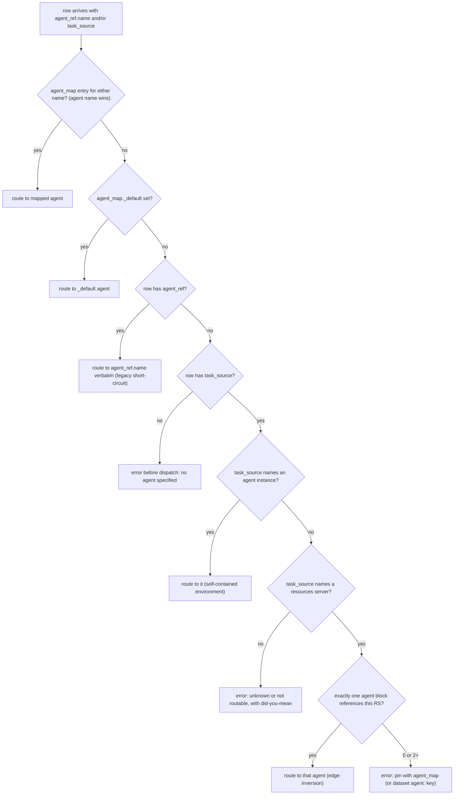
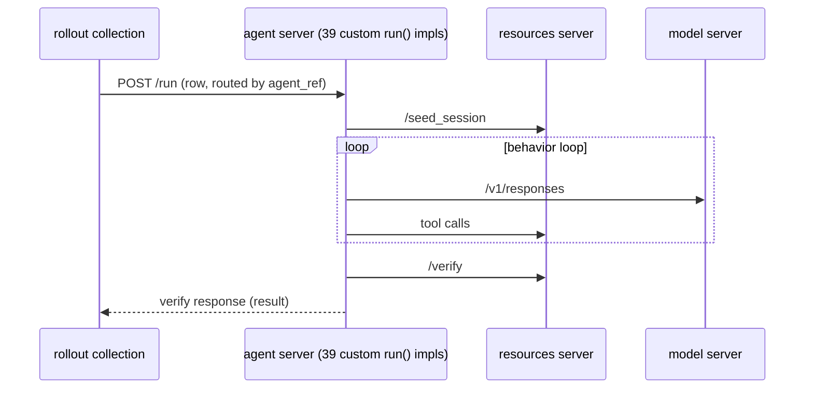
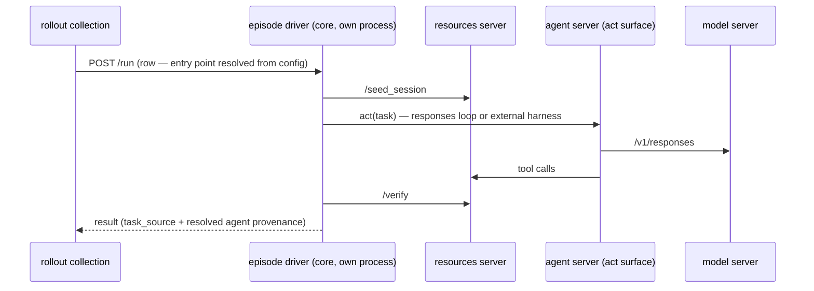
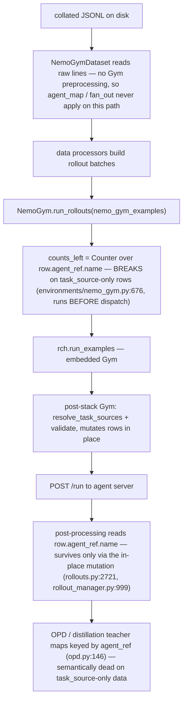

# `agent_ref` decoupling: review notes

Review of the dataset↔agent decoupling PR stack —
[#2710](https://github.com/NVIDIA-NeMo/Gym/pull/2710),
[#2713](https://github.com/NVIDIA-NeMo/Gym/pull/2713),
[#2717](https://github.com/NVIDIA-NeMo/Gym/pull/2717),
[#2724](https://github.com/NVIDIA-NeMo/Gym/pull/2724),
[#2732](https://github.com/NVIDIA-NeMo/Gym/pull/2732) —
covering the underlying problem, our earlier proof of concept, the stack's design,
ecosystem risk (verified against NeMo RL source), the backward-compatibility position for
`agent_ref`, and granular per-PR feedback.

Verdict up front: **adopt the mechanism, amend the migration posture.** The routing model is
right and well-verified. The stack's treatment of `agent_ref` as a deprecated path to be
removed is what breaks the ecosystem; five amendments (section 6) convert it into a gradual
shift at near-zero cost.

---

## 1. Problem: `agent_ref` welds datasets to serving config

Every prepared dataset row in Gym carries the name of one specific agent server instance,
stamped at data-prep time:

```json
{"responses_create_params": {"...": "..."}, "question": "...", "expected_answer": "42",
 "agent_ref": {"type": "responses_api_agents", "name": "math_with_judge_simple_agent"}}
```

The name is a **top-level key of the merged run config**. `gym dataset collate` writes it
from whichever agent config block declares the dataset; rollout collection dispatches each
row by posting `/run` to `server_name=row["agent_ref"]["name"]`. The dataset therefore
encodes a serving-infrastructure fact, with these consequences:

- **Renaming an agent in config breaks prepared data** ([#2657](https://github.com/NVIDIA-NeMo/Gym/issues/2657)).
  Experiments keep outdated agent names alive just so old rows still resolve.
- **Swapping harnesses means regenerating the dataset.** Running the same tasks under a
  different agent requires re-stamping every row
  ([#1343](https://github.com/NVIDIA-NeMo/Gym/issues/1343)).
- **Comparing N harnesses means committing N copies of the data**, differing only in the
  stamp (`genrm_compare` ×2, `jailbreak_detection` ×5).
- **Stale stamps crash mid-run**: a row naming an agent absent from the running config threw
  a raw `ConfigKeyError` after earlier rows were already dispatched (7 committed datasets
  in-repo hit this).
- **Harness blending is a `jq` recipe**: the multi-environment training tutorial literally
  pipes each source file through `jq -c '. + {"agent_ref": ...}'` and concatenates.

This is item 6 of the dataset-preparation epic
([#1338](https://github.com/NVIDIA-NeMo/Gym/issues/1338)): `agent_ref` leaks a training
infrastructure concern into the data format. The goal of "dataset hardening" is that a
dataset carries **task identity only** — which tasks, what the verifier needs — and the
agent becomes a **run-time binding**, so the same data runs under any compatible harness
("agent swappability").

## 2. Our proof of concept: runtime routing map

Branch: `ananthsub/agent-ref-routing-map` (origin, based on upstream/main `583239019`,
commit `e863fd246`). The minimal fix, zero data changes:

- Reinterpret `agent_ref.name` as an **opaque routing key**, not a live server name.
- A new reserved top-level config section remaps keys at dispatch time:

  ```yaml
  environments:
    math_with_judge: {agent: math_with_judge_simple_agent}
  ```

- Resolution: map hit → mapped agent; no entry → the key verbatim (exact legacy behavior).
  Map validated fail-fast (shape, and every target must be an agent instance in config).
- Rule applied at every call site: **route with the resolved name, group/report by the
  routing key** (`num_repeats`, progress counters, metrics stay stable across remaps).
- Provenance: results get `resolved_agent_ref` stamped **only when a remap changed the
  destination**, so unmapped runs stay byte-identical. Rows and materialized inputs are
  never mutated; a resume after a remap re-resolves against the current map.

Status: **subsumed by the upstream stack.** Their `agent_map` is the same lookup with a
different spelling and home, and the stack adds `task_source`, `fan_out`, and pre-dispatch
validation we didn't build. Retire the branch once the amended stack merges. Two ideas from
the POC survive as review asks: routing declared in served config rather than run flags
(section 7, #2724), and non-mutating provenance (section 7, #2713).

## 3. The upstream stack

### 3.1 Aims

1. **Re-route stamped datasets without regenerating them** (`agent_map`, #2710).
2. **Move routing identity from agent names to task-side identity in data**
   (`task_source` = the config instance that declared the dataset, #2713).
3. **Let the environment own its data**: datasets declared on resources-server blocks, and
   collate stamps the declaring instance, not an agent (#2717).
4. **Compare N harnesses on one dataset in one run** without duplicating data
   (`fan_out`, #2713).
5. **Pin benchmark harnesses explicitly** instead of inferring from config position (#2724).
6. **Migrate the repo**: `agent_ref` out of 748 rows across 83 committed data files, 410
   dataset declarations moved to RS blocks (#2732).

### 3.2 Mechanics: the routing decision

Per row, at run time (post-#2713):



Notes on the machinery around this decision:

- **`fan_out`** runs earlier, at preprocessing: a row whose routing basis matches a
  `fan_out` key is expanded into one copy per listed agent (copies share the task index,
  get distinct rollout indices). Fan-out targets are final — `agent_map` does not re-map
  them.
- **Resolution happens before the materialized-inputs write**, so materialized rows carry a
  resolved `agent_ref` (custom drivers like gdpval's orchestrator read it from there).
- **All routing failures surface before any request is sent**, replacing mid-run crashes
  with actionable errors.
- **Results carry both keys**: `task_source` (task-side identity) and the resolved
  `agent_ref` (which harness actually ran).

### 3.3 What collate emits

```jsonc
// before the stack — the declaring agent baked into every row:
{"responses_create_params": {"...": "..."},
 "agent_ref": {"type": "responses_api_agents", "name": "math_with_judge_simple_agent"}}

// after #2717 — the declaring instance only; NO agent_ref, and any incoming
// legacy agent_ref is stripped (with one DeprecationWarning per file):
{"responses_create_params": {"...": "..."},
 "task_source": "math_with_judge"}
```

A CI contract test pins the new format as "agent_ref is never emitted." That choice is the
crux of the compatibility problem (sections 5 and 6).

### 3.4 The stack at a glance

| PR | Layer | One line |
|---|---|---|
| #2710 | run config | `agent_map` override + `_default`; `--agent` becomes override-all; pre-dispatch agent validation |
| #2713 | resolver | `task_source` routing, RS-edge inversion, `fan_out`, resolution before materialization |
| #2717 | data prep | RS-declared datasets; collate stamps `task_source`, strips `agent_ref`; per-declaration prepare files |
| #2724 | benchmarks | explicit `agent:` pin on benchmark datasets; scaffold generates decoupled layout |
| #2732 | migration | repo-wide config + data migration; deletes alias agents; verification replay |

## 4. Fit with the episode-orchestrator direction

Context: the longer-term refactor we want is to move episode control out of the agent
servers. Today `run()` is an abstract method that ~39 agent servers each hand-roll,
interleaving seed → behavior loop → verify with harness-specific logic:



The end state is a single episode driver in core (its own process, for concurrency and
fault isolation), with the agent server reduced to an act surface:



**The stack is compatible with this — it is effectively step 1 of the path:**

- Routing authority moves into core (`resolve_task_sources`, validation, `agent_map`,
  `fan_out` all live in `RolloutCollectionHelper`), not deeper into agent servers.
- `task_source` is the environment-identity key the orchestrator needs; RS-declared
  datasets complete "the environment owns its data."
- Reverification's `_rs_for_row` already routes the verify step straight to the resources
  server via `task_source`, bypassing agent indirection — a live preview of an episode step
  owned outside the agent.
- Results become dual-keyed (task identity + harness provenance), the exact split the
  driver design needs.

**The routing target is the environment, not the agent.** By Gym's own definition an
environment is dataset + harness + verifier + state, so a multi-agent system decomposes as:

```
row → environment (task_source)
        → entry-point agent (a config binding, one name)
            → internal sub-agents (the environment's own composition — invisible to routing)
```

Per-row heterogeneity is expressed as per-row `task_source` (the stack supports this),
never as per-row agent names. This framing also exposes a structural hole in the resolver:
sub-agents of a multi-agent environment are themselves registered agent servers referencing
the same resources server, so the "route to the *unique* agent referencing this RS" rule is
ambiguous **by construction** for exactly the complex enterprise environments people worry
about — it conflates "references the RS" with "is the entry point." A declared entry-point
pin is a requirement there, not a convenience (see #2724 feedback).

Frictions to steer in review: specify the resolver as returning "the entry-point agent for
the episode" (not "the server that owns `/run`") so the dispatch target can later become
the driver without a contract break; and prefer declarative config bindings over run flags
as the long-term home for routing.

## 5. Ecosystem risk areas

### 5.1 Version-skew coupling

New collated files carry `task_source` and no `agent_ref`, so they hard-require a
resolver-capable Gym. Fleets do not upgrade atomically: the day one dataset is re-collated
with new Gym, every consumer pinned to an older Gym fails on it. The break is not on merge
day; it is at the first data boundary.

### 5.2 NeMo RL, verified against source

The stack claims (#2732): "no code changes (verified for verl and NeMo RL — both delegate
dispatch to embedded Gym)." Checked against NeMo RL `main`: **half true.** Gym is a git
submodule (`3rdparty/Gym-workspace/Gym`, pinned at `c3bac96`, 2026-08-19, pre-stack), and
dispatch is delegated — but RL hard-reads `row["agent_ref"]["name"]` in its own code, and
`task_source` appears nowhere in the RL repo.



Additional pre-dispatch read: `rollouts.py:1784` (one-agent-per-prompt-group validation).
And RL's functional tests consume dataset files **inside the Gym submodule**
(`3rdparty/Gym-workspace/Gym/data/workplace_assistant/train.jsonl`, ...) that #2732
rewrites — the submodule bump that delivers the release also delivers the breaking data to
RL's own CI.

| Scenario | Outcome |
|---|---|
| RL as pinned today + existing `agent_ref` data | Unaffected until something moves |
| RL as pinned today + newly collated data | Hard break: old embedded Gym expects `agent_ref` |
| RL bumps submodule + old external data | Runs; per-run `DeprecationWarning` in every rollout worker |
| RL bumps submodule + new-format data (incl. its own in-submodule test data) | Breaks in RL's own pre-dispatch code; RL code change required |

The needed RL-side fix is small (call `resolve_task_sources` after loading; rekey teacher
maps) but it is a real code change, on a real timeline, contradicting the "no code changes"
claim for any new-format data.

### 5.3 Other repercussions

- **The `--agent` flip changes existing automation silently.** Fill-only has been the
  behavior for about a year; the stack makes it override-all. On blended datasets the same
  command now collapses the entire mix onto one agent, guarded only by a warning no
  training pipeline reads.
- **Collate discards user data**: incoming legacy `agent_ref` is stripped from prepared
  output, and the format-contract test makes the breaking format CI-enforced from day one.
- **The contradiction**: #2732 promises old data works "indefinitely" while #2713's tests
  call `agent_ref` routing "the legacy path, slated for removal after the deprecation
  cycle" and #2732 announces the removal follow-up PR. External dataset owners will rely on
  whichever sentence we actually mean.
- **Remote-backed datasets** (130 of them) rely on strip-on-read forever — only safe if the
  legacy path is genuinely permanent.

## 6. Backward compatibility for `agent_ref`

### 6.1 Is there a runtime forward fix? (yes — in one direction, and it already exists)

There are two skew directions, and they are not symmetric:

**Old data → new Gym: fully fixable at runtime, already fixed.** The resolver's `agent_ref`
short-circuit *is* the runtime forward fix: every legacy row routes exactly as before, and
`agent_map` repairs stale names (renames, deleted aliases) without touching the data. Cost
is one dict lookup per row. Because this path is total and essentially free, there is **no
maintenance pressure to ever remove it** — deprecation would be a policy choice, not an
engineering need. This is what makes "indefinitely" cheap to promise, and it is the
position we should hold: per-row `agent_ref` remains a permanent, warning-free, first-class
override. (Rationale is compatibility and provenance, not architecture — architecturally,
per-row heterogeneity belongs to `task_source`, per section 4.)

**New data → old Gym: not fixable at runtime, by definition.** The old binary predates
`task_source`; no shim can be injected into already-pinned trainers. The only levers are on
the write side:

- **Dual-stamp at collate** during the transition: emit `task_source` *plus* an `agent_ref`
  resolved from the declaration. Dual-stamped files run on every Gym version pairing —
  old Gym reads `agent_ref`, new Gym prefers it and carries `task_source` forward — and
  NeMo RL then genuinely needs no code change on any timeline.
- **`gym dataset migrate`**, committed and bidirectional: strip/stamp for the new format,
  or re-stamp `agent_ref` from config for consumers pinned to old Gym. (#2732's one-shot
  uncommitted script is exactly this tool; it should ship.)

So: legacy path kept indefinitely (runtime fix, free), dual-stamp for the overlap window
(write-time fix for the direction runtime cannot reach), migration tool for everything
else.

### 6.2 The three-format transition

| Format | Contents | Runs on old Gym | Runs on new Gym | Role |
|---|---|---|---|---|
| Legacy | `agent_ref` only | yes | yes (short-circuit, no warning) | all existing data, forever |
| Dual | `task_source` + resolved `agent_ref` | yes | yes | collate default for ≥ 2 release cycles |
| Decoupled | `task_source` only | **no** | yes | end state, after trainer overlap |

### 6.3 Landing order

1. #2710 with the `--agent` hard-error variant (error when it would override differing
   stamped values; `+agent_map={_default: X}` as the explicit spelling).
2. #2713 without the per-run `DeprecationWarning`.
3. #2717 with dual-stamp as the collate default (fast-track its per-declaration prepare
   files fix regardless — it repairs a real silent-corruption bug).
4. #2724 with the `agent:` pin generalized to all dataset declarations.
5. #2732 split: the config-file moves can land early (the resolver honors both declaration
   homes); hold the data-file rewrites until dual-stamp has shipped in at least one trainer
   release cycle.
6. Replace the removal follow-up with "flip collate's default to task_source-only." Per-row
   `agent_ref` routing is never removed.

## 7. Per-PR feedback

### #2710 — `agent_map` override + pre-dispatch validation

Solid:
- Precedence order pinned by contract tests; the #761 silent-semantics-flip failure mode
  cannot recur unnoticed.
- Pre-dispatch agent validation with did-you-mean replaces mid-run `ConfigKeyError` after
  partial output.
- `_default` is a clean spelling for "route everything here."

Issues:
- The `--agent` semantic flip (fill-only → override-all) ships silently under a
  UserWarning. Split it out of the PR, or hard-error when stamped values would be
  overridden. Flag-semantics changes under automation are the classic
  silent-training-corruption vector.
- `_validate_agent_names` accepts **any** top-level config key as routable; the
  agent-blocks-only fix arrives only in #2713. Fold it down so the base of the stack does
  not ship a validator that accepts a resources server as a route.

### #2713 — `task_source` resolution + fan-out

Solid:
- Resolution before the materialized write keeps custom drivers (gdpval) working unchanged.
- All routing failures surface before any dispatch, with actionable messages naming the
  disambiguator.
- Results carry both `task_source` and the resolved `agent_ref` — the right dual keying.
- `fan_out` at run preprocessing keeps per-agent copies out of on-disk data; composes with
  per-target `num_repeats`.

Issues:
- Per-run `DeprecationWarning` on legacy rows contradicts the "indefinitely" promise and
  fires inside trainer workers (see 6.1: drop it).
- `resolve_task_sources` mutates the caller's row dicts in place; NeMo RL's post-loop reads
  survive only via that aliasing. Either document the mutation as contract or stop relying
  on it.
- `resume_from_cache` after an `agent_map` change is unpinned: materialized rows are
  already stamped with the previous resolution — does the retry re-route? Either answer is
  defensible; untested it is a silent-routing footgun.
- RS-edge inversion conflates "references the RS" with "is the entry point" — ambiguous by
  construction for multi-agent environments whose sub-agents are registered agent servers
  on the same RS (section 4). Requires the generalized pin from #2724.
- `fan_out` targets are exempt from `agent_map` — documented, but a precedence wart worth a
  worked example in docs.
- Dict-form `num_repeats` keys on "whatever name the row carries": existing configs keyed
  by agent names miss on `task_source` data. It hard-errors (good), but the message should
  name the format shift.
- `agent_map`/`fan_out` live in preprocessing, so consumers that call `run_examples`
  directly (NeMo RL) never get them. The stack's headline capability does not reach the
  largest trainer without RL-side adoption — worth stating in the PR body.

### #2717 — collate stamps `task_source`; RS-declared datasets

Solid:
- Per-declaration prepare files (`*_prepare.{instance}.jsonl`) fix a real
  silent-corruption bug (the second declarer of a shared file truncated the first's
  output). Worth fast-tracking independently of the format change.
- Datasets on resources-server blocks match "the environment owns its data";
  model-server datasets hard-error.
- The resources-only reverify fallback now warns loudly instead of silently absorbing stale
  agent names.

Issues:
- Collate strips `agent_ref` and the format-contract test pins "never emitted" — the
  breaking format becomes CI-enforced from day one. Pin the dual-stamp transition format
  instead (6.2), flip later.
- Stripping incoming legacy `agent_ref` discards information the user put in their data,
  guarded only by a warning.

### #2724 — benchmark agent pin + decoupled scaffold

Solid:
- Explicit `agent:` pin beats positional inference; a benchmark's score depends on the
  harness and the manifest now says so.
- The ambiguous-topology case (bigcodebench: two agents on one RS via merge order) becomes
  a hard error instead of an accident.

Issues:
- The pin is benchmark-only. Generalize it to every dataset declaration: it is the
  declarative environment→entry-point binding that complex/multi-agent environments
  *require* (section 4) and the bridge to episode-orchestrator config.
- The resolution logic is duplicated in `benchmarks.py` and `cli/eval.py` — extract one
  helper before a third copy appears.

### #2732 — repo-wide migration

Solid:
- Verification methodology is exemplary: content-hash proofs with label fields excluded,
  strict duplicate-key parse sweep, full-repo routing replay, live rollouts across all six
  routing patterns.
- Run artifacts deliberately untouched — provenance preserved.

Issues:
- "Keep working, indefinitely" vs. the announced legacy-path removal follow-up: resolve the
  contradiction in writing; it is the sentence external dataset owners will rely on.
- The migration script is one-shot and uncommitted. Ship it as `gym dataset migrate`,
  bidirectional (6.1).
- Migrating the in-repo data files breaks NeMo RL's CI on the next submodule bump — RL's
  functional tests read those files (5.2).
- The safe config-file moves and the unsafe-until-overlap data-file rewrites are bundled in
  one 400-file PR. Split them (6.3).

---

*Review basis: PR bodies and full diffs of #2710/#2713/#2717/#2724, #2732's verification
claims, NeMo RL `main` (submodule pin, dispatch path, every `agent_ref` read site), and the
`ananthsub/agent-ref-routing-map` prototype. File:line references are to the PR head
branches and NeMo RL `main` as of 2026-08-24.*
