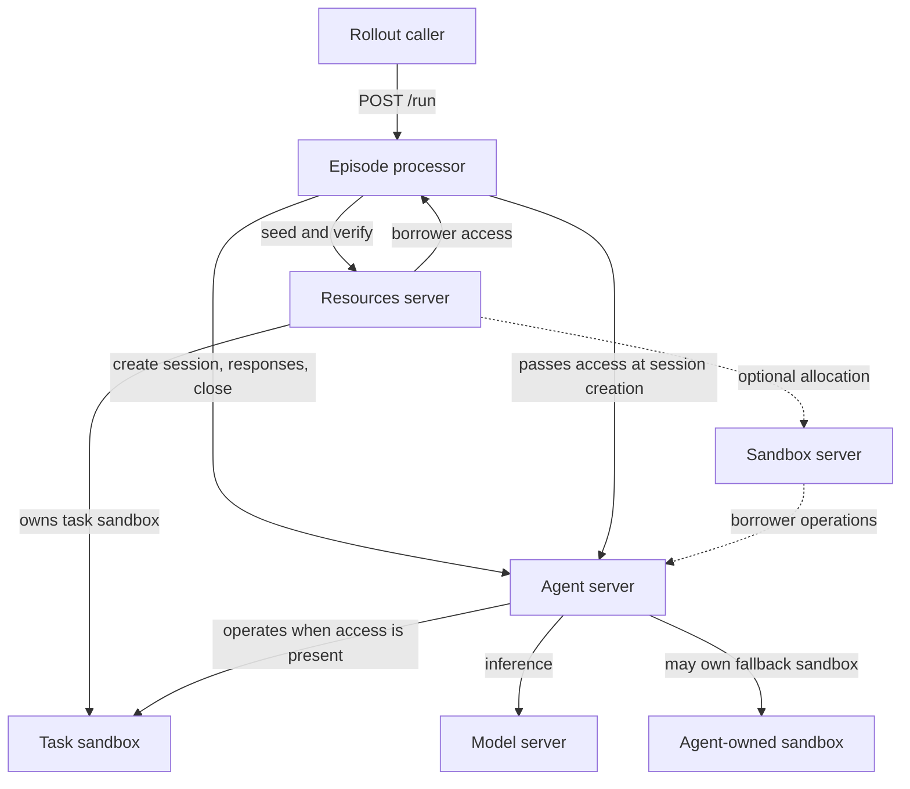
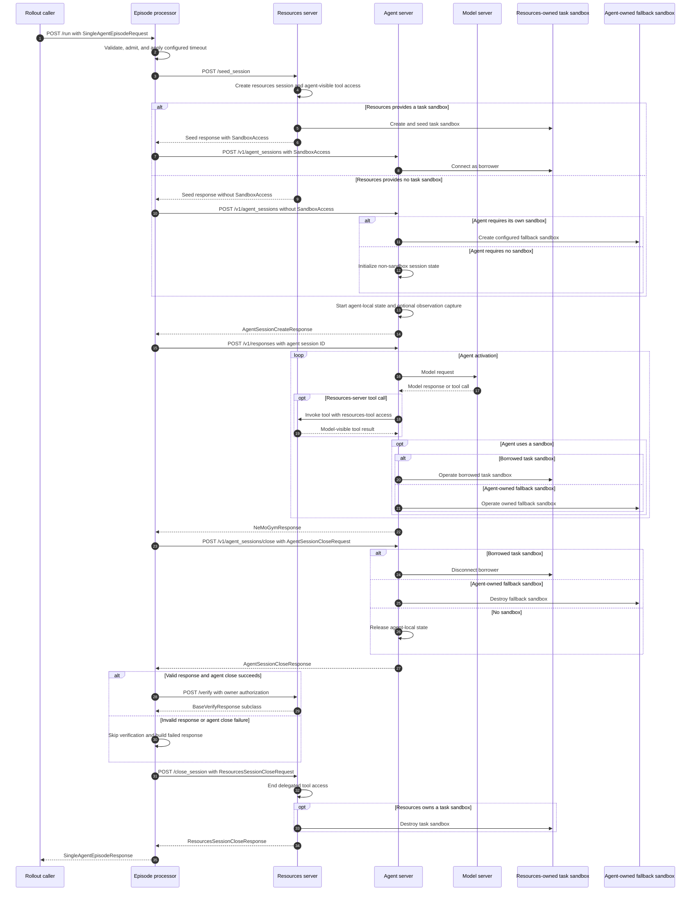
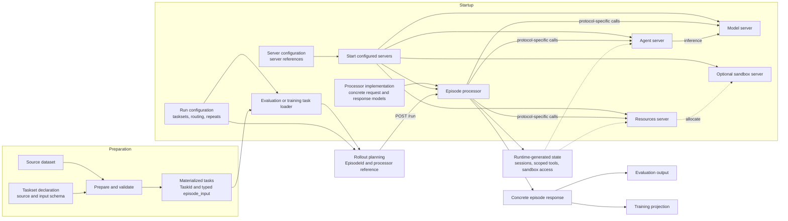

# Episode Architecture for NeMo Gym

## Problem summary

Today, rollout collection sends `POST /run` to an agent server. That method commonly seeds resources-server state, runs the agent, asks the resources server to verify the result, and performs cleanup.

This creates several problems:

- Episode orchestration is embedded in each agent server's `/run`: resources-session setup, agent invocation, verification, and cleanup.
- Gym has no framework-owned intervention point for this sequence, so changing the episode protocol requires changing agent-server code.
- Shared behavior such as sandbox setup, resources access, timeouts, cancellation, cookies, and cleanup is implemented repeatedly and inconsistently across agent servers.
- Agent and resources-server code can both believe they own the same sandbox.
- A bare sandbox ID does not describe how another server connects, where commands run, or which operations are allowed.

The proposed architecture moves episode-level ordering into an episode processor. A processor may compose Gym servers or run a self-contained external framework whose components do not fit Gym's agent-server and resources-server boundaries.

An agent's `/v1/responses` implementation remains responsible for agent behavior, including calls to resources-server tools. The episode processor owns the surrounding episode sequence.

## Scope

### Requirements

- **Episode processor**
  - Exposes `/run` and owns the episode protocol and processor-defined final result.
  - Defines a concrete request and response derived from the base episode contracts.
  - Composes agent and resources servers when those boundaries fit, or implements a self-contained external protocol.
  - Applies configured timeouts and cancellation and coordinates cleanup on every handled exit path.
  - Asks participating servers to clean up the state they own. A self-contained processor cleans up state created within its own protocol.
  - Preserves existing Gym dataset, evaluation, and NeMo RL interfaces during migration.
  - Uses Gym's configuration, startup, addressing, readiness, and telemetry mechanisms.
- **Agent server**
  - Owns agent behavior, dependencies, sessions, and objects it creates.
  - Continues to expose `POST /v1/responses`.
  - Can operate a resources-server-owned task sandbox without authority to destroy it.
  - Can provision and clean up its own sandbox when no task sandbox is supplied.
- **Resources server**
  - Owns task setup, stateful tools, verification, and benchmark-specific cleanup.
  - May create a task sandbox and grant the agent restricted access.
  - Validates its benchmark-specific verification result and returns it to the processor.
  - Retains ownership of its state and task sandbox through verification and cleanup.

### Episode, rollout, task, and session

- A **task** is dataset content identified by `TaskId`.
- A **rollout** is one logical sample produced for that task.
- An **attempt** is one physical execution of a rollout. A retry increments the attempt.
- An **episode** is the complete lifecycle for one attempt, including all interaction turns, verification, and cleanup.
- A **resources session** is resources-server state created when a processor uses a resources server.
- An **agent session** is agent-server-local state created when a processor delegates behavior to an agent server.

`POST /v1/responses` is an agent invocation, not the definition of an interaction turn. A processor may use one or more agent invocations during a turn, and each invocation may contain multiple model and tool calls.

An episode produces one concrete processor response. Evaluation and training adapters may project zero, one, or multiple invocation trajectories from it. The initial single-agent protocol projects one agent response; a multi-participant processor preserves role attribution for every invocation.

## Components and ownership

### Responsibilities

- **Resources server:** When used, owns task setup, benchmark state, tools, verification, and every sandbox or service it creates.
- **Episode processor:** Owns `/run`, protocol ordering, timeout enforcement, and assembly of its concrete response. A resources-backed processor asks participating servers to clean up their own state; a self-contained processor cleans up the state it creates.
- **Agent server:** When used, owns the agent implementation, its dependencies, its agent session, local subprocesses, and any fallback sandbox it creates.
- **Model server:** Exposes Gym's model API and proxies inference requests to the configured inference endpoint.
- **Sandbox server:** Optionally holds sandbox-provider state that cannot be reconstructed in another process.




The diagram shows the resources-backed single-agent deployment. A concrete processor may use a different subset of servers.

In the resources-backed deployment, ownership does not move with access:

- The resources server stops a task sandbox it created.
- An agent session disconnects from borrowed sandbox access.
- An agent server stops a fallback sandbox it created.
- The processor transports sandbox access between these servers but does not use it.

### Protocol, behavior, and hosting

- The **episode protocol** defines processing order, verification timing, and cleanup. `SingleAgentEpisodeProcessor` is the initial implementation.
- **Agent behavior** defines how one `/v1/responses` request produces one `NeMoGymResponse`.
- **Agent hosting** provides the process, virtual environment, configuration, and scaling boundary for that behavior.

Participant count, invocation ordering, and invocation attribution belong to the concrete processor. A model or agent invocation does not automatically become the episode's primary result.

Changing OpenCode to Terminus-2 changes agent behavior. Adding a simulated user changes the episode protocol. Moving an agent to another image changes hosting. Integrating a self-contained external framework may place its protocol-specific components directly in a processor.

### Server types

The architecture adds a fourth server type and an optional fifth:

```text
BaseServerTypeConfig
├── ResponsesAPIModelServerTypeConfig
├── ResourcesServerTypeConfig
├── ResponsesAPIAgentServerTypeConfig
├── EpisodeProcessorServerTypeConfig
└── SandboxServerTypeConfig
```

The matching references are:

```python
class EpisodeProcessorRef(BaseModel):
    type: Literal["episode_processors"]
    name: str


class SandboxServerRef(BaseModel):
    type: Literal["sandbox_servers"]
    name: str
```

`EpisodeProcessorRef` and `SandboxServerRef` join `AgentServerRef`, `ResourcesServerRef`, and `ModelServerRef` in Gym's reference validation and `ServerClient` addressing.

## Base episode contracts and concrete protocols

### Resources-backed single-agent flow

The rollout caller sends one request to the episode processor and receives one final result. The concrete processor decides which servers participate and owns the resulting protocol.

`SingleAgentEpisodeProcessor` uses the resources-backed flow below. The resources server prepares the task first. Seed creates a resources session and may return agent-visible tool access and `SandboxAccess`. The processor retains the resources session for verification and cleanup. The resources server remains the owner of its session state and task sandbox.

This processor creates an agent session before invoking the Responses API. `AgentSessionCreateRequest` contains the immutable episode ID, resources-tool access, and optional `SandboxAccess`. Sandbox selection happens while the agent server creates that session:

- When resources supplied `SandboxAccess`, the agent session connects to that sandbox as a borrower.
- When resources supplied no sandbox access and the agent requires a sandbox, the agent session creates its configured fallback sandbox.
- When the agent requires no sandbox, the agent session configures resources tools and initializes any agent-local session state.

The processor closes its agent session before asking the resources server to verify. The resources server then verifies the response and any state it owns. Finally, the processor closes the resources session, and each server destroys only the objects it owns.




### Self-contained processor

A processor does not have to use a resources server or agent server. It may validate its concrete episode input, run an external framework, call model servers, produce its concrete episode result, and clean up its own state entirely inside `process()`.

This path is appropriate when the external framework's state, participants, tools, and verifier form one protocol that does not map cleanly onto Gym's existing server boundaries. The processor deployment supplies that framework's dependency and isolation boundary. It can later delegate individual responsibilities to Gym servers without changing its concrete `/run` contract or the base identity contract.

### Tasksets and materialized episode input

A taskset is a declaration plus its prepared task rows. The declaration identifies the source, preparation logic, and input schema. Preparation produces the rows and revision. The declaration is consumed when an evaluation or training run loads tasks; it is not a server and is not sent with each episode.

The [Gym Tasks RFC](https://rfc.frontier-evals.nvidia.com/m/frontier-eval-rfcs/r/gym-tasks) must provide each materialized task as:

```python
TaskInputT = TypeVar("TaskInputT", bound=BaseModel)


class MaterializedTask(BaseModel, Generic[TaskInputT]):
    task_id: TaskId
    episode_input: TaskInputT
```

`TaskId` identifies the taskset, task, and taskset revision. `episode_input` is typed by the taskset. Gym does not require every taskset to contain one `responses_create_params`, one resources-server payload, or one agent payload.

The task layer owns source preparation, provenance, ID generation, collation, and validation of `episode_input`. Run configuration selects tasksets and maps them to compatible episode processors. Rollout planning adds `EpisodeId`, repetition, grouping, and processor routing. It does not modify `episode_input`.

Before planning any episode, Gym validates that every selected processor accepts the taskset's input schema. Fan-out requires every target to accept that same input unless the run explicitly configures an adapter. Compatibility translation converts current flat rows into typed materialized tasks until native tasksets are available.



For evaluation, Gym loads the selected tasksets and plans episodes over their materialized tasks. For training, the training data loader samples the same materialized tasks and sends planned episodes through the same processor `/run` contract. The taskset declaration is used to find and validate those tasks at startup; only `TaskId` and the concrete episode input travel per episode.

Server configuration and run configuration have separate jobs. Server configuration starts processors and the agent, resources, model, and sandbox servers they reference. Run configuration selects tasksets and connects each taskset to a logical processor deployment. The rollout planner is where loaded task data and the selected processor first meet.

Values that describe one task belong in `episode_input`. Processor routing, fan-out, repetition, model bindings, concurrency, and run-wide timeouts belong in run or server configuration. `EpisodeId`, session IDs, scoped tool access, sandbox access, and replica selection are generated at runtime.

The episode foundation depends only on this materialized-task interface. Task preparation commands, manifests, provenance storage, and asset fetching remain in the Tasks RFC.

### Identity

```python
class EpisodeId(BaseModel):
    model_config = ConfigDict(extra="forbid", frozen=True)

    rollout_id: str
    attempt: NonNegativeInt = 0
    group_id: str | None = None
    member_index: NonNegativeInt | None = None
    group_size: PositiveInt | None = None

    @model_validator(mode="after")
    def validate_group(self) -> Self:
        group_fields = (
            self.group_id,
            self.member_index,
            self.group_size,
        )
        if any(value is not None for value in group_fields):
            if any(value is None for value in group_fields):
                raise ValueError("group fields must be supplied together")
            if self.member_index >= self.group_size:
                raise ValueError("member_index must be less than group_size")
        return self
```

`EpisodeId` is the immutable correlation model carried through processor, resources-server, agent-server, model-call, observation, and logging paths.

- `rollout_id` remains stable when a failed rollout is retried.
- `attempt` identifies the physical retry.
- The three group fields are present only when the episode belongs to a group.
- `group_id`, `member_index`, and `group_size` remain stable when `attempt` increments.

`TaskId` belongs to the Tasks RFC and remains separate because it identifies dataset content rather than an execution.

Current Gym constructs rollout correlation from `_ng_task_index`, `_ng_rollout_index`, and optional `_ng_attempt_index`. Compatibility translation uses the task and rollout indices for the stable `rollout_id` and keeps `_ng_attempt_index` in `attempt`.

### Request and response

Every processor derives its concrete request and response from minimal base contracts. The base models provide identity, typed episode input, and handled-failure transport. They do not prescribe a participant count, Responses API invocation, resources server, verifier, or trajectory shape.

```python
type JsonValue = (
    None
    | bool
    | int
    | float
    | str
    | list["JsonValue"]
    | dict[str, "JsonValue"]
)


EpisodeInputT = TypeVar("EpisodeInputT", bound=BaseModel)
EpisodeResultT = TypeVar("EpisodeResultT", bound=BaseModel)


class BaseEpisodeRequest(BaseModel, Generic[EpisodeInputT]):
    model_config = ConfigDict(extra="forbid")

    episode_id: EpisodeId
    task_id: TaskId
    episode_input: EpisodeInputT


class EpisodeFailure(BaseModel):
    model_config = ConfigDict(extra="forbid")

    kind: Literal[
        "invalid_request",
        "unavailable",
        "timeout",
        "dependency",
        "processor",
        "internal",
    ]
    message: str
    retryable: bool


class BaseEpisodeResponse(BaseModel, Generic[EpisodeResultT]):
    model_config = ConfigDict(extra="forbid")

    episode_id: EpisodeId
    task_id: TaskId
    result: EpisodeResultT | None = None
    failure: EpisodeFailure | None = None

    @model_validator(mode="after")
    def validate_result(self) -> Self:
        if (self.result is None) == (self.failure is None):
            raise ValueError("exactly one of result or failure is required")
        return self


class SingleAgentEpisodeInput(BaseModel):
    model_config = ConfigDict(extra="forbid")

    responses_create_params: NeMoGymResponseCreateParamsNonStreaming
    task_data: dict[str, JsonValue]


class SingleAgentEpisodeResult(BaseModel):
    model_config = ConfigDict(extra="forbid")

    verification: BaseVerifyResponse
    agent_observations: AgentObservationBundle | None = None


class SingleAgentEpisodeFailure(EpisodeFailure):
    stage: Literal["seed", "agent", "verification", "cleanup"] | None = None
    partial_response: NeMoGymResponse | None = None


class SingleAgentEpisodeRequest(
    BaseEpisodeRequest[SingleAgentEpisodeInput],
):
    pass


class SingleAgentEpisodeResponse(
    BaseEpisodeResponse[SingleAgentEpisodeResult],
):
    failure: SingleAgentEpisodeFailure | None = None
```

Validation enforces:

- Every concrete request retains the base `episode_id`, `task_id`, and typed `episode_input`.
- Exactly one of `result` or `failure` is present.
- `SingleAgentEpisodeResult.verification` retains the inherited `responses_create_params`, `response`, `reward`, and every additional field validated by the resources server.
- The single-agent processor validates the common `BaseVerifyResponse` fields without discarding those additional fields.
- Concrete subclasses may define `reward_components`, `mask_sample`, and other benchmark-specific fields. When present, `mask_sample` may be true when the verifier accepts a result affected by partial infrastructure failure.
- A failed single-agent episode may retain a valid agent response in `failure.partial_response`; that field is not part of the base failure contract.
- The response `episode_id` and `task_id` match the request.
- The concrete processor validates its result, including finite rewards where applicable.
- Failure messages are bounded and contain no credentials or internal paths.

NeMo-Sim demonstrates the extension:

```python
class NeMoSimEpisodeInput(BaseModel):
    model_config = ConfigDict(extra="forbid")

    scenario: NeMoSimScenario
    model_responses_create_params: dict[
        str,
        NeMoGymResponseCreateParamsNonStreaming,
    ] = Field(default_factory=dict)
    simulation_config: dict[str, Any] = Field(default_factory=dict)


class NeMoSimInvocation(BaseModel):
    model_config = ConfigDict(extra="forbid")

    alias: str
    executor: Literal["agent", "model"]
    call_index: int
    request: dict[str, Any]
    response: dict[str, Any]
    ng_trajectory: dict[str, Any] | None = None


class NeMoSimEpisodeResult(BaseModel):
    model_config = ConfigDict(extra="forbid")

    reward: float
    nemo_sim_result: dict[str, Any]
    invocations: list[NeMoSimInvocation]
    episode_interaction_protocol: str = "nemo_sim.ConversationLoop"


class NeMoSimEpisodeRequest(
    BaseEpisodeRequest[NeMoSimEpisodeInput],
):
    pass


class NeMoSimEpisodeResponse(
    BaseEpisodeResponse[NeMoSimEpisodeResult],
):
    pass
```

The base episode contract does not interpret NeMo-Sim's fields or require one primary `NeMoGymResponse`. A compatibility adapter converts between `NeMoSimRunRequest` and `NeMoSimProcessorResponse` and the native episode models until callers use the native contracts.

### Grouped episodes

The rollout planner assigns group fields before dispatch. The episode processor does not infer groups from arrival order or prompt content.

- `group_id` identifies one planned group.
- `member_index` gives each member a stable position.
- `group_size` states how many members must arrive.
- A retry keeps the same group fields and increments `attempt`.
- The processor-defined result or delegated verifier owns group-specific state.

Worker-local dictionaries cannot coordinate a group spread across replicas. A grouped verifier therefore requires shared state or routing that keeps every member with the same verifier owner.

## From dataset to `/run`

Users do not add agent-session or processor-routing fields to datasets.

The flow is:

1. Run configuration selects one or more tasksets.
2. The task layer loads materialized tasks containing `TaskId` and typed `episode_input`.
3. Run configuration resolves each taskset to one or more `EpisodeProcessorRef` values.
4. Fan-out, repetition, and grouping produce planned episodes. Rollout materialization assigns `EpisodeId` to each one.
5. Compatibility translation converts a legacy flat row into the concrete input expected by its migrated processor.
6. The runtime selects a replica for each logical processor and sends its concrete `BaseEpisodeRequest` subtype to `POST /run`.
7. The processor validates the complete request with its registered concrete request model before performing network calls.
8. The processor runs its protocol and returns its concrete `BaseEpisodeResponse` subtype.
9. The collector decodes and persists the registered concrete response type. Its processor-specific projector produces evaluation or training records.
10. The compatibility layer restores existing request and result shapes where required.

For `SingleAgentEpisodeProcessor`, the concrete input contains `responses_create_params` and `task_data`. The processor passes both to resources seed, passes only `responses_create_params` to the agent's `/v1/responses`, and returns verification plus optional agent observations.

For NeMo-Sim, the concrete input contains `scenario`, role-keyed `model_responses_create_params`, and task-specific `simulation_config`. The processor returns the simulation result and attributed invocation list. No single-agent fields are added to the base contract.

### Processor selection and dispatch

Processor routing is run configuration, not durable task data. Native dataset rows do not contain `agent_ref` or `EpisodeProcessorRef`, and the base episode request contains neither.

Native rollout configuration supports:

```yaml
episode_processor: reasoning_gym_simple
processor_map:
  swebench_verified: swebench_opencode
  tau2: tau2_processor
fan_out:
  reasoning_gym:
    - reasoning_gym_simple
    - reasoning_gym_opencode
```

- `episode_processor` is the default for tasksets without a more specific rule.
- `processor_map` maps a taskset to one processor.
- `fan_out` maps a taskset to several processors and creates one planned episode per target.
- A taskset named in both `processor_map` and `fan_out` is invalid.
- Without a matching rule or default processor, routing fails before dispatch.

Every processor deployment registers its concrete request and response models. Every resolved target must accept the taskset's episode-input schema. Run materialization records the selected `EpisodeProcessorRef` and response-schema identity alongside the concrete request so resume, decoding, logging, and dispatch use the same decision. This routing metadata is not inserted into the request or `episode_input`.

Replica selection happens after processor selection. Local Gym may have one replica. A sharded NeMo RL run discovers which processor deployments each Gym shard hosts, builds a processor-to-shard map, and distributes complete rollout groups across that shard's replicas. The selected replica is transport state and does not appear in the episode request.

During migration, legacy routing remains available:

1. Current `task_source`, `agent_map`, `fan_out`, `agent_name`, and row-level `agent_ref` behavior resolves a legacy deployment name.
2. An unmigrated name resolves to the existing agent-server `/run`.
3. A migrated name resolves to a compatibility episode-processor `/run` with the same external name. Its internal behavior agent uses a different server name.

`agent_ref` is compatibility input, not a requirement for native tasks. Configuration validation rejects ambiguous legacy names. Neither native nor legacy task payloads can select a concrete replica.

## Resources-server session for the single-agent flow

These contracts belong to `SingleAgentEpisodeProcessor`. Another processor may define a different resources-server protocol or use no resources server.

### Seed and access

The resources server creates its episode state during seed. The processor does not open an empty remote session before calling seed.

```python
class SingleAgentSeedRequest(BaseModel):
    model_config = ConfigDict(extra="forbid")

    episode_id: EpisodeId
    task_id: TaskId
    responses_create_params: NeMoGymResponseCreateParamsNonStreaming
    task_data: dict[str, JsonValue]


class SWEBenchSeedRequest(SingleAgentSeedRequest):
    task_data: SWEBenchTaskData


class MCPServerMetadata(BaseModel):
    server_name: str
    url_path: str = "/mcp"
    transport: Literal["http"] = "http"
    headers: dict[str, str]


class SingleAgentSeedResponse(BaseModel):
    model_config = ConfigDict(extra="forbid")

    resources_session_id: str
    resources_tools: MCPServerMetadata | None = None
    sandbox_access: SandboxAccess | None = None
```

`SingleAgentSeedRequest` validates the single-agent envelope. Each resources server binds `/seed_session` to a concrete subclass that narrows `task_data` to its benchmark-specific Pydantic model, as illustrated by `SWEBenchSeedRequest`. FastAPI performs that validation before `seed_session()` runs. The processor posts the same JSON without importing or interpreting the benchmark model.

The processor retains the resources-server reference, session ID, and private transport state established by seed. It uses that state for verification and cleanup. It passes only agent-visible tool access and optional sandbox access to the agent server.

### Tools

Tool schemas may already appear in `responses_create_params.tools`. A resources server may also return `MCPServerMetadata` for tools exposed from the seeded session.

The processor passes that metadata during agent-session creation. The agent server configures the agent implementation before activation:

- clients that support per-server HTTP headers receive the MCP endpoint and scoped headers;
- a header-incapable black-box agent requires an agent-server-owned proxy that adds the scoped headers;
- an agent integration that supports neither path rejects the session.

The processor does not proxy individual tool calls. The resources server authorizes each call against the seeded session and returns the model-visible result. Tool credentials are never placed in model input or episode output.

### Verification and cleanup

```python
class SingleAgentVerifyRequest(BaseModel):
    model_config = ConfigDict(extra="forbid")

    episode_id: EpisodeId
    responses_create_params: NeMoGymResponseCreateParamsNonStreaming
    response: NeMoGymResponse


class ResourcesSessionCloseRequest(BaseModel):
    model_config = ConfigDict(extra="forbid")

    resources_session_id: str


class ResourcesSessionCloseResponse(BaseModel):
    model_config = ConfigDict(extra="forbid")

    resources_session_id: str
```

The processor uses three resources-server operations:

- `POST /seed_session`: validates `task_data`, creates resources-server state, and returns `SingleAgentSeedResponse`.
- `POST /verify`: accepts `SingleAgentVerifyRequest` in the resources session established by seed and returns the resources server's concrete `BaseVerifyResponse` subclass.
- `POST /close_session`: accepts `ResourcesSessionCloseRequest`, releases resources-server state, and returns `ResourcesSessionCloseResponse`.

The close request identifies the resources session. Session authorization remains in HTTP metadata established during seed.

The resources server validates its concrete `BaseVerifyResponse` subclass before returning it. The processor validates the common fields and preserves all additional fields without interpreting them.

`/seed_session` and `/verify` preserve current Gym route names. `/close_session` is a new required lifecycle endpoint.

Cleanup is safe to retry while the owning worker remains alive. Resources-server-owned external objects use bounded TTLs. The initial design does not provide exactly-once execution or recovery across worker restart.

## Sandbox access

```python
class DirectSandboxConnection(BaseModel):
    model_config = ConfigDict(extra="forbid")

    kind: Literal["direct"]
    sandbox_provider: str
    descriptor: dict[str, JsonValue]


class SandboxServerConnection(BaseModel):
    model_config = ConfigDict(extra="forbid")

    kind: Literal["sandbox_server"]
    sandbox_ref: SandboxRef


class SandboxAccess(BaseModel):
    model_config = ConfigDict(extra="forbid")

    connection: Annotated[
        DirectSandboxConnection | SandboxServerConnection,
        Field(discriminator="kind"),
    ]
    workdir: str
```

`SandboxAccess` is a serializable reference that lets an agent server connect to a resources-server-owned task sandbox. The connection discriminator tells the agent whether to reconnect through a provider or a sandbox server. `workdir` identifies where agent commands run.

The agent receives a borrower interface for command execution and file transfer within the task workdir. The resources server retains the owner authority used to stop the sandbox after verification.

Borrower restrictions require enforcement by the provider or sandbox server. A Python facade alone prevents accidental misuse but is not an authorization boundary.

For direct access, `sandbox_provider` names an existing top-level Gym sandbox-provider block such as `sandbox`. The resources server creates and serializes the sandbox with that named configuration. The agent server resolves the same name through `server_client.global_config_dict`, constructs the provider, and calls `connect(descriptor)`. No borrowed-sandbox provider setting is added to agent configuration.

Direct handoff requires a named provider configuration because an inline provider mapping may contain credentials and has no stable reference. The agent-server environment must have the provider implementation installed; otherwise agent-session creation fails before inference. Agent-session close disconnects the borrowed provider client without calling the owner operation that destroys the physical sandbox.

### Seed behavior

- When `SingleAgentSeedResponse.sandbox_access` is present, the resources server requires the agent to operate that task sandbox.
- When it is absent, the agent follows its own configuration.
- Absence does not mean the resources server failed to provision a required sandbox. That failure makes seed fail.
- The resources server may create other private sandboxes for tools or verification without exposing them.

The processor passes `SandboxAccess` unchanged during agent-session creation.

### Optional sandbox server

Direct handoff is valid when the provider can serialize and reconnect its sandbox across processes. Its access restrictions are limited to what that provider enforces; the agent server must expose only borrower operations and disconnect without destroying the sandbox.

Providers that cannot reconnect directly, or deployments that require server-enforced borrower authorization, use a sandbox server such as the server proposed in [PR #2085](https://github.com/NVIDIA-NeMo/Gym/pull/2085). `SandboxServerConnection.sandbox_ref` carries that server's sandbox ID, operate lease, endpoint, and workdir. Exact lease, revocation, and provider configuration remain part of the sandbox-server design.

## Agent-server session

This section applies to processors that delegate agent behavior to an agent server.

### Why a session is required

The `/v1/responses` request body remains unchanged:

```text
POST /v1/responses

NeMoGymResponseCreateParamsNonStreaming
    -> NeMoGymResponse
```

The agent still needs episode-scoped state that is not part of the Responses API:

- immutable `EpisodeId`
- resources-tool access
- optional borrowed sandbox access
- agent-local subprocess or fallback-sandbox handles
- optional `AgentObservationBundle` capture state
- owned-object cleanup

The single-agent processor creates that state before calling `/v1/responses` and closes it afterward.

A user-simulation processor can create assistant and simulated-user sessions once, call `/v1/responses` repeatedly according to the interaction protocol, attribute each request and response to its role and invocation index, and close both sessions before verification. The processor owns role visibility, ordering, termination, and its concrete result. A separate turn endpoint is unnecessary unless a protocol cannot express an activation through the Responses API.

### Data models

```python
class AgentSessionCreateRequest(BaseModel):
    model_config = ConfigDict(extra="forbid")

    episode_id: EpisodeId
    resources_tools: MCPServerMetadata | None = None
    sandbox_access: SandboxAccess | None = None


class AgentSessionCreateResponse(BaseModel):
    model_config = ConfigDict(extra="forbid")

    agent_session_id: str


class AgentSessionCloseRequest(BaseModel):
    model_config = ConfigDict(extra="forbid")

    agent_session_id: str


class AgentSessionCloseResponse(BaseModel):
    model_config = ConfigDict(extra="forbid")

    agent_session_id: str
    agent_observations: AgentObservationBundle | None = None
```

`agent_observations` contains optional agent-server observability records collected during the session. It is not task or environment state.

### `POST /v1/agent_sessions`

The processor sends `AgentSessionCreateRequest` to the configured `AgentServerRef`.

The agent server:

1. Validates the episode, tool access, and sandbox access.
2. Configures resources tools and either connects the borrowed sandbox or creates its configured fallback sandbox.
3. Starts agent-local state and, when supported, observation capture correlated with `EpisodeId`.
4. Registers cleanup for objects it owns and returns `AgentSessionCreateResponse`.

If setup fails, the agent server releases anything it already acquired and returns no usable session.

### `POST /v1/responses`

The processor sends the ordinary Responses body with:

```text
X-NeMo-Gym-Agent-Session-Id: <agent_session_id>
```

The processor does not send its episode request or a legacy `BaseRunRequest` to the agent server. Task content visible to the agent belongs in the Responses body. Episode-scoped tool and sandbox setup belongs in `AgentSessionCreateRequest`. Static harness behavior belongs in agent-server configuration.

The agent server:

- rejects a missing, expired, closed, or mismatched session
- places the session's immutable `EpisodeId` in Gym's request-scoped correlation context
- exposes `EpisodeId`, resources-tool access, and optional sandbox access to the agent implementation
- performs one complete agent activation
- returns `NeMoGymResponse`

The calling processor may record the request and response under a participant role and invocation index. The endpoint does not seed resources-server state, verify a reward, clean up resources-server-owned state, or publish an episode result.

The initial single-agent processor performs one `/v1/responses` activation per session. Concurrent or repeated activations are rejected.

### `POST /v1/agent_sessions/close`

The processor sends `AgentSessionCloseRequest` in the body.

The agent server:

1. Stops the activation and agent-owned subprocesses.
2. Stops an agent-owned fallback sandbox or disconnects from a borrowed sandbox.
3. Flushes observations and returns `AgentSessionCloseResponse`.

A successful close means agent-controlled activity has stopped. If close fails, the processor does not begin final verification. Session expiry triggers cleanup while the worker remains alive; provider TTLs bound external objects after worker loss.

## Single-agent processor

`SingleAgentEpisodeProcessor` means one participating agent, not one model turn. Its initial implementation performs one `/v1/responses` invocation, which may contain many model and tool turns.

### Configuration

```python
class BaseEpisodeProcessorConfig(BaseRunServerInstanceConfig):
    max_concurrent_episodes: PositiveInt
    queue_timeout_seconds: PositiveFloat
    default_episode_timeout_seconds: PositiveFloat


class SingleAgentEpisodeProcessorConfig(BaseEpisodeProcessorConfig):
    resources_server: ResourcesServerRef
    agent_server: AgentServerRef


class Tau2EpisodeProcessorConfig(BaseEpisodeProcessorConfig):
    model_server: ModelServerRef
    user_model_server: ModelServerRef
```

Each concrete processor declares the servers it uses. `episode_input` cannot select executable code, credentials, another processor, or a sandbox provider.

For `SingleAgentEpisodeProcessor`, agent configuration owns model selection and behavior-specific options, while resources-server configuration owns verification options. A self-contained processor owns its external framework's configuration.

The processor implementation binds the generic episode types to its `/run` endpoint:

```python
EpisodeRequestT = TypeVar("EpisodeRequestT", bound=BaseEpisodeRequest[Any])
EpisodeResponseT = TypeVar("EpisodeResponseT", bound=BaseEpisodeResponse[Any])


class HandledEpisodeError(Exception):
    def __init__(self, failure: EpisodeFailure) -> None:
        self.failure = failure


class BaseEpisodeProcessor(
    SimpleServer,
    Generic[EpisodeRequestT, EpisodeResponseT],
):
    request_model: ClassVar[type[EpisodeRequestT]]
    response_model: ClassVar[type[EpisodeResponseT]]
    _admission: asyncio.Semaphore = PrivateAttr()

    def model_post_init(self, context: Any) -> None:
        super().model_post_init(context)
        self._admission = asyncio.Semaphore(
            self.config.max_concurrent_episodes
        )

    async def run(self, request: EpisodeRequestT) -> EpisodeResponseT:
        try:
            await asyncio.wait_for(
                self._admission.acquire(),
                timeout=self.config.queue_timeout_seconds,
            )
        except TimeoutError:
            return self.failure_response(
                request,
                EpisodeFailure(
                    kind="unavailable",
                    message="Episode admission timed out",
                    retryable=True,
                ),
            )

        try:
            episode_timeout = asyncio.timeout(
                self.config.default_episode_timeout_seconds
            )
            try:
                async with episode_timeout:
                    response = await self.process(
                        request,
                        self.create_context(request),
                    )
            except TimeoutError:
                if not episode_timeout.expired():
                    raise
                response = self.failure_response(
                    request,
                    EpisodeFailure(
                        kind="timeout",
                        message="Episode timed out",
                        retryable=True,
                    ),
                )
            except HandledEpisodeError as error:
                response = self.failure_response(
                    request,
                    error.failure,
                )

            response = self.response_model.model_validate(response)
            self.validate_response_identity(request, response)
            return response
        finally:
            self._admission.release()

    @abstractmethod
    async def process(
        self,
        request: EpisodeRequestT,
        context: EpisodeContext,
    ) -> EpisodeResponseT: ...

    def failure_response(
        self,
        request: EpisodeRequestT,
        failure: EpisodeFailure,
    ) -> EpisodeResponseT:
        return self.response_model.model_validate(
            {
                "episode_id": request.episode_id,
                "task_id": request.task_id,
                "failure": failure.model_dump(),
            }
        )

    def validate_response_identity(
        self,
        request: EpisodeRequestT,
        response: EpisodeResponseT,
    ) -> None:
        if response.episode_id != request.episode_id:
            raise ValueError("response episode_id does not match request")
        if response.task_id != request.task_id:
            raise ValueError("response task_id does not match request")


class SingleAgentEpisodeProcessor(
    BaseEpisodeProcessor[
        SingleAgentEpisodeRequest,
        SingleAgentEpisodeResponse,
    ],
):
    request_model = SingleAgentEpisodeRequest
    response_model = SingleAgentEpisodeResponse
```

`BaseEpisodeProcessor` registers `POST /run` with `request_model` as the FastAPI request-body model and `response_model` as the response model. A concrete processor supplies those models and implements `process()`; it does not override `run()`.

The base runner owns worker-local admission, queue timeout, the overall episode timeout, conversion of explicitly handled errors, response validation, identity checks, and telemetry around the call. Caller cancellation and unexpected exceptions propagate to the HTTP server. Because participant shutdown order is protocol-specific, `process()` closes its agent and resources sessions in `finally` blocks; cancellation still executes those blocks. The semaphore limits episodes admitted to one worker and provides no cluster-wide admission or failover.

### Processing order

The presence of `SingleAgentSeedResponse.sandbox_access` selects the sandbox lifecycle. The processor does not infer ownership from the agent type, provider, or task name.

#### The resources server provides the task sandbox

The resources server creates the task sandbox during seed and retains owner authority. The agent receives only `SandboxAccess`, connects while its session is active, and disconnects before verification. The resources server can then inspect stable task state and destroy the sandbox during resources-session cleanup.

This ordering is required for Terminal Bench-style verification. Successful agent close ends agent-controlled activity but does not destroy resources-server-owned state. Verification runs after that boundary and before resources-server cleanup.

#### The agent requires its own sandbox

When seed returns no `sandbox_access`, the agent follows its own configuration. A sandbox-dependent agent may create a fallback sandbox as agent-session-local state. Agent close destroys that sandbox before verification, so the verifier can use the model response and resources-server-owned state but cannot inspect the fallback sandbox.

This path is valid only when verification does not need the live contents of the agent-owned sandbox. If success depends on files, services, packages, permissions, or processes in that box, the resources server must provide the task sandbox during seed. The initial design deliberately has no generic artifact transfer from an agent-owned sandbox to a verifier.

#### Each server cleans up the objects it owns

The processor applies the same unwind order after success, failure, configured timeout, or caller cancellation. It invokes each server's lifecycle endpoint, and each server releases the objects it owns.

The protocol requires:

- `SandboxAccess` is delegated only at agent-session creation. A `/v1/responses` body never carries infrastructure credentials.
- The processor closes every agent session before final verification.
- Live state in an agent-owned fallback sandbox is unavailable after agent close. Supporting verification of that state would require a new retained-artifact or ownership-transfer contract, which is outside the initial design.

```python
async def process(
    self,
    request: SingleAgentEpisodeRequest,
    context: EpisodeContext,
) -> SingleAgentEpisodeResponse:
    episode_input = request.episode_input
    seed = await context.resources_server.seed(
        SingleAgentSeedRequest(
            episode_id=request.episode_id,
            task_id=request.task_id,
            responses_create_params=episode_input.responses_create_params,
            task_data=episode_input.task_data,
        )
    )

    try:
        session = await self.create_agent_session(
            AgentSessionCreateRequest(
                episode_id=request.episode_id,
                resources_tools=seed.resources_tools,
                sandbox_access=seed.sandbox_access,
            )
        )

        try:
            agent_response = await self.call_agent_responses(
                session,
                episode_input.responses_create_params,
            )
        finally:
            close_response = await self.close_agent_session(
                session,
                AgentSessionCloseRequest(
                    agent_session_id=session.agent_session_id,
                ),
            )

        verification = await context.resources_server.verify(
            SingleAgentVerifyRequest(
                episode_id=request.episode_id,
                responses_create_params=episode_input.responses_create_params,
                response=agent_response,
            )
        )

        return SingleAgentEpisodeResponse(
            episode_id=request.episode_id,
            task_id=request.task_id,
            result=SingleAgentEpisodeResult(
                verification=verification,
                agent_observations=close_response.agent_observations,
            ),
        )
    finally:
        await context.resources_server.close_session(
            ResourcesSessionCloseRequest(
                resources_session_id=seed.resources_session_id,
            )
        )
```

This pseudocode shows the single-agent protocol and its cleanup order. The shared `run()` shown above provides the protocol-neutral lifecycle around it. Compatibility translation occurs at the adapter boundary rather than inside `run()`.

`call_agent_responses` either returns a validated `NeMoGymResponse` or raises a classified agent error. `close_agent_session` raises when it cannot confirm that agent-controlled activity stopped.

A valid agent response proceeds to verification only after every agent session closes successfully. Failure to produce a valid `NeMoGymResponse` or close every agent session skips verification.

### Failure behavior

- Invalid input fails before seed.
- A valid verifier result includes reward and `mask_sample`, even when the verifier masks a partial infrastructure failure.
- If no valid verifier result can be obtained, `SingleAgentEpisodeResponse.failure` describes the failure and may retain an agent response in `failure.partial_response`.
- Agent and resources-server cleanup still run on handled failures and caller cancellation.
- Cleanup failures after verification are reported through telemetry rather than training or evaluation data.

No failure path invents a successful native reward.

### `/run` HTTP mapping

- HTTP 200 means the processor produced a valid concrete `BaseEpisodeResponse` subtype. The response contains either its typed result or `EpisodeFailure`.
- A handled processor, dependency, timeout, or admission failure returns HTTP 200 with the concrete response's `failure`. A concrete processor may add a more specific stage such as agent or verification.
- HTTP 4xx applies when the request is rejected before the processor can identify and handle an episode, such as malformed input or failed authorization.
- HTTP 5xx applies when the server cannot produce a valid concrete response, such as an uncaught processor error or response-validation failure.
- A connection or process failure may produce no HTTP response.

`retryable` controls episode scheduling, not HTTP status. A native collector parses every HTTP 200 response before deciding how to persist it:

- A retryable failure is written to the failure sidecar and remains eligible for another attempt, subject to the configured limit.
- A non-retryable failure is written to the failure sidecar as terminal.
- Neither failure enters the successful-rollout file, aggregate scoring denominator, or training data.
- A verified response with `mask_sample=true` remains a verified result rather than an `EpisodeFailure`.

The collector selects the concrete response model from the processor routing record; validating only through `BaseEpisodeResponse` must not discard concrete fields. The compatibility projector maps native failures to the existing failure-sidecar and terminal markers. Native NeMo RL integration treats failures as non-trainable; a retryable failure may be replaced by another attempt, while a non-retryable failure is terminal for that rollout. Retry budgets and group-repair policy are consumer concerns outside this RFC.

## Agent-server scaling

Agent sessions contain process-local objects. All calls for one session must reach the same process.

The initial deployment uses one Uvicorn worker per agent-server replica and scales through replicas or NeMo RL shards. The processor retains the resolved replica endpoint and agent-session ID until close. An `AgentServerRef` name alone does not provide session affinity.

The same rule applies to process-local resources sessions: seed, tools, verify, and cleanup use one directly resolved resources-server replica. A resources server behind a load-balanced address must provide affinity routing or shared session state.

If an agent-server replica dies, its process-local sessions are lost. The episode fails and may restart with a higher attempt. The initial design does not migrate a live CLI process or sandbox client to another replica.

Future routing or shared-state implementations can preserve the same agent-session API.

## Deployment examples

### Simple Agent

Simple Agent uses resources-server tools and no sandbox.

```yaml
reasoning_gym_simple_agent:
  episode_processors:
    single_agent_episode_processor:
      entrypoint: app.py
      resources_server:
        type: resources_servers
        name: reasoning_gym
      agent_server:
        type: responses_api_agents
        name: simple_agent
      max_concurrent_episodes: 32
      queue_timeout_seconds: 300
      shutdown_grace_seconds: 60
      default_episode_timeout_seconds: 3600
      compatibility:
        expected_agent_name: reasoning_gym_simple_agent

simple_agent:
  responses_api_agents:
    simple_agent:
      entrypoint: app.py
      num_workers: 1
      model_server:
        type: responses_api_models
        name: agent_model
      max_steps: null
```

Session creation fails before inference if the resources server supplies sandbox access that Simple Agent cannot use.

### OpenCode with an agent-owned sandbox

Reasoning Gym supplies no task-sandbox access. OpenCode creates and owns its configured fallback sandbox.

```yaml
reasoning_gym_opencode:
  episode_processors:
    single_agent_episode_processor:
      entrypoint: app.py
      resources_server:
        type: resources_servers
        name: reasoning_gym
      agent_server:
        type: responses_api_agents
        name: opencode_agent
      max_concurrent_episodes: 16
      queue_timeout_seconds: 300
      shutdown_grace_seconds: 60
      default_episode_timeout_seconds: 10800

opencode_agent:
  responses_api_agents:
    opencode_agent:
      entrypoint: app.py
      num_workers: 1
      model_server:
        type: responses_api_models
        name: agent_model
      opencode_version: 1.17.11
      opencode_max_context_window: 262144
      opencode_config: {}
      sandbox_provider: sandbox
      sandbox_config:
        image: approved-opencode-runtime@sha256:...
        workdir: /workspace
        ttl_s: 18000
        ready_timeout_s: 1200
        resources:
          cpu: 2
          memory_mib: 8192
          disk_gib: 30
        provider_options: {}
```

The agent session starts and later stops this fallback sandbox.

### OpenCode with a resources-server-owned task sandbox

SWE-bench creates the task sandbox during seed. The same OpenCode agent uses the returned borrower access instead of its fallback configuration.

```yaml
opencode_swebench:
  episode_processors:
    single_agent_episode_processor:
      entrypoint: app.py
      resources_server:
        type: resources_servers
        name: swebench
      agent_server:
        type: responses_api_agents
        name: opencode_agent
      max_concurrent_episodes: 16
      queue_timeout_seconds: 300
      shutdown_grace_seconds: 60
      default_episode_timeout_seconds: 10800

swebench:
  resources_servers:
    swebench:
      entrypoint: app.py
      num_workers: 1
      evaluation_timeout: 1800
      sandbox_provider: sandbox
      sandbox_config:
        ttl_s: 18000
        ready_timeout_s: 1200
        resources:
          cpu: 2
          memory_mib: 16384
          disk_gib: 30
        provider_options: {}
```

The resources server retains owner authority, verifies while the task sandbox is alive, and stops it after verification. The agent session only disconnects. For direct access, both servers resolve the same named `sandbox_provider` block and the provider must support `serialize()` and `connect()`.

For a process-bound provider, the resources server uses the optional sandbox server. Its provider and lease configuration remain defined by the sandbox-server design.

### Terminus-2

Terminus-2 remains an agent server with Harbor and terminal-agent dependencies in its own virtual environment.

```yaml
reasoning_gym_terminus_2:
  episode_processors:
    single_agent_episode_processor:
      entrypoint: app.py
      resources_server:
        type: resources_servers
        name: reasoning_gym
      agent_server:
        type: responses_api_agents
        name: terminus_2_agent
      max_concurrent_episodes: 8
      queue_timeout_seconds: 300
      shutdown_grace_seconds: 60
      default_episode_timeout_seconds: 10800

terminus_2_agent:
  responses_api_agents:
    terminus_2_agent:
      entrypoint: app.py
      num_workers: 1
      model_server:
        type: responses_api_models
        name: agent_model
      concurrency: 1
      workspace_root: null
      max_turns: null
      parser_name: json
      command_timeout_sec: 1800
      timeout: 10800
```

With sandbox access, terminal commands operate the borrowed task sandbox. Without access, they operate the configured local workspace. The Terminus-2 Python dependencies remain in the agent-server environment in either case.

### Self-contained Tau2 processor

Tau2 can run as an episode processor without a Gym resources server or agent server. The processor calls the policy and simulated-user model servers while the Tau2 library owns the interaction, tools, state, and evaluation.

```yaml
tau2:
  episode_processors:
    tau2_episode_processor:
      entrypoint: app.py
      model_server:
        type: responses_api_models
        name: policy_model
      user_model_server:
        type: responses_api_models
        name: policy_model
      num_workers: 1
      user_llm_args: {}
      max_steps: 200
      debug: false
      print_step_counts: false
      datasets:
      - name: example
        type: example
        jsonl_fpath: episode_processors/tau2/data/example.jsonl
```

The processor validates its concrete Tau2 episode input, runs the complete simulation, and returns its concrete result. A later Tau2 integration may delegate participants or state to Gym servers without changing the base episode contracts.

## Processor-defined results and verification

The base processor does not define a verifier, reward shape, sandbox harvester, or submission format. A concrete processor may verify directly, delegate verification to a resources server, or return an evaluated protocol-native result. `BaseVerifyResponse` is the verifier contract used by the resources-backed single-agent protocol; it is not the base episode response.

Each processor defines how its concrete result projects into evaluation metrics and training records. A single-agent projector consumes one verified agent response. A NeMo-Sim projector consumes role-attributed invocations and determines which calls are trainable actions and which are context.

## Compatibility and migration

Unmigrated agents retain their existing episode-level `/run` and do not use an episode processor.

### Migrated compatibility boundary

A migrated deployment:

1. Keeps the legacy deployment name.
2. Resolves that name under `episode_processors`.
3. Validates the existing `BaseRunRequest`.
4. Converts the materialized rollout into `SingleAgentEpisodeRequest`.
5. Runs `SingleAgentEpisodeProcessor`.
6. Projects the native result back to the existing response shape.

The translator and projector belong to the configured compatibility processor. They preserve the current deployment's request and result contract without adding a dynamic adapter registry.

Rollout logging persists the complete `BaseVerifyResponse` inside `SingleAgentEpisodeResult`. The compatibility projector unwraps that response without remapping verifier fields, then restores only legacy agent-added fields and failure transport.

### Effect on evaluation and training

Each migration adapter is responsible for preserving the existing dataset, command, concurrency, and result interfaces for that deployment.

During migration, routing changes behind the existing deployment name. Native callers later address `EpisodeProcessorRef` directly.

NeMo RL sharding changes its run target from an agent-server deployment to an episode-processor deployment. Each shard can bind a processor replica to an agent-server replica. Run configuration selects the projector for that processor's concrete response. Evaluation extracts scores, masks, and metrics; training extracts chronologically ordered trainable invocations while preserving role attribution.

## Service constraints

### Worker-local state

The initial implementation keeps admission and session state within one worker. It does not provide transparent failover or cluster-wide attempt fencing. A worker failure fails the attempt; provider TTLs bound externally allocated objects left behind.

### Telemetry

Episode processors and sandbox servers register with Gym's existing telemetry initialization. Every server propagates `EpisodeId` and trace context.

## Extension points

Each new protocol defines concrete input and result models derived from the base episode contracts. It may add interaction APIs and scheduling rules and may reuse agent and resources sessions when those server boundaries fit. Protocol-specific fields do not expand the base models.

Delivery order, implementation workstreams, and integration gates live in [episode-orchestration-milestones.md](episode-orchestration-milestones.md).

## Evidence from current Gym

### Simple Agent

Current `SimpleAgent.run()`:

1. sends the materialized row to the resources server's `/seed_session`;
2. carries resources-server cookies into a self-call to `/v1/responses`;
3. runs the model-and-tool loop;
4. sends the response to the resources server's `/verify`;
5. projects the verifier result.

The migrated processor owns steps 1, 2, 4, and 5. The agent server retains the model-and-tool loop. Agent-session creation carries episode context and configures resources tools before the Responses call.

### OpenCode sandbox pairings

SWE-bench, DeepSWE, SWE-bench Pro, and Terminal Bench currently create task sandboxes before OpenCode runs. The current agent receives a bare sandbox ID and reconnects through an independently configured provider.

The pairings demonstrate:

- the resources server must retain sandbox ownership through verification
- the agent needs complete borrower connection data and the selected workdir
- a provider that cannot reconnect across processes needs a sandbox server
- agent-server and resources-server cleanup must not both stop the task sandbox
- benchmark-specific extraction must remain in the resources server

### GDPVal

GDPVal verification depends on benchmark-specific deliverables. Its resources server must collect them into resources-owned state during the interaction or derive them from the agent response after close. The episode processor does not define a generic artifact-harvesting contract.

### Tau2

Current `Tau2Agent.run()` calls Tau2's `run_single_task()` directly and returns the library's reward. Its configuration references policy and simulated-user model servers but no Gym resources server, and its `/v1/responses` implementation is intentionally absent. The existing component is therefore an episode-level integration currently hosted under the agent-server type.

### NeMo-Sim

NeMo-Sim accepts a scenario, role-keyed model request parameters, and simulation configuration. It returns the simulation result plus a list of agent and support-model invocations attributed by alias, executor, and call index. This is direct evidence that one `responses_create_params`, one focal `NeMoGymResponse`, and one agent-observation bundle cannot be required by the base episode contracts.