# Minimal Episode Architecture for NeMo Gym

Status: design proposal for review

## 1. Decision summary

NeMo Gym needs an episode boundary that can express how one task is executed without forcing the resources server, agent implementation, sandbox runtime, and rollout scheduler into one component.

The minimum useful architecture has five parts:

1. An `EpisodeRequest` enters an episode processor through `/run`.
2. `BaseEpisodeProcessor` supplies admission control, cancellation, cleanup, and result finalization.
3. `SingleAgentEpisodeProcessor` implements the first protocol: seed resources, invoke one full-loop harness, and verify the result.
4. `AgentHarness` defines agent behavior independently of where that behavior runs.
5. `SandboxHarnessExecutor` runs that behavior in a task sandbox owned by the resources server.

This is deliberately smaller than the eventual architecture. The MVP does not introduce native task routing, a general participant scheduler, turn-based execution, processor-owned sandboxes, restart-safe attempts, checkpoint restoration, or caller-retained artifacts. Those features have natural extension points, but their contracts should be designed from demonstrated requirements rather than included in the foundation.

The central design rule is:

> The framework owns reliable episode execution. A concrete episode processor owns the interaction protocol.

That rule gives implementations common operational behavior without treating every environment as a variation of a single-agent loop.

## 2. Requirements and boundaries

### 2.1 What this architecture must make easy

- Keep existing Gym `/run` integrations and NeMo RL consumers working during migration.
- Move a CLI agent harness into a benchmark task sandbox without duplicating sandbox lifecycle code in every agent.
- Preserve resource-server ownership when the resources server creates the task sandbox.
- Allow a concrete episode processor to define its own protocol and participant roles.
- Add a separate turn-based harness API for user simulation without weakening the full-loop API used by CLI agents.
- Evolve toward native task-set routing and restart-safe rollout execution.
- Make ownership and cleanup mechanically enforceable.

### 2.2 Invariants

The following rules hold in the MVP and remain valid as the architecture grows:

1. Exactly one component owns each resource and is responsible for destroying it.
2. A borrower receives only the authority needed to operate a resource.
3. Agent behavior is distinct from the runtime that executes it.
4. The base processor does not prescribe a participant graph or interaction protocol.
5. Full-loop and turn-based harness calls are separate contracts.
6. Resource-server-internal submission transfer is not a public artifact API.
7. Compatibility translation is explicit and testable.
8. Cleanup runs on success, failure, timeout, and cancellation.
9. New distributed guarantees are not implied by in-memory implementations.

### 2.3 MVP scope

The first implementation includes:

- golden characterization tests for the existing `/run` request, result, and NeMo RL consumption path;
- a `BaseEpisodeProcessor.run()` framework shell;
- `SingleAgentEpisodeProcessor`;
- one resources-server session and one policy participant;
- one full-loop `AgentHarness` invocation;
- a trusted harness factory registry with typed configuration;
- `SandboxHarnessExecutor`;
- an additive, serialized `SandboxWorkspace` in the resources seed response;
- resources-server-owned task sandboxes;
- borrower `disconnect()` and owner `stop()` semantics;
- exact projection back to the legacy `/run` result;
- one real OpenCode plus SWE-bench rollout.

The MVP has explicit operational limits:

- one participant per episode;
- existing `agent_ref` and JSONL routing;
- existing cookie-based resources-session affinity;
- one resources worker for a session;
- best-effort behavior across process restarts, not restart safety.

### 2.4 Not in the MVP

- `TaskSet`-native routing;
- a new `EnvironmentProfile` metadata system;
- turn-based agents or user simulation;
- general multi-agent scheduling;
- processor-owned task sandboxes or `/sandbox_spec`;
- shared attempt claims and fencing;
- checkpoint parking and restoration;
- a caller-retained artifact service;
- an agent-server removal decision.

These omissions are sequencing decisions, not rejected use cases.

## 3. Component and ownership model

The MVP separates protocol, behavior, execution, and task state:


Responsibilities are intentionally narrow:

- The rollout caller selects an existing Gym route and submits work. It does not orchestrate an episode.
- The episode processor executes one protocol and returns one result.
- The resources server owns benchmark state, task preparation, tools, verification, and any task sandbox it creates.
- The agent harness implements agent behavior.
- The harness executor supplies the runtime in which behavior executes.
- The model endpoint performs inference.

The task sandbox labeled B is the benchmark workspace. A separate harness runtime or sandbox A is not required in the MVP. If a future harness needs an isolated control plane in addition to B, that is an executor concern and must not transfer ownership of B.

## 4. Minimal episode processor foundation

### 4.1 Why the processor exists

Existing Gym agent servers combine framework responsibilities with a particular agent loop. This is workable for one loop, but it makes user simulation, multi-agent interaction, and consistent cleanup difficult.

An episode processor is a server because it is a deployable execution boundary. It owns its route, admission capacity, process lifetime, and protocol implementation. There is no umbrella server that dynamically hosts arbitrary processor classes.

Each deployment starts one concrete processor server, such as `SingleAgentEpisodeProcessor`. The base class supplies scaffolding through inheritance; it is not a separately routed service.

### 4.2 Minimal data model

Only three episode types are needed in the foundation.

```python
class EpisodeRequest(BaseModel):
    rollout_id: str
    attempt: int = 0
    input: list[ResponseInputItem]
    task_data: dict[str, JsonValue]
    deadline: datetime | None = None


class EpisodeFailure(BaseModel):
    kind: Literal[
        "invalid_request",
        "infrastructure",
        "harness",
        "verification",
        "deadline",
        "internal",
    ]
    message: str
    retryable: bool


class EpisodeResult(BaseModel):
    rollout_id: str
    attempt: int
    status: Literal["completed", "failed"]
    response: Response | None = None
    reward: float | None = None
    reward_components: dict[str, float] = Field(default_factory=dict)
    metrics: dict[str, int | float | str | bool] = Field(default_factory=dict)
    failure: EpisodeFailure | None = None


@dataclass
class EpisodeContext:
    deadline: datetime | None
    cancellation: CancellationToken
    resources: ResourcesSessionClient
    cleanup: AsyncExitStack
```

`JsonValue` is the recursive JSON scalar, list, or object union. `ResponseInputItem` and `Response` are the existing OpenAI Responses API models; the proposal does not redefine them.

`EpisodeRequest` carries one routed task. It does not contain model or participant deployment, participant graphs, sandbox owner handles, or checkpoint state.

`EpisodeResult` carries identity and one terminal status. A completed result requires `response` and `reward` and forbids `failure`. A failed result requires `failure`; response and reward may be absent. `finalize_result` enforces those conditions. Compatibility adapters create the failure sentinels required by legacy callers without placing them in the native contract.

`EpisodeContext` is not an environment model and is never serialized. It is a small per-execution utility object:

- `deadline` is the caller deadline after server-side clamping.
- `cancellation` lets downstream work observe shutdown, timeout, or caller cancellation.
- `resources` is a session-aware resources client with cookie affinity.
- `cleanup` is an `AsyncExitStack` used to register per-episode cleanup in acquisition order.

`ResourcesSessionClient` is an adapter over Gym's existing resources client. It exposes seed, verify, and cleanup operations while propagating the same session cookie on every call. Protocol code registers additional cleanup with `cleanup.push_async_callback(...)`; it does not manually unwind the whole episode.

If a future protocol needs participant state or a transcript, that state belongs to the concrete processor or a protocol-specific context type. The base context does not become a general service bag.

### 4.3 Framework-supplied `run`

```python
class BaseEpisodeProcessor(SimpleServer, ABC):
    config: BaseEpisodeProcessorConfig
    admission: EpisodeAdmission

    async def run(self, body: dict[str, Any]) -> dict[str, Any]:
        request = self.translate_or_validate(body)
        async with self.admission.slot(request.deadline):
            async with self.episode_scope(request) as context:
                try:
                    candidate = await self.process(request, context)
                except Exception as error:
                    candidate = self.failure_result(request, error)
                result = self.finalize_result(request, candidate)
                return self.project_result(result, body)

    @abstractmethod
    async def process(
        self,
        request: EpisodeRequest,
        context: EpisodeContext,
    ) -> EpisodeResult:
        ...
```

The framework supplies `run` for the same reason mature systems supply request middleware: every processor should have the same behavior for overload, cancellation, cleanup, validation, and result projection. Subclasses implement `process`, not `run`.

The helpers have precise responsibilities.

#### `translate_or_validate`

This is a pure boundary operation:

1. If the body is a native `EpisodeRequest`, validate it.
2. If the route is in compatibility mode, translate the legacy `/run` body into an `EpisodeRequest`.
3. Reject malformed or ambiguous input before acquiring capacity or creating resources.

It performs no network calls, sandbox creation, session mutation, or logging side effects beyond validation diagnostics. Keeping it pure makes the compatibility mapping golden-testable.

#### `admission.slot`

`EpisodeAdmission` bounds concurrently active episodes for one processor worker. It:

- acquires a capacity slot;
- observes the request deadline while queued;
- rejects immediately when shutdown has begun;
- releases the slot in `finally`.

Admission is local capacity control. It is not a distributed claim on `(rollout_id, attempt)` and does not make retries restart-safe.

#### `episode_scope`

`episode_scope` creates the minimal `EpisodeContext` and owns per-episode teardown:

```python
@asynccontextmanager
async def episode_scope(self, request: EpisodeRequest):
    async with AsyncExitStack() as cleanup:
        cancellation = self.cancellation.child(request.deadline)
        resources = await cleanup.enter_async_context(
            self.resources_client.session(rollout_id=request.rollout_id)
        )
        yield EpisodeContext(
            deadline=request.deadline,
            cancellation=cancellation,
            resources=resources,
            cleanup=cleanup,
        )
```

The production implementation must preserve the existing resources-session cookie on all downstream calls. Cleanup callbacks added by `process` run before the resources client session is closed. Cleanup failures are logged with rollout and attempt identity; they do not silently replace a successful result. If cleanup failure means the result cannot be trusted, the processor converts the result to a structured failure.

#### `finalize_result`

`finalize_result` keeps result completion on the processor. Result completion is not mutable context behavior. It:

- validates that result identity matches the request;
- enforces the completed-versus-failed field conditions;
- normalizes failure and metrics fields;
- attaches framework timing and termination metadata;
- prevents post-return mutation.

It does not upload artifacts or execute verification.

`failure_result` maps known framework, resource, executor, harness, verification, and deadline exceptions to `EpisodeFailure`. Unexpected exceptions are logged with their internal cause and become a non-sensitive `internal` failure. Caller cancellation is not caught by this `Exception` boundary and continues to unwind the episode scope.

#### `project_result`

`project_result` serializes the native result. In compatibility mode, it performs the exact legacy response projection consumed by current Gym and NeMo RL callers. Projection is separate from finalization so native and legacy wire contracts can be tested independently.

### 4.4 Lifecycle boundaries

There are four different lifecycle scopes:

1. Process setup and shutdown
   - validate deployment configuration;
   - resolve trusted harness factories;
   - initialize admission and executor pools;
   - create and close reusable HTTP clients;
   - stop accepting work and drain or cancel active episodes on shutdown.
2. Episode setup and teardown
   - create cancellation and deadline state;
   - open and close the resources-session client;
   - run registered cleanup on every exit path.
3. Resources-session setup and cleanup
   - performed by resources-server endpoints;
   - creates task state and, when requested, task sandbox B;
   - releases benchmark state and stops resources-owned sandboxes.
4. Harness invocation setup and cleanup
   - performed by the executor;
   - connects to B as a borrower;
   - installs or starts invocation-scoped harness machinery when required;
   - disconnects without stopping B.

These scopes must not be collapsed into a single `teardown()` hook. Their owners and failure behavior differ.

### 4.5 The first concrete protocol

`BaseEpisodeProcessorConfig` contains only framework-wide server concerns:

```python
class BaseEpisodeProcessorConfig(BaseModel):
    max_concurrent_episodes: PositiveInt
    queue_timeout_seconds: PositiveFloat
    shutdown_grace_seconds: PositiveFloat
    compatibility_mode: Literal["legacy", "native"]
```

The concrete processor declares its dependencies:

```python
class SingleAgentEpisodeProcessorConfig(BaseEpisodeProcessorConfig):
    resources_server: ServerRef
    policy: ParticipantBinding


class ModelBinding(BaseModel):
    endpoint: ServerRef
    model: str


class ParticipantBinding(BaseModel):
    harness: HarnessDeploymentRef
    model: ModelBinding
```

The base class does not define agent harnesses. A concrete protocol names the roles it needs. The MVP has one role, `policy`.

The processing sequence is:

```python
class SingleAgentEpisodeProcessor(BaseEpisodeProcessor):
    config: SingleAgentEpisodeProcessorConfig

    async def process(
        self,
        request: EpisodeRequest,
        context: EpisodeContext,
    ) -> EpisodeResult:
        seed = await context.resources.seed_session(
            EpisodeSeedSessionRequest(
                rollout_id=request.rollout_id,
                attempt=request.attempt,
                seed=request.task_data,
                workspace=WorkspaceRequest(mode="resources_server"),
            )
        )

        harness_result = await self.executor.invoke_full_loop(
            deployment=self.config.policy.harness,
            call=FullLoopHarnessCall(
                input=request.input,
                model=self.config.policy.model,
                workspace=seed.workspace,
                seed=seed.seed,
                deadline=request.deadline,
            ),
            cancellation=context.cancellation,
        )

        verification = await context.resources.verify(
            response=harness_result.response,
            seed=seed.seed,
        )

        return EpisodeResult(
            rollout_id=request.rollout_id,
            attempt=request.attempt,
            status="completed",
            response=harness_result.response,
            reward=verification.reward,
            reward_components=verification.reward_components,
            metrics=harness_result.metrics | verification.metrics,
        )
```

The exact resources endpoint names may be adapted to current Gym routes, but the ownership and ordering are normative:

1. resources prepare state and B;
2. the harness operates B;
3. resources extract or inspect final state and verify;
4. resources cleanup destroys B.

Reward judges used by SWE-bench-style verifiers remain resources-server internals. There is no foundational `SolverJudgeEpisodeProcessor`. A judge should become an episode participant only if a future interaction protocol actually requires a participant with judge behavior.

## 5. Agent harness and sandbox bridge

### 5.1 Behavior contract

The MVP harness contract is full-loop only:

```python
class FullLoopHarnessCall(BaseModel):
    input: list[ResponseInputItem]
    model: ModelBinding
    workspace: SandboxWorkspace | None
    seed: dict[str, JsonValue]
    deadline: datetime | None


class HarnessObservation(BaseModel):
    kind: str
    data: dict[str, JsonValue] = Field(default_factory=dict)


class Diagnostic(BaseModel):
    level: Literal["info", "warning", "error"]
    code: str
    message: str


class HarnessResult(BaseModel):
    response: Response
    observations: list[HarnessObservation] = Field(default_factory=list)
    metrics: dict[str, int | float | str | bool] = Field(default_factory=dict)
    diagnostics: list[Diagnostic] = Field(default_factory=list)


@dataclass
class HarnessRuntime:
    workspace: BorrowedWorkspace | None
    cancellation: CancellationToken


class AgentHarness(Protocol):
    async def run_full_loop(
        self,
        call: FullLoopHarnessCall,
        runtime: HarnessRuntime,
    ) -> HarnessResult:
        ...
```

`FullLoopHarnessCall` means the harness owns the model/tool loop until it produces its final response or terminates. It is appropriate for Gym-native full-loop agents and CLI harnesses such as OpenCode.

`observations` and `diagnostics` are bounded structured values returned with the invocation. They are not durable files. Size and count limits must be enforced at this boundary.

There is intentionally no nullable `turn` field and no mode discriminator. Turn execution has different state and ordering requirements and will receive a separate `TurnHarnessCall` contract in its own milestone.

`HarnessRuntime` is an executor-created, in-memory capability object. For `SandboxHarnessExecutor` it contains the borrowed workspace connection and cancellation signal. It is not serialized, returned by seed, or supplied by the caller.

`BorrowedWorkspace` is the provider adapter's operate-only runtime view. Its public interface omits lifecycle destruction; it can execute, upload, download, and disconnect within the capabilities declared by `SandboxWorkspace`.

### 5.2 Behavior is not deployment

`AgentHarness` describes what the processor can ask a harness to do. It does not say whether the implementation is:

- a Python object in the processor process;
- a program installed inside B;
- an immutable guest bundle;
- or a remote service.

Those are deployment choices handled by an executor.

### 5.3 Trusted factory registry

An arbitrary `implementation: str` plus `dict[str, Any]` is not an acceptable normative contract. Importing a string executes host code, cannot describe guest-only or non-Python implementations, and provides no stable configuration schema.

The MVP uses a trusted registry:

```python
class HarnessDeploymentRef(BaseModel):
    factory: str
    version: str
    config: dict[str, JsonValue]


class HarnessFactory(Protocol):
    key: str
    version: str
    config_model: type[BaseModel]

    def build(self, config: BaseModel) -> AgentHarness:
        ...
```

At processor startup:

1. resolve `(factory, version)` in an allowlisted registry;
2. validate `config` with that factory's Pydantic model;
3. replace the wire `config` object with the validated model and ask the factory to produce an `AgentHarness`;
4. fail startup if the key, version, schema, or executor capability is unsupported.

The serialized `config` must be a JSON object because deployments cross a wire or configuration-file boundary. It never reaches execution as an unvalidated `dict`: successful resolution produces a factory-specific Pydantic model. The serialized reference is stable data. Python imports, if used to populate the trusted registry, are packaging details and are not controlled by request input.

For the MVP OpenCode path, the registry entry identifies a reviewed OpenCode harness package or command and its typed configuration. The `SandboxHarnessExecutor` materializes that known program inside B. The design does not claim that every future harness is host-importable.

Future deployment descriptors may be a discriminated union of reviewed Python plugins, immutable guest bundles and entrypoints, and remote behavior services. That extension should preserve the behavior contract while giving each artifact form its own validation.

### 5.4 Seed-session request and response

The workspace handoff is additive to the resources seed operation:

```python
class WorkspaceRequest(BaseModel):
    mode: Literal["none", "resources_server"]


class EpisodeSeedSessionRequest(BaseModel):
    rollout_id: str
    attempt: int
    seed: dict[str, JsonValue]
    workspace: WorkspaceRequest = Field(
        default_factory=lambda: WorkspaceRequest(mode="none")
    )


class EpisodeSeedSessionResponse(BaseModel):
    seed: dict[str, JsonValue]
    workspace: SandboxWorkspace | None = None


class SandboxWorkspace(BaseModel):
    provider: str
    descriptor: dict[str, JsonValue]
    workdir: str
    owner: Literal["resources_server"]
    access: Literal["operate"]
    capabilities: set[str]
```

The request contains task identity, benchmark-specific seed data, and whether this protocol needs a resources-owned workspace. It does not tell the resources server how to provision its internal sandbox.

The response contains benchmark-specific initialized seed data and, when requested, a serialized operate-only descriptor for B.

The response never contains:

- a live `AsyncSandbox` object;
- an owner handle;
- provider credentials;
- a `HarnessDeploymentConfig`;
- an `AgentRuntimeConfig`;
- a `HarnessExecutor`;
- harness installation details.

The processor already has the participant's deployment binding. Mixing that configuration into the seed response would make the resources server an accidental agent deployment registry.

`SandboxWorkspace.descriptor` is provider-specific bootstrap data protected by the existing trusted service boundary. Before this contract is exposed across trust domains, each provider descriptor needs an explicit authorization and redaction review.

### 5.5 Executor contract

```python
class SandboxHarnessExecutor:
    async def invoke_full_loop(
        self,
        deployment: HarnessDeploymentRef,
        call: FullLoopHarnessCall,
        cancellation: CancellationToken,
    ) -> HarnessResult:
        if call.workspace is None:
            raise IncompatibleDeployment("sandbox executor requires a workspace")
        harness = self.registry.resolve_validate_and_build(deployment)
        workspace = await self.providers.connect(call.workspace)
        try:
            runtime = HarnessRuntime(workspace=workspace, cancellation=cancellation)
            return await harness.run_full_loop(call, runtime)
        finally:
            await workspace.disconnect()
```

The executor:

- validates that the selected harness supports full-loop execution;
- connects to B with borrower authority;
- installs or starts only the invocation-scoped machinery described by the trusted program;
- forwards deadline and cancellation;
- bounds response, observation, and diagnostic data;
- disconnects on every exit path.

The executor must not call `stop()` on B. The resources server owns B and is responsible for final state extraction, verification, and destruction. `disconnect()` releases the executor's connection; `stop()` destroys the resource.

### 5.6 Main sandbox flow

```mermaid
flowchart LR
    subgraph Setup
        direction TB
        S1["1. POST /run<br/>Validate and admit"]
        S2["2. Seed resources<br/>Request workspace"]
        S3["3. Create sandbox B<br/>Prepare task"]
        S1 --> S2 --> S3
    end

    subgraph Execute
        direction TB
        S4["4. Return seed<br/>Operate-only descriptor"]
        S5["5. Invoke<br/>Full-loop harness"]
        S6["6. Borrow sandbox B<br/>Run and disconnect"]
        S4 --> S5 --> S6
    end

    subgraph Finish
        direction TB
        S7["7. Verify<br/>Inspect or extract"]
        S8["8. Return result<br/>Native or legacy"]
        S9["9. Cleanup<br/>Resources stop B"]
        S7 --> S8 --> S9
    end

    S3 --> S4
    S6 --> S7
```



For SWE-style benchmarks, B-to-verifier transfer remains inside the resources server. For Terminal Bench, verification can inspect live B. Neither flow requires the processor to carry files from sandbox paths.

### 5.7 Submission transfer, observations, and retained artifacts

Three different concerns must not share one generic payload type:

1. Verifier-internal submission transfer moves benchmark state between resources-owned components. It is private implementation detail.
2. Harness observations and diagnostics are bounded response data used to understand an invocation.
3. Caller-retained files are durable objects that outlive the episode and require storage, authorization, retention, garbage collection, and opaque references.

Therefore `ArtifactPayload`, `ArtifactSource`, and `DurableArtifactRef` are not part of the MVP episode or harness contracts. Base64 blobs and sandbox-local paths are not durable public references.

If callers later need retained files, Gym should design an artifact subsystem as a separate capability. That subsystem may add opaque references to results without changing who owns task workspaces or verifier transfer.

## 6. Compatibility implementation

Compatibility is an explicit adapter path, not an assumption that old and new contracts happen to align.

### 6.1 Characterize before changing

Golden tests must capture:

- the current `/run` request accepted by representative agent servers;
- resources-server calls and cookie propagation;
- the exact output shape consumed by evaluation;
- fields consumed by NeMo RL;
- failure and timeout behavior;
- current OpenCode sandbox behavior for SWE-bench, SWE-bench Pro, DeepSWE, and Terminal Bench 2.1.

The source references for these tests are the main-branch implementations of [`resources_servers/deepswe`](https://github.com/NVIDIA-NeMo/Gym/tree/main/resources_servers/deepswe), [`resources_servers/terminal_bench_2_1`](https://github.com/NVIDIA-NeMo/Gym/tree/main/resources_servers/terminal_bench_2_1), [`resources_servers/swebench`](https://github.com/NVIDIA-NeMo/Gym/tree/main/resources_servers/swebench), [`resources_servers/swebench_pro`](https://github.com/NVIDIA-NeMo/Gym/tree/main/resources_servers/swebench_pro), and [`responses_api_agents/opencode_sandboxed_agent`](https://github.com/NVIDIA-NeMo/Gym/tree/main/responses_api_agents/opencode_sandboxed_agent).

### 6.2 Additive migration path

The migration proceeds without a flag day:

1. Add the native processor types and compatibility translators.
2. Deploy `SingleAgentEpisodeProcessor` behind an existing `agent_ref`.
3. Accept the legacy `/run` body and project the result back to the legacy shape.
4. Add `SandboxWorkspace` as an optional field to resources seed responses; old clients ignore it.
5. Migrate one OpenCode plus SWE-bench pairing end to end.
6. Migrate remaining compatible agent/resources pairings.
7. Update NeMo RL to consume the native episode result.
8. Remove compatibility fields only after all in-repository and supported external consumers have a published migration window.

Until step 7, NeMo RL does not need to understand processor internals or `SandboxWorkspace`. It continues to call the route selected by `agent_ref` and receives its existing response projection.

### 6.3 Compatibility limits

The adapter preserves current behavior; it does not add distributed guarantees. In particular:

- cookie affinity remains required;
- resources sessions remain tied to one worker;
- retry after processor or resources-worker loss is best effort;
- duplicate attempts are not fenced across workers;
- active CLI process state cannot be restored.

These limits must be documented in deployment configuration and tests so the compatibility layer is not mistaken for the final reliability model.

## 7. Delivery milestones

Each milestone adds one capability and one set of contracts. Later schemas should not be pulled into the MVP merely to reserve names.

### Milestone 1: compatibility skeleton and characterization

Implement the processor foundation, full-loop harness contract, trusted factory, and legacy translation. Add golden tests for existing `/run`, resource calls, result projection, NeMo RL consumption, cancellation, and failure behavior.

### Milestone 2: OpenCode plus SWE-bench

Add the resources-owned workspace handoff and migrate one real OpenCode plus SWE-bench rollout through `SandboxHarnessExecutor`. This is the MVP integration gate.

### Milestone 3: remaining sandbox benchmarks

Migrate DeepSWE, Terminal Bench 2.1, and SWE-bench Pro through the resources-owned workspace path. Use the pairing analysis in `opencode-sandboxed-pairings.md` to preserve benchmark-specific seed, extraction, and verification behavior.

### Milestone 4: processor-owned workspace

Add a second ownership mode only for environments that cannot create B:

- resources exposes a typed `/sandbox_spec`;
- the processor or executor creates B from that spec;
- the processor owns and stops B;
- resources receives borrow-only access for setup and verification.

This milestone requires explicit authority descriptors and cleanup tests. It must not overload `owner="resources_server"`.

### Milestone 5: manifest and task routing

Evolve the existing `EnvironmentManifest` rather than creating `EnvironmentProfile`:

- add processor protocol and endpoint;
- add named participant roles;
- add task schema and capability declarations;
- describe sandbox ownership modes;
- make `agent_server` optional or deprecate it when native processors are used.

Then add `TaskSet` as the typed source of task rows and routing metadata. The first version may continue to compile to current JSONL and `agent_ref` selection. Native routing replaces that compatibility path only after producers and consumers migrate.

### Milestone 6: turn API and user simulation

Introduce a separate turn contract:

```python
class TurnHarnessCall(BaseModel):
    visible_events: list[InteractionEvent]
    role: str
    model: ModelBinding
    deadline: datetime | None


class TurnHarness(Protocol):
    async def run_turn(self, call: TurnHarnessCall) -> TurnResult:
        ...
```

The first concrete requirement is a policy interacting with a simulated user:

```python
class UserSimulationEpisodeProcessorConfig(BaseEpisodeProcessorConfig):
    resources_server: ServerRef
    policy: ParticipantBinding
    simulated_user: ParticipantBinding
    max_turns: PositiveInt
```

`UserSimulationEpisodeProcessor.process()` owns ordering:

1. give policy only events visible to the policy;
2. append the policy result to the canonical interaction log;
3. give the simulated user only events visible to that role;
4. append the user result;
5. stop on task completion, termination policy, deadline, or `max_turns`;
6. ask resources to verify the completed interaction.

This example proves why concrete processors, rather than a configurable umbrella loop, are required. The base class supplies execution scaffolding; the user-simulation processor defines role visibility and turn order.

Full-loop and turn-capable behavior may share private model or tool helpers. They do not share a request struct with mutually exclusive nullable fields.

### Milestone 7: additional multi-agent protocols

Add a new concrete processor only when a use case defines:

- participant roles;
- visibility rules;
- ordering or concurrency;
- termination;
- verification input;
- failure semantics.

Examples might include collaboration, debate, or supervisor-worker execution, but this proposal does not standardize those protocols without requirements.

Reward judges remain part of resources verification. An interactive judge participant would be a different protocol and should be added only when needed.

### Milestone 8: restart-safe attempts

Add a shared attempt store with:

- atomic claim of `(rollout_id, attempt)`;
- leases and renewal;
- monotonic ownership epochs;
- stale-writer fencing;
- idempotent finalization.

Only in this milestone does an `admitted` execution become distinct from a `fenced` execution:

- admitted means a local worker capacity slot was acquired;
- fenced means a shared store rejected work from an obsolete attempt owner.

The MVP needs admission; it does not need a state diagram implying fencing already exists.

### Milestone 9: checkpoint parking and restoration

Checkpointing requires coordinated snapshots across owners:

- processor protocol state and event position;
- resources-server state;
- participant or harness state when serializable;
- workspace snapshot references;
- model-side continuation data where supported;
- ownership epoch.

A checkpoint is restorable only if all required components commit one logical checkpoint. CLI subprocess memory is not inherently serializable; early support may checkpoint only at clean invocation or turn boundaries. Workspace snapshots alone do not restore an episode.

### Milestone 10: retained artifacts

Add a retained-artifact subsystem only when a concrete caller requirement exists. Define storage ownership, opaque identifiers, authorization, retention, garbage collection, size limits, and deletion behavior before adding artifact references to episode results.

## 8. Performance implications

The architecture should be evaluated by steady-state cost and failure isolation, not by counting processes alone.

### 8.1 Processor server versus in-process harness

Keeping the episode processor as a server preserves:

- independent scaling and admission;
- network cancellation and deadlines;
- deployment isolation;
- compatibility with existing `agent_ref` routing;
- language-agnostic callers.

Running a Gym-native harness in the processor process can avoid one internal hop. Running a CLI harness in B still requires sandbox I/O and process startup, which dominate a local Python dispatch. The executor should therefore support reusable connections and installation caching without changing the behavior API.

### 8.2 Avoid per-episode control-plane startup

The processor process, HTTP pools, harness registry, and executor pools are process-scoped. Only benchmark state, B connections, and invocation-scoped CLI processes are episode-scoped. A design that starts an umbrella agent server or imports arbitrary plugins per episode would add latency and enlarge the failure surface.

### 8.3 Backpressure

Admission should reflect the scarce resource:

- processor CPU and memory for native agents;
- sandbox provider quotas;
- model concurrency;
- resources-server capacity.

The MVP uses per-worker admission. Later global quotas can be added without changing `process()`.

### 8.4 Agent server decision

This proposal does not require every harness to remain a standalone server.

- The episode processor itself remains a server.
- A Gym-native full-loop harness may be an in-process implementation.
- A CLI harness is typically a program invoked by `SandboxHarnessExecutor` inside B.
- A remote harness may remain a service if isolation, language, or scaling requires it.

Removing a network hop can improve latency, but forcing all harnesses in process would rule out guest-only programs and couple failures. Deployment form belongs to the executor/factory layer, not the `AgentHarness` behavior contract.

## 9. Implementation workstreams and gates

After the MVP contracts are accepted, three workstreams can proceed in parallel.

### Workstream A: processor foundation

- implement the base server and lifecycle scopes;
- define native request and result models;
- implement pure compatibility translation and legacy projection;
- test admission, cancellation, and cleanup.

### Workstream B: harness and sandbox bridge

- implement the trusted registry and typed OpenCode factory;
- implement `SandboxHarnessExecutor`;
- add `SandboxWorkspace` to one resources seed response;
- enforce connect/disconnect versus owner stop.

### Workstream C: compatibility characterization

- add golden tests for `/run` and NeMo RL consumption;
- capture representative resource calls and failure behavior;
- run the existing and migrated OpenCode plus SWE-bench paths against the same task.

Integration gates are:

1. native models and compatibility goldens agreed;
2. one resources-owned workspace handoff works;
3. one real rollout preserves response and reward behavior;
4. cancellation and injected failures leave no owned sandbox running;
5. measured latency and throughput regressions are within an agreed budget.

Task routing, turn execution, restart safety, and checkpointing should remain separate workstreams behind later contract gates.

## 10. Review position relative to the RFC

This proposal supports the RFC's goal of separating environment concerns from agent execution, but recommends a narrower foundation:

- make each episode processor a concrete server instead of dynamically hosting processor implementations in an umbrella server;
- put reliable `run` scaffolding in the framework and protocol logic in `process`;
- keep the base context minimal;
- configure participant roles on concrete processors;
- separate harness behavior from deployment and runtime;
- start with resources-owned task sandboxes;
- keep full-loop and turn calls separate;
- evolve `EnvironmentManifest` and add `TaskSet` after the execution boundary works;
- defer generalized recovery, checkpoint, and artifact contracts until their owners and guarantees are concrete.

The architecture remains extensible because the stable seams are small: `EpisodeRequest`, `EpisodeResult`, `BaseEpisodeProcessor.process`, harness behavior contracts, and serialized workspace authority. It does not need to pre-model every future protocol to preserve those seams.

## 11. Acceptance criteria

The MVP design is validated when:

- a legacy caller can invoke the new processor without a request or result change;
- `SingleAgentEpisodeProcessor` cannot bypass framework admission or cleanup;
- the resources server creates and destroys B;
- the harness executor can operate B but cannot destroy it;
- no live runtime objects or owner credentials cross the seed-session boundary;
- OpenCode runs inside B through a typed, trusted harness factory;
- SWE-style verification remains resources-server-internal;
- cancellation and failures clean up all episode-owned connections and resources;
- one real OpenCode plus SWE-bench rollout matches the characterized legacy behavior;
- NeMo RL has a documented additive migration path;
- the implementation does not introduce turn, multi-agent, checkpoint, or artifact abstractions before their milestones.
