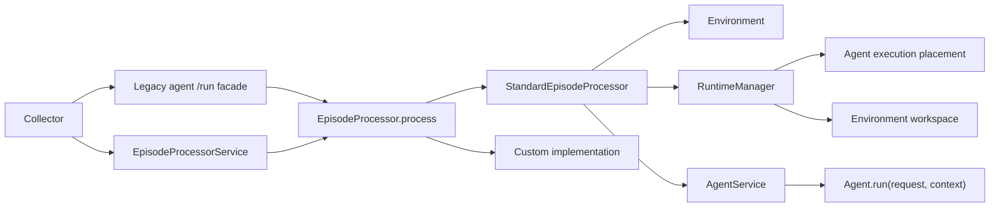
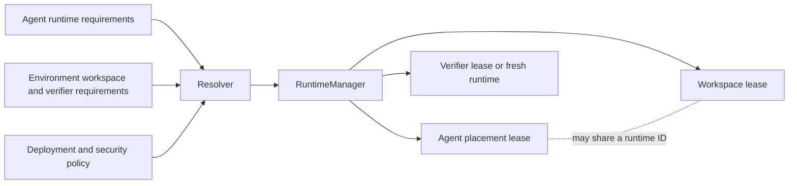

# Episode orchestration: a pure processor contract for single-agent and multi-agent episodes

Status: proposal, 2026-09-09.

This document defines how Gym separates episode orchestration from agent behavior, supports several agents in one episode, and places command-line harnesses in controlled runtimes.

The training compatibility scope is NeMo RL only. The contract is based on NVIDIA-NeMo/RL main at `e518e602fbff282dbb1d5033a819b2cdc18cfb12`.

## The short answer

Work can start now on additive processor types, behavior characterization, NeMo RL contract tests, the standard processor behind opt-in routing, the participant schema, and prepared CLI images. None of that work depends on moving an existing harness or choosing a cross-host runtime implementation.

With three engineers and benchmark-owner support, simple-agent swappability is approximately a five-week milestone. Sandboxed CLI swappability and a native policy-plus-simulated-user episode are approximately eight-week milestones. Moving the high-value benchmark topologies and making processor routing the default is a twelve-to-sixteen-week program.

Existing harnesses move one boundary at a time: first through a compatibility adapter in their current placement, then onto the `Agent.run` activation contract, and only then into a sandbox when required. Deterministic characterization and replay tests run on every change. Small real-rollout canaries gate each harness. Full benchmark baselines gate default changes and compatibility removal. Routing remains reversible by configuration, and CLI rollback never falls back to unsandboxed host execution.

## An episode is the interaction; a rollout is its exported sample

A task row describes work that can be attempted. The rollout collector selects that row, model and agent configuration, and sampling parameters to request one rollout. The rollout is the durable sample exported to evaluation or training: its primary trajectory, participant records, artifacts, reward, and provenance.

An episode is the live interaction that produces that rollout. It begins when Gym admits the request and opens or restores environment state. It includes every participant turn, tool call, runtime operation, and verification step. It ends after Gym durably publishes a terminal result and releases episode-owned resources.

The initial contract is one episode per rollout. `rollout_id` therefore remains the compatible identity for both the live episode and its exported record; adding a second `episode_id` would create two identifiers with no distinct lifecycle. Only a pre-terminal infrastructure failure may retry the same episode. The retry keeps `rollout_id`, increments `attempt`, atomically acquires the attempt fence, and adopts the last committed checkpoint from the superseded attempt. A published terminal result cannot be retried. A deliberate new sample gets a new `rollout_id` and a new episode.

A multi-agent or user-simulation episode still produces one rollout. Its participant outcomes and event stream contain every agent, while the top-level training trajectory identifies the configured primary participant. Planning that chooses several task rows or later rollouts remains above the episode processor.

## The current agent endpoint combines behavior with lifecycle work

Gym currently sends each rollout to `POST /run` on an agent server. That method commonly seeds the environment, runs the agent, sends the result for verification, and performs cleanup. Some agents add sandbox creation, artifact collection, retries, or benchmark-specific handoffs to the same method.

This organization causes three concrete problems.

- Agents that implement similar episode lifecycles copy orchestration code. Fixes for cleanup, identity propagation, and metric forwarding must then be repeated.
- A command-line harness often needs a second implementation when it moves into a sandbox. The harness behavior and its execution placement change together even when only placement should change.
- No framework component has a complete and enforceable account of runtime ownership. Environment servers, agent servers, and verifiers can each create or stop a sandbox through provider-specific conventions.

Moving lifecycle behavior into a mandatory processor server would clarify network ownership, but it would impose a process, port, health check, and network hop on every rollout. Invoking agents only through `/v1/responses` would also give that endpoint more meaning than its OpenAI-compatible contract supports. A single Responses API call can represent one model-facing exchange or an adapter surface. It does not necessarily represent a complete agent activation or episode.

The target architecture keeps one pure processor contract and one reusable standard lifecycle without requiring one deployment topology.

## The processor contract is separate from its implementations

`EpisodeProcessor` is a pure structural interface. It defines the typed request, services, result, and behavioral invariants that every processor must satisfy. It does not inherit a concrete `run()` method and does not prescribe one internal algorithm.

```python
class EpisodeProcessor(Protocol):
    async def process(
        self,
        request: EpisodeRequest,
        services: EpisodeServices,
    ) -> EpisodeResult: ...
```

The method is named `process`, not `run`, to distinguish the interface from the legacy HTTP `/run` route and from `Agent.run`, which executes one agent activation. The name also makes the boundary explicit: a processor consumes one typed episode request and produces one typed terminal result.

`EpisodeRequest` represents one episode and contains one or more participants from the beginning:

```python
class EpisodeParticipant(BaseModel):
    participant_id: str
    role: str
    agent_ref: AgentRef
    model_bindings: dict[str, ModelRef]


class EpisodeRequest(BaseModel):
    rollout_id: str
    attempt: int
    environment_ref: EnvironmentRef
    task: EpisodeTask
    participants: tuple[EpisodeParticipant, ...]
    primary_participant_id: str
    schedule: ScheduleSpec
    deadline: datetime | None = None
    checkpoint_ref: CheckpointRef | None = None


class EpisodeResult(BaseModel):
    rollout_id: str
    attempt: int
    status: Literal["completed", "failed", "cancelled"]
    agent_ref: AgentRef
    participant_outcomes: tuple[ParticipantOutcome, ...]
    response: Response | None
    reward: float | None
    reward_components: dict[str, float] | None
    instance_config: dict[str, Any]
    failure: EpisodeFailure | None = None
```

`participant_id` uniquely identifies one actor within the episode. `role` describes that actor's function, such as `policy`, `simulated_user`, or `critic`, and may be shared by several participants. The model does not need a separate seat identifier: when two actors have the same role, their participant identifiers already distinguish them.

`EpisodeTask` carries the public task input, verifier metadata, and additive episode options. Its compatibility representation contains today's `responses_create_params`; the processor protocol does not make an OpenAI request type the universal task abstraction.

`EpisodeServices` provides typed access to agent invocation, the environment, optional runtime management, event publication, checkpoint storage, cancellation, and the clock. These are injected capabilities. They are not methods inherited from a processor base class.

The protocol requires every implementation to:

- preserve rollout, attempt, and participant identity;
- accept at least one participant without changing the request shape;
- publish at most one terminal `EpisodeResult` for a rollout; a retryable attempt failure is recorded as an event and does not publish a terminal result;
- report failures and cancellation through the common result and event model;
- respect attempt fencing, deadlines, idempotency keys, and any runtime leases supplied through `EpisodeServices`;
- pass the processor conformance suite.

The protocol does not require every implementation to seed, schedule turns, harvest artifacts, or verify in the same way. Those choices belong to concrete implementations.

The initial concrete implementations are:

- `StandardEpisodeProcessor`, which implements the normal seed, participant scheduling, agent invocation, artifact, verification, publication, and cleanup lifecycle;
- benchmark-specific processors for external frameworks that own the complete interaction and scoring flow.

| Layer | Handles | Does not handle |
| --- | --- | --- |
| `EpisodeProcessor` protocol | Request, service, and result types; identity, fencing, cancellation, event, and terminal-result invariants | Lifecycle phase implementations, transport, configuration discovery, or benchmark policy |
| `StandardEpisodeProcessor` | Standard phase order, required runtime acquisition, participant loop, artifact handoff, verification, publication, and cleanup | HTTP routing, provider-specific sandbox calls, or a fixed turn policy |
| `TurnScheduler` implementation | Next-participant selection and participant-visible observations | Agent execution, runtime ownership, verification, or result publication |
| Custom processor implementation | A benchmark or external framework's non-standard episode flow | Cross-rollout planning or exemptions from the common processor invariants |
| `EpisodeProcessorService` | Remote transport, process lifecycle, health, and dependency construction | Episode semantics |
| `LegacyRunAdapter` | Temporary routing to an unchanged legacy `/run`, plus request and result observation for characterization | The `EpisodeProcessor` contract or lifecycle guarantees the legacy harness does not already implement |

Processor implementations satisfy the protocol structurally. They do not subclass a base processor that supplies `process()` or `run()`. `LegacyRunAdapter` is deliberately outside the protocol and cannot be selected for new components.

`StandardEpisodeProcessor` receives a `TurnScheduler` by composition. A single-agent schedule and a simulated-user schedule use the same processor class. New turn policies do not require new processor subclasses.

Deployment as an `EpisodeProcessorService` is optional.

- `POST /run` on a legacy agent server remains available. A migrated route builds an `EpisodeRequest`, invokes a configured processor in the same process, and translates the `EpisodeResult` back to the legacy response. An unmigrated route remains behind `LegacyRunAdapter` until that harness satisfies processor conformance.
- An explicit processor service invokes the same processor through a private endpoint. Complex flows can therefore isolate orchestration without changing the processor contract.
- Gym's collector may resolve either deployment internally. The materialized row and returned result continue to identify the selected primary agent through `agent_ref`.

The compatibility endpoint is a facade, not a second lifecycle implementation. Tests must prove that hosting `StandardEpisodeProcessor` in-process or in a service produces the same phase events, requests, result shape, cleanup behavior, and failure classification.

This arrangement gives simple evaluations a reusable lifecycle without forcing a fourth process. It also gives staged, external, or operationally isolated flows a dedicated deployment when they need one.



## Roles are defined by behavior and permissions

### The environment defines the task and verification contract

The environment owns:

- datasets and task-row schemas;
- task initialization and environment state;
- environment tools;
- task and workspace requirements;
- verification;
- metric aggregation;
- environment-state export, restore, and close behavior.

The environment can request a workspace or another runtime, but it does not gain authority over an agent runtime merely because both use the same provider.

### The agent has one Python behavior contract

Every agent implements:

```python
async def run(request: AgentRequest, context: AgentContext) -> AgentResult:
    ...
```

`AgentRequest` contains the participant-scoped observation, permitted history, and task input that the agent is allowed to see. It does not include private verifier answers, events addressed to other participants, or unrelated global configuration.

`AgentContext` contains the resolved model bindings, tool bindings, participant identity, rollout identity, attempt identity, deadlines, optional checkpoint input, and optional runtime and workspace sessions. An in-process agent that needs no external execution or task workspace receives neither session.

`AgentResult` contains the agent's response items, usage and capture references, artifacts or artifact declarations, emitted events, optional checkpoint state, and a disposition such as yield or participant-complete.

This Python method is the architectural behavior contract. One call represents one participant activation, not necessarily one model call. An activation may run an internal model-and-tool loop before it yields control or reports that the participant has completed its work. The same contract works for a simple in-process policy loop, a command-line harness, and a Python harness placed inside a sandbox.

### `AgentService` hosts invocation and transport

`AgentService` hosts an agent implementation and exposes the same invocation operation through an in-process interface and a private transport endpoint. It consumes an execution decision and optional runtime lease already resolved by the processor. It does not allocate, delegate, renew, or close the runtime.

The processor resolves the required execution and workspace topology and requests its lifecycle operations. `RuntimeManager` enforces those operations. `AgentService` only enters the resulting session for the duration of an invocation.

An `EpisodeProcessor` in another process calls:

```text
POST /invoke
```

The request to `/invoke` carries typed Gym identity and any required lease references. The service resolves those references into an `AgentContext` and calls `Agent.run(request, context)`. A processor hosted in the same process calls the invocation interface directly and does not make an HTTP request to itself.

`POST /v1/responses` remains available as an OpenAI-compatible adapter. It translates a compatible request into `Agent.run` when enough context exists. A stateless agent can serve a direct request without episode runtime bindings. An agent that requires a workspace or sandbox rejects a direct request that does not provide an authorized invocation context. This endpoint is not the canonical Gym behavior contract, and the architecture does not assume that one `/v1/responses` call completes an episode.

### `StandardEpisodeProcessor` owns the reusable lifecycle

`StandardEpisodeProcessor` coordinates the normal Gym lifecycle for one or more participants. The `EpisodeProcessor` protocol does not provide this implementation. A custom processor can use another internal lifecycle while preserving the protocol invariants.

### `RuntimeManager` controls runtime leases

`RuntimeManager` is the interface through which a processor allocates, reconnects, delegates, and closes execution runtimes. It keeps provider descriptors internal and gives each caller a scoped `RuntimeLease`.

A runtime lease is:

- bound to one rollout and attempt;
- bound to an audience such as one agent service or verifier;
- bound to an authority level such as owner, operator, or verifier;
- limited to named operations and resources;
- expiring and renewable under policy;
- revocable and auditable.

The provider handle or serialized provider descriptor never becomes the cross-service credential. A raw OpenSandbox descriptor, container identifier, workspace path, or provider credential remains inside `RuntimeManager`.

An owner lease may destroy a runtime. An operator or verifier lease permits only its named operations. When a borrower finishes, it releases its lease. It does not destroy the runtime.

The runtime manager is needed when a runtime is shared across components or process boundaries. Passing a serialized sandbox descriptor directly can give an agent or verifier the same reconnect and destructive operations as the owner. A scoped lease lets the agent execute and the verifier inspect without letting either stop or reassign the runtime.

This requirement does not imply a mandatory new service. A simple deployment uses an in-process manager. A provider that natively enforces scoped credentials can implement the interface directly. A proxy service is needed only when a provider cannot enforce a lease across the required process or host boundary. OpenSandbox scope is not considered secure merely because callers follow a convention.

### The model serves inference and capture

Model servers remain responsible for inference, admission, token capture, and model-call capture. Rollout and participant identity propagate through the resolved model binding.

## The standard processor follows an explicit ordered lifecycle

`StandardEpisodeProcessor` executes these phases in order.

| Phase | Behavior | Durable output |
| --- | --- | --- |
| Resolve identity | Resolve or mint the rollout id, attempt, environment identity, every participant identity, the primary participant, and deadlines. Fence older attempts before any external effect. | Episode identity and attempt fence |
| Resolve requirements | Validate every participant agent's concrete runtime requirements against environment policy and available providers. Resolve separate agent-runtime and environment-workspace bindings. | Resolution decision |
| Request workspace specification | If the processor will own an environment workspace, call `/sandbox_spec` before seed. Skip this call when no processor-owned workspace is required. | Validated workspace specification |
| Allocate or reconnect runtimes | Ask `RuntimeManager` to allocate or reconnect each required runtime. Issue separate leases for the agent, environment, and verifier. | Runtime references and leases |
| Seed the environment | Call `/seed_session` with episode identity and the environment workspace binding. Seed must be idempotent for one rollout and attempt. | Environment state reference and tool metadata |
| Run the participant loop | Ask the `TurnScheduler` which participant acts next. Obtain that participant's permitted observation, invoke its `AgentService` directly or through private `POST /invoke`, append attributed events, and continue until the schedule reaches a terminal condition. | Participant results, schedule state, and event cursor |
| Harvest declared artifacts | Collect only files, commands, or structured outputs declared by the environment contract. | Artifact manifest |
| Verify | Send the participant outcomes, primary response, permitted artifacts, and the verifier's own lease to the verify owner. | Reward, reward components, and verifier metadata |
| Publish the terminal result | Commit one durable terminal record before reporting success to the collector. Repeated publication for the same fenced attempt returns the same result. | Terminal episode result |
| Close and release | Close environment state. Release borrowed leases. Close only runtimes owned by the processor. Record cleanup failures without replacing the primary result or error. | Final lifecycle events |

Cancellation follows the same close and release path. Runtime time-to-live policies remain a crash backstop, not the normal cleanup mechanism.

Single-agent execution is the degenerate case in which the request has one participant. User simulation uses at least two participants, such as `policy` and `simulated_user`, and a scheduler that defines their turn order.

A custom processor may replace the standard phase composition for a whole-run integration. It still satisfies the common identity, fencing, event, cancellation, and terminal-result invariants.

## Runtime requirements are concrete and agent-owned

An agent declares the exact facilities needed to execute its behavior. It does not select itself into a broad profile.

```yaml
requirements:
  isolation:
    boundary: container
    untrusted_code: true
  subprocess: true
  pty: true
  filesystem:
    writable_workspace: true
    persistence: episode
  network:
    destinations:
      - binding: policy_model
      - binding: environment_mcp
  checkpoint:
    supported: false
```

The complete requirement model should cover:

- required isolation strength;
- subprocess execution;
- PTY and stdin behavior;
- writable and read-only filesystem mounts;
- network destinations and protocols;
- persistence duration;
- CPU, memory, GPU, and timeout limits;
- signals and cancellation;
- upload, download, and artifact operations;
- checkpoint and reconnect support.

The resolved `AgentContext` records the selected implementation and leases. This makes the result reproducible without making the agent config depend on a provider-specific descriptor.

Placement is a resolution outcome derived from exact requirements and policy. Agent configuration does not classify behavior through broad runtime profiles.

### Command-line harnesses require sandbox placement

OpenCode, Claude Code, Codex, and similar command-line harnesses execute third-party programs that can read files, spawn processes, and make network calls. Production execution therefore requires a sandbox that satisfies the declared isolation and egress policy.

There is no unsandboxed production fallback for these harnesses. A missing suitable sandbox is a preflight error.

A simple Python agent can resolve to in-process execution when it needs no external runtime. A trusted helper can use a local subprocess when policy permits. A local subprocess provides process management and a workspace, but it is not a security boundary.

### Agent execution and environment state use separate bindings

The place where agent code executes and the place where task state lives are separate decisions.

For example, a Python agent service can remain on the host while its shell tool operates an environment workspace in a sandbox. A CLI agent can execute inside the same sandbox that holds the task workspace. In both cases, the agent-execution lease and environment-workspace lease remain separate records with separate permissions.

Co-location is an optimization and sometimes a benchmark requirement. It is not proof of shared ownership.

The verifier has three supported relationships to task state:

- It can inspect the live environment workspace through a verifier lease.
- It can start a fresh verifier runtime and apply harvested artifacts there.
- It can consume artifacts without any live runtime.

The environment declares which relationship verification requires. `RuntimeManager` enforces the resulting lease.



## Benchmark topologies fit the separate bindings

The following benchmark evidence motivates the runtime and verification contracts. The table describes topology, not a permanent implementation assignment.

| Benchmark | Agent execution and task state | Verification relationship | Architectural consequence |
| --- | --- | --- | --- |
| SWE-bench | The harness edits a repository workspace. Existing implementations may have the environment create that workspace. | Verification can consume a patch in a fresh runtime or inspect a live workspace, depending on the verifier implementation. | The workspace owner, agent operator, and verifier must be explicit. The harness must not rely on a private process-local sandbox registry. |
| Terminal Bench | A CLI harness executes commands in the task container and changes its live state. | Tests inspect the same task state. | Agent execution and workspace can be co-located, but the verifier needs its own lease and the owner alone performs teardown. |
| GDPVal | An agent produces named deliverables that later become verifier inputs. Its adaptive evaluation also chooses future work from prior results. | Verification reads declared deliverable artifacts. | Deliverable harvest belongs to the episode contract. Adaptive sampling remains above individual episodes. |
| CVDP | A harness produces RTL files in a workspace. Existing paths can also parse RTL from model output. | Verification can receive file contents as artifacts and run independently. | The verifier does not need authority over the agent execution runtime when artifacts are sufficient. |
| VIBench | A harness creates an application in a sandbox and exports it for scoring. | Verification consumes the exported application. | Artifact identity and transfer must be declared rather than passed through an incidental host path. |
| OSWorld | The agent interacts with a desktop runtime and services exposed through ports. | Evaluation inspects live desktop or application state. | Desktop ports, persistence, and verifier authority are concrete runtime requirements. |
| PinchBench | A benchmark image runs the task interaction and its grading workflow. | Scoring occurs in or against the benchmark runtime and produces a result artifact. | A whole-run integration can use a custom processor while still publishing the common episode result. |
| Tau2 | The external library drives a multi-turn interaction between a policy participant and a simulated user, then computes reward. | The external integration owns its scoring flow. | A custom processor can host the whole-run integration. Model bindings and event attribution must identify both participants. |

These cases do not imply that one component must own every sandbox. They show why runtime role, owner, operator, verifier, placement, and lifetime must be independent fields.

The corresponding implementation evidence is in `resources_servers/swebench/app.py`, `resources_servers/terminal_bench_2_1/app.py`, `resources_servers/gdpval/app.py`, `responses_api_agents/cvdp_agent/app.py`, `responses_api_agents/vibench_agent/app.py`, `responses_api_agents/osworld_agent/`, `responses_api_agents/pinchbench/`, and `responses_api_agents/tau2/`. The important behavior is summarized in the table so the design does not depend on readers opening each file.

## The placement proof of concept supplies a worker mechanism, not the final processor

The `upstream/ffrujeri/sandboxes` branch demonstrates that an existing Python harness can execute inside a task sandbox. The host is implemented in `nemo_gym/sandbox/agent_runtime.py`, the in-box worker is in `nemo_gym/sandbox/agent_runtime_worker.py`, and placement validation is in `nemo_gym/sandbox/agent_runtime_config.py`.

Its useful mechanisms should be retained:

- A host can stage a worker and invoke an existing harness inside the selected runtime.
- Dependencies can be staged from the checkout during development.
- Prepared images can disable per-task dependency installation for production.
- Validators reject conflicting placement configuration.
- Cleanup is attempted in `finally` after both successful and failed execution.
- A typed workspace object is better than an unstructured sandbox identifier.

Dependency staging is a development path. Production runtimes should use built, versioned, and cached images so rollout startup does not depend on downloading Python, Gym, and harness dependencies.

`SandboxedAgentHost` is not the final orchestrator. Its current `run()` seeds the environment, attaches or creates a sandbox, invokes the harness, verifies the result, and cleans up from the agent service. That reproduces the episode lifecycle in the placement host instead of delegating to `StandardEpisodeProcessor`.

The proof of concept also invokes the harness through its FastAPI `/v1/responses` route. The target worker calls the canonical `Agent.run(request, context)` method. An HTTP bridge may remain an implementation option when the placed process needs a transport boundary, but the bridge exposes Gym's private `/invoke` contract rather than treating `/v1/responses` as the complete behavior contract.

The current worker payload forwards broad agent configuration and cookies. The target passes only typed request fields, resolved bindings, and scoped leases. Provider credentials, verifier configuration, answer keys, and unrelated cookies do not enter the agent runtime.

The current environment-workspace lookup depends on resources-server process memory. That fails when seed, verify, and cleanup reach different workers or after a process restart. The target stores runtime identity through `RuntimeManager` and durable episode state.

The proof of concept has no durable resume protocol. The target adds attempt fencing, event cursors, coordinated checkpoints, and idempotent terminal publication before using placement for resumable training.

## Runtime leases remain enforceable across processes

`RuntimeManager` is a protocol, not a required deployment unit. It can run in-process with the owner, delegate to a provider's native lease mechanism, or use a service when several processes or hosts need controlled access.

The logical API includes:

```text
allocate(requirements, identity) -> RuntimeLease
restore(runtime_ref, identity) -> RuntimeLease
delegate(owner_lease, audience, operations, expires_at) -> RuntimeLease
connect(runtime_lease) -> RuntimeSession
renew(runtime_lease, expires_at) -> RuntimeLease
release(runtime_lease) -> None
close(owner_lease) -> None
```

`RuntimeRef` is the opaque durable identity stored in an episode checkpoint. `RuntimeLease` is the typed, expiring authorization presented by a caller. Neither exposes the provider's raw connection material.

The connected `RuntimeSession` provides only the data-plane operations authorized by its lease. At minimum, that surface covers process execution, signals, status, file upload and download, artifact reads, and declared service endpoints. A colocated caller can receive an in-process session that checks the lease. A remote caller uses an enforcing proxy client. Callers never bypass the manager by reconnecting with provider credentials.

Provider adapters translate authorized operations into provider behavior. If a provider cannot enforce an operation safely, resolution rejects that topology or routes access through an enforcing proxy. Documentation or caller convention is not sufficient.

This interface exists to make ownership and borrowing enforceable. It is not an episode orchestrator, and it does not justify another process when all access remains local.

## Identity remains stable for results and training

`agent_ref.name` remains the external identity of the selected agent on the materialized row, the returned result, and metric grouping.

Processor placement is internal. A row does not replace its agent identity with an episode-processor identity. Gym may record the resolved processor deployment as additional provenance.

For a multi-participant request, the existing top-level `agent_ref` names `primary_participant_id`. A user-simulation task selects the policy participant as primary. Self-play or another multi-agent design can select its training subject explicitly instead of assigning special behavior to the `policy` role. The participant list and event stream retain every other `agent_ref`. This preserves NeMo RL's current grouping contract without collapsing the simulated user or other participants into the primary identity.

The rollout id and attempt identify one execution. Participant identifiers and roles distinguish model-using actors within that execution. The event stream records all four values so model calls, tools, artifacts, checkpoints, and rewards can be attributed without overloading the agent name.

### NeMo RL compatibility is a required contract

At NVIDIA-NeMo/RL main commit `e518e602fbff282dbb1d5033a819b2cdc18cfb12`, `nemo_rl/environments/nemo_gym.py` calls `RolloutCollectionHelper.run_examples` before it reads the synchronously resolved `row["agent_ref"]["name"]` for completion accounting. It returns the resolved `agent_ref` to its caller.

NeMo RL also supports token-capture receipt mode keyed by `_ng_rollout_id`. Its training path consumes `response.output`, scalar `reward`, optional `reward_components`, and `instance_config.mask_sample`. The output items carry token and log-probability data, reward components feed multi-reward training, and `mask_sample` determines whether a rollout contributes to the loss.

For a multi-participant episode, the top-level `response.output` and training receipt contain only the primary participant's trainable trajectory. Simulated-user and critic outputs remain in `participant_outcomes` and the attributed event stream. Every model call carries a participant identifier. If one model server serves several participants, token-capture selection must filter by participant as well as `_ng_rollout_id`; otherwise simulated-user tokens can enter the policy update.

The design therefore requires:

- `run_examples` continues to resolve the row's agent synchronously before returning its tasks.
- The resolved `agent_ref` remains on the row and result.
- `agent_ref.name` remains the selected-agent and completion-accounting identity.
- `_ng_rollout_id` continues to key token-capture receipts and retrieval.
- The Gym result continues to include `response.output`, scalar `reward`, optional `reward_components`, and `instance_config.mask_sample` with their current meanings.
- Selecting an in-process processor or explicit processor service does not change these fields.
- Multi-participant results keep non-primary trajectories out of the top-level training response and token receipt.

NeMo RL contract tests must cover both processor deployments, rows resolved from task ownership, token-capture receipt mode, completion accounting, reward consumption, returned agent identity, and exclusion of non-primary participant tokens.

## Metric aggregation stays with the verify owner

The server or component that computes `/verify` also computes aggregate metrics for those verification results.

Gym groups results by verify owner and `agent_ref.name`. The entry identity remains the agent name so output artifacts and NeMo RL-facing identity do not change.

The compatibility facade may accept `/aggregate_metrics` on an agent endpoint during migration. It delegates to the verify owner and does not compute metrics itself.

A whole-run custom processor that also owns verification is the verify owner for its results. This is consistent with the same rule.

## Cross-rollout planning remains above `EpisodeProcessor`

An `EpisodeProcessor` executes one row and publishes one terminal result. It does not decide which rows should run next.

GDPVal preselects each stage's task set. Results from an earlier stage then select reference models for the next stage, and the planner materializes later rows with those references. That cross-rollout dependency belongs in `rollout_collection_driver` today or in a future typed planner above episode execution.

A custom episode processor does not replace `rollout_collection_driver`. It can implement GDPVal's per-row deliverable lifecycle, but it cannot express cross-rollout planning because it is called after a row has already been selected.

Retries that repeat one row can remain collector policy. Planning that changes the work set belongs to the higher layer.

## Multi-agent episodes are part of the processor request

`fan_out` repeats a single-agent evaluation with different agents. The repeated runs do not share one environment state or take turns in one episode. It is not a multi-agent episode.

Every `EpisodeRequest` contains `participants`, including a single-agent request. A user-simulation episode uses the same schema with a policy participant and a simulated-user participant:

```yaml
participants:
  - participant_id: policy
    role: policy
    agent_ref: customer_support_agent
    model_bindings:
      generation: policy_model
  - participant_id: user
    role: simulated_user
    agent_ref: customer_simulator
    model_bindings:
      generation: user_model
primary_participant_id: policy
schedule:
  implementation: environment_directed
```

Each participant has:

- a stable participant identifier and semantic role;
- an agent and model binding;
- an execution-runtime lease when the agent is not in-process;
- an environment-workspace lease when the participant can access task state;
- tool and network permissions;
- event and usage attribution;
- participant-scoped checkpoint state.

`StandardEpisodeProcessor` delegates turn choice to a structural interface:

```python
class TurnScheduler(Protocol):
    async def next_turn(
        self,
        state: EpisodeState,
        environment: EnvironmentClient,
    ) -> TurnDirective | EpisodeComplete: ...
```

`TurnDirective` names the next participant and the environment observation that participant may receive. The processor invokes only that participant's `AgentService`, stamps the participant identifier and role on resulting events, and returns the action to the environment. It does not broadcast the full event stream to every participant.

A fixed scheduler, an alternating policy-and-user scheduler, and an environment-directed scheduler implement the same interface. They are composed with `StandardEpisodeProcessor`; they do not require subclasses or branches inside a base `run()` method.

The schedule cannot be inferred from `fan_out` or from multiple model URLs. Preflight validation confirms that every directive names a declared participant, every participant has a resolvable agent and model binding, and observation audiences match environment policy.

Tau2 already demonstrates why participant identity matters: policy and simulated-user calls occur in one episode but have different roles. The target records those roles explicitly even when a custom processor drives the interaction.

The native multi-agent conformance tests verify that only the scheduled participant is invoked, private observations do not reach another participant, every model and tool event has participant attribution, non-primary tokens stay out of the NeMo RL training response, cancellation reaches every active participant, and a checkpoint restores the schedule position with each participant's state.

## Partial checkpointing coordinates all episode state

A partial-rollout checkpoint records a durable boundary before the episode has produced its terminal result. It is not only an agent transcript. It is a coordinated record of the state needed to continue one fenced attempt without duplicating effects.

A checkpoint contains:

- agent state or an agent-specific checkpoint token;
- environment state or a reconnectable environment-runtime reference;
- agent execution-runtime reference when continuation requires it;
- the last durable event cursor;
- rollout and attempt identity;
- the current attempt fence;
- the status of external effects and their idempotency keys;
- participant state and schedule position for multi-agent episodes;
- the terminal-publication state.

The checkpoint commit occurs only after all referenced component states are durable. The event cursor advances with the commit. A retry first acquires a new attempt fence with an atomic compare-and-swap. It may then adopt the last complete checkpoint from the superseded attempt, recording that source attempt in the restore event. Only the new attempt may issue effects, write another checkpoint, or publish the terminal result.

External effects use idempotency keys derived from the rollout and logical effect identity. The attempt fence determines which attempt may issue or commit the effect, but the attempt number is not part of the effect key. A later authorized attempt therefore receives the prior outcome instead of repeating an effect completed by an earlier attempt.

Terminal result publication is durable and idempotent. A processor that crashes after publication but before acknowledgement must return the existing terminal result when the collector retries.

Blackbox CLI agents may initially declare `checkpoint.supported: false`. They become resumable only when they provide a checkpoint adapter that can save and restore the CLI's relevant state. The runtime may still be reconnectable, but reconnecting a process or filesystem alone does not prove that the agent can resume correctly.

## Compatibility facades do not create a second architecture

The following compatibility surfaces remain during migration:

- Agent `POST /run` delegates to an `EpisodeProcessor` after that harness migrates. An unmigrated harness remains behind `LegacyRunAdapter`.
- Agent `POST /aggregate_metrics` delegates to the verify owner.
- `POST /v1/responses` adapts compatible requests to the agent contract.
- Existing seed and verify schemas continue to accept rows without runtime fields.

New code must not implement lifecycle logic in these facades. The facades resolve typed inputs, call the shared component, and translate the output.

Direct clients that call an agent's `/run` continue to work. They receive the same response and reward shape, with additive episode provenance where available.

## Configuration records references instead of nesting behavior

The environment config identifies task data, verification, tools, state, and requirements. The agent config identifies an agent implementation, model bindings, and concrete runtime requirements. An optional processor config selects an `EpisodeProcessor` implementation, scheduler, and service deployment.

One possible shape is:

```yaml
resources_servers:
  swebench:
    entrypoint: app.py
    datasets:
      - name: verified
        jsonl_fpath: data/verified.jsonl

responses_api_agents:
  opencode:
    entrypoint: app.py
    model_bindings:
      policy: policy_model
    requirements:
      isolation:
        boundary: container
        untrusted_code: true
      subprocess: true
      pty: true
      filesystem:
        writable_workspace: true
      network:
        destinations:
          - binding: policy_model

episode_processors:
  swebench_explicit:
    entrypoint: app.py
    environment: swebench
```

Omitting `episode_processors` does not omit episode orchestration. It selects `StandardEpisodeProcessor` through the agent `/run` compatibility facade.

An additive multi-participant row keeps the current top-level `agent_ref` and names the other participants explicitly:

```yaml
agent_ref:
  name: customer_support_agent
episode:
  primary_participant_id: policy
  participants:
    - participant_id: policy
      role: policy
      agent_ref: customer_support_agent
    - participant_id: user
      role: simulated_user
      agent_ref: customer_simulator
  scheduler: environment_directed
```

Provider selection is a policy resolution based on requirements and deployment configuration. The agent does not contain a raw sandbox provider descriptor.

## Validation fails before compute

Preflight validation compares concrete agent requirements, environment requirements, runtime capabilities, and policy.

Validation should report a specific mismatch. For example, it should state that an agent requires a PTY and network access to the policy model but the selected runtime provides neither. It should not report only that an agent and benchmark are incompatible.

`allowed_agents` can remain as an environment-owner policy. It does not replace capability validation. Bypassing it must not bypass isolation, authority, or verifier requirements.

Validation also checks:

- every referenced agent, environment, model, and optional processor exists;
- the primary participant resolves to the top-level `agent_ref` expected by existing collectors;
- CLI agents resolve to a sandbox with adequate isolation;
- leases can enforce the requested operations and audiences;
- live verification has a verifier lease;
- checkpointing is requested only when all required components support it;
- a multi-agent schedule names valid participant identifiers and roles;
- the verify owner also owns metric aggregation.

## Work can start before the final service topology is decided

The first implementation work does not depend on selecting a cross-host `RuntimeManager` implementation.

The following pull requests can start now:

1. Add `EpisodeProcessor`, `EpisodeRequest`, `EpisodeParticipant`, `EpisodeServices`, `EpisodeResult`, `TurnScheduler`, and their validation tests as additive types. Do not change routing.
2. Add characterization tests around current `/run`, seed, verify, aggregation, identity, capture, cancellation, and cleanup behavior. These tests freeze observable contracts rather than internal call structure.
3. Add a NeMo RL contract suite against commit `e518e602fbff282dbb1d5033a819b2cdc18cfb12`. Cover synchronous agent resolution, returned `agent_ref`, `_ng_rollout_id` receipt mode, Responses output, rewards, sample masking, and completion accounting.
4. Implement `StandardEpisodeProcessor` behind an opt-in route for `simple_agent`. Keep the legacy endpoint and result schema unchanged.
5. Add `participants` and `schedule` as additive request fields. Translate a legacy `agent_ref` into a one-participant tuple with a single-participant schedule at the compatibility boundary.
6. Define concrete runtime requirements and build prepared sandbox images for the first CLI canaries. Image work can proceed before runtime leases are complete.

These changes create reviewable contracts and evidence without moving every harness. They also expose incompatible assumptions before the migration reaches benchmark code.

## A staffed migration reaches useful swappability before catalogue-wide conversion

The following timeline assumes three engineers working across the core processor, runtime, and migration tracks, with benchmark owners available for canary review. The ranges are planning estimates, not release commitments. With one engineer, the independent tracks become serial and the elapsed time is likely close to double.

Swappability does not mean that every agent can run every environment. It means an environment does not contain agent-specific orchestration, and changing `agent_ref` is sufficient when the replacement agent's declared capabilities satisfy the environment and deployment policy.

| Elapsed time | Milestone | Main implementation work | Observable exit condition |
| --- | --- | --- | --- |
| Weeks 0–2 | Contracts and behavior are frozen | Add the pure processor and scheduler protocols, additive participant schema, characterization tests, and NeMo RL contract tests. | Existing routes and NeMo RL behavior pass without routing changes. |
| Weeks 2–5 | Simple agents are swappable | Implement `StandardEpisodeProcessor`, the in-process compatibility facade, private processor service transport, and single-participant scheduling. | Two simple agents can run against the same compatible environment by changing only `agent_ref`. |
| Weeks 3–8 | Sandboxed CLI placement is usable | Add concrete runtime resolution, enforceable leases, prepared images, and the worker adapter. Migrate OpenCode and Claude Code as canaries, then Codex. | A CLI agent can replace another compatible CLI agent without benchmark-specific sandbox code and without an unsandboxed fallback. |
| Weeks 4–8 | User simulation is native | Implement participant-scoped observations, `TurnScheduler`, attributed events, per-participant model and runtime bindings, and multi-participant checkpoints. | A policy agent and simulated-user agent complete one shared episode through `StandardEpisodeProcessor`. |
| Weeks 7–12 | Complex benchmark topologies are covered | Migrate live-workspace, fresh-verifier, artifact-only, desktop, and whole-run processor canaries. Keep GDPVal planning above the episode. | At least one real benchmark passes for each supported runtime and verification topology. |
| Weeks 12–16 | New routing can become the default | Complete high-value harness migrations, run full benchmark baselines, publish deprecations, and retain config rollback. | Default routing uses processors for the supported set; legacy paths remain only for named exceptions. |

The first useful swappability milestone is therefore about five weeks: simple agents can be exchanged without changing the environment. Sandboxed CLI swappability and native user simulation are approximately eight-week milestones because they depend on runtime enforcement and participant-aware execution. Broad migration is a twelve-to-sixteen-week program, not a prerequisite for starting the core decoupling.

The protocol itself is a small part of the effort. Most work is in the standard lifecycle, runtime enforcement, compatibility tests, and per-harness migration:

- processor types, service transport, and conformance tests: about three to five engineer-weeks;
- `StandardEpisodeProcessor`, legacy facade, and routing: about four to six engineer-weeks;
- runtime resolution, leases, data plane, and prepared-image workflow: about six to nine engineer-weeks;
- native multi-agent scheduling, participant visibility, attribution, and checkpoint state: about four to seven engineer-weeks;
- NeMo RL compatibility and integration tests: about two to three engineer-weeks;
- harness migration: less than one engineer-week for a simple agent, roughly one to two for a CLI or artifact-heavy harness, and more for an external whole-run integration.

## Migration risk is controlled at four test layers

Unit tests alone cannot establish that a moved harness still solves the same benchmark. Re-running every benchmark on every processor change is also too slow and makes failures hard to localize. The migration uses four layers.

### Characterization tests freeze observable behavior

Deterministic tests record the current request and result schemas, phase-visible calls, identity propagation, reward fields, artifact declarations, cancellation, timeout, and cleanup behavior. They use fake model, environment, and runtime implementations. These are not benchmark reruns.

The same fixture runs through the legacy route and the new processor route. It compares externally visible behavior and permits intentional additive provenance fields. It does not require the new implementation to repeat incidental internal calls.

### Recorded replay tests compare transport without repeating side effects

Captured request and response sequences exercise routing, schema translation, event attribution, and failure mapping. They let old and new paths consume the same deterministic evidence.

Live old-and-new shadow execution is unsafe for stateful episodes. It can mutate the same workspace twice, spend model budget twice, or publish duplicate external effects. Differential comparison is limited to fakes, read-only fixtures, or recorded replay unless the benchmark explicitly provisions two isolated copies.

### Targeted real rollouts validate harness and verifier behavior

Each migrated harness runs a small, fixed canary set with its real model-facing loop, environment, runtime, and verifier. Reviewers inspect trajectories, artifacts, tool behavior, reward components, participant attribution, runtime cleanup, and token capture. A green unit suite is not enough.

The canary matrix must cover:

- one simple in-process agent;
- OpenCode and Claude Code in prepared sandbox images;
- one live-workspace benchmark;
- one fresh-verifier benchmark;
- one artifact-only benchmark;
- one policy-and-simulated-user episode;
- NeMo RL rollout collection and postprocessing.

Full benchmark reruns occur before a migrated path becomes the default and before a release removes a rollback path. They are not required for every additive interface pull request.

### Compatibility gates make rollback a configuration change

Migration is selected per agent and environment through configuration. The legacy `/run` path remains available while a harness is a canary. A failed canary returns to legacy routing without reverting the processor types or other migrated harnesses.

Each harness moves across boundaries in separate changes:

1. Route the existing harness behavior through `LegacyRunAdapter` without changing execution placement.
2. Implement the `Agent.run` activation contract and compare it with the legacy behavior in the same placement.
3. Move CLI execution into the sandbox worker without changing the new agent behavior contract.
4. Remove the adapter only after the new placement passes its real-rollout canary.

This sequence prevents a failure from simultaneously implicating lifecycle extraction, request translation, and sandbox placement.

The compatibility layer preserves:

- accepted legacy request fields;
- `agent_ref.name` and `_ng_rollout_id`;
- Responses output, scalar reward, reward components, and `instance_config.mask_sample`;
- artifact and metric routing;
- failure status and retry classification.

New fields are additive until the default has run through a release window. CLI agents fail preflight when no approved sandbox is available; rollback never means silently executing them on the host.

A harness leaves the legacy path only after it passes processor conformance, its topology-specific tests, its real-rollout canary, cleanup and cancellation checks, and the relevant NeMo RL contract tests. A compatibility endpoint can be removed only after no supported config resolves to it, deprecation telemetry shows no known use, benchmark baselines have been rerun, and a documented rollback release remains available.

## Migration sequence keeps independent work parallel

1. Land the pure contracts, additive participant schema, characterization suite, and NeMo RL contract suite.
2. Land `StandardEpisodeProcessor`, single-participant scheduling, and the legacy compatibility facade behind opt-in routing.
3. Build runtime requirements, leases, the enforcing data plane, and prepared CLI images in parallel with the standard processor.
4. Add participant-scoped observations and multi-participant scheduling as soon as `EpisodeRequest.participants` lands. This work does not wait for broad harness migration.
5. Migrate OpenCode and Claude Code, followed by Codex. Reuse the placement proof of concept's worker mechanism, validators, and cleanup attempts, but invoke canonical `Agent.run`.
6. Migrate SWE-bench and Terminal Bench for live and fresh verification, then GDPVal, CVDP, and VIBench for artifact handoffs.
7. Migrate OSWorld and PinchBench through desktop and whole-runtime leases. Migrate Tau2 as the user-simulation and whole-run custom-processor canary.
8. Change default routing only after topology canaries and full benchmark baselines pass. Remove compatibility routes only after their explicit removal gates are met.

Blackbox CLI agents may declare `checkpoint.supported: false` during their first migration. They become resumable only after a checkpoint adapter passes interruption and restore tests.

## Decisions

1. `EpisodeProcessor` is a pure `Protocol` with one `process` method and no inherited lifecycle implementation.
2. `StandardEpisodeProcessor` is a concrete implementation composed with a `TurnScheduler`.
3. Every `EpisodeRequest` contains one or more participants. Single-agent execution is not a different request type.
4. Policy and simulated-user agents are first-class participants with separate roles, observations, model bindings, optional runtime leases, checkpoints, and event attribution.
5. Legacy agent `/run` and an optional `EpisodeProcessorService` host processor implementations without defining a second lifecycle.
6. `Agent.run(request, context) -> AgentResult` is the behavior contract for one participant activation.
7. `AgentService /invoke` is the private transport contract used by a remote processor.
8. `/v1/responses` is a compatibility adapter and does not define a whole episode.
9. Runtime requirements are concrete. Profile-like classifications are removed.
10. CLI harnesses require sandbox placement in production. Local subprocess execution is not a security boundary.
11. Agent execution and environment task state have separate bindings and permissions.
12. `RuntimeManager` keeps provider descriptors internal and enforces typed leases.
13. A borrower releases its lease. Only an owner lease closes a runtime.
14. The placement proof of concept contributes worker placement, dependency staging, validation, and cleanup behavior. `SandboxedAgentHost` does not remain the orchestrator.
15. `agent_ref.name` remains the external result, metric, and NeMo RL training-subject identity. `_ng_rollout_id` remains the token-capture receipt identity.
16. Metric aggregation belongs to the verify owner.
17. Cross-rollout planning remains above `EpisodeProcessor`.
18. `fan_out` is repeated single-agent evaluation, not a multi-agent episode.
19. Partial checkpointing coordinates every participant's state with environment state, runtime references, schedule position, events, effects, fencing, and terminal publication.

## Cross-host runtime management remains a deployment choice

The design does not require Gym to build a cross-host runtime service now. The first implementation should use in-process managers and provider-native enforcement where available. A Gym proxy or an adapter to an existing control plane becomes necessary only when a benchmark must share one runtime across hosts and the provider cannot issue scoped leases itself.
