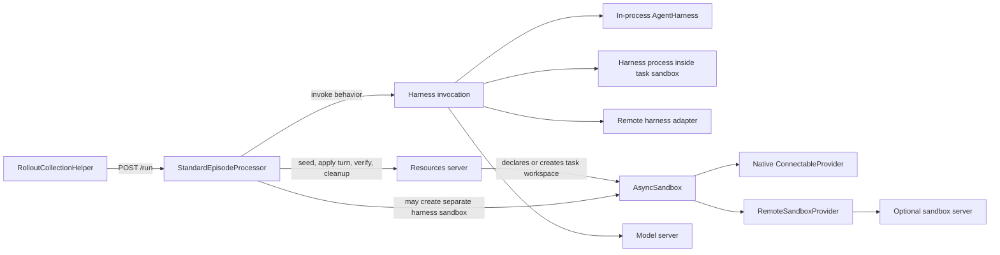
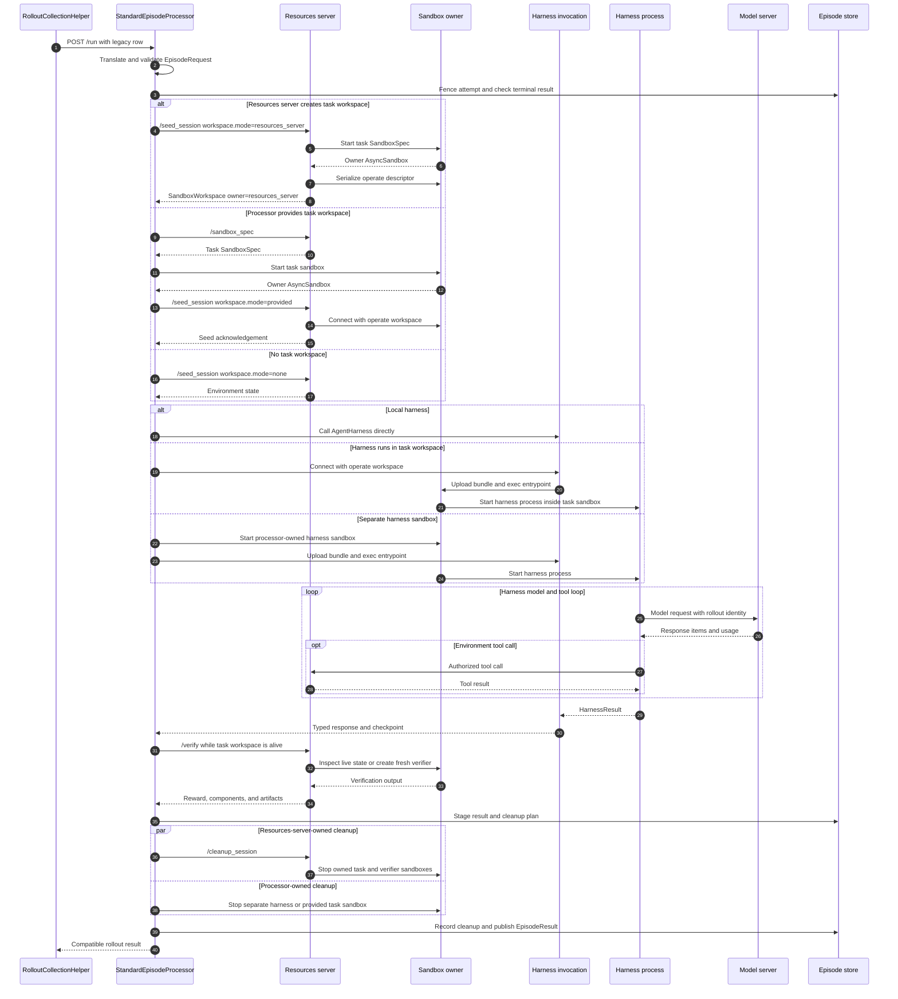

# Episode orchestration with first-class sandbox placement

Status: proposal, 2026-09-10.

This proposal separates episode orchestration from agent behavior and makes sandbox placement an explicit part of the seed, harness, verification, and cleanup contracts. It supports simple in-process agents, command-line harnesses running inside benchmark workspaces, host-side agents that use a sandbox as a tool, and multi-participant episodes.

The design reuses Gym's existing server references, Responses API models, `SandboxSpec`, `AsyncSandbox`, `SandboxProvider`, and `ConnectableProvider`. It uses the environment-workspace mechanism demonstrated by `upstream/ffrujeri/sandboxes`. PR [#2085](https://github.com/NVIDIA-NeMo/Gym/pull/2085) supplies an optional `RemoteSandboxProvider` for providers that cannot reconnect across processes or deployments that require enforced owner and operator leases. A natively connectable provider does not go through the sandbox server.

The NeMo RL compatibility contract is based on NVIDIA-NeMo/RL main at `e518e602fbff282dbb1d5033a819b2cdc18cfb12`.

## The design adds a small set of explicit contracts

The public architecture adds:

- `EpisodeProcessor`, the pure interface that converts one episode request into one result.
- `StandardEpisodeProcessor`, the concrete seed, execute, verify, cleanup, and publication implementation.
- `AgentHarness`, the full-loop agent behavior interface.
- `TurnAgent`, the optional turn-level interface required when Gym schedules visible participants such as a policy and simulated user.
- `WorkspaceRequest` and `SandboxWorkspace`, which make task-sandbox creation, access, and ownership explicit on `/seed_session`.
- `AgentRuntimeConfig`, which declares where a harness runs and what facilities it needs.

The design does not add `AgentService`, `/invoke`, a public lifecycle base class, a runtime manager, a scheduler plugin interface, or an artifact-harvesting service.

## An episode is the interaction and a rollout is the exported sample

A task row describes work that can be attempted. The rollout collector combines the row with an agent, model, and sampling configuration to request a rollout. The rollout is the durable sample exported to evaluation or training.

An episode is the live interaction that produces the rollout. It begins when Gym admits the request and opens or restores task state. It includes harness execution, participant turns, model calls, tool calls, sandbox operations, and verification. It ends after Gym records cleanup and durably publishes a terminal result.

The initial contract is one episode per rollout. `rollout_id` identifies the interaction and its exported record. A retryable infrastructure failure keeps `rollout_id`, increments `attempt`, and may adopt a complete checkpoint. A deliberate new sample receives a new `rollout_id`.

## Existing Gym types remain authoritative

The proposal reuses these existing types rather than introducing parallel names:

- `ResourcesServerRef` identifies the resources server responsible for task state, tools, verification, and metric aggregation. There is no `EnvironmentRef`.
- `ModelServerRef` identifies a configured model server.
- `AgentServerRef` identifies a configured response agent and preserves the current `agent_ref` discriminator and name.
- `NeMoGymResponseCreateParamsNonStreaming` and `NeMoGymResponse` remain the harness request and response representations.
- `NeMoGymResponseInputItem` and `NeMoGymResponseOutputItem` remain the typed turn payload items.
- `BaseRunRequest`, `BaseSeedSessionRequest`, `BaseSeedSessionResponse`, `BaseVerifyRequest`, and `BaseVerifyResponse` remain compatibility surfaces.
- `SandboxSpec` describes an image, working directory, files, ports, environment, resources, timeout, and provider options.
- `SandboxResources` describes provider-neutral CPU, memory, disk, and GPU requests.
- `SandboxHandle` contains the provider-neutral sandbox identifier and opaque provider state.
- `AsyncSandbox` is the live asynchronous control object.
- `SandboxProvider` performs provider-specific operations.
- `ConnectableProvider` adds `serialize_handle()` and `connect()` for cross-process access.
- `ServerClient` is Gym's existing downstream server client.
- `SandboxRef` and `RemoteSandboxProvider` from PR #2085 represent signed access through a sandbox server.
- `SandboxServerRef` from PR #2085 identifies a configured sandbox server.

Every other named type introduced by this proposal is defined below.

## The component relationship is explicit



The resources server defines the benchmark. The processor orders the episode. The harness implements agent behavior. Sandbox infrastructure provides execution and task state but does not decide episode policy.

The resources server may create the task sandbox because it knows the task image and verification requirements. The processor may create a task sandbox from a resources-server `SandboxSpec` or create a distinct harness sandbox when the task sandbox cannot host the harness. One physical sandbox has one logical lifecycle owner.

## Complete definitions of episode data

### `EpisodeTask`

```python
class EpisodeTask(BaseRunRequest):
    verifier_metadata: dict[str, Any] = Field(default_factory=dict)
    instance_config: dict[str, Any] = Field(default_factory=dict)
```

`EpisodeTask` extends the existing request shape to separate model-visible input from verifier-only metadata. Compatibility translation places only trusted benchmark fields needed for verification in `verifier_metadata`; unrelated row fields do not enter the processor request. Answer keys never enter harness input.

### `EpisodeParticipant`

```python
class EpisodeParticipant(BaseModel):
    participant_id: str = Field(min_length=1)
    role: str = Field(min_length=1)
    agent_ref: AgentServerRef
    model_bindings: dict[str, ModelServerRef] = Field(min_length=1)
    interaction_protocol: Literal["full_loop", "turn"]
```

`EpisodeParticipant` identifies one actor visible to Gym. `participant_id` distinguishes actors inside one episode. `role` describes behavior such as `policy` or `simulated_user`. `interaction_protocol` states whether the processor calls the actor once or schedules repeated turns. Internal subagents remain a harness implementation detail.

### `ScheduleSpec`

```python
class ScheduleSpec(BaseModel):
    kind: Literal["single", "environment_directed"]
    max_turns: int = Field(default=128, ge=1)
```

`ScheduleSpec` bounds execution and selects one of the two scheduling behaviors needed initially. `single` requires exactly one full-loop participant. `environment_directed` requires turn-capable participants and lets the resources server name the next participant. A scheduler plugin interface is not justified until independent scheduler implementations exist.

### `CheckpointRef` and `ComponentCheckpoint`

```python
class CheckpointRef(BaseModel):
    uri: str = Field(min_length=1)
    sha256: str = Field(pattern=r"^[0-9a-f]{64}$")


class ComponentCheckpoint(BaseModel):
    format: str = Field(min_length=1)
    version: int = Field(ge=1)
    payload: dict[str, Any]
```

`CheckpointRef` identifies a durable coordinated episode checkpoint without embedding storage credentials in the request. `ComponentCheckpoint` is the versioned state returned by a harness, participant, or environment. A sandbox identifier is not a component checkpoint because normal cleanup may destroy that sandbox.

### `ArtifactPayload` and `DurableArtifactRef`

```python
class ArtifactPayload(BaseModel):
    name: str = Field(min_length=1)
    media_type: str = Field(min_length=1)
    content_b64: str
    sha256: str = Field(pattern=r"^[0-9a-f]{64}$")


class DurableArtifactRef(BaseModel):
    name: str = Field(min_length=1)
    media_type: str = Field(min_length=1)
    uri: str = Field(min_length=1)
    sha256: str = Field(pattern=r"^[0-9a-f]{64}$")
    size_bytes: int = Field(ge=0)
```

`ArtifactPayload` carries a bounded artifact in the pending result so cleanup cannot invalidate it. `DurableArtifactRef` names a larger content-addressed artifact that the environment persisted before verification returned. A sandbox-local path is not a durable artifact.

### `ParticipantOutcome`

```python
class ParticipantOutcome(BaseModel):
    participant_id: str
    role: str
    agent_ref: AgentServerRef
    response: NeMoGymResponse | None = None
    capture_rollout_id: str
    checkpoint: ComponentCheckpoint | None = None
```

`ParticipantOutcome` records each visible actor without mixing simulated-user or critic output into the primary policy trajectory. Non-primary participants use separate capture identifiers so their model calls do not enter NeMo RL's primary token-capture manifest.

### `CleanupFailure` and `EpisodeFailure`

```python
class CleanupFailure(BaseModel):
    owner: Literal["resources_server", "episode_processor"]
    operation: str
    error_type: str
    message: str


class EpisodeFailure(BaseModel):
    kind: Literal[
        "invalid_request",
        "incompatible_runtime",
        "harness",
        "environment",
        "verification",
        "infrastructure",
        "cancelled",
    ]
    message: str
    checkpoint_ref: CheckpointRef | None = None
```

`CleanupFailure` preserves cleanup evidence without replacing a valid response or reward. `EpisodeFailure` gives the collector a stable failure classification. Transport distinguishes retryability: terminal failures appear in `EpisodeResult`; retryable attempt failures are carried by `RetryableEpisodeError`.

### `EpisodeRequest`

```python
class EpisodeRequest(BaseModel):
    rollout_id: str = Field(min_length=1)
    attempt: int = Field(ge=0)
    resources_server: ResourcesServerRef
    task: EpisodeTask
    participants: tuple[EpisodeParticipant, ...] = Field(min_length=1)
    primary_participant_id: str
    schedule: ScheduleSpec
    deadline: datetime | None = None
    checkpoint_ref: CheckpointRef | None = None
```

`EpisodeRequest` is the complete input to one processor invocation. It uses the existing `ResourcesServerRef`; it does not introduce a generic environment identity. Validation requires a unique participant identifier, a declared primary participant, and a schedule compatible with every participant protocol.

### `EpisodeResult`

```python
class EpisodeResult(BaseModel):
    rollout_id: str
    attempt: int
    status: Literal["completed", "failed", "cancelled"]
    agent_ref: AgentServerRef
    participant_outcomes: tuple[ParticipantOutcome, ...]
    response: NeMoGymResponse | None
    terminal_response_id: str | None = None
    reward: float | None
    reward_components: dict[str, float] | None
    instance_config: dict[str, Any]
    artifacts: tuple[ArtifactPayload | DurableArtifactRef, ...] = ()
    cleanup_failures: tuple[CleanupFailure, ...] = ()
    failure: EpisodeFailure | None = None
```

`EpisodeResult` is the one durable terminal record returned to rollout collection. `agent_ref`, `response`, `terminal_response_id`, reward fields, and `instance_config` preserve the current NeMo RL contract. `EpisodeResult(status="failed")` is terminal; a retryable attempt raises `RetryableEpisodeError` instead of publishing this result.

### `RetryableEpisodeError`

```python
class RetryableEpisodeError(RuntimeError):
    def __init__(self, failure: EpisodeFailure) -> None:
        self.failure = failure
        super().__init__(failure.message)
```

`RetryableEpisodeError` tells the processor host to preserve the current collector retry behavior without publishing a terminal failed rollout. Only the host constructs it after classifying the attempt failure as retryable; there is no second boolean that can contradict the transport choice.

## Complete definitions of harness behavior

### `HarnessContext`

```python
@dataclass(frozen=True)
class HarnessContext:
    rollout_id: str
    attempt: int
    participant_id: str
    role: str
    resources_server: ResourcesServerRef
    model_bindings: Mapping[str, ModelServerRef]
    server_client: ServerClient
    workdir: str | None
    deadline: datetime | None
    checkpoint: ComponentCheckpoint | None
    save_checkpoint: Callable[[ComponentCheckpoint], Awaitable[None]]
    is_cancelled: Callable[[], bool]
```

`HarnessContext` contains execution metadata and trusted Gym capabilities. It is not model input. It never contains an owner sandbox descriptor, provider credentials, verifier metadata, or another participant's private input.

When a harness process runs inside a task sandbox, `workdir` is a local path such as `/testbed`. The host-side invocation code owns the connected `AsyncSandbox`; the guest harness does not.

### `HarnessResult`

```python
class HarnessResult(BaseModel):
    response: NeMoGymResponse
    checkpoint: ComponentCheckpoint | None = None
```

`HarnessResult` pairs the current response shape with the latest harness checkpoint. A full-loop harness is resumable only when it calls `save_checkpoint` at safe internal boundaries and can adopt the supplied checkpoint.

### `AgentHarness`

```python
class AgentHarness(Protocol):
    async def responses(
        self,
        params: NeMoGymResponseCreateParamsNonStreaming,
        context: HarnessContext,
    ) -> HarnessResult:
        ...
```

`AgentHarness` is the full-loop behavior contract. One call may contain several model and tool exchanges. It does not seed, verify, select a provider, install itself, or clean up a sandbox.

### `TurnInput`

```python
class TurnInput(BaseModel):
    participant_id: str
    role: str
    turn_index: int = Field(ge=0)
    input_items: tuple[NeMoGymResponseInputItem, ...]
```

`TurnInput` is the environment-produced, serializable information visible to one participant for one activation. It replaces the ambiguous `ParticipantObservation` name. The processor may record and replay it. `HarnessContext` separately supplies capabilities that must not become model-visible input.

### `TurnResult`

```python
class TurnResult(BaseModel):
    output_items: tuple[NeMoGymResponseOutputItem, ...]
    participant_done: bool = False
    checkpoint: ComponentCheckpoint | None = None
```

`TurnResult` contains one participant's action and state. `participant_done` does not end the episode; only the resources server determines that environment-owned interaction is complete.

### `TurnAgent`

```python
class TurnAgent(Protocol):
    async def act(
        self,
        turn: TurnInput,
        context: HarnessContext,
    ) -> TurnResult:
        ...
```

`TurnAgent` is separate from `AgentHarness` because externally scheduled multi-agent execution requires the processor to regain control between participants. It reuses `HarnessContext`; there is no separate `ParticipantContext`.

### `_GuestHarnessRequest`

```python
class _GuestHarnessRequest(BaseModel):
    protocol: Literal["full_loop", "turn"]
    rollout_id: str
    attempt: int
    participant_id: str
    role: str
    response_params: NeMoGymResponseCreateParamsNonStreaming | None = None
    turn: TurnInput | None = None
    resources_server_url: str
    model_server_urls: dict[str, str]
    workdir: str | None = None
    deadline: datetime | None = None
    checkpoint: ComponentCheckpoint | None = None
    result_path: str
    checkpoint_endpoint: str | None = None
    credential_files: dict[str, str] = Field(default_factory=dict)
```

`_GuestHarnessRequest` is the private serialized boundary for a harness process started inside a sandbox. It is not part of the episode API. `full_loop` requires `response_params` and forbids `turn`; `turn` requires `turn` and forbids `response_params`. `credential_files` maps logical bindings to files readable only by the configured guest user. Credentials, tokens, and cookies are never embedded in the request, result, events, or artifacts.

The guest writes `HarnessResult` or `TurnResult` atomically to `result_path`. A checkpoint-capable guest posts `ComponentCheckpoint` values to the optional authenticated `checkpoint_endpoint`. Initial CLI integrations may omit that endpoint and declare checkpoint support false.

### `ApplyTurnRequest` and `EnvironmentTurnState`

```python
class ApplyTurnRequest(BaseModel):
    participant_id: str
    turn_index: int
    output_items: tuple[NeMoGymResponseOutputItem, ...]


class EnvironmentTurnState(BaseModel):
    episode_done: bool
    next_turn: TurnInput | None = None
    checkpoint: ComponentCheckpoint | None = None
```

`ApplyTurnRequest` gives the resources server the selected participant's action. `EnvironmentTurnState` applies that action to task state and either ends the episode or returns the next participant-visible input. Validation requires `next_turn` exactly when `episode_done` is false.

## `EpisodeProcessor` is pure and `StandardEpisodeProcessor` is concrete

```python
class EpisodeProcessor(Protocol):
    async def process(self, request: EpisodeRequest) -> EpisodeResult:
        ...
```

`EpisodeProcessor` has no inherited implementation. The protocol exists so a benchmark with a whole-run external framework can provide a trusted implementation without subclassing Gym's standard algorithm.

`StandardEpisodeProcessor` implements the normal lifecycle:

```python
class StandardEpisodeProcessor:
    async def process(self, request: EpisodeRequest) -> EpisodeResult:
        ...
```

Its dependencies are constructed with the processor host from existing Gym clients and configured stores. They do not travel in a service bundle on every call. Its implementation owns request validation, attempt fencing, workspace resolution, harness invocation, turn progression, event and checkpoint coordination, verification ordering, artifact validation, cleanup coordination, and terminal publication.

Custom processors are trusted Gym implementations, not arbitrary plugins. They must pass the same conformance tests. A protocol cannot prevent a malicious implementation from issuing effects before fencing or omitting cleanup.

## Sandbox is first-class at declaration, handoff, and lifecycle

The sandbox does not become an object owned by `AgentHarness`. It appears in:

1. resources-server configuration, which declares the task sandbox;
2. agent runtime configuration, which declares harness placement and requirements;
3. `/seed_session`, which transfers task-workspace access;
4. processor state, which records owner-directed cleanup;
5. sandbox events and checkpoints, which record provider, sandbox identity, access mode, and outcome without recording secrets.

### `WorkspaceRequest`

```python
class WorkspaceRequest(BaseModel):
    mode: Literal["none", "resources_server", "provided"]
    workspace: SandboxWorkspace | None = None

    @model_validator(mode="after")
    def validate_workspace(self) -> "WorkspaceRequest":
        if self.mode == "provided" and self.workspace is None:
            raise ValueError("provided mode requires workspace")
        if self.mode != "provided" and self.workspace is not None:
            raise ValueError("workspace is valid only in provided mode")
        return self
```

`WorkspaceRequest` makes creation authority explicit:

- `none`: no task sandbox is required.
- `resources_server`: seed creates and owns the task sandbox.
- `provided`: the processor created and owns the task sandbox; seed borrows it.

The field is optional on the legacy seed schema. Absence preserves current behavior. Processor-driven requests always set it.

### `SandboxWorkspace`

```python
class SandboxCapabilities(BaseModel):
    image: str | None = None
    image_digest: str | None = None
    subprocess: bool
    pty: bool
    file_transfer: bool
    user_execution: bool
    declared_endpoints: tuple[int, ...] = ()
    resources: SandboxResources


class SandboxWorkspace(BaseModel):
    provider: str = Field(min_length=1)
    descriptor: dict[str, Any] = Field(min_length=1, repr=False)
    workdir: str | None = None
    owner: Literal["resources_server", "episode_processor"]
    access: Literal["operate"] = "operate"
    capabilities: SandboxCapabilities
```

`SandboxCapabilities` records the effective, immutable runtime facts that preflight can compare with `HarnessRequirements`. The owner derives them after creation from provider capability protocols, normalized spec, and readiness probes; it must not merely echo requested values. An unproven capability is false. `image_digest` is present when the provider can resolve one. Declared endpoints are the only ports that trusted host code may expose to the guest.

`SandboxWorkspace` is the only sandbox handoff model. `provider` names a provider configuration already present in the merged Gym config. `descriptor` is produced by `AsyncSandbox.serialize(scope="operate")`. Native providers may ignore the requested scope, so `access="operate"` expresses Gym's intended authority and does not claim provider enforcement. The logical owner retains its owner handle. `workdir` lets a reconnected client start in the task directory.

`SandboxWorkspace` never contains `AsyncSandbox`, `SandboxHandle.raw`, provider control-plane credentials, or an owner lease. Its descriptor is still a sensitive operate capability. Internal APIs must authenticate callers, encrypt transport, redact the descriptor from logs and traces, and avoid storing it in rollout artifacts. When PR #2085 is used, `descriptor` is the serialized signed `SandboxRef`. When a native provider is used, it is that provider's descriptor.

### `TaskSandboxSpecRequest`

```python
class TaskSandboxSpecRequest(BaseModel):
    rollout_id: str
    attempt: int = Field(ge=0)
    task: EpisodeTask
```

`TaskSandboxSpecRequest` gives a resources server the task identity and trusted task metadata needed to choose an image. `POST /sandbox_spec` returns the existing `SandboxSpec` directly. The processor compares harness requirements with owner-attested `SandboxCapabilities` after creation and readiness checks.

`POST /sandbox_spec` is an authenticated processor-to-resources-server route. It must apply the same task-data authorization and verifier-metadata handling as seed. Harnesses and guest processes cannot call it.

### Seed API changes

`BaseSeedSessionRequest` gains:

```python
workspace: WorkspaceRequest | None = None
```

`BaseSeedSessionResponse` gains:

```python
workspace: SandboxWorkspace | None = None
initial_turn: TurnInput | None = None
```

In `resources_server` mode, the response must include an operate workspace owned by the resources server. In `provided` mode, the resources server acknowledges the provided workspace and does not assume cleanup authority. In `none` mode, returning a workspace is an error.

`initial_turn` is present only for an environment-directed episode. This avoids a separate observation endpoint.

### `HarnessRequirements`

```python
class HarnessRequirements(BaseModel):
    untrusted_code: bool = False
    subprocess: bool = False
    pty: bool = False
    writable_workspace: bool = False
    network_bindings: tuple[str, ...] = ()
    resources: SandboxResources | None = None
    checkpoint_supported: bool = False
```

`HarnessRequirements` describes facilities required by harness behavior. It does not choose a provider. Preflight compares these requirements with the environment workspace, a separate harness `SandboxSpec`, and deployment policy.

### `AgentRuntimeConfig`

```python
class AgentRuntimeConfig(BaseModel):
    type: Literal["local", "sandbox"] = "local"
    sandbox_source: Literal["environment", "runtime"] | None = None
    provider: str | None = None
    spec: SandboxSpec | None = None
    requirements: HarnessRequirements = Field(default_factory=HarnessRequirements)
    guest_bundle_uri: str | None = None
    guest_bundle_sha256: str | None = Field(default=None, pattern=r"^[0-9a-f]{64}$")
    entrypoint: tuple[str, ...] = ()
    setup_command: str | None = None
    env: dict[str, str] = Field(default_factory=dict)
    guest_user: str | None = None
    timeout_s: float = Field(default=10800, gt=0)
    max_result_bytes: int = Field(default=16 * 1024 * 1024, ge=1)

    @model_validator(mode="after")
    def validate_runtime(self) -> "AgentRuntimeConfig":
        if self.type == "local" and any(
            (
                self.sandbox_source,
                self.provider,
                self.spec,
                self.guest_bundle_uri,
                self.guest_bundle_sha256,
                self.entrypoint,
                self.setup_command,
                self.env,
                self.guest_user,
            )
        ):
            raise ValueError("local runtime cannot configure guest execution")
        if self.type == "sandbox" and self.sandbox_source is None:
            raise ValueError("sandbox runtime requires sandbox_source")
        if self.sandbox_source == "environment" and (self.provider or self.spec):
            raise ValueError("environment sandbox supplies provider and spec")
        if self.sandbox_source == "runtime" and (not self.provider or self.spec is None):
            raise ValueError("runtime sandbox requires provider and spec")
        if bool(self.guest_bundle_uri) != bool(self.guest_bundle_sha256):
            raise ValueError("guest bundle URI and digest must be set together")
        if self.type == "sandbox" and not self.entrypoint:
            raise ValueError("sandbox runtime requires an entrypoint")
        if self.type == "sandbox" and not self.guest_user:
            raise ValueError("sandbox runtime requires a non-root guest user")
        if self.guest_user == "root":
            raise ValueError("sandbox harnesses cannot run as root")
        return self
```

`AgentRuntimeConfig` is how runtime appears on an agent configuration:

- `local` calls the Python harness in the processor host.
- `sandbox` with `sandbox_source: environment` runs the harness inside the task workspace returned by seed.
- `sandbox` with `sandbox_source: runtime` creates a separate processor-owned harness sandbox.

The harness object itself does not receive this config or own lifecycle. Trusted host-side invocation code interprets it.

`guest_bundle_uri` and its digest identify a versioned harness payload. `entrypoint` is an argument vector executed inside the sandbox as `guest_user`. Credential files use mode `0600`, are owned by that user, and contain only rollout-scoped access to declared model and resources-server endpoints. `max_result_bytes` bounds the result file before parsing. `setup_command` is a transitional development mechanism. Production should use a prepared image or immutable bundle rather than installing from a checkout for every rollout.

## Owner and operator access have different behavior

One physical sandbox has one logical owner:

- The owner selects the provider and `SandboxSpec`, calls `start()`, retains the owner handle, records cleanup, and calls `stop()`.
- An operator receives `SandboxWorkspace`, connects to the same physical sandbox, performs permitted data-plane operations, and disconnects without destroying it.
- The harness process receives neither handle. It sees only its local working directory and authorized server endpoints.

The current `AsyncSandbox.connect()` API does not record whether the caller is an owner or operator. Directly connected providers may therefore allow an accidental `stop()` to destroy an environment-owned sandbox. `__aexit__` also calls `stop()`. The core API needs an explicit borrowed connection:

```python
borrowed = await AsyncSandbox.connect(
    workspace.descriptor,
    provider=provider,
    owns_lifecycle=False,
)

try:
    ...
finally:
    await borrowed.disconnect()
```

`disconnect()` releases an operate lease when the provider supports leases and otherwise closes only the local provider client. `stop()` raises when `owns_lifecycle` is false. `__aexit__` calls `stop()` for owners and `disconnect()` for borrowers.

Owner reconnection is a separate trusted cleanup operation. It requires a provider-specific owner descriptor retrieved from encrypted processor or resources-server state. Public workspace handoff never sets `owns_lifecycle=True`.

Owner `stop()` marks the facade stopped only after provider destruction succeeds. If destruction fails, the owner handle and cleanup record remain retryable. Provider destruction must be idempotent by sandbox identity. This is a change to existing `AsyncSandbox`, not another runtime abstraction.

The proposal extends the existing `ConnectableProvider` contract with one method:

```python
class ConnectableProvider(Protocol):
    async def serialize_handle(
        self,
        handle: SandboxHandle,
        *,
        scope: str | None = None,
    ) -> dict[str, Any]:
        ...

    async def connect(
        self,
        descriptor: Mapping[str, Any],
    ) -> SandboxHandle:
        ...

    async def disconnect(self, handle: SandboxHandle) -> None:
        ...
```

`disconnect()` must never end the physical sandbox lifecycle. A direct provider releases only client-side connection state. `RemoteSandboxProvider` revokes the operate lease. `AsyncSandbox.disconnect()` delegates to this method and then closes provider-scoped client resources.

PR #2085 currently overloads `RemoteSandboxProvider.close()` to decrement an operate-lease count. It should move borrower behavior to `disconnect()` so `SandboxProvider.close()` retains the single meaning of ending an owner-controlled lifecycle. Disconnect must revoke that specific token rather than only decrement a counter. Its lease endpoint must require owner authority before minting any lease; an operate lease must never delegate or escalate access.

## Native reconnect is the efficient path

The processor resolves the provider named by `SandboxWorkspace.provider` in its own trusted process.

```python
provider = create_provider(
    resolve_provider_config(workspace.provider, global_config)
)
if not isinstance(provider, ConnectableProvider):
    raise ValueError(
        "Cross-process workspace access requires a ConnectableProvider "
        "or a configured sandbox server"
    )
borrowed = await AsyncSandbox.connect(
    workspace.descriptor,
    provider=provider,
    owns_lifecycle=False,
)
```

OpenSandbox, E2B, or a manually supplied `ConnectableProvider` can reconnect directly. Both the resources server and processor instantiate provider clients against the same external sandbox. There is no sandbox-server process or extra HTTP hop.

A manually supplied provider must be installed and resolvable in both trusted Gym processes. The API transfers its named configuration reference and serialized descriptor, not the live provider object.

Native reconnect does not automatically enforce owner and operator permissions. A direct descriptor may be used only by trusted Gym components unless the provider itself issues scoped credentials. The harness running inside the sandbox never receives the descriptor.

## The sandbox server is a conditional adapter

Docker, Apptainer, Enroot, and other process-local providers cannot rebuild their live handle in another process. PR #2085 addresses this case:

1. A sandbox server owns the physical `AsyncSandbox`.
2. `RemoteSandboxProvider` presents the normal provider protocol to Gym components.
3. Creation returns an owner-scoped signed `SandboxRef`.
4. Serialization with `scope="operate"` mints a non-destructive co-lease.
5. Another process reconnects by constructing its own `RemoteSandboxProvider`.
6. Operator disconnect releases the lease; owner stop destroys the physical sandbox.

PR #2085 defines the transferred capability as:

```python
@dataclass(frozen=True)
class SandboxRef:
    server_url: str
    sandbox_id: str
    lease_token: str
    provider_name: str = ""
    scope: str = "operate"
    workdir: str | None = None
    extra: dict[str, Any] = field(default_factory=dict)
```

`SandboxRef` is not a second workspace model. It is the provider-specific descriptor stored inside `SandboxWorkspace.descriptor`. Its signed token binds sandbox identity, a caller-asserted rollout label, and owner or operate scope. The label is not authenticated rollout identity until the server derives it from authenticated request context.

The sandbox server also provides admission control and time-to-live reaping. It is not required for a natively connectable provider. Configuration must select it explicitly; Gym must not proxy a direct provider merely because the server exists.

The server still needs production work before it becomes the ownership boundary:

- server-side authentication for creation and every control operation;
- owner authorization for all lease delegation;
- non-replayable revocation and enforcement of lease expiry;
- comparison of signed scope with all outer reference fields;
- configured destination allowlisting so a descriptor cannot redirect clients or API credentials;
- TLS and secret redaction for bearer capabilities;
- durable registry and signing state that works across restart and multiple workers;
- fencing between owner destruction and active borrowers;
- PTY, signal, streaming, and declared endpoint support required by CLI harnesses;
- stable name-to-URL resolution from `SandboxServerRef`;
- cancellation and bounded transfer behavior.

## Harness invocation has three concrete forms

### Local Python

`AgentRuntimeConfig.type` is `local`. The processor calls `AgentHarness.responses()` or `TurnAgent.act()` directly. This is allowed only when model-influenced behavior cannot execute untrusted code or access sensitive host resources. Risky shell, file, browser, or code operations remain sandbox-backed environment tools.

### Harness inside the environment workspace

`type` is `sandbox` and `sandbox_source` is `environment`. The processor:

1. requests `WorkspaceRequest(mode="resources_server")`;
2. receives an operate-only `SandboxWorkspace`;
3. connects directly or through `RemoteSandboxProvider`;
4. uploads or locates the versioned guest bundle;
5. verifies its digest;
6. writes a `_GuestHarnessRequest` and scoped credential files;
7. runs `entrypoint` with the request path as an argument;
8. reads and validates the atomic result file;
9. removes credential files and invocation scratch data;
10. disconnects without stopping the workspace.

The invocation exposes only declared network bindings and runs the guest as the configured non-root user. It rejects oversized result and checkpoint payloads before parsing.

This is the preferred placement for command-line coding agents when the task sandbox satisfies their requirements. A separate harness sandbox is not created merely to preserve an architectural distinction.

### Separate harness sandbox

`type` is `sandbox` and `sandbox_source` is `runtime`. The processor creates sandbox A from the agent's provider and spec. The resources server creates or accepts task sandbox B. The harness in A reaches B through resources-server tools or declared endpoints.

This form is used only when B cannot host the harness because of incompatible images, dependencies, trust policy, resource requirements, or lifecycle. The processor owns and stops A. The recorded owner stops B.

## SWE-style execution uses one task workspace and optional fresh verification

SWE tasks provide a repository image and working directory. The resources server knows the task-specific image and creates sandbox B during seed.

The normal path is:

1. Resources server starts B and prepares `/testbed`.
2. Seed returns operate access to B.
3. The processor starts the coding harness inside B.
4. The harness edits `/testbed` locally.
5. The resources server extracts a canonical patch from B.
6. The environment persists the patch as a bounded artifact.
7. Verification may create a fresh sandbox, apply the patch, and run tests.
8. The resources server stops both the verifier sandbox and B.

The harness and task workspace are co-located, but the resources server remains the lifecycle owner. The processor is an operator.

## Terminal Bench-style execution verifies the same live task state

Terminal Bench tasks can change installed packages, services, processes, permissions, and other machine state that a patch cannot represent.

The normal path is:

1. Resources server starts task sandbox B from the task image.
2. Seed returns operate access to B.
3. A compatible CLI harness runs inside B, or a trusted host-side harness delegates every command and file operation to B.
4. The resources server keeps B alive after the harness returns.
5. `/verify` uploads the benchmark tests and runs them in the same B.
6. The resources server reads the reward and stops B.

A fresh verifier sandbox would discard the state being graded. The processor therefore always calls verify before owner-directed cleanup. The same seed and workspace APIs support SWE and Terminal Bench; the verification relationship belongs to the resources server.

## The complete episode sequence makes sandbox decisions visible



`O` represents either a direct native provider or PR #2085's sandbox server. The episode sequence does not change between those implementations.

For an environment-directed schedule, seed also returns `initial_turn`. The processor calls the selected `TurnAgent`, sends `ApplyTurnRequest` to the resources server, receives `EnvironmentTurnState`, and repeats until `episode_done` is true.

## Compatibility translation is explicit

Existing callers continue to send a `BaseRunRequest`-compatible row to `/run`. The processor host:

1. resolves `agent_ref` or `task_source`;
2. resolves the existing `ResourcesServerRef` from configuration;
3. uses `_ng_rollout_id` or derives it from task and rollout indices;
4. uses `_ng_attempt_index` or zero;
5. creates `EpisodeTask`;
6. creates one `EpisodeParticipant` with role `policy`;
7. selects `ScheduleSpec(kind="single")`;
8. invokes `StandardEpisodeProcessor`.

The response preserves `agent_ref`, `response`, `terminal_response_id`, scalar reward, reward components, and `instance_config`. New participant, artifact, cleanup, and provenance fields are additive.

## Checkpointing does not retain accidental live handles

A coordinated checkpoint records:

- rollout, attempt, and fence identity;
- event cursor;
- versioned environment state sufficient to initialize replacement task state;
- versioned harness or participant state;
- schedule position;
- external-effect idempotency records;
- pending-result state.

Failure cleanup normally stops sandboxes. A descriptor for a stopped sandbox is not resumable state. A benchmark may later opt into explicit retained-sandbox checkpointing, but that feature needs a named owner, expiry, cost policy, and provider support.

A pending verified result separately records cleanup targets. For resources-server-owned state it stores the resources-server reference, session identity, and idempotency key. For processor-owned sandboxes it stores provider identity and enough owner information for trusted cleanup code. This cleanup record is never given to a harness.

## Submission extraction remains environment-owned

The processor does not inspect benchmark-specific paths. It calls `/verify` while the task workspace is alive.

The resources server decides whether to:

- inspect live state;
- extract a patch and apply it in a fresh verifier;
- package named deliverables;
- read structured response output.

It returns a bounded `ArtifactPayload` or an already durable `DurableArtifactRef`. Shared path validation, limits, digesting, and packaging may be library functions, but there is no independent artifact owner.

## NeMo RL observes the same training contract

`agent_ref.name` remains the materialized-row identity, result identity, metric grouping key, and training-subject identity. `_ng_rollout_id` remains the primary token-capture identity.

NeMo RL continues to receive:

- synchronously resolved `agent_ref`;
- `response.output`;
- `terminal_response_id`;
- scalar `reward`;
- optional `reward_components`;
- `instance_config.mask_sample`;
- completion accounting.

When reward components are present, scalar reward equals their sum.

In a multi-participant episode, only the primary participant uses `_ng_rollout_id`. Every non-primary participant receives a separate capture identifier recorded in `ParticipantOutcome`. This keeps simulated-user or critic calls out of the primary receipt manifest without requiring a NeMo RL manifest-format change.

## Configuration shows ownership and direct-versus-server selection

### Direct native provider

The resources server selects a named natively connectable provider:

```yaml
resources_servers:
  swebench:
    entrypoint: app.py
    sandbox_provider: task_opensandbox
    sandbox_config:
      ttl_s: 18000
      resources:
        cpu: 4
        memory_mib: 16384

responses_api_agents:
  opencode:
    entrypoint: app.py
    resources_server:
      type: resources_servers
      name: swebench
    runtime:
      type: sandbox
      sandbox_source: environment
      requirements:
        untrusted_code: true
        subprocess: true
        pty: true
        writable_workspace: true
        network_bindings: [policy_model]
      guest_bundle_uri: artifacts/opencode-1.17.11.tar.zst
      guest_bundle_sha256: "<sha256>"
      entrypoint: [bin/run-opencode]
      guest_user: nemo
      timeout_s: 10800
```

The resources server and processor each resolve `task_opensandbox` and connect through the provider SDK. No sandbox server is involved.

### Non-connectable provider through PR #2085

```yaml
pool_sandbox_server:
  sandbox_servers:
    sandbox_server:
      entrypoint: app.py
      sandbox_provider:
        docker: {}
      max_concurrent: 16
      default_ttl_s: 18000

resources_servers:
  terminal_bench:
    entrypoint: app.py
    sandbox_server:
      type: sandbox_servers
      name: pool_sandbox_server
```

New configuration-normalization work resolves the `SandboxServerRef` into a named `RemoteSandboxProvider` binding. PR #2085 supplies client helpers but does not yet provide this merged-config binding. The `SandboxWorkspace.provider` field references the normalized binding. The seed and harness APIs remain unchanged.

This normalization belongs with PR #2085's `sandbox_client` and server-reference resolution. It must not create a second provider-configuration system.

## Validation fails before model compute

Preflight verifies:

- every resources server, participant, agent, and model reference exists;
- the primary participant matches top-level `agent_ref`;
- schedule kind matches participant protocols;
- local placement satisfies the trust policy;
- command-line harnesses resolve to an approved sandbox;
- environment workspace capabilities satisfy harness requirements when `sandbox_source` is `environment`;
- a separate runtime has a provider and `SandboxSpec`;
- cross-process access resolves to a `ConnectableProvider`;
- direct descriptors are shared only between trusted components unless the provider enforces scope;
- remote descriptors resolve only to the configured sandbox-server destination;
- the guest bundle digest, entrypoint, non-root user, and result bound are present;
- checkpointing is requested only when every required component supports it;
- verification occurs before owner cleanup.

Post-execution validation verifies terminal-response attribution, reward-component sums, artifact durability, and non-primary capture isolation.

## Tests correspond to concrete failure boundaries

Deterministic contract tests cover:

- legacy `/run` translation;
- every validation rule on each new model;
- workspace request mode and response consistency;
- task-sandbox spec authorization and effective-capability checks;
- environment owner versus processor owner cleanup;
- borrowed `disconnect()` never destroying the sandbox;
- borrowed and owner context-manager exit choosing disconnect and stop respectively;
- failed owner destruction preserving retryable state;
- direct `ConnectableProvider` execution without a sandbox server;
- non-connectable Docker execution through `RemoteSandboxProvider`;
- authenticated sandbox creation and configured destination allowlisting;
- operate leases unable to delegate, escalate, replay after revocation, or destroy sandboxes;
- lease expiry, server restart, multiple workers, and destroy-versus-borrower fencing;
- cancellation during bundle upload, setup, execution, verification, and cleanup;
- non-root guest execution, scoped credential cleanup, network policy, and bounded results;
- staged-result recovery without repeating execution or verification;
- checkpoint reconstruction into replacement sandboxes;
- primary versus non-primary token capture;
- NeMo RL result compatibility.

Targeted real rollouts cover:

- one local Python harness with risky operations delegated;
- OpenCode inside an environment-owned SWE workspace, followed by patch extraction and fresh verification;
- a Terminal Bench harness followed by verification in the same live sandbox;
- one processor-owned separate harness sandbox using resources-server tools;
- one direct native provider;
- one non-connectable provider through PR #2085;
- one policy-plus-simulated-user episode.

Full benchmark baselines gate default routing and compatibility removal. They are not required for every additive model or adapter pull request.

## Work starts according to dependencies

1. Add and test the complete request, result, harness, guest, turn, workspace, capabilities, task-spec, runtime, checkpoint, artifact, and failure models without changing routing.
2. Extend seed request and response with optional workspace fields. Add owner and borrower tests using a fake connectable provider.
3. Add `owns_lifecycle=False`, `disconnect()`, safe context-manager exit, and retryable idempotent destruction to `AsyncSandbox` and providers.
4. Implement direct native-provider workspace handoff and migrate the sandbox placement proof to the shared models.
5. Fix authentication, authorization, revocation, persistence, destination validation, borrower fencing, and required guest operations in PR #2085. Add it as the explicit fallback for non-connectable providers.
6. Implement `StandardEpisodeProcessor` behind opt-in routing and migrate one local harness.
7. Add immutable guest-bundle staging and migrate OpenCode in an environment-owned SWE workspace.
8. Migrate Terminal Bench and prove live-state verification.
9. Add the turn protocol and one policy-plus-simulated-user episode.
10. Run topology canaries and NeMo RL qualification before changing defaults.

Prepared guest bundles, benchmark image work, characterization tests, and NeMo RL contract tests can proceed while the seed and sandbox ownership contracts are reviewed.

## Decisions

- `ResourcesServerRef` replaces the undefined `EnvironmentRef`.
- `TurnInput` replaces `ParticipantObservation`.
- `HarnessContext` is shared by full-loop and turn-level behavior; there is no `ParticipantContext`.
- Runtime is represented on agent configuration through `AgentRuntimeConfig`, not as an owned object on `AgentHarness`.
- A compatible command-line harness runs inside the environment task workspace by default.
- A separate harness sandbox is created only when requirements force separation.
- `/seed_session` explicitly declares who creates the task workspace and returns operate-only access.
- Native `ConnectableProvider` access bypasses the sandbox server.
- PR #2085 is the conditional adapter for non-connectable providers or enforced cross-process leases.
- The logical sandbox owner alone stops the sandbox.
- Connected operators disconnect without destroying the sandbox.
- The harness process never receives provider credentials, owner descriptors, or cleanup authority.
- SWE verification may extract a patch and use a fresh verifier sandbox.
- Terminal Bench verification uses the same live task sandbox.
- `EpisodeProcessor` remains a pure protocol.
- `StandardEpisodeProcessor` owns the concrete standard lifecycle.
- `AgentHarness` owns a complete behavior loop.
- `TurnAgent` exists only for externally scheduled visible participants.
- Submission extraction and metric aggregation remain with the resources server.
- Cross-rollout planning remains above `EpisodeProcessor`.

## Deferred abstractions

The design does not introduce:

- a runtime manager, because direct providers and `RemoteSandboxProvider` already implement runtime control;
- a public lifecycle object, because one standard processor should demonstrate reusable behavior first;
- a scheduler protocol, because two data-driven schedule modes are sufficient initially;
- an agent invocation service or `/invoke`, because direct calls, guest execution, and remote adapters cover placement;
- an artifact service, because environments own extraction and current result storage owns bounded payload durability.
