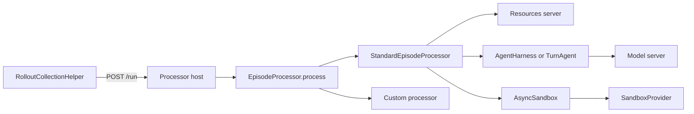
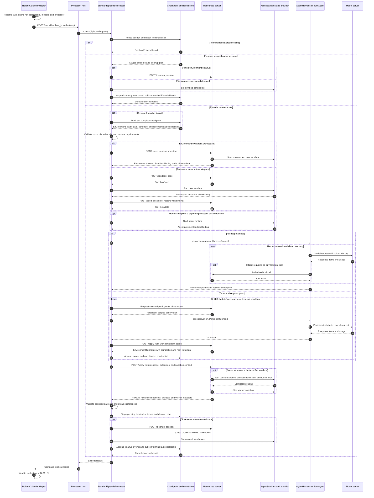

# Episode orchestration: a minimal processor and harness design

Status: proposal, 2026-09-09.

This document defines the smallest architecture that separates episode orchestration from harness behavior, supports sandboxed command-line harnesses, and makes policy-plus-simulated-user episodes possible without adding a mandatory server.

The training compatibility scope is NeMo RL. The contract is based on NVIDIA-NeMo/RL main at `e518e602fbff282dbb1d5033a819b2cdc18cfb12`.

## The short answer

The design adds one pure processor interface, one standard implementation, and two explicit behavior protocols:

- `EpisodeProcessor` defines how the collector asks for one episode result.
- `StandardEpisodeProcessor` implements Gym's normal seed, invoke, verify, stage, cleanup, and publish flow.
- `AgentHarness` owns a complete model-and-tool loop and is called once between seed and verify.
- `TurnAgent` performs one participant activation and yields control to the processor.

The harness protocols are Python interfaces, not server types. The collector still sends `POST /run` to a process hosting an episode processor. That process imports an in-process harness or uses an adapter for a remote or sandbox-placed harness.

The initial design does not add `AgentService`, `/invoke`, `EpisodeLifecycle`, `TurnScheduler`, `RuntimeManager`, generalized runtime leases, or a standalone artifact harvester. Those responsibilities remain concrete code inside `StandardEpisodeProcessor`, existing sandbox infrastructure, or the environment that owns verification.

## An episode is the interaction; a rollout is its exported sample

A task row describes work that can be attempted. The rollout collector selects a row, model and harness configuration, and sampling parameters to request one rollout. The rollout is the durable sample exported to evaluation or training: its primary trajectory, participant records, reward, and provenance.

An episode is the live interaction that produces that rollout. It begins when Gym admits the request and opens or restores task state. It includes harness or participant execution, model calls, tool calls, sandbox operations, and verification. It ends after Gym cleans up episode-owned resources and durably publishes a terminal result.

The initial contract is one episode per rollout. `rollout_id` identifies both the interaction and its exported record. A retryable infrastructure failure keeps `rollout_id`, increments `attempt`, and may adopt the last complete checkpoint. A published terminal result cannot be retried. A deliberate new sample receives a new `rollout_id`.

## The architecture has one rollout-facing server boundary

Today, `RolloutCollectionHelper` sends each row to `POST /run` on an agent server. That server commonly seeds the environment, calls its own `/v1/responses` route, verifies the response, aggregates metrics, and cleans up.

The target keeps the network shape small:



The processor host can be the renamed process that currently hosts an agent server. This keeps the model, processor, and resources server as the normal three deployed processes. A custom processor for an embedded external framework uses the same `/run` boundary.

There is no mandatory harness server and no private `/invoke` endpoint. A `RemoteAgentHarness` may call a user-hosted API, but HTTP is that adapter's implementation rather than Gym's universal harness contract.

## `EpisodeProcessor` is a pure interface

`EpisodeProcessor` defines one asynchronous operation. It does not inherit a concrete `run()` method or prescribe lifecycle phases.

```python
class EpisodeProcessor(Protocol):
    async def process(self, request: EpisodeRequest) -> EpisodeResult:
        ...
```

Dependencies such as the environment client, harness factory, sandbox configuration, event writer, checkpoint store, and clock are injected into concrete processor constructors. They do not travel in an `EpisodeServices` argument on every call.

The transport route remains `POST /run` for compatibility. The route validates a request, calls `process()`, and translates the result into the existing response shape.

### Request and result types are additive

```python
class EpisodeParticipant(BaseModel):
    participant_id: str
    role: str
    agent_ref: AgentRef
    model_bindings: dict[str, ModelRef]


class EpisodeRequest(BaseModel):
    rollout_id: str
    attempt: int
    environment_ref: EnvironmentRef
    task: EpisodeTask
    participants: tuple[EpisodeParticipant, ...]
    primary_participant_id: str
    schedule: ScheduleSpec
    deadline: datetime | None = None
    checkpoint_ref: CheckpointRef | None = None


class EpisodeResult(BaseModel):
    rollout_id: str
    attempt: int
    status: Literal["completed", "failed", "cancelled"]
    agent_ref: AgentRef
    participant_outcomes: tuple[ParticipantOutcome, ...]
    response: Response | None
    terminal_response_id: str | None = None
    reward: float | None
    reward_components: dict[str, float] | None
    instance_config: dict[str, Any]
    artifacts: tuple[ArtifactPayload | DurableArtifactRef, ...] = ()
    cleanup_failures: tuple[CleanupFailure, ...] = ()
    failure: EpisodeFailure | None = None
```

`participant_id` identifies one actor inside an episode. `role` describes that actor's function, such as `policy` or `simulated_user`. A separate seat identifier is unnecessary because participant identifiers already distinguish actors with the same role.

The top-level `agent_ref` remains the compatibility identity of `primary_participant_id`. `EpisodeTask` retains today's `responses_create_params` representation while allowing future task forms.

### Protocol shape and lifecycle behavior remain separate

Python's `Protocol` checks only the `process()` operation. Processor conformance tests enforce behavioral requirements:

- preserve rollout, attempt, participant, and primary-agent identity;
- publish at most one terminal result;
- fence superseded attempts before external effects;
- report cancellation and failures consistently;
- commit checkpoints and event cursors coherently;
- stage verified outcomes before cleanup and publish them only after cleanup evidence is durable;
- clean up resources owned by the processor;
- preserve the NeMo RL result contract.

`StandardEpisodeProcessor` implements these behaviors directly, using private helpers and context managers where useful. A custom processor implements the same pure protocol and passes the same conformance suite. There is no public lifecycle base class.

Custom processors are trusted Gym implementations, not arbitrary plugins. A protocol and conformance suite cannot prevent an implementation from issuing an external effect before it acquires a fence or from omitting cleanup. The initial registry enables only `StandardEpisodeProcessor`. A whole-run processor enters the registry through code review, conformance tests, and benchmark qualification. If several supported processors duplicate the same admission and publication code, Gym can extract a private host wrapper without changing the public protocol.

### The compatibility route synthesizes the typed request

Existing callers do not send an `EpisodeRequest`. `POST /run` must first accept the current `BaseRunRequest`-compatible row and then translate it:

1. Resolve `agent_ref` or `task_source` and the configured environment as current rollout collection does.
2. Use `_ng_rollout_id` when present. Otherwise derive the identity from `_ng_task_index` and `_ng_rollout_index` through the existing rollout-correlation helper.
3. Use `_ng_attempt_index` when present and zero for an initial legacy dispatch.
4. Copy `responses_create_params` and benchmark-specific row fields into `EpisodeTask`.
5. Synthesize one `policy` participant from the resolved `agent_ref`.
6. Select the single-participant full-loop schedule and `StandardEpisodeProcessor`.
7. Validate the resulting `EpisodeRequest`.

On success, the route returns the current `response`, `reward`, `reward_components`, `instance_config`, `agent_ref`, and `terminal_response_id` fields. New participant, artifact, failure, cleanup, and provenance fields are additive. A missing legacy `instance_config` becomes an empty mapping. Retryable attempt errors retain the collector's current retry transport behavior.

## Full-loop harnesses and turn-capable agents are different protocols

The distinction is based on control ownership, not deployment.

### `AgentHarness` owns its model-and-tool loop

An `AgentHarness` is called once after seed and before verify. It may make several model calls and environment tool calls before returning.

```python
class AgentHarness(Protocol):
    async def responses(
        self,
        params: NeMoGymResponseCreateParamsNonStreaming,
        context: HarnessContext,
    ) -> HarnessResult:
        ...


class HarnessResult(BaseModel):
    response: NeMoGymResponse
    checkpoint: HarnessCheckpoint | None = None
```

This matches the control ownership of current `simple_agent.responses()` and most command-line harnesses. A compatibility adapter wraps the current response in `HarnessResult`. The harness does not seed the task, choose a sandbox provider, verify the answer, aggregate metrics, or tear down task state.

`HarnessContext` carries an adopted input checkpoint and a processor-provided asynchronous checkpoint callback. A full-loop harness declares checkpoint support only when it calls that callback at safe internal boundaries and can resume from the saved value. Returning the latest checkpoint in `HarnessResult` covers the boundary after normal harness completion; it does not by itself make an interrupted internal loop resumable.

A harness may use internal subagents. Gym treats those as one opaque harness unless the environment needs to observe and schedule the actors separately.

### `TurnAgent` yields after one participant activation

A `TurnAgent` is called repeatedly by `StandardEpisodeProcessor`. One call represents one logical participant activation, not necessarily one model request.

```python
class TurnAgent(Protocol):
    async def act(
        self,
        observation: ParticipantObservation,
        context: ParticipantContext,
    ) -> TurnResult:
        ...


class TurnResult(BaseModel):
    response_items: tuple[ResponseItem, ...]
    participant_done: bool
    checkpoint: ParticipantCheckpoint | None = None
```

`interaction_protocol` declares which call shape a configured implementation supports:

```yaml
interaction_protocol: full_loop
```

or:

```yaml
interaction_protocol: turn
```

A full-loop harness can complete a normal single-participant episode. It cannot be externally interleaved with another participant. Native policy-plus-simulated-user execution requires turn-capable participants. An external framework such as Tau2 can remain a custom processor until its actors are adapted to the turn protocol.

These protocols do not share a base class and do not create separate server types.

## Responsibilities stay with the components that know the behavior

The environment owns:

- datasets and task-row schemas;
- task initialization and state;
- environment tools and participant-visible observations;
- task workspace requirements;
- patch, deliverable, and other submission extraction;
- verification and any fresh verifier runtime;
- metric aggregation;
- environment-owned sandbox cleanup;
- environment-state export and restore.

The full-loop harness owns:

- its model-and-tool loop;
- harness-specific prompting and compaction;
- use of a provided task workspace;
- harness-local checkpoint state when supported;
- harness usage and model-call attribution.

The turn-capable agent owns:

- one participant's action for one activation;
- participant-local state and checkpoint output;
- participant-attributed usage and response items.

`StandardEpisodeProcessor` owns:

- request validation and compatibility translation;
- attempt fencing and terminal-result publication;
- choosing the full-loop or turn interaction path;
- schedule advancement for turn-capable participants;
- processor-owned sandbox creation and cleanup;
- ordering seed, execution, verification, staging, cleanup, and publication;
- event and checkpoint coordination;
- cancellation propagation.

The model server remains responsible for inference, admission, token capture, and model-call capture.

## The standard lifecycle is concrete

The standard processor follows this sequence:

| Phase | Concrete behavior |
| --- | --- |
| Admit | Resolve identity, acquire the attempt fence, and return an existing terminal result if one has already been published. |
| Restore | Read the last complete checkpoint when the request resumes a retryable attempt. |
| Validate | Resolve every referenced environment, harness or turn agent, model, interaction protocol, sandbox requirement, and schedule before model compute. |
| Open task state | Ask the environment to seed or restore its session. If the processor owns the task workspace, request `/sandbox_spec`, start `AsyncSandbox`, and pass its binding to seed. |
| Execute | Call one full-loop `AgentHarness`, or repeatedly select and invoke turn-capable participants according to `ScheduleSpec`. Apply every turn result to the environment before selecting another participant. |
| Verify | Call the verify owner while required sandboxes remain alive. The environment extracts patches or deliverables, inspects live state, or creates a fresh verifier runtime as its benchmark requires. Validate that scalar reward equals the sum of reward components when components are present. |
| Validate artifacts | Accept bounded inline artifact payloads or references that are already durable and independent of sandbox lifetime. |
| Stage outcome | Durably save the response, verification result, artifact references, event cursor, cleanup targets, and per-target completion markers as a pending terminal outcome. A retry can resume cleanup without repeating execution or verification. |
| Clean up | Ask the environment to close environment-owned state and stop every sandbox owned by the processor. Append cleanup failures without replacing the response or reward. |
| Publish | Atomically commit one terminal `EpisodeResult` and its final event cursor after cleanup has completed or its failures have been recorded. |

Cancellation follows the same cleanup path. Time-to-live remains a crash backstop rather than the normal teardown mechanism.

There is no generic harvest phase. Submission extraction is part of environment-owned verification. If several environments later require artifact export independently of verification, Gym can extract a shared environment-side helper from demonstrated implementations.

`EpisodeResult(status="failed")` is a published terminal failure. A failure that may be retried does not publish an `EpisodeResult`. `process()` raises a typed `RetryableEpisodeError` containing `failure_kind`, the failed attempt, and the last complete checkpoint reference. The host maps it to the existing retryable transport behavior. A later attempt either adopts that checkpoint or resumes cleanup from a staged outcome.

The pending outcome's cleanup plan is a private durable record, not another service. For environment-owned state, it contains the environment reference, session identifier, and cleanup idempotency key. For each processor-owned sandbox, it contains the provider reference and a provider-specific descriptor sufficient to stop that sandbox after a host restart. Completion markers make each cleanup operation repeatable. These descriptors authorize cleanup only inside the trusted processor; they are not participant credentials or resumable checkpoint state.

## The full sequence starts in `RolloutCollectionHelper`



If execution fails before the outcome is staged, the processor records the attempt failure and follows the same cleanup path. A collector retry uses the same `rollout_id` with a higher attempt and may adopt a complete checkpoint. If the outcome was staged, a retry completes idempotent cleanup and publishes it without repeating execution or verification. If publication succeeded before acknowledgement was lost, the store returns the existing result.

## Sandbox ownership is explicit without a runtime control plane

Gym already has `AsyncSandbox`, `SandboxProvider`, `SandboxSpec`, and the optional `ConnectableProvider` capability. The initial processor design uses those APIs directly.

A small data record makes each sandbox's role and cleanup owner visible:

```python
class SandboxBinding(BaseModel):
    name: str
    roles: frozenset[Literal["task_workspace", "agent_runtime", "verifier_runtime"]]
    owner: Literal["processor", "environment"]
    provider_ref: str
    descriptor: dict[str, Any] | None = None
```

`SandboxBinding` is episode data, not a manager or service. The live `AsyncSandbox` object remains with its owner.

An episode may have several sandboxes:

- an environment-owned task workspace created during seed;
- a processor-owned agent runtime when the harness executes outside the task workspace;
- an environment-owned fresh verifier sandbox created during verify;
- separate participant runtimes when a future multi-agent benchmark requires them.

One physical sandbox has one owner and can carry several roles. When a CLI harness executes inside an environment-owned task workspace, that sandbox is both the task workspace and agent runtime. The processor and harness borrow it and do not create or close a second binding. The environment closes every sandbox it creates through idempotent `/cleanup_session`, including a verifier sandbox left behind by failed verification. Each environment operation still uses `finally` for prompt cleanup. The processor closes only distinct `AsyncSandbox` instances it created. An `AsyncExitStack` can manage several processor-owned instances without another abstraction.

### Current SWE-bench demonstrates the multi-sandbox case

The current resources server creates an original task sandbox in `seed_session()` and stores it in `_session_id_to_sandbox`. During `verify()`, it creates a fresh evaluation sandbox, extracts the patch from the original sandbox, runs verification in the fresh sandbox, and stops both.

The placement proof of concept improves the handoff by returning a typed `SandboxWorkspace` containing a provider reference and `AsyncSandbox.serialize()` descriptor. Its documentation correctly states that the environment still owns cleanup while the harness borrows access.

The target retains that ownership model. It replaces a bare sandbox ID with a typed binding and requires idempotent environment cleanup. It does not add a global owner.

### Cross-process sharing remains a provider capability

In the current repository, `ConnectableProvider` defines `serialize_handle()` and `connect()`. OpenSandbox and E2B implement the complete capability. Both return a sandbox ID rather than a scoped credential. Docker, Apptainer, Enroot, OpenShell, Daytona, and Fargate do not currently implement the complete serialization contract in this checkout.

The first implementation therefore applies these rules:

- An in-process harness receives the live `AsyncSandbox` object when it needs one.
- A sandbox worker uses `AsyncSandbox.exec()`, upload, and download as the placement proof of concept does.
- A resources server receives a descriptor only when the selected provider supports reconnection.
- A topology that requires unsupported cross-process access fails preflight or remains on its legacy route.
- A connected borrower never performs cleanup; it asks the recorded owner to close the sandbox.
- A production processor owns a sandbox only when its provider can persist enough identity to stop it after processor restart.
- An environment-owned production sandbox has an idempotent cleanup route backed by durable session-to-sandbox identity rather than process memory alone.

A future sandbox server can front a local-only provider when a process on another host must execute against it. Scoped access tokens become necessary only when that server must distinguish operations such as execute, inspect, and close. That capability should be designed with the sandbox server rather than introduced now as a provider-independent `RuntimeManager`.

## Runtime requirements remain concrete

A harness declares facilities required by its behavior:

```yaml
requirements:
  isolation:
    boundary: container
    untrusted_code: true
  subprocess: true
  pty: true
  filesystem:
    writable_workspace: true
    persistence: episode
  network:
    destinations:
      - binding: policy_model
      - binding: environment_mcp
  checkpoint:
    supported: false
```

The requirement model covers isolation, subprocesses, PTY behavior, filesystem access, network destinations, resource limits, cancellation, file transfer, persistence, and checkpoint support.

Placement is resolved from harness requirements, environment workspace requirements, provider capabilities, and deployment policy. A configuration does not classify harnesses into broad profiles.

Command-line harnesses such as OpenCode, Claude Code, and Codex execute third-party programs with filesystem, process, and network access. Production execution requires an approved sandbox. Missing isolation is a preflight error; there is no unsandboxed production fallback.

A simple Python harness can run in the processor process. A trusted helper can use a local subprocess when policy permits, but a subprocess is not a security boundary.

## The placement proof of concept becomes an adapter

The `upstream/ffrujeri/sandboxes` branch demonstrates useful mechanics:

- reconnect to an environment-owned `SandboxWorkspace` or create a processor-owned runtime;
- upload a typed request and worker;
- install harness dependencies during development;
- execute the worker with `AsyncSandbox.exec()`;
- download its response;
- reject conflicting placement configuration;
- attempt cleanup in `finally`.

The final processor keeps these mechanics but removes episode orchestration from `SandboxedAgentHost`. `StandardEpisodeProcessor` owns seed, verification, publication, and cleanup ordering. A sandbox harness adapter only stages and invokes the harness.

The proof worker currently creates an ASGI application and calls the harness's `/v1/responses` route inside the sandbox. The target can initially retain that compatibility behavior. A later worker may import `AgentHarness.responses()` directly. Neither path requires `/invoke` or a long-running server inside the sandbox.

Production images should contain pinned harness and Gym dependencies. Per-task dependency installation remains a development path.

## Submission extraction belongs to the environment

The processor does not inspect arbitrary workspace paths. It passes the primary response, participant outcomes, and authorized sandbox bindings to `/verify` while required task state is alive.

The environment decides whether verification:

- inspects the live task workspace;
- extracts a patch and applies it in a fresh verifier sandbox;
- packages named deliverables;
- reads structured outputs directly from the response.

The verify response may include bounded artifact payloads or references that are already durable:

```python
class VerifyResult(BaseModel):
    reward: float
    reward_components: dict[str, float] | None = None
    artifacts: tuple[ArtifactPayload | DurableArtifactRef, ...] = ()
```

For SWE-bench, the environment generates the canonical Git patch. For GDPVal, it selects and packages deliverables. For CVDP, it selects valid RTL files. For Terminal Bench, verification may inspect live state and return no artifact. A verifier receives only bindings it needs; it does not receive provider configuration or cleanup ownership.

The environment never returns a path that is valid only inside a sandbox that will be destroyed. A bounded payload is stored inline in the pending terminal outcome, so the existing checkpoint and result store makes it durable before cleanup. The collector's output writer may externalize that payload after `/run` returns. A large artifact must already have a durable content-addressed URI. Common path validation, byte limits, digesting, and packaging can be shared library functions used by environments. They do not constitute a separate artifact service or ownership boundary.

## Multi-agent episodes use turn-capable participants

`fan_out` creates independent rollouts with separate task state. It does not create participants in one episode.

A policy-plus-simulated-user request declares both participants:

```yaml
agent_ref:
  name: customer_support_agent
episode:
  primary_participant_id: policy
  participants:
    - participant_id: policy
      role: policy
      agent_ref: customer_support_agent
      interaction_protocol: turn
    - participant_id: user
      role: simulated_user
      agent_ref: customer_simulator
      interaction_protocol: turn
  schedule:
    implementation: environment_directed
```

`ScheduleSpec` is data interpreted by `StandardEpisodeProcessor`. Initial schedule implementations can be ordinary private functions for fixed alternation and environment-directed selection. Gym should introduce a public scheduler protocol only after independent scheduler plugins are required.

On each activation, the processor:

1. selects the next participant according to the schedule;
2. asks the environment for that participant's visible observation;
3. calls only that participant's `TurnAgent.act()`;
4. submits the participant action to the environment's `/apply_turn` operation;
5. records the returned environment state, participant-attributed output, model usage, events, and checkpoint state;
6. advances the schedule until the environment reports episode completion.

`EnvironmentTurnState` records whether the episode is complete and, for an environment-directed schedule, which participant acts next. `participant_done` means that one actor has no more actions. It does not terminate environment-owned interaction by itself. The processor validates every environment-directed participant against the request before invocation.

Preflight rejects a multi-participant schedule containing a full-loop harness. A full-loop harness may still use internal subagents, but those actors are not independently visible to Gym.

## Checkpointing coordinates episode state

A partial-rollout checkpoint records a durable boundary before terminal publication. It contains:

- rollout and attempt identity plus the current fence;
- the event cursor;
- an environment snapshot sufficient to initialize replacement task state;
- harness or participant snapshots sufficient to initialize replacement runtimes;
- schedule position;
- every turn-capable participant's checkpoint;
- a full-loop harness checkpoint when that harness supports one;
- external-effect idempotency records;
- pending-outcome and terminal-publication state.

The checkpoint commit occurs only after all referenced state is durable. A sandbox identifier is not checkpoint state because normal failure cleanup stops the sandbox. The initial contract requires snapshots that can reconstruct state in replacement sandboxes. A future provider-specific retention policy may keep a live sandbox until checkpoint expiry, but that is an optimization with explicit ownership and cost policy.

A retry acquires a newer attempt fence before adopting a prior checkpoint. External-effect keys derive from rollout and logical effect identity rather than the attempt number, so a newer attempt observes a prior committed effect instead of repeating it.

Blackbox full-loop harnesses may initially declare `checkpoint.supported: false`. A reconnectable filesystem does not prove that a CLI process can resume correctly. A checkpoint-capable full-loop harness calls the context callback at safe internal boundaries. Turn-capable agents naturally provide boundaries between activations but must still serialize their participant-local state.

## Identity and NeMo RL compatibility do not change

`agent_ref.name` remains the materialized-row identity, result identity, metric grouping key, and NeMo RL training-subject identity. `_ng_rollout_id` remains the token-capture receipt identity.

At NVIDIA-NeMo/RL main commit `e518e602fbff282dbb1d5033a819b2cdc18cfb12`, NeMo RL consumes:

- the synchronously resolved `row["agent_ref"]["name"]`;
- the returned `agent_ref`;
- `_ng_rollout_id` receipt mode;
- `response.output`;
- `terminal_response_id` for fail-closed terminal-call attribution;
- scalar `reward`;
- optional `reward_components`;
- `instance_config.mask_sample`;
- completion accounting.

The processor host preserves these fields and semantics. When `reward_components` is present, scalar `reward` equals `sum(reward_components.values())`. Internal processor identity and sandbox placement appear only as additive provenance.

For a multi-participant episode, top-level `response.output` and `terminal_response_id` identify only the primary participant's trainable trajectory. Primary-participant model calls keep `_ng_rollout_id` as their capture identity. Every non-primary participant receives a separate capture identity recorded in its participant outcome, so its calls never enter the primary manifest. This preserves the pinned NeMo RL receipt path without requiring NeMo RL to filter a shared manifest by participant.

Metric aggregation remains with the verify owner. Compatibility routing may accept `/aggregate_metrics` on the old agent endpoint and delegate it without computing metrics there.

## Cross-rollout planning remains above the processor

An `EpisodeProcessor` receives one selected row and returns one terminal result. It does not choose later rows.

GDPVal's adaptive stages use earlier results to select later tasks and references. That belongs in `rollout_collection_driver` today or a future planner above episode execution. A custom episode processor can implement one GDPVal row's interaction and verification but cannot replace cross-rollout planning.

## Configuration composes references

One possible additive shape is:

```yaml
resources_servers:
  swebench:
    entrypoint: app.py
    datasets:
      - name: verified
        jsonl_fpath: data/verified.jsonl

agent_harnesses:
  opencode:
    entrypoint: app.py
    interaction_protocol: full_loop
    model_bindings:
      policy: policy_model
    requirements:
      isolation:
        boundary: container
        untrusted_code: true
      subprocess: true
      pty: true
      filesystem:
        writable_workspace: true

episode_processors:
  swebench:
    implementation: standard
    environment: swebench
    harness: opencode
```

During migration, the existing `responses_api_agents` configuration remains accepted. Its `agent_ref` resolves to a processor host and harness pair. Omitting an explicit processor selects `StandardEpisodeProcessor`.

The processor process runs in a compatible harness environment, as current agent servers do. A `RemoteAgentHarness` handles a non-Python, externally hosted, deliberately isolated, or dependency-incompatible implementation.

## This factorizes the onboarding matrix

The Nemotron 3.5 Super Harness Benchmark Matrix contains 13 harnesses, four benchmarks, and five models: 260 evaluation combinations.

The architecture aims for:

- one adapter per harness;
- one task, workspace, submission, and verifier contract per benchmark;
- one model binding per API shape;
- generated composition for every compatible cell;
- real-rollout qualification for all 260 cells.

This is not a claim that every combination succeeds. Preflight must distinguish an unsupported combination from a weak score. Pair-specific orchestration code indicates a missing harness, environment, runtime, or model contract.

Harness software must also layer onto benchmark images without maintaining one image per matrix cell. Prepared benchmark images, prepared harness layers, and the sandbox worker's development-time dependency staging are implementation work required to preserve the factorization.

## Validation fails before compute

Preflight checks:

- every environment, processor, participant, harness or turn agent, and model reference exists;
- `primary_participant_id` matches the top-level `agent_ref`;
- the declared interaction protocol matches the selected processor path;
- multi-participant schedules use turn-capable agents;
- CLI harnesses resolve to an approved sandbox;
- environment and harness filesystem, PTY, network, image, and resource requirements are compatible;
- required cross-process workspace access uses a connectable provider;
- checkpointing is requested only when every required component supports it;
- the verify owner also owns metric aggregation.

Post-execution validation also checks that `terminal_response_id` belongs to the primary response, non-primary model calls use separate capture identities, reward components sum to scalar reward, and artifact references are durable. Errors identify the failed contract. They do not report only that a harness and benchmark are incompatible.

## Work starts according to dependencies

| Work can start | Work | Gate before dependent work |
| --- | --- | --- |
| Immediately | Add processor request/result types, `AgentHarness`, `TurnAgent`, interaction-protocol metadata, characterization tests, NeMo RL contract tests, runtime-requirement inventory, and routing controls. Build prepared CLI images and harness layers independently. | Existing behavior and compatibility fields are captured by executable tests. |
| After processor and harness contracts are approved | Implement legacy request synthesis and `StandardEpisodeProcessor` behind opt-in routing. Move `simple_agent` to an in-process `AgentHarness`. | Legacy and processor routes produce equivalent observable behavior on deterministic fixtures and real canaries. Retry tests cover pending-outcome recovery. |
| After `SandboxBinding` ownership and cleanup rules are approved | Integrate the sandbox worker adapter and environment-owned workspace handoff. | Fault-injection tests prove cleanup, cancellation, provider validation, and no host fallback. |
| After the turn protocol, observation visibility, and schedule data are approved | Implement policy-plus-simulated-user execution inside `StandardEpisodeProcessor`. | A two-participant synthetic episode preserves visibility and token attribution. |
| After standard and sandbox canaries pass | Migrate harnesses and benchmark topologies in priority order. | Each topology passes its focused real-rollout and verifier qualification. |
| After topology baselines and NeMo RL qualification pass | Change default routing for the qualified set. | Operational evidence confirms result compatibility and cleanup behavior. |
| After no supported configuration uses legacy lifecycle code | Remove compatibility routes and duplicate agent-side orchestration. | Deprecation evidence and a rollback release are available. |

Cross-host access for local-only providers is not a gate for the processor or in-process harness work. It becomes a separate sandbox-server dependency only for topologies that require it.

## Migration risk is controlled in layers

### Characterization tests

Deterministic tests record current request and result schemas, legacy request synthesis, seed and verify calls, identity propagation, terminal response selection, reward fields, artifact durability, cancellation, timeout, staged-outcome recovery, and cleanup. The same fixture runs through the legacy and processor routes. These are not benchmark reruns.

### Recorded replay

Captured requests and responses test schema translation, routing, event attribution, and failure mapping without repeating side effects.

Live old-and-new shadow execution is unsafe for stateful tasks. Real comparisons use distinct rollout IDs, sessions, workspaces, and sandboxes. Nondeterministic model behavior is compared across repeated-run distributions rather than exact trajectories.

### Targeted real rollouts

Each migrated harness runs a fixed canary with its real model loop, environment, sandbox, and verifier. Reviewers inspect trajectories, tool behavior, rewards, participant attribution, cleanup, and token capture.

The canary set covers:

- one in-process full-loop harness;
- one sandbox-placed full-loop CLI harness;
- one environment-owned task workspace;
- one fresh verifier sandbox;
- one artifact-oriented benchmark;
- one policy-plus-simulated-user episode;
- NeMo RL collection and postprocessing.

### Reversible routing

Routing is selected before seed or sandbox creation. A failed canary changes configuration for later episodes; an in-flight episode never switches implementations.

Each harness moves in separate changes:

1. Preserve its existing `/run` behavior behind the legacy route.
2. Extract its full-loop behavior into `AgentHarness` without changing placement.
3. Route the existing processor host through `StandardEpisodeProcessor`.
4. Move CLI execution through the sandbox worker without changing the harness contract.
5. Remove legacy orchestration only after its real-rollout canary passes.

Rollback for a CLI harness never means silently executing on the host.

## Decisions

- `EpisodeProcessor` is a pure protocol with one `process()` method.
- `StandardEpisodeProcessor` contains the normal lifecycle as concrete code. There is no processor base implementation.
- Custom processors are trusted, reviewed Gym implementations and are not enabled as arbitrary plugins.
- `AgentHarness` is an in-process full-loop protocol, not a server.
- `TurnAgent` is a separate turn-capable protocol for processor-scheduled participants.
- `POST /run` is the sole required rollout-facing processor route.
- There is no private `/invoke` route or mandatory `AgentService`.
- `RemoteAgentHarness` is an optional HTTP-backed implementation, not the universal interface.
- `ScheduleSpec` is data interpreted by the standard processor. There is no public scheduler protocol initially.
- Existing `AsyncSandbox` and `SandboxProvider` remain the runtime APIs.
- `SandboxBinding` records roles and cleanup ownership. It is not a runtime manager.
- The environment owns submission extraction, verification, verifier runtimes, and metric aggregation.
- The processor owns only the sandboxes it creates and calls environment cleanup for environment-owned state.
- Cross-host scoped access is deferred to the sandbox server use case that requires it.
- Bounded verification artifacts are stored in the pending outcome, and large artifacts already have durable references before sandbox cleanup.
- A pending terminal outcome includes a durable cleanup plan, so a restarted processor can finish owner-directed cleanup without repeating execution or verification.
- `agent_ref.name`, `_ng_rollout_id`, response output, reward fields, and sample masking retain their NeMo RL meanings.
- `fan_out` remains repeated independent evaluation.
- Native multi-agent execution requires turn-capable participants.
- Partial checkpointing coordinates reconstructable environment and participant snapshots, schedule, events, external effects, fencing, and publication.

## Deferred abstractions

The design deliberately does not introduce these concepts until repository evidence requires them:

- `EpisodeLifecycle`: use private standard-processor helpers first; extract a reusable object only when supported custom processors duplicate the same machinery.
- `TurnScheduler`: use private schedule functions first; introduce a protocol only when independent scheduler plugins exist.
- `RuntimeManager` and provider-independent leases: design them with a sandbox server when cross-host access to local-only providers is required.
- `ArtifactHarvester` and `ArtifactStore`: keep extraction in environments, bounded payloads in the pending outcome, and large values behind durable references until artifacts need an independent lifecycle.
- `AgentService` and `/invoke`: use direct Python calls, the sandbox worker adapter, or `RemoteAgentHarness`.
