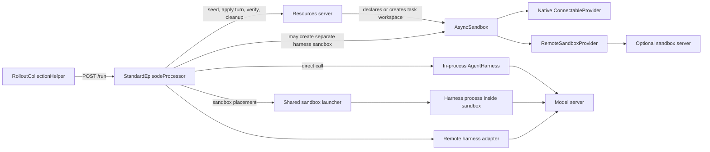
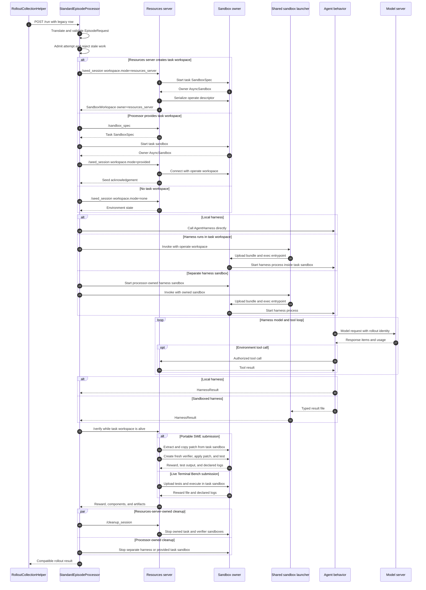

# Episode orchestration with first-class sandbox placement

Status: proposal, 2026-09-10.

## Why Gym needs an episode processor

Today, rollout collection sends `POST /run` to a response agent. The response agent commonly initializes benchmark state, runs the agent loop, asks the resources server to verify the result, and cleans up. This works for simple single-agent evaluations, but it leaves three responsibilities unclear:

- who coordinates an episode when several participants take turns;
- where a command-line harness runs when the benchmark owns a task sandbox;
- who may operate or destroy each sandbox during execution, verification, retry, and cleanup.

This proposal makes those responsibilities explicit. The resources server continues to define the benchmark and own verification. The agent harness continues to define model-facing behavior. A standard episode processor coordinates them and records one durable rollout result.

The proposal supports local Python agents, command-line harnesses inside benchmark workspaces, host-side harnesses that use sandbox-backed tools, and policy-plus-simulated-user episodes. It preserves the NeMo RL contract described later in this document.

## An episode is the interaction and a rollout is the exported sample

A task row describes work that can be attempted. The rollout collector combines the row with an agent, model, and sampling configuration to request a rollout. The rollout is the durable sample exported to evaluation or training.

An episode is the live interaction that produces the rollout. It begins when Gym admits the request and opens or restores task state. It includes harness execution, participant turns, model calls, tool calls, sandbox operations, and verification. It ends after Gym records cleanup and durably publishes a terminal result.

The initial contract is one episode per rollout. `rollout_id` identifies the interaction and its exported record. A retryable infrastructure failure keeps `rollout_id`, increments `attempt`, and restarts from the original input. A deliberate new sample receives a new `rollout_id`. Optional partial continuation is described separately.

## One episode in plain terms

The normal flow is:

1. `RolloutCollectionHelper` sends one task to the processor host through `POST /run`.
2. The processor asks the resources server to initialize task state.
3. If the task needs a sandbox, the resources server creates it or the processor creates one from the benchmark's `SandboxSpec`.
4. The processor invokes the harness locally or starts it inside an approved sandbox.
5. The harness calls the model and the resources server's task tools.
6. The processor asks the resources server to verify the outcome while required task state is still alive.
7. The component that created each sandbox destroys it.
8. The processor publishes one terminal result for evaluation or NeMo RL.

The rest of this document defines the data exchanged at each step and the ownership rules that make the sequence safe.

## The component relationship is explicit



The resources server defines the benchmark. The processor orders the episode. The harness implements agent behavior. Sandbox infrastructure provides execution and task state but does not decide episode policy.

The resources server may create the task sandbox because it knows the task image and verification requirements. The processor may create a task sandbox from a resources-server `SandboxSpec` or create a distinct harness sandbox when the task sandbox cannot host the harness. One physical sandbox has one logical lifecycle owner.

## Contracts introduced by this proposal

The architecture introduces:

- `EpisodeProcessor`, the pure interface that converts one episode request into one result.
- `StandardEpisodeProcessor`, the concrete seed, execute, verify, cleanup, and publication implementation.
- `AgentHarness`, the full-loop agent behavior interface.
- `TurnAgent`, the optional turn-level interface required when Gym schedules visible participants such as a policy and simulated user.
- `WorkspaceRequest` and `SandboxWorkspace`, which make task-sandbox creation, access, and ownership explicit on `/seed_session`.
- `AgentRuntimeConfig`, which declares where a harness runs and what facilities it needs.

## Types reused from Gym

The proposal builds on these existing Gym types:

- `ResourcesServerRef` identifies the resources server responsible for task state, tools, verification, and metric aggregation.
- `ModelServerRef` identifies a configured model server.
- `AgentServerRef` identifies a configured response agent and preserves the current `agent_ref` discriminator and name.
- Each resources server's `TaskData` schema validates its normalized task-owned row fields.
- `NeMoGymResponseCreateParamsNonStreaming` and `NeMoGymResponse` remain the harness request and response representations.
- `NeMoGymResponseInputItem` and `NeMoGymResponseOutputItem` remain the typed turn payload items.
- `BaseRunRequest`, `BaseSeedSessionRequest`, `BaseSeedSessionResponse`, `BaseVerifyRequest`, and `BaseVerifyResponse` remain compatibility surfaces.
- `SandboxSpec` describes an image, working directory, files, ports, environment, resources, timeout, and provider options.
- `SandboxResources` describes provider-neutral CPU, memory, disk, and GPU requests.
- `SandboxHandle` contains the provider-neutral sandbox identifier and opaque provider state.
- `AsyncSandbox` is the live asynchronous control object.
- `SandboxProvider` performs provider-specific operations.
- `ConnectableProvider` adds `serialize_handle()` and `connect()` for cross-process access.
- `ServerClient` is Gym's existing downstream server client.

Every other named type introduced by this proposal is defined below.

The optional sandbox-server path depends on three types proposed by [PR #2085](https://github.com/NVIDIA-NeMo/Gym/pull/2085): `SandboxServerRef` identifies the server, `RemoteSandboxProvider` implements the provider API over HTTP, and `SandboxRef` carries scoped access to one server-owned sandbox. Native connectable providers do not use these types.

## Complete definitions of episode data

### `EpisodeParticipant`

```python
class EpisodeParticipant(BaseModel):
    participant_id: str = Field(min_length=1)
    role: str = Field(min_length=1)
    agent_ref: AgentServerRef
    model_bindings: dict[str, ModelServerRef] = Field(min_length=1)
    interaction_protocol: Literal["full_loop", "turn"]
```

`EpisodeParticipant` identifies one actor visible to Gym. `participant_id` distinguishes actors inside one episode. `role` describes behavior such as `policy` or `simulated_user`. `interaction_protocol` states whether the processor calls the actor once or schedules repeated turns. Internal subagents remain a harness implementation detail.

### `ScheduleSpec`

```python
class ScheduleSpec(BaseModel):
    kind: Literal["single", "environment_directed"]
    max_turns: int = Field(default=128, ge=1)
```

`ScheduleSpec` bounds execution and selects a scheduling behavior. `single` requires exactly one full-loop participant. `environment_directed` requires turn-capable participants and lets the resources server name the next participant.

### `ArtifactPayload` and `DurableArtifactRef`

```python
class ArtifactPayload(BaseModel):
    name: str = Field(min_length=1)
    media_type: str = Field(min_length=1)
    content_b64: str
    sha256: str = Field(pattern=r"^[0-9a-f]{64}$")


class DurableArtifactRef(BaseModel):
    name: str = Field(min_length=1)
    media_type: str = Field(min_length=1)
    uri: str = Field(min_length=1)
    sha256: str = Field(pattern=r"^[0-9a-f]{64}$")
    size_bytes: int = Field(ge=0)
```

`ArtifactPayload` carries a bounded artifact in the episode result. `DurableArtifactRef` names a larger content-addressed artifact that the environment persisted before verification returned. A sandbox-local path is not a durable artifact because cleanup may destroy the sandbox before the caller consumes the result.

### `ParticipantOutcome`

```python
class ParticipantOutcome(BaseModel):
    participant_id: str
    role: str
    agent_ref: AgentServerRef
    response: NeMoGymResponse | None = None
    capture_rollout_id: str
```

`ParticipantOutcome` records each visible actor without mixing simulated-user or critic output into the primary policy trajectory. Non-primary participants use separate capture identifiers so their model calls do not enter NeMo RL's primary token-capture manifest.

### `CleanupFailure` and `EpisodeFailure`

```python
class CleanupFailure(BaseModel):
    owner: Literal["resources_server", "episode_processor"]
    operation: str
    error_type: str
    message: str


class EpisodeFailure(BaseModel):
    kind: Literal[
        "invalid_request",
        "incompatible_runtime",
        "harness",
        "environment",
        "verification",
        "infrastructure",
        "cancelled",
    ]
    message: str
```

`CleanupFailure` preserves cleanup evidence without replacing a valid response or reward. `EpisodeFailure` gives the collector a stable failure classification. Transport distinguishes retryability: terminal failures appear in `EpisodeResult`; retryable attempt failures are carried by `RetryableEpisodeError`.

### `EpisodeRequest`

```python
class EpisodeRequest(BaseRunRequest):
    rollout_id: str = Field(min_length=1)
    attempt: int = Field(ge=0)
    resources_server: ResourcesServerRef
    task_data: dict[str, Any]
    instance_config: dict[str, Any] = Field(default_factory=dict)
    participants: tuple[EpisodeParticipant, ...] = Field(min_length=1)
    primary_participant_id: str
    schedule: ScheduleSpec
    deadline: datetime | None = None
```

`EpisodeRequest` is the complete input to one processor invocation. The inherited `responses_create_params` contains model-visible input. `task_data` contains the normalized task-owned row fields and is validated against the resolved resources server's `TaskData` adapter before dispatch. The processor otherwise treats it as opaque. `resources_server` identifies the benchmark server that owns task state, tools, and verification. Validation also requires unique participant identifiers, a declared primary participant, and a schedule compatible with every participant protocol.

### `EpisodeResult`

```python
class EpisodeResult(BaseModel):
    rollout_id: str
    attempt: int
    status: Literal["completed", "failed", "cancelled"]
    agent_ref: AgentServerRef
    participant_outcomes: tuple[ParticipantOutcome, ...]
    response: NeMoGymResponse | None
    terminal_response_id: str | None = None
    reward: float | None
    reward_components: dict[str, float] | None
    instance_config: dict[str, Any]
    artifacts: tuple[ArtifactPayload | DurableArtifactRef, ...] = ()
    cleanup_failures: tuple[CleanupFailure, ...] = ()
    failure: EpisodeFailure | None = None
```

`EpisodeResult` is the terminal value returned to rollout collection. The calling evaluation or training framework decides when that result is durably accepted. `agent_ref`, `response`, `terminal_response_id`, reward fields, and `instance_config` preserve the current NeMo RL contract. `EpisodeResult(status="failed")` is terminal; a retryable attempt raises `RetryableEpisodeError` instead of returning this result.

### `RetryableEpisodeError`

```python
class RetryableEpisodeError(RuntimeError):
    def __init__(self, failure: EpisodeFailure) -> None:
        self.failure = failure
        super().__init__(failure.message)
```

`RetryableEpisodeError` tells the processor host to preserve the current collector retry behavior without publishing a terminal failed rollout. The host constructs it after classifying an attempt failure as retryable.

## Complete definitions of harness behavior

### `HarnessContext`

```python
@dataclass(frozen=True)
class HarnessContext:
    rollout_id: str
    attempt: int
    participant_id: str
    role: str
    resources_server: ResourcesServerRef
    model_bindings: Mapping[str, ModelServerRef]
    server_client: ServerClient
    workdir: str | None
    deadline: datetime | None
    is_cancelled: Callable[[], bool]
```

`HarnessContext` contains execution metadata and trusted Gym capabilities. It is not model input. It never contains an owner sandbox descriptor, provider credentials, verifier metadata, or another participant's private input.

When a harness process runs inside a task sandbox, `workdir` is a local path such as `/testbed`. The host-side invocation code owns the connected `AsyncSandbox`; the guest harness does not.

### `HarnessResult`

```python
class HarnessResult(BaseModel):
    response: NeMoGymResponse
```

`HarnessResult` wraps the current response shape so harness-specific metadata can be added later without changing the behavior method. Partial-rollout continuation is an optional capability described separately and is not part of this base result.

### `AgentHarness`

```python
class AgentHarness(Protocol):
    async def responses(
        self,
        params: NeMoGymResponseCreateParamsNonStreaming,
        context: HarnessContext,
    ) -> HarnessResult:
        ...
```

`AgentHarness` is the full-loop behavior contract. One call may contain several model and tool exchanges. It does not seed, verify, select a provider, install itself, or clean up a sandbox.

### `TurnInput`

```python
class TurnInput(BaseModel):
    participant_id: str
    role: str
    turn_index: int = Field(ge=0)
    input_items: tuple[NeMoGymResponseInputItem, ...]
```

`TurnInput` is the environment-produced, serializable information visible to one participant for one activation. The processor may record and replay it. `HarnessContext` separately supplies trusted capabilities that must not become model-visible input.

### `TurnResult`

```python
class TurnResult(BaseModel):
    output_items: tuple[NeMoGymResponseOutputItem, ...]
    participant_done: bool = False
```

`TurnResult` contains one participant's action and state. `participant_done` does not end the episode; only the resources server determines that environment-owned interaction is complete.

### `TurnAgent`

```python
class TurnAgent(Protocol):
    async def act(
        self,
        turn: TurnInput,
        context: HarnessContext,
    ) -> TurnResult:
        ...
```

`TurnAgent` is separate from `AgentHarness` because externally scheduled multi-agent execution requires the processor to regain control between participants. Full-loop and turn-level agents both receive `HarnessContext`.

### `_GuestHarnessRequest`

```python
class _GuestHarnessRequest(BaseModel):
    protocol: Literal["full_loop", "turn"]
    rollout_id: str
    attempt: int
    participant_id: str
    role: str
    harness_import: str | None = None
    harness_config: dict[str, Any] = Field(default_factory=dict)
    response_params: NeMoGymResponseCreateParamsNonStreaming | None = None
    turn: TurnInput | None = None
    resources_server_url: str
    model_server_urls: dict[str, str]
    workdir: str | None = None
    deadline: datetime | None = None
    result_path: str
    credential_files: dict[str, str] = Field(default_factory=dict)
```

`_GuestHarnessRequest` is the private serialized boundary for a harness process started inside a sandbox. It is not part of the episode API. `harness_import` identifies an importable Gym-native agent class when the generic Python worker is used. `harness_config` is the validated, redacted agent configuration with sandbox placement disabled so guest construction cannot launch another sandbox. A custom non-Python entrypoint may implement the same request and result file protocol without `harness_import`. `full_loop` requires `response_params` and forbids `turn`; `turn` requires `turn` and forbids `response_params`. `credential_files` maps logical bindings to files readable only by the configured guest user. Credentials, tokens, and cookies are never embedded in the request, result, events, or artifacts.

The guest writes `HarnessResult` or `TurnResult` atomically to `result_path`.

### `ApplyTurnRequest` and `EnvironmentTurnState`

```python
class ApplyTurnRequest(BaseModel):
    participant_id: str
    turn_index: int
    output_items: tuple[NeMoGymResponseOutputItem, ...]


class EnvironmentTurnState(BaseModel):
    episode_done: bool
    next_turn: TurnInput | None = None
```

`ApplyTurnRequest` gives the resources server the selected participant's action. `EnvironmentTurnState` applies that action to task state and either ends the episode or returns the next participant-visible input. Validation requires `next_turn` exactly when `episode_done` is false.

## `EpisodeProcessor` is pure and `StandardEpisodeProcessor` is concrete

```python
class EpisodeProcessor(Protocol):
    async def process(self, request: EpisodeRequest) -> EpisodeResult:
        ...
```

`EpisodeProcessor` has no inherited implementation. The protocol exists so a benchmark with a whole-run external framework can provide a trusted implementation without subclassing Gym's standard algorithm.

`StandardEpisodeProcessor` implements the normal lifecycle:

```python
class StandardEpisodeProcessor:
    async def process(self, request: EpisodeRequest) -> EpisodeResult:
        ...
```

Its dependencies are constructed with the processor host from existing Gym clients. They do not travel in a service bundle on every call. Its implementation owns request validation, attempt fencing, workspace resolution, harness invocation, turn progression, verification ordering, artifact validation, cancellation-safe cleanup, and result construction. The processor cooperates with optional host-level checkpoint parking at safe boundaries, but it does not coordinate distributed checkpoint publication.

Custom processors are trusted Gym implementations, not arbitrary plugins. They must pass the same conformance tests. A protocol cannot prevent a malicious implementation from issuing effects before fencing or omitting cleanup.

## Sandbox is first-class at declaration, handoff, and lifecycle

The sandbox does not become an object owned by `AgentHarness`. It appears in:

1. resources-server configuration, which declares the task sandbox;
2. agent runtime configuration, which declares harness placement and requirements;
3. `/seed_session`, which transfers task-workspace access;
4. processor state, which records owner-directed cleanup;
5. sandbox events, which record provider, sandbox identity, access mode, and outcome without recording secrets.

### `WorkspaceRequest`

```python
class WorkspaceRequest(BaseModel):
    mode: Literal["none", "resources_server", "provided"]
    workspace: SandboxWorkspace | None = None

    @model_validator(mode="after")
    def validate_workspace(self) -> "WorkspaceRequest":
        if self.mode == "provided" and self.workspace is None:
            raise ValueError("provided mode requires workspace")
        if self.mode != "provided" and self.workspace is not None:
            raise ValueError("workspace is valid only in provided mode")
        return self
```

`WorkspaceRequest` makes creation authority explicit:

- `none`: no task sandbox is required.
- `resources_server`: seed creates and owns the task sandbox.
- `provided`: the processor created and owns the task sandbox; seed borrows it.

The field is optional on the legacy seed schema. Absence preserves current behavior. Processor-driven requests always set it.

### `SandboxWorkspace`

```python
class SandboxCapabilities(BaseModel):
    image: str | None = None
    image_digest: str | None = None
    subprocess: bool
    pty: bool
    file_transfer: bool
    user_execution: bool
    declared_endpoints: tuple[int, ...] = ()
    resources: SandboxResources


class SandboxWorkspace(BaseModel):
    provider: str = Field(min_length=1)
    descriptor: dict[str, Any] = Field(min_length=1, repr=False)
    workdir: str | None = None
    owner: Literal["resources_server", "episode_processor"]
    access: Literal["operate"] = "operate"
    capabilities: SandboxCapabilities
```

`SandboxCapabilities` records the effective, immutable runtime facts that preflight can compare with `HarnessRequirements`. The owner derives them after creation from provider capability protocols, normalized spec, and readiness probes; it must not merely echo requested values. An unproven capability is false. `image_digest` is present when the provider can resolve one. Declared endpoints are the only ports that trusted host code may expose to the guest.

`SandboxWorkspace` is the only sandbox handoff model. `provider` names a provider configuration already present in the merged Gym config. `descriptor` is produced by `AsyncSandbox.serialize(scope="operate")`. Native providers may ignore the requested scope, so `access="operate"` expresses Gym's intended authority and does not claim provider enforcement. The logical owner retains its owner handle. `workdir` lets a reconnected client start in the task directory.

`SandboxWorkspace` never contains `AsyncSandbox`, `SandboxHandle.raw`, provider control-plane credentials, or an owner lease. Its descriptor is still a sensitive operate capability. Internal APIs must authenticate callers, encrypt transport, redact the descriptor from logs and traces, and avoid storing it in rollout artifacts. When PR #2085 is used, `descriptor` is the serialized signed `SandboxRef`. When a native provider is used, it is that provider's descriptor.

### `TaskSandboxSpecRequest`

```python
class TaskSandboxSpecRequest(BaseModel):
    rollout_id: str
    attempt: int = Field(ge=0)
    task_data: dict[str, Any]
```

`TaskSandboxSpecRequest` gives a resources server the task identity and validated `TaskData` needed to choose an image. `POST /sandbox_spec` returns the existing `SandboxSpec` directly. The processor compares harness requirements with owner-attested `SandboxCapabilities` after creation and readiness checks.

`POST /sandbox_spec` is an authenticated processor-to-resources-server route. It must apply the same task-data authorization and verifier-metadata handling as seed. Harnesses and guest processes cannot call it.

### Seed API changes

`BaseSeedSessionRequest` gains:

```python
workspace: WorkspaceRequest | None = None
```

`BaseSeedSessionResponse` gains:

```python
workspace: SandboxWorkspace | None = None
initial_turn: TurnInput | None = None
```

In `resources_server` mode, the response must include an operate workspace owned by the resources server. In `provided` mode, the resources server acknowledges the provided workspace and does not assume cleanup authority. In `none` mode, returning a workspace is an error.

`initial_turn` is present only for an environment-directed episode. This avoids a separate observation endpoint.

### `HarnessRequirements`

```python
class HarnessRequirements(BaseModel):
    untrusted_code: bool = False
    subprocess: bool = False
    pty: bool = False
    writable_workspace: bool = False
    network_bindings: tuple[str, ...] = ()
    resources: SandboxResources | None = None
```

`HarnessRequirements` describes facilities required by harness behavior. It does not choose a provider. Preflight compares these requirements with the environment workspace, a separate harness `SandboxSpec`, and deployment policy.

### `AgentRuntimeConfig`

```python
class AgentRuntimeConfig(BaseModel):
    type: Literal["local", "sandbox"] = "local"
    placement: Literal["task_workspace", "dedicated"] | None = None
    provider: str | None = None
    spec: SandboxSpec | None = None
    requirements: HarnessRequirements = Field(default_factory=HarnessRequirements)
    guest_bundle_uri: str | None = None
    guest_bundle_sha256: str | None = Field(default=None, pattern=r"^[0-9a-f]{64}$")
    entrypoint: tuple[str, ...] = ()
    setup_command: str | None = None
    env: dict[str, str] = Field(default_factory=dict)
    guest_user: str | None = None
    timeout_s: float = Field(default=10800, gt=0)
    max_result_bytes: int = Field(default=16 * 1024 * 1024, ge=1)

    @model_validator(mode="after")
    def validate_runtime(self) -> "AgentRuntimeConfig":
        if self.type == "local" and any(
            (
                self.placement,
                self.provider,
                self.spec,
                self.guest_bundle_uri,
                self.guest_bundle_sha256,
                self.entrypoint,
                self.setup_command,
                self.env,
                self.guest_user,
            )
        ):
            raise ValueError("local runtime cannot configure guest execution")
        if self.type == "sandbox" and self.placement is None:
            raise ValueError("sandbox runtime requires placement")
        if self.placement == "task_workspace" and (self.provider or self.spec):
            raise ValueError("task workspace placement receives provider and spec from seed")
        if self.placement == "dedicated" and (not self.provider or self.spec is None):
            raise ValueError("dedicated placement requires provider and spec")
        if bool(self.guest_bundle_uri) != bool(self.guest_bundle_sha256):
            raise ValueError("guest bundle URI and digest must be set together")
        if self.type == "sandbox" and not self.entrypoint:
            raise ValueError("sandbox runtime requires an entrypoint")
        if self.type == "sandbox" and not self.guest_user:
            raise ValueError("sandbox runtime requires a non-root guest user")
        if self.guest_user == "root":
            raise ValueError("sandbox harnesses cannot run as root")
        return self
```

`AgentRuntimeConfig` is how runtime appears on an agent configuration:

- `local` calls the Python harness in the processor host.
- `sandbox` with `placement: task_workspace` runs the harness inside the task workspace returned by seed.
- `sandbox` with `placement: dedicated` creates a processor-owned harness sandbox from `provider` and `spec`.

`placement` answers where the harness runs. It does not encode task-workspace ownership: `/seed_session` records whether the resources server or processor created that workspace. A dedicated harness sandbox is always processor-owned.

The harness object itself does not receive this config or own lifecycle. Shared host-side launcher code interprets it.

`guest_bundle_uri` and its digest identify a versioned harness payload. `entrypoint` is an argument vector executed inside the sandbox as `guest_user`. Credential files use mode `0600`, are owned by that user, and contain only rollout-scoped access to declared model and resources-server endpoints. `max_result_bytes` bounds the result file before parsing. `setup_command` is a transitional development mechanism. Production should use a prepared image or immutable bundle rather than installing from a checkout for every rollout.

## Owner and operator access have different behavior

One physical sandbox has one logical owner:

- The owner selects the provider and `SandboxSpec`, calls `start()`, retains the owner handle, records cleanup, and calls `stop()`.
- An operator receives `SandboxWorkspace`, connects to the same physical sandbox, performs permitted data-plane operations, and disconnects without destroying it.
- The harness process receives neither handle. It sees only its local working directory and authorized server endpoints.

The current `AsyncSandbox.connect()` API does not record whether the caller is an owner or operator. Directly connected providers may therefore allow an accidental `stop()` to destroy an environment-owned sandbox. `__aexit__` also calls `stop()`. The core API needs an explicit borrowed connection:

```python
borrowed = await AsyncSandbox.connect(
    workspace.descriptor,
    provider=provider,
    owns_lifecycle=False,
)

try:
    ...
finally:
    await borrowed.disconnect()
```

`disconnect()` releases an operate lease when the provider supports leases and otherwise closes only the local provider client. `stop()` raises when `owns_lifecycle` is false. `__aexit__` calls `stop()` for owners and `disconnect()` for borrowers.

Owner reconnection is a separate trusted cleanup operation. It requires a provider-specific owner descriptor retrieved from encrypted processor or resources-server state. Public workspace handoff never sets `owns_lifecycle=True`.

Owner `stop()` marks the facade stopped only after provider destruction succeeds. If destruction fails, the owner handle and cleanup record remain retryable. Provider destruction must be idempotent by sandbox identity.

The proposal extends the existing `ConnectableProvider` contract with one method:

```python
class ConnectableProvider(Protocol):
    async def serialize_handle(
        self,
        handle: SandboxHandle,
        *,
        scope: str | None = None,
    ) -> dict[str, Any]:
        ...

    async def connect(
        self,
        descriptor: Mapping[str, Any],
    ) -> SandboxHandle:
        ...

    async def disconnect(self, handle: SandboxHandle) -> None:
        ...
```

`disconnect()` must never end the physical sandbox lifecycle. A direct provider releases only client-side connection state. `RemoteSandboxProvider` revokes the operate lease. `AsyncSandbox.disconnect()` delegates to this method and then closes provider-scoped client resources.

PR #2085 currently overloads `RemoteSandboxProvider.close()` to decrement an operate-lease count. It should move borrower behavior to `disconnect()` so `SandboxProvider.close()` retains the single meaning of ending an owner-controlled lifecycle. Disconnect must revoke that specific token rather than only decrement a counter. Its lease endpoint must require owner authority before minting any lease; an operate lease must never delegate or escalate access.

## Native reconnect is the efficient path

The processor resolves the provider named by `SandboxWorkspace.provider` in its own trusted process.

```python
provider = create_provider(
    resolve_provider_config(workspace.provider, global_config)
)
if not isinstance(provider, ConnectableProvider):
    raise ValueError(
        "Cross-process workspace access requires a ConnectableProvider "
        "or a configured sandbox server"
    )
borrowed = await AsyncSandbox.connect(
    workspace.descriptor,
    provider=provider,
    owns_lifecycle=False,
)
```

OpenSandbox, E2B, or a manually supplied `ConnectableProvider` can reconnect directly. Both the resources server and processor instantiate provider clients against the same external sandbox. There is no sandbox-server process or extra HTTP hop.

A manually supplied provider must be installed and resolvable in both trusted Gym processes. The API transfers its named configuration reference and serialized descriptor, not the live provider object.

Native reconnect does not automatically enforce owner and operator permissions. A direct descriptor may be used only by trusted Gym components unless the provider itself issues scoped credentials. The harness running inside the sandbox never receives the descriptor.

## The sandbox server is a conditional adapter

Docker, Apptainer, Enroot, and other process-local providers cannot rebuild their live handle in another process. PR #2085 addresses this case:

1. A sandbox server owns the physical `AsyncSandbox`.
2. `RemoteSandboxProvider` presents the normal provider protocol to Gym components.
3. Creation returns an owner-scoped signed `SandboxRef`.
4. Serialization with `scope="operate"` mints a non-destructive co-lease.
5. Another process reconnects by constructing its own `RemoteSandboxProvider`.
6. Operator disconnect releases the lease; owner stop destroys the physical sandbox.

PR #2085 defines the transferred capability as:

```python
@dataclass(frozen=True)
class SandboxRef:
    server_url: str
    sandbox_id: str
    lease_token: str
    provider_name: str = ""
    scope: str = "operate"
    workdir: str | None = None
    extra: dict[str, Any] = field(default_factory=dict)
```

`SandboxRef` is the provider-specific descriptor stored inside `SandboxWorkspace.descriptor` when a sandbox server is used. Its signed token binds sandbox identity, a caller-asserted rollout label, and owner or operate scope. The label becomes authenticated rollout identity only when the server derives it from authenticated request context.

The sandbox server also provides admission control and time-to-live reaping. It is not required for a natively connectable provider. Configuration must select it explicitly; Gym must not proxy a direct provider merely because the server exists.

The server still needs production work before it becomes the ownership boundary:

- server-side authentication for creation and every control operation;
- owner authorization for all lease delegation;
- non-replayable revocation and enforcement of lease expiry;
- comparison of signed scope with all outer reference fields;
- configured destination allowlisting so a descriptor cannot redirect clients or API credentials;
- TLS and secret redaction for bearer capabilities;
- durable registry and signing state that works across restart and multiple workers;
- fencing between owner destruction and active borrowers;
- PTY, signal, streaming, and declared endpoint support required by CLI harnesses;
- stable name-to-URL resolution from `SandboxServerRef`;
- cancellation and bounded transfer behavior.

## Shared launcher code runs sandboxed harnesses

The processor selects placement but does not know how to install or invoke OpenCode, Claude Code, or another CLI. Shared launcher code in the processor host implements the host-to-sandbox mechanics:

1. receive an owner or borrowed `AsyncSandbox` selected by the processor;
2. confirm that its effective capabilities satisfy `HarnessRequirements`;
3. locate a harness already present in the image or upload a digest-verified immutable bundle;
4. create rollout-scoped credential files and `_GuestHarnessRequest`;
5. execute the configured entrypoint as the non-root guest user;
6. enforce timeout, cancellation, network, and result-size limits;
7. read and validate `HarnessResult` or `TurnResult`;
8. remove credentials and invocation scratch files;
9. return the typed result without deciding verification or sandbox cleanup.

This is concrete shared code, not a public agent interface. The sandbox-placement proof on `upstream/ffrujeri/sandboxes` places these responsibilities in `nemo_gym/sandbox/agent_runtime.py`. In the target implementation, that module keeps upload, execution, and result-loading behavior while seed, verify, and cleanup move to `StandardEpisodeProcessor`. `nemo_gym/sandbox/agent_runtime_worker.py` remains the generic Python guest worker. `nemo_gym/sandbox/agent_dependencies.py` remains an explicit development path for installing a checkout and is not used by production rollout configuration.

### Gym-native agents use the same behavior implementation

Local and sandbox placement do not require separate agent implementations:

- The processor host resolves `AgentServerRef` to the registered agent class, validated configuration, and `AgentRuntimeConfig`.
- For local placement, the processor host constructs the configured Gym agent and calls `AgentHarness.responses()` or `TurnAgent.act()`.
- For sandbox placement, the launcher sends the agent's import path and redacted configuration in `_GuestHarnessRequest`.
- The generic guest worker imports that class, constructs it with sandbox-reachable model and resources-server bindings, and calls the same behavior method.
- The guest configuration disables further sandbox placement so invocation cannot recurse.
- Agent-specific code continues to own prompting, CLI commands, tool loops, and conversion of CLI output into `NeMoGymResponse`.

Existing `SimpleResponsesAPIAgent` implementations do not yet implement the Python `AgentHarness` protocol directly. Their compatibility adapter constructs the configured agent, creates its ASGI application, and invokes `/v1/responses` in-process. The sandbox-placement proof already uses this technique in `agent_runtime_worker.py`; it does not start another agent-server process inside the sandbox. New or migrated Gym-native agents can implement `AgentHarness` directly and bypass the ASGI compatibility adapter.

An external non-Python harness can provide an entrypoint that reads `_GuestHarnessRequest` and writes the same typed result. The launcher remains unchanged.

Production images should include stable CLI dependencies whenever practical. A digest-verified bundle covers harness code that must vary independently of the image. `setup_command` exists for development and qualification, not as an implicit per-rollout installation strategy.

## Harness placement has three concrete forms

### Local Python

`AgentRuntimeConfig.type` is `local`. The processor calls `AgentHarness.responses()` or `TurnAgent.act()` directly. This is allowed only when model-influenced behavior cannot execute untrusted code or access sensitive host resources. Risky shell, file, browser, or code operations remain sandbox-backed environment tools.

### Harness inside the environment workspace

`type` is `sandbox` and `placement` is `task_workspace`. The processor obtains the workspace, then passes it to the shared launcher:

1. requests `WorkspaceRequest(mode="resources_server")`;
2. receives an operate-only `SandboxWorkspace`;
3. connects directly or through `RemoteSandboxProvider`;
4. passes the borrowed `AsyncSandbox`, agent configuration, and invocation input to the launcher;
5. receives a typed result;
6. disconnects without stopping the workspace.

The launcher exposes only declared network bindings and runs the guest as the configured non-root user. It rejects oversized results before parsing.

This is the preferred placement for command-line coding agents when the task sandbox satisfies their requirements. A separate harness sandbox is not created merely to preserve an architectural distinction.

### Separate harness sandbox

`type` is `sandbox` and `placement` is `dedicated`. The processor creates sandbox A from the agent's provider and spec and passes it to the shared launcher. The resources server creates or accepts task sandbox B when the benchmark needs one. The harness in A reaches B through resources-server tools or declared endpoints.

This form is used only when B cannot host the harness because of incompatible images, dependencies, trust policy, resource requirements, or lifecycle. The processor owns and stops A. The recorded owner stops B.

## Verification extracts only what the benchmark defines

The processor does not implement a generic sandbox harvester. It keeps required task state alive and calls `/verify`. The resources server knows which paths, commands, and state constitute a submission, so it performs extraction through `AsyncSandbox.exec()` and `download()`.

Verification must copy every required output out of the sandbox before its owner destroys it. A small output may be returned as `ArtifactPayload`; a larger output must be persisted and returned as `DurableArtifactRef`. A sandbox path or descriptor is not an artifact.

SWE-bench and Terminal Bench use different verification patterns.

### SWE-bench extracts a portable patch

SWE tasks provide a repository image and working directory. Task sandbox B contains the repository modified by the coding harness. The patch is the portable submission:

1. Seed creates B and prepares `/testbed`.
2. The processor runs the coding harness inside B.
3. `/verify` executes benchmark-owned patch extraction in B.
4. The resources server validates the command result, bounds the patch, computes its digest, and copies it out of B.
5. The resources server creates fresh verifier sandbox V.
6. It applies the extracted patch to V and runs the SWE-bench tests.
7. It copies reward, test output, and any declared logs out of V.
8. It returns the reward and patch artifact.
9. It stops V in `finally`.
10. The owner of B stops B after extraction and verification complete.

Current SWE-bench code already creates B during seed, executes `git --no-pager diff` in B, and runs `run_instance()` against fresh V. The target implementation must also:

- reject a failed patch-extraction command instead of silently verifying an empty patch;
- include supported untracked and binary changes in the canonical submission;
- enforce patch and log size limits;
- copy the validated patch out before B is destroyed;
- stop both sandboxes on every success, failure, timeout, and cancellation path.

When the resources server created B, it retains the owner handle and stops B. When the processor created B from `/sandbox_spec`, the resources server verifies through operate access and disconnects; the processor stops B after `/verify` returns.

### Terminal Bench verifies the same live machine

Terminal Bench tasks can change packages, services, processes, permissions, and machine state that a patch cannot represent. The modified machine is the submission:

1. Seed creates task sandbox B from the task image.
2. The processor runs the CLI harness inside B or gives a host-side harness sandbox-backed tools that operate B.
3. The resources server keeps B alive after the harness returns.
4. `/verify` uploads benchmark tests into `/tests` in B.
5. It executes `/tests/test.sh` in B.
6. It downloads `/logs/verifier/reward.txt` and any declared bounded logs.
7. It returns reward and verifier output.
8. The owner stops B after those outputs have been copied out.

Terminal Bench does not extract a portable submission before verification. Creating fresh verifier sandbox V would discard the state being graded. The task sandbox therefore remains alive through test execution and reward extraction.

When the resources server owns B, it runs verification with its owner handle and stops B. When the processor owns B, the resources server uses operate access, disconnects after verification, and leaves destruction to the processor.

## The complete episode sequence makes sandbox decisions visible



`O` represents either a direct native provider or PR #2085's sandbox server. The episode sequence does not change between those implementations.

For an environment-directed schedule, seed also returns `initial_turn`. The processor calls the selected `TurnAgent`, sends `ApplyTurnRequest` to the resources server, receives `EnvironmentTurnState`, and repeats until `episode_done` is true.

## Compatibility translation is explicit

Existing callers continue to send a `BaseRunRequest`-compatible row to `/run`. The processor host:

1. resolves `agent_ref` or `task_source`;
2. resolves the existing `ResourcesServerRef` from configuration;
3. uses `_ng_rollout_id` or derives it from task and rollout indices;
4. uses `_ng_attempt_index` or zero;
5. normalizes the row's task-owned fields and validates them with the resources server's `TaskData` adapter;
6. creates one `EpisodeParticipant` with role `policy`;
7. selects `ScheduleSpec(kind="single")`;
8. creates `EpisodeRequest` with `responses_create_params`, validated `task_data`, and framework-owned fields;
9. invokes `StandardEpisodeProcessor`.

The response preserves `agent_ref`, `response`, `terminal_response_id`, scalar reward, reward components, and `instance_config`. New participant, artifact, cleanup, and provenance fields are additive.

## Baseline reliability restarts unfinished episodes

The standard processor provides restart-safe behavior without claiming partial continuation:

- `rollout_id` identifies one logical rollout and `attempt` identifies one physical execution.
- Processor, model, and resources requests carry both values.
- Each receiving service rejects stale attempts before admitting new work.
- Deadlines and cancellation propagate to harness, model, resources, and sandbox operations.
- Verification runs before task-state cleanup.
- Cleanup runs in `finally`, and owner destruction is idempotent by sandbox identity.
- A retryable infrastructure failure starts a newer attempt from the original input.

If the processor host fails before the caller accepts `EpisodeResult`, the caller may run the episode again as a newer attempt. Durable result acceptance remains the calling framework's responsibility.

## Partial-rollout continuation is an optional control plane

[Issue #3024](https://github.com/NVIDIA-NeMo/Gym/issues/3024) defines coordinated checkpointing for executions that can expose a valid continuation boundary. That control plane is separate from `EpisodeRequest`, `EpisodeResult`, `AgentHarness`, and `TurnAgent`.

Responsibility is divided as follows:

- The NeMo RL integration freezes dispatch and coordinates prepare, commit, restore, and resume across Gym and token storage.
- The processor host tracks active executions and asks each processor to park.
- `StandardEpisodeProcessor` finishes the current logical operation, stops issuing model and resources requests, and parks at a safe boundary.
- The model server fences new policy calls, drains admitted calls, and owns model-call lineage save and restore.
- The resources server fences new mutations and owns environment-specific session save and restore hooks.
- The external coordinator publishes a global checkpoint only after every required component reports compatible state.

A turn-capable episode has a processor-visible boundary after `/apply_turn` commits the environment transition. A full-loop harness has processor-visible boundaries before and after `AgentHarness.responses()`. Mid-loop continuation requires a whitebox harness capability defined by #3024 because the processor cannot observe internal model and tool boundaries. An opaque CLI process is restart-only until its runtime can freeze and restore the process, filesystem, environment state, and in-flight effects coherently.

A resources server may expose save and restore hooks even when a particular harness is restart-only. Capability negotiation determines whether the complete episode can continue or must restart from input. A sandbox descriptor used for cross-process access is not checkpoint state.

## NeMo RL observes the same training contract

`agent_ref.name` remains the materialized-row identity, result identity, metric grouping key, and training-subject identity. `_ng_rollout_id` remains the primary token-capture identity.

NeMo RL continues to receive:

- synchronously resolved `agent_ref`;
- `response.output`;
- `terminal_response_id`;
- scalar `reward`;
- optional `reward_components`;
- `instance_config.mask_sample`;
- completion accounting.

When reward components are present, scalar reward equals their sum.

In a multi-participant episode, only the primary participant uses `_ng_rollout_id`. Every non-primary participant receives a separate capture identifier recorded in `ParticipantOutcome`. This keeps simulated-user or critic calls out of the primary receipt manifest without requiring a NeMo RL manifest-format change.

## Configuration shows ownership and direct-versus-server selection

### Direct native provider

The resources server selects a named natively connectable provider:

```yaml
resources_servers:
  swebench:
    entrypoint: app.py
    sandbox_provider: task_opensandbox
    sandbox_config:
      ttl_s: 18000
      resources:
        cpu: 4
        memory_mib: 16384

responses_api_agents:
  opencode:
    entrypoint: app.py
    resources_server:
      type: resources_servers
      name: swebench
    runtime:
      type: sandbox
      placement: task_workspace
      requirements:
        untrusted_code: true
        subprocess: true
        pty: true
        writable_workspace: true
        network_bindings: [policy_model]
      guest_bundle_uri: artifacts/opencode-1.17.11.tar.zst
      guest_bundle_sha256: "<sha256>"
      entrypoint: [bin/run-opencode]
      guest_user: nemo
      timeout_s: 10800
```

The resources server and processor each resolve `task_opensandbox` and connect through the provider SDK. No sandbox server is involved.

### Stateless environment with a dedicated CLI sandbox

A resources server with no task sandbox returns `workspace.mode: none`. A CLI agent can still require isolated execution:

```yaml
responses_api_agents:
  cli_agent:
    entrypoint: app.py
    resources_server:
      type: resources_servers
      name: stateless_environment
    runtime:
      type: sandbox
      placement: dedicated
      provider: agent_opensandbox
      spec:
        image: cli-agent-runtime:1.0
        workdir: /workspace
      requirements:
        untrusted_code: true
        subprocess: true
      entrypoint: [python, -m, nemo_gym.sandbox.agent_runtime_worker]
      guest_user: nemo
```

`provider` names an existing `SandboxProvider` configuration. The processor creates and owns this dedicated harness sandbox, passes it to the shared launcher, verifies the returned response through the stateless resources server, and destroys the sandbox in cleanup. If neither agent configuration nor deployment policy supplies a compatible provider and spec, preflight fails instead of running the CLI on the processor host.

### Non-connectable provider through PR #2085

```yaml
pool_sandbox_server:
  sandbox_servers:
    sandbox_server:
      entrypoint: app.py
      sandbox_provider:
        docker: {}
      max_concurrent: 16
      default_ttl_s: 18000

resources_servers:
  terminal_bench:
    entrypoint: app.py
    sandbox_server:
      type: sandbox_servers
      name: pool_sandbox_server
```

New configuration-normalization work resolves the `SandboxServerRef` into a named `RemoteSandboxProvider` binding. PR #2085 supplies client helpers but does not yet provide this merged-config binding. The `SandboxWorkspace.provider` field references the normalized binding. The seed and harness APIs remain unchanged.

This normalization belongs with PR #2085's `sandbox_client` and server-reference resolution. It must not create a second provider-configuration system.

## Validation fails before model compute

Preflight verifies:

- every resources server, participant, agent, and model reference exists;
- the primary participant matches top-level `agent_ref`;
- schedule kind matches participant protocols;
- local placement satisfies the trust policy;
- command-line harnesses resolve to an approved sandbox;
- task-workspace capabilities satisfy harness requirements when `placement` is `task_workspace`;
- dedicated placement has a provider and `SandboxSpec`;
- cross-process access resolves to a `ConnectableProvider`;
- direct descriptors are shared only between trusted components unless the provider enforces scope;
- remote descriptors resolve only to the configured sandbox-server destination;
- the guest bundle digest, entrypoint, non-root user, and result bound are present;
- verification occurs before owner cleanup.

Post-execution validation verifies terminal-response attribution, reward-component sums, artifact durability, and non-primary capture isolation.

## Tests correspond to concrete failure boundaries

Deterministic contract tests cover:

- legacy `/run` translation;
- every validation rule on each new model;
- workspace request mode and response consistency;
- task-sandbox spec authorization and effective-capability checks;
- environment owner versus processor owner cleanup;
- borrowed `disconnect()` never destroying the sandbox;
- borrowed and owner context-manager exit choosing disconnect and stop respectively;
- failed owner destruction preserving retryable state;
- direct `ConnectableProvider` execution without a sandbox server;
- non-connectable Docker execution through `RemoteSandboxProvider`;
- authenticated sandbox creation and configured destination allowlisting;
- operate leases unable to delegate, escalate, replay after revocation, or destroy sandboxes;
- lease expiry, server restart, multiple workers, and destroy-versus-borrower fencing;
- cancellation during bundle upload, setup, execution, verification, and cleanup;
- non-root guest execution, scoped credential cleanup, network policy, and bounded results;
- SWE patch extraction failure, untracked-file handling, artifact bounds, and cleanup;
- Terminal Bench tests and reward extraction using the original task sandbox;
- stale attempts rejected by processor, model, and resources services;
- retryable failures restarting from original input under a newer attempt;
- local and sandboxed Gym-native agents producing equivalent response contracts;
- guest construction disabling recursive sandbox placement;
- primary versus non-primary token capture;
- NeMo RL result compatibility.

Targeted real rollouts cover:

- one local Python harness with risky operations delegated;
- OpenCode inside an environment-owned SWE workspace, followed by patch extraction and fresh verification;
- a Terminal Bench harness followed by verification in the same live sandbox;
- one processor-owned separate harness sandbox using resources-server tools;
- one direct native provider;
- one non-connectable provider through PR #2085;
- one policy-plus-simulated-user episode.

Full benchmark baselines gate making processor routing the default and retiring compatibility code. They are not required for every additive model or adapter pull request.

## Work starts according to dependencies

1. Add and test the request, result, harness, guest, turn, workspace, capabilities, task-spec, runtime, artifact, and failure models without changing routing.
2. Extend seed request and response with optional workspace fields. Add owner and borrower tests using a fake connectable provider.
3. Add `owns_lifecycle=False`, `disconnect()`, safe context-manager exit, and retryable idempotent destruction to `AsyncSandbox` and providers.
4. Split shared upload, worker execution, and result loading from the sandbox-placement proof into launcher code.
5. Implement direct native-provider workspace handoff for one environment-owned task sandbox.
6. Fix authentication, authorization, revocation, persistence, destination validation, borrower fencing, and required guest operations in PR #2085. Add it as the explicit fallback for non-connectable providers.
7. Implement `StandardEpisodeProcessor` behind opt-in routing and integrate one local harness.
8. Run the same Gym-native harness through the shared launcher in a dedicated sandbox.
9. Add immutable guest-bundle staging and run OpenCode in an environment-owned SWE workspace.
10. Migrate Terminal Bench and prove live-state verification.
11. Add the turn protocol and one policy-plus-simulated-user episode.
12. Qualify optional #3024 parking and resources save/restore independently of the base processor rollout.
13. Run topology canaries and NeMo RL qualification before changing defaults.

Prepared guest bundles, benchmark image work, characterization tests, and NeMo RL contract tests can proceed while the seed and sandbox ownership contracts are reviewed.

## Contract summary

- `ResourcesServerRef` identifies the server that owns benchmark state, tools, verification, and metrics.
- `TurnInput` contains participant-visible input.
- `HarnessContext` contains trusted execution capabilities for both full-loop and turn-level agents.
- `AgentRuntimeConfig` declares harness placement, the processor acquires the selected runtime, and shared launcher code performs sandbox execution.
- Shared launcher code owns sandbox upload, guest execution, and typed result loading.
- Gym-native agents use the same behavior implementation for local and sandbox placement.
- A compatible command-line harness runs inside the environment task workspace by default.
- A separate harness sandbox is created only when requirements force separation.
- `/seed_session` explicitly declares who creates the task workspace and returns operate-only access.
- Native `ConnectableProvider` access bypasses the sandbox server.
- PR #2085 is the conditional adapter for non-connectable providers or enforced cross-process leases.
- The logical sandbox owner alone stops the sandbox.
- Connected operators disconnect without destroying the sandbox.
- The harness process never receives provider credentials, owner descriptors, or cleanup authority.
- SWE verification may extract a patch and use a fresh verifier sandbox.
- Terminal Bench verification uses the same live task sandbox.
- `EpisodeProcessor` remains a pure protocol.
- `StandardEpisodeProcessor` owns the concrete standard lifecycle.
- `AgentHarness` owns a complete behavior loop.
- `TurnAgent` exists only for externally scheduled visible participants.
- Submission extraction and metric aggregation remain with the resources server.
- Cross-rollout planning remains above `EpisodeProcessor`.
