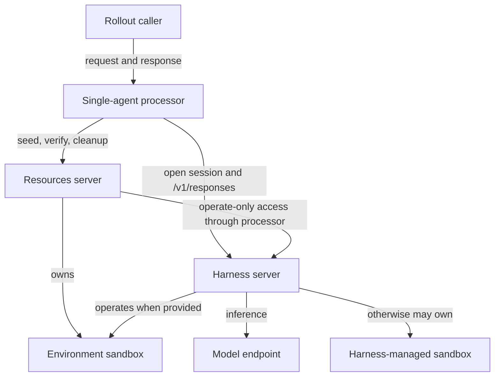
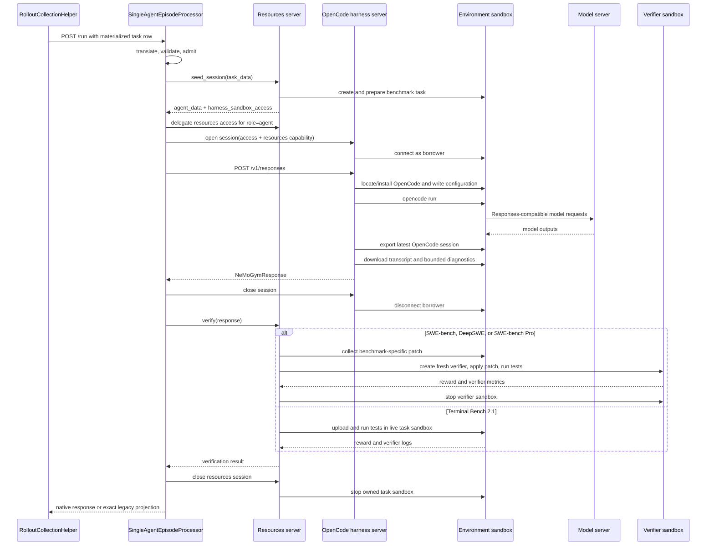

# Episode Architecture for NeMo Gym

Status: design proposal for review

## 1. Decision summary

NeMo Gym needs an episode boundary that can express how one task is executed without forcing the resources server, agent implementation, sandbox runtime, and rollout scheduler into one component.

Today, rollout collection sends `POST /run` to an agent server. That server commonly initializes benchmark state, runs an agent loop, asks a resources server to verify the outcome, and cleans up. The arrangement works when one agent owns the whole interaction, but it leaves three questions without reusable answers:

- Who coordinates an episode when a simulated user or another agent must act between primary-agent turns?
- Where does a command-line harness run when the benchmark has already created the task sandbox?
- Which component may reconnect to, inspect, or destroy each sandbox during execution and verification?

The worked examples demonstrate that this boundary supports materially different episodes while retaining Gym's server deployment model. A `simple_agent` harness server keeps the complete model-and-tool loop behind `/v1/responses` in its own virtualenv. An OpenCode harness server creates its configured sandbox when Reasoning Gym returns no sandbox access, but it operates a resources-owned task sandbox when SWE-bench or Terminal Bench returns access to the machine later inspected by verification. Terminus-2 keeps its Python loop in its harness server while directing terminal commands locally or through supplied sandbox access. These examples share the processor envelope without combining harness dependencies, environment state, and sandbox ownership in one process.

The design has two ordered foundations:

1. **Episode processing.** An `EpisodeRequest` enters a concrete processor server. `BaseEpisodeProcessor` supplies the reliable execution envelope, while the concrete processor implements participant ordering, visibility, verification timing, and termination.
2. **Agent harness services and sessions.** A harness remains an independently deployed `responses_api_agents` server with its own dependencies and `POST /v1/responses` behavior endpoint. The processor opens a role-scoped harness session, passes resources-session access and optional `SandboxAccess`, invokes behavior, and closes the session. If resources supplies no sandbox access, the harness follows its own configuration.

The order is architectural. The processor boundary must exist before harness behavior can be removed from today's agent-owned `/run`. Harness and sandbox ownership must be explicit before command-line behavior can safely operate on environment state. Task routing can then evolve separately by extending Gym's existing per-server `TaskData`, dataset, `task_source`, and environment-manifest conventions rather than introducing a second schema system in this proposal.

Several important capabilities build on these foundations. User simulation is the first expected protocol extension and requires the separate `turn()` harness API. A sandbox server can later provide reconnectable operate leases for providers that cannot reconstruct a sandbox in another process. Restart-safe attempts, checkpoint restoration, retained artifacts, and a broader task-routing redesign require additional contracts. They are not prerequisites for defining the two foundations correctly.

The central design rule is:

> The framework owns reliable episode execution. A concrete episode processor owns the interaction protocol.

That rule gives implementations common operational behavior without treating every environment as a variation of a single-agent loop.

The processor, resources environment, and harness are separate server responsibilities. Gym may co-locate compatible implementations as an optimization, but the foundational topology preserves the independent harness deployment that already gives each agent its own package, virtual environment, process, health boundary, and scaling policy.

## 2. Requirements and boundaries


### 2.1 What this architecture must make easy

- Let a benchmark author define task setup, stateful tools, verification, cleanup, and runtime requirements without choosing an agent.
- Let an agent author implement behavior behind `POST /v1/responses` without owning seed, verification, or environment cleanup.
- Let a concrete processor bind roles to independently deployed harness servers and open one session per participant.
- Keep existing Gym `/run` integrations and NeMo RL consumers working during migration.
- Run a CLI harness in a resources-provided task sandbox when verification requires shared mutable state.
- Let a harness follow its own configuration when resources does not provide sandbox access.
- Preserve resource-server ownership when the resources server exposes access to one of its sandboxes.
- Allow a concrete episode processor to define its own protocol and participant roles.
- Preserve current `agent_ref` and `task_source` routing during migration while leaving a broader task-routing redesign to a separate proposal.
- Evolve toward restart-safe rollout execution without implying those guarantees prematurely.
- Make ownership and cleanup mechanically enforceable.


### 2.2 Invariants

The following rules define the foundation and remain valid as the architecture grows:

1. Exactly one component owns each resource and is responsible for destroying it.
2. A borrower receives only the authority needed to operate a resource.
3. Harness behavior, harness-service deployment, and the sandbox it operates are distinct.
4. The base processor does not prescribe a participant graph or interaction protocol.
5. Harness `responses()` and `turn()` calls are separate contracts.
6. Resource-server-internal submission transfer is not a public artifact API.
7. Legacy `/run` requests and native episode results pass through deterministic translators. Golden tests cover every mapped field, rejected input, and legacy output shape.
8. Cleanup runs on success, failure, timeout, and cancellation.
9. Worker-local semaphores, session maps, and cleanup registries do not provide cluster-wide admission, failover, attempt fencing, or restart recovery. Those guarantees require shared state and are not claimed by this foundation.


### 2.3 What must be defined together

The proposal defines both foundations, including their native contracts and how they compose. That complete target is needed before teams can implement the boundaries in parallel:

- `EpisodeRequest`, `EpisodeResponse`, `BaseEpisodeProcessor`, and `SingleAgentEpisodeProcessor`;
- harness-server behavior and session contracts that preserve `/v1/responses`;
- optional resources-provided `SandboxAccess`, harness-created sandboxes, and owner-specific cleanup;
- concrete OpenCode and simple-agent mappings that preserve current behavior;
- deterministic compatibility translation for existing `/run`, JSONL, `agent_ref`, `task_source`, and NeMo RL consumers.

Implementation does not switch every agent at once. Migrated processors run under existing `responses_api_agents` deployment names and accept current materialized rows. Unmigrated agents remain reachable through a dedicated legacy passthrough processor until their behavior and environment protocols are extracted.

### 2.4 Capabilities added after the foundations

The following capabilities use the foundation but introduce requirements of their own:

- user simulation adds `turn()`, role-specific visibility, and chronological trainable-role attribution;
- additional multi-agent processors add their own roles, ordering, concurrency, and termination;
- a `process_bound` sandbox provider must be explicitly configured behind a sandbox server before access to a resources-owned sandbox can cross a process boundary;
- restart-safe attempts add shared claims, leases, ownership epochs, and stale-writer fencing;
- checkpoint restoration adds coordinated snapshots across processor, resources, harness, model capture, and runtime owners;
- caller-retained artifacts add durable storage, authorization, retention, and garbage collection.

This sequencing avoids putting speculative fields in the foundation. It does not defer sandbox ownership or exact harness behavior, because those are required to explain how current agents continue to work.

### 2.5 The resources server is the environment

In this design, the resources server is the deployed environment. It owns task setup, benchmark state, stateful tools, verification, environment-specific cleanup, and any private runtime resources it creates. Environment state is not synonymous with a sandbox: it may be a remote service, public internet, a database, process-local state, or one or more sandboxes. Existing environment-specific `TaskData` adapters validate the task fields accepted by that environment.

The episode processor is orchestration code between participant harness servers and the environment. It is neither an agent nor part of the environment. It decides participant ordering, visibility, sandbox-access distribution, verification timing, and termination, while the framework supplies admission, cancellation, cleanup registration, and response publication. Harness servers implement participant behavior and own any sandbox they create.

Trusted agent-server deployment configuration binds the environment, processor protocol, role-specific harnesses, models, and placement. Current task rows may retain `task_source` and compatibility `agent_ref`, but they cannot select executable Python code or deployment credentials. Harnesses do not need environment-specific seed, extraction, or verification logic.

### 2.6 Lessons adopted from Verifiers and Harbor

Verifiers V1 demonstrates two boundaries that Gym should preserve:

- `Env.run_episode()` wraps protocol-specific `Env.run()` with framework bookkeeping.
- `Agent.run()` executes one complete agent attempt, while `Interaction.turn()` returns control to its caller after one activation.

Gym's `BaseEpisodeProcessor.run()` and concrete `process()` methods follow the first boundary. Gym preserves the second boundary's scheduling distinction while retaining its existing method name: `responses()` leaves scheduling with the harness until it produces one complete Responses API response, while `turn()` returns scheduling to the processor after one activation. Gym does not adopt `Interaction` as another environment object. The processor owns the interaction protocol, and the resources server remains the environment.

Harbor is useful as a work-package exemplar. A task can declare its prompt, image, working directory, resources, network policy, verifier assets, and timeouts without selecting an agent. Harbor's isolated verifier flow also demonstrates an important ordering rule: collect benchmark-defined work while the task runtime is alive, restore it into a verifier runtime when required, verify, and only then destroy required state.

The proposal does not make Harbor's registry, downloader, directory layout, or generic artifact model part of Gym core. In particular, benchmark-internal submission transfer does not justify putting caller-visible artifact payloads in every episode response.

### 2.7 Episode and rollout are not interchangeable

An episode is the complete interaction for one task attempt. It can contain one agent run or many participant turns. An exported rollout is a training or evaluation projection from that episode.

The distinction is easy to miss in the initial single-agent protocol because one episode produces one primary-agent rollout. It matters for user simulation: the episode contains both assistant and simulated-user activity, while the trainable rollout contains only the configured trainable participant's model calls with the visible context that preceded them. A compatibility adapter must not pretend a multi-participant episode is one legacy rollout if doing so would discard actions or mix another participant's tokens into training.

Identity also has several scopes:

- `rollout_id` correlates the logical sample across services.
- `attempt` distinguishes physical retries of that sample.
- the resources session identifies benchmark state held between seed, tools, verify, and cleanup;
- sandbox identity identifies one physical runtime;
- future participant and capture identities distinguish model-call streams inside a multi-participant episode.

Correlation is not authority. A rollout id does not authorize a resources mutation, and an owner label does not grant lifecycle credentials. Authentication, session binding, and provider capabilities enforce those boundaries.

## 3. Component and ownership model

The architecture separates protocol, behavior services, sandbox access, and environment state:




Responsibilities are intentionally narrow:

- The rollout caller selects an existing Gym route and submits work. It does not orchestrate an episode.
- The episode processor executes one protocol and returns one result.
- The resources server owns benchmark state, task preparation, tools, verification, and every private runtime it creates.
- The harness server implements agent behavior, isolates its dependencies, and owns any sandbox it creates.
- The processor transports optional resources-provided sandbox access to the selected harness session without acquiring ownership.
- The model endpoint performs inference.

Harness deployment and environment state are independent. A resources server may keep all of its sandboxes private and expose only tools, or it may return operate-only access when a harness must modify a particular task sandbox. If no access is returned, the harness follows its own configuration. Resources cannot implicitly inspect a harness-created sandbox; communication occurs through the response, resources tools, or another protocol the concrete processor defines.

### 3.1 Protocol, behavior, placement, and safety are separate choices

`BaseEpisodeProcessor` supplies the server and safety envelope. `SingleAgentEpisodeProcessor` supplies one interaction protocol. A harness server supplies model-facing behavior through `/v1/responses`. The resources server supplies benchmark semantics.

These choices vary independently:

- Replacing OpenCode with another harness server changes the role binding, not the SWE-bench protocol.
- Moving a harness implementation to another server image changes dependencies and placement without changing `/v1/responses`.
- Adding a simulated user changes the processor protocol and role bindings; it does not turn the resources server into an agent scheduler.
- Switching sandbox providers changes deployment configuration and reconnect behavior; it does not change environment semantics or lifecycle ownership.

A migrated protocol processor never calls another component's episode-level `/run`. It opens a harness session and calls only the harness server's behavior endpoint. The temporary `LegacyAgentRunProcessor` is the explicit exception: it is a transparent passthrough and does not seed, verify, clean up, or project the forwarded episode itself. Otherwise two components would both appear to own lifecycle.

### 3.2 Current, transitional, and native routing

The current path routes by `agent_ref.name` to an agent server whose `/run` method owns both orchestration and behavior.

There are two different migration mechanisms:

- A migrated deployment keeps its existing `responses_api_agents` name and `/run` route but hosts `SingleAgentEpisodeProcessor`. Its configured wire-compatibility projector translates `BaseRunRequest`, invokes extracted harness behavior, and restores the exact legacy result shape.
- An unmigrated agent retains its episode-level `/run`. A dedicated `LegacyAgentRunProcessor` forwards to that route and returns its status, headers, cookies, and body verbatim. It does not use `SingleAgentEpisodeProcessor` and is removed after the last agent migrates.

Wire compatibility is therefore not an alternative to the dedicated legacy processor. The former preserves caller-visible data around new orchestration; the latter temporarily preserves an old component that still owns orchestration. Keeping the passthrough separate avoids teaching the basic processor to call another episode-level `/run`, which would create two apparent lifecycle owners. Nothing is inherently wrong with the dedicated legacy approach; this proposal previously conflated it with wire projection and now makes both roles explicit.

This sequence matters. Changing routing, agent behavior, sandbox ownership, and NeMo RL output at once would leave no stable comparison point. Both migration mechanisms preserve observable behavior while one deployment at a time moves to the new boundary.

### 3.3 The worked examples are the migration proof

The baseline is the upstream `main` combination of [`opencode_sandboxed_agent`](https://github.com/NVIDIA-NeMo/Gym/tree/main/responses_api_agents/opencode_sandboxed_agent) with [`swebench`](https://github.com/NVIDIA-NeMo/Gym/tree/main/resources_servers/swebench), [`deepswe`](https://github.com/NVIDIA-NeMo/Gym/tree/main/resources_servers/deepswe), [`swebench_pro`](https://github.com/NVIDIA-NeMo/Gym/tree/main/resources_servers/swebench_pro), and [`terminal_bench_2_1`](https://github.com/NVIDIA-NeMo/Gym/tree/main/resources_servers/terminal_bench_2_1).

Today, `OpenCodeSandboxedAgent.run()` asks the resources server to seed a task sandbox, reads `sandbox_handle`, reconnects through the provider configured on the agent server, runs OpenCode, exports its transcript, calls `/verify`, and merges the response with verifier fields. This proves that a CLI harness can operate a resources-owned task sandbox. It also exposes the missing contracts:

- The agent reads only a bare sandbox id even when the resources server has a complete descriptor and working directory.
- Agent and resources deployments must independently choose compatible providers.
- The resources server retains the owner object, but both resources and agent code attempt to stop the task sandbox on the successful path.
- Several exceptional paths skip agent-side cleanup.
- The four resources servers extract and verify different kinds of state and must keep those benchmark rules.

The migration keeps the OpenCode server as a dependency-isolated harness service and moves only episode orchestration out of its `/run`. Resources returns complete operate-only `SandboxAccess` because these environments require OpenCode to run in the same sandbox whose state they later verify. The processor passes that access while opening the OpenCode harness session. The harness server connects, runs OpenCode, and disconnects. Resources retains owner authority, verifies while required state is alive, and stops its sandbox.

Section 5.11 works through this path operation by operation. Section 5.12 applies the same processor boundary to `simple_agent` without a sandbox. Appendix A records the current OpenCode calls and benchmark-specific differences so the evidence needed to assess the target architecture is part of this document. The target does not replace those differences with a generic sandbox harvester.

### 3.4 The proposal reuses Gym core contracts

The processor adds an orchestration boundary; it does not replace Gym's service and data plane. The design reuses:

- `SimpleServer`, its validated `config`, and the shared `ServerClient`;
- `AgentServerRef`, `ModelServerRef`, and `ResourcesServerRef` for trusted service selection;
- `NeMoGymResponseCreateParamsNonStreaming` and `NeMoGymResponse` for agent behavior;
- `AgentObservationBundle`, `TrajectoryRecord`, and model-call correlation for observability;
- `AsyncSandbox`, `SandboxSpec`, and provider resolution for runtime operations;
- `BaseRunRequest`, environment-specific `BaseVerifyRequest` and `BaseVerifyResponse` subclasses, `AggregateMetricsRequest`, and `AggregateMetrics` on compatibility paths.

The new core contracts are limited to the processor request and response, harness-session lifecycle, scoped resources access, optional sandbox-access handoff, and an `AsyncSandbox` facade that removes owner-only operations. The `/v1/responses` body and result remain Gym's existing models.

## 4. Foundation 1: episode processor


### 4.1 Why the processor exists

Existing Gym agent servers combine framework responsibilities with a particular agent loop. This is workable for one loop, but it makes user simulation, multi-agent interaction, and consistent cleanup difficult.

An episode processor is the implementation behind a deployable agent-server boundary. It owns its route, worker-local admission, server lifecycle, and protocol implementation. There is no umbrella server that dynamically hosts arbitrary processor classes.

Each deployment starts one concrete processor server, such as `SingleAgentEpisodeProcessor`. The base class supplies scaffolding through inheritance; it is not a separately routed service.

This follows the deployment boundary Gym already has. A server entrypoint determines dependencies, configuration schema, health, worker count, and scaling. An umbrella processor host would need another implementation registry, dynamic dependency loading, and a second selector inside `/run`, even though a production deployment normally serves one protocol. It would also let task traffic choose among code implementations inside a shared process unless carefully constrained.

Making the concrete processor the server does not prevent reuse or testing. `BaseEpisodeProcessor` supplies the transport and execution envelope. `process()` is ordinary asynchronous protocol logic with injected resources and harness-session clients. Unit tests can call that method directly, while conformance tests exercise the inherited `/run` behavior.

The base class is intentionally narrower than `SingleAgentEpisodeProcessor`. User simulation should not override pieces of a hidden single-agent template. It should implement its own `process()` while receiving the same admission, cancellation, cleanup, failure, and result guarantees.

### 4.2 Episode data model

The foundation introduces three serialized episode models and one in-memory context. The aliases and support records used by those models are defined here so the contract can be read without searching later sections.

```python
type JsonValue = (
    None
    | bool
    | int
    | float
    | str
    | list["JsonValue"]
    | dict[str, "JsonValue"]
)


class TaskIdentity(BaseModel):
    source: str
    task_id: str
    revision: str | None = None


class EpisodeRequest(BaseModel):
    rollout_id: str
    attempt: NonNegativeInt = 0
    task: TaskIdentity
    responses_create_params: NeMoGymResponseCreateParamsNonStreaming
    resources_data: dict[str, JsonValue]
    agent_data: dict[str, JsonValue] = Field(default_factory=dict)
    deadline: datetime | None = None


class EpisodeFailure(BaseModel):
    kind: Literal[
        "invalid_request",
        "infrastructure",
        "harness",
        "verification",
        "deadline",
        "internal",
    ]
    message: str
    retryable: bool


class CleanupFailure(BaseModel):
    owner: Literal["processor", "resources", "harness"]
    operation: str
    message: str


class EpisodeMetrics(BaseModel):
    framework: dict[str, int | float | str | bool] = Field(default_factory=dict)
    verification: dict[str, int | float | str | bool] = Field(default_factory=dict)


class EpisodeDiagnostic(BaseModel):
    level: Literal["info", "warning", "error"]
    code: str
    message: str


class EpisodeResponse(BaseModel):
    rollout_id: str
    attempt: NonNegativeInt
    task: TaskIdentity
    status: Literal["completed", "failed"]
    response: NeMoGymResponse | None = None
    reward: float | None = None
    reward_components: dict[str, float] = Field(default_factory=dict)
    mask_sample: bool = False
    metrics: EpisodeMetrics = Field(default_factory=EpisodeMetrics)
    ng_agent_observations: AgentObservationBundle | None = None
    diagnostics: list[EpisodeDiagnostic] = Field(default_factory=list)
    failure: EpisodeFailure | None = None
    cleanup_failures: list[CleanupFailure] = Field(default_factory=list)


@dataclass(frozen=True)
class EpisodeExecutionResult:
    response: EpisodeResponse
    legacy_verify_payload: dict[str, Any] | None = None


@dataclass(frozen=True)
class ProjectedHTTPResponse:
    status_code: int
    body: dict[str, Any]
    headers: tuple[tuple[str, str], ...] = ()


class CancellationToken(Protocol):
    @property
    def cancelled(self) -> bool: ...

    def raise_if_cancelled(self) -> None: ...

    async def wait(self) -> None: ...


class EpisodeCleanupRegistry(Protocol):
    def add(
        self,
        *,
        owner: str,
        operation: str,
        callback: Callable[[], Awaitable[None]],
    ) -> None: ...

    async def close(self) -> None: ...


class EpisodeObservationCollector(Protocol):
    def create_capture(self, *, role: str) -> str: ...

    async def bundle(
        self,
        capture_id: str,
    ) -> AgentObservationBundle | None: ...


class EpisodeObservationCollectorFactory(Protocol):
    def open(
        self,
        *,
        rollout_id: str,
        attempt: NonNegativeInt,
    ) -> EpisodeObservationCollector: ...


@dataclass
class EpisodeContext:
    deadline: datetime | None
    cancellation: CancellationToken
    resources: ResourcesSessionClient
    observations: EpisodeObservationCollector
    cleanup: EpisodeCleanupRegistry
```

`NeMoGymResponseCreateParamsNonStreaming`, `NeMoGymResponse`, `ResponseInputItem`, and `ResponseOutputItem` are existing Responses API models already used by Gym. `AgentObservationBundle`, `BaseRunServerInstanceConfig`, `ModelServerRef`, `ResourcesServerRef`, `ServerClient`, `SimpleServer`, and `rollout_context` are existing Gym types and helpers. `FastAPI`, `Request`, and `Response` are FastAPI or Starlette types. `BaseModel`, `Field`, `PrivateAttr`, `PositiveInt`, `PositiveFloat`, `NonNegativeInt`, and `ValidationError` are Pydantic types. `ABC`, `Any`, `AsyncIterator`, `Awaitable`, `Callable`, `Literal`, `Mapping`, `Protocol`, `dataclass`, and `datetime` are standard Python types. `Exception` and `ValueError` are Python built-ins. These are reused dependencies, not new proposal contracts.

All proposal Pydantic models use strict validation and reject unknown fields unless a field is explicitly defined as benchmark- or provider-owned JSON. Wire compatibility is versioned by the configured processor and harness-server protocol versions rather than by accepting undeclared fields.

`EpisodeRequest` and `EpisodeResponse` are complete concrete wire contracts, not classes that clients extend. The `Base` prefix would imply that a processor accepts arbitrary subclasses and their additional fields, which conflicts with strict request validation and makes the server contract depend on client-side Python inheritance. If a future protocol cannot be represented by these contracts, Gym must introduce a versioned replacement or an explicit discriminated union at the server boundary. It must not accept unknown fields through client subclassing. `BaseEpisodeProcessor` keeps the prefix because processor implementations are expected to subclass it.

`EpisodeExecutionResult` and `ProjectedHTTPResponse` are processor-internal records, not wire models. The first carries compatibility-only verifier data until projection; the second makes HTTP status and headers part of the route implementation rather than prose around a dictionary that FastAPI would return as 200.

`EpisodeRequest` carries one routed task. It does not contain model or participant deployment, participant graphs, sandbox owner handles, or checkpoint state.

- `rollout_id` is stable across retries of the same logical sample.
- `attempt` identifies the physical execution. The compatibility path uses zero unless the existing caller supplies an attempt field.
- `task.source` records the current trusted task source or a compatibility source name; `task_id` identifies the task within that source; `revision` is present only when the source provides a stable content revision.
- `responses_create_params` is the complete agent-visible Responses request, including input, tools, tool choice, and generation options after allowed run-level overrides.
- `resources_data` contains benchmark-owned seed and verification JSON. The selected resources server validates its benchmark-specific schema before seed side effects.
- `agent_data` contains task-authored data intentionally visible to the harness but not represented in the Responses request.
- `deadline` is a timezone-aware absolute timestamp. The processor clamps downstream timeouts to the remaining duration.

`EpisodeFailure.kind` identifies the boundary that failed. `invalid_request` is never retryable. `infrastructure` covers unavailable services or runtimes. `harness` means the configured behavior could not produce a valid result. `verification` means no trustworthy reward was produced. `deadline` means the episode exhausted its time budget. `internal` hides an unexpected implementation error behind a non-sensitive message. The component that has enough evidence to classify the failure sets `retryable`; callers do not infer retryability from the text.

`CleanupFailure` reports which owner failed to release which resource. Its message is bounded and safe for the caller. Internal exception details remain in structured logs keyed by rollout and attempt.

`EpisodeMetrics` keeps processor and harness timing separate from verifier metrics so equal keys cannot silently overwrite one another. Harness-specific trajectory data remains in Gym's observability records rather than a parallel metrics payload. The compatibility projector places known verifier and completion metrics back in their legacy locations.

When `reward_components` is non-empty, `reward` equals the finite sum of those components. `finalize_response` enforces this invariant because NeMo RL rejects any other relationship. A verifier with a non-additive score places explanatory component values in `metrics.verification` and returns only the final score as `reward`.

`AgentObservationBundle` remains Gym's typed observation contract. `EpisodeDiagnostic` contains a severity, stable code, and caller-safe message. Neither can contain a live object, unbounded transcript, credential, or sandbox-local path that becomes invalid during cleanup.

`EpisodeRequest` and `EpisodeResponse` are the matching wire models for the processor's `/run` route. `EpisodeResponse` carries identity and one terminal status. A completed response requires `response` and `reward` and forbids `failure`. A failed response requires `failure`; response and reward may be absent. `finalize_response` enforces those conditions and runs Gym's existing token-capture delivery step before serialization. `mask_sample` survives in the native response and is projected to `instance_config.mask_sample` for current NeMo RL. Cleanup failures remain visible even when protocol work completed successfully because failure to destroy a sandbox is operationally important but does not retroactively change a valid reward.

Rollout ids, failure messages, observation kinds, diagnostic codes, and metric keys are non-empty and bounded. Reward and numeric metric values must be finite. These validation limits are constants of the processor protocol version, not per-request knobs.

`EpisodeContext` is not an environment model and is never serialized. It is a small per-execution utility object:

- `deadline` is the caller deadline after server-side clamping.
- `cancellation` lets downstream work observe shutdown, timeout, or caller cancellation.
- `resources` owns the processor's resources-session authority and exposes seed, delegation, verify, and cleanup operations for that session.
- `observations` allocates role-scoped capture identities and assembles the existing `AgentObservationBundle`.
- `cleanup` registers named asynchronous cleanup operations and executes them in reverse acquisition order.

`EpisodeCleanupRegistry` is backed by an `AsyncExitStack`, but it wraps each callback so one cleanup failure does not prevent later callbacks from running. Each failure becomes a `CleanupFailure` with an owner and operation. Protocol code registers cleanup when it acquires a resource; it does not manually unwind the whole episode.

`ResourcesSessionClient` is defined with the seed and verification models in section 5.6. It is a thin adapter over Gym's existing `ServerClient`. It owns the current cookie jar during compatibility migration and the owner capability in the native resources-session protocol.

If a future protocol needs participant state or a transcript, that state belongs to the concrete processor or a protocol-specific context type. The base context does not become a general service bag.

### 4.3 Framework-supplied `run`

```python
class BaseEpisodeProcessor(SimpleServer, ABC):
    config: BaseEpisodeProcessorConfig
    _admission: EpisodeAdmission = PrivateAttr()
    _resources_sessions: ResourcesSessionFactory = PrivateAttr()
    _harness_sessions: HarnessSessionFactory = PrivateAttr()
    _observation_collectors: EpisodeObservationCollectorFactory = PrivateAttr()

    def setup_webserver(self) -> FastAPI:
        app = FastAPI(lifespan=self.lifespan)
        self.setup_session_middleware(app)
        app.post("/run")(self.run)
        app.post("/aggregate_metrics")(self.aggregate_metrics)
        return app

    def model_post_init(self, context: Any, /) -> None:
        super().model_post_init(context)
        self._admission = LocalEpisodeAdmission(
            limit=self.config.max_concurrent_episodes,
            queue_timeout_seconds=self.config.queue_timeout_seconds,
        )
        self._resources_sessions = GymResourcesSessionFactory(
            server_client=self.server_client,
            resources_server=self.config.resources_server,
        )
        self._harness_sessions = GymHarnessSessionFactory(
            server_client=self.server_client,
        )
        self._observation_collectors = GymObservationCollectorFactory()

    async def run(
        self,
        http_request: Request,
        body: dict[str, Any],
    ) -> Response:
        try:
            request = self.translate_or_validate(body)
        except ValidationError as error:
            return self.to_http_response(
                self.project_invalid_request(error, body)
            )

        cleanup_failures: list[CleanupFailure] = []
        try:
            async with self._admission.slot(request.deadline):
                async with self.episode_scope(
                    request,
                    cleanup_failures,
                    initial_cookies=dict(http_request.cookies),
                ) as context:
                    execution = await self.process(request, context)
        except Exception as error:
            execution = EpisodeExecutionResult(
                response=self.failure_response(request, error)
            )

        finalized = self.finalize_response(
            request,
            execution.response,
            cleanup_failures=cleanup_failures,
        )
        projected = self.project_response(
            finalized,
            body,
            legacy_verify_payload=execution.legacy_verify_payload,
        )
        return self.to_http_response(projected)

    @abstractmethod
    async def process(
        self,
        request: EpisodeRequest,
        context: EpisodeContext,
    ) -> EpisodeExecutionResult:
        ...
```

The framework supplies `run` for the same reason mature systems supply request middleware: every processor should have the same behavior for overload, cancellation, cleanup, validation, and result projection. Subclasses implement `process`, not `run`.

Response finalization occurs after `episode_scope` exits. This ordering is necessary because cleanup failures do not exist until cleanup has run. Returning from inside the scope would either lose those failures or force a mutable response to be changed after publication.

The helpers have precise responsibilities.

#### `translate_or_validate`

This is a pure boundary operation:

```python
def translate_or_validate(
    self,
    body: dict[str, Any],
) -> EpisodeRequest:
    ...
```

1. Read the deployment's configured wire format.
2. On a native deployment, validate the body as `EpisodeRequest`.
3. On a compatibility deployment, validate the body as the existing `BaseRunRequest` and translate it into `EpisodeRequest`.
4. If the request has no deadline, clamp it to `now + default_episode_timeout_seconds`.
5. Reject malformed or ambiguous input before acquiring capacity or creating resources.

It performs no network calls, sandbox creation, session mutation, or logging side effects beyond validation diagnostics. Keeping it pure makes the compatibility mapping golden-testable.

#### `admission.slot`

`EpisodeAdmission` bounds concurrently active episodes for one processor worker. It:

- acquires a capacity slot;
- observes the request deadline while queued;
- rejects immediately when shutdown has begun;
- releases the slot in `finally`.

Admission is local capacity control. It is not a distributed claim on `(rollout_id, attempt)` and does not make retries restart-safe.

Its public interface is intentionally one operation:

```python
class EpisodeAdmission(Protocol):
    @asynccontextmanager
    async def slot(
        self,
        deadline: datetime | None,
    ) -> AsyncIterator[None]:
        ...
```

The implementation combines a worker-local semaphore with shutdown state. `queue_timeout_seconds` and the request deadline determine the effective wait limit. A queue timeout fails before resources seed or harness execution begins.

#### `episode_scope`

`episode_scope` creates the bounded `EpisodeContext` and owns per-episode teardown:

```python
@asynccontextmanager
async def episode_scope(
    self,
    request: EpisodeRequest,
    cleanup_failures: list[CleanupFailure],
    initial_cookies: dict[str, str],
) -> AsyncIterator[EpisodeContext]:
    cleanup = self.cleanup_factory(cleanup_failures)
    try:
        cancellation = self.cancellation.child(
            request.deadline,
        )
        resources = await self._resources_sessions.open(
            rollout_id=request.rollout_id,
            attempt=request.attempt,
            initial_cookies=initial_cookies,
        )
        cleanup.add(
            owner="resources",
            operation="cleanup_session",
            callback=resources.close,
        )
        context = EpisodeContext(
            deadline=request.deadline,
            cancellation=cancellation,
            resources=resources,
            observations=self._observation_collectors.open(
                rollout_id=request.rollout_id,
                attempt=request.attempt,
            ),
            cleanup=cleanup,
        )
        yield context
    finally:
        await cleanup.close()
```

`SimpleServer.run_webserver()` already constructs every Gym server with validated `config` and the shared `ServerClient`; `SingleAgentEpisodeProcessor.config` narrows that inherited field to its concrete config type. `model_post_init()` initializes worker-local admission, resources-session, and harness-session clients. The cleanup registry is backed by `AsyncExitStack`. During compatibility migration, the resources-session adapter must send and merge the same cookie state on every downstream resources call.

The processor remains the `/run` server and receives the caller's request cookies. It copies them into `ResourcesSessionClient` before calling seed. A native resources server then delegates role-scoped access to each harness session. A compatibility adapter may pass a cookie snapshot and merge updates serially, but raw caller cookies are not the target multi-agent authority.

Cleanup callbacks added later by `process` run before the resources session closes. Every callback runs even if another callback fails. Cleanup failures are logged with rollout and attempt identity and attached to the response. If a cleanup failure means the returned response or reward cannot be trusted, `finalize_response` changes the terminal status to `failed`; otherwise it preserves the completed response and reports the cleanup failure separately.

If scope setup fails after acquiring any resource, `finally` closes its partially built registry before re-raising. `BaseEpisodeProcessor.run()` classifies exceptions from scope entry, protocol execution, and scope exit through the same `failure_response` path. Python cancellation continues to propagate after the scope performs cleanup.

#### `finalize_response`

`finalize_response` keeps response completion on the processor. Response completion is not mutable context behavior. It:

```python
def failure_response(
    self,
    request: EpisodeRequest,
    error: Exception,
) -> EpisodeResponse:
    ...


def finalize_response(
    self,
    request: EpisodeRequest,
    candidate: EpisodeResponse,
    *,
    cleanup_failures: list[CleanupFailure],
) -> EpisodeResponse:
    ...
```

- validates that result identity matches the request;
- enforces the completed-versus-failed field conditions;
- normalizes failure and metrics fields;
- attaches framework timing and termination metadata;
- prevents post-return mutation.

It does not upload artifacts or execute verification.

`failure_response` maps known framework, resource, harness-service, sandbox-connectivity, verification, and deadline exceptions to `EpisodeFailure`. Unexpected exceptions are logged with their internal cause and become a non-sensitive `internal` failure. Caller cancellation is not caught by this `Exception` boundary and continues to unwind the episode scope.

#### `project_response`

`project_response` serializes the native response. In compatibility mode, it performs the exact legacy response projection consumed by current Gym and NeMo RL callers. Projection is separate from finalization so native and legacy wire contracts can be tested independently.

```python
def project_invalid_request(
    self,
    error: ValidationError,
    original_body: dict[str, Any],
) -> ProjectedHTTPResponse:
    ...


def project_response(
    self,
    response: EpisodeResponse,
    original_body: dict[str, Any],
    *,
    legacy_verify_payload: dict[str, Any] | None,
) -> ProjectedHTTPResponse:
    ...


def to_http_response(
    self,
    projected: ProjectedHTTPResponse,
) -> Response:
    ...
```

`to_http_response()` constructs a Starlette response with `projected.status_code`, serializes `projected.body`, and appends every projected header without collapsing repeated headers such as `Set-Cookie`. Returning an ordinary dictionary here would silently turn every native failure into HTTP 200.

Projection also chooses the HTTP status; a failed body is never returned as an ordinary HTTP 200:


| Failure                                                                      | HTTP behavior                                                              |
| ---------------------------------------------------------------------------- | -------------------------------------------------------------------------- |
| invalid request                                                              | `422`                                                                      |
| retryable infrastructure, deadline, internal, admission timeout, or shutdown | `503` with `Retry-After`                                                   |
| harness failure without a valid response                                     | `500`                                                                      |
| verification failsafe preserved for compatibility                            | `200` with reward zero and the existing `_ng_failure_class` sidecar marker |


The structured `EpisodeFailure` remains in native error bodies, but current NeMo RL classifies failures from HTTP status rather than inspecting that body. The verification row preserves current behavior explicitly: NeMo RL currently consumes it as a reward-zero sample, which requires a separate decision with NeMo RL owners rather than an undocumented transport change.

### 4.4 Lifecycle boundaries

There are four different lifecycle scopes:

1. Worker setup and shutdown
  - validate deployment configuration;
  - resolve trusted harness-server references;
  - initialize admission and reusable service clients;
  - create and close reusable HTTP clients;
  - stop accepting work and drain or cancel active episodes on shutdown.
2. Episode setup and teardown
  - create cancellation and deadline state;
  - open and close the resources-session client;
  - run registered cleanup on every exit path.
3. Resources-session setup and cleanup
  - performed by resources-server endpoints;
  - creates environment state and any private runtimes;
  - optionally returns harness sandbox access when colocation is required;
  - releases benchmark state and stops resources-owned sandboxes.
4. Harness invocation setup and cleanup
  - performed by the harness server after the processor opens a role-scoped session;
  - connects through resources-provided access or follows harness-specific configuration;
  - installs or starts invocation-scoped harness machinery when required;
  - disconnects from borrowed access or stops a harness-owned environment according to ownership.

These scopes must not be collapsed into a single `teardown()` hook. Their owners and failure behavior differ.

`SimpleServer` does not currently expose lifecycle hooks. Stage 1 adds a FastAPI lifespan that calls worker-scoped hooks:

```python
async def startup(self) -> None:
    ...


async def shutdown(self) -> None:
    ...
```

Each uvicorn worker runs these hooks independently. Worker startup validates everything that can be checked without allocating task state. It resolves the resources server and role-to-harness-server bindings. Each harness server independently validates its model endpoint, provider credentials, harness-specific configuration, and dependencies. Startup does not seed a benchmark or create an episode sandbox.

Worker shutdown first closes its admission so no new episode starts in that worker. It then waits up to `shutdown_grace_seconds` for active episodes. After the grace period, it cancels the episode tokens, waits for registered cleanup, closes reusable HTTP clients, and reports any resources that could not be released. Worker shutdown is not a substitute for resources-server `/cleanup_session` or harness-session close; it is the final containment path. The compatibility path also treats Gym's existing client-disconnect middleware as a cancellation carrier and unwinds the episode scope when the caller disconnects.

Within one episode, acquisition and release order are deterministic:

1. Acquire processor admission.
2. Open the resources session and register its close operation.
3. Seed benchmark state. The environment may return operate-only access when it requires the harness to execute in one of its sandboxes.
4. Delegate role-scoped resources access, open the harness session with optional sandbox access, and immediately register session close.
5. Call the harness server's `/v1/responses`.
6. Close the harness session. It disconnects borrowed access or stops its own environment.
7. Verify while every resources-owned resource remains alive.
8. Exit the episode scope, which asks resources to clean up its private state and runtimes.
9. Finalize and publish the result after every registered cleanup has run.

For the SWE-bench path, the harness server disconnects before verification because its invocation has ended, while resources retains the sandbox through verification. A harness-owned sandbox is not an implicit task-state handoff. If verification must inspect files or machine state produced directly by the harness, resources returns access to the task sandbox where that harness must run. Cancellation at any step unwinds the registered operations in reverse acquisition order.

### 4.5 The first concrete protocol

`BaseEpisodeProcessorConfig` contains the environment reference used by every processor plus framework-wide server concerns:

```python
class LegacyCompatibilityConfig(BaseModel):
    expected_agent_name: str


class BaseEpisodeProcessorConfig(BaseRunServerInstanceConfig):
    resources_server: ResourcesServerRef
    max_concurrent_episodes: PositiveInt
    queue_timeout_seconds: PositiveFloat
    shutdown_grace_seconds: PositiveFloat
    default_episode_timeout_seconds: PositiveFloat
    token_id_capture: bool = False
    compatibility: LegacyCompatibilityConfig | None = None
```

When `compatibility` is absent, `/run` accepts only the native episode request. When it is present, `/run` accepts the existing Gym `BaseRunRequest` instead, requires the configured agent name, and emits the existing result projection. The processor never guesses a format by trying one parser after another. There is no request field that lets a caller enable compatibility or select a different agent.

The concrete processor declares its dependencies:

```python
class SingleAgentEpisodeProcessorConfig(BaseEpisodeProcessorConfig):
    agent: AgentServerRef
    skip_verification: bool = False
    skip_verification_reward: float = 0.0
```

`AgentServerRef`, `ModelServerRef`, and `ResourcesServerRef` are Gym's existing typed references from `nemo_gym.config_types`. The processor uses `AgentServerRef` directly; there is no one-field binding wrapper or new `HarnessDeploymentRef` type. The model name and generation parameters remain in `responses_create_params`, as they do in the current Responses API. Model-server references, provider settings, executable entrypoints, and credentials belong to the harness-server deployment and do not travel in task rows.

The existing `allowed_agents` compatibility check resolves through a processor deployment to each role's harness-server name and configured migration aliases. For `SingleAgentEpisodeProcessor`, it checks the one `agent` binding. Existing values such as `opencode_sandboxed_agent` and `simple_agent` remain valid through aliases on the compatibility processor deployment. A multi-participant processor defines whether all roles or only selected roles must be accepted by the environment. The check no longer compares the processor entrypoint name, because that identifies orchestration rather than behavior.

The base class does not define agent harnesses. A concrete protocol names the roles it needs. `SingleAgentEpisodeProcessor` has one role, `agent`. A user-simulation processor can instead name roles such as `assistant` and `simulated_user`; a peer protocol can use domain-specific names rather than RL terminology. The concrete `process()` method defines when each role acts and what it can observe. A processor deployment can have several replicas, each replica can have several HTTP workers, and each worker can admit several episodes. Worker-local capacity is `max_concurrent_episodes`; the deployment's nominal capacity is that value times `num_workers`, although it is not a cluster-wide admission guarantee.

The processing sequence is:

```python
class SingleAgentEpisodeProcessor(BaseEpisodeProcessor):
    config: SingleAgentEpisodeProcessorConfig

    async def process(
        self,
        request: EpisodeRequest,
        context: EpisodeContext,
    ) -> EpisodeExecutionResult:
        seed = await context.resources.seed_session(
            EpisodeSeedSessionRequest(
                rollout_id=request.rollout_id,
                attempt=request.attempt,
                task_data=request.resources_data,
            )
        )

        resources_access = await context.resources.delegate(
            role="agent",
        )
        capture_id = context.observations.create_capture(role="agent")
        harness = await self._harness_sessions.open(
            server=self.config.agent,
            request=HarnessSessionOpenRequest(
                rollout_id=request.rollout_id,
                attempt=request.attempt,
                role="agent",
                capture_id=capture_id,
                deadline=request.deadline,
                agent_data=request.agent_data,
                seed_data=seed.agent_data,
                resources_access=resources_access,
                sandbox_access=seed.harness_sandbox_access,
            ),
        )
        context.cleanup.add(
            owner="harness",
            operation="close_session",
            callback=harness.close,
        )
        agent_response = await harness.responses(
            request.responses_create_params
        )
        await harness.close()
        agent_observations = await context.observations.bundle(capture_id)

        if self.config.skip_verification:
            verification = VerificationResult(
                response=EpisodeVerifyResponse(
                    reward=self.config.skip_verification_reward,
                    metrics={"verification_skipped": True},
                )
            )
        else:
            verification = await context.resources.verify(
                EpisodeVerifyRequest(
                    rollout_id=request.rollout_id,
                    attempt=request.attempt,
                    responses_create_params=request.responses_create_params,
                    resources_data=request.resources_data,
                    response=agent_response,
                )
            )

        return EpisodeExecutionResult(
            response=EpisodeResponse(
                rollout_id=request.rollout_id,
                attempt=request.attempt,
                task=request.task,
                status="completed",
                response=agent_response,
                reward=verification.response.reward,
                reward_components=verification.response.reward_components,
                mask_sample=verification.response.mask_sample,
                metrics=EpisodeMetrics(
                    verification=verification.response.metrics
                ),
                ng_agent_observations=agent_observations,
                diagnostics=verification.response.diagnostics,
            ),
            legacy_verify_payload=verification.legacy_payload,
        )

    async def aggregate_metrics(
        self,
        request: AggregateMetricsRequest,
    ) -> AggregateMetrics:
        if self.config.skip_verification:
            return await super().aggregate_metrics(request)
        response = await self.server_client.post(
            server_name=self.config.resources_server.name,
            url_path="/aggregate_metrics",
            json=request,
        )
        await raise_for_status(response)
        return AggregateMetrics.model_validate(await get_response_json(response))
```

The exact resources endpoint names may be adapted to current Gym routes, but the ownership and ordering are normative:

1. resources prepare environment state and optionally expose a sandbox in which the harness must execute;
2. the processor opens a harness session with that access, or the harness follows its own configuration when access is absent;
3. resources verify using their retained state;
4. each runtime owner performs cleanup.

The processor uses one seed response for both the harness and verification. It never asks the harness to seed or verify on its behalf. The seed request does not ask for a workspace: resources knows whether the harness must operate a task sandbox. If seed fails, the harness is not invoked. If the harness fails before it can produce a valid `NeMoGymResponse`, the processor still exits the resources session and returns a classified episode failure. If verification fails, no successful reward is invented.

The returned `harness_sandbox_access` is permission to operate a specific resources-owned sandbox, not an inventory of environment state or a statement about where the harness service itself runs. Resources may create other sandboxes during seed, tool calls, or verification and keep them private. The harness accepts supplied access or rejects the session; when none is supplied, it follows its own configuration. `AggregateMetricsRequest` and `AggregateMetrics` are existing Gym models; the processor preserves the current simple-agent proxy behavior.

`SingleAgentEpisodeProcessor` intentionally permits only one `agent` binding. It does not carry a one-element participant list or a schedule object merely to resemble the future multi-agent shape. The user-simulation processor adds `assistant` and `simulated_user` bindings when the second role and its ordering semantics exist.

Reward judges used by SWE-bench-style verifiers remain resources-server internals. There is no foundational `SolverJudgeEpisodeProcessor`. A judge should become an episode participant only if a future interaction protocol actually requires a participant with judge behavior.

## 5. Foundation 2: agent harness servers

### 5.1 A harness remains an independently deployed server

An agent harness is a behavior service with its own package, virtual environment, process, configuration, and scaling policy. Gym continues to deploy it under `responses_api_agents`. The episode processor references that deployment through the existing `AgentServerRef`; it does not import the harness implementation or install the harness's dependencies.

Every harness server preserves the existing complete behavior endpoint:

```text
POST /v1/responses

NeMoGymResponseCreateParamsNonStreaming
    -> NeMoGymResponse
```

The current `BaseResponsesAPIAgentConfig` mixes behavior-server fields with `/run` concerns. Migration moves `skip_verification`, compatibility projection, resources binding, and episode capture policy to processor configuration. Existing concrete agent configuration becomes harness-server configuration and retains only behavior dependencies such as `ModelServerRef`, OpenCode settings, or Terminus-2 settings. This does not require another public base-config hierarchy.

The endpoint owns one complete agent activation through a valid Responses API result. For `simple_agent`, that activation contains the repeated model → tool → model loop. For OpenCode, it contains installation or discovery, CLI execution, transcript export, and Responses conversion. For Terminus-2, it contains the terminal-agent loop. The endpoint does not seed the environment, verify reward, clean up environment state, or publish the episode result.

This preserves Gym's current dependency isolation. The launcher creates a virtual environment from each server directory's `pyproject.toml` or `requirements.txt`, activates it, and starts that server as a long-lived process. Two harnesses with incompatible Python or system dependencies remain separate deployments. A subprocess launched from one shared processor environment would not provide the same isolation.

The processor can optimize a harness call into an in-process implementation only after proving that the implementation and dependencies are compatible with the processor deployment. That is an optional placement optimization, not the foundational contract. The default and compatibility topology is a harness server.

### 5.2 The processor opens a harness session before calling `/v1/responses`

The Responses API body cannot carry episode authority, resources credentials, or sandbox connection data. Before the processor calls `/v1/responses`, it opens a harness session with the invocation dependencies for one role in one episode:

```python
class HarnessSessionOpenRequest(BaseModel):
    rollout_id: str
    attempt: NonNegativeInt
    role: str
    capture_id: str
    deadline: datetime | None
    agent_data: dict[str, JsonValue] = Field(default_factory=dict)
    seed_data: dict[str, JsonValue] = Field(default_factory=dict)
    resources_access: "ResourcesSessionAccess"
    sandbox_access: "SandboxAccess | None" = None


class HarnessSessionRef(BaseModel):
    session_id: str
    session_token: str


class HarnessSessionClient(Protocol):
    async def responses(
        self,
        body: NeMoGymResponseCreateParamsNonStreaming,
    ) -> NeMoGymResponse:
        ...

    async def close(self) -> None:
        ...


class HarnessSessionFactory(Protocol):
    async def open(
        self,
        *,
        server: AgentServerRef,
        request: HarnessSessionOpenRequest,
    ) -> HarnessSessionClient:
        ...
```

A Gym-hosted harness server exposes `POST /v1/harness_sessions`, accepts the returned capability in an internal authenticated header on `POST /v1/responses`, and exposes idempotent `DELETE /v1/harness_sessions/{session_id}`. The session token is never placed in the Responses body, logs, observations, or caller-visible result. The `/v1/responses` request and response remain the existing Gym models; session context travels through authenticated service metadata rather than a wrapper around the Responses body.

The processor allocates `capture_id` through Gym's existing rollout observability path. Model calls and bounded harness or sandbox observations are emitted under that identity and retrieved after `/v1/responses`; they are not wrapped in a second Responses result type. The processor publishes the resulting `AgentObservationBundle` in `EpisodeResponse.ng_agent_observations`.

`HarnessSessionClient.close()` means “finish this harness session.” If the harness server created a sandbox or managed session, it releases that state. If resources supplied `sandbox_access`, close disconnects the harness's borrower connection but cannot destroy the task sandbox. The processor registers close immediately after opening each session and invokes it on success, failure, timeout, and cancellation.

An adapter for an external managed service implements the same client contract while translating lifecycle calls to that service's API. For example, an OpenAI Agents API adapter creates and closes a managed agent session and maps `responses()` onto work performed in that session. Provider-specific session identifiers and event formats do not become Gym's common wire contract.

The future `turn()` operation is a separate method and endpoint because it returns scheduling control after one participant activation. A processor that uses `turn()` requires its configured harness servers to expose that endpoint; it does not add nullable turn fields to `/v1/responses`.

### 5.3 Resources may pass task-sandbox access to a harness

Environment state is not synonymous with a sandbox. It may be public internet, a remote service, a database, process-local state, or one or more private sandboxes. The resources server returns sandbox access only when one or more harnesses must operate a particular task sandbox.

The seed contract is additive:

```python
type SandboxCapability = Literal[
    "exec",
    "upload",
    "download",
    "pty",
]


class SandboxServerRef(BaseModel):
    name: str


class DirectSandboxConnection(BaseModel):
    kind: Literal["direct"]
    provider: str
    descriptor: dict[str, JsonValue]


class SandboxServerConnection(BaseModel):
    kind: Literal["sandbox_server"]
    server: SandboxServerRef
    operate_lease: str


class SandboxAccess(BaseModel):
    connection: (
        DirectSandboxConnection | SandboxServerConnection
    ) = Field(discriminator="kind")
    workdir: str
    capabilities: set[SandboxCapability]


class EpisodeSeedSessionRequest(BaseModel):
    rollout_id: str
    attempt: NonNegativeInt
    task_data: dict[str, JsonValue]


class EpisodeSeedSessionResponse(BaseModel):
    agent_data: dict[str, JsonValue] = Field(default_factory=dict)
    harness_sandbox_access: SandboxAccess | None = None
```

The processor does not request a sandbox in `EpisodeSeedSessionRequest`. Resources knows whether its protocol requires a harness to operate a task sandbox. A successful seed has two meanings:

- `harness_sandbox_access` is present: resources requires the selected harness role or roles to operate that task sandbox.
- `harness_sandbox_access` is absent: the harness follows its own configuration.

Today `simple_agent.run()` checks the seed status and carries forward response cookies without reading the response body. Existing empty seed responses therefore remain valid and mean that resources supplies no harness sandbox.

The field is not an inventory of environment resources. Resources may provision a private sandbox for tools or verification and expose only HTTP tools. It may defer sandbox creation until a tool or verification call. None of those private runtimes appear in the seed response.

### 5.4 The processor brokers access but never owns the task sandbox

For one harness, access flows as follows:

```text
Resources server
  └─ creates and owns task sandbox
  └─ returns operate-only SandboxAccess
                    │
                    ▼
Episode processor
  └─ selects the role that receives access
  └─ includes it in HarnessSessionOpenRequest
                    │
                    ▼
Harness server
  └─ connects and operates the sandbox
  └─ disconnects without destroying it
```

`DirectSandboxConnection` contains the provider name and complete descriptor required to reconnect from the harness deployment. The harness server wraps the connected `AsyncSandbox` in a bounded facade that exposes only required operations:

```python
class HarnessSandbox(Protocol):
    workdir: str

    async def exec(
        self,
        command: str,
        *,
        timeout_s: float | None = None,
        env: dict[str, str] | None = None,
        cwd: str | None = None,
    ) -> SandboxResult:
        ...

    async def download(
        self,
        remote_path: str,
        local_path: Path,
    ) -> None:
        ...
```

`HarnessSandbox` omits `start()` and `stop()`. The harness server can disconnect its client, but resources retains owner authority and destroys the task sandbox only after verification.

`SandboxServerConnection` is used when the provider cannot reconnect directly across the resources and harness deployments. The resources server declares the sandbox server as a deployment dependency before allocation. The sandbox server receives the live provider handle, resources retains a separate owner capability, and seed returns only bounded operate authority.

Operate authority must support multiple borrower connections to the same sandbox. Each harness session gets an independent connection or child lease. Closing one harness session disconnects only that borrower. Resources cleanup, owner revocation, or expiry invalidates the shared operate authority and destroys the sandbox.

The processor does not deserialize provider handles, call sandbox operations, or own sandbox cleanup. It transports `SandboxAccess` unchanged during harness-session establishment. The harness either accepts that access or rejects the session before inference.

### 5.5 Behavior when seed returns no sandbox access

There is no common harness-runtime configuration hierarchy. When resources returns no `SandboxAccess`, each harness follows its existing harness-specific configuration:

- `simple_agent` needs no sandbox.
- OpenCode may create a sandbox from its configured provider and `SandboxSpec`.
- Terminus-2 may execute terminal commands in its server-local workspace.
- A managed harness follows its provider-specific configuration.

The component that creates a sandbox owns and destroys it. A missing access value is not recovery from failed resources provisioning: if verification requires the harness to modify a resources-owned sandbox, seed must return valid access or fail.

`ModelServerRef` remains on Gym harness-server configuration when the harness uses Gym inference. A managed harness may own model selection instead. It is training-compatible only if it returns the token ids, log probabilities, role attribution, and trajectory evidence required by Gym; otherwise it is evaluation-only.

### 5.6 Harness servers receive scoped resources-session access

A harness must call environment tools in the same resources session that seed created and verification later reads. Copying a cookie jar into several harness servers and merging their updates after each call is unsafe for concurrent participants.

The native target is a scoped service capability:

```python
class ResourcesSessionAccess(BaseModel):
    resources_server: ResourcesServerRef
    rollout_id: str
    attempt: NonNegativeInt
    role: str
    allowed_tools: frozenset[str]
    access_token: str
```

The resources session stores mutable state server-side. Each harness receives a role-scoped capability permitting only advertised tool operations. Seed, verify, cleanup, capability delegation, and raw session inspection remain processor-only operations. Revocation or resources cleanup invalidates every delegated capability.

The processor-facing session preserves typed seed, verification, and cleanup operations:

```python
class EpisodeVerifyRequest(BaseModel):
    rollout_id: str
    attempt: NonNegativeInt
    responses_create_params: NeMoGymResponseCreateParamsNonStreaming
    resources_data: dict[str, JsonValue]
    response: NeMoGymResponse


class EpisodeVerifyResponse(BaseModel):
    reward: float
    reward_components: dict[str, float] = Field(default_factory=dict)
    mask_sample: bool = False
    metrics: dict[str, int | float | str | bool] = Field(
        default_factory=dict
    )
    diagnostics: list[EpisodeDiagnostic] = Field(default_factory=list)


@dataclass
class VerificationResult:
    response: EpisodeVerifyResponse
    legacy_payload: dict[str, JsonValue] | None = None


class ResourcesSessionClient(Protocol):
    async def seed_session(
        self,
        request: EpisodeSeedSessionRequest,
    ) -> EpisodeSeedSessionResponse:
        ...

    async def delegate(
        self,
        *,
        role: str,
    ) -> ResourcesSessionAccess:
        ...

    async def verify(
        self,
        request: EpisodeVerifyRequest,
    ) -> VerificationResult:
        ...

    async def close(self) -> None:
        ...


class ResourcesSessionFactory(Protocol):
    async def open(
        self,
        *,
        rollout_id: str,
        attempt: NonNegativeInt,
        initial_cookies: dict[str, str],
    ) -> ResourcesSessionClient:
        ...
```

During compatibility migration, a harness adapter may receive the current resources cookies and return every `Set-Cookie` update from `/v1/responses`. `ResourcesSessionClient` merges updates under a lock before the next tool or verification call. That path preserves current agents but is not the multi-agent concurrency contract.

Model-server cookies remain harness-local. A Gym harness server uses its configured `ModelServerRef` and the rollout-prefixed `/v1/responses` path derived from the harness session's capture identity.

### 5.7 A multi-agent processor binds roles to harness servers

The base processor does not define participant roles. A concrete protocol binds the harness services it needs:

```python
class UserSimulationEpisodeProcessorConfig(
    BaseEpisodeProcessorConfig
):
    assistant: AgentServerRef
    simulated_user: AgentServerRef
    max_turns: PositiveInt


class PeerReviewEpisodeProcessorConfig(
    BaseEpisodeProcessorConfig
):
    author: AgentServerRef
    reviewers: list[AgentServerRef]
    max_rounds: PositiveInt
```

For each role or agent instance, the processor:

1. obtains role-scoped resources access;
2. decides whether that role receives resources' `harness_sandbox_access`;
3. opens one harness session;
4. schedules `responses()` or `turn()` according to the concrete protocol;
5. closes every harness session before resources verification and cleanup.

Several harnesses may operate the same resources-owned task sandbox. The processor passes the same logical `SandboxAccess` to each selected role, while direct providers or the sandbox server create independent borrower connections. The concrete protocol decides whether calls are serialized or concurrent. Shared filesystem, process, package, and terminal mutations are observable task behavior and must be accounted for by that protocol.

Server isolation prevents the harness implementations' Python dependencies from conflicting; it does not make arbitrary guest mutations compatible. If two CLI harnesses install incompatible tools into one shared task sandbox, resources and the protocol must provide a compatible prepared image, use isolated installation prefixes, serialize destructive setup, or give the roles separate sandboxes. A shared sandbox is selected only when shared task state is intentional.

When seed returns no access, each harness independently follows its own configuration. A swarm can therefore have one harness-owned sandbox per agent, local harness workspaces, or managed services while communicating through resources tools, remote services, or the public internet.

The common seed response contains one optional sandbox access. A protocol requiring several distinct resources-owned sandboxes defines an extended seed response and explicit role-to-access mapping because those names and sharing rules are protocol semantics.

Managed subagents internal to a service such as the OpenAI Agents API remain one opaque Gym participant unless Gym needs to schedule or train those subagents independently. Gym should not duplicate scheduling already owned by the managed harness.

Terminus-2 fits the same boundary. Its Python loop and Harbor dependencies remain in the Terminus-2 server virtualenv. With `SandboxAccess`, its terminal commands operate that sandbox. Without access, they operate its configured server-local workspace. Any object needed to adapt those commands to Harbor is private Terminus code. The proposal does not call that object an environment.

### 5.8 Complete deployment examples

Most users select a shipped processor-and-harness preset and a model. The expanded configurations below show ownership and server dependencies for authors and reviewers.

A normal pairing does not configure `workspace_source`, provider ownership, or an access-present branch. Resources decides whether seed returns `harness_sandbox_access`. The harness accepts it or rejects the session before inference. When access is absent, the harness follows its own configuration. Swapping a resources server therefore does not require changing a source selector.

#### Gym-native `simple_agent`

The processor and harness are separate server deployments. Gym's launcher starts the harness server as a subprocess using that server directory's virtual environment. The harness uses the configured Gym model server and accepts no sandbox access.

```yaml
reasoning_gym_simple_agent:
  responses_api_agents:
    single_agent_episode_processor:
      entrypoint: app.py
      resources_server:
        type: resources_servers
        name: reasoning_gym
      agent:
        type: responses_api_agents
        name: simple_agent_harness
      max_concurrent_episodes: 32
      queue_timeout_seconds: 300
      shutdown_grace_seconds: 60
      default_episode_timeout_seconds: 3600
      compatibility:
        expected_agent_name: reasoning_gym_simple_agent

simple_agent_harness:
  responses_api_agents:
    simple_agent_harness:
      entrypoint: app.py
      model_server:
        type: responses_api_models
        name: agent_model
      max_steps: null
```

`simple_agent_harness` retains the current `/v1/responses` loop. It receives scoped resources access when the processor opens the session. If an incompatible environment returns sandbox access, session validation fails before model inference. The harness server's own package and virtual environment contain its dependencies.

#### OpenCode with Reasoning Gym

Reasoning Gym returns no sandbox access. The OpenCode harness server creates and owns its configured sandbox.

```yaml
reasoning_gym_opencode:
  responses_api_agents:
    single_agent_episode_processor:
      entrypoint: app.py
      resources_server:
        type: resources_servers
        name: reasoning_gym
      agent:
        type: responses_api_agents
        name: opencode_harness
      max_concurrent_episodes: 32
      queue_timeout_seconds: 300
      shutdown_grace_seconds: 60
      default_episode_timeout_seconds: 10800
      compatibility:
        expected_agent_name: reasoning_gym_opencode

opencode_harness:
  responses_api_agents:
    opencode_harness:
      entrypoint: app.py
      model_server:
        type: responses_api_models
        name: agent_model
      opencode_version: 1.17.11
      opencode_max_context_window: 262144
      opencode_config: {}
      sandbox_provider: sandbox
      sandbox_config:
        image: approved-opencode-runtime@sha256:...
        workdir: /workspace
        ttl_s: 18000
        ready_timeout_s: 1200
        resources:
          cpu: 2
          memory_mib: 8192
          disk_gib: 30
        provider_options: {}
```

#### OpenCode with SWE-bench or Terminal Bench

The processor can reference the same OpenCode harness deployment. SWE-bench creates the task sandbox during seed and returns `harness_sandbox_access`, so the harness uses that access instead of creating its configured sandbox.

```yaml
opencode_sandboxed_agent:
  responses_api_agents:
    single_agent_episode_processor:
      entrypoint: app.py
      resources_server:
        type: resources_servers
        name: swebench_resources_server
      agent:
        type: responses_api_agents
        name: opencode_harness
      max_concurrent_episodes: 32
      queue_timeout_seconds: 300
      shutdown_grace_seconds: 60
      default_episode_timeout_seconds: 10800
      compatibility:
        expected_agent_name: opencode_sandboxed_agent

swebench_resources_server:
  resources_servers:
    swebench:
      entrypoint: app.py
      evaluation_timeout: 1800
      sandbox_provider: sandbox
      sandbox_handoff:
        kind: direct
      sandbox_config:
        ttl_s: 18000
        ready_timeout_s: 1200
        resources:
          cpu: 2
          memory_mib: 16384
          disk_gib: 30
        provider_options: {}
```

For a process-bound provider, the resources deployment replaces `sandbox_handoff.kind: direct` with a declared sandbox-server dependency:

```yaml
swebench_resources_server:
  resources_servers:
    swebench:
      entrypoint: app.py
      sandbox_provider: process_local_provider
      sandbox_handoff:
        kind: sandbox_server
      sandbox_server:
        type: sandbox_servers
        name: sandbox_runtime
```

The harness server receives only the operate lease. Resources retains the owner capability and stops the sandbox after extraction and verification.

#### Terminus-2

Terminus-2 remains a harness server. In this Reasoning Gym pairing, seed returns no sandbox access, so terminal commands run in the harness server's local workspace.

```yaml
reasoning_gym_terminus_2:
  responses_api_agents:
    single_agent_episode_processor:
      entrypoint: app.py
      resources_server:
        type: resources_servers
        name: reasoning_gym
      agent:
        type: responses_api_agents
        name: terminus_2_harness
      max_concurrent_episodes: 8
      queue_timeout_seconds: 300
      shutdown_grace_seconds: 60
      default_episode_timeout_seconds: 10800
      compatibility:
        expected_agent_name: reasoning_gym_terminus_2

terminus_2_harness:
  responses_api_agents:
    terminus_2_harness:
      entrypoint: app.py
      model_server:
        type: responses_api_models
        name: agent_model
      concurrency: 1
      workspace_root: null
      max_turns: null
      parser_name: json
      command_timeout_sec: 1800
      timeout: 10800
```

The same harness can be paired with a resources server that returns `SandboxAccess`. In that case, Terminus terminal commands use the borrowed sandbox and `workspace_root` is ignored. The Python loop and Harbor dependencies remain in the harness server's virtual environment. Local terminal dependencies belong in the harness server image; borrowed-sandbox terminal dependencies belong in the task image or are installed by Terminus's existing remote-tool setup.

A managed agent service follows the same server boundary through provider-specific adapter code. The proposal does not standardize that provider's hosted execution configuration.

### 5.9 Verification remains benchmark-defined

The processor does not implement a generic sandbox harvester. The resources server knows which paths, commands, and machine state constitute a submission, so it performs extraction and verification.

SWE-bench, DeepSWE, and SWE-bench Pro use a portable patch:

1. The harness modifies the repository in the task sandbox.
2. `/verify` runs the benchmark-specific patch collection command in that sandbox.
3. Resources validates the command, bounds the patch, and copies it into resources-owned memory or storage.
4. Resources creates a fresh verifier sandbox.
5. It applies the patch, runs benchmark tests, and returns normalized reward data.
6. It stops the verifier sandbox in `finally`.
7. It retains the task sandbox until extraction and any required verification evidence are complete.

The extraction rule is not identical across these benchmarks. DeepSWE keeps its pinned commit-aware collection hook. SWE-bench Pro keeps its pristine-untracked filtering and verification retries. SWE-bench needs canonical handling for supported new and binary files rather than assuming `git diff` alone is complete. Shared lifecycle helpers should not erase these semantics.

Terminal Bench 2.1 grades the modified machine:

1. The harness changes packages, services, processes, permissions, files, or other state in the task sandbox.
2. `/verify` uploads tests into that sandbox and executes them there.
3. Resources copies the bounded reward and verifier logs out.
4. Resources stops the task sandbox only after grading completes.

A fresh verifier sandbox would discard the state Terminal Bench is intended to grade. The two verification families therefore share ownership and cleanup rules but not a common submission representation.

### 5.10 Submission transfer, observations, and retained artifacts

Three different concerns must not share one generic payload type:

1. Verifier-internal submission transfer moves benchmark state between resources-owned components. It is private implementation detail.
2. `AgentObservationBundle` and `TrajectoryRecord` are Gym's existing typed observability data.
3. Caller-retained files are durable objects that outlive the episode and require storage, authorization, retention, garbage collection, and opaque references.

Therefore the foundational episode and harness contracts do not define a generic artifact payload or reference type. In particular, they do not return base64 file blobs or sandbox-local paths as caller-visible artifacts because those paths become invalid during cleanup and have no retention or authorization contract.

If callers later need retained files, Gym should design an artifact subsystem as a separate capability. That subsystem may add opaque references to results without changing who owns environment state or verifier transfer.

The foundational response still preserves useful rollout evidence without wrapping `NeMoGymResponse`. Gym's existing observability path records model calls, invocation structure, tool calls, sandbox observations, and capture gaps. The processor returns the validated bundle as `EpisodeResponse.ng_agent_observations`. Resources returns caller-safe verification diagnostics separately. Compatibility projection preserves current `ng_trajectory` and `ng_agent_observations` fields. None of these records can contain an unbounded transcript, a sandbox path that becomes invalid at cleanup, or credentials.

### 5.11 Worked flow: OpenCode with the four sandbox benchmarks

This flow is the behavioral contract for migrating the current [`opencode_sandboxed_agent`](https://github.com/NVIDIA-NeMo/Gym/tree/main/responses_api_agents/opencode_sandboxed_agent). The target changes ownership and failure handling without replacing OpenCode-specific behavior with a generic CLI plan.




The current configuration maps into two deployments:

- The compatibility processor keeps the existing `opencode_sandboxed_agent` deployment name and `/run` route. Its config inherits `BaseRunServerInstanceConfig` and owns the resources binding, harness-server binding, deadline, admission, token capture, `skip_verification`, and legacy projection.
- The OpenCode harness remains a `responses_api_agents` server. Its config inherits `BaseResponsesAPIAgentConfig` and owns the model-server binding and `/v1/responses` behavior.
- Resources configuration owns `sandbox_provider`, `sandbox_config`, the task image, task preparation, verifier configuration, and final destruction of every task sandbox. The harness does not carry a second provider choice for resources-provided access.
- `OpenCodeHarnessServerConfig` retains `opencode_version`, staged installer and binary locations during migration, `opencode_config`, `opencode_max_context_window`, debug behavior, transcript policy, execution and output bounds, and the sandbox provider and `SandboxSpec` used when seed returns no access.
- The harness server owns sandbox reconnection, workdir enforcement, deadline and cancellation propagation, borrower disconnect, query extraction, optional SWE image compatibility setup, OpenCode installation or binary discovery, model-provider configuration, permission configuration, `opencode run`, session export, transcript parsing, usage conversion, Responses output construction, and bounded diagnostics.

The operation-by-operation parity requirements are:

1. The processor sends the original benchmark fields to the selected resources server and preserves its session affinity.
2. For these four environments, seed creates the sandbox in which OpenCode must execute and returns complete direct or sandbox-server connection data plus the actual workdir. Provisioning or handoff failure makes seed fail; the environment must not report successful no-access seed.
3. The processor opens the OpenCode harness session with that access. The harness server connects through it, and the connected facade cannot call `stop()`.
4. The harness selects the configured staged binary and installer when present. A prepared image is the intended steady-state deployment, but removing installation support before images are ready would break current deployments.
5. The harness renders the current OpenCode provider, model URL, context limit, output-token override, permission policy, debug flags, and thinking mode from typed configuration. Secrets are supplied through rollout-scoped files or environment variables and are not returned in diagnostics.
6. Current OpenCode behavior extracts the user prompt but does not forward Responses request metadata, including the collector's repeat seed, into the CLI's model requests. Characterization records this limitation. Forwarding the seed is a separate behavior change rather than migration parity.
7. The harness runs OpenCode in `SandboxAccess.workdir`. The task prompt is passed without shell interpolation.
8. Transcript export has an explicit deadline derived from the remaining episode deadline. It does not silently fall back to the provider's shorter default timeout.
9. Export parsing preserves assistant messages, function calls, function outputs, reasoning, usage, and terminal completion. Missing or malformed required export data becomes a classified harness failure rather than an ordinary reward-zero answer.
10. The legacy projector preserves the current OpenCode result fields while consumers migrate: run stdout and stderr under configured bounds, `opencode_finished`, `opencode_export_found`, transcript metadata, and `ng_agent_observations` including valid agent and verifier sandbox observations or explicit capture gaps. The current synthetic OpenCode system prompt is preserved only in legacy projection until the caller contract is audited; it is not invented as a native episode event after execution.
11. The processor verifies before resources destroys the task sandbox. Harness failure still closes the resources session and destroys that sandbox.

The resources servers keep their existing benchmark semantics:

- **SWE-bench** creates a task sandbox from the instance image, extracts a patch, and tests that patch in a fresh verifier sandbox. Migration must fix supported new-file and binary-file collection rather than codify the current incomplete `git diff`.
- **DeepSWE** creates its task sandbox from a pinned image in `/app` and uses its commit-aware collection hook before testing in a fresh verifier sandbox.
- **SWE-bench Pro** creates its task sandbox from an image digest in `/app`, includes intended untracked files while filtering pristine untracked files, and retains its verifier retry policy.
- **Terminal Bench 2.1** verifies packages, services, processes, permissions, files, and other machine state in the live task sandbox. It must not be converted to patch transfer or marked stateless for reverification.

Behavioral parity is established by running the same task and model stub through current and target paths and comparing caller-visible input, model requests, output items, usage, reward, verifier metrics, token-capture lineage, and cleanup. Failure tests cover installation, model connectivity, main command timeout, transcript export timeout, malformed export, verifier failure, cancellation at every boundary, and repeated cleanup. Every case must leave no task or verifier sandbox running and must never stop a resources-owned sandbox through borrower authority.

### 5.12 Worked flow: `simple_agent` with a simple resources server

The representative no-sandbox path pairs [`simple_agent`](https://github.com/NVIDIA-NeMo/Gym/tree/main/responses_api_agents/simple_agent) with [`example_single_tool_call`](https://github.com/NVIDIA-NeMo/Gym/tree/main/resources_servers/example_single_tool_call). It exercises the same processor contract through a dependency-isolated harness server with no sandbox runtime.

```mermaid
sequenceDiagram
    participant C as RolloutCollectionHelper
    participant P as SingleAgentEpisodeProcessor
    participant R as SimpleWeatherResourcesServer
    participant H as SimpleAgent harness server
    participant M as Model server

    C->>P: POST /run with task row and any request cookies
    P->>P: translate, validate, admit
    P->>R: seed_session with current resources cookies
    R-->>P: optional agent_data; no sandbox access
    P->>R: delegate resources access for role=agent
    P->>H: open session(resources access; sandbox=None)
    P->>H: POST /v1/responses
    loop until assistant message, incomplete response, or max_steps
        H->>M: POST /v1/responses with input + prior outputs
        M-->>H: response output, usage, and model cookie updates
        opt function calls
            H->>R: POST /{tool_name} with scoped session access
            R-->>H: model-visible tool output
        end
    end
    H-->>P: NeMoGymResponse
    P->>H: close session
    P->>R: verify(response) in owner session
    R-->>P: reward and metrics
    P->>R: close resources session
    P-->>C: native response or exact legacy projection
```


The `simple_agent` harness server's `responses()` method contains the loop currently implemented by `_create_episode()`:

1. Copy the Responses request and normalize string input to message input.
2. Send the accumulated conversation to the configured model endpoint.
3. Validate every model response and accumulate usage across turns.
4. Return when the model produces an assistant message without another function call, reports an incomplete response, or reaches `max_steps`.
5. For each function call, parse JSON arguments. Invalid JSON becomes a model-visible error output.
6. Call the resources tool endpoint with the resources session. HTTP tool failures remain model-visible outputs rather than terminating the episode.
7. Append each function output to the next model request. The harness updates its sequential model-cookie state after every model response. Native tools use the role-scoped resources capability; the serialized cookie compatibility path merges resources cookie updates before the next call.
8. When capture is enabled, record model-call references, chronological turns, tool-call timing and status, observation gaps, completion status, and the final conversation.

The current `SimpleAgent.run()` reaches `responses()` through an HTTP self-call. The migrated processor instead calls the behavior-only harness server. This preserves route overrides, request validation, session middleware, rollout-prefix behavior, HTTP errors, and response `Set-Cookie` handling while moving seed and verification out of the harness deployment. Calling `_create_episode()` directly from the processor is not a valid compatibility shortcut because it would also combine their dependency and failure boundaries.

Current upstream code replaces its local cookie variable with `response.cookies` after seed, model, tool, and self-call responses. The target deliberately gives model and resources sessions separate cookie state. `ResourcesSessionClient` merges each resources response's `Set-Cookie` changes instead of discarding unchanged keys, and model cookies are never sent to the resources server. Characterization tests must use distinct cookie names, rotations, and deletions at every hop. If an existing integration depends on model cookies reaching verification or on replacement dropping an unchanged resource cookie, that dependency must be removed or explicitly preserved by its legacy adapter before migration.

`SingleAgentEpisodeProcessor` performs seed and verify around that loop. It retains the current `skip_verification` behavior as explicit processor configuration, including the configured fallback reward and `verification_skipped` marker. The compatibility projector attaches the trajectory and final `resolved` value in the same locations current consumers read.

This example establishes that a harness does not need a sandbox simply because it is an agent. `simple_agent_harness` runs as an ordinary Gym server in its own server-directory virtualenv. A non-null `harness_sandbox_access` fails session validation before inference. Running the Python harness inside a task sandbox would require explicit guest packaging and transport support.

Other simple resources servers follow this pattern when their tools are ordinary typed HTTP operations and verification does not depend on a mutable task machine. Their task-specific tool schemas, seed data, and reward logic remain in resources. The harness stays reusable because it only sees advertised tool definitions, model-visible outputs, and agent-visible seed data.

### 5.13 Migration classes and GDPVal

The repository does not contain one uniform agent shape. Migration work is classified by observable behavior:

- An agent whose behavior already lives in `responses()` can retain it in a behavior-only harness server and move its current `run()` ordering into `SingleAgentEpisodeProcessor`.
- A remote or run-only agent first needs a behavior-only endpoint that cannot seed, verify, clean up, or publish an episode. Until then it remains behind `LegacyAgentRunProcessor`.
- A step-based environment such as Gymnasium needs another concrete processor whose `process()` owns the step protocol. It should not add modes to the single-agent processor.
- An agent that grades locally must move benchmark semantics into its resources-server environment before it can use the foundational processor.

Vibench follows the same ownership rule. Its current agent-side tar creation and shared-host-path handoff move into the Vibench resources server, which owns the task sandbox and harvests the application before cleanup. The design deliberately does not add a reverse harness-to-resources filesystem handoff solely to preserve that agent-specific implementation.

GDPVal is in the last category and confirms why task-sandbox ownership belongs to resources. Upstream `stirrup_agent` currently selects and starts the GDPVal Apptainer sandbox, materializes reference files, persists deliverables under `persist_deliverables_dir`, and sends that host-local directory to `resources_servers/gdpval` for judging. The resources server already defines the rubric and comparison judges and reads the deliverable tree; it does not yet own collection or the task sandbox.

GDPVal can migrate without a public artifact contract:

1. GDPVal resources seed creates the task sandbox with its required image, materializes reference inputs, records rollout and attempt identity, and returns `harness_sandbox_access`.
2. The processor passes that access while opening the Stirrup harness-server session. Harness behavior produces the assistant response and task files but does not choose a host persistence directory.
3. GDPVal resources verification harvests benchmark-defined deliverables while the owned sandbox is alive, persists them in its private cache when configured, and passes the resulting resources-local directory to its existing rubric or comparison implementation.
4. Resources cleanup stops the task sandbox after harvesting and verification. The private directory path never appears in `EpisodeResponse`.

That sequence covers GDPVal's ordinary execute-and-verify mode through `SingleAgentEpisodeProcessor`. It does not cover the current control modes:

- `execute_only` intentionally produces a cached submission without a reward, so it is not a complete episode `/run`. A GDPVal-specific preparation operation must expose a distinct preparation request and response rather than making `EpisodeResponse.reward` nullable on successful runs.
- `judge_only` bypasses the harness and asks resources to load and score a cached response and deliverable set.
- `rerun_incomplete` asks resources whether a complete cached submission exists, then either judges it or executes and harvests a new one.

Those modes require a concrete `GDPValEpisodeProcessor` plus a separate preparation route, or they remain behind `LegacyAgentRunProcessor`. `GDPValEpisodeProcessor.run()` still returns only complete, verified `EpisodeResponse` values; its `process()` owns the cache-status branch for judge-only and rerun-incomplete execution. The preparation route uses the same admission, resources-session, cancellation, and cleanup utilities but a distinct response contract. This preserves the complete meaning of `/run` instead of adding a mode flag and mutually exclusive nullable fields to the foundational episode models.

The migration is feasible, but “move artifact harvesting” understates the refactor. Sandbox provisioning, reference-file materialization, cache ownership, finish markers, cached response storage, and judge-only replay must move with harvesting so the resources server can reproduce current GDPVal behavior independently of the agent host filesystem. Full migration is not complete until the control-mode protocol is implemented or deliberately deprecated. Characterization tests cover deliverable files, text-only fallback, audio/video routing, execute-only persistence, cached judging, rerun-incomplete behavior, and cleanup.

## 6. Task routing is a follow-on proposal

This proposal changes which code executes behind a current `responses_api_agents` `/run` route. It does not add an `episode_processors` server category, `EpisodeProcessorRef`, `EpisodeRunConfig`, `TaskSet`, or a second participant-binding layer.

During migration, `RolloutCollectionHelper` continues to resolve `task_source`, apply `agent_name` or `agent_map`, materialize current rows, and route by `agent_ref`. A migrated agent-server deployment owns exactly one concrete processor configuration, including its role-specific harness and model bindings. The processor converts the current row to `EpisodeRequest` at its boundary.

Gym already has per-server `task_data.py` adapters, benchmark dataset placement, rollout materialization, and `EnvironmentManifest`. A separate task-routing proposal may strengthen those seams, but it must start from their current contracts and migration requirements. Episode orchestration does not depend on replacing them.

The only task-data requirements imposed here are:

- the compatibility translator preserves the complete current row needed by the environment's concrete seed and verify models;
- harness-visible input is explicitly separated from verifier-only data before behavior executes;
- task data cannot select a Python implementation, sandbox provider credentials, or another processor after the trusted agent-server route has been resolved;
- rollout and attempt identity survive translation and projection.


## 7. Compatibility implementation

Compatibility is an explicit adapter path, not an assumption that old and new contracts happen to align.

### 7.1 Characterize before changing

Golden tests must capture:

- the current `/run` request accepted by representative agent servers;
- resources-server calls and the complete cookie transcript across seed, self-dispatch, model, tool, and verify;
- route overrides, middleware, validation, and HTTP error behavior exercised by the current simple-agent self-call;
- the exact output shape consumed by evaluation;
- fields consumed by NeMo RL;
- failure and timeout behavior;
- current OpenCode sandbox behavior for SWE-bench, SWE-bench Pro, DeepSWE, and Terminal Bench 2.1.

The source references for these tests are the upstream `main` implementations of [`resources_servers/deepswe`](https://github.com/NVIDIA-NeMo/Gym/tree/main/resources_servers/deepswe), [`resources_servers/terminal_bench_2_1`](https://github.com/NVIDIA-NeMo/Gym/tree/main/resources_servers/terminal_bench_2_1), [`resources_servers/swebench`](https://github.com/NVIDIA-NeMo/Gym/tree/main/resources_servers/swebench), [`resources_servers/swebench_pro`](https://github.com/NVIDIA-NeMo/Gym/tree/main/resources_servers/swebench_pro), and [`responses_api_agents/opencode_sandboxed_agent`](https://github.com/NVIDIA-NeMo/Gym/tree/main/responses_api_agents/opencode_sandboxed_agent).

Characterization must use the Gym version actually imported by the NeMo RL job. Current Gym paths do not all materialize routing at the same layer. Rollout collection can stamp an agent selected by configuration, while the low-level NeMo RL path reads `agent_ref.name` before calling `run_examples`. A compatibility claim based on another checkout or a higher-level collector is insufficient.

The tests should snapshot behavior, not implementation details. They record the request presented at `/run`, downstream resources calls including cookies, the terminal HTTP behavior, and the result fields read by callers. They also inject seed, harness, verify, timeout, and cleanup failures so the migration does not preserve only the successful path.

### 7.2 Additive migration path

The migration proceeds without a flag day:

1. Add the base processor types, wire translators, and a dedicated `LegacyAgentRunProcessor`.
2. Route unmigrated agent deployments through the passthrough processor without changing their `/run`.
3. Deploy `SingleAgentEpisodeProcessor` behind one migrated `agent_ref`, accept the legacy body, and project the result back to the legacy shape.
4. Add optional `harness_sandbox_access: SandboxAccess` to resources seed responses; old clients ignore it and existing empty responses remain valid.
5. Migrate one OpenCode plus SWE-bench pairing end to end.
6. Migrate remaining compatible agent/resources pairings.
7. Update NeMo RL to consume the native episode result.
8. Remove passthrough and wire-compatibility paths only after all in-repository and supported external consumers have a published migration window.

Until step 7, NeMo RL does not need to understand processor internals or `SandboxAccess`. It continues to call the route selected by `agent_ref` and receives its existing response projection.

An existing named agent deployment can host the compatibility processor while retaining its configuration category, host, port, worker count, and collector route. This is a temporary deployment identity, not a second episode owner. The processor opens a session on the extracted behavior-only harness server and calls `/v1/responses`; it never calls the old agent's `/run`, because that method would seed and verify a second episode.

The request translator performs a deterministic mapping:

1. Parse the existing `BaseRunRequest`.
2. Require `agent_ref.name` to match `LegacyCompatibilityConfig.expected_agent_name`.
3. Obtain `rollout_id` and `attempt` from established internal fields when present, or derive the documented compatibility identity.
4. Copy the complete Responses request into `EpisodeRequest.responses_create_params`.
5. Apply the registered benchmark compatibility adapter to separate `resources_data` from agent-visible data and assign a compatibility `TaskIdentity`.
6. Use the resources and agent bindings from `SingleAgentEpisodeProcessorConfig`.
7. Reject fields that would imply a second participant or a different processor protocol.

`BaseRunRequest` is the existing Gym request model, not a new type from this proposal. Its exact imported version and permissive-extra behavior are part of the golden characterization.

The result projector preserves the complete legacy contract:

- top-level `response.output`, including the complete primary trajectory;
- scalar reward exactly as returned by verification;
- reward components and verifier metrics in their current locations;
- completion and token accounting;
- `agent_ref` where current consumers expect it;
- `instance_config.mask_sample`;
- existing failure sentinels and sidecar behavior.

When current verifier output contains additive reward components, the compatibility translator preserves them and validates that their finite sum equals `reward`. A verifier with non-additive explanatory scores moves those values into verification metrics rather than mislabeling them as reward components.

In token-echo mode, each trainable output preserves the existing prompt token ids, generation token ids, and generation log probabilities. If the pinned integration uses receipt-based capture, its existing correlation, terminal attribution, manifest retrieval, and reassembly path remains authoritative. The compatibility processor does not introduce a new capture identifier that old NeMo RL cannot consume.

The adapter accepts exactly one agent run. It cannot expose user simulation or multi-agent episodes because one legacy `response.output` cannot represent multiple independently attributed model-call streams without either discarding trainable-agent actions or including another participant's tokens as trainable data.

### 7.3 Compatibility limits

The adapter preserves current behavior; it does not add distributed guarantees. In particular:

- cookie affinity remains required;
- resources sessions remain tied to one worker;
- retry after processor or resources-worker loss is best effort;
- duplicate attempts are not fenced across workers;
- active CLI process state cannot be restored.

These limits must be documented in deployment configuration and tests so the compatibility layer is not mistaken for the final reliability model.

Native NeMo RL integration is a separate consumer change. It must define processor routing, unique rollout identity, terminal model-call attribution, capture finalization ownership, retryable failure transport, masking, and projection of every trainable-participant activation in chronological context. Only after that path is deployed can Gym remove the legacy materialized row and result projection.

## 8. Delivery sequence

The contracts for both foundations should be reviewed together, but implementation should land in an order that leaves a working compatibility path after each stage.

### Stage 0: freeze current observable behavior

Add characterization tests before moving ownership. Cover `RolloutCollectionHelper`, current `/run` bodies, the simple-agent HTTP self-call, cookie propagation and replacement, resource calls, result projection, token capture, NeMo RL consumption, and aggregate metrics. Record successful and failed paths for `simple_agent` plus `example_single_tool_call` and OpenCode plus each of the four sandbox resources servers.

This stage defines compatibility evidence. It does not freeze known bugs such as missing-sandbox fallback, double stop, leaked sandboxes, lost workdirs, incomplete SWE-bench patch collection, or Terminal Bench's incorrect stateless reverification declaration. It also records the current cookie transcript so the proposed separation of model and resources cookies is reviewed as an intentional contract change rather than hidden inside the in-process refactor.

### Stage 1: episode processor foundation

Implement `EpisodeRequest`, `EpisodeResponse`, `BaseEpisodeProcessor`, `EpisodeContext`, `SingleAgentEpisodeProcessor`, and `LegacyAgentRunProcessor` under the existing `responses_api_agents` deployment category. Add `SimpleServer` lifespan support, pure legacy translation and projection, and explicit HTTP status mapping. Add worker-local resources-session registration, identity checking, idempotent cleanup, and the single-worker restriction for stateful resources servers. The passthrough processor delegates to current behavior; a migrated `SingleAgentEpisodeProcessor` invokes extracted behavior rather than another `/run`.

The stage gate is an episode framework that:

- validates before side effects;
- applies admission, deadline, and cancellation consistently;
- runs protocol-specific `process()`;
- closes every registered resource on all exit paths;
- preserves cookie updates, verifier extras, masking, scalar metrics, and token-capture routing;
- returns the same legacy result for the characterization cases.


### Stage 2: agent harness and sandbox foundation

Keep the simple model/tool loop in a behavior-only `simple_agent_harness` server and move its `/run` ordering into the processor. Split OpenCode into a behavior-only harness server and a compatibility processor deployment. Add harness-session open and close, scoped resources-session delegation, the lifecycle-limited `HarnessSandbox` facade, and direct or sandbox-server connection from the harness deployment. Prove both OpenCode branches: harness-created sandbox when seed returns no access and resources-owned access when resources returns `harness_sandbox_access`.

First migrate OpenCode plus SWE-bench, then DeepSWE, SWE-bench Pro, and Terminal Bench 2.1. Preserve the benchmark-specific verification shapes described in section 5. The stage gate requires both worked examples to pass behavior-parity and cleanup tests.

This stage also establishes trusted harness-server binding. Task data cannot select a harness server, model endpoint, provider credentials, sandbox configuration, or installation source.

### Stage 3: turn API and user simulation

Introduce a separate turn contract:

```python
class InteractionEvent(BaseModel):
    sequence: NonNegativeInt
    participant: str
    items: list[ResponseInputItem]


class AgentTurnRequest(BaseModel):
    visible_events: list[InteractionEvent]


class AgentTurnResponse(BaseModel):
    items: list[ResponseOutputItem]
    terminated: bool = False
    metrics: dict[str, int | float | str | bool] = Field(default_factory=dict)
    diagnostics: list[EpisodeDiagnostic] = Field(default_factory=list)
```

`ResponseOutputItem` is the existing Responses API output-item model. Role, deadline, resources authority, sandbox access, and capture identity already belong to the opened harness session and are not repeated in every turn request. The processor assigns monotonically increasing `InteractionEvent.sequence` values when it commits results to the episode log. A harness receives only the events visible to its role and cannot assign or rewrite canonical sequence numbers. `terminated=True` means the harness ended instead of producing another participant-visible reply. Observations are collected under the session's capture identity rather than duplicated in every turn response.

These models describe the semantics required by user simulation. A harness session may reconstruct state from `visible_events`, retain private state between turn calls, or support both. Any continuation handle remains inside the harness server; the processor stores only the session capability and canonical interaction events.

The first concrete requirement is an assistant interacting with a simulated user:

```python
class UserSimulationEpisodeProcessorConfig(BaseEpisodeProcessorConfig):
    assistant: AgentServerRef
    simulated_user: AgentServerRef
    max_turns: PositiveInt
```

`UserSimulationEpisodeProcessor.process()` owns ordering:

1. give the assistant only events visible to the assistant;
2. append the assistant result to the canonical interaction log;
3. give the simulated user only events visible to that role;
4. append the user result;
5. stop on task completion, termination rules, deadline, or `max_turns`;
6. ask resources to verify the completed interaction.

This example proves why concrete processors, rather than a configurable umbrella loop, are required. The base class supplies execution scaffolding; the user-simulation processor defines role visibility and turn order.

`responses()` and `turn()` implementations may share private model or tool helpers. They do not share a request struct with mutually exclusive nullable fields.

The two roles also need separate model-call capture identities. Simulated-user tokens are context for the assistant but are not assistant actions. The processor configuration identifies which roles are trainable. Its chronological event log is the source for native rollout projection; taking only the final assistant response would lose earlier trainable turns.

User simulation is the first extension because it is already an imminent request. Its deployed processor config binds both roles directly; current task routing still selects that one trusted agent-server deployment.

### Stage 4: additional multi-agent protocols

Add a new concrete processor only when a use case defines:

- participant roles;
- visibility rules;
- ordering or concurrency;
- termination;
- verification input;
- failure semantics.

Examples might include collaboration, debate, or supervisor-worker execution, but this proposal does not standardize those protocols without requirements.

Reward judges remain part of resources verification. An interactive judge participant would be a different protocol and should be added only when needed.

### Stage 5: additional sandbox connectivity

Implement the sandbox-server connection path when provider connection scope and deployment topology prevent direct access to a resources-owned sandbox. Resources must declare the server as a dependency before allocation, and the selected harness server must support `connection.kind="sandbox_server"`. The server retains the physical provider handle and issues separate owner and operate capabilities. It is not a fallback for a failed direct connection.

This stage does not add processor-owned environment state. Environments that require filesystem or machine-state verification create their sandbox directly or request creation through the sandbox service while retaining logical lifecycle authority.

### Stage 6: restart-safe attempts

Add a shared attempt store with:

- atomic claim of `(rollout_id, attempt)`;
- leases and renewal;
- monotonic ownership epochs;
- stale-writer fencing;
- idempotent finalization.

Only in this milestone does an `admitted` execution become distinct from a `fenced` execution:

- admitted means a local worker capacity slot was acquired;
- fenced means a shared store rejected work from an obsolete attempt owner.

The initial processor needs admission; it does not claim fencing until this shared store exists.

Cookie affinity and `(rollout_id, attempt)` dictionary keys are insufficient. A retry can arrive with a new cookie or on another worker, and a process-local dictionary disappears with its worker. Restart safety requires atomic compare-and-swap in a process-shared store before seed causes side effects. The claim must bind an input digest, ownership epoch, committed seed response, cleanup records, and lease expiry. Seed, tools, verify, and cleanup must reject stale epochs.

A newer attempt may retire an older attempt only after atomically fencing it. It must not stop a sandbox that an unfenced worker can still mutate. Orphan cleanup follows expired ownership records rather than scanning provider resources by naming convention.

### Stage 7: checkpoint parking and restoration

Checkpointing requires coordinated snapshots across owners:

- processor protocol state and event position;
- resources-server state;
- participant or harness state when serializable;
- runtime snapshot references;
- model-side continuation data where supported;
- ownership epoch.

A checkpoint is restorable only if all required components commit one logical checkpoint. CLI subprocess memory is not inherently serializable; early support may checkpoint only at clean invocation or turn boundaries. Workspace snapshots alone do not restore an episode.

Checkpointing needs an external coordinator:

1. Stop admitting new work for the checkpoint generation.
2. Ask active processors to park at a declared safe boundary.
3. Ask resources, model-call capture, harness servers, and runtime providers to prepare their state.
4. Commit the global checkpoint only when every required owner reports a compatible prepared generation.
5. Restore all owners under a newer attempt epoch before resuming.

The effective capability is the weakest required component:

- restart-only abandons the attempt and recreates it from immutable input;
- turn-boundary restoration resumes after one committed interaction event;
- white-box harness restoration includes harness and model-call continuation;
- runtime-snapshot restoration additionally captures coherent process, filesystem, PTY, and in-flight-effect state.

A reconnect descriptor is only access to a runtime that may still exist. It does not prove that runtime state, resources state, processor position, and model-call lineage form one committed checkpoint.

### Stage 8: retained artifacts

Add a retained-artifact subsystem only when a concrete caller requirement exists. Define storage ownership, opaque identifiers, authorization, retention, garbage collection, size limits, and deletion behavior before adding artifact references to episode results.

## 9. Performance implications

The architecture should be evaluated by steady-state cost and failure isolation, not by counting processes alone.

### 9.1 Processor-to-harness service hop

Keeping the episode processor as a server preserves:

- independent scaling and admission;
- network cancellation and deadlines;
- deployment isolation;
- compatibility with existing `agent_ref` routing;
- language-agnostic callers.

Keeping the harness as a long-lived server adds one internal session-open call and one `/v1/responses` call, but it preserves per-server dependency isolation and lets expensive clients, installations, and connection pools be reused across episodes. CLI sandbox I/O, model latency, and cold sandbox allocation are expected to dominate this hop, but the qualification plan measures that assumption.

### 9.2 Avoid per-episode control-plane startup

HTTP pools, admission state, and harness-server clients are worker-scoped. Harness sessions, benchmark state, sandbox connections, and invocation-scoped CLI processes are episode-scoped. Harness servers are started once by Gym's existing deployment machinery, not once per episode.

### 9.3 Backpressure

Admission should reflect the scarce resource:

- processor CPU and memory for native agents;
- sandbox provider quotas;
- model concurrency;
- resources-server capacity.

The initial processor uses per-worker admission. Later global quotas can be added without changing `process()`.

### 9.4 Agent server decision

The foundational contract keeps every harness behind a server boundary:

- The episode processor itself remains a server.
- A Gym-native harness is an ordinary `responses_api_agents` server with its own virtual environment.
- A CLI harness server keeps its control loop and dependencies in that deployment while invoking the CLI in borrowed or harness-owned sandbox state.
- A managed provider is integrated through a Gym harness-server adapter that preserves the behavior endpoint.

This prevents dependency conflicts between roles in a multi-agent processor. Two harnesses can require incompatible Python packages, system tools, or release cadences because the processor holds only service references and session clients.

Environment selection remains per harness:

- Use no sandbox when the harness needs only its service environment and resources tools.
- Use resources-provided access for a CLI that must modify the same task sandbox later inspected by resources.
- Configure a harness-owned Gym or provider-managed environment when resources returns no access.

Co-locating a compatible harness implementation with a processor can be considered later as a measured deployment optimization. It must preserve the same session, `/v1/responses`, capability, cancellation, observation, and cleanup behavior; it does not change the architecture or become a requirement for new users.

### 9.5 Performance qualification isolates one boundary

Compare the current agent-owned `/run` path with the compatibility processor under identical task, model, resources server, provider, worker count, admission, keep-alive, and retry settings. Then vary only harness placement.

Use several workloads:

1. A no-op harness to measure transport, serialization, queueing, and scheduling floor.
2. One deterministic model call against a fixed-latency stub.
3. A repeated model/tool loop with fixed payload sizes.
4. One real Python harness through its server and an optional co-located optimization.
5. OpenCode in a prepared warm task sandbox.
6. OpenCode with cold task-sandbox allocation reported separately.
7. Timeout, cancellation, process crash, and provider disconnect injection.
8. Concurrency sweeps through the configured admission limit.

Record:

- processor admission and harness-service queue time;
- resource seed time;
- sandbox allocation or reconnect time;
- guest startup time;
- time to first model request;
- end-to-end p50, p95, and p99 latency;
- completed episodes per minute;
- processor and harness-server CPU and resident memory;
- serialized request and response bytes;
- downstream connection counts and socket failures;
- sandbox occupancy and cleanup completion time;
- infrastructure failure and leaked-resource rates.

Cold allocation, reconnect-only, and warm execution must be reported separately. Per-invocation installer downloads belong in legacy characterization, not in the intended production result. A prepared image or immutable reviewed bundle is required before drawing conclusions about steady-state sandbox overhead.

## 10. Implementation workstreams and gates

The two foundations establish dependency order, but they do not require one team to finish every implementation before another starts. Work proceeds against reviewed contracts with explicit integration gates.

### Workstream A: processor foundation

- add `SimpleServer` lifespan support and implement the base processor lifecycle scopes;
- define native request and response models;
- implement pure compatibility translation, legacy projection, and HTTP status mapping;
- implement the dedicated legacy passthrough processor;
- add worker-local resources-session registration and idempotent cleanup;
- test admission, cancellation, session identity, and cleanup.


### Workstream B: harness-server extraction

- retain the simple-agent `responses()` loop behind a behavior-only server;
- implement harness-session open, `/v1/responses`, and idempotent close;
- preserve model cookies and add scoped resources-session access;
- preserve trajectory capture, usage accumulation, max-step, and skipped-verification behavior.


### Workstream C: OpenCode harness and sandbox bridge

- implement the behavior-only OpenCode harness server and typed configuration;
- implement the lifecycle-limited `AsyncSandbox` facade;
- add optional `SandboxAccess` to one resources seed response;
- preserve OpenCode's harness-specific sandbox configuration for the no-access path;
- implement direct connection and sandbox-server lease redemption;
- enforce connect/disconnect versus owner stop;
- preserve install, configuration, CLI run, transcript export, conversion, and diagnostics.


### Workstream D: remaining migration classes

- inventory direct-`responses()`, run-only remote, step-based, and locally graded agents;
- add behavior endpoints only where a remote integration must remain a service;
- implement a separate concrete processor for step-based environment protocols;
- move local grading and benchmark-defined submission harvesting into resources servers;
- migrate GDPVal's ordinary run through resources-owned harvesting, then add its concrete cached-judging processor branch and separate preparation operation before retiring legacy control modes.


### Workstream E: compatibility characterization

- add golden tests for `/run` and NeMo RL consumption;
- capture representative resource calls and failure behavior;
- run existing and migrated simple-agent and OpenCode paths against the same tasks.

Integration gates are:

1. episode models and compatibility goldens are agreed;
2. the simple-agent model/tool loop runs through `SingleAgentEpisodeProcessor`;
3. harness-created OpenCode plus Reasoning Gym and resources-provided OpenCode plus SWE-bench both run end to end;
4. all four OpenCode pairings preserve their verification behavior;
5. GDPVal demonstrates that a deliverable-producing agent can move harvesting into its environment without adding public artifact payloads;
6. cancellation and injected failures leave no owned sandbox running;
7. measured latency and throughput regressions are within an agreed budget.

Turn execution, additional sandbox topology, restart safety, and checkpointing remain separate workstreams behind later contract gates.

The workstreams are parallel but not independent. A owns the episode request, response, resources session, and cleanup contracts consumed by B and C. B owns the harness-session contract. E freezes the legacy projection A must implement. B and C can test harness servers against the existing Responses API models before the full processor exists. D applies those contracts to agents whose current `/run` does more than the simple and OpenCode reference paths. Integration branches combine them only at the listed gates.

Work can begin without native task routing:

- extract OpenCode command construction and response parsing behind its harness server's `responses()` method;
- extract the simple-agent model/tool loop behind the same behavior contract;
- implement borrower-only sandbox reconnection and `disconnect()`;
- add optional `harness_sandbox_access` to one resources seed response;
- move current one-agent ordering into `SingleAgentEpisodeProcessor`;
- deploy that processor under the existing OpenCode agent name;
- compare old and new paths with the same tasks and model stubs.

The first implementation must include tests at the actual failure boundaries:

- malformed native and legacy requests fail before admission;
- queue timeout creates no resources session;
- scope-entry failure cleans partially acquired state;
- seed failure never invokes the harness;
- an environment that requires harness colocation fails seed rather than returning successful no-access;
- incompatible returned sandbox access fails before a model call;
- resources-provided context exit disconnects and cannot stop the resources-owned sandbox;
- harness-session close stops a harness-owned sandbox on success, failure, timeout, and cancellation;
- the simple-agent harness server rejects returned sandbox access before inference;
- cancellation during reconnect, guest startup, harness execution, verification, and cleanup runs all registered cleanup;
- harness output limits reject oversized or malformed responses;
- SWE-bench extraction failure is not verified as an empty patch;
- supported new files are included in the SWE-bench submission;
- Terminal Bench verifies the original live task sandbox;
- repeated resources cleanup is idempotent;
- cleanup failure appears in `EpisodeResponse.cleanup_failures`;
- legacy result projection preserves response, reward, metrics, tokens, completion accounting, and mask location;
- one real OpenCode plus SWE-bench rollout leaves no sandbox running after completion.

Tests for shared attempt claims, owner leases, turn ordering, user-simulation visibility, and checkpoint restoration belong to their later stages. Green tests for an abstraction that has no backing implementation would give false confidence.

## 11. Review position relative to the RFC

This proposal supports the RFC's goal of separating environment concerns from agent execution, but recommends a narrower foundation:

- host each concrete processor behind an existing `responses_api_agents` deployment instead of adding a fourth server category or dynamically hosting arbitrary processor implementations;
- put reliable `run` scaffolding in the framework and protocol logic in `process`;
- keep the base context bounded to execution utilities;
- configure participant roles on concrete processors;
- keep harness behavior behind independently deployed servers with `/v1/responses`;
- support optional resources-provided sandbox access and harness-created sandboxes;
- keep `responses()` and `turn()` behavior contracts separate;
- leave `task_data.py`, dataset placement, `task_source`, and `EnvironmentManifest` changes to a separate routing proposal;
- defer generalized recovery, checkpoint, and artifact contracts until their owners and guarantees are concrete.

The architecture remains extensible because the stable seams are small: `EpisodeRequest`, `EpisodeResponse`, `BaseEpisodeProcessor.process`, the existing Responses API behavior contract, and serialized sandbox access. It does not need to pre-model every future protocol to preserve those seams.

## 12. Acceptance criteria

The foundational design is validated when:

- a legacy caller can invoke the new processor without changing its request or response shape;
- `SingleAgentEpisodeProcessor` cannot bypass framework admission or cleanup;
- the resources server can keep internal sandboxes private or expose operate-only harness sandbox access;
- a harness server can use resources-provided access but cannot destroy the task sandbox;
- a harness-owned sandbox is created only from trusted harness deployment configuration when seed returns no access and is stopped by that harness server;
- no live runtime objects or owner credentials cross the seed-session boundary;
- OpenCode is controlled by a typed, trusted harness-server deployment and its CLI follows the environment-access-or-harness-default branch;
- SWE-style verification remains resources-server-internal;
- cancellation and failures clean up all episode-owned connections and resources;
- one real OpenCode plus SWE-bench rollout matches the characterized legacy behavior;
- `simple_agent` plus `example_single_tool_call` preserves its model/tool loop, trajectory capture, verification, and aggregation behavior;
- current `agent_ref` and `task_source` routing can drive both representative examples throughout migration;
- NeMo RL has a documented additive migration path;
- the extension sequence for user simulation, sandbox-server adoption, restart safety, checkpointing, and retained artifacts is explicit.


## Appendix A: Current OpenCode pairing analysis

Four resources-server environments currently allow `opencode_sandboxed_agent`: SWE-bench, DeepSWE, SWE-bench Pro, and Terminal Bench 2.1. They all create the task sandbox before OpenCode runs, but their handoff, submission extraction, and verification behavior differ. Those differences are evidence for the ownership and harness contracts in this proposal.

### A.1 Current agent sequence

For each rollout, `OpenCodeSandboxedAgent.run()`:

1. posts the complete materialized task row to `/seed_session` and retains the resources-server cookies;
2. reads `sandbox_handle` as a bare sandbox id, ignoring a complete descriptor or terminal-session data when the environment returns either;
3. reconnects through the provider independently configured on the agent server, which works only when that provider can reconstruct a sandbox from an id;
4. loses the environment-selected working directory during raw-id reconnection;
5. installs or locates OpenCode, writes its configuration, and runs `opencode run` in the task sandbox;
6. exports and downloads the transcript, converts it to Responses API output, and optionally captures OpenCode database diagnostics;
7. calls `/verify`, stops the sandbox after verification returns, and projects the result into the current caller-visible shape.

If `sandbox_handle` is missing, the current code starts a hardcoded SWE-bench sandbox. If installation, inference, transcript export, or verification raises before the final stop, the agent can leave the task sandbox running. The target keeps the useful no-access branch but moves its provider and `SandboxSpec` into OpenCode harness configuration. For the four sandbox resources servers, seed must either return `harness_sandbox_access` or fail. For a resources server such as Reasoning Gym, successful seed without access lets OpenCode create its configured sandbox.

### A.2 Environment-specific behavior

**SWE-bench**

- Seed creates the task sandbox from the instance image and returns a bare id.
- Verification runs `git diff` in the task sandbox, discovers the workdir by running `pwd` in a second sandbox from the same image, applies the patch in a fresh verifier sandbox, and runs the tests there.
- Plain `git diff` omits untracked new files, so migration needs canonical new-file and binary-file handling rather than preserving that bug.
- Repeated seed currently overwrites the in-process record without first stopping the previous sandbox.

**DeepSWE**

- Seed creates the pinned task image with `/app` as its working directory and returns both a bare handle and a serialized descriptor.
- The agent ignores the descriptor and reaches `/app` only because the image defaults there.
- Verification runs the benchmark's pinned, commit-aware collection hook and tests the collected patch in a fresh verifier sandbox.
- Repeated seed stops the previous task sandbox before replacing it.

**SWE-bench Pro**

- Seed creates the task image by digest with `/app` as its working directory and returns a bare handle plus a PTY session id.
- OpenCode does not attach to that PTY, so the PTY id remains environment session state rather than part of the initial harness contract.
- Verification uses `git add -N .` before collecting the diff, removes files that were already untracked in the pristine image, and tests in fresh verifier sandboxes under its retry policy.
- Repeated seed stops the previous task sandbox before replacing it.

**Terminal Bench 2.1**

- Seed creates the task Docker image and returns a bare sandbox id.
- Verification uploads tests into the same task sandbox and grades its live machine state, including packages, services, processes, permissions, and files.
- A fresh verifier sandbox would discard the state being graded, so this environment cannot use the patch-transfer flow.
- Its current reverification declaration says verification is stateless even though verification requires the live task sandbox.
- Repeated seed currently overwrites the in-process record without first stopping the previous sandbox.


### A.3 Shared failures in the current handoff

- The handoff is one field wide even when the environment has a complete provider descriptor and selected workdir.
- Agent and environment deployments must independently choose compatible providers.
- Raw-id reconnect works only for providers that can reconstruct a handle in another process.
- Every successful pairing attempts to stop the task sandbox twice: once in resources verification and once in the agent.
- Several exceptional paths stop it zero times.
- Sandbox creation and provider metadata merging are duplicated across agents and resources servers.
- Each resources server keeps task sandboxes in a worker-local dictionary. The current pairings work because these deployments use one worker; routing seed and verify to different workers would lose the session.


### A.4 Contract consequences

`SandboxAccess` replaces the bare handle with either a complete direct connection or an explicit sandbox-server lease, plus the actual working directory and supported operations. The harness server receives operate-only authority and disconnects after harness execution. It cannot stop the task sandbox.

The resources-server environment remains the owner and stops the task sandbox after extraction and verification. SWE-bench, DeepSWE, and SWE-bench Pro preserve their distinct patch-collection rules and fresh-verifier flow. Terminal Bench 2.1 preserves live-sandbox verification. Shared lifecycle helpers enforce ownership, bounds, and cleanup without turning these benchmark rules into a generic sandbox harvester.

OpenCode installation, configuration, command construction, transcript export, Responses conversion, provider reconnection, workdir enforcement, deadline propagation, output limits, and borrower disconnect remain behavior of the OpenCode harness server. Resources owns the task sandbox and verification; the processor owns protocol scheduling. This separation is the concrete evidence for the harness-service, processor, and environment boundaries used throughout the proposal.