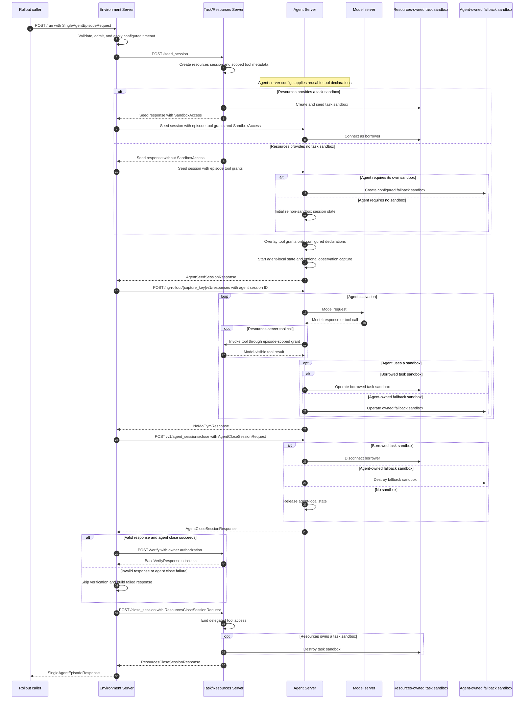
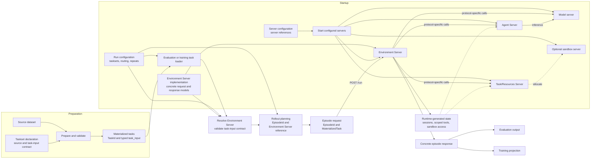
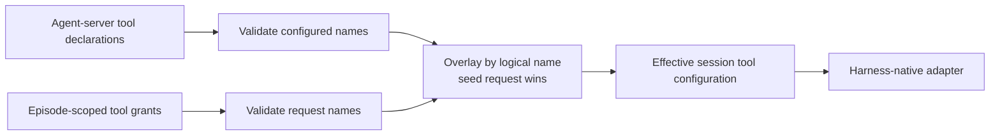

# Episode Architecture for NeMo Gym

## Problem summary

Today, rollout collection sends `POST /run` to an Agent Server. That method commonly seeds resources-server state, runs the agent, asks the Task/Resources Server to verify the result, and performs cleanup.

This creates several problems:

- Episode orchestration is embedded in each Agent Server's `/run`: resources-session setup, agent invocation, verification, and cleanup.
- Gym has no framework-owned intervention point for this sequence, so changing the episode protocol requires changing agent-server code.
- Shared behavior such as sandbox setup, resources access, timeouts, cancellation, cookies, and cleanup is implemented repeatedly and inconsistently across Agent Servers.
- Agent and resources-server code can both believe they own the same sandbox.
- A bare sandbox ID does not describe how another server connects, where commands run, or which operations are allowed.

The proposed architecture moves episode-level ordering into an Environment Server. An Environment Server may compose Gym servers or run a self-contained external framework whose components do not fit Gym's Agent Server and Task/Resources Server boundaries.

An Agent Server's `/v1/responses` implementation remains responsible for agent behavior, including calls to Task/Resources Server tools. The Environment Server owns `POST /run` and the surrounding episode sequence. Each participating server retains ownership of the state, sessions, sandboxes, and services it creates.

## Scope

### Requirements

- **Environment Server**
  - Exposes `/run` and owns the episode protocol and Environment-Server-defined final result.
  - Defines a concrete request and result derived from the base episode contracts.
  - Orchestrates Agent Servers and Task/Resources Servers when those boundaries fit, or implements a self-contained external protocol.
  - Applies configured timeouts and cancellation and coordinates cleanup on every handled exit path.
  - Asks participating servers to clean up the state they own. A self-contained Environment Server cleans up state created within its own protocol.
  - Preserves existing Gym dataset, evaluation, and NeMo RL interfaces during migration.
  - Uses Gym's configuration, startup, addressing, readiness, and telemetry mechanisms.
- **Agent Server**
  - Owns agent behavior, dependencies, sessions, and objects it creates.
  - Continues to expose `POST /v1/responses`.
  - Can operate a task sandbox owned by a Task/Resources Server without authority to destroy it.
  - Can provision and clean up its own sandbox when no task sandbox is supplied.
- **Task/Resources Server**
  - Owns task setup, stateful tools, verification, and benchmark-specific cleanup.
  - May create a task sandbox and grant the agent restricted access.
  - Validates its benchmark-specific verification result and returns it to the Environment Server.
  - Retains ownership of its state and task sandbox through verification and cleanup.

### Episode, rollout, task, and session

- A **task** is dataset content identified by `TaskId`.
- A **rollout** is one logical sample produced for that task.
- An **attempt** is one physical execution of a rollout. A retry increments the attempt.
- An **episode** is the complete lifecycle for one attempt, including all interaction turns, verification, and cleanup.
- A **resources session** is Task/Resources Server state created when an Environment Server uses a Task/Resources Server.
- An **agent session** is Agent-Server-local state created when an Environment Server delegates behavior to an Agent Server.

`POST /v1/responses` is an agent invocation, not the definition of an interaction turn. An Environment Server may use one or more agent invocations during a turn, and each invocation may contain multiple model and tool calls.

An episode produces one concrete Environment Server response. Evaluation and training adapters may project zero, one, or multiple invocation trajectories from it. The initial single-agent protocol projects one agent response; a multi-participant Environment Server preserves role attribution for every invocation.

## Components and ownership

### Responsibilities

- **Task/Resources Server:** When used, owns task setup, benchmark state, tools, verification, and every sandbox or service it creates.
- **Environment Server:** Owns `/run`, protocol ordering, timeout enforcement, and assembly of its concrete response. A resources-backed Environment Server asks participating servers to clean up their own state; a self-contained Environment Server cleans up the state it creates.
- **Agent Server:** When used, owns the agent implementation, its dependencies, its agent session, local subprocesses, and any fallback sandbox it creates.
- **Model server:** Exposes Gym's model API and proxies inference requests to the configured inference endpoint.
- **Sandbox server:** Optionally holds sandbox-provider state that cannot be reconstructed in another process.


The diagram shows the resources-backed single-agent deployment. A concrete Environment Server may use a different subset of servers.

In the resources-backed deployment, ownership does not move with access:

- The Task/Resources Server stops a task sandbox it created.
- An agent session disconnects from borrowed sandbox access.
- An Agent Server stops a fallback sandbox it created.
- The Environment Server transports sandbox access between these servers but does not use it.

### Protocol, behavior, and hosting

- The **episode protocol** defines processing order, verification timing, and cleanup. `SingleAgentEnvironmentServer` is the initial implementation.
- **Agent behavior** defines how one `/v1/responses` request produces one `NeMoGymResponse`.
- **Agent hosting** provides the process, virtual environment, configuration, and scaling boundary for that behavior.

Participant count, invocation ordering, and invocation attribution belong to the concrete Environment Server. A model or agent invocation does not automatically become the episode's primary result.

Changing OpenCode to Terminus-2 changes agent behavior. Adding a simulated user changes the episode protocol. Moving an agent to another image changes hosting. Integrating a self-contained external framework may place its protocol-specific components directly in an Environment Server.

### Server types

The architecture adds a fourth server type and an optional fifth:

```text
BaseServerTypeConfig
├── ResponsesAPIModelServerTypeConfig
├── ResourcesServerTypeConfig
├── ResponsesAPIAgentServerTypeConfig
├── EnvironmentServerTypeConfig
└── SandboxServerTypeConfig
```

The matching references are:

```python
class EnvironmentServerRef(BaseModel):
    type: Literal["environment_servers"]
    name: str


class SandboxServerRef(BaseModel):
    type: Literal["sandbox_servers"]
    name: str
```

`EnvironmentServerRef` and `SandboxServerRef` join `AgentServerRef`, `ResourcesServerRef`, and `ModelServerRef` in Gym's reference validation and `ServerClient` addressing.

Shared Environment Server contracts and `BaseEnvironmentServer` belong in `nemo_gym`. Concrete Environment Server deployments belong in the top-level `environment_servers/` directory, parallel to `responses_api_agents/`, `resources_servers/`, and `responses_api_models/`.

Contract ownership follows the server boundary. `episode_types.py` contains only the shared episode identity and request/response envelope. `tool_access.py` contains agent-visible tool access, and `sandbox/access.py` contains sandbox connection grants. Agent session request and response models live with their routes in `base_responses_api_agent.py`; resources session request and response models live with their routes in `base_resources_server.py`. Concrete single-agent episode types remain separate because they define one Environment Server protocol rather than either participant API.

## Base episode contracts and concrete protocols

### Resources-backed single-agent flow

The rollout caller sends one request to the Environment Server and receives one final result. The concrete Environment Server decides which servers participate and owns the resulting protocol.

`SingleAgentEnvironmentServer` uses the resources-backed flow below. The Task/Resources Server prepares the task first. Seed creates a resources session and may return agent-visible tool access and `SandboxAccess`. The Environment Server retains the resources session for verification and cleanup. The Task/Resources Server remains the owner of its session state and task sandbox.

This Environment Server seeds an agent session before invoking the Responses API. `AgentSeedSessionRequest` contains immutable episode and task identity, fully resolved episode-scoped tool grants, and optional `SandboxAccess`. The Agent Server combines those values with its configured harness defaults while seeding the session:

- When resources supplied `SandboxAccess`, the agent session connects to that sandbox as a borrower.
- When resources supplied no sandbox access and the agent requires a sandbox, the agent session creates its configured fallback sandbox.
- When the agent requires no sandbox, the agent session configures its effective tool access and initializes any agent-local session state.

The Environment Server closes its agent session before asking the Task/Resources Server to verify. The Task/Resources Server then verifies the response and any state it owns. Finally, the Environment Server closes the resources session, and each server destroys only the objects it owns.




### Self-contained Environment Server

An Environment Server does not have to use a Task/Resources Server or Agent Server. It may validate its concrete task input, run an external framework, call model servers, produce its concrete episode result, and clean up its own state entirely inside `run()`.

This path is appropriate when the external framework's state, participants, tools, and verifier form one protocol that does not map cleanly onto Gym's existing server boundaries. The Environment Server deployment supplies that framework's dependency and isolation boundary. It can later delegate individual responsibilities to Gym servers without changing its concrete `/run` contract or the base identity contract.

### Tasksets and materialized task input

A taskset is a declaration plus its prepared task rows. The declaration identifies the source, preparation logic, and task-input contract. The taskset preparation implementation converts each source record into a `MaterializedTask` and produces the taskset revision. The declaration is consumed when an evaluation or training run loads tasks; it is not a server and is not sent with each episode.

The [Gym Tasks RFC](https://rfc.frontier-evals.nvidia.com/m/frontier-eval-rfcs/r/gym-tasks) must provide each materialized task as:

```python
TaskInputT = TypeVar("TaskInputT", bound=BaseModel)


class MaterializedTask(BaseModel, Generic[TaskInputT]):
    task_id: TaskId
    task_input: TaskInputT
```

`TaskId` identifies the taskset, task, and taskset revision. `task_input` is the taskset preparation implementation's typed output. Its contract describes an episode protocol, not a concrete Environment Server deployment or agent. A taskset producing `SingleAgentTaskInput` can therefore be routed to any Environment Server that accepts that contract. A user-simulation taskset can produce a different input type without adding simulation fields to the base contract.

The task layer owns source preparation, provenance, ID generation, collation, and validation of `task_input`. Every field in `task_input` comes from the prepared task or its source dataset. Environment Server, participant-server, and run configuration remain separate and are not copied into `task_input`. Run configuration selects tasksets and maps them to compatible Environment Servers. Rollout planning adds `EpisodeId`, repetition, grouping, and Environment Server routing. It does not modify `task_input`.

The taskset declaration and Environment Server registration name the same task-input contract. Before planning any episode, Gym validates that every selected Environment Server accepts the taskset's declared contract. The contract binds a stable identifier to its Pydantic task-input model; Python generic parameters alone do not provide routing metadata. Fan-out requires every target to accept that same contract unless the run explicitly configures an adapter. Compatibility translation converts current flat rows into typed materialized tasks until native tasksets are available.

The contract identifier is declaration metadata, not a field copied into every task or episode request. The shared protocol definition owns the identifier and model. For example, a taskset preparer and a single-agent Environment Server both register `nemo_gym.single_agent.v1` with `SingleAgentTaskInput`. The preparer validates source rows with that model. The rollout planner compares the registered identifiers when resolving the configured Environment Server. The Environment Server endpoint performs the final body validation with `SingleAgentEpisodeRequest`.



For evaluation, Gym loads the selected tasksets and plans episodes over their materialized tasks. For training, the training data loader samples the same materialized tasks and sends planned episodes through the same Environment Server `/run` contract. The taskset declaration is used to find and validate those tasks at startup; the complete `MaterializedTask` travels inside each episode request.

Server configuration and run configuration have separate jobs. Server configuration starts Environment Servers and the agent, resources, model, and sandbox servers they reference. Run configuration selects tasksets and connects each taskset to a logical Environment Server deployment. The rollout planner is where loaded task data and the selected Environment Server first meet.

Values that describe one task belong in `task_input`. Environment Server routing, fan-out, repetition, model bindings, concurrency, and run-wide timeouts belong in run or server configuration. `EpisodeId`, session IDs, scoped tool access, sandbox access, and replica selection are generated at runtime.

The episode foundation depends only on this materialized-task interface. Task preparation commands, manifests, provenance storage, and asset fetching remain in the Tasks RFC.

### Identity

```python
class EpisodeId(BaseModel):
    model_config = ConfigDict(extra="forbid", frozen=True)

    rollout_id: str
    attempt: NonNegativeInt = 0
    group_id: str | None = None
    member_index: NonNegativeInt | None = None
    group_size: PositiveInt | None = None

    @model_validator(mode="after")
    def validate_group(self) -> Self:
        group_fields = (
            self.group_id,
            self.member_index,
            self.group_size,
        )
        if any(value is not None for value in group_fields):
            if any(value is None for value in group_fields):
                raise ValueError("group fields must be supplied together")
            if self.member_index >= self.group_size:
                raise ValueError("member_index must be less than group_size")
        return self
```

`EpisodeId` is the immutable correlation model carried through Environment Server, resources-server, agent-server, model-call, observation, and logging paths.

- `rollout_id` remains stable when a failed rollout is retried.
- `attempt` identifies the physical retry.
- The three group fields are present only when the episode belongs to a group.
- `group_id`, `member_index`, and `group_size` remain stable when `attempt` increments.

`TaskId` belongs to the Tasks RFC and remains separate because it identifies dataset content rather than an execution.

Current Gym constructs rollout correlation from `_ng_task_index`, `_ng_rollout_index`, and optional `_ng_attempt_index`. Compatibility translation uses the task and rollout indices for the stable `rollout_id` and keeps `_ng_attempt_index` in `attempt`.

### Request and response

Every Environment Server derives its concrete request and response from minimal base contracts. The base models provide episode identity, a typed materialized task, and handled-failure transport. They do not prescribe a participant count, Responses API invocation, Task/Resources Server, verifier, or trajectory shape.

```python
type JsonValue = (
    None
    | bool
    | int
    | float
    | str
    | list["JsonValue"]
    | dict[str, "JsonValue"]
)


EpisodeResultT = TypeVar("EpisodeResultT", bound=BaseModel)


class BaseEpisodeRequest(BaseModel, Generic[TaskInputT]):
    model_config = ConfigDict(extra="forbid")

    episode_id: EpisodeId
    task: MaterializedTask[TaskInputT]


class EpisodeFailure(BaseModel):
    model_config = ConfigDict(extra="forbid")

    message: str = Field(max_length=2000)
    terminal: bool


class BaseEpisodeResponse(BaseModel, Generic[EpisodeResultT]):
    model_config = ConfigDict(extra="forbid")

    episode_id: EpisodeId
    task_id: TaskId
    result: EpisodeResultT | None = None
    failure: EpisodeFailure | None = None

    @model_validator(mode="after")
    def validate_result(self) -> Self:
        if (self.result is None) == (self.failure is None):
            raise ValueError("exactly one of result or failure is required")
        return self


class SingleAgentTaskInput(BaseModel):
    model_config = ConfigDict(extra="forbid")

    responses_create_params: NeMoGymResponseCreateParamsNonStreaming
    task_data: dict[str, JsonValue]


class SingleAgentEpisodeResult(BaseModel):
    model_config = ConfigDict(extra="forbid")

    verification: BaseVerifyResponse
    agent_observations: AgentObservationBundle | None = None


class SingleAgentEpisodeFailure(EpisodeFailure):
    stage: Literal["seed", "agent", "verification", "cleanup"] | None = None
    partial_response: NeMoGymResponse | None = None


class SingleAgentEpisodeRequest(
    BaseEpisodeRequest[SingleAgentTaskInput],
):
    pass


class SingleAgentEpisodeResponse(
    BaseEpisodeResponse[SingleAgentEpisodeResult],
):
    failure: SingleAgentEpisodeFailure | None = None
```

Validation enforces:

- Every concrete request retains the base `episode_id` and typed `task`.
- `task.task_id` identifies the immutable task content while `episode_id` identifies this execution attempt.
- The concrete endpoint annotation recursively validates `task.task_input` as the Environment Server's accepted task-input model. The serialized JSON carries no Python generic type marker.
- Exactly one of `result` or `failure` is present.

`EpisodeFailure` deliberately has no framework-wide failure-kind taxonomy. `terminal=false` means only that rollout collection may make another attempt under its configured attempt limit. It does not claim that replay is idempotent or free of duplicate external effects. Environment Servers derive terminality from concrete failures: connection failures, timeouts, HTTP 408/425/429, and HTTP 5xx are non-terminal; schema errors, other HTTP 4xx responses, protocol incompatibilities, and cleanup failures are terminal. `message` is bounded diagnostic text, not a stable machine-readable category.
- `SingleAgentEpisodeResult.verification` retains the inherited `responses_create_params`, `response`, `reward`, and every additional field validated by the Task/Resources Server.
- The single-agent Environment Server validates the common `BaseVerifyResponse` fields without discarding those additional fields.
- Concrete subclasses may define `reward_components`, `mask_sample`, and other benchmark-specific fields. When present, `mask_sample` may be true when the verifier accepts a result affected by partial infrastructure failure.
- A failed single-agent episode may retain a valid agent response in `failure.partial_response`; that field is not part of the base failure contract.
- The response `episode_id` and `task_id` match the request.
- The concrete Environment Server validates its result, including finite rewards where applicable.
- Failure messages are bounded and contain no credentials or internal paths.

NeMo-Sim demonstrates the extension:

```python
class NeMoSimTaskInput(BaseModel):
    model_config = ConfigDict(extra="forbid")

    scenario: NeMoSimScenario
    model_responses_create_params: dict[
        str,
        NeMoGymResponseCreateParamsNonStreaming,
    ] = Field(default_factory=dict)


class NeMoSimInvocation(BaseModel):
    model_config = ConfigDict(extra="forbid")

    alias: str
    executor: Literal["agent", "model"]
    call_index: int
    request: dict[str, Any]
    response: dict[str, Any]
    ng_trajectory: dict[str, Any] | None = None


class NeMoSimEpisodeResult(BaseModel):
    model_config = ConfigDict(extra="forbid")

    reward: float
    nemo_sim_result: dict[str, Any]
    invocations: list[NeMoSimInvocation]
    episode_interaction_protocol: str = "nemo_sim.ConversationLoop"


class NeMoSimEpisodeRequest(
    BaseEpisodeRequest[NeMoSimTaskInput],
):
    pass


class NeMoSimEpisodeResponse(
    BaseEpisodeResponse[NeMoSimEpisodeResult],
):
    pass
```

The base episode contract does not interpret NeMo-Sim's fields or require one primary `NeMoGymResponse`. NeMo-Sim's `simulation_config` belongs to `NeMoSimEnvironmentServerConfig`, not `NeMoSimTaskInput`. Migration moves that legacy request field into Environment Server configuration. A compatibility adapter converts the remaining request and response fields until callers use the native contracts.

### Grouped episodes

The rollout planner assigns group fields before dispatch. The Environment Server does not infer groups from arrival order or prompt content.

- `group_id` identifies one planned group.
- `member_index` gives each member a stable position.
- `group_size` states how many members must arrive.
- A retry keeps the same group fields and increments `attempt`.
- The environment-server-defined result or delegated verifier owns group-specific state.

Worker-local dictionaries cannot coordinate a group spread across replicas. A grouped verifier therefore requires shared state or routing that keeps every member with the same verifier owner.

## From dataset to `/run`

Users do not add agent-session or Environment Server-routing fields to datasets.

The flow is:

1. Taskset preparation converts each source record into a `MaterializedTask[TaskInputT]`. It assigns `TaskId`, constructs the protocol-shaped `task_input`, and validates that input with the taskset's declared task-input contract.
2. Run configuration selects one or more tasksets and resolves each one to one or more logical `EnvironmentServerRef` values.
3. Gym compares the taskset's declared task-input contract with the contract registered by every selected Environment Server. An incompatible mapping fails before episode dispatch.
4. Fan-out, repetition, and grouping produce planned episodes. The rollout planner assigns `EpisodeId` to each attempt.
5. The rollout planner constructs the common request envelope from that `EpisodeId` and the unchanged `MaterializedTask`. The collector does not import or construct an environment-server-specific request model.
6. The runtime selects a replica for the logical Environment Server and sends the envelope to `POST /run`.
7. The selected Environment Server's FastAPI route binds the envelope to its concrete `BaseEpisodeRequest[TaskInputT]` subtype. Pydantic recursively validates `task.task_input` with the concrete model before the Environment Server performs network calls.
8. The Environment Server runs its protocol and returns its concrete `BaseEpisodeResponse` subtype.
9. The collector decodes and persists the registered concrete response type. Its environment-server-specific projector produces evaluation or training records.

Compatibility translation performs step 1 for current flat rows until their tasksets emit native `MaterializedTask` values. The compatibility response projector restores existing result shapes where required.

For `SingleAgentEnvironmentServer`, `SingleAgentTaskInput` contains `responses_create_params` and `task_data`. The Environment Server passes both to resources seed, passes only `responses_create_params` to the agent's `/v1/responses`, and returns verification plus optional agent observations.

For NeMo-Sim, `NeMoSimTaskInput` contains the task's `scenario` and role-keyed `model_responses_create_params`. The selected Environment Server supplies `simulation_config` from its configuration. The Environment Server returns the simulation result and attributed invocation list. No single-agent fields are added to the base contract.

### Environment Server selection and dispatch

Environment Server routing is run configuration, not durable task data. Native dataset rows do not contain `agent_ref` or `EnvironmentServerRef`, and the base episode request contains neither.

Native rollout configuration supports:

```yaml
environment_server: reasoning_gym_simple
environment_server_map:
  swebench_verified: swebench_opencode
  tau2: tau2_environment_server
fan_out:
  reasoning_gym:
    - reasoning_gym_simple
    - reasoning_gym_opencode
```

- `environment_server` is the default for tasksets without a more specific rule.
- `environment_server_map` maps a taskset to one Environment Server.
- `fan_out` maps a taskset to several Environment Servers and creates one planned episode per target.
- A taskset named in both `environment_server_map` and `fan_out` is invalid.
- Without a matching rule or default Environment Server, routing fails before dispatch.

Every Environment Server deployment registers its concrete request and response models and its accepted task-input contract. Every resolved target must accept the taskset's declared contract. Run materialization records the selected `EnvironmentServerRef` and response-schema identity alongside the request so resume, decoding, logging, and dispatch use the same decision. This routing metadata is not inserted into the request or `task_input`.

Replica selection happens after Environment Server selection. Local Gym may have one replica. A sharded NeMo RL run discovers which Environment Server deployments each Gym shard hosts, builds an Environment Server-to-shard map, and distributes complete rollout groups across that shard's replicas. The selected replica is transport state and does not appear in the episode request.

During migration, legacy routing remains available:

1. `environment_server_name` selects one compatibility Environment Server for every row.
2. `environment_server_map` selects Environment Servers by `task_source`; `_default` handles unmatched sources.
3. A row without an Environment Server route retains the existing `agent_map`, `agent_name`, and row-level `agent_ref` behavior and resolves to the existing agent-server `/run`.
4. Before dispatch, Gym verifies that the selected Environment Server exists, its agent and resources references resolve, the row's `task_source` matches the configured Task/Resources Server, and the agent is included in the Task/Resources Server's `allowed_agents`.

`agent_ref` is compatibility input, not a requirement for native tasks. Configuration validation rejects ambiguous legacy names. Neither native nor legacy task payloads can select a concrete replica.

## Resources-server session for the single-agent flow

These contracts define the environment-server-neutral resources-session boundary. A concrete Environment Server may specialize the verification input or use no Task/Resources Server.

### Seed and access

The Task/Resources Server creates its episode state during seed. The Environment Server does not open an empty remote session before calling seed.

```python
class ResourcesSeedSessionRequest(BaseModel):
    model_config = ConfigDict(extra="forbid")

    episode_id: EpisodeId
    task_id: TaskId
    task_data: dict[str, JsonValue]


class MCPServerMetadata(BaseModel):
    server_name: str
    url_path: str = "/mcp"
    transport: Literal["http"] = "http"
    headers: dict[str, str]


class ResourcesSeedSessionResponse(BaseModel):
    resources_session_id: str
    resources_tools: MCPServerMetadata | None = None
    sandbox_access: SandboxAccess | None = None
```

`ResourcesSeedSessionRequest` is the opt-in native resources-session request. It does not extend the empty compatibility `BaseSeedSessionRequest` used by existing Task/Resources Servers. It carries episode identity, task identity, and benchmark-specific task data. Each migrated Task/Resources Server validates `task_data` with its benchmark-specific Pydantic model before creating state. The Environment Server posts the same JSON without importing or interpreting that model. The resources session retains the validated task data for verification.

The native path uses `ResourcesSeedSessionResponse` without adding orchestration fields to every existing resources-server response. Task/Resources Servers that do not participate in this protocol continue returning their current response types, including an empty `BaseSeedSessionResponse`.

The Environment Server retains the resources-server reference, session ID, and private transport state established by seed. It uses that state for verification and cleanup. It passes only agent-visible tool access and optional sandbox access to the Agent Server.

### Tools

Tool schemas may already appear in `responses_create_params.tools`. A Task/Resources Server may also return `MCPServerMetadata` for tools exposed from the seeded session.

Agent-server configuration owns reusable harness defaults, including MCP declarations that are the same for every episode. A configured declaration is not necessarily a server-lifetime connection: an adapter may start its configured stdio server separately for each agent session. The adapter owns that native connection policy and must prevent state from leaking across sessions.

The seed request carries only grants whose access is scoped to the task attempt. Service type does not determine that lifetime. For example, a shared memory service can still require an episode-specific namespace or credential, so its resolved grant belongs in the seed request.

The Environment Server converts resources metadata and any other Environment Server-owned policy into fully resolved grants:

```python
class DirectHTTPToolAccess(BaseModel):
    kind: Literal["direct_http"]
    name: str
    required: bool
    base_url: AnyHttpUrl
    cookies: dict[str, str]
    headers: dict[str, str]


class MCPStreamableHTTPConnection(BaseModel):
    transport: Literal["streamable_http"]
    url: AnyHttpUrl
    headers: dict[str, str]


class MCPStdioConnection(BaseModel):
    transport: Literal["stdio"]
    command: str
    args: list[str] = Field(default_factory=list)
    env: dict[str, str] = Field(default_factory=dict)
    cwd: str | None = None


MCPConnection = Annotated[
    MCPStreamableHTTPConnection | MCPStdioConnection,
    Field(discriminator="transport"),
]


class MCPToolAccess(BaseModel):
    kind: Literal["mcp"]
    name: str
    required: bool
    connection: MCPConnection


ToolAccess = Annotated[
    DirectHTTPToolAccess | MCPToolAccess,
    Field(discriminator="kind"),
]


class BaseResponsesAPIAgentConfig(BaseServerConfig):
    tool_accesses: list[ToolAccess] = Field(default_factory=list)
```

The same canonical list shape is used for configured declarations and seed-request grants so the adapter has one merge path. Existing harness-native static MCP configuration can remain during migration, but each adapter must normalize it into this logical-name model before applying request overrides.

An MCP HTTP grant contains an absolute URL and all scoped headers. An MCP stdio grant contains an executable and arguments rather than a shell command. A direct-HTTP grant preserves the current trusted Python-agent path by carrying one named resources endpoint and its explicit session state; it is not translated into MCP. Neither form carries resources lifecycle authority. Both discriminators are required in serialized JSON.

The adapter validates names within each source, overlays episode grants onto configured declarations by logical name, validates the effective configuration, and translates each supported entry into the harness-native tool configuration. Duplicate names within configuration or within one seed request are invalid. A seed-request grant with the same name as a configured declaration replaces that declaration for this session; request data has precedence because it carries the Environment Server's task-specific authority.



The Agent Server configures the agent implementation before activation:

- clients that support per-server HTTP headers receive the MCP endpoint and scoped headers;
- a header-incapable black-box agent requires an agent-server-owned proxy that adds the scoped headers;
- trusted Python agents may consume a direct-HTTP entry through their typed tool client;
- failure to establish a required grant rejects session seed, while an unavailable optional grant may be omitted with an observation or diagnostic;
- an agent integration rejects any required access kind or transport it cannot implement.

The Environment Server does not proxy individual tool calls. The Task/Resources Server authorizes each call against the seeded session and returns the model-visible result. Tool credentials are never placed in model input or episode output.

Declaration lifetime and connection lifetime are independent. On close, the adapter releases connections and subprocesses created for that agent session regardless of whether their declarations came from server configuration or the seed request. Closing an HTTP client never stops its remote service. A request override shadows a configured declaration only for that session and does not mutate or destroy the configured declaration.

### Verification and cleanup

```python
VerificationInputT = TypeVar("VerificationInputT", bound=BaseModel)


class ResourcesVerifyRequest(
    BaseModel,
    Generic[VerificationInputT],
):
    model_config = ConfigDict(extra="forbid")

    episode_id: EpisodeId
    verification_input: VerificationInputT


class ResponsesVerificationInput(BaseModel):
    model_config = ConfigDict(extra="forbid")

    responses_create_params: NeMoGymResponseCreateParamsNonStreaming
    response: NeMoGymResponse


class ResponsesResourcesVerifyRequest(
    ResourcesVerifyRequest[
        ResponsesVerificationInput
    ],
):
    pass


class ResourcesCloseSessionRequest(BaseModel):
    model_config = ConfigDict(extra="forbid")

    resources_session_id: str
    episode_id: EpisodeId


class ResourcesCloseSessionResponse(BaseModel):
    model_config = ConfigDict(extra="forbid")

    resources_session_id: str
```

The Environment Server uses three resources-server operations:

- `POST /seed_session`: validates `task_data`, creates resources-server state, and returns `ResourcesSeedSessionResponse`.
- `POST /verify`: accepts a concrete `ResourcesVerifyRequest` specialization in the resources session established by seed and returns the Task/Resources Server's concrete `BaseVerifyResponse` subclass.
- `POST /close_session`: accepts `ResourcesCloseSessionRequest`, releases resources-server state, and returns `ResourcesCloseSessionResponse`.

The close request identifies the resources session and repeats the immutable `EpisodeId`. The Task/Resources Server validates both against the identity retained at seed. Session authorization remains in HTTP metadata established during seed.

The Task/Resources Server validates its concrete `BaseVerifyResponse` subclass before returning it. The Environment Server validates the common fields and preserves all additional fields without interpreting them.

The online `/verify` operation is session-backed. Offline reverification must replay seed, verify, and close from the materialized task, or use a separate stateless reverification contract. It does not expand the online request with the legacy flat dataset row.

`/seed_session` and `/verify` preserve current Gym route names. `/close_session` is a new required lifecycle endpoint.

Cleanup is safe to retry while the owning worker remains alive. Resources-server-owned external objects use bounded TTLs. The initial design does not provide exactly-once execution or recovery across worker restart.

## Sandbox access

```python
class DirectSandboxConnection(BaseModel):
    model_config = ConfigDict(extra="forbid")

    kind: Literal["direct"]
    provider_config_ref: str
    descriptor: dict[str, JsonValue]


class SandboxServerConnection(BaseModel):
    model_config = ConfigDict(extra="forbid")

    kind: Literal["sandbox_server"]
    sandbox_ref: SandboxRef


class SandboxAccess(BaseModel):
    model_config = ConfigDict(extra="forbid")

    connection: Annotated[
        DirectSandboxConnection | SandboxServerConnection,
        Field(discriminator="kind"),
    ]
    workdir: str
```

`SandboxAccess` is a serializable reference that lets an Agent Server connect to a task sandbox owned by a Task/Resources Server. The connection discriminator tells the agent whether to reconnect through a provider or a sandbox server. `workdir` identifies where agent commands run.

The agent receives a borrower interface for command execution and file transfer within the task workdir. The Task/Resources Server retains the owner authority used to stop the sandbox after verification.

Borrower restrictions require enforcement by the provider or sandbox server. A Python facade alone prevents accidental misuse but is not an authorization boundary.

For direct access, `provider_config_ref` is a reference to an existing top-level Gym sandbox-provider configuration block, such as the `sandbox` key in the deployment config. It is not a provider type such as `opensandbox`. The Task/Resources Server creates and serializes the sandbox with that named configuration. The Agent Server resolves the reference through `server_client.global_config_dict`, constructs the provider, and calls `connect(descriptor)`. No borrowed-sandbox provider setting is added to agent configuration.

Direct handoff requires a named provider configuration because an inline provider mapping may contain credentials and has no stable reference. The agent-server environment must have the provider implementation installed; otherwise agent-session seed fails before inference. Agent-session close disconnects the borrowed provider client without calling the owner operation that destroys the physical sandbox.

### Seed behavior

- When `ResourcesSeedSessionResponse.sandbox_access` is present, the Task/Resources Server requires the agent to operate that task sandbox.
- When it is absent, the agent follows its own configuration.
- Absence does not mean the Task/Resources Server failed to provision a required sandbox. That failure makes seed fail.
- The Task/Resources Server may create other private sandboxes for tools or verification without exposing them.
- The Task/Resources Server validates handoff compatibility before allocation when possible. If seed fails after creating a sandbox or other object, it releases that object before returning the failure.

The Environment Server passes `SandboxAccess` unchanged while seeding the agent session.

### Model access from sandboxed agents

A sandboxed agent may reach the Gym Model Server directly or through an Agent Server-managed relay. This is a transport choice, not a different episode protocol.

Direct access is valid only when configuration supplies a runtime-reachable, scoped model endpoint. The endpoint carries the same `EpisodeId`, capture path, token-capture policy, and model-call identity as the relayed path. The Agent Server injects the endpoint and its short-lived credential while initializing the session; neither value belongs in task data or persisted agent configuration.

When the sandbox cannot reach an authorized model endpoint, the Agent Server may relay model requests without moving the harness out of the sandbox. Both paths return model responses to the same harness adapter and produce the same response, usage, lineage, and observation contracts. Connectivity is resolved before activation rather than discovered by retrying model traffic through progressively broader network access.

### Optional sandbox server

Direct handoff is valid when the provider can serialize and reconnect its sandbox across processes. Its access restrictions are limited to what that provider enforces; the Agent Server must expose only borrower operations and disconnect without destroying the sandbox.

Providers that cannot reconnect directly, or deployments that require server-enforced borrower authorization, use a sandbox server. `SandboxServerConnection.sandbox_ref` carries that server's sandbox ID, operate lease, endpoint, and workdir. Exact lease, revocation, and provider configuration remain part of the sandbox-server design.

## Agent-server session

This section applies to Environment Servers that delegate agent behavior to an Agent Server.

### Why a session is required

The `/v1/responses` request body remains unchanged:

```text
POST /v1/responses

NeMoGymResponseCreateParamsNonStreaming
    -> NeMoGymResponse
```

The agent still needs episode-scoped state that is not part of the Responses API:

- immutable `EpisodeId`
- immutable `TaskId`
- optional episode-scoped tool grants
- optional borrowed sandbox access
- agent-local subprocess or fallback-sandbox handles
- optional `AgentObservationBundle` capture state
- owned-object cleanup

The single-agent Environment Server creates that state before calling `/v1/responses` and closes it afterward.

A user-simulation Environment Server can create assistant and simulated-user sessions once, call `/v1/responses` repeatedly according to the interaction protocol, attribute each request and response to its role and invocation index, and close both sessions before verification. The Environment Server owns role visibility, ordering, termination, and its concrete result. A separate turn endpoint is unnecessary unless a protocol cannot express an activation through the Responses API.

### Data models

```python
class AgentSeedSessionRequest(BaseModel):
    model_config = ConfigDict(extra="forbid")

    episode_id: EpisodeId
    task_id: TaskId
    tool_accesses: list[ToolAccess] = Field(default_factory=list)
    sandbox_access: SandboxAccess | None = None


class AgentSeedSessionResponse(BaseModel):
    model_config = ConfigDict(extra="forbid")

    agent_session_id: str


class AgentCloseSessionRequest(BaseModel):
    model_config = ConfigDict(extra="forbid")

    agent_session_id: str
    episode_id: EpisodeId


class AgentCloseSessionResponse(BaseModel):
    model_config = ConfigDict(extra="forbid")

    agent_session_id: str
    agent_observations: AgentObservationBundle | None = None
    resources_cookies: dict[str, str] | None = None
```

`agent_observations` contains optional agent-server observability records collected during the session. It is not task or environment state. `resources_cookies` carries updates produced only by direct-HTTP tool access so the Environment Server can merge them into the resources-session cookie jar before verification and close. Resources lifecycle authority remains with the Environment Server.

### `POST /v1/agent_sessions`

The Environment Server sends `AgentSeedSessionRequest` to the configured `AgentServerRef`.

The Agent Server:

1. Validates episode and task identity, unique grant names, access and transport configuration, and sandbox access.
2. Overlays episode-scoped tool grants onto its configured declarations by logical name, with the seed request taking precedence.
3. Creates the harness-native tool configuration and either connects the borrowed sandbox or creates its configured fallback sandbox.
4. Starts agent-local state and, when supported, observation capture correlated with `EpisodeId`.
5. Returns `AgentSeedSessionResponse`.

If setup fails, the Agent Server releases anything it already acquired and returns no usable session.

Agent-session routing and state ownership are part of the agent-server base, not a mixin copied into individual agents. Session-capable subclasses opt in and implement typed initialization and close hooks for their own state. The base registers the routes, allocates opaque session IDs, stores worker-local state, enforces episode identity and activation count, and removes the registry entry after the subclass close hook succeeds.

### Responses invocation

The Environment Server sends the ordinary Responses body to an attempt-qualified twin of the agent endpoint:

```text
POST /ng-rollout/<capture_key>/v1/responses
POST /ng-rollout/<capture_key>/training-token-capture/v1/responses

X-NeMo-Gym-Agent-Session-Id: <agent_session_id>
```

The second route is selected only when token capture is enabled. The prefix preserves rollout and attempt correlation while the request and response bodies remain unchanged.

The session ID remains HTTP metadata because it identifies agent-server state rather than Responses API input. Agent implementations read it from the FastAPI `Request` through a base helper; it is not an additional parameter in each `responses()` signature.

The Environment Server does not send its episode request or a legacy `BaseRunRequest` to the Agent Server. Task content visible to the agent belongs in the Responses body. Episode-scoped grants and sandbox setup belong in `AgentSeedSessionRequest`. Reusable tool declarations and other static harness behavior belong in agent-server configuration.

The Agent Server:

- rejects a missing, expired, closed, or mismatched session
- places the session's immutable `EpisodeId` in Gym's request-scoped correlation context
- exposes episode and task identity, the effective tool configuration, and optional sandbox access to the agent implementation
- performs one complete agent activation
- returns `NeMoGymResponse`

For an activation containing several model/tool iterations, the agent and model-server chat schemas preserve assistant `reasoning_content` when the provider returns it. Dropping or rejecting that field can make a thinking model's second request fail after its first tool call.

The calling Environment Server may record the request and response under a participant role and invocation index. The endpoint does not seed Task/Resources Server state, verify a reward, clean up state owned by a Task/Resources Server, or publish an episode result.

The initial single-agent Environment Server performs one Responses activation per session. The route's `capture_key` must match the session's immutable `EpisodeId`. Concurrent or repeated activations are rejected.

### `POST /v1/agent_sessions/close`

The Environment Server sends `AgentCloseSessionRequest` with the session identifier and immutable `EpisodeId`. The Agent Server validates both against the identity retained at seed; `EpisodeId` scopes the session but does not select it.

The Agent Server:

1. Stops the activation and agent-owned subprocesses.
2. Releases session-owned tool clients and stdio processes.
3. Stops an agent-owned fallback sandbox or disconnects from a borrowed sandbox.
4. Flushes observations and returns `AgentCloseSessionResponse`.

A successful close means agent-controlled activity has stopped. If close fails, the Environment Server does not begin final verification. Session expiry triggers cleanup while the worker remains alive; provider TTLs bound external objects after worker loss.

## Single-agent Environment Server

`SingleAgentEnvironmentServer` means one participating agent, not one model turn. Its initial implementation performs one `/v1/responses` invocation, which may contain many model and tool turns.

### Configuration

```python
class BaseEnvironmentServerConfig(BaseRunServerInstanceConfig):
    max_concurrent_episodes: PositiveInt | None = None
    queue_timeout_seconds: PositiveFloat | None = None
    default_episode_timeout_seconds: PositiveFloat
    cleanup_timeout_seconds: PositiveFloat


class SingleAgentEnvironmentServerConfig(BaseEnvironmentServerConfig):
    resources_server: ResourcesServerRef
    agent_server: AgentServerRef


class Tau2EnvironmentServerConfig(BaseEnvironmentServerConfig):
    model_server: ModelServerRef
    user_model_server: ModelServerRef


class NeMoSimEnvironmentServerConfig(BaseEnvironmentServerConfig):
    simulation_config: NeMoSimSimulationConfig
```

Each concrete Environment Server declares the servers and protocol configuration it uses. `task_input` cannot select executable code, credentials, another Environment Server, a sandbox provider, or Environment Server behavior such as NeMo-Sim simulation limits.

For `SingleAgentEnvironmentServer`, agent configuration owns model selection and behavior-specific options, while resources-server configuration owns verification options. A self-contained Environment Server owns its external framework's configuration.

The Environment Server implementation binds the generic episode types to its `/run` endpoint:

```python
EpisodeRequestT = TypeVar("EpisodeRequestT", bound=BaseEpisodeRequest[Any])
EpisodeResponseT = TypeVar("EpisodeResponseT", bound=BaseEpisodeResponse[Any])


class HandledEpisodeError(Exception):
    def __init__(self, failure: EpisodeFailure) -> None:
        self.failure = failure


class BaseEnvironmentServer(
    SimpleServer,
    Generic[EpisodeRequestT, EpisodeResponseT],
):
    request_model: ClassVar[type[EpisodeRequestT]]
    response_model: ClassVar[type[EpisodeResponseT]]
    _admission: asyncio.Semaphore | None = PrivateAttr(default=None)

    def model_post_init(self, context: Any) -> None:
        super().model_post_init(context)
        self._admission = (
            asyncio.Semaphore(self.config.max_concurrent_episodes)
            if self.config.max_concurrent_episodes is not None
            else None
        )

    async def run_request(self, request: EpisodeRequestT) -> EpisodeResponseT:
        acquired = False
        if self._admission is not None:
            try:
                await asyncio.wait_for(
                    self._admission.acquire(),
                    timeout=self.config.queue_timeout_seconds,
                )
            except TimeoutError:
                return self.failure_response(
                    request,
                    EpisodeFailure(
                        message="Episode admission timed out",
                        terminal=False,
                    ),
                )
            acquired = True

        context = self.create_context(request)
        cancelled = None
        try:
            try:
                async with asyncio.timeout(
                    self.config.default_episode_timeout_seconds
                ):
                    response = await self.run(request, context)
            except TimeoutError:
                response = self.failure_response(
                    request,
                    EpisodeFailure(
                        message="Episode timed out",
                        terminal=False,
                    ),
                )
            except HandledEpisodeError as error:
                response = self.failure_response(
                    request,
                    error.failure,
                )
            except asyncio.CancelledError as error:
                cancelled = error
        finally:
            cleanup_task = asyncio.create_task(context.aclose())
            try:
                while not cleanup_task.done():
                    try:
                        await asyncio.shield(cleanup_task)
                    except asyncio.CancelledError as error:
                        cancelled = cancelled or error
            finally:
                if acquired:
                    self._admission.release()

        if cancelled is not None:
            raise cancelled
        response = self.response_model.model_validate(response)
        self.validate_response_identity(request, response)
        return response

    @abstractmethod
    async def run(
        self,
        request: EpisodeRequestT,
        context: EpisodeContext,
    ) -> EpisodeResponseT: ...

    def failure_response(
        self,
        request: EpisodeRequestT,
        failure: EpisodeFailure,
    ) -> EpisodeResponseT:
        return self.response_model.model_validate(
            {
                "episode_id": request.episode_id,
                "task_id": request.task.task_id,
                "failure": failure.model_dump(),
            }
        )

    def validate_response_identity(
        self,
        request: EpisodeRequestT,
        response: EpisodeResponseT,
    ) -> None:
        if response.episode_id != request.episode_id:
            raise ValueError("response episode_id does not match request")
        if response.task_id != request.task.task_id:
            raise ValueError("response task_id does not match request")


class SingleAgentEnvironmentServer(
    BaseEnvironmentServer[
        SingleAgentEpisodeRequest,
        SingleAgentEpisodeResponse,
    ],
):
    request_model = SingleAgentEpisodeRequest
    response_model = SingleAgentEpisodeResponse
```

`BaseEnvironmentServer` registers `POST /run` with `run_request()` as the concrete FastAPI lifecycle wrapper, `request_model` as the request-body model, and `response_model` as the response model. A concrete Environment Server supplies those models and implements the abstract `run(request, context)` method; it does not override `run_request()`.

The `run_request()` wrapper owns optional worker-local admission, queue timeout, the overall episode timeout, conversion of explicitly handled errors, response validation, identity checks, telemetry, and guaranteed cleanup around the abstract `run(request, context)` call. `max_concurrent_episodes: null` disables the Environment-Server-level semaphore, and `queue_timeout_seconds` is then unused. When admission is enabled, `queue_timeout_seconds` is required.

`EpisodeContext` holds a process-local LIFO registry of cleanup callbacks. A callback may send a close request to another server, but neither the callback nor its handle crosses the process boundary. The callbacks run sequentially under one shared `cleanup_timeout_seconds` budget; callback exceptions are logged and do not stop the remaining callbacks, while a callback that consumes the shared timeout prevents earlier registrations from running. Cleanup runs in a shielded task and continues through repeated caller cancellation; cancellation is re-raised after cleanup finishes or reaches its own bound. Close operations must be idempotent because a timed-out request may have succeeded remotely. If the Environment Server process dies, its registry is lost, so each remote owner still needs shutdown cleanup and bounded expiry for external objects. When enabled, the semaphore limits episodes admitted to one worker and provides no cluster-wide admission or failover.

### Processing order

The presence of `ResourcesSeedSessionResponse.sandbox_access` selects the sandbox lifecycle. The Environment Server does not infer ownership from the agent type, provider, or task name.

#### The Task/Resources Server provides the task sandbox

The Task/Resources Server creates the task sandbox during seed and retains owner authority. The agent receives only `SandboxAccess`, connects while its session is active, and disconnects before verification. The Task/Resources Server can then inspect stable task state and destroy the sandbox during resources-session cleanup.

This ordering is required for Terminal Bench-style verification. Successful agent close ends agent-controlled activity but does not destroy state owned by the Task/Resources Server. Verification runs after that boundary and before resources-session cleanup.

#### The agent requires its own sandbox

When seed returns no `sandbox_access`, the agent follows its own configuration. A sandbox-dependent agent may create a fallback sandbox as agent-session-local state. Agent close destroys that sandbox before verification, so the verifier can use the model response and state owned by the Task/Resources Server but cannot inspect the fallback sandbox.

This path is valid only when verification does not need the live contents of the agent-owned sandbox. If success depends on files, services, packages, permissions, or processes in that box, the Task/Resources Server must provide the task sandbox during seed. The initial design deliberately has no generic artifact transfer from an agent-owned sandbox to a verifier.

#### Each server cleans up the objects it owns

The Environment Server applies the same unwind order after success, failure, configured timeout, or caller cancellation. It invokes each server's lifecycle endpoint, and each server releases the objects it owns.

The protocol requires:

- `SandboxAccess` is delegated only while seeding the agent session. A `/v1/responses` body never carries infrastructure credentials.
- The Environment Server closes every agent session before final verification.
- Live state in an agent-owned fallback sandbox is unavailable after agent close. Supporting verification of that state would require a new retained-artifact or ownership-transfer contract, which is outside the initial design.

```python
async def run(
    self,
    request: SingleAgentEpisodeRequest,
    context: EpisodeContext,
) -> SingleAgentEpisodeResponse:
    task_input = request.task.task_input
    seed = await context.resources_server.seed(
        ResourcesSeedSessionRequest(
            episode_id=request.episode_id,
            task_id=request.task.task_id,
            task_data=task_input.task_data,
        )
    )

    try:
        session = await self.create_agent_session(
            AgentSeedSessionRequest(
                episode_id=request.episode_id,
                task_id=request.task.task_id,
                tool_accesses=self.resolve_tool_accesses(seed),
                sandbox_access=seed.sandbox_access,
            )
        )

        try:
            agent_response = await self.call_agent(
                session,
                task_input.responses_create_params,
                capture_key=request.episode_id.capture_key,
            )
        finally:
            close_response = await self.close_agent_session(
                session,
                AgentCloseSessionRequest(
                    agent_session_id=session.agent_session_id,
                ),
            )

        verification = await context.resources_server.verify(
            ResponsesResourcesVerifyRequest(
                episode_id=request.episode_id,
                verification_input=ResponsesVerificationInput(
                    responses_create_params=(
                        task_input.responses_create_params
                    ),
                    response=agent_response,
                ),
            )
        )

        return SingleAgentEpisodeResponse(
            episode_id=request.episode_id,
            task_id=request.task.task_id,
            result=SingleAgentEpisodeResult(
                verification=verification,
                agent_observations=close_response.agent_observations,
            ),
        )
    finally:
        await context.resources_server.close_session(
            ResourcesCloseSessionRequest(
                resources_session_id=seed.resources_session_id,
            )
        )
```

This pseudocode shows the single-agent protocol and its cleanup order. The shared `run_request()` wrapper shown above provides the protocol-neutral lifecycle around the concrete `run(request, context)` implementation. Compatibility translation occurs at the adapter boundary rather than inside the abstract `run()` method.

`call_agent` uses the attempt-qualified Responses route and either returns a validated `NeMoGymResponse` or raises a classified agent error. An agent implementation must not convert an internal model or tool failure into an apparently valid empty response. `close_agent_session` raises when it cannot confirm that agent-controlled activity stopped.

A valid agent response proceeds to verification only after every agent session closes successfully. Failure to produce a valid `NeMoGymResponse` or close every agent session skips verification.

### Failure behavior

- Invalid input fails before seed.
- A valid verifier result includes reward and `mask_sample`, even when the verifier masks a partial infrastructure failure.
- If no valid verifier result can be obtained, `SingleAgentEpisodeResponse.failure` describes the failure and may retain an agent response in `failure.partial_response`.
- Agent and resources-server cleanup still run on handled failures and caller cancellation.
- Cleanup failures after verification are reported through telemetry rather than training or evaluation data.

No failure path invents a successful native reward.

### `/run` HTTP mapping

- HTTP 200 means the Environment Server produced a valid concrete `BaseEpisodeResponse` subtype. The response contains either its typed result or `EpisodeFailure`.
- A handled Environment Server, dependency, timeout, or admission failure returns HTTP 200 with the concrete response's `failure`. A concrete Environment Server may add a more specific stage such as agent or verification.
- HTTP 4xx applies when the request is rejected before the Environment Server can identify and handle an episode, such as malformed input or failed authorization.
- HTTP 5xx applies when the server cannot produce a valid concrete response, such as an uncaught Environment Server error or response-validation failure.
- A connection or process failure may produce no HTTP response.

`terminal` controls episode scheduling, not HTTP status. A native collector parses every HTTP 200 response before deciding how to persist it:

- A non-terminal failure is written to the failure sidecar and remains eligible for another attempt, subject to the configured limit.
- A terminal failure is written to the failure sidecar and is not attempted again.
- Neither failure enters the successful-rollout file, aggregate scoring denominator, or training data.
- A verified response with `mask_sample=true` remains a verified result rather than an `EpisodeFailure`.

The native collector selects the concrete response model from the Environment Server routing record; validating only through `BaseEpisodeResponse` must not discard concrete fields. The compatibility endpoint maps native failures to the existing failure-sidecar and terminal markers. Native NeMo RL integration treats failures as non-trainable; a non-terminal failure may be replaced by another attempt, while a terminal failure ends that rollout. Retry budgets and group-repair policy are consumer concerns outside this RFC.

## Agent-server scaling

Agent sessions contain process-local objects. All calls for one session must reach the same process.

The initial deployment uses one Uvicorn worker per agent-server replica and scales through replicas or NeMo RL shards. The Environment Server retains the resolved replica endpoint and agent-session ID until close. An `AgentServerRef` name alone does not provide session affinity.

The same rule applies to process-local resources sessions: seed, tools, verify, and cleanup use one directly resolved resources-server replica. A Task/Resources Server behind a load-balanced address must provide affinity routing or shared session state.

If an agent-server replica dies, its process-local sessions are lost. The episode fails and may restart with a higher attempt. The initial design does not migrate a live CLI process or sandbox client to another replica.

Future routing or shared-state implementations can preserve the same agent-session API.

## Deployment examples

### Simple Agent

Simple Agent uses resources-server tools and no sandbox.

```yaml
reasoning_gym_simple_agent:
  environment_servers:
    single_agent_environment_server:
      entrypoint: app.py
      resources_server:
        type: resources_servers
        name: reasoning_gym
      agent_server:
        type: responses_api_agents
        name: simple_agent
      max_concurrent_episodes: 32
      queue_timeout_seconds: 300
      default_episode_timeout_seconds: 3600
      cleanup_timeout_seconds: 180
      compatibility:
        expected_agent_name: reasoning_gym_simple_agent

simple_agent:
  responses_api_agents:
    simple_agent:
      entrypoint: app.py
      num_workers: 1
      model_server:
        type: responses_api_models
        name: agent_model
      max_steps: null
```

Session creation fails before inference if the Task/Resources Server supplies sandbox access that Simple Agent cannot use.

### OpenCode with an agent-owned sandbox

Reasoning Gym supplies no task-sandbox access. OpenCode creates and owns its configured fallback sandbox.

```yaml
reasoning_gym_opencode:
  environment_servers:
    single_agent_environment_server:
      entrypoint: app.py
      resources_server:
        type: resources_servers
        name: reasoning_gym
      agent_server:
        type: responses_api_agents
        name: opencode_agent
      max_concurrent_episodes: 16
      queue_timeout_seconds: 300
      default_episode_timeout_seconds: 10800
      cleanup_timeout_seconds: 180

opencode_agent:
  responses_api_agents:
    opencode_agent:
      entrypoint: app.py
      num_workers: 1
      model_server:
        type: responses_api_models
        name: agent_model
      opencode_version: 1.17.11
      opencode_max_context_window: 262144
      opencode_config: {}
      sandbox_provider: sandbox
      sandbox_config:
        image: approved-opencode-runtime@sha256:...
        workdir: /workspace
        ttl_s: 18000
        ready_timeout_s: 1200
        resources:
          cpu: 2
          memory_mib: 8192
          disk_gib: 30
        provider_options: {}
```

The agent session starts and later stops this fallback sandbox.

### OpenCode with a Task/Resources-Server-owned task sandbox

SWE-bench creates the task sandbox during seed. The same OpenCode agent uses the returned borrower access instead of its fallback configuration.

```yaml
opencode_swebench:
  environment_servers:
    single_agent_environment_server:
      entrypoint: app.py
      resources_server:
        type: resources_servers
        name: swebench
      agent_server:
        type: responses_api_agents
        name: opencode_agent
      max_concurrent_episodes: 16
      queue_timeout_seconds: 300
      default_episode_timeout_seconds: 10800
      cleanup_timeout_seconds: 180

swebench:
  resources_servers:
    swebench:
      entrypoint: app.py
      num_workers: 1
      evaluation_timeout: 1800
      sandbox_provider: sandbox
      sandbox_config:
        ttl_s: 18000
        ready_timeout_s: 1200
        resources:
          cpu: 2
          memory_mib: 16384
          disk_gib: 30
        provider_options: {}
```

The Task/Resources Server retains owner authority, verifies while the task sandbox is alive, and stops it after verification. The agent session only disconnects. For direct access, both servers resolve the same named `sandbox_provider` block and the provider must support `serialize()` and `connect()`.

For a process-bound provider, the Task/Resources Server uses the optional sandbox server. Its provider and lease configuration remain defined by the sandbox-server design.

### Terminus-2

Terminus-2 remains an Agent Server with Harbor and terminal-agent dependencies in its own virtual environment.

```yaml
reasoning_gym_terminus_2:
  environment_servers:
    single_agent_environment_server:
      entrypoint: app.py
      resources_server:
        type: resources_servers
        name: reasoning_gym
      agent_server:
        type: responses_api_agents
        name: terminus_2_agent
      max_concurrent_episodes: 8
      queue_timeout_seconds: 300
      default_episode_timeout_seconds: 10800
      cleanup_timeout_seconds: 180

terminus_2_agent:
  responses_api_agents:
    terminus_2_agent:
      entrypoint: app.py
      num_workers: 1
      model_server:
        type: responses_api_models
        name: agent_model
      concurrency: 1
      workspace_root: null
      max_turns: null
      parser_name: json
      command_timeout_sec: 1800
      timeout: 10800
```

With sandbox access, terminal commands operate the borrowed task sandbox. Without access, they operate the configured local workspace. The Terminus-2 Python dependencies remain in the agent-server environment in either case.

### Self-contained Tau2 Environment Server

Tau2 can run as an Environment Server without a Gym Task/Resources Server or Agent Server. The Environment Server calls the policy and simulated-user model servers while the Tau2 library owns the interaction, tools, state, and evaluation.

```yaml
tau2:
  environment_servers:
    tau2_environment_server:
      entrypoint: app.py
      model_server:
        type: responses_api_models
        name: policy_model
      user_model_server:
        type: responses_api_models
        name: policy_model
      num_workers: 1
      user_llm_args: {}
      max_steps: 200
      debug: false
      print_step_counts: false
      datasets:
      - name: example
        type: example
        jsonl_fpath: environment_servers/tau2/data/example.jsonl
```

The Environment Server validates its concrete Tau2 task input, runs the complete simulation, and returns its concrete result. A later Tau2 integration may delegate participants or state to Gym servers without changing the base episode contracts.

## Environment-Server-defined results and verification

The base Environment Server does not define a verifier, reward shape, sandbox harvester, or submission format. A concrete Environment Server may verify directly, delegate verification to a Task/Resources Server, or return an evaluated protocol-native result. `BaseVerifyResponse` is the verifier contract used by the resources-backed single-agent protocol; it is not the base episode response.

Each Environment Server defines how its concrete result projects into evaluation metrics and training records. A single-agent projector consumes one verified agent response. A NeMo-Sim projector consumes role-attributed invocations and determines which calls are trainable actions and which are context.

## Compatibility and migration

Unmigrated agents retain their existing episode-level `/run` and do not use an Environment Server.

### Migrated compatibility boundary

A migrated deployment:

1. Keeps the legacy deployment name.
2. Resolves that name under `environment_servers`.
3. Sends the existing flat rollout row to that Environment Server's compatibility endpoint.
4. The compatibility endpoint validates and converts the row into its concrete request type.
5. The Environment Server runs its native episode protocol.
6. The compatibility endpoint projects the native result back to the existing response shape.

The translator and projector belong to the configured compatibility Environment Server. `rollout_collection` does not import any concrete Environment Server request or response type. A different Environment Server can supply a different compatibility endpoint while preserving the same collector boundary.

Rollout logging persists the complete `BaseVerifyResponse` inside `SingleAgentEpisodeResult`. The compatibility projector unwraps that response without remapping verifier fields, then restores only legacy agent-added fields and failure transport.

### Effect on evaluation and training

Each migration adapter is responsible for preserving the existing dataset, command, concurrency, and result interfaces for that deployment.

During migration, routing changes behind the existing deployment name. Native callers later address `EnvironmentServerRef` directly.

NeMo RL sharding changes its run target from an Agent Server deployment to an Environment Server deployment. Each shard can bind an Environment Server replica to an Agent Server replica. Run configuration selects the projector for that Environment Server's concrete response. Evaluation extracts scores, masks, and metrics; training extracts chronologically ordered trainable invocations while preserving role attribution.

## Service constraints

### Worker-local state

The initial implementation keeps admission and session state within one worker. It does not provide transparent failover or cluster-wide attempt fencing. A worker failure fails the attempt; provider TTLs bound externally allocated objects left behind.

### Telemetry

Environment Servers and sandbox servers register with Gym's existing telemetry initialization. Every server propagates `EpisodeId` and trace context.

## Extension points

Each new protocol defines concrete input and result models derived from the base episode contracts. It may add interaction APIs and scheduling rules and may reuse agent and resources sessions when those server boundaries fit. Protocol-specific fields do not expand the base models.

Delivery order, implementation workstreams, and integration gates live in [episode-orchestration-milestones.md](episode-orchestration-milestones.md).

## Evidence from current Gym

### Simple Agent

Current `SimpleAgent.run()`:

1. sends the materialized row to the Task/Resources Server's `/seed_session`;
2. carries resources-server cookies into a self-call to `/v1/responses`;
3. runs the model-and-tool loop;
4. sends the response to the Task/Resources Server's `/verify`;
5. projects the verifier result.

The migrated Environment Server owns steps 1, 2, 4, and 5. The Agent Server retains the model-and-tool loop. Agent-session seed carries episode context and task-scoped tool grants before the Responses call; the adapter overlays those grants onto its configured declarations.

### OpenCode sandbox pairings

SWE-bench, DeepSWE, SWE-bench Pro, and Terminal Bench currently create task sandboxes before OpenCode runs. The current agent receives a bare sandbox ID and reconnects through an independently configured provider.

The pairings demonstrate:

- the Task/Resources Server must retain sandbox ownership through verification
- the agent needs complete borrower connection data and the selected workdir
- a provider that cannot reconnect across processes needs a sandbox server
- agent-server and resources-server cleanup must not both stop the task sandbox
- benchmark-specific extraction must remain in the Task/Resources Server

### GDPVal

GDPVal verification depends on benchmark-specific deliverables. Its Task/Resources Server must collect them into resources-owned state during the interaction or derive them from the agent response after close. The Environment Server does not define a generic artifact-harvesting contract.

### Tau2

Current `Tau2Agent.run()` calls Tau2's `run_single_task()` directly and returns the library's reward. Its configuration references policy and simulated-user model servers but no Gym Task/Resources Server, and its `/v1/responses` implementation is intentionally absent. The existing component is therefore an episode-level integration currently hosted under the agent-server type.

### NeMo-Sim

NeMo-Sim receives a scenario and role-keyed model request parameters from the materialized task and receives simulation configuration from its Environment Server deployment. It returns the simulation result plus a list of agent and support-model invocations attributed by alias, executor, and call index. This is direct evidence that one `responses_create_params`, one focal `NeMoGymResponse`, and one agent-observation bundle cannot be required by the base episode contracts.