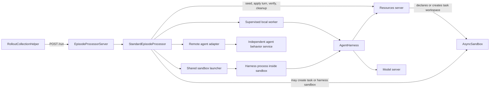
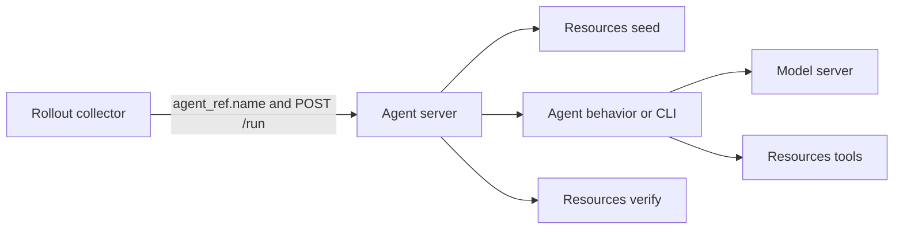
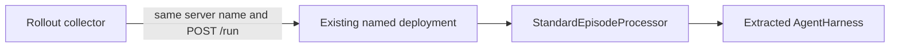
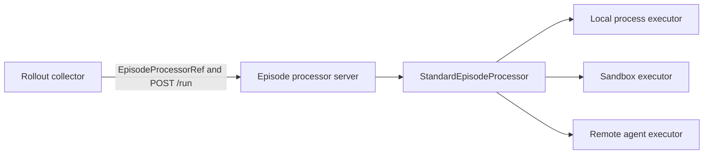
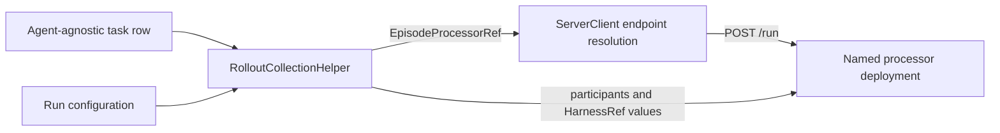
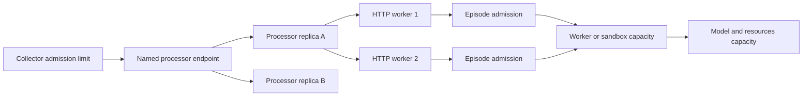
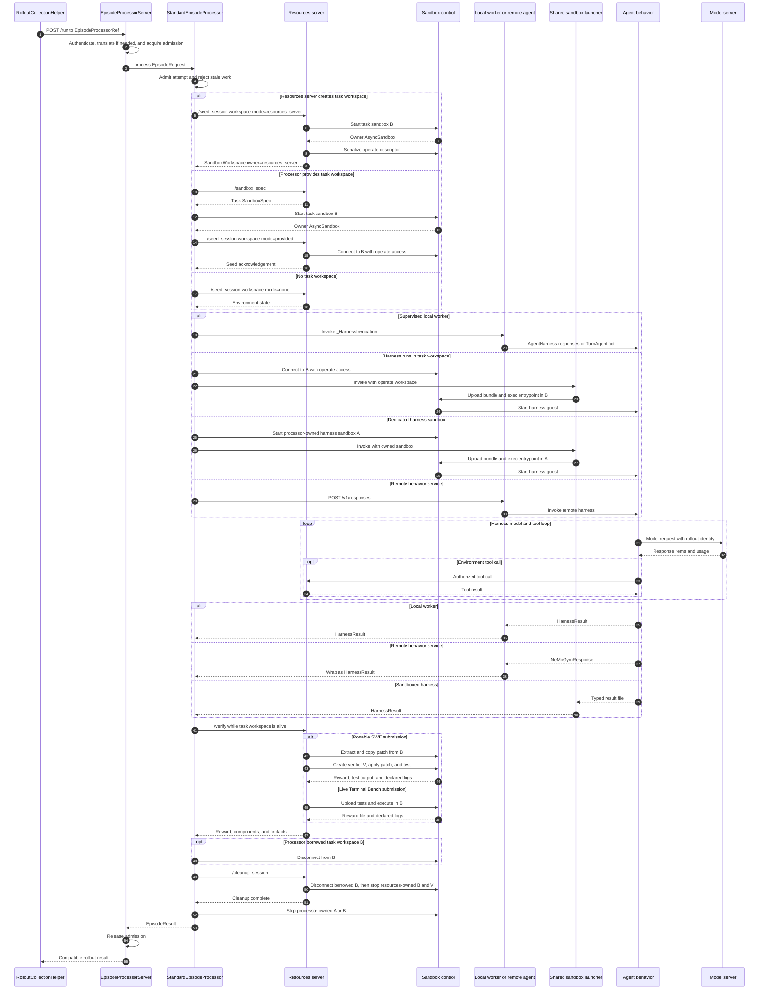

# Gym episode processing and sandbox execution architecture

Status: proposal, 2026-09-10.

## What this architecture defines

Today, rollout collection sends `POST /run` to an agent server. The agent server commonly initializes benchmark state, runs the agent loop, asks the resources server to verify the result, and cleans up. This works for simple single-agent evaluations, but it leaves three responsibilities unclear:

- who coordinates an episode when several participants take turns;
- where a command-line harness runs when the benchmark owns a task sandbox;
- who may operate or destroy each sandbox during execution, verification, retry, and cleanup.

This proposal defines the complete path from rollout collection to a terminal result. It covers:

- how rollout collection selects an episode processor server;
- how processor servers are deployed, scaled, and configured for concurrency;
- what the processor coordinates inside one `POST /run`;
- what remains of the agent when harness behavior no longer requires its own HTTP server;
- how local workers, sandbox guests, and remote agents expose one harness behavior contract;
- who creates, operates, verifies, and destroys every sandbox;
- how current agent-server deployments migrate without an immediate routing or topology change.

The target architecture has one standard episode owner. The resources server defines the benchmark and owns verification. The agent harness defines model-facing behavior. The episode processor orders the lifecycle. Sandbox infrastructure supplies isolated execution and task state.

## The architecture separates five different concerns

These names describe different things:

- `EpisodeProcessorServer` is a deployable HTTP service. It receives `POST /run`, applies admission control, translates compatibility requests, and invokes an episode processor implementation.
- `EpisodeProcessor` is the Python behavior contract used inside that server.
- `StandardEpisodeProcessor` implements the normal seed, execute, verify, cleanup, and result lifecycle.
- `AgentHarness` is agent behavior. It does not own an HTTP listener, sandbox lifecycle, verification, or rollout publication.
- A harness execution adapter runs that behavior in a supervised local worker, a sandbox guest, or an independently deployed remote agent service.

Removing harness-specific agent servers does not create one global processor process. Gym can run several named processor deployments. Each deployment can have several replicas and HTTP workers. Each worker can admit several episodes. Harness execution and sandbox capacity are controlled independently.

## An episode is the interaction and a rollout is the exported sample

A task row describes work that can be attempted. The rollout collector combines the row with harness, model, processor, and sampling configuration to request a rollout. The rollout is the durable sample exported to evaluation or training.

An episode is the live interaction that produces the rollout. It begins when Gym admits the request and opens or restores task state. It includes harness execution, participant turns, model calls, tool calls, sandbox operations, and verification. It ends after Gym records cleanup and returns a terminal result. The evaluation or training caller owns durable acceptance of that result.

The initial contract is one episode per rollout. `rollout_id` identifies the interaction and its exported record. A retryable infrastructure failure keeps `rollout_id`, increments `attempt`, and restarts from the original input. A deliberate new sample receives a new `rollout_id`. Optional partial continuation is described separately.

## One episode in plain terms

The normal flow is:

1. `RolloutCollectionHelper` combines an agent-agnostic task with run configuration.
2. Run configuration selects a named processor deployment, resources server, participants, harnesses, models, and runtime placement.
3. The collector sends `POST /run` to the selected processor server.
4. The processor asks the resources server to initialize task state.
5. If the task needs a sandbox, the resources server creates it or the processor creates one from the benchmark's `SandboxSpec`.
6. The processor invokes each harness through a local worker, a sandbox guest, or a remote behavior adapter.
7. The harness calls the model and the resources server's task tools.
8. The processor asks the resources server to verify the outcome while required task state is still alive.
9. Borrowers disconnect, then each component destroys the sandboxes it created.
10. The processor returns one terminal result for evaluation or NeMo RL.

The rest of this document defines the data exchanged at each step and the ownership rules that make the sequence safe.

## Logical roles remain separate from deployment processes



The processor server is the standard `POST /run` endpoint. The processor implementation is an object inside each HTTP worker. The harness normally has no public endpoint. A remote agent remains supported when independent deployment, language isolation, or an existing service contract requires it.

The processor never calls another component's `POST /run`. That would create two lifecycle owners. A remote adapter calls a behavior endpoint such as `/v1/responses` and leaves seed, verification, and cleanup with the processor.

## Current, transitional, and target paths use different boundaries

Today the agent server is both the network destination and the episode owner:



The first migration changes code ownership without changing deployment topology:



The target makes processor routing explicit and treats HTTP agents as one optional execution form:



The transition therefore does not require one global processor, removal of process isolation, or immediate routing changes. It first turns existing named deployments into hosts for common processor behavior.

## Rollout collection routes to a processor deployment

Source datasets contain model-visible input and benchmark-owned task data. They do not contain an agent, model, runtime, or processor reference. Run configuration supplies those choices.

```yaml
rollout_collection:
  execution_name: opencode-swe
  episode_processor:
    type: episode_processors
    name: cli_pool
  resources_server:
    type: resources_servers
    name: swebench
  participants:
    - participant_id: policy
      role: policy
      harness:
        type: agent_harnesses
        name: opencode
      model_bindings:
        policy:
          type: responses_api_models
          name: policy_model
      interaction_protocol: full_loop
```

The collector resolves `episode_processor.name` through the existing `ServerClient` configuration and sends the materialized `EpisodeRequest` to that server's `/run`. It does not infer the destination from the harness name. A multi-participant episode still has one processor destination.



The current collector routes by `agent_ref.name`. During migration, `agent_name` or `agent_map` may continue to select the existing named endpoint, and the collector may stamp an internal `agent_ref` into a materialized request for compatibility. That field is not required in the source dataset. Target routing uses `EpisodeProcessorRef`.

## Processor deployment and episode concurrency are independent

One processor name identifies one logical service endpoint. It does not imply one OS process or one cluster-wide singleton.



Concurrency has six separate limits:

1. `num_samples_in_parallel` bounds active requests in one rollout-collection job.
2. Processor deployment replicas provide horizontal capacity and failure isolation behind one stable endpoint.
3. `num_workers` creates Uvicorn OS worker processes in each processor replica.
4. `max_concurrent_episodes` bounds active episodes in each worker unless configured against a shared admission service.
5. Local worker pools and sandbox providers bound harness execution.
6. Model and resources servers impose downstream limits.

A process-local semaphore produces an effective processor limit of `replicas * num_workers * max_concurrent_episodes`. Deployments that need one global limit must use shared admission control. Attempt fencing, checkpoint parking, and active-episode lookup must also use process-shared state when `num_workers` or replica count exceeds one. A deployment may set `num_workers: 1` until that shared state exists.

The local Gym launcher currently starts one process tree for each named server and supports `num_workers`. It does not provide a generic processor `replicas` field. Production replicas therefore sit behind the configured stable `base_url` or an external service. Adding Gym-managed replicas is deployment work, not part of the episode data contract.

```yaml
cli_pool:
  episode_processors:
    standard:
      entrypoint: app.py
      num_workers: 2
      max_concurrent_episodes: 32
      allowed_resources_servers:
        - type: resources_servers
          name: swebench
      harnesses:
        opencode:
          implementation: nemo_gym.agents.opencode:OpenCodeHarness
          runtime:
            type: sandbox
            placement: task_workspace
```

This configuration admits at most 64 active episodes in one replica when admission is process-local. The sandbox provider may impose a lower effective limit. Additional replicas use the same logical service name through deployment-level load balancing.

## Removing the agent HTTP wrapper does not add a model-serving hop

The current path and the target path each have one inbound control-plane HTTP request:

- current: collector to agent server `/run`;
- target: collector to episode processor server `/run`.

Running both services in series creates an unnecessary second hop: collector to processor, then processor to agent. It also creates two request queues, two timeout layers, and two concurrency controls for one episode. The target avoids that topology for migrated harnesses.

The meaningful new cost is sandbox placement. A fresh sandboxed invocation adds:

`sandbox allocation or reconnect + bundle transfer + guest-process startup`

This cost exists whether the guest exposes HTTP or writes a typed result file. Prebuilt images, digest-verified small bundles, and provider capacity determine the cold-start impact. Model requests still travel directly from the harness execution environment to the model server, so removing the agent HTTP wrapper does not add a model-serving hop.

Trusted local workers add process dispatch and serialization. They prevent blocking harness code, process-global state, dependency conflicts, or crashes from taking down a processor HTTP worker. A warm worker pool may amortize startup while retaining that boundary.

Performance qualification must hold routing and deployment settings constant while changing one boundary at a time:

1. extract harness behavior behind the existing endpoint;
2. move the common lifecycle into `StandardEpisodeProcessor`;
3. compare current in-server execution with a supervised local worker;
4. compare local-worker execution with a sandbox guest;
5. change collector routing only after the previous paths meet compatibility and throughput gates.

The measured outputs are startup latency, time to first model request, end-to-end episode latency, completed rollouts per minute, processor memory per active episode, downstream connection counts, sandbox occupancy, and failure rate.

## Existing agent refactors supply implementation pieces

[PR #3199](https://github.com/NVIDIA-NeMo/Gym/pull/3199) extracts common harness behavior into importable classes. That is the first required boundary. Its generic harness still relies on agent servers for server startup, model URL resolution, concurrency, sandbox orchestration, and verification. Those responsibilities move to the processor server and `StandardEpisodeProcessor`.

[PR #3205](https://github.com/NVIDIA-NeMo/Gym/pull/3205) removes harness-specific agent servers and routes several configurations through a generic harness server. That generic server is close to a single-participant processor compatibility deployment. It should become a host for `StandardEpisodeProcessor`, not a second service called by the processor.

[PR #1968](https://github.com/NVIDIA-NeMo/Gym/pull/1968) demonstrates processor-owned sandbox setup, harness preparation, launch, capture, verification, and cleanup inside an `external_harness` agent server. Its sandbox and endpoint-wiring mechanics remain useful. Its agent server should not remain a separate episode owner.

Moving every optional harness dependency into the core package is not required by this architecture. A harness may live behind an optional extra, worker image, sandbox image, or immutable guest bundle. The processor registry remains lazy so one harness's dependencies do not become startup requirements for every processor deployment.

## Contracts introduced by this proposal

The architecture introduces:

- `EpisodeProcessorRef`, the collector's reference to a named processor server.
- `HarnessRef`, a reference to one configured harness behavior profile.
- `EpisodeProcessorServerConfig`, the processor server's HTTP-worker and episode-admission configuration.
- `LegacyRunTranslationConfig`, the deployment-owned mapping from a current agent request to target episode fields.
- `HarnessDeploymentConfig`, the implementation, behavior configuration, and runtime placement for one harness profile.
- `EpisodeProcessor`, the behavior interface that converts one episode request into one result.
- `StandardEpisodeProcessor`, the concrete seed, execute, verify, cleanup, and publication implementation.
- `AgentHarness`, the full-loop agent behavior interface.
- `HarnessCall` and `HarnessExecutor`, the placement-neutral execution request and internal placement strategy.
- `TurnAgent`, the optional turn-level interface required when Gym schedules visible participants such as a policy and simulated user.
- `WorkspaceRequest` and `SandboxWorkspace`, which make task-sandbox creation, access, and ownership explicit on `/seed_session`.
- `AgentRuntimeConfig`, which declares where a harness runs and what facilities it needs.

## Types reused from Gym

The proposal builds on these existing Gym types:

- `ResourcesServerRef` identifies the resources server responsible for task state, tools, verification, and metric aggregation.
- `ModelServerRef` identifies a configured model server.
- `AgentServerRef` identifies an existing agent server during migration. It is not the target harness identity or processor route.
- Each resources server's `TaskData` schema validates its normalized task-owned row fields.
- `NeMoGymResponseCreateParamsNonStreaming` and `NeMoGymResponse` remain the harness request and response representations.
- `NeMoGymResponseInputItem` and `NeMoGymResponseOutputItem` remain the typed turn payload items.
- `BaseRunRequest`, `BaseSeedSessionRequest`, `BaseSeedSessionResponse`, `BaseVerifyRequest`, and `BaseVerifyResponse` remain compatibility surfaces.
- `SandboxSpec` describes an image, working directory, files, ports, environment, resources, timeout, and provider options.
- `SandboxResources` describes provider-neutral CPU, memory, disk, and GPU requests.
- `SandboxHandle` contains the provider-neutral sandbox identifier and opaque provider state.
- `AsyncSandbox` is the live asynchronous control object.
- `SandboxProvider` performs provider-specific operations.
- `ConnectableProvider` adds `serialize_handle()` and `connect()` for cross-process access.
- `ServerClient` is Gym's existing downstream server client.

Every other named type introduced by this proposal is defined below.

The optional sandbox-server path depends on three types proposed by [PR #2085](https://github.com/NVIDIA-NeMo/Gym/pull/2085): `SandboxServerRef` identifies the server, `RemoteSandboxProvider` implements the provider API over HTTP, and `SandboxRef` carries scoped access to one server-owned sandbox. Native connectable providers do not use these types.

## Complete definitions of deployment references and configuration

### `EpisodeProcessorRef`

```python
class EpisodeProcessorRef(BaseModel):
    type: Literal["episode_processors"]
    name: str = Field(min_length=1)
```

`EpisodeProcessorRef` identifies the HTTP service that receives an episode. It exists because processor routing and harness selection are different decisions. The reference appears in rollout-collection configuration, not benchmark task data.

### `HarnessRef`

```python
class HarnessRef(BaseModel):
    type: Literal["agent_harnesses"]
    name: str = Field(min_length=1)
```

`HarnessRef` selects behavior from the target processor deployment's configured harness registry. It does not contain a URL and does not imply an HTTP server. The processor rejects a request when its deployment does not allow the named harness.

### `HarnessDeploymentConfig`

```python
class HarnessDeploymentConfig(BaseModel):
    implementation: str | None = Field(default=None, min_length=1)
    config: dict[str, Any] = Field(default_factory=dict)
    runtime: AgentRuntimeConfig

    @model_validator(mode="after")
    def validate_implementation(self) -> "HarnessDeploymentConfig":
        if self.runtime.type != "remote" and self.implementation is None:
            raise ValueError("local and sandbox runtimes require a harness implementation")
        if self.runtime.type == "remote" and self.implementation is not None:
            raise ValueError("remote runtime selects behavior through remote_agent")
        return self
```

`HarnessDeploymentConfig` tells a processor worker how to construct and place one harness. For local and sandbox execution, `implementation` is a trusted import path registered by deployment configuration. Remote execution selects behavior through `AgentRuntimeConfig.remote_agent` and uses the processor's built-in remote executor, so it has no harness import path. `runtime` selects local-worker, task-workspace, dedicated-sandbox, or remote execution. The dataset and `EpisodeRequest` never carry import paths, secrets, or provider credentials.

`config` contains validated behavior settings and secret references, not secret values serialized to a worker. The trusted processor resolves those references, serializes only non-secret settings, and writes secret values to short-lived files named in `HarnessContext.credential_files`. Each harness declares the logical credential keys it consumes. A remote harness keeps its secrets in its own deployment.

### `LegacyRunTranslationConfig`

```python
class LegacyRunTranslationConfig(BaseModel):
    execution_name: str = Field(min_length=1)
    harness: HarnessRef
    resources_server: ResourcesServerRef
    model_bindings: dict[str, ModelServerRef] = Field(min_length=1)
```

`LegacyRunTranslationConfig` supplies fields absent from the current `BaseRunRequest`. The processor deployment selects a mapping by legacy agent name and uses `_default` when one deployment represents a single existing agent. This is deployment configuration, not task data.

### `EpisodeProcessorServerConfig` and `EpisodeProcessorServerTypeConfig`

```python
class EpisodeProcessorServerConfig(BaseRunServerTypeConfig):
    processor: str = "standard"
    max_concurrent_episodes: int = Field(default=64, ge=1)
    allowed_resources_servers: tuple[ResourcesServerRef, ...] = ()
    harnesses: dict[str, HarnessDeploymentConfig] = Field(min_length=1)
    legacy_routes: dict[str, LegacyRunTranslationConfig] = Field(default_factory=dict)


class EpisodeProcessorServerTypeConfig(BaseServerTypeConfig):
    SERVER_TYPE: ClassVar[Literal["episode_processors"]] = "episode_processors"
    episode_processors: dict[str, EpisodeProcessorServerConfig] = Field(
        min_length=1,
        max_length=1,
    )
```

`EpisodeProcessorServerConfig` extends Gym's existing run-server schema, which supplies `entrypoint`, `host`, `port`, and optional `num_workers`. `processor` resolves through a trusted Gym registry; arbitrary task data cannot provide an import path. `max_concurrent_episodes` controls active episode tasks in each worker unless deployment policy supplies shared admission. An empty `allowed_resources_servers` permits any configured resources server; a non-empty tuple restricts the pool. `legacy_routes` enables compatibility parsing and supplies every field that a current request does not contain.

`EpisodeProcessorServerTypeConfig` adds `episode_processors` to Gym's server-type union and startup discovery. It follows the same one-inner-server shape as model, resources, and agent-server configuration. Horizontal replica count belongs to the deployment system because all replicas present the same logical endpoint. Harness configuration is loaded once per worker rather than transferred on every episode.

`ServerRef`, `ServerTypeConfig`, and `ServerInstanceConfig` must include the processor variants so existing configuration normalization, default port assignment, startup, health checks, and `ServerClient` endpoint resolution apply without a second discovery system.

## Complete definitions of episode data

### `EpisodeParticipant`

```python
class EpisodeParticipant(BaseModel):
    participant_id: str = Field(min_length=1)
    role: str = Field(min_length=1)
    harness: HarnessRef
    model_bindings: dict[str, ModelServerRef] = Field(min_length=1)
    interaction_protocol: Literal["full_loop", "turn"]
```

`EpisodeParticipant` identifies one actor visible to Gym. `participant_id` distinguishes actors inside one episode. `role` describes behavior such as `policy` or `simulated_user`. `harness` selects behavior from the receiving processor deployment. `interaction_protocol` states whether the processor calls the actor once or schedules repeated turns. Internal subagents remain a harness implementation detail.

### `ScheduleSpec`

```python
class ScheduleSpec(BaseModel):
    kind: Literal["single", "environment_directed"]
    max_turns: int = Field(default=128, ge=1)
```

`ScheduleSpec` bounds execution and selects a scheduling behavior. `single` requires exactly one full-loop participant. `environment_directed` requires turn-capable participants and lets the resources server name the next participant.

### `ArtifactPayload` and `DurableArtifactRef`

```python
class ArtifactPayload(BaseModel):
    name: str = Field(min_length=1)
    media_type: str = Field(min_length=1)
    content_b64: str
    sha256: str = Field(pattern=r"^[0-9a-f]{64}$")


class DurableArtifactRef(BaseModel):
    name: str = Field(min_length=1)
    media_type: str = Field(min_length=1)
    uri: str = Field(min_length=1)
    sha256: str = Field(pattern=r"^[0-9a-f]{64}$")
    size_bytes: int = Field(ge=0)
```

`ArtifactPayload` carries a bounded artifact in the episode result. `DurableArtifactRef` names a larger content-addressed artifact that the environment persisted before verification returned. A sandbox-local path is not a durable artifact because cleanup may destroy the sandbox before the caller consumes the result.

### `ParticipantOutcome`

```python
class ParticipantOutcome(BaseModel):
    participant_id: str
    role: str
    harness: HarnessRef
    response: NeMoGymResponse | None = None
    capture_rollout_id: str
```

`ParticipantOutcome` records each visible actor and the harness that produced its output. Non-primary participants use separate capture identifiers so simulated-user or critic calls do not enter NeMo RL's primary token-capture manifest.

### `CleanupFailure` and `EpisodeFailure`

```python
class CleanupFailure(BaseModel):
    owner: Literal["resources_server", "episode_processor"]
    operation: str
    error_type: str
    message: str


class EpisodeFailure(BaseModel):
    kind: Literal[
        "invalid_request",
        "incompatible_runtime",
        "harness",
        "environment",
        "verification",
        "infrastructure",
        "cancelled",
    ]
    message: str
```

`CleanupFailure` preserves cleanup evidence without replacing a valid response or reward. `EpisodeFailure` gives the collector a stable failure classification. Transport distinguishes retryability: terminal failures appear in `EpisodeResult`; retryable attempt failures are carried by `RetryableEpisodeError`.

### `EpisodeRequest`

```python
class EpisodeRequest(BaseRunRequest):
    rollout_id: str = Field(min_length=1)
    execution_name: str = Field(min_length=1)
    attempt: int = Field(ge=0)
    resources_server: ResourcesServerRef
    task_data: dict[str, Any]
    instance_config: dict[str, Any] = Field(default_factory=dict)
    participants: tuple[EpisodeParticipant, ...] = Field(min_length=1)
    primary_participant_id: str
    schedule: ScheduleSpec
    deadline: datetime | None = None
```

`EpisodeRequest` is the complete input to one processor invocation. `execution_name` is the stable run-configuration label used for provenance and metric grouping; it is not a server route or harness lookup key. The inherited `responses_create_params` contains model-visible input. `task_data` contains the normalized task-owned row fields and is validated against the resolved resources server's `TaskData` adapter before dispatch. The processor otherwise treats it as opaque. `resources_server` identifies the benchmark server that owns task state, tools, and verification. Validation also requires unique participant identifiers, a declared primary participant, and a schedule compatible with every participant protocol.

### `EpisodeResult`

```python
class EpisodeResult(BaseModel):
    rollout_id: str
    execution_name: str
    attempt: int
    status: Literal["completed", "failed", "cancelled"]
    primary_harness: HarnessRef
    participant_outcomes: tuple[ParticipantOutcome, ...]
    response: NeMoGymResponse | None
    terminal_response_id: str | None = None
    reward: float | None
    reward_components: dict[str, float] | None
    instance_config: dict[str, Any]
    artifacts: tuple[ArtifactPayload | DurableArtifactRef, ...] = ()
    cleanup_failures: tuple[CleanupFailure, ...] = ()
    failure: EpisodeFailure | None = None
```

`EpisodeResult` is the terminal value returned to rollout collection. The calling evaluation or training framework decides when that result is durably accepted. `primary_harness` records behavior provenance without claiming that the harness is a server. While NeMo RL consumes the current shape, the compatibility serializer emits `agent_ref.name` from `execution_name`. `response`, `terminal_response_id`, reward fields, and `instance_config` remain unchanged. `EpisodeResult(status="failed")` is terminal; a retryable attempt raises `RetryableEpisodeError` instead of returning this result.

### `RetryableEpisodeError`

```python
class RetryableEpisodeError(RuntimeError):
    def __init__(self, failure: EpisodeFailure) -> None:
        self.failure = failure
        super().__init__(failure.message)
```

`RetryableEpisodeError` tells the processor host to preserve the current collector retry behavior without publishing a terminal failed rollout. The host constructs it after classifying an attempt failure as retryable.

## Complete definitions of harness behavior

### `HarnessContext`

```python
@dataclass(frozen=True)
class HarnessContext:
    rollout_id: str
    capture_rollout_id: str
    attempt: int
    participant_id: str
    role: str
    resources_server_url: str
    model_server_urls: Mapping[str, str]
    credential_files: Mapping[str, str]
    workdir: str | None
    deadline: datetime | None
```

`HarnessContext` contains the endpoint bindings and rollout metadata needed by harness behavior. `rollout_id` identifies the episode. `capture_rollout_id` identifies the model-call receipt stream for this participant. The primary participant uses the episode rollout identifier; every non-primary participant receives a distinct capture identifier. The processor resolves server references into URLs reachable from the selected execution environment. Secrets remain in short-lived credential files rather than this object. The context is not model input and never contains an owner sandbox descriptor, provider control-plane credentials, verifier metadata, or another participant's private input.

`HarnessContext` has the same serializable shape in a local worker and sandbox guest. When a harness process runs inside a task sandbox, `workdir` is a local path such as `/testbed`. The host-side invocation code owns the connected `AsyncSandbox`; the guest harness does not. The execution adapter enforces deadline and cancellation by controlling the worker process.

### `HarnessResult`

```python
class HarnessResult(BaseModel):
    response: NeMoGymResponse
```

`HarnessResult` wraps the current response shape so harness-specific metadata can be added later without changing the behavior method. Partial-rollout continuation is an optional capability described separately and is not part of this base result.

### `AgentHarness`

```python
class AgentHarness(Protocol):
    async def responses(
        self,
        params: NeMoGymResponseCreateParamsNonStreaming,
        context: HarnessContext,
    ) -> HarnessResult:
        ...
```

`AgentHarness` is the full-loop behavior contract. One call may contain several model and tool exchanges. It does not seed, verify, select a provider, install itself, or clean up a sandbox.

The method uses Responses API request and response types because they are Gym's model-facing trajectory representation. A Python method named `responses()` does not imply an HTTP listener. Transport is added only by an execution adapter.

## Harness execution has three forms

The processor uses one internal invocation shape and selects an executor from `AgentRuntimeConfig`.

```python
class HarnessCall(BaseModel):
    protocol: Literal["full_loop", "turn"]
    response_params: NeMoGymResponseCreateParamsNonStreaming | None = None
    turn: TurnInput | None = None
    context: HarnessContext


class HarnessExecutor(Protocol):
    async def invoke(
        self,
        deployment: HarnessDeploymentConfig,
        call: HarnessCall,
    ) -> HarnessResult | TurnResult:
        ...
```

`HarnessCall` is the placement-neutral input to harness execution. Validation requires `response_params` only for `full_loop` and `turn` only for `turn`. It contains no worker path, sandbox descriptor, or provider handle.

`HarnessExecutor` is an internal processor strategy, not a benchmark plugin. It is justified by three execution boundaries that require different cancellation and cleanup mechanics:

- `LocalProcessHarnessExecutor` starts or borrows a supervised worker process. Trusted Python behavior does not run on the processor's HTTP event loop.
- `SandboxHarnessExecutor` uses the shared launcher to start the guest inside an owned or borrowed sandbox.
- `RemoteAgentHarnessExecutor` calls an independently deployed behavior endpoint. It never delegates episode seed, verification, or cleanup.

Direct in-interpreter invocation remains a test optimization. It is not the production default because existing agents may mutate environment variables, install signal handlers, load conflicting optional dependencies, block the event loop, or crash the process.

For an existing full-loop agent server, the remote executor projects `HarnessCall.response_params` onto `/v1/responses`, forwards rollout-scoped headers and resource-session cookies, and wraps `NeMoGymResponse` in `HarnessResult`. Existing agent servers do not provide the `TurnAgent` contract. Remote turn execution remains unsupported until a typed turn behavior transport exists.

Cancelling the processor's HTTP request does not guarantee that an existing remote service stops. A remote deployment is certified for retry only when it accepts the deadline and attempt identity, fences stale attempts, and provides cooperative cancellation. An interruption with an uncertified remote agent is terminal and non-retryable when the processor cannot determine whether side effects continue. The unresolved call is recorded as a cleanup failure.

### Pure harness and HTTP agent trade-offs

Keeping every harness as an HTTP server provides independent deployment, language neutrality, process isolation, and an established observability boundary. It also adds a second service contract when the episode processor already owns `/run`. If the processor calls an agent server that also seeds and verifies, the system has two episode owners. If the processor calls only `/v1/responses`, the agent server becomes an execution transport around behavior.

The target removes mandatory harness-specific HTTP services:

- The collector makes one control-plane HTTP call to the processor.
- The processor runs trusted behavior in a supervised local worker or isolated sandbox guest.
- Model and resources requests go directly from that execution environment to their servers.
- A remote HTTP agent remains supported when it must scale independently or cannot be packaged as a worker or guest.

The server-removal refactor does not itself reduce deployment count. Existing named agent deployments can become processor-server deployments with the same endpoints, Uvicorn workers, resource allocations, and admission limits.

### `TurnInput`

```python
class TurnInput(BaseModel):
    participant_id: str
    role: str
    turn_index: int = Field(ge=0)
    input_items: tuple[NeMoGymResponseInputItem, ...]
```

`TurnInput` is the environment-produced, serializable information visible to one participant for one activation. The processor may record and replay it. `HarnessContext` separately supplies trusted capabilities that must not become model-visible input.

### `TurnResult`

```python
class TurnResult(BaseModel):
    output_items: tuple[NeMoGymResponseOutputItem, ...]
    participant_done: bool = False
```

`TurnResult` contains one participant's action and state. `participant_done` does not end the episode; only the resources server determines that environment-owned interaction is complete.

### `TurnAgent`

```python
class TurnAgent(Protocol):
    async def act(
        self,
        turn: TurnInput,
        context: HarnessContext,
    ) -> TurnResult:
        ...
```

`TurnAgent` is separate from `AgentHarness` because externally scheduled multi-agent execution requires the processor to regain control between participants. Full-loop and turn-level agents both receive `HarnessContext`.

### `_HarnessInvocation`

```python
class _HarnessInvocation(BaseModel):
    protocol: Literal["full_loop", "turn"]
    rollout_id: str
    capture_rollout_id: str
    attempt: int
    participant_id: str
    role: str
    harness_import: str | None = None
    harness_config: dict[str, Any] = Field(default_factory=dict)
    response_params: NeMoGymResponseCreateParamsNonStreaming | None = None
    turn: TurnInput | None = None
    resources_server_url: str
    model_server_urls: dict[str, str]
    workdir: str | None = None
    deadline: datetime | None = None
    result_path: str
    credential_files: dict[str, str] = Field(default_factory=dict)
```

`_HarnessInvocation` is the private serialized boundary for supervised local workers and sandbox guests. It is not part of the episode API. `harness_import` identifies an importable Gym-native agent class when the generic Python worker is used. `harness_config` is validated and redacted. Runtime placement is removed before guest construction so invocation cannot recurse. A custom non-Python entrypoint may implement the same request and result-file protocol without `harness_import`. `full_loop` requires `response_params` and forbids `turn`; `turn` requires `turn` and forbids `response_params`. `credential_files` maps logical bindings to files readable only by the worker user. Credentials, tokens, and cookies are never embedded in the request, result, events, or artifacts.

The guest writes `HarnessResult` or `TurnResult` atomically to `result_path`.

### `ApplyTurnRequest` and `EnvironmentTurnState`

```python
class ApplyTurnRequest(BaseModel):
    participant_id: str
    turn_index: int
    output_items: tuple[NeMoGymResponseOutputItem, ...]


class EnvironmentTurnState(BaseModel):
    episode_done: bool
    next_turn: TurnInput | None = None
```

`ApplyTurnRequest` gives the resources server the selected participant's action. `EnvironmentTurnState` applies that action to task state and either ends the episode or returns the next participant-visible input. Validation requires `next_turn` exactly when `episode_done` is false.

## The processor server hosts an episode processor implementation

```python
class EpisodeProcessor(Protocol):
    async def process(self, request: EpisodeRequest) -> EpisodeResult:
        ...
```

`EpisodeProcessor` has no inherited implementation. It is a structural behavior contract rather than a base class. The protocol exists so a trusted Gym implementation can replace the standard lifecycle without inheriting concrete methods.

`StandardEpisodeProcessor` implements the normal lifecycle:

```python
class StandardEpisodeProcessor:
    async def process(self, request: EpisodeRequest) -> EpisodeResult:
        ...
```

Its dependencies are constructed once in each processor worker from merged Gym configuration. They do not travel in an episode request. Its implementation owns request validation, attempt fencing, workspace resolution, harness invocation, turn progression, verification ordering, artifact validation, cancellation-safe cleanup, and result construction. The processor cooperates with optional host-level checkpoint parking at safe boundaries, but it does not coordinate distributed checkpoint publication.

Custom processors are trusted Gym implementations, not arbitrary plugins. They must pass the same conformance tests. A protocol cannot prevent a malicious implementation from issuing effects before fencing or omitting cleanup.

`EpisodeProcessorServer` provides the deployment boundary around this object:

```python
class EpisodeProcessorServer(SimpleServer):
    config: EpisodeProcessorServerConfig
    processor: EpisodeProcessor
    admission: Semaphore

    async def run(self, body: dict[str, Any]) -> EpisodeResult:
        episode_request = self.translate_or_validate(body)
        async with self.admission:
            return await self.processor.process(episode_request)
```

1. accept `POST /run`;
2. authenticate and parse the raw body;
3. translate a legacy request or validate a target request;
4. acquire episode admission;
5. call `EpisodeProcessor.process()`;
6. serialize `EpisodeResult` or a retryable transport failure;
7. release admission.

The untyped HTTP body is confined to the compatibility boundary. `translate_or_validate()` validates a target `EpisodeRequest` directly. When `legacy_routes` is configured, it can instead parse `BaseRunRequest` and use the selected `LegacyRunTranslationConfig` to construct the missing fields. The class sketch shows ownership, not complete error handling. The HTTP worker retains request cancellation and tracing while `process()` runs. It does not execute CLI code on the event loop. Health endpoints report server readiness, harness-registration readiness, and downstream configuration validity without allocating a task sandbox.

Retryable failure is serialized at the server boundary. `RetryableEpisodeError` is internal control flow; the server maps it to a stable retryable HTTP response carrying `EpisodeFailure`. A caller never depends on reconstructing a Python exception across HTTP.

## Sandbox is first-class at declaration, handoff, and lifecycle

The sandbox does not become an object owned by `AgentHarness`. It appears in:

1. resources-server configuration, which declares the task sandbox;
2. agent runtime configuration, which declares harness placement and requirements;
3. `/seed_session`, which transfers task-workspace access;
4. processor state, which records owner-directed cleanup;
5. sandbox events, which record provider, sandbox identity, access mode, and outcome without recording secrets.

### `WorkspaceRequest`

```python
class WorkspaceRequest(BaseModel):
    mode: Literal["none", "resources_server", "provided"]
    workspace: SandboxWorkspace | None = None

    @model_validator(mode="after")
    def validate_workspace(self) -> "WorkspaceRequest":
        if self.mode == "provided" and self.workspace is None:
            raise ValueError("provided mode requires workspace")
        if self.mode != "provided" and self.workspace is not None:
            raise ValueError("workspace is valid only in provided mode")
        return self
```

`WorkspaceRequest` makes creation authority explicit:

- `none`: no task sandbox is required.
- `resources_server`: seed creates and owns the task sandbox.
- `provided`: the processor created and owns the task sandbox; seed borrows it.

The field is optional on the legacy seed schema. Absence preserves current behavior. Processor-driven requests always set it.

### `SandboxWorkspace`

```python
class SandboxCapabilities(BaseModel):
    image: str | None = None
    image_digest: str | None = None
    subprocess: bool
    pty: bool
    file_transfer: bool
    user_execution: bool
    declared_endpoints: tuple[int, ...] = ()
    resources: SandboxResources


class SandboxWorkspace(BaseModel):
    provider: str = Field(min_length=1)
    descriptor: dict[str, Any] = Field(min_length=1, repr=False)
    workdir: str | None = None
    owner: Literal["resources_server", "episode_processor"]
    access: Literal["operate"] = "operate"
    capabilities: SandboxCapabilities
```

`SandboxCapabilities` records the effective, immutable runtime facts that preflight can compare with `HarnessRequirements`. The owner derives them after creation from provider capability protocols, normalized spec, and readiness probes; it must not merely echo requested values. An unproven capability is false. `image_digest` is present when the provider can resolve one. Declared endpoints are the only ports that trusted host code may expose to the guest.

`SandboxWorkspace` is the only sandbox handoff model. `provider` names a provider configuration already present in the merged Gym config. `descriptor` is produced by `AsyncSandbox.serialize(scope="operate")`. Native providers may ignore the requested scope, so `access="operate"` expresses Gym's intended authority and does not claim provider enforcement. The logical owner retains its owner handle. `workdir` lets a reconnected client start in the task directory.

`SandboxWorkspace` never contains `AsyncSandbox`, `SandboxHandle.raw`, provider control-plane credentials, or an owner lease. Its descriptor is still a sensitive operate capability. Internal APIs must authenticate callers, encrypt transport, redact the descriptor from logs and traces, and avoid storing it in rollout artifacts. When PR #2085 is used, `descriptor` is the serialized signed `SandboxRef`. When a native provider is used, it is that provider's descriptor.

### `TaskSandboxSpecRequest`

```python
class TaskSandboxSpecRequest(BaseModel):
    rollout_id: str
    attempt: int = Field(ge=0)
    task_data: dict[str, Any]
```

`TaskSandboxSpecRequest` gives a resources server the task identity and validated `TaskData` needed to choose an image. `POST /sandbox_spec` returns the existing `SandboxSpec` directly. The processor compares harness requirements with owner-attested `SandboxCapabilities` after creation and readiness checks.

`POST /sandbox_spec` is an authenticated processor-to-resources-server route. It must apply the same task-data authorization and verifier-metadata handling as seed. Harnesses and guest processes cannot call it.

### Seed API changes

`BaseSeedSessionRequest` gains:

```python
workspace: WorkspaceRequest | None = None
```

`BaseSeedSessionResponse` gains:

```python
workspace: SandboxWorkspace | None = None
initial_turn: TurnInput | None = None
```

In `resources_server` mode, the response must include an operate workspace owned by the resources server. In `provided` mode, the resources server acknowledges the provided workspace and does not assume cleanup authority. In `none` mode, returning a workspace is an error.

`initial_turn` is present only for an environment-directed episode. This avoids a separate observation endpoint.

### `HarnessRequirements`

```python
class HarnessRequirements(BaseModel):
    untrusted_code: bool = False
    subprocess: bool = False
    pty: bool = False
    writable_workspace: bool = False
    network_bindings: tuple[str, ...] = ()
    resources: SandboxResources | None = None
```

`HarnessRequirements` describes facilities required by harness behavior. It does not choose a provider. Preflight compares these requirements with the environment workspace, a separate harness `SandboxSpec`, and deployment policy.

### `AgentRuntimeConfig`

```python
class AgentRuntimeConfig(BaseModel):
    type: Literal["local_process", "sandbox", "remote"]
    placement: Literal["task_workspace", "dedicated"] | None = None
    provider: str | None = None
    spec: SandboxSpec | None = None
    remote_agent: AgentServerRef | None = None
    remote_resources_server: ResourcesServerRef | None = None
    remote_model_bindings: dict[str, ModelServerRef] = Field(default_factory=dict)
    local_pool_size: int | None = Field(default=None, ge=1)
    local_reuse_workers: bool = False
    local_max_calls_per_worker: int | None = Field(default=None, ge=1)
    requirements: HarnessRequirements = Field(default_factory=HarnessRequirements)
    guest_bundle_uri: str | None = None
    guest_bundle_sha256: str | None = Field(default=None, pattern=r"^[0-9a-f]{64}$")
    entrypoint: tuple[str, ...] = ()
    setup_command: str | None = None
    env: dict[str, str] = Field(default_factory=dict)
    guest_user: str | None = None
    timeout_s: float = Field(default=10800, gt=0)
    max_result_bytes: int = Field(default=16 * 1024 * 1024, ge=1)

    @model_validator(mode="after")
    def validate_runtime(self) -> "AgentRuntimeConfig":
        if self.type == "local_process" and any(
            (
                self.placement,
                self.provider,
                self.spec,
                self.remote_agent,
                self.remote_resources_server,
                self.remote_model_bindings,
                self.guest_bundle_uri,
                self.guest_bundle_sha256,
                self.entrypoint,
                self.setup_command,
                self.env,
                self.guest_user,
            )
        ):
            raise ValueError("local process runtime cannot configure sandbox or remote execution")
        if self.type == "local_process" and self.local_pool_size is None:
            raise ValueError("local process runtime requires a worker pool size")
        if self.type == "local_process" and self.local_reuse_workers and self.local_max_calls_per_worker is None:
            raise ValueError("reused local workers require a maximum call count")
        if self.type == "local_process" and not self.local_reuse_workers and self.local_max_calls_per_worker is not None:
            raise ValueError("fresh local workers cannot configure a maximum call count")
        if self.type != "local_process" and any(
            (self.local_pool_size, self.local_reuse_workers, self.local_max_calls_per_worker)
        ):
            raise ValueError("local worker settings require local process runtime")
        if self.type == "sandbox" and self.placement is None:
            raise ValueError("sandbox runtime requires placement")
        if self.type == "sandbox" and self.remote_agent is not None:
            raise ValueError("sandbox runtime cannot configure a remote agent")
        if self.type == "sandbox" and self.remote_resources_server is not None:
            raise ValueError("sandbox runtime cannot configure a remote resources server")
        if self.type == "sandbox" and self.remote_model_bindings:
            raise ValueError("sandbox runtime cannot configure remote model bindings")
        if self.placement == "task_workspace" and (self.provider or self.spec):
            raise ValueError("task workspace placement receives provider and spec from seed")
        if self.placement == "dedicated" and (not self.provider or self.spec is None):
            raise ValueError("dedicated placement requires provider and spec")
        if bool(self.guest_bundle_uri) != bool(self.guest_bundle_sha256):
            raise ValueError("guest bundle URI and digest must be set together")
        if self.type == "sandbox" and not self.entrypoint:
            raise ValueError("sandbox runtime requires an entrypoint")
        if self.type == "sandbox" and not self.guest_user:
            raise ValueError("sandbox runtime requires a non-root guest user")
        if self.guest_user == "root":
            raise ValueError("sandbox harnesses cannot run as root")
        if self.type == "remote" and self.remote_agent is None:
            raise ValueError("remote runtime requires an agent server reference")
        if self.type == "remote" and self.remote_resources_server is None:
            raise ValueError("remote runtime requires a pinned resources server")
        if self.type == "remote" and not self.remote_model_bindings:
            raise ValueError("remote runtime requires pinned model bindings")
        if self.type == "remote" and any(
            (
                self.placement,
                self.provider,
                self.spec,
                self.guest_bundle_uri,
                self.guest_bundle_sha256,
                self.entrypoint,
                self.setup_command,
                self.env,
                self.guest_user,
            )
        ):
            raise ValueError("remote runtime cannot configure sandbox execution")
        return self
```

`AgentRuntimeConfig` is how execution placement appears in a harness deployment:

- `local_process` runs the Python harness in a supervised worker outside the processor interpreter.
- `sandbox` with `placement: task_workspace` runs the harness inside the task workspace returned by seed.
- `sandbox` with `placement: dedicated` creates a processor-owned harness sandbox from `provider` and `spec`.
- `remote` calls an independently deployed agent's behavior endpoint through `RemoteAgentHarnessExecutor`.

`placement` answers where the harness runs. It does not encode task-workspace ownership: `/seed_session` records whether the resources server or processor created that workspace. A dedicated harness sandbox is always processor-owned.

`local_pool_size` is the number of local execution slots owned by each processor HTTP worker. One slot executes one harness call at a time. A call waits behind that pool without consuming a sandbox slot. With `local_reuse_workers: false`, a slot starts a fresh process for each call. With reuse enabled, each slot retains one process and `local_max_calls_per_worker` periodically replaces it so process-global state and memory growth are discarded. A crashed process fails its current call and is replaced; it does not terminate the processor server. Total local harness capacity is `replicas * num_workers * local_pool_size`, bounded above by episode admission.

Existing remote agent servers select their model from deployment configuration. `remote_model_bindings` records that fixed mapping. Preflight requires the participant's requested bindings to match it exactly. A future remote transport may advertise per-request model selection, but existing `/v1/responses` agent servers cannot be assumed to support it.

Existing remote agent servers also select their resources server from deployment configuration. `remote_resources_server` records that binding. Preflight requires `EpisodeRequest.resources_server` to match it exactly. Forwarded cookies preserve the seeded session but do not redirect an existing agent server to another resources server.

The harness object itself does not receive this config or own lifecycle. The processor's execution adapter interprets it.

`guest_bundle_uri` and its digest identify a versioned harness payload. `entrypoint` is an argument vector executed inside the sandbox as `guest_user`. Credential files use mode `0600`, are owned by that user, and contain only rollout-scoped access to declared model and resources-server endpoints. `max_result_bytes` bounds the result file before parsing. `setup_command` is a transitional development mechanism. Production should use a prepared image or immutable bundle rather than installing from a checkout for every rollout.

## Owner and operator access have different behavior

One physical sandbox has one logical owner:

- The owner selects the provider and `SandboxSpec`, calls `start()`, retains the owner handle, records cleanup, and calls `stop()`.
- An operator receives `SandboxWorkspace`, connects to the same physical sandbox, performs permitted data-plane operations, and disconnects without destroying it.
- The harness process receives neither handle. It sees only its local working directory and authorized server endpoints.

The current `AsyncSandbox.connect()` API does not record whether the caller is an owner or operator. Directly connected providers may therefore allow an accidental `stop()` to destroy an environment-owned sandbox. `__aexit__` also calls `stop()`. The core API needs an explicit borrowed connection:

```python
borrowed = await AsyncSandbox.connect(
    workspace.descriptor,
    provider=provider,
    owns_lifecycle=False,
)

try:
    ...
finally:
    await borrowed.disconnect()
```

`disconnect()` releases an operate lease when the provider supports leases and otherwise closes only the local provider client. `stop()` raises when `owns_lifecycle` is false. `__aexit__` calls `stop()` for owners and `disconnect()` for borrowers.

Owner reconnection is a separate trusted cleanup operation. It requires a provider-specific owner descriptor retrieved from encrypted processor or resources-server state. Public workspace handoff never sets `owns_lifecycle=True`.

Owner `stop()` marks the facade stopped only after provider destruction succeeds. If destruction fails, the owner handle and cleanup record remain retryable. Provider destruction must be idempotent by sandbox identity.

The proposal extends the existing `ConnectableProvider` contract with one method:

```python
class ConnectableProvider(Protocol):
    async def serialize_handle(
        self,
        handle: SandboxHandle,
        *,
        scope: str | None = None,
    ) -> dict[str, Any]:
        ...

    async def connect(
        self,
        descriptor: Mapping[str, Any],
    ) -> SandboxHandle:
        ...

    async def disconnect(self, handle: SandboxHandle) -> None:
        ...
```

`disconnect()` must never end the physical sandbox lifecycle. A direct provider releases only client-side connection state. `RemoteSandboxProvider` revokes the operate lease. `AsyncSandbox.disconnect()` delegates to this method and then closes provider-scoped client resources.

PR #2085 currently overloads `RemoteSandboxProvider.close()` to decrement an operate-lease count. It should move borrower behavior to `disconnect()` so `SandboxProvider.close()` retains the single meaning of ending an owner-controlled lifecycle. Disconnect must revoke that specific token rather than only decrement a counter. Its lease endpoint must require owner authority before minting any lease; an operate lease must never delegate or escalate access.

## Native reconnect is the efficient path

The processor resolves the provider named by `SandboxWorkspace.provider` in its own trusted process.

```python
provider = create_provider(
    resolve_provider_config(workspace.provider, global_config)
)
if not isinstance(provider, ConnectableProvider):
    raise ValueError(
        "Cross-process workspace access requires a ConnectableProvider "
        "or a configured sandbox server"
    )
borrowed = await AsyncSandbox.connect(
    workspace.descriptor,
    provider=provider,
    owns_lifecycle=False,
)
```

OpenSandbox, E2B, or a manually supplied `ConnectableProvider` can reconnect directly. Both the resources server and processor instantiate provider clients against the same external sandbox. There is no sandbox-server process or extra HTTP hop.

A manually supplied provider must be installed and resolvable in both trusted Gym processes. The API transfers its named configuration reference and serialized descriptor, not the live provider object.

Native reconnect does not automatically enforce owner and operator permissions. A direct descriptor may be used only by trusted Gym components unless the provider itself issues scoped credentials. The harness running inside the sandbox never receives the descriptor.

## The sandbox server is a conditional adapter

Docker, Apptainer, Enroot, and other process-local providers cannot rebuild their live handle in another process. PR #2085 addresses this case:

1. A sandbox server owns the physical `AsyncSandbox`.
2. `RemoteSandboxProvider` presents the normal provider protocol to Gym components.
3. Creation returns an owner-scoped signed `SandboxRef`.
4. Serialization with `scope="operate"` mints a non-destructive co-lease.
5. Another process reconnects by constructing its own `RemoteSandboxProvider`.
6. Operator disconnect releases the lease; owner stop destroys the physical sandbox.

PR #2085 defines the transferred capability as:

```python
@dataclass(frozen=True)
class SandboxRef:
    server_url: str
    sandbox_id: str
    lease_token: str
    provider_name: str = ""
    scope: str = "operate"
    workdir: str | None = None
    extra: dict[str, Any] = field(default_factory=dict)
```

`SandboxRef` is the provider-specific descriptor stored inside `SandboxWorkspace.descriptor` when a sandbox server is used. Its signed token binds sandbox identity, a caller-asserted rollout label, and owner or operate scope. The label becomes authenticated rollout identity only when the server derives it from authenticated request context.

The sandbox server also provides admission control and time-to-live reaping. It is not required for a natively connectable provider. Configuration must select it explicitly; Gym must not proxy a direct provider merely because the server exists.

The server still needs production work before it becomes the ownership boundary:

- server-side authentication for creation and every control operation;
- owner authorization for all lease delegation;
- non-replayable revocation and enforcement of lease expiry;
- comparison of signed scope with all outer reference fields;
- configured destination allowlisting so a descriptor cannot redirect clients or API credentials;
- TLS and secret redaction for bearer capabilities;
- durable registry and signing state that works across restart and multiple workers;
- fencing between owner destruction and active borrowers;
- PTY, signal, streaming, and declared endpoint support required by CLI harnesses;
- stable name-to-URL resolution from `SandboxServerRef`;
- cancellation and bounded transfer behavior.

## Shared launcher code runs sandboxed harnesses

The processor selects placement but does not know how to install or invoke OpenCode, Claude Code, or another CLI. Shared launcher code in the processor host implements the host-to-sandbox mechanics:

1. receive an owner or borrowed `AsyncSandbox` selected by the processor;
2. confirm that its effective capabilities satisfy `HarnessRequirements`;
3. locate a harness already present in the image or upload a digest-verified immutable bundle;
4. create rollout-scoped credential files and `_HarnessInvocation`;
5. execute the configured entrypoint as the non-root guest user;
6. enforce timeout, cancellation, network, and result-size limits;
7. read and validate `HarnessResult` or `TurnResult`;
8. remove credentials and invocation scratch files;
9. return the typed result without deciding verification or sandbox cleanup.

This is concrete shared code, not a public agent interface. The sandbox-placement proof on `upstream/ffrujeri/sandboxes` places these responsibilities in `nemo_gym/sandbox/agent_runtime.py`. In the target implementation, that module keeps upload, execution, and result-loading behavior while seed, verify, and cleanup move to `StandardEpisodeProcessor`. `nemo_gym/sandbox/agent_runtime_worker.py` remains the generic Python guest worker. `nemo_gym/sandbox/agent_dependencies.py` remains an explicit development path for installing a checkout and is not used by production rollout configuration.

### Gym-native agents use the same behavior implementation

Local and sandbox placement do not require separate agent implementations:

- The processor resolves `HarnessRef` to `HarnessDeploymentConfig`.
- For local placement, a supervised worker receives `_HarnessInvocation` and calls `AgentHarness.responses()` or `TurnAgent.act()`.
- For sandbox placement, the launcher sends the same invocation shape with the harness import path and redacted configuration.
- The generic guest worker imports that class, constructs it with sandbox-reachable model and resources-server bindings, and calls the same behavior method.
- The guest configuration disables further sandbox placement so invocation cannot recurse.
- Agent-specific code continues to own prompting, CLI commands, tool loops, and conversion of CLI output into `NeMoGymResponse`.

Existing `SimpleResponsesAPIAgent` implementations do not yet implement the Python `AgentHarness` protocol directly. A transitional worker adapter can construct the configured agent, create its ASGI application, and invoke `/v1/responses` inside the worker process. The sandbox-placement proof already uses this technique in `agent_runtime_worker.py`; it does not start another HTTP listener inside the sandbox. New or migrated Gym-native agents implement `AgentHarness` directly and bypass the ASGI adapter.

An external non-Python harness can provide an entrypoint that reads `_HarnessInvocation` and writes the same typed result. The launcher remains unchanged.

Production images should include stable CLI dependencies whenever practical. A digest-verified bundle covers harness code that must vary independently of the image. `setup_command` exists for development and qualification, not as an implicit per-rollout installation strategy.

## Harness placement has four concrete forms

### Supervised local worker

`AgentRuntimeConfig.type` is `local_process`. The processor sends the invocation to a supervised worker process. This is allowed only when model-influenced behavior cannot execute untrusted code or access sensitive host resources. Risky shell, file, browser, or code operations remain sandbox-backed environment tools.

### Harness inside the environment workspace

`type` is `sandbox` and `placement` is `task_workspace`. The processor obtains the workspace, then passes it to the shared launcher:

1. requests `WorkspaceRequest(mode="resources_server")`;
2. receives an operate-only `SandboxWorkspace`;
3. connects directly or through `RemoteSandboxProvider`;
4. passes the borrowed `AsyncSandbox`, agent configuration, and invocation input to the launcher;
5. receives a typed result;
6. disconnects without stopping the workspace.

The launcher exposes only declared network bindings and runs the guest as the configured non-root user. It rejects oversized results before parsing.

This is the preferred placement for command-line coding agents when the task sandbox satisfies their requirements. A separate harness sandbox is not created merely to preserve an architectural distinction.

### Separate harness sandbox

`type` is `sandbox` and `placement` is `dedicated`. The processor creates sandbox A from the agent's provider and spec and passes it to the shared launcher. The resources server creates or accepts task sandbox B when the benchmark needs one. The harness in A reaches B through resources-server tools or declared endpoints.

This form is used only when B cannot host the harness because of incompatible images, dependencies, trust policy, resource requirements, or lifecycle. The processor owns and stops A. The recorded owner stops B.

### Independently deployed remote agent

`type` is `remote`. For an existing full-loop agent, `RemoteAgentHarnessExecutor` sends the Responses API body to `/v1/responses` and wraps the returned `NeMoGymResponse` in `HarnessResult`. Existing remote agents cannot be selected for `interaction_protocol: turn`. The endpoint does not seed task state, call `/verify`, destroy a task sandbox, or publish the rollout.

Remote execution is appropriate when the agent must scale independently, runs outside Python, or already exists as a managed service. Direct access to a task workspace is unavailable unless the remote agent runs inside that workspace or receives an explicitly authorized tool endpoint. The processor remains the only caller of episode-level `/run`.

## Verification extracts only what the benchmark defines

The processor does not implement a generic sandbox harvester. It keeps required task state alive and calls `/verify`. The resources server knows which paths, commands, and state constitute a submission, so it performs extraction through `AsyncSandbox.exec()` and `download()`.

Verification must copy every required output out of the sandbox before its owner destroys it. A small output may be returned as `ArtifactPayload`; a larger output must be persisted and returned as `DurableArtifactRef`. A sandbox path or descriptor is not an artifact.

SWE-bench and Terminal Bench use different verification patterns.

### SWE-bench extracts a portable patch

SWE tasks provide a repository image and working directory. Task sandbox B contains the repository modified by the coding harness. The patch is the portable submission:

1. Seed creates B and prepares `/testbed`.
2. The processor runs the coding harness inside B.
3. `/verify` executes benchmark-owned patch extraction in B.
4. The resources server validates the command result, bounds the patch, computes its digest, and copies it out of B.
5. The resources server creates fresh verifier sandbox V.
6. It applies the extracted patch to V and runs the SWE-bench tests.
7. It copies reward, test output, and any declared logs out of V.
8. It returns the reward and patch artifact.
9. It stops V in `finally`.
10. The owner of B stops B after extraction and verification complete.

Current SWE-bench code already creates B during seed, executes `git --no-pager diff` in B, and runs `run_instance()` against fresh V. The target implementation must also:

- reject a failed patch-extraction command instead of silently verifying an empty patch;
- include supported untracked and binary changes in the canonical submission;
- enforce patch and log size limits;
- copy the validated patch out before B is destroyed;
- stop both sandboxes on every success, failure, timeout, and cancellation path.

When the resources server created B, it retains the owner handle and stops B. When the processor created B from `/sandbox_spec`, the resources server verifies through operate access and disconnects; the processor stops B after `/verify` returns.

### Terminal Bench verifies the same live machine

Terminal Bench tasks can change packages, services, processes, permissions, and machine state that a patch cannot represent. The modified machine is the submission:

1. Seed creates task sandbox B from the task image.
2. The processor runs the CLI harness inside B or gives a host-side harness sandbox-backed tools that operate B.
3. The resources server keeps B alive after the harness returns.
4. `/verify` uploads benchmark tests into `/tests` in B.
5. It executes `/tests/test.sh` in B.
6. It downloads `/logs/verifier/reward.txt` and any declared bounded logs.
7. It returns reward and verifier output.
8. The owner stops B after those outputs have been copied out.

Terminal Bench does not extract a portable submission before verification. Creating fresh verifier sandbox V would discard the state being graded. The task sandbox therefore remains alive through test execution and reward extraction.

When the resources server owns B, it runs verification with its owner handle and stops B. When the processor owns B, the resources server uses operate access, disconnects after verification, and leaves destruction to the processor.

## Physical execution patterns make ownership visible

```mermaid
flowchart TB
    subgraph NativePattern [Trusted native harness]
        NativeProcessor["Processor"] --> NativeWorker["Local worker process"]
        NativeProcessor --> NativeResources["Resources server without task sandbox"]
    end

    subgraph DedicatedPattern [Dedicated harness sandbox]
        DedicatedProcessor["Processor owns sandbox A"] --> DedicatedGuest["Harness guest in A"]
        DedicatedProcessor --> DedicatedResources["Resources server without task sandbox"]
    end

    subgraph SharedPattern [Shared task workspace]
        SharedResources["Resources server owns sandbox B"] --> SharedProcessor["Processor borrows B"]
        SharedProcessor --> SharedGuest["Harness guest in B"]
        SharedResources --> SharedVerify["Verification in live B or fresh V"]
    end

    subgraph SeparatePattern [Separate harness and task sandboxes]
        SeparateProcessor["Processor owns harness A"] --> SeparateGuest["Harness guest in A"]
        SeparateResources["Resources server owns task B"] --> SeparateTools["Authorized tools expose B"]
        SeparateGuest --> SeparateTools
        SeparateResources --> SeparateVerifier["Optional fresh verifier V"]
    end

    subgraph RemotePattern [Remote agent compatibility]
        RemoteProcessor["Processor"] --> RemoteAgent["Independent behavior service"]
        RemoteProcessor --> RemoteResources["Resources server"]
    end
```



The creator of A, B, or V owns its destruction. A trusted borrower receives only operate access and disconnects. A guest harness receives no provider handle or owner descriptor.

## The complete episode sequence includes server and execution boundaries



`S` represents either a direct native provider or PR #2085's sandbox server. The episode sequence does not change between those implementations. Cleanup is ordered rather than parallel: all users release borrowed access before the logical owner destroys a sandbox.

For an environment-directed schedule, seed also returns `initial_turn`. The processor calls the selected `TurnAgent`, sends `ApplyTurnRequest` to the resources server, receives `EnvironmentTurnState`, and repeats until `episode_done` is true.

## Compatibility translation is explicit

Source datasets may omit `agent_ref` today by supplying `agent_name` in rollout-collection configuration. The current collector stamps that selection into its materialized request. This is the first migration step because it makes stored task data agent-agnostic without changing HTTP routing.

An existing named agent deployment can then become an `EpisodeProcessorServer` compatibility deployment without changing its host, port, `/run` route, `num_workers`, or collector routing. Its request translator:

1. resolves the configured harness profile from legacy `agent_ref`, `agent_name`, or `task_source`;
2. resolves the existing `ResourcesServerRef` and model binding from deployment configuration;
3. uses `LegacyRunTranslationConfig.execution_name` as the authoritative execution label;
4. uses `_ng_rollout_id` or derives it from task and rollout indices;
5. uses `_ng_attempt_index` or zero;
6. normalizes the row's benchmark-owned fields through the resources server's `TaskData` adapter;
7. creates one `EpisodeParticipant` with role `policy` and the resolved `HarnessRef`;
8. selects `ScheduleSpec(kind="single")`;
9. invokes `StandardEpisodeProcessor`.

```yaml
legacy_routes:
  _default:
    execution_name: claude_code_agent
    harness:
      type: agent_harnesses
      name: claude_code
    resources_server:
      type: resources_servers
      name: benchmark
    model_bindings:
      policy:
        type: responses_api_models
        name: policy_model
```

The processor must not call the old agent's `/run`, because that endpoint already seeds and verifies an episode. Before a harness is extracted, the collector continues routing that execution through the legacy agent-server path. After extraction, the existing deployment hosts the compatibility processor and invokes the harness behavior locally or in a sandbox.

The target collector constructs `EpisodeRequest` directly from agent-agnostic task data and run configuration, then routes through `EpisodeProcessorRef`. The response compatibility projection preserves `agent_ref`, `response`, `terminal_response_id`, scalar reward, reward components, and `instance_config`.

## Baseline reliability restarts unfinished episodes

The standard processor provides restart-safe behavior without claiming partial continuation:

- `rollout_id` identifies one logical rollout and `attempt` identifies one physical execution.
- Processor, model, and resources requests carry both values.
- The processor, model server, and resources server reject stale attempts before admitting new work. A remote agent participates in retry only when it implements the same fencing contract.
- Deadlines and cancellation propagate to local workers, sandbox guests, model calls, resources calls, and sandbox operations. Existing remote agents receive request cancellation on a best-effort basis unless they implement certified fencing and cooperative cancellation.
- Verification runs before task-state cleanup.
- Cleanup runs in `finally`, and owner destruction is idempotent by sandbox identity.
- A retryable infrastructure failure starts a newer attempt from the original input.

If the processor host fails before the caller accepts `EpisodeResult`, the caller may run the episode again as a newer attempt. Durable result acceptance remains the calling framework's responsibility.

## Partial-rollout continuation is an optional control plane

[Issue #3024](https://github.com/NVIDIA-NeMo/Gym/issues/3024) defines coordinated checkpointing for executions that can expose a valid continuation boundary. That control plane is separate from `EpisodeRequest`, `EpisodeResult`, `AgentHarness`, and `TurnAgent`.

Responsibility is divided as follows:

- The NeMo RL integration freezes dispatch and coordinates prepare, commit, restore, and resume across Gym and token storage.
- The processor host tracks active executions and asks each processor to park.
- `StandardEpisodeProcessor` finishes the current logical operation, stops issuing model and resources requests, and parks at a safe boundary.
- The model server fences new policy calls, drains admitted calls, and owns model-call lineage save and restore.
- The resources server fences new mutations and owns environment-specific session save and restore hooks.
- The external coordinator publishes a global checkpoint only after every required component reports compatible state.

A turn-capable episode has a processor-visible boundary after `/apply_turn` commits the environment transition. A full-loop harness has processor-visible boundaries before and after `AgentHarness.responses()`. Mid-loop continuation requires a whitebox harness capability defined by #3024 because the processor cannot observe internal model and tool boundaries. An opaque CLI process is restart-only until its runtime can freeze and restore the process, filesystem, environment state, and in-flight effects coherently.

A resources server may expose save and restore hooks even when a particular harness is restart-only. Capability negotiation determines whether the complete episode can continue or must restart from input. A sandbox descriptor used for cross-process access is not checkpoint state.

## NeMo RL observes the same training contract

Source task data does not contain `agent_ref`. Run configuration supplies `execution_name` and selects the primary harness. While NeMo RL consumes the existing shape, the collector derives `agent_ref.name` from `execution_name` before dispatch and the processor echoes it in the compatibility result. `_ng_rollout_id` remains the primary token-capture identity.

NeMo RL continues to receive:

- a synchronously derived compatibility `agent_ref`;
- `response.output`;
- `terminal_response_id`;
- scalar `reward`;
- optional `reward_components`;
- `instance_config.mask_sample`;
- completion accounting.

When reward components are present, scalar reward equals their sum.

In a multi-participant episode, only the primary participant uses `_ng_rollout_id`. Every non-primary participant receives a separate capture identifier recorded in `ParticipantOutcome`. This keeps simulated-user or critic calls out of the primary receipt manifest without requiring a NeMo RL manifest-format change.

Token-capture enablement is resolved before dispatch from the execution profile and primary model binding, not by looking up the processor endpoint as an agent. Target metric aggregation groups by `execution_name` for reporting and calls the selected `ResourcesServerRef` directly. During migration, an existing named processor compatibility deployment may continue exposing `/aggregate_metrics` as a proxy so current collectors remain unchanged.

## Configuration selects processor, harness, and sandbox ownership separately

### Trusted harness in a local worker pool

```yaml
native_pool:
  episode_processors:
    standard:
      entrypoint: app.py
      num_workers: 2
      max_concurrent_episodes: 64
      harnesses:
        simple_agent:
          implementation: nemo_gym.agents.simple:SimpleAgent
          runtime:
            type: local_process
            local_pool_size: 16
            local_reuse_workers: true
            local_max_calls_per_worker: 100
```

Each HTTP worker owns 16 harness worker processes and admits at most 64 episodes. Across one two-worker processor replica, at most 32 local harness calls execute at once; other admitted episodes may be waiting on the model, resources server, or local worker queue. A deployment should not reuse workers for harnesses that execute untrusted code or leak process-global state between calls.

### Direct native provider

The resources server selects a named natively connectable provider:

```yaml
task_opensandbox:
  opensandbox:
    connection:
      domain: ${oc.env:OPENSANDBOX_DOMAIN}

swebench:
  resources_servers:
    swebench:
      entrypoint: app.py
      sandbox_provider: task_opensandbox
      sandbox_config:
        ttl_s: 18000
        resources:
          cpu: 4
          memory_mib: 16384

cli_pool:
  episode_processors:
    standard:
      entrypoint: app.py
      num_workers: 2
      max_concurrent_episodes: 32
      allowed_resources_servers:
        - type: resources_servers
          name: swebench
      harnesses:
        opencode:
          implementation: nemo_gym.agents.opencode:OpenCodeHarness
          runtime:
            type: sandbox
            placement: task_workspace
            requirements:
              untrusted_code: true
              subprocess: true
              pty: true
              writable_workspace: true
              network_bindings: [policy_model]
            guest_bundle_uri: artifacts/opencode-1.17.11.tar.zst
            guest_bundle_sha256: "<sha256>"
            entrypoint: [bin/run-opencode]
            guest_user: nemo
            timeout_s: 10800

rollout_collection:
  execution_name: opencode-swe
  episode_processor:
    type: episode_processors
    name: cli_pool
  participants:
    - participant_id: policy
      role: policy
      harness:
        type: agent_harnesses
        name: opencode
      model_bindings:
        policy:
          type: responses_api_models
          name: policy_model
      interaction_protocol: full_loop
```

The resources server and processor each resolve `task_opensandbox` and connect through the provider SDK. No sandbox server is involved.

### Stateless environment with a dedicated CLI sandbox

A resources server with no task sandbox returns `workspace.mode: none`. A CLI agent can still require isolated execution:

```yaml
stateless_cli_pool:
  episode_processors:
    standard:
      entrypoint: app.py
      num_workers: 1
      max_concurrent_episodes: 64
      allowed_resources_servers:
        - type: resources_servers
          name: stateless_environment
      harnesses:
        cli_agent:
          implementation: example_agents.cli:CliHarness
          runtime:
            type: sandbox
            placement: dedicated
            provider: agent_opensandbox
            spec:
              image: cli-agent-runtime:1.0
              workdir: /workspace
            requirements:
              untrusted_code: true
              subprocess: true
            entrypoint: [python, -m, nemo_gym.sandbox.agent_runtime_worker]
            guest_user: nemo
```

`provider` names an existing `SandboxProvider` configuration. The processor creates and owns this dedicated harness sandbox, passes it to the shared launcher, verifies the returned response through the stateless resources server, and destroys the sandbox in cleanup. If harness configuration does not supply a compatible provider and spec, preflight fails instead of running the CLI on the processor host.

### Remote agent behavior service

```yaml
remote_agent_pool:
  episode_processors:
    standard:
      entrypoint: app.py
      max_concurrent_episodes: 128
      harnesses:
        managed_agent:
          runtime:
            type: remote
            remote_agent:
              type: responses_api_agents
              name: managed_agent_service
            remote_resources_server:
              type: resources_servers
              name: benchmark
            remote_model_bindings:
              policy:
                type: responses_api_models
                name: policy_model
```

The processor calls `/v1/responses` for a full-loop legacy remote agent and wraps its `NeMoGymResponse` in `HarnessResult`. It validates that the participant requests `policy_model` and that the episode uses `benchmark`, matching the remote deployment's pinned bindings. Existing remote agents do not support `TurnAgent`. The remote server does not receive episode-level `/run` and does not seed, verify, or clean benchmark state.

### Non-connectable provider through PR #2085

```yaml
pool_sandbox_server:
  sandbox_servers:
    sandbox_server:
      entrypoint: app.py
      sandbox_provider:
        docker: {}
      max_concurrent: 16
      default_ttl_s: 18000

terminal_bench:
  resources_servers:
    terminal_bench:
      entrypoint: app.py
      sandbox_server:
        type: sandbox_servers
        name: pool_sandbox_server
```

New configuration-normalization work resolves the `SandboxServerRef` into a named `RemoteSandboxProvider` binding. PR #2085 supplies client helpers but does not yet provide this merged-config binding. The `SandboxWorkspace.provider` field references the normalized binding. The seed and harness APIs remain unchanged.

This normalization belongs with PR #2085's `sandbox_client` and server-reference resolution. It must not create a second provider-configuration system.

## Validation fails before model compute

Preflight verifies:

- the selected `EpisodeProcessorRef` resolves to a configured and healthy processor endpoint;
- every resources server, participant harness, and model reference exists;
- the receiving processor deployment allows every selected `HarnessRef`;
- `primary_participant_id` resolves to exactly one participant;
- schedule kind matches participant protocols;
- local-process placement satisfies the trust policy;
- command-line harnesses resolve to an approved sandbox;
- task-workspace capabilities satisfy harness requirements when `placement` is `task_workspace`;
- dedicated placement has a provider and `SandboxSpec`;
- cross-process access resolves to a `ConnectableProvider`;
- direct descriptors are shared only between trusted components unless the provider enforces scope;
- remote descriptors resolve only to the configured sandbox-server destination;
- the guest bundle digest, entrypoint, non-root user, and result bound are present;
- remote placement resolves to a behavior endpoint, matches its pinned model and resources bindings, and cannot delegate episode-level `/run`;
- configured worker and admission limits are positive;
- multi-worker or replicated deployments use process-shared attempt state;
- verification occurs before owner cleanup.

Post-execution validation verifies terminal-response attribution, reward-component sums, artifact durability, and non-primary capture isolation.

## Tests correspond to concrete failure boundaries

Deterministic contract tests cover:

- source rows without `agent_ref` materializing from run configuration;
- `EpisodeProcessorRef` routing independently of `HarnessRef`;
- several participants routing through one processor endpoint;
- legacy `/run` translation;
- existing named endpoints hosting the processor compatibility adapter;
- processor-to-agent calls rejecting episode-level `/run`;
- local worker, sandbox guest, and remote behavior adapters returning the same result contract;
- process-local admission across several `num_workers` values;
- shared admission and attempt lookup across processor replicas;
- worker crash containment and processor responsiveness;
- every validation rule on each new model;
- workspace request mode and response consistency;
- task-sandbox spec authorization and effective-capability checks;
- environment owner versus processor owner cleanup;
- borrowed `disconnect()` never destroying the sandbox;
- borrowed and owner context-manager exit choosing disconnect and stop respectively;
- failed owner destruction preserving retryable state;
- direct `ConnectableProvider` execution without a sandbox server;
- non-connectable Docker execution through `RemoteSandboxProvider`;
- authenticated sandbox creation and configured destination allowlisting;
- operate leases unable to delegate, escalate, replay after revocation, or destroy sandboxes;
- lease expiry, server restart, multiple workers, and destroy-versus-borrower fencing;
- cancellation during bundle upload, setup, execution, verification, and cleanup;
- non-root guest execution, scoped credential cleanup, network policy, and bounded results;
- SWE patch extraction failure, untracked-file handling, artifact bounds, and cleanup;
- Terminal Bench tests and reward extraction using the original task sandbox;
- stale attempts rejected by processor, model, and resources services;
- retryable failures restarting from original input under a newer attempt;
- local-process and sandboxed Gym-native agents producing equivalent response contracts;
- guest construction disabling recursive sandbox placement;
- primary versus non-primary token capture;
- NeMo RL result compatibility.

Targeted real rollouts cover:

- one supervised local Python harness with risky operations delegated;
- OpenCode inside an environment-owned SWE workspace, followed by patch extraction and fresh verification;
- a Terminal Bench harness followed by verification in the same live sandbox;
- one processor-owned separate harness sandbox using resources-server tools;
- one direct native provider;
- one non-connectable provider through PR #2085;
- one existing remote HTTP agent through the behavior adapter;
- one policy-plus-simulated-user episode.

Performance qualification compares the existing endpoint with the compatibility processor under the same worker and admission settings. Moving a CLI into a sandbox is measured separately because sandbox allocation, bundle transfer, and guest startup are the meaningful new costs. The gate records task startup latency, time to first model request, end-to-end latency, completed rollouts per minute, processor memory per active episode, downstream connection counts, and failure rate.

Full benchmark baselines gate making processor routing the default and retiring compatibility code. They are not required for every additive model or adapter pull request.

## Work starts according to dependencies

1. Make new source datasets agent-agnostic. Continue selecting existing agent endpoints through `agent_name` or `agent_map`, and preserve the current materialized request.
2. Extract common harness behavior behind `AgentHarness`, as demonstrated by PR #3199. Keep every existing server, endpoint, worker count, and concurrency limit.
3. Consolidate common `/run` lifecycle code behind `StandardEpisodeProcessor` inside existing named deployments. Preserve current collector routing and result schemas.
4. Add a supervised local-process executor. Compare it with the current in-server behavior under identical load.
5. Extend seed request and response with optional workspace fields. Add owner and borrower tests using a fake connectable provider.
6. Add `owns_lifecycle=False`, `disconnect()`, safe context-manager exit, and retryable idempotent destruction to `AsyncSandbox` and providers.
7. Split shared upload, guest execution, and result loading from the sandbox-placement proof into `SandboxHarnessExecutor`.
8. Run the same Gym-native harness through local-process and dedicated-sandbox executors. Keep routing unchanged.
9. Implement direct native-provider workspace handoff and run OpenCode inside an environment-owned SWE workspace.
10. Fix authentication, authorization, revocation, persistence, destination validation, borrower fencing, and required guest operations in PR #2085. Add it as the fallback for non-connectable providers.
11. Migrate Terminal Bench and prove live-state verification.
12. Add `EpisodeProcessorRef` and the `episode_processors` server type behind opt-in collector routing. Existing named compatibility deployments remain valid.
13. Add the turn protocol and one policy-plus-simulated-user episode.
14. Qualify optional #3024 parking and resources save/restore independently of the base processor rollout.
15. Run topology canaries, scaling tests, benchmark baselines, and NeMo RL qualification before changing routing defaults or consolidating processor deployments.

Harness extraction, source-dataset cleanup, prepared guest images, characterization tests, and NeMo RL contract tests can proceed before processor routing or sandbox handoff changes.

## Contract summary

- `EpisodeProcessorRef` identifies the named server that receives `POST /run`.
- An episode processor implementation is not a server. `EpisodeProcessorServer` supplies HTTP, admission, health, and deployment behavior.
- One processor implementation may run in several named deployments, replicas, and Uvicorn workers.
- `HarnessRef` selects configured behavior and never acts as a transport destination.
- Source task data contains no agent or processor reference.
- `ResourcesServerRef` identifies the server that owns benchmark state, tools, verification, and metrics.
- `TurnInput` contains participant-visible input.
- `HarnessContext` contains resolved execution bindings for both full-loop and turn-level agents.
- `AgentRuntimeConfig` declares harness placement, the processor acquires the selected runtime, and shared launcher code performs sandbox execution.
- Trusted local behavior runs in a supervised worker rather than the processor's HTTP interpreter.
- A remote agent server is an optional behavior adapter. It does not own episode-level `/run`.
- Shared launcher code owns sandbox upload, guest execution, and typed result loading.
- Gym-native agents use the same behavior implementation for local and sandbox placement.
- A compatible command-line harness runs inside the environment task workspace by default.
- A separate harness sandbox is created only when requirements force separation.
- `/seed_session` explicitly declares who creates the task workspace and returns operate-only access.
- Native `ConnectableProvider` access bypasses the sandbox server.
- PR #2085 is the conditional adapter for non-connectable providers or enforced cross-process leases.
- The logical sandbox owner alone stops the sandbox.
- Connected operators disconnect without destroying the sandbox.
- The harness process never receives provider credentials, owner descriptors, or cleanup authority.
- SWE verification may extract a patch and use a fresh verifier sandbox.
- Terminal Bench verification uses the same live task sandbox.
- `EpisodeProcessor` remains an implementation-free behavior protocol.
- `StandardEpisodeProcessor` owns the concrete standard lifecycle.
- `AgentHarness` owns a complete behavior loop.
- `TurnAgent` exists only for externally scheduled visible participants.
- Submission extraction and metric aggregation remain with the resources server.
- Cross-rollout planning remains above `EpisodeProcessor`.
