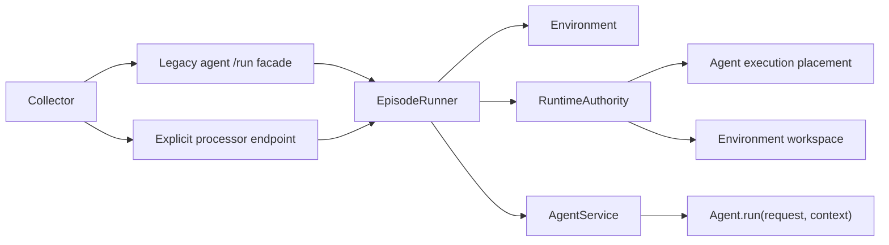
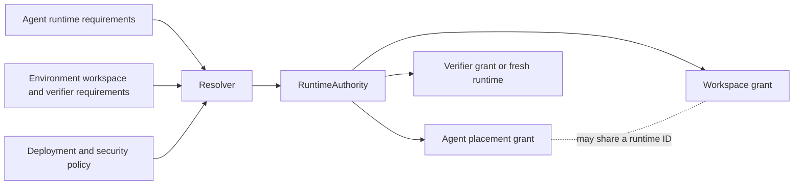

# Episode orchestration: one lifecycle across agents, environments, and runtimes

Status: design draft 6, 2026-09-09.

This document synthesizes the public proposal in `rfcs/gym-architecture.md`, the episode-orchestration design developed in this investigation, and the runtime-placement proof of concept on `upstream/ffrujeri/sandboxes`. It defines a target architecture rather than selecting one proposal unchanged.

The training compatibility scope is NeMo RL only. The contract is based on NVIDIA-NeMo/RL main at `e518e602fbff282dbb1d5033a819b2cdc18cfb12`.

## The current agent endpoint combines behavior with lifecycle work

Gym currently sends each rollout to `POST /run` on an agent server. That method commonly seeds the environment, runs the agent, sends the result for verification, and performs cleanup. Some agents add sandbox creation, artifact collection, retries, or benchmark-specific handoffs to the same method.

This organization causes three concrete problems.

- Agents that implement similar episode lifecycles copy orchestration code. Fixes for cleanup, identity propagation, and metric forwarding must then be repeated.
- A command-line harness often needs a second implementation when it moves into a sandbox. The harness behavior and its execution placement change together even when only placement should change.
- No framework component has a complete and enforceable account of runtime ownership. Environment servers, agent servers, and verifiers can each create or stop a sandbox through provider-specific conventions.

The public RFC identifies the same ownership problem and makes agent swappability its primary goal. It proposes a separate episode-processor server that owns `/run`, invokes the agent through `/v1/responses`, and owns the sandbox lifecycle.

That server boundary clarifies responsibilities, but making another process mandatory would impose a process, port, health check, and network hop on every rollout. It would also make `/v1/responses` carry more meaning than its OpenAI-compatible contract supports. A single Responses API call can represent one model-facing exchange or an adapter surface. It does not necessarily represent a complete episode.

The target architecture keeps one lifecycle implementation without requiring one deployment topology.

## What each proposal optimizes for

### The public RFC optimizes for visible component separation

The RFC makes the episode processor a first-class server and routes all rollouts through it. This gives the lifecycle an obvious network owner. It also removes `/run` and metric aggregation from the agent abstraction.

Its strongest ideas are retained:

- Agent swappability is an explicit design goal. A benchmark should state what work and verification require, while an agent should state how it behaves.
- The component that owns verification also owns metric aggregation.
- The environment owns the task, dataset, tools, state, verification logic, and task-specific runtime requirements.
- When the episode runner owns a workspace, it asks the environment for `/sandbox_spec` before seeding. This lets seed populate the allocated workspace.
- An external framework that owns a whole run may use a custom processor instead of pretending to be a normal agent.
- Planning across rollouts belongs above one episode. Adaptive sampling cannot be expressed by moving `/run`.

The RFC is strongest at naming responsibilities and explaining why agents should be swappable. It is weaker where it turns those responsibilities into fixed deployment boundaries. A mandatory fourth process is unnecessary for simple runs. A processor routing key would also displace `agent_ref.name`, which current NeMo RL code reads as the resolved agent identity after Gym dispatch.

The RFC also assigns sandbox ownership too broadly to one processor. Existing benchmarks require different owners for an agent workspace, environment tools, verifier execution, and pooled resources. Those resources can participate in one episode without sharing one owner.

### This investigation optimizes for compatibility and lifecycle precision

The existing design emphasizes an ordered lifecycle, runtime placement, ownership, recovery, and migration without a mandatory extra process. It also preserves `agent_ref.name` as the externally visible agent identity.

Those priorities remain valid, but parts of the previous draft were too tied to current implementation categories. Broad labels such as native, harness, or external loop do not state the permissions an agent actually needs. They also encourage dispatch code to branch on categories instead of validating concrete requirements.

The previous draft also blurred three boundaries. It treated an OpenAI-compatible endpoint as the agent's architectural contract, allowed host execution to stand in for isolated CLI execution, and described provider scope as enforceable through caller convention. Those choices fail when an agent needs several model exchanges, when untrusted CLI code reaches production data, or when a borrower can call a destructive provider operation. The revised contract separates Python behavior from transport, requires sandbox placement for CLI harnesses, and puts authorization in `RuntimeAuthority`.

The previous draft also treated some critiques of the RFC as conclusions. This revision instead uses each proposal where it is strongest:

- The RFC supplies the agent-swappability goal, environment ownership, metric ownership, pre-seed workspace specification, and the boundary between an episode and cross-rollout planning.
- This design supplies one logical runner across deployment forms, the external identity contract, explicit phase order, runtime authority, recovery semantics, and NeMo RL compatibility.
- The placement proof of concept supplies a practical way to move an existing Python harness into a sandbox, along with useful validation and cleanup behavior.

## The synthesis has one logical runner and two deployment forms

`EpisodeRunner` is a mandatory logical component. Every standard Gym episode executes through the same implementation and the same phase contracts.

Deployment as an episode-processor server is optional.

- `POST /run` on a legacy agent server remains available. The endpoint resolves the environment, agent, and runtime bindings, then calls the shared `EpisodeRunner` in the agent-service process.
- An explicit episode-processor endpoint calls the same `EpisodeRunner`. Complex flows can therefore place orchestration in a dedicated process without changing lifecycle semantics.
- Gym's collector may resolve either endpoint internally. The materialized row and returned result continue to identify the selected agent through `agent_ref`.

The compatibility endpoint is a facade, not a second implementation. When the runner and agent share a process, the runner calls the agent service directly. When they are in separate processes, it uses the private transport endpoint. Tests must prove that the in-process facade and explicit processor endpoint produce the same phase order, requests, result shape, cleanup behavior, and failure classification.

This arrangement gives simple evaluations one lifecycle without forcing a fourth process. It also gives staged, external, or operationally isolated flows a dedicated deployment when they need one.



## Roles are defined by behavior and authority

### The environment defines the task and verification contract

The environment owns:

- datasets and task-row schemas;
- task initialization and environment state;
- environment tools;
- task and workspace requirements;
- verification;
- metric aggregation;
- environment-state export, restore, and close behavior.

The environment can request a workspace or another runtime, but it does not gain authority over an agent runtime merely because both use the same provider.

### The agent has one Python behavior contract

Every agent implements:

```python
async def run(request: AgentRequest, context: AgentContext) -> AgentResult:
    ...
```

`AgentRequest` contains the task input that the agent is allowed to see. It does not include private verifier answers or unrelated global configuration.

`AgentContext` contains the resolved model bindings, tool bindings, participant identity, runtime grant, workspace grant, rollout identity, attempt identity, deadlines, and optional checkpoint input.

`AgentResult` contains the agent's response items, usage and capture references, artifacts or artifact declarations, emitted events, and optional checkpoint state.

This Python method is the architectural behavior contract. It works for a simple in-process policy loop, a command-line harness, and a Python harness placed inside a sandbox.

### `AgentService` hosts placement and transport

`AgentService` hosts an agent implementation and controls its placement. It exposes the same invocation operation through an in-process interface and a private transport endpoint.

An `EpisodeRunner` in another process calls:

```text
POST /invoke
```

The request to `/invoke` carries typed Gym identity and grant references. The service resolves those references into an `AgentContext` and calls `Agent.run(request, context)`. A runner hosted in the same process calls the invocation interface directly and does not make an HTTP request to itself.

`POST /v1/responses` remains available as an OpenAI-compatible adapter. It translates a compatible request into `Agent.run` when enough context exists. A stateless agent can serve a direct request without episode runtime bindings. An agent that requires a workspace or sandbox rejects a direct request that does not provide an authorized invocation context. This endpoint is not the canonical Gym behavior contract, and the architecture does not assume that one `/v1/responses` call completes an episode.

### `EpisodeRunner` owns lifecycle order

`EpisodeRunner` coordinates one episode. It does not own every resource that participates in that episode.

### `RuntimeAuthority` owns runtime allocation and grants

`RuntimeAuthority` creates or reconnects execution runtimes. It keeps provider descriptors internal and issues typed grants to callers.

A runtime grant is:

- bound to one rollout and attempt;
- bound to an audience such as one agent service or verifier;
- bound to an authority level such as owner, operator, or verifier;
- limited to named operations and resources;
- expiring and renewable under policy;
- revocable and auditable.

The provider handle or serialized provider descriptor never becomes the cross-service authority token. A raw OpenSandbox descriptor, container identifier, workspace path, or provider credential remains inside `RuntimeAuthority`.

An owner may destroy a runtime. An operator or verifier may perform only the operations in its grant. When a borrower finishes, it releases its connection or grant. It does not destroy the runtime.

These rules must be enforced at the authority boundary. OpenSandbox scope is not considered secure merely because callers follow a convention.

### The model serves inference and capture

Model servers remain responsible for inference, admission, token capture, and model-call capture. Rollout and participant identity propagate through the resolved model binding.

## One episode follows an explicit ordered lifecycle

The default lifecycle executes in this order.

| Phase | Behavior | Durable output |
| --- | --- | --- |
| Resolve identity | Resolve or mint the rollout id, attempt, agent identity, environment identity, participant identity, and deadlines. Fence older attempts before any external effect. | Episode identity and attempt fence |
| Resolve requirements | Validate the agent's concrete runtime requirements against environment policy and available providers. Resolve separate agent-runtime and environment-workspace bindings. | Resolution decision |
| Request workspace specification | If the runner will own an environment workspace, call `/sandbox_spec` before seed. Skip this call when no runner-owned workspace is required. | Validated workspace specification |
| Allocate or reconnect runtimes | Ask `RuntimeAuthority` to allocate or reconnect each required runtime. Issue separate grants for the agent, environment, and verifier. | Runtime references and grants |
| Seed the environment | Call `/seed_session` with episode identity and the environment workspace binding. Seed must be idempotent for one rollout and attempt. | Environment state reference and tool metadata |
| Invoke the agent | Call the `AgentService` invocation operation directly when colocated, or call private `POST /invoke` when the service is remote. The service resolves `AgentContext` and calls `Agent.run`. | `AgentResult` and event cursor |
| Harvest declared artifacts | Collect only files, commands, or structured outputs declared by the environment contract. | Artifact manifest |
| Verify | Send the agent result, permitted artifacts, and the verifier's own grant to the verify owner. | Reward, reward components, and verifier metadata |
| Publish the terminal result | Commit one durable terminal record before reporting success to the collector. Repeated publication for the same fenced attempt returns the same result. | Terminal episode result |
| Close and release | Close environment state. Release borrowed grants. Destroy only runtimes owned by the runner. Record cleanup failures without replacing the primary result or error. | Final lifecycle events |

Cancellation follows the same close and release path. Runtime time-to-live policies remain a crash backstop, not the normal cleanup mechanism.

`EpisodeRunner` can compose additional stages or a step loop, but the ownership and publication rules do not change. A custom processor may replace the default phase composition for a whole-run integration. It still emits the common episode result and identity.

## Runtime requirements are concrete and agent-owned

An agent declares the exact facilities needed to execute its behavior. It does not select itself into a broad profile.

```yaml
requirements:
  isolation:
    boundary: container
    untrusted_code: true
  subprocess: true
  pty: true
  filesystem:
    writable_workspace: true
    persistence: episode
  network:
    destinations:
      - binding: policy_model
      - binding: environment_mcp
  checkpoint:
    supported: false
```

The complete requirement model should cover:

- required isolation strength;
- subprocess execution;
- PTY and stdin behavior;
- writable and read-only filesystem mounts;
- network destinations and protocols;
- persistence duration;
- CPU, memory, GPU, and timeout limits;
- signals and cancellation;
- upload, download, and artifact operations;
- checkpoint and reconnect support.

The resolved `AgentContext` records the selected implementation and grants. This makes the result reproducible without making the agent config depend on a provider-specific descriptor.

Placement is a resolution outcome derived from exact requirements and policy. Agent configuration does not classify behavior through broad runtime profiles.

### Command-line harnesses require sandbox placement

OpenCode, Claude Code, Codex, and similar command-line harnesses execute third-party programs that can read files, spawn processes, and make network calls. Production execution therefore requires a sandbox that satisfies the declared isolation and egress policy.

There is no unsandboxed production fallback for these harnesses. A missing suitable sandbox is a preflight error.

A simple Python agent can resolve to in-process execution when it needs no external runtime. A trusted helper can use a local subprocess when policy permits. A local subprocess provides process management and a workspace, but it is not a security boundary.

### Agent execution and environment state use separate bindings

The place where agent code executes and the place where task state lives are separate decisions.

For example, a Python agent service can remain on the host while its shell tool operates an environment workspace in a sandbox. A CLI agent can execute inside the same sandbox that holds the task workspace. In both cases, the agent-execution grant and environment-workspace grant remain separate records with separate permissions.

Co-location is an optimization and sometimes a benchmark requirement. It is not proof of shared ownership.

The verifier has three supported relationships to task state:

- It can inspect the live environment workspace through a verifier grant.
- It can start a fresh verifier runtime and apply harvested artifacts there.
- It can consume artifacts without any live runtime.

The environment declares which relationship verification requires. `RuntimeAuthority` enforces the resulting grant.



## Benchmark topologies fit the separate bindings

The following benchmark evidence motivates the runtime and verification contracts. The table describes topology, not a permanent implementation assignment.

| Benchmark | Agent execution and task state | Verification relationship | Architectural consequence |
| --- | --- | --- | --- |
| SWE-bench | The harness edits a repository workspace. Existing implementations may have the environment create that workspace. | Verification can consume a patch in a fresh runtime or inspect a live workspace, depending on the verifier implementation. | The workspace owner, agent operator, and verifier must be explicit. The harness must not rely on a private process-local sandbox registry. |
| Terminal Bench | A CLI harness executes commands in the task container and changes its live state. | Tests inspect the same task state. | Agent execution and workspace can be co-located, but the verifier needs its own grant and the owner alone performs teardown. |
| GDPVal | An agent produces named deliverables that later become verifier inputs. Its adaptive evaluation also chooses future work from prior results. | Verification reads declared deliverable artifacts. | Deliverable harvest belongs to the episode contract. Adaptive sampling remains above individual episodes. |
| CVDP | A harness produces RTL files in a workspace. Existing paths can also parse RTL from model output. | Verification can receive file contents as artifacts and run independently. | The verifier does not need authority over the agent execution runtime when artifacts are sufficient. |
| VIBench | A harness creates an application in a sandbox and exports it for scoring. | Verification consumes the exported application. | Artifact identity and transfer must be declared rather than passed through an incidental host path. |
| OSWorld | The agent interacts with a desktop runtime and services exposed through ports. | Evaluation inspects live desktop or application state. | Desktop ports, persistence, and verifier authority are concrete runtime requirements. |
| PinchBench | A benchmark image runs the task interaction and its grading workflow. | Scoring occurs in or against the benchmark runtime and produces a result artifact. | A whole-run integration can use a custom processor while still publishing the common episode result. |
| Tau2 | The external library drives a multi-turn interaction between a policy participant and a simulated user, then computes reward. | The external integration owns its scoring flow. | A custom processor can host the whole-run integration. Model bindings and event attribution must identify both participants. |

These cases do not imply that one component must own every sandbox. They show why runtime role, owner, operator, verifier, placement, and lifetime must be independent fields.

The corresponding implementation evidence is in `resources_servers/swebench/app.py`, `resources_servers/terminal_bench_2_1/app.py`, `resources_servers/gdpval/app.py`, `responses_api_agents/cvdp_agent/app.py`, `responses_api_agents/vibench_agent/app.py`, `responses_api_agents/osworld_agent/`, `responses_api_agents/pinchbench/`, and `responses_api_agents/tau2/`. The important behavior is summarized in the table so the design does not depend on readers opening each file.

## The placement proof of concept supplies a worker mechanism, not the final runner

The `upstream/ffrujeri/sandboxes` branch demonstrates that an existing Python harness can execute inside a task sandbox. The host is implemented in `nemo_gym/sandbox/agent_runtime.py`, the in-box worker is in `nemo_gym/sandbox/agent_runtime_worker.py`, and placement validation is in `nemo_gym/sandbox/agent_runtime_config.py`.

Its useful mechanisms should be retained:

- A host can stage a worker and invoke an existing harness inside the selected runtime.
- Dependencies can be staged from the checkout during development.
- Prepared images can disable per-task dependency installation for production.
- Validators reject conflicting placement configuration.
- Cleanup is attempted in `finally` after both successful and failed execution.
- A typed workspace object is better than an unstructured sandbox identifier.

Dependency staging is a development path. Production runtimes should use built, versioned, and cached images so rollout startup does not depend on downloading Python, Gym, and harness dependencies.

`SandboxedAgentHost` is not the final orchestrator. Its current `run()` seeds the environment, attaches or creates a sandbox, invokes the harness, verifies the result, and cleans up from the agent service. That reproduces the episode lifecycle in the placement host instead of delegating to the shared `EpisodeRunner`.

The proof of concept also invokes the harness through its FastAPI `/v1/responses` route. The target worker calls the canonical `Agent.run(request, context)` method. An HTTP bridge may remain an implementation option when the placed process needs a transport boundary, but the bridge exposes Gym's private `/invoke` contract rather than treating `/v1/responses` as the complete behavior contract.

The current worker payload forwards broad agent configuration and cookies. The target passes only typed request fields, resolved bindings, and scoped grants. Provider credentials, verifier configuration, answer keys, and unrelated cookies do not enter the agent runtime.

The current environment-workspace lookup depends on resources-server process memory. That fails when seed, verify, and cleanup reach different workers or after a process restart. The target stores runtime identity in `RuntimeAuthority` and durable episode state.

The proof of concept has no durable resume protocol. The target adds attempt fencing, event cursors, coordinated checkpoints, and idempotent terminal publication before using placement for resumable training.

## Runtime authority is enforceable across processes

`RuntimeAuthority` is a logical service. It can run in-process with the owner for a simple deployment or behind a service boundary when multiple processes or hosts need access.

The logical API includes:

```text
allocate(requirements, identity, owner) -> RuntimeRef
reconnect(runtime_ref, identity) -> RuntimeRef
grant(runtime_ref, audience, authority, operations, expires_at) -> RuntimeGrant
renew(runtime_grant, expires_at) -> RuntimeGrant
release(runtime_grant) -> None
destroy(runtime_ref, owner_grant) -> None
```

`RuntimeRef` is an opaque durable reference. `RuntimeGrant` is a typed, expiring authorization. Neither exposes the provider's raw connection material to callers.

The authority also provides the runtime data plane authorized by a grant. At minimum, that surface covers process execution, signals, status, file upload and download, artifact reads, and declared service endpoints. A colocated caller may receive an in-process `RuntimeSession` that checks the same grant. A remote caller uses an enforcing proxy client. Callers never bypass the authority by reconnecting with provider credentials.

Provider adapters translate authorized operations into provider behavior. If a provider cannot enforce an operation safely, resolution must reject that topology or route access through an enforcing authority service. Documentation or caller convention is not sufficient.

This design does not require a separate sandbox service in every deployment. An in-process authority can manage a runtime used only by the same process. A service becomes necessary when enforcement or reconnection crosses a process or host boundary.

## Identity remains stable for results and training

`agent_ref.name` remains the external identity of the selected agent on the materialized row, the returned result, and metric grouping.

Processor placement is internal. A row does not replace its agent identity with an episode-processor identity. Gym may record the resolved runner deployment as additional provenance.

The rollout id and attempt identify one execution. Participant and seat identifiers distinguish model-using actors within that execution. The event stream records all four values so model calls, tools, artifacts, checkpoints, and rewards can be attributed without overloading the agent name.

### NeMo RL compatibility is a required contract

At NVIDIA-NeMo/RL main commit `e518e602fbff282dbb1d5033a819b2cdc18cfb12`, `nemo_rl/environments/nemo_gym.py` calls `RolloutCollectionHelper.run_examples` before it reads the synchronously resolved `row["agent_ref"]["name"]` for completion accounting. It returns the resolved `agent_ref` to its caller.

NeMo RL also supports token-capture receipt mode keyed by `_ng_rollout_id`. Its training path consumes `response.output`, scalar `reward`, optional `reward_components`, and `instance_config.mask_sample`. The output items carry token and log-probability data, reward components feed multi-reward training, and `mask_sample` determines whether a rollout contributes to the loss.

The design therefore requires:

- `run_examples` continues to resolve the row's agent synchronously before returning its tasks.
- The resolved `agent_ref` remains on the row and result.
- `agent_ref.name` remains the selected-agent and completion-accounting identity.
- `_ng_rollout_id` continues to key token-capture receipts and retrieval.
- The Gym result continues to include `response.output`, scalar `reward`, optional `reward_components`, and `instance_config.mask_sample` with their current meanings.
- Selecting an in-process runner or explicit processor does not change these fields.

NeMo RL contract tests must cover both runner deployments, rows resolved from task ownership, token-capture receipt mode, completion accounting, reward consumption, and returned agent identity.

## Metric aggregation stays with the verify owner

The server or component that computes `/verify` also computes aggregate metrics for those verification results.

Gym groups results by verify owner and `agent_ref.name`. The entry identity remains the agent name so output artifacts and NeMo RL-facing identity do not change.

The compatibility facade may accept `/aggregate_metrics` on an agent endpoint during migration. It delegates to the verify owner and does not compute metrics itself.

A whole-run custom processor that also owns verification is the verify owner for its results. This is consistent with the same rule.

## Cross-rollout planning remains above `EpisodeRunner`

`EpisodeRunner` executes one row and publishes one terminal result. It does not decide which rows should run next.

GDPVal preselects each stage's task set. Results from an earlier stage then select reference models for the next stage, and the planner materializes later rows with those references. That cross-rollout dependency belongs in `rollout_collection_driver` today or in a future typed planner above episode execution.

A custom episode processor does not replace `rollout_collection_driver`. It can implement GDPVal's per-row deliverable lifecycle, but it cannot express cross-rollout planning because it is called after a row has already been selected.

Retries that repeat one row can remain collector policy. Planning that changes the work set belongs to the higher layer.

## Multi-agent episodes require seats, scheduling, and attribution

`fan_out` repeats a single-agent evaluation with different agents. The repeated runs do not share one environment state or take turns in one episode. It is not a multi-agent episode.

A multi-agent episode requires an explicit participant model:

```yaml
participants:
  - participant_id: solver
    seat: primary
    agent_ref: solver_agent
    model_binding: policy_model
  - participant_id: critic
    seat: reviewer
    agent_ref: critic_agent
    model_binding: critic_model
schedule:
  policy: environment_directed
```

Each participant has:

- a stable participant and seat identity;
- an agent and model binding;
- an execution-runtime grant;
- an environment-workspace grant;
- tool and network permissions;
- checkpoint state;
- event and usage attribution.

The schedule states who acts next and who may observe each event. It can be fixed, environment-directed, or processor-defined. The schedule cannot be inferred from `fan_out` or from multiple model URLs.

Tau2 already demonstrates why participant identity matters: policy and simulated-user calls occur in one episode but have different roles. The target records those roles explicitly even when a custom processor drives the interaction.

## Partial checkpointing coordinates all episode state

A partial-rollout checkpoint records a durable boundary before the episode has produced its terminal result. It is not only an agent transcript. It is a coordinated record of the state needed to continue one fenced attempt without duplicating effects.

A checkpoint contains:

- agent state or an agent-specific checkpoint token;
- environment state or a reconnectable environment-runtime reference;
- agent execution-runtime reference when continuation requires it;
- the last durable event cursor;
- rollout and attempt identity;
- the current attempt fence;
- the status of external effects and their idempotency keys;
- participant state and schedule position for multi-agent episodes;
- the terminal-publication state.

The checkpoint commit occurs only after all referenced component states are durable. The event cursor advances with the commit. A restarted runner restores only a checkpoint whose attempt still owns the fence.

External effects use idempotency keys derived from the rollout and logical effect identity. The attempt fence determines which attempt may issue or commit the effect, but the attempt number is not part of the effect key. A later authorized attempt therefore receives the prior outcome instead of repeating an effect completed by an earlier attempt.

Terminal result publication is durable and idempotent. A runner that crashes after publication but before acknowledgement must return the existing terminal result when the collector retries.

Blackbox CLI agents may initially declare `checkpoint.supported: false`. They become resumable only when they provide a checkpoint adapter that can save and restore the CLI's relevant state. The runtime may still be reconnectable, but reconnecting a process or filesystem alone does not prove that the agent can resume correctly.

## Compatibility facades do not create a second architecture

The following compatibility surfaces remain during migration:

- Agent `POST /run` delegates to `EpisodeRunner`.
- Agent `POST /aggregate_metrics` delegates to the verify owner.
- `POST /v1/responses` adapts compatible requests to the agent contract.
- Existing seed and verify schemas continue to accept rows without runtime fields.

New code must not implement lifecycle logic in these facades. The facades resolve typed inputs, call the shared component, and translate the output.

Direct clients that call an agent's `/run` continue to work. They receive the same response and reward shape, with additive episode provenance where available.

## Configuration records references instead of nesting behavior

The environment config identifies task data, verification, tools, state, and requirements. The agent config identifies an agent implementation, model bindings, and concrete runtime requirements. An optional processor config selects an explicit `EpisodeRunner` deployment or a custom phase composition.

One possible shape is:

```yaml
resources_servers:
  swebench:
    entrypoint: app.py
    datasets:
      - name: verified
        jsonl_fpath: data/verified.jsonl

responses_api_agents:
  opencode:
    entrypoint: app.py
    model_bindings:
      policy: policy_model
    requirements:
      isolation:
        boundary: container
        untrusted_code: true
      subprocess: true
      pty: true
      filesystem:
        writable_workspace: true
      network:
        destinations:
          - binding: policy_model

episode_processors:
  swebench_explicit:
    entrypoint: app.py
    environment: swebench
```

Omitting `episode_processors` does not omit episode orchestration. It selects the shared runner through the agent `/run` compatibility facade.

Provider selection is a policy resolution based on requirements and deployment configuration. The agent does not contain a raw sandbox provider descriptor.

## Validation fails before compute

Preflight validation compares concrete agent requirements, environment requirements, runtime capabilities, and policy.

Validation should report a specific mismatch. For example, it should state that an agent requires a PTY and network access to the policy model but the selected runtime provides neither. It should not report only that an agent and benchmark are incompatible.

`allowed_agents` can remain as an environment-owner policy. It does not replace capability validation. Bypassing it must not bypass isolation, authority, or verifier requirements.

Validation also checks:

- every referenced agent, environment, model, and optional processor exists;
- one resolved agent remains identified by `agent_ref`;
- CLI agents resolve to a sandbox with adequate isolation;
- grants can enforce the requested operations and audiences;
- live verification has a verifier grant;
- checkpointing is requested only when all required components support it;
- a multi-agent schedule names valid participants and seats;
- the verify owner also owns metric aggregation.

## Migration proceeds through compatibility tests and canaries

### Establish behavior and NeMo RL contracts

Add conformance and characterization tests for current `/run`, seed, verify, aggregation, identity, capture, and cleanup behavior.

Add NeMo RL contract tests against commit `e518e602fbff282dbb1d5033a819b2cdc18cfb12`. Cover synchronous agent resolution, returned `agent_ref`, `_ng_rollout_id` token-capture receipt mode, Responses output, reward consumption, and completion accounting.

### Introduce the shared logical runner and compatibility facade

Implement `EpisodeRunner` as a library component with typed phase inputs and outputs.

Make legacy agent `/run` delegate to it. Add an explicit processor endpoint that delegates to the same implementation. Route metric aggregation to the verify owner.

Keep `agent_ref.name` unchanged on rows and results. Do not require an additional process.

### Add typed runtime requirements and grants

Replace profile-like runtime categories with concrete agent requirements and a resolved `AgentContext`.

Introduce `RuntimeAuthority`, opaque runtime references, typed grants, expiration, audience binding, attempt binding, renewal, release, and owner-only destruction.

Separate the agent execution binding from the environment workspace binding. Add the three verifier relationships: live state, fresh runtime, and artifact-only.

### Migrate command-line canaries

Use OpenCode and Claude Code as initial CLI canaries, followed by Codex.

Run them only in sandboxed production configurations. Retain dependency staging for development and use prepared images for scale.

Reuse the placement proof of concept's worker mechanism, validators, and cleanup attempts. Replace `SandboxedAgentHost` orchestration with `EpisodeRunner` and replace in-box `/v1/responses` invocation with canonical `Agent.run`.

### Deploy explicit processors for complex flows

Introduce explicit processor deployment for staged protocols, operational isolation, and whole-run external integrations.

Keep GDPVal's adaptive planner above these processors. Use a custom per-row processor only for its deliverable and verification lifecycle.

### Add checkpointing and multi-agent extensions

Add attempt fencing, coordinated component checkpoints, event cursors, idempotent external effects, and durable terminal publication.

Add participant and seat identity, schedules, model bindings, separate runtime and workspace grants, and event attribution.

Allow blackbox CLI agents to remain explicitly non-resumable until they provide checkpoint adapters.

### Migrate benchmarks by topology

Migrate SWE-bench and Terminal Bench first because they exercise live and fresh verification relationships.

Migrate GDPVal, CVDP, and VIBench through declared artifact handoffs.

Migrate OSWorld and PinchBench through desktop and whole-runtime grants.

Migrate Tau2 as a whole-run custom processor with explicit participants and model bindings.

Remove duplicated sandbox-specific agent implementations only after their base agent passes the same conformance suite in the new placement.

## Decisions carried by this draft

1. `EpisodeRunner` is mandatory as the logical lifecycle implementation. A separate processor server is optional.
2. Legacy agent `/run` and explicit processor endpoints delegate to the same runner.
3. `Agent.run(request, context) -> AgentResult` is the behavior contract.
4. `AgentService /invoke` is the private transport contract used by the runner.
5. `/v1/responses` is a compatibility adapter and does not define a whole episode.
6. Runtime requirements are concrete. Profile-like classifications are removed.
7. CLI harnesses require sandbox placement in production. Local subprocess execution is not a security boundary.
8. Agent execution and environment task state have separate bindings and authority.
9. `RuntimeAuthority` keeps provider descriptors internal and enforces typed grants.
10. A borrower releases its connection. Only an owner destroys a runtime.
11. The placement proof of concept contributes worker placement, dependency staging, validation, and cleanup behavior. `SandboxedAgentHost` does not remain the orchestrator.
12. `agent_ref.name` remains the external result, metric, and NeMo RL agent identity. `_ng_rollout_id` remains the token-capture receipt identity.
13. Metric aggregation belongs to the verify owner.
14. Cross-rollout planning remains above `EpisodeRunner`.
15. `fan_out` is repeated single-agent evaluation, not a multi-agent episode.
16. Partial checkpointing coordinates agent state, environment state, runtime references, events, effects, fencing, and terminal publication.

## Open architectural question

The design does not yet choose whether a cross-host `RuntimeAuthority` should be a Gym-managed service or an adapter to an existing infrastructure control plane. The contract and enforcement requirements are the same in either case. That deployment choice can remain open until a benchmark requires cross-host runtime sharing.
