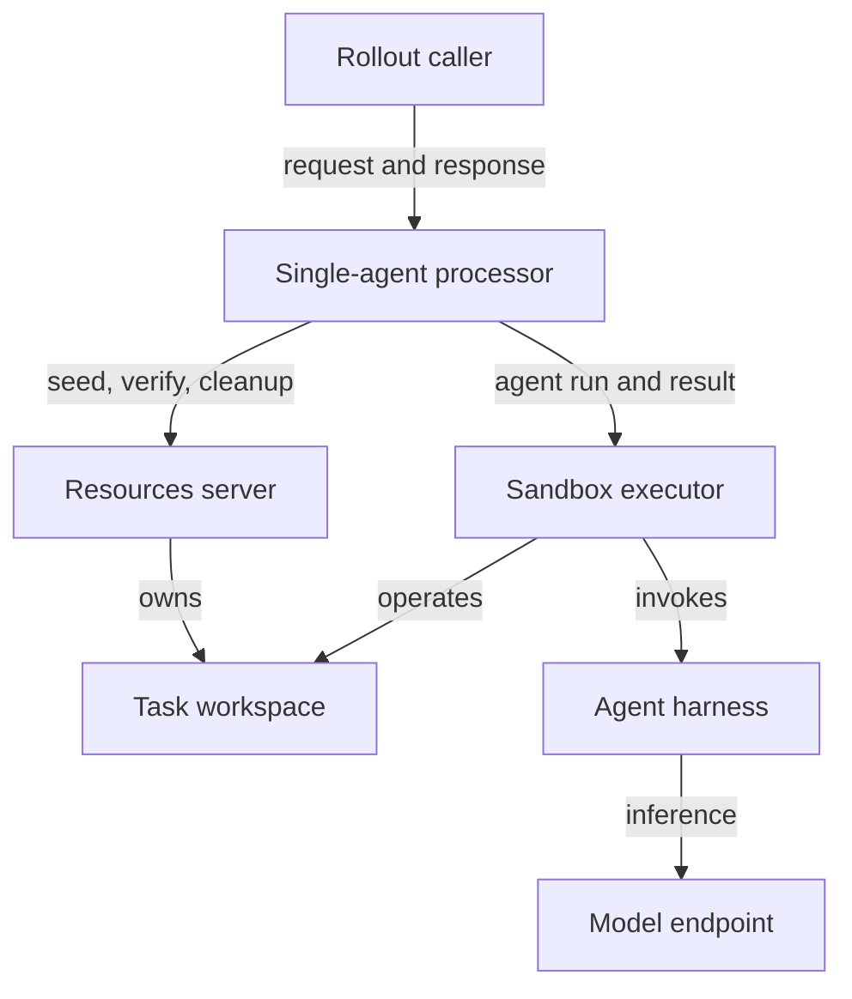
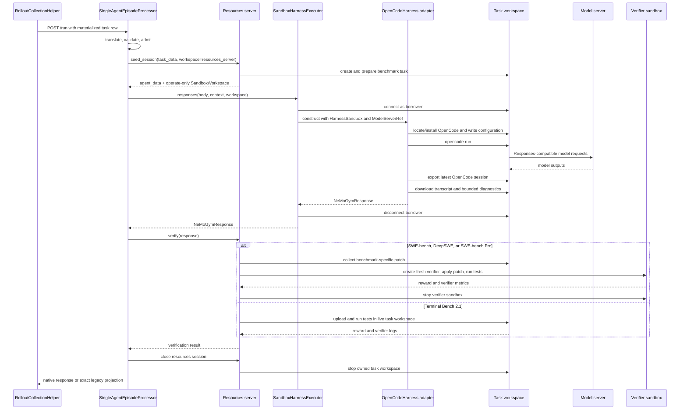
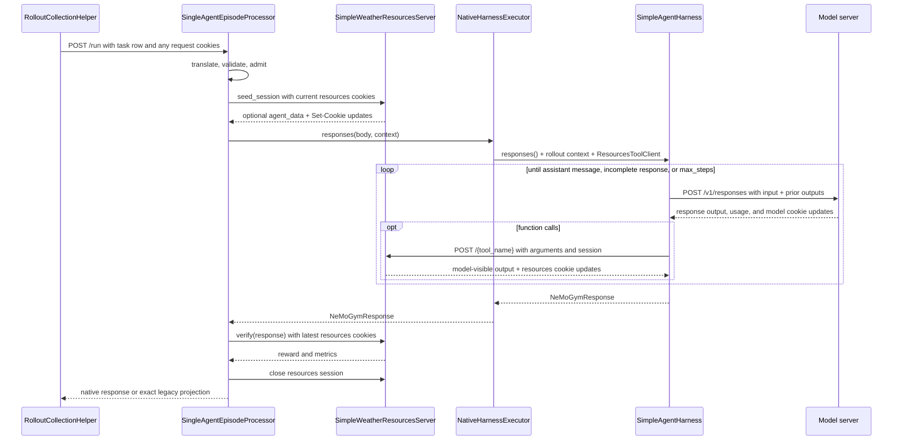

# Episode Architecture for NeMo Gym

Status: design proposal for review

## 1. Decision summary

NeMo Gym needs an episode boundary that can express how one task is executed without forcing the resources server, agent implementation, sandbox runtime, and rollout scheduler into one component.

Today, rollout collection sends `POST /run` to an agent server. That server commonly initializes benchmark state, runs an agent loop, asks a resources server to verify the outcome, and cleans up. The arrangement works when one agent owns the whole interaction, but it leaves three questions without reusable answers:

- Who coordinates an episode when a simulated user or another agent must act between policy turns?
- Where does a command-line harness run when the benchmark has already created the task sandbox?
- Which component may reconnect to, inspect, or destroy each sandbox during execution and verification?

The two worked examples demonstrate that this boundary supports materially different episodes without hiding their differences. The `simple_agent` example preserves a complete model-and-tool loop with no task sandbox. The OpenCode example runs a CLI in a resources-server-owned task sandbox and preserves four benchmark-specific verification flows. Both use the same processor envelope for admission, cancellation, cleanup, and response publication. Together they show that the architecture separates episode orchestration from agent behavior and environment ownership without forcing either example into a generic interaction loop.

The design has three ordered foundations:

1. **Episode processing.** An `EpisodeRequest` enters a concrete processor server. `BaseEpisodeProcessor` supplies the reliable execution envelope, while the concrete processor supplies participant ordering, visibility, verification timing, and termination.
2. **Agent harness execution and sandboxing.** `AgentHarness.responses()` is the behavior operation currently exposed by Gym agents at `/v1/responses`. An executor places that behavior in the processor, a supervised process, a remote service, or a borrowed task workspace. The OpenCode migration is the demanding reference case because it must install and configure a CLI, run it in a benchmark-owned sandbox, export its transcript, and preserve benchmark-specific verification.
3. **Task sets and routing.** `TaskSet` supplies typed, immutable `TaskData`. Run configuration binds the task set to a processor deployment and participant harnesses. Task rows identify work; they do not select executable implementations or carry service credentials.

The order is architectural, not merely a release checklist. The processor boundary must exist before harness behavior can be removed from today's agent-owned `/run`. Harness and sandbox ownership must be explicit before task routing can safely compose arbitrary tasks and agents. TaskSet then replaces the current mixture of JSONL loading, prompt materialization, per-row `agent_ref`, and direct dispatch with one validated path.

Several important capabilities build on these foundations. User simulation is the first expected protocol extension and requires the separate `turn()` harness API. A sandbox server can later provide reconnectable operate leases for providers that cannot reconstruct a sandbox in another process. Restart-safe attempts, checkpoint restoration, and retained artifacts require additional storage and ownership contracts. They are not prerequisites for defining the three foundations correctly.

The central design rule is:

> The framework owns reliable episode execution. A concrete episode processor owns the interaction protocol.

That rule gives implementations common operational behavior without treating every environment as a variation of a single-agent loop.

These are logical responsibilities, not mandatory process boundaries. A concrete processor remains a server. A trusted Python harness can run in its worker or a supervised subprocess. A CLI program can run in the task sandbox while its harness adapter remains in the processor deployment. A separately scaled harness can remain remote. Placement can change without changing episode semantics, sandbox ownership, or result interpretation.

## 2. Requirements and boundaries

### 2.1 What this architecture must make easy

- Let a benchmark author define task setup, stateful tools, verification, cleanup, and runtime requirements without choosing an agent.
- Let an agent author implement an explicit harness contract without knowing which environment will invoke it: `responses()` owns the model-and-tool loop through one `NeMoGymResponse`, while `turn()` performs one participant activation and returns scheduling control to the processor. The contracts do not share nullable fields or a mode selector.
- Let a run bind compatible tasks, resources, harnesses, models, and placements through trusted configuration.
- Keep existing Gym `/run` integrations and NeMo RL consumers working during migration.
- Move a CLI agent harness into a benchmark task sandbox without duplicating sandbox lifecycle code in every agent.
- Preserve resource-server ownership when the resources server creates the task sandbox.
- Allow a concrete episode processor to define its own protocol and participant roles.
- Replace per-row executable routing with typed task-set routing.
- Evolve toward restart-safe rollout execution without implying those guarantees prematurely.
- Make ownership and cleanup mechanically enforceable.

### 2.2 Invariants

The following rules define the foundation and remain valid as the architecture grows:

1. Exactly one component owns each resource and is responsible for destroying it.
2. A borrower receives only the authority needed to operate a resource.
3. Agent behavior is distinct from the runtime that executes it.
4. The base processor does not prescribe a participant graph or interaction protocol.
5. Harness `responses()` and `turn()` calls are separate contracts.
6. Resource-server-internal submission transfer is not a public artifact API.
7. Legacy `/run` requests and native episode results pass through deterministic translators. Golden tests cover every mapped field, rejected input, and legacy output shape.
8. Cleanup runs on success, failure, timeout, and cancellation.
9. New distributed guarantees are not implied by in-memory implementations.

### 2.3 What must be defined together

The proposal defines all three foundations, including their native contracts and how they compose. That complete target is needed before teams can implement the boundaries in parallel:

- `EpisodeRequest`, `EpisodeResponse`, `BaseEpisodeProcessor`, and `SingleAgentEpisodeProcessor`;
- separate harness behavior, deployment, and executor contracts;
- explicit resources-owned and executor-owned workspace acquisition, including the `SandboxWorkspace` handoff and owner-specific cleanup;
- concrete OpenCode and simple-agent mappings that preserve current behavior;
- `TaskData`, `TaskSet`, materialization, validation, selection, repeat expansion, and processor routing;
- deterministic compatibility translation for existing `/run`, JSONL, `agent_ref`, and NeMo RL consumers.

Implementation does not need to switch all three foundations on at once. The processor and harness boundaries can first run behind existing agent names and accept current materialized rows. Native TaskSet routing follows without redesigning either boundary.

### 2.4 Capabilities added after the foundations

The following capabilities use the foundation but introduce requirements of their own:

- user simulation adds `turn()`, role-specific visibility, and chronological policy attribution;
- additional multi-agent processors add their own roles, ordering, concurrency, and termination;
- processor-owned task sandboxes add a typed sandbox-specification request and reverse the borrower relationship;
- a process-local sandbox provider must be explicitly configured behind a sandbox server before its environment-owned workspace can cross a process boundary;
- restart-safe attempts add shared claims, leases, ownership epochs, and stale-writer fencing;
- checkpoint restoration adds coordinated snapshots across processor, resources, harness, model capture, and workspace owners;
- caller-retained artifacts add durable storage, authorization, retention, and garbage collection.

This sequencing avoids putting speculative fields in the foundation. It does not defer TaskSet, sandbox ownership, or exact harness behavior, because those are required to explain how a task reaches the right processor and how the current agents continue to work.

### 2.5 The resources server is the environment

In this design, the resources server is the deployed environment. It owns task setup, benchmark state, stateful tools, verification, environment-specific cleanup, and any task runtime it creates. A `TaskSet` supplies immutable tasks accepted by that environment.

The episode processor is orchestration code between participant harnesses and the environment. It is neither an agent nor part of the environment. It decides participant ordering, visibility, verification timing, and termination, while the framework supplies admission, cancellation, cleanup registration, and response publication. Agent harnesses implement participant behavior, and executors place that behavior in a process, service, or borrowed environment workspace.

Trusted run configuration binds a task set, environment, processor, harnesses, and models. Task rows cannot select executable Python code, deployment credentials, or a processor protocol. Harnesses do not need environment-specific seed, extraction, or verification logic.

### 2.6 Lessons adopted from Verifiers and Harbor

Verifiers V1 demonstrates two boundaries that Gym should preserve:

- `Env.run_episode()` wraps protocol-specific `Env.run()` with framework bookkeeping.
- `Agent.run()` executes one complete agent attempt, while `Interaction.turn()` returns control to its caller after one activation.

Gym's `BaseEpisodeProcessor.run()` and concrete `process()` methods follow the first boundary. Gym preserves the second boundary's scheduling distinction while retaining its existing method name: `responses()` leaves scheduling with the harness until it produces one complete Responses API response, while `turn()` returns scheduling to the processor after one activation. Gym does not adopt `Interaction` as another environment object. The processor owns the interaction protocol, and the resources server remains the environment.

Harbor is useful as a work-package exemplar. A task can declare its prompt, image, working directory, resources, network policy, verifier assets, and timeouts without selecting an agent. Harbor's isolated verifier flow also demonstrates an important ordering rule: collect benchmark-defined work while the task runtime is alive, restore it into a verifier runtime when required, verify, and only then destroy required state.

The proposal does not make Harbor's registry, downloader, directory layout, or generic artifact model part of Gym core. In particular, benchmark-internal submission transfer does not justify putting caller-visible artifact payloads in every episode response.

### 2.7 Episode and rollout are not interchangeable

An episode is the complete interaction for one task attempt. It can contain one agent run or many participant turns. An exported rollout is a training or evaluation projection from that episode.

The distinction is easy to miss in the initial single-agent protocol because one episode produces one policy rollout. It matters for user simulation: the episode contains both policy and simulated-user activity, while the trainable rollout contains only policy model calls with the visible context that preceded them. A compatibility adapter must not pretend a multi-participant episode is one legacy rollout if doing so would discard actions or mix non-policy tokens into training.

Identity also has several scopes:

- `rollout_id` correlates the logical sample across services.
- `attempt` distinguishes physical retries of that sample.
- the resources session identifies benchmark state held between seed, tools, verify, and cleanup;
- sandbox identity identifies one physical runtime;
- future participant and capture identities distinguish model-call streams inside a multi-participant episode.

Correlation is not authority. A rollout id does not authorize a resources mutation, and a workspace owner label does not grant owner credentials. Authentication, session binding, and provider capabilities enforce those boundaries.

## 3. Component and ownership model

The architecture separates protocol, behavior, execution, and task state:




Responsibilities are intentionally narrow:

- The rollout caller selects an existing Gym route and submits work. It does not orchestrate an episode.
- The episode processor executes one protocol and returns one result.
- The resources server owns benchmark state, task preparation, tools, verification, and any task sandbox it creates.
- The agent harness implements agent behavior.
- The harness executor supplies the runtime in which behavior executes.
- The model endpoint performs inference.

The benchmark workspace is the task sandbox created by the environment. The first OpenCode migration borrows that workspace because all four baseline environments create it. An executor may instead create and own a separate harness workspace when the selected environment does not supply one and does not need to inspect its mutable state. A protocol that needs both workspaces requires an explicit bridge between them.

### 3.1 Protocol, behavior, placement, and safety are separate choices

`BaseEpisodeProcessor` supplies the server and safety envelope. `SingleAgentEpisodeProcessor` supplies one interaction protocol. `AgentHarness` supplies model-facing behavior. A harness executor supplies placement. The resources server supplies benchmark semantics.

These choices vary independently:

- Replacing OpenCode with another CLI changes the harness binding, not the SWE-bench protocol.
- Moving a native harness from the processor worker to a supervised child process changes placement, not behavior.
- Adding a simulated user changes the processor protocol and role bindings; it does not turn the resources server into an agent scheduler.
- Switching sandbox providers changes deployment configuration and reconnect behavior; it does not change which component owns the task workspace.

The processor never calls another component's episode-level `/run`. A remote harness adapter calls only a behavior endpoint. Otherwise two components would both appear to own seed, verification, cleanup, and publication.

### 3.2 Current, transitional, and native routing

The current path routes by `agent_ref.name` to an agent server whose `/run` method owns both orchestration and behavior.

The compatibility path keeps that route and server name. The deployment hosts `SingleAgentEpisodeProcessor`, which translates the legacy body, invokes extracted harness behavior, and projects the result back to the existing shape. The caller does not need to know that the implementation boundary changed.

The native TaskSet path selects an environment and processor explicitly, then binds harnesses, models, and placement by participant role. Its contracts are part of this proposal. Activation follows the execution-boundary migration so current behavior remains available while the new routing path is integrated.

This sequence matters. Changing data routing, agent behavior, sandbox ownership, and NeMo RL output at once would leave no stable comparison point. The compatibility deployment changes code ownership first and preserves observable behavior.

### 3.3 The worked examples are the migration proof

The baseline is the upstream `main` combination of [`opencode_sandboxed_agent`](https://github.com/NVIDIA-NeMo/Gym/tree/main/responses_api_agents/opencode_sandboxed_agent) with [`swebench`](https://github.com/NVIDIA-NeMo/Gym/tree/main/resources_servers/swebench), [`deepswe`](https://github.com/NVIDIA-NeMo/Gym/tree/main/resources_servers/deepswe), [`swebench_pro`](https://github.com/NVIDIA-NeMo/Gym/tree/main/resources_servers/swebench_pro), and [`terminal_bench_2_1`](https://github.com/NVIDIA-NeMo/Gym/tree/main/resources_servers/terminal_bench_2_1).

Today, `OpenCodeSandboxedAgent.run()` asks the resources server to seed a task sandbox, reads `sandbox_handle`, reconnects through the provider configured on the agent server, runs OpenCode, exports its transcript, calls `/verify`, and merges the response with verifier fields. This proves that a CLI harness can run inside the benchmark workspace. It also exposes the missing contracts:

- The agent reads only a bare sandbox id even when the resources server has a complete descriptor and working directory.
- Agent and resources deployments must independently choose compatible providers.
- The resources server retains the owner object, but both resources and agent code attempt to stop the task workspace on the successful path.
- Several exceptional paths skip agent-side cleanup.
- The four resources servers extract and verify different kinds of state and must keep those benchmark rules.

The initial migration keeps the proven placement and changes the handoff. Resources returns a complete operate-only `SandboxWorkspace`. `SandboxHarnessExecutor` borrows that workspace, runs OpenCode, and disconnects. Resources retains owner authority, verifies while required state is alive, and stops the task workspace.

Section 5.11 works through this path operation by operation. Section 5.12 applies the same processor boundary to `simple_agent` without a sandbox. Appendix A records the current OpenCode calls and benchmark-specific differences so the evidence needed to assess the target architecture is part of this document. The target does not replace those differences with a generic sandbox harvester.

### 3.4 The proposal reuses Gym core contracts

The processor adds an orchestration boundary; it does not replace Gym's service and data plane. The design reuses:

- `SimpleServer`, its validated `config`, and the shared `ServerClient`;
- `ModelServerRef` and `ResourcesServerRef` for trusted service selection;
- `NeMoGymResponseCreateParamsNonStreaming` and `NeMoGymResponse` for agent behavior;
- `AgentObservationBundle`, `TrajectoryRecord`, and model-call correlation for observability;
- `AsyncSandbox`, `SandboxSpec`, and provider resolution for runtime operations;
- `BaseRunRequest`, environment-specific `BaseVerifyRequest` and `BaseVerifyResponse` subclasses, `AggregateMetricsRequest`, and `AggregateMetrics` on compatibility paths.

The new core contracts are limited to the processor request and response, processor deployment reference, resources-session workspace handoff, and an `AsyncSandbox` facade that removes owner-only operations. Any implementation that introduces a parallel HTTP client, model session protocol, Responses wrapper, or generic command protocol is outside this proposal.

## 4. Foundation 1: episode processor

### 4.1 Why the processor exists

Existing Gym agent servers combine framework responsibilities with a particular agent loop. This is workable for one loop, but it makes user simulation, multi-agent interaction, and consistent cleanup difficult.

An episode processor is a server because it is a deployable execution boundary. It owns its route, admission capacity, process lifetime, and protocol implementation. There is no umbrella server that dynamically hosts arbitrary processor classes.

Each deployment starts one concrete processor server, such as `SingleAgentEpisodeProcessor`. The base class supplies scaffolding through inheritance; it is not a separately routed service.

This follows the deployment boundary Gym already has. A server entrypoint determines dependencies, configuration schema, health, worker count, and scaling. An umbrella processor host would need another implementation registry, dynamic dependency loading, and a second selector inside `/run`, even though a production deployment normally serves one protocol. It would also let task traffic choose among code implementations inside a shared process unless carefully constrained.

Making the concrete processor the server does not prevent reuse or testing. `BaseEpisodeProcessor` supplies the transport and execution envelope. `process()` is ordinary asynchronous protocol logic with injected resources and executors. Unit tests can call that method directly, while conformance tests exercise the inherited `/run` behavior.

The base class is intentionally narrower than `SingleAgentEpisodeProcessor`. User simulation should not override pieces of a hidden single-agent template. It should implement its own `process()` while receiving the same admission, cancellation, cleanup, failure, and result guarantees.

### 4.2 Episode data model

The foundation introduces three serialized episode models and one in-memory context. The aliases and support records used by those models are defined here so the contract can be read without searching later sections.

```python
type JsonValue = (
    None
    | bool
    | int
    | float
    | str
    | list["JsonValue"]
    | dict[str, "JsonValue"]
)


class TaskIdentity(BaseModel):
    task_set: str
    task_id: str
    revision: str


class EpisodeRequest(BaseModel):
    rollout_id: str
    attempt: NonNegativeInt = 0
    task: TaskIdentity
    responses_create_params: NeMoGymResponseCreateParamsNonStreaming
    resources_data: dict[str, JsonValue]
    agent_data: dict[str, JsonValue] = Field(default_factory=dict)
    deadline: datetime | None = None


class EpisodeFailure(BaseModel):
    kind: Literal[
        "invalid_request",
        "infrastructure",
        "harness",
        "verification",
        "deadline",
        "internal",
    ]
    message: str
    retryable: bool


class CleanupFailure(BaseModel):
    owner: Literal["processor", "resources", "harness_executor"]
    operation: str
    message: str


class EpisodeMetrics(BaseModel):
    framework: dict[str, int | float | str | bool] = Field(default_factory=dict)
    verification: dict[str, int | float | str | bool] = Field(default_factory=dict)


class EpisodeDiagnostic(BaseModel):
    level: Literal["info", "warning", "error"]
    code: str
    message: str


class EpisodeResponse(BaseModel):
    rollout_id: str
    attempt: NonNegativeInt
    task: TaskIdentity
    status: Literal["completed", "failed"]
    response: NeMoGymResponse | None = None
    reward: float | None = None
    reward_components: dict[str, float] = Field(default_factory=dict)
    metrics: EpisodeMetrics = Field(default_factory=EpisodeMetrics)
    ng_agent_observations: AgentObservationBundle | None = None
    diagnostics: list[EpisodeDiagnostic] = Field(default_factory=list)
    failure: EpisodeFailure | None = None
    cleanup_failures: list[CleanupFailure] = Field(default_factory=list)


class CancellationToken(Protocol):
    @property
    def cancelled(self) -> bool: ...

    def raise_if_cancelled(self) -> None: ...

    async def wait(self) -> None: ...


class EpisodeCleanupRegistry(Protocol):
    def add(
        self,
        *,
        owner: str,
        operation: str,
        callback: Callable[[], Awaitable[None]],
    ) -> None: ...

    async def close(self) -> None: ...


@dataclass
class EpisodeContext:
    deadline: datetime | None
    cancellation: CancellationToken
    resources: ResourcesSessionClient
    cleanup: EpisodeCleanupRegistry
```

`NeMoGymResponseCreateParamsNonStreaming`, `NeMoGymResponse`, `ResponseInputItem`, and `ResponseOutputItem` are existing Responses API models already used by Gym. `AgentObservationBundle`, `ModelServerRef`, `ResourcesServerRef`, `ServerClient`, `SimpleServer`, and `rollout_context` are existing Gym types and helpers. `Request` is FastAPI's HTTP request type. `BaseModel`, `Field`, `PrivateAttr`, `RootModel`, `PositiveInt`, `PositiveFloat`, and `NonNegativeInt` are Pydantic types. `ABC`, `Any`, `AsyncIterator`, `Awaitable`, `Callable`, `Literal`, `Protocol`, `dataclass`, and `datetime` are standard Python types. `Exception` and `ValueError` are Python built-ins. These are reused dependencies, not new proposal contracts.

All proposal Pydantic models use strict validation and reject unknown fields unless a field is explicitly defined as benchmark- or adapter-owned JSON. Wire compatibility is versioned by the configured processor protocol and harness adapter version rather than by accepting undeclared fields.

`EpisodeRequest` and `EpisodeResponse` are complete concrete wire contracts, not classes that clients extend. The `Base` prefix would imply that a processor accepts arbitrary subclasses and their additional fields, which conflicts with strict request validation and makes the server contract depend on client-side Python inheritance. If a future protocol cannot be represented by these contracts, Gym must introduce a versioned replacement or an explicit discriminated union at the server boundary. It must not accept unknown fields through client subclassing. `BaseEpisodeProcessor` keeps the prefix because processor implementations are expected to subclass it.

`EpisodeRequest` carries one routed task. It does not contain model or participant deployment, participant graphs, sandbox owner handles, or checkpoint state.

- `rollout_id` is stable across retries of the same logical sample.
- `attempt` identifies the physical execution. The compatibility path uses zero unless the existing caller supplies an attempt field.
- `task` identifies immutable task content independently of a rollout attempt.
- `responses_create_params` is the complete policy-visible Responses request, including input, tools, tool choice, and generation options after allowed run-level overrides.
- `resources_data` contains benchmark-owned seed and verification JSON. The selected resources server validates its benchmark-specific schema before seed side effects.
- `agent_data` contains task-authored data intentionally visible to the harness but not represented in the Responses request.
- `deadline` is a timezone-aware absolute timestamp. The processor clamps downstream timeouts to the remaining duration.

`EpisodeFailure.kind` identifies the boundary that failed. `invalid_request` is never retryable. `infrastructure` covers unavailable services or runtimes. `harness` means the configured behavior could not produce a valid result. `verification` means no trustworthy reward was produced. `deadline` means the episode exhausted its time budget. `internal` hides an unexpected implementation error behind a non-sensitive message. The component that has enough evidence to classify the failure sets `retryable`; callers do not infer retryability from the text.

`CleanupFailure` reports which owner failed to release which resource. Its message is bounded and safe for the caller. Internal exception details remain in structured logs keyed by rollout and attempt.

`EpisodeMetrics` keeps processor and executor timing separate from verifier metrics so equal keys cannot silently overwrite one another. Harness-specific trajectory data remains in Gym's observability records rather than a parallel metrics payload. The compatibility projector places known verifier and completion metrics back in their legacy locations.

`AgentObservationBundle` remains Gym's typed observation contract. `EpisodeDiagnostic` contains a severity, stable code, and caller-safe message. Neither can contain a live object, unbounded transcript, credential, or sandbox-local path that becomes invalid during cleanup.

`EpisodeRequest` and `EpisodeResponse` are the matching wire models for the processor's `/run` route. `EpisodeResponse` carries identity and one terminal status. A completed response requires `response` and `reward` and forbids `failure`. A failed response requires `failure`; response and reward may be absent. `finalize_response` enforces those conditions. Cleanup failures remain visible even when protocol work completed successfully because failure to destroy a sandbox is operationally important but does not retroactively change a valid reward. Compatibility adapters create the failure sentinels required by legacy callers without placing them in the native contract.

Rollout ids, failure messages, observation kinds, diagnostic codes, and metric keys are non-empty and bounded. Reward and numeric metric values must be finite. These validation limits are constants of the processor protocol version, not per-request knobs.

`EpisodeContext` is not an environment model and is never serialized. It is a small per-execution utility object:

- `deadline` is the caller deadline after server-side clamping.
- `cancellation` lets downstream work observe shutdown, timeout, or caller cancellation.
- `resources` owns the current resources-server cookies and exposes seed, tool, verify, and cleanup operations for that session.
- `cleanup` registers named asynchronous cleanup operations and executes them in reverse acquisition order.

`EpisodeCleanupRegistry` is backed by an `AsyncExitStack`, but it wraps each callback so one cleanup failure does not prevent later callbacks from running. Each failure becomes a `CleanupFailure` with an owner and operation. Protocol code registers cleanup when it acquires a resource; it does not manually unwind the whole episode.

`ResourcesSessionClient` is defined with the seed and verification models in section 5.5. It is a thin adapter over Gym's existing `ServerClient` and owns the mutable resources-server cookie state for one episode attempt.

If a future protocol needs participant state or a transcript, that state belongs to the concrete processor or a protocol-specific context type. The base context does not become a general service bag.

### 4.3 Framework-supplied `run`

```python
class BaseEpisodeProcessor(SimpleServer, ABC):
    config: BaseEpisodeProcessorConfig
    _admission: EpisodeAdmission = PrivateAttr()
    _resources_sessions: ResourcesSessionFactory = PrivateAttr()
    _executors: HarnessExecutorRouter = PrivateAttr()

    def model_post_init(self, context: Any, /) -> None:
        super().model_post_init(context)
        self._admission = LocalEpisodeAdmission(
            limit=self.config.max_concurrent_episodes,
            queue_timeout_seconds=self.config.queue_timeout_seconds,
        )
        self._resources_sessions = GymResourcesSessionFactory(
            server_client=self.server_client,
            resources_server=self.config.resources_server,
        )
        self._executors = DefaultHarnessExecutorRouter(
            server_client=self.server_client,
            deployments=resolve_harness_deployments(self.config),
        )

    async def run(
        self,
        http_request: Request,
        body: dict[str, Any],
    ) -> dict[str, Any]:
        request = self.translate_or_validate(body)
        async with self._admission.slot(request.deadline):
            cleanup_failures: list[CleanupFailure] = []
            try:
                async with self.episode_scope(
                    request,
                    cleanup_failures,
                    initial_cookies=dict(http_request.cookies),
                ) as context:
                    candidate = await self.process(request, context)
            except Exception as error:
                candidate = self.failure_response(request, error)
            response = self.finalize_response(
                request,
                candidate,
                cleanup_failures=cleanup_failures,
            )
            return self.project_response(response, body)

    @abstractmethod
    async def process(
        self,
        request: EpisodeRequest,
        context: EpisodeContext,
    ) -> EpisodeResponse:
        ...
```

The framework supplies `run` for the same reason mature systems supply request middleware: every processor should have the same behavior for overload, cancellation, cleanup, validation, and result projection. Subclasses implement `process`, not `run`.

Response finalization occurs after `episode_scope` exits. This ordering is necessary because cleanup failures do not exist until cleanup has run. Returning from inside the scope would either lose those failures or force a mutable response to be changed after publication.

The helpers have precise responsibilities.

#### `translate_or_validate`

This is a pure boundary operation:

```python
def translate_or_validate(
    self,
    body: dict[str, Any],
) -> EpisodeRequest:
    ...
```

1. Read the deployment's configured wire format.
2. On a native deployment, validate the body as `EpisodeRequest`.
3. On a compatibility deployment, validate the body as the existing `BaseRunRequest` and translate it into `EpisodeRequest`.
4. Reject malformed or ambiguous input before acquiring capacity or creating resources.

It performs no network calls, sandbox creation, session mutation, or logging side effects beyond validation diagnostics. Keeping it pure makes the compatibility mapping golden-testable.

#### `admission.slot`

`EpisodeAdmission` bounds concurrently active episodes for one processor worker. It:

- acquires a capacity slot;
- observes the request deadline while queued;
- rejects immediately when shutdown has begun;
- releases the slot in `finally`.

Admission is local capacity control. It is not a distributed claim on `(rollout_id, attempt)` and does not make retries restart-safe.

Its public interface is intentionally one operation:

```python
class EpisodeAdmission(Protocol):
    @asynccontextmanager
    async def slot(
        self,
        deadline: datetime | None,
    ) -> AsyncIterator[None]:
        ...
```

The implementation combines a worker-local semaphore with shutdown state. `queue_timeout_seconds` and the request deadline determine the effective wait limit. A queue timeout fails before resources seed or harness execution begins.

#### `episode_scope`

`episode_scope` creates the bounded `EpisodeContext` and owns per-episode teardown:

```python
@asynccontextmanager
async def episode_scope(
    self,
    request: EpisodeRequest,
    cleanup_failures: list[CleanupFailure],
    initial_cookies: dict[str, str],
) -> AsyncIterator[EpisodeContext]:
    cleanup = self.cleanup_factory(cleanup_failures)
    try:
        cancellation = self.cancellation.child(
            request.deadline,
        )
        resources = await self._resources_sessions.open(
            rollout_id=request.rollout_id,
            attempt=request.attempt,
            initial_cookies=initial_cookies,
        )
        cleanup.add(
            owner="resources",
            operation="cleanup_session",
            callback=resources.close,
        )
        context = EpisodeContext(
            deadline=request.deadline,
            cancellation=cancellation,
            resources=resources,
            cleanup=cleanup,
        )
        yield context
    finally:
        await cleanup.close()
```

`SimpleServer.run_webserver()` already constructs every Gym server with validated `config` and the shared `ServerClient`; `SingleAgentEpisodeProcessor.config` narrows that inherited field to its concrete config type. `model_post_init()` initializes the worker-local admission controller, the thin resources-session adapter over `ServerClient`, and the validated executor router. These concrete implementations satisfy the protocols defined below. The cleanup registry is backed by `AsyncExitStack`. The resources-session adapter must send and update the same cookie state on every downstream resources call.

The processor remains the HTTP server and receives the caller's request cookies. It copies them into `ResourcesSessionClient` before calling seed. The harness never receives the FastAPI `Request`; it receives a tool-only view backed by the same resources-session state.

Cleanup callbacks added later by `process` run before the resources session closes. Every callback runs even if another callback fails. Cleanup failures are logged with rollout and attempt identity and attached to the response. If a cleanup failure means the returned response or reward cannot be trusted, `finalize_response` changes the terminal status to `failed`; otherwise it preserves the completed response and reports the cleanup failure separately.

If scope setup fails after acquiring any resource, `finally` closes its partially built registry before re-raising. `BaseEpisodeProcessor.run()` classifies exceptions from scope entry, protocol execution, and scope exit through the same `failure_response` path. Python cancellation continues to propagate after the scope performs cleanup.

#### `finalize_response`

`finalize_response` keeps response completion on the processor. Response completion is not mutable context behavior. It:

```python
def failure_response(
    self,
    request: EpisodeRequest,
    error: Exception,
) -> EpisodeResponse:
    ...


def finalize_response(
    self,
    request: EpisodeRequest,
    candidate: EpisodeResponse,
    *,
    cleanup_failures: list[CleanupFailure],
) -> EpisodeResponse:
    ...
```

- validates that result identity matches the request;
- enforces the completed-versus-failed field conditions;
- normalizes failure and metrics fields;
- attaches framework timing and termination metadata;
- prevents post-return mutation.

It does not upload artifacts or execute verification.

`failure_response` maps known framework, resource, executor, harness, verification, and deadline exceptions to `EpisodeFailure`. Unexpected exceptions are logged with their internal cause and become a non-sensitive `internal` failure. Caller cancellation is not caught by this `Exception` boundary and continues to unwind the episode scope.

#### `project_response`

`project_response` serializes the native response. In compatibility mode, it performs the exact legacy response projection consumed by current Gym and NeMo RL callers. Projection is separate from finalization so native and legacy wire contracts can be tested independently.

```python
def project_response(
    self,
    response: EpisodeResponse,
    original_body: dict[str, Any],
) -> dict[str, Any]:
    ...
```

### 4.4 Lifecycle boundaries

There are four different lifecycle scopes:

1. Process setup and shutdown
  - validate deployment configuration;
  - resolve trusted harness factories;
  - initialize admission and executor pools;
  - create and close reusable HTTP clients;
  - stop accepting work and drain or cancel active episodes on shutdown.
2. Episode setup and teardown
  - create cancellation and deadline state;
  - open and close the resources-session client;
  - run registered cleanup on every exit path.
3. Resources-session setup and cleanup
  - performed by resources-server endpoints;
  - creates task state and, when requested, the task workspace;
  - releases benchmark state and stops resources-owned sandboxes.
4. Harness invocation setup and cleanup
  - performed by the executor;
  - borrows the environment-owned task workspace or creates an executor-owned harness workspace according to trusted deployment configuration;
  - installs or starts invocation-scoped harness machinery when required;
  - disconnects from the task workspace or stops the harness workspace according to ownership.

These scopes must not be collapsed into a single `teardown()` hook. Their owners and failure behavior differ.

The server exposes process-scoped lifecycle hooks through its FastAPI lifespan:

```python
async def startup(self) -> None:
    ...


async def shutdown(self) -> None:
    ...
```

Server startup validates everything that can be checked without allocating task state. It resolves the resources server, participant bindings, model endpoints, registered harness adapters, executor compatibility, and sandbox-provider configuration. A processor that cannot execute its configured harness fails readiness before accepting `/run`. Startup does not seed a benchmark or create a workspace.

Server shutdown first closes admission so no new episode starts. It then waits up to `shutdown_grace_seconds` for active episodes. After the grace period, it cancels the episode tokens, waits for registered cleanup, closes reusable executor and HTTP clients, and reports any resources that could not be released. Process shutdown is not a substitute for resources-server `/cleanup_session`; it is the final containment path.

Within one episode, acquisition and release order are deterministic:

1. Acquire processor admission.
2. Open the resources session and register its close operation.
3. Seed benchmark state and any environment-owned task workspace.
4. Let the executor borrow the task workspace or create a harness workspace and register the corresponding invocation cleanup.
5. Run the harness.
6. Disconnect from the borrowed task workspace or stop the owned harness workspace.
7. Verify while any environment-owned task workspace is still alive.
8. Exit the episode scope, which asks resources to clean up and stop its task workspace.
9. Finalize and publish the result.

For the baseline path, the executor disconnects from the task workspace before verification because its invocation has ended, while resources retains that workspace through verification. For an executor-owned harness workspace, the harness must copy all verification input out before executor cleanup; the environment cannot inspect that workspace implicitly. Cancellation at any step unwinds the registered operations in reverse acquisition order.

### 4.5 The first concrete protocol

`BaseEpisodeProcessorConfig` contains the environment reference used by every processor plus framework-wide server concerns:

```python
class LegacyCompatibilityConfig(BaseModel):
    expected_agent_name: str


class BaseEpisodeProcessorConfig(BaseModel):
    resources_server: ResourcesServerRef
    max_concurrent_episodes: PositiveInt
    queue_timeout_seconds: PositiveFloat
    shutdown_grace_seconds: PositiveFloat
    compatibility: LegacyCompatibilityConfig | None = None
```

When `compatibility` is absent, `/run` accepts only the native episode request. When it is present, `/run` accepts the existing Gym `BaseRunRequest` instead, requires the configured agent name, and emits the existing result projection. The processor never guesses a format by trying one parser after another. There is no request field that lets a caller enable compatibility or select a different agent.

The concrete processor declares its dependencies:

```python
class HarnessDeploymentRef(BaseModel):
    name: str


class ParticipantBinding(BaseModel):
    harness: HarnessDeploymentRef
    model_server: ModelServerRef


class SingleAgentEpisodeProcessorConfig(BaseEpisodeProcessorConfig):
    policy: ParticipantBinding
    skip_verification: bool = False
    skip_verification_reward: float = 0.0
```

`ModelServerRef` and `ResourcesServerRef` are Gym's existing typed references from `nemo_gym.config_types`. `HarnessDeploymentRef` is the only new reference in this block; it selects a trusted harness deployment whose full schema is defined in section 5.4. The model name and generation parameters remain in `responses_create_params`, as they do in the current Responses API. Service URLs, adapter keys, executable entrypoints, and credentials remain deployment state; they do not travel in task rows.

The base class does not define agent harnesses. A concrete protocol names the roles it needs. `SingleAgentEpisodeProcessor` has one role, `policy`. A processor deployment can have several replicas, each replica can have several HTTP workers, and each worker can admit several episodes. Those scaling choices do not create additional participant roles or change protocol semantics.

The processing sequence is:

```python
class SingleAgentEpisodeProcessor(BaseEpisodeProcessor):
    config: SingleAgentEpisodeProcessorConfig

    async def process(
        self,
        request: EpisodeRequest,
        context: EpisodeContext,
    ) -> EpisodeResponse:
        workspace_request = self._executors.workspace_request(
            self.config.policy.harness
        )
        seed = await context.resources.seed_session(
            EpisodeSeedSessionRequest(
                rollout_id=request.rollout_id,
                attempt=request.attempt,
                task_data=request.resources_data,
                workspace=workspace_request,
            )
        )

        agent_response = await self._executors.responses(
            deployment=self.config.policy.harness,
            model_server=self.config.policy.model_server,
            workspace=seed.workspace,
            resources=context.resources,
            body=request.responses_create_params,
            context=AgentHarnessContext(
                rollout_id=request.rollout_id,
                attempt=request.attempt,
                deadline=request.deadline,
                task=request.agent_data,
                seed=seed.agent_data,
            ),
            cancellation=context.cancellation,
        )
        agent_response, agent_observations = split_agent_observations(
            agent_response
        )

        if self.config.skip_verification:
            verification = EpisodeVerifyResponse(
                reward=self.config.skip_verification_reward,
                metrics={"verification_skipped": True},
            )
        else:
            verification = await context.resources.verify(
                EpisodeVerifyRequest(
                    rollout_id=request.rollout_id,
                    attempt=request.attempt,
                    responses_create_params=request.responses_create_params,
                    resources_data=request.resources_data,
                    response=agent_response,
                )
            )

        return EpisodeResponse(
            rollout_id=request.rollout_id,
            attempt=request.attempt,
            task=request.task,
            status="completed",
            response=agent_response,
            reward=verification.reward,
            reward_components=verification.reward_components,
            metrics=EpisodeMetrics(verification=verification.metrics),
            ng_agent_observations=agent_observations,
            diagnostics=verification.diagnostics,
        )

    async def aggregate_metrics(
        self,
        request: AggregateMetricsRequest,
    ) -> AggregateMetrics:
        if self.config.skip_verification:
            return await super().aggregate_metrics(request)
        response = await self.server_client.post(
            server_name=self.config.resources_server.name,
            url_path="/aggregate_metrics",
            json=request,
        )
        await raise_for_status(response)
        return AggregateMetrics.model_validate(await get_response_json(response))
```

The exact resources endpoint names may be adapted to current Gym routes, but the ownership and ordering are normative:

1. resources prepare state and any environment-owned task workspace;
2. the harness operates its configured workspace;
3. resources extract or inspect final state and verify;
4. each workspace owner performs cleanup.

The processor uses one seed response for both the harness and verification. It never asks the harness to seed or verify on its behalf. If seed fails, the harness is not invoked. If the harness fails before it can produce a valid `NeMoGymResponse`, the processor still exits the resources session and returns a classified episode failure. If verification fails, no successful reward is invented.

`workspace_request()` is derived from the resolved executor and adapter requirements validated at startup. It returns `mode="none"` for the representative simple agent and for an executor-owned harness workspace. It returns `mode="resources_server"` for the baseline OpenCode deployments that borrow the environment's task workspace. Task data cannot change it. `AggregateMetricsRequest` and `AggregateMetrics` are existing Gym models; the processor preserves the current simple-agent proxy behavior.

`SingleAgentEpisodeProcessor` intentionally permits only one policy binding. It does not carry a one-element participant list or a schedule object merely to resemble the future multi-agent shape. The user-simulation processor adds role-specific configuration when the second role and its ordering semantics exist.

Reward judges used by SWE-bench-style verifiers remain resources-server internals. There is no foundational `SolverJudgeEpisodeProcessor`. A judge should become an episode participant only if a future interaction protocol actually requires a participant with judge behavior.

## 5. Foundation 2: agent harness and sandbox execution

### 5.1 Behavior contract

The foundational harness contract preserves Gym's existing Responses API operation:

```python
@dataclass(frozen=True)
class AgentHarnessContext:
    rollout_id: str
    attempt: NonNegativeInt
    deadline: datetime | None
    task: dict[str, JsonValue]
    seed: dict[str, JsonValue]


class AgentHarness(Protocol):
    async def responses(
        self,
        body: NeMoGymResponseCreateParamsNonStreaming,
    ) -> NeMoGymResponse:
        ...
```

`AgentHarness.responses()` is the extracted form of today's `SimpleResponsesAPIAgent.responses()`. The processor's `/run` operation still owns seed, behavior invocation, verification, and cleanup. The harness operation owns only agent behavior until it produces a Responses API response or terminates. Keeping the existing method name makes the migration boundary visible: current agent `run()` becomes processor orchestration, while current agent `responses()` becomes harness behavior.

The method accepts and returns the same Gym models as `/v1/responses`; there is no harness-specific response wrapper. The participant's existing `ModelServerRef` selects the configured Gym model server and is injected when the trusted harness is constructed. The executor also injects `AgentHarnessContext`, which carries rollout and attempt identity, the absolute deadline, and any task or seed data intentionally exposed to the agent. Invocation dependencies do not alter the Responses API body.

An in-process harness does not need an HTTP request object to learn the rollout id. The processor places `rollout_id` and `attempt` in `AgentHarnessContext`. `NativeHarnessExecutor` derives the existing capture key—`rollout_id` for attempt zero and `"{rollout_id}-a{attempt}"` for later attempts—and enters Gym's existing `rollout_context(...)` around `harness.responses()`. `ServerClient` then applies that rollout prefix to model and resources calls exactly as it does for a server-hosted agent. A harness may also read the two original identity fields when it creates `AgentObservationBundle` records. For a sandbox CLI or remote harness, the executor applies the same derived prefix to the model and resources endpoints it supplies across that boundary.

Agent trajectory capture continues to use Gym's existing model-call correlation, `TrajectoryRecord`, and `AgentObservationBundle` contracts. As current agents do, a behavior implementation may attach `_ng_agent_observations` to its internal Responses payload. `split_agent_observations()` removes that private field before verification, validates it as `AgentObservationBundle`, and places it in `EpisodeResponse.ng_agent_observations`. Compatibility projection preserves `ng_trajectory` and `ng_agent_observations` in their current locations. No new observation wrapper is introduced.

Retry is not part of `AgentHarness.responses()`. A harness that cannot produce a valid `NeMoGymResponse` raises to its executor. Retrying inside a borrowed task workspace can observe state changed by the failed attempt, so the processor or a future attempt coordinator decides whether the whole episode can restart from original task state.

There is intentionally no nullable `turn` field and no mode discriminator. Turn execution has different state and ordering requirements and will receive a separate `AgentTurnRequest` contract in its own milestone.

Workspace and executor objects do not appear in the Responses API body. They are invocation dependencies. A native harness receives Gym's existing `ServerClient`, typed model-server reference, and a restricted `ResourcesToolClient` backed by the episode's resources session. A CLI harness receives a borrower-only sandbox facade. Neither receives provider credentials, an owner handle, raw resources cookies, or permission to create an unrelated fallback workspace.

The executor is responsible for creating the conditions in which `responses()` runs.

### 5.2 Behavior is not deployment or program placement

`AgentHarness` describes what the processor can ask a harness to do. It does not require the Python adapter and the agent program to occupy the same process. The supported forms are:

- a Python harness in the processor process or a supervised child process;
- a host-side harness adapter controlling a CLI program inside a sandbox workspace;
- an immutable guest program invoked through the borrowed sandbox boundary;
- or a remote behavior service.

Those are deployment choices handled by an executor.

Keeping these concepts separate prevents configuration from leaking into behavior:

- The behavior contract preserves `responses(NeMoGymResponseCreateParamsNonStreaming) -> NeMoGymResponse`.
- The registered adapter says how trusted configuration creates that behavior.
- The deployment says which adapter version and executor to use.
- The executor says where the harness adapter runs, where any child program runs, and how required dependencies reach each side.

For `simple_agent`, a local or remote executor constructs the harness with Gym's existing `ServerClient`, `ModelServerRef`, and resources-session state, then calls `responses()`. The harness itself owns the repeated model → tool → model loop.

OpenCode has a different split. The current Python code is a harness adapter that drives `AsyncSandbox.exec()`, downloads an exported transcript, and converts it to a Responses API response. The OpenCode CLI is the program that runs inside the selected sandbox workspace. The migration preserves that proven split. For the baseline resources-owned path, `SandboxHarnessExecutor` connects to the task workspace and passes the trusted `OpenCodeHarness` a borrower-only facade over the existing `AsyncSandbox`. `OpenCodeHarness.responses()` performs OpenCode-specific installation, configuration, invocation, export, and conversion.

This distinction avoids two unnecessary requirements: the task image does not need the Gym harness package installed, and the framework does not need a generic protocol for shipping arbitrary Python harness implementations into every sandbox. A future harness may place more adapter logic in the guest, but that is a deployment option rather than the baseline contract.

For a remote harness, an executor forwards the Responses API body to a behavior-only endpoint. That endpoint must not expose episode-level seed, verify, or cleanup operations. In every placement, the episode processor sees the same `responses()` semantics and remains responsible for the episode protocol.

This distinction also keeps failures attributable. A schema error is a deployment validation failure. A provider reconnect error is an executor failure. A CLI exit or malformed harness response is a harness failure. A wrong answer that executes normally is a valid `NeMoGymResponse` that may receive reward zero.

### 5.3 The resources-owned OpenCode path uses a borrower-only facade

When the resources-server environment creates and returns the task workspace, the OpenCode executor borrows that workspace. This is the path used by the four migration-baseline environments. It does not apply to every possible OpenCode deployment.

The first CLI migration does not justify a new command request, command result, or command-session abstraction. Gym already has the operations OpenCode uses on `AsyncSandbox`. For a resources-owned workspace, the executor only needs to remove owner authority and apply episode bounds:

```python
class HarnessSandbox(Protocol):
    workdir: str

    async def exec(
        self,
        command: str,
        *,
        timeout_s: float | None = None,
        env: dict[str, str] | None = None,
        cwd: str | None = None,
    ) -> SandboxResult:
        ...

    async def download(self, remote_path: str, local_path: Path) -> None:
        ...
```

`HarnessSandbox` deliberately mirrors the relevant `AsyncSandbox` methods instead of inventing a second command protocol. It omits `start()` and `stop()` because the executor, not the harness, finalizes either ownership mode. Its implementation clamps each timeout to the episode deadline, observes cancellation, bounds command output and downloads, and uses the selected workdir by default.

Installation is visible in the OpenCode harness rather than hidden in the executor:

```python
class OpenCodeHarness(AgentHarness):
    async def responses(
        self,
        body: NeMoGymResponseCreateParamsNonStreaming,
    ) -> NeMoGymResponse:
        await self.install_or_locate_opencode()
        await self.sandbox.exec(
            self.opencode_run_command(body),
            timeout_s=self.remaining_run_timeout(),
            env=self.opencode_environment(),
            cwd=self.sandbox.workdir,
        )
        export_path = await self.export_session()
        await self.sandbox.download(export_path, self.local_export_path)
        return self.convert_export()
```

`install_or_locate_opencode()` contains the current staged-installer path and the pinned-download fallback while prepared images are rolled out. `OpenCodeHarness` owns those install commands, OpenCode configuration, prompt quoting, CLI exit interpretation, transcript export, and conversion to `NeMoGymResponse`. The executor owns only connection authority, cancellation, deadlines, and bounds.

Today, `OpenCodeSandboxedAgent._start_sandbox()` has a second path when seed returns no `sandbox_handle`: the agent resolves its configured `sandbox_provider`, applies `sandbox_config`, creates an `AsyncSandbox`, and owns its lifecycle. That path is not actually general because the `SandboxSpec.image` is hardcoded to one Astropy SWE-bench image. The target removes the hardcoded fallback but preserves the legitimate ownership mode explicitly:

- `workspace_source="resources_server"` means seed must return `SandboxWorkspace`; the executor borrows it and calls `disconnect()`.
- `workspace_source="executor"` means trusted harness deployment configuration supplies the provider and complete `SandboxSpec`; the executor creates the harness workspace, owns it, and calls `stop()` on every exit path.

An executor-owned workspace is valid only when the environment can verify from the `NeMoGymResponse` or from another explicit transfer contract. If the environment must prepare or inspect the same workspace but cannot create it, the environment must return a typed sandbox specification. That processor-owned task-workspace flow is the separate capability in stage 6.

### 5.4 Trusted deployment registry

An arbitrary `implementation: str` plus `dict[str, Any]` is not an acceptable normative contract. Importing a string executes host code, cannot describe guest-only or non-Python implementations, and provides no stable configuration schema.

The design uses named deployments and a trusted registry:

```python
class HarnessAdapterRef(BaseModel):
    key: str
    version: str


type SandboxCapability = Literal[
    "exec",
    "upload",
    "download",
    "pty",
]


class HarnessRequirements(BaseModel):
    workspace: Literal["none", "task"]
    capabilities: set[SandboxCapability] = Field(default_factory=set)


class ResourcesWorkspaceSandboxExecutorConfig(BaseModel):
    kind: Literal["sandbox"]
    workspace_source: Literal["resources_server"]
    accepted_connection_kinds: set[
        Literal["direct", "sandbox_server"]
    ]
    command_timeout_seconds: PositiveFloat
    max_response_bytes: PositiveInt


class ExecutorWorkspaceSandboxExecutorConfig(BaseModel):
    kind: Literal["sandbox"]
    workspace_source: Literal["executor"]
    sandbox_provider: str
    sandbox_spec: SandboxSpec
    command_timeout_seconds: PositiveFloat
    max_response_bytes: PositiveInt


class NativeExecutorConfig(BaseModel):
    kind: Literal["native"]
    isolation: Literal["in_process", "subprocess"]
    max_response_bytes: PositiveInt


class RemoteExecutorConfig(BaseModel):
    kind: Literal["remote"]
    server: AgentServerRef
    max_response_bytes: PositiveInt


type HarnessExecutorConfig = (
    NativeExecutorConfig
    | ResourcesWorkspaceSandboxExecutorConfig
    | ExecutorWorkspaceSandboxExecutorConfig
    | RemoteExecutorConfig
)


class HarnessDeploymentConfig(BaseModel):
    adapter: HarnessAdapterRef
    config: dict[str, JsonValue]
    executor: HarnessExecutorConfig


class SimpleAgentHarnessConfig(BaseModel):
    max_steps: PositiveInt | None = None


class OpenCodeHarnessConfig(BaseModel):
    opencode_version: str
    remote_opencode_install_script_path: str | None = None
    remote_opencode_binary_path: str | None = None
    opencode_config: dict[str, JsonValue] = Field(default_factory=dict)
    opencode_max_context_window: PositiveInt
    debug: bool = False
    transcript_required: bool = True


@dataclass(frozen=True)
class RegisteredHarnessAdapter:
    ref: HarnessAdapterRef
    config_model: type[BaseModel]
    requirements: HarnessRequirements
    executor_kinds: frozenset[Literal["native", "sandbox", "remote"]]


@dataclass(frozen=True)
class ResolvedHarnessDeployment:
    adapter: RegisteredHarnessAdapter
    config: BaseModel
    executor: HarnessExecutorConfig


class SandboxHarnessRegistry(Protocol):
    def create(
        self,
        *,
        adapter: RegisteredHarnessAdapter,
        config: BaseModel,
        sandbox: HarnessSandbox,
        server_client: ServerClient,
        model_server: ModelServerRef,
        context: AgentHarnessContext,
    ) -> AgentHarness:
        ...
```

At processor startup:

1. Resolve `HarnessDeploymentRef.name` in the merged deployment configuration.
2. Resolve `HarnessAdapterRef(key, version)` to an allowlisted `RegisteredHarnessAdapter`.
3. Validate `HarnessDeploymentConfig.config` with that adapter's Pydantic model.
4. Validate that the configured executor can satisfy the adapter's declared requirements.
5. Store a `ResolvedHarnessDeployment`.
6. Fail startup if any name, version, schema, or executor capability is unsupported.

`HarnessDeploymentRef`, defined with the first processor configuration in section 4.5, contains only a stable deployment name. It appears in processor and run configuration. The named `HarnessDeploymentConfig` lives in trusted merged Gym configuration. Neither task rows nor episode requests can provide an adapter key or executable entrypoint.

The serialized `config` must be a JSON object because deployment configuration crosses a file boundary. It never reaches execution as an unvalidated dictionary. Successful resolution produces an adapter-specific Pydantic model inside `ResolvedHarnessDeployment`.

`HarnessAdapterRef` identifies a registered adapter without implying one universal Python constructor. `key` is an allowlisted symbolic identifier such as `opencode`; `version` is an exact adapter contract version rather than a floating package constraint. Each registry entry provides its config model, requirements, and an executor-specific construction function. A sandbox adapter is constructed with a borrower-only sandbox facade. A native adapter receives Gym's `ServerClient` and typed server refs. A remote adapter is represented by a protocol client. These construction dependencies are trusted deployment wiring, not serialized task fields.

`RegisteredHarnessAdapter` is the process-local registry record used for validation. It is intentionally not a wire model. Executor-specific registries own construction because their dependencies differ. The proposal does not require every harness class to be importable in every execution target. Startup validation imports only the registered adapter and configuration schema in the processor deployment.

`ResourcesWorkspaceSandboxExecutorConfig` requires the seed response to contain a task workspace and explicitly lists the connection kinds the deployment accepts. A deployment that expects direct provider reconnection does not silently fall back to a sandbox server, and a deployment reviewed for brokered access does not silently accept a raw provider descriptor. `ExecutorWorkspaceSandboxExecutorConfig` validates its provider and complete `SandboxSpec` at startup and creates a harness workspace during invocation. In both ownership modes, `command_timeout_seconds` is bounded by the episode deadline and the executor limits the returned `NeMoGymResponse`.

`HarnessRequirements.workspace` says whether behavior needs a task workspace. `capabilities` lists the sandbox operations it requires. OpenCode declares a task workspace plus `exec` and `download`; a harness that stages configuration files may also require `upload`. Deployment validation checks these requirements against both the executor and the `SandboxWorkspace` returned at runtime.

For the initial OpenCode path, the reviewed adapter and its Pydantic configuration model are installed in the processor image. A prepared task image should contain the pinned OpenCode binary. During compatibility migration, the existing staged installer and binary fields may remain available so the new path can reproduce current behavior before prepared images are universal. No Python harness package is required inside the sandbox workspace.

Future deployment descriptors may be a discriminated union:

- a reviewed Python plugin available in the executor environment;
- an immutable guest bundle with a manifest, digest, entrypoint, and independently readable configuration schema;
- a remote behavior service with a protocol version and health contract.

Each form needs its own validation. A raw import string is not the common denominator. The common denominator is `AgentHarness.responses()` behavior plus an executor that can materialize it.

### 5.4.1 Complete deployment examples

Most users should select a shipped environment-and-agent combination rather than write executor configuration. The following examples show the complete processor-and-harness portion of the merged configuration so that ownership and placement can be reviewed. Existing named model-server declarations are unchanged. Existing resources-server declarations are unchanged except that sandbox-owning environments must expose a typed workspace handoff from `seed_session`.

#### Gym-native `simple_agent` in a supervised subprocess

`reasoning_gym` does not need a task workspace. The processor opens the resources session, and the subprocess executor runs the trusted Python harness with behavior-only access to the model and resources clients.

```yaml
episode_processors:
  reasoning_gym_simple_agent:
    resources_server:
      type: resources_servers
      name: reasoning_gym
    policy:
      harness:
        name: simple_agent_subprocess
      model_server:
        type: responses_api_models
        name: policy_model
    max_concurrent_episodes: 32
    queue_timeout_seconds: 300
    shutdown_grace_seconds: 60
    skip_verification: false
    skip_verification_reward: 0.0
    compatibility:
      expected_agent_name: reasoning_gym_simple_agent

harness_deployments:
  simple_agent_subprocess:
    adapter:
      key: simple_agent
      version: "1"
    config:
      max_steps: null
    executor:
      kind: native
      isolation: subprocess
      max_response_bytes: 8388608
```

The harness declaration contains only `SimpleAgentHarnessConfig`. The resources and model bindings remain on the processor. Subprocess supervision, cancellation, client transport, and result bounds belong to the native executor.

#### OpenCode in an executor-owned sandbox with `reasoning_gym`

`reasoning_gym` verifies the returned response and does not prepare or inspect a task machine. Its seed response therefore contains no workspace. The executor creates a generic OpenCode runtime sandbox from trusted deployment configuration, runs the CLI, copies the `NeMoGymResponse` out, and stops the sandbox before the processor asks `reasoning_gym` to verify.

```yaml
episode_processors:
  reasoning_gym_opencode:
    resources_server:
      type: resources_servers
      name: reasoning_gym
    policy:
      harness:
        name: opencode_executor_workspace
      model_server:
        type: responses_api_models
        name: policy_model
    max_concurrent_episodes: 32
    queue_timeout_seconds: 300
    shutdown_grace_seconds: 60
    skip_verification: false
    skip_verification_reward: 0.0

harness_deployments:
  opencode_executor_workspace:
    adapter:
      key: opencode
      version: "1"
    config:
      opencode_version: 1.17.11
      remote_opencode_install_script_path: null
      remote_opencode_binary_path: null
      opencode_max_context_window: 262144
      opencode_config: {}
      debug: false
      transcript_required: true
    executor:
      kind: sandbox
      workspace_source: executor
      sandbox_provider: sandbox
      sandbox_spec:
        image: approved-opencode-runtime@sha256:...
        workdir: /workspace
        ttl_s: 18000
        ready_timeout_s: 1200
        resources:
          cpu: 2
          memory_mib: 8192
          disk_gib: 30
        provider_options: {}
        metadata:
          harness: opencode
      command_timeout_seconds: 10800
      max_response_bytes: 8388608
```

The sandbox provider and complete `SandboxSpec` are executor configuration because the executor creates and destroys this harness workspace. They are not fields on `OpenCodeHarnessConfig`. This pairing is valid only because verification depends on the returned response rather than on machine state left in that sandbox.

#### OpenCode in a task workspace owned by SWE-bench or Terminal Bench

SWE-bench and Terminal Bench derive the task image and complete `SandboxSpec` from trusted environment configuration and task data. The resources server creates the workspace during seed, returns an operate-only connection, keeps the workspace alive through verification, and destroys it during resources-session cleanup. The OpenCode deployment names no provider, image, or sandbox resources.

```yaml
episode_processors:
  opencode_swebench:
    resources_server:
      type: resources_servers
      name: swebench_resources_server
    policy:
      harness:
        name: opencode_resources_workspace
      model_server:
        type: responses_api_models
        name: policy_model
    max_concurrent_episodes: 32
    queue_timeout_seconds: 300
    shutdown_grace_seconds: 60
    skip_verification: false
    skip_verification_reward: 0.0
    compatibility:
      expected_agent_name: opencode_sandboxed_agent

harness_deployments:
  opencode_resources_workspace:
    adapter:
      key: opencode
      version: "1"
    config:
      opencode_version: 1.17.11
      remote_opencode_install_script_path: null
      remote_opencode_binary_path: null
      opencode_max_context_window: 262144
      opencode_config: {}
      debug: false
      transcript_required: true
    executor:
      kind: sandbox
      workspace_source: resources_server
      accepted_connection_kinds: [direct, sandbox_server]
      command_timeout_seconds: 10800
      max_response_bytes: 8388608

# Existing environment-owned settings remain with the resources server.
swebench_resources_server:
  resources_servers:
    swebench:
      entrypoint: app.py
      evaluation_timeout: 1800
      sandbox_provider: sandbox
      sandbox_config:
        ttl_s: 18000
        ready_timeout_s: 1200
        resources:
          cpu: 2
          memory_mib: 16384
          disk_gib: 30
        provider_options: {}
        metadata:
          benchmark: swebench-verified
```

For Terminal Bench, the processor changes only `resources_server.name`. The same `opencode_resources_workspace` deployment is reusable:

```yaml
episode_processors:
  opencode_terminal_bench:
    resources_server:
      type: resources_servers
      name: terminal_bench_2_1_resources_server
    policy:
      harness:
        name: opencode_resources_workspace
      model_server:
        type: responses_api_models
        name: policy_model
    max_concurrent_episodes: 32
    queue_timeout_seconds: 300
    shutdown_grace_seconds: 60
    skip_verification: false
    skip_verification_reward: 0.0
    compatibility:
      expected_agent_name: opencode_sandboxed_agent

terminal_bench_2_1_resources_server:
  resources_servers:
    terminal_bench_2_1:
      entrypoint: app.py
      evaluation_timeout: 1800
      sandbox_provider: sandbox
      sandbox_config:
        ttl_s: 18000
        ready_timeout_s: 1200
        derive_cpu_env: true
        resources:
          cpu: 4
          memory_mib: 16384
          disk_gib: 30
        provider_options: {}
        metadata:
          benchmark: terminal-bench-2.1
```

These examples expose the resolved configuration for review, not the expected quick-start surface. A shipped environment-and-agent preset should supply the processor, harness deployment, executor, limits, and compatibility block. A normal user should select that preset and a model. An agent author supplies the typed harness configuration and static requirements. An environment author supplies sandbox configuration only when that environment creates the task workspace.

### 5.5 Seed-session request and response

The workspace handoff is additive to the resources seed operation:

```python
class WorkspaceRequest(BaseModel):
    mode: Literal["none", "resources_server"]


class SandboxServerRef(BaseModel):
    name: str


class DirectSandboxConnection(BaseModel):
    kind: Literal["direct"]
    provider: str
    descriptor: dict[str, JsonValue]


class SandboxServerConnection(BaseModel):
    kind: Literal["sandbox_server"]
    server: SandboxServerRef
    operate_lease: str


class SandboxWorkspace(BaseModel):
    connection: (
        DirectSandboxConnection | SandboxServerConnection
    ) = Field(discriminator="kind")
    workdir: str
    owner: Literal["resources_server"]
    access: Literal["operate"]
    capabilities: set[SandboxCapability]


class EpisodeSeedSessionRequest(BaseModel):
    rollout_id: str
    attempt: NonNegativeInt
    task_data: dict[str, JsonValue]
    workspace: WorkspaceRequest = Field(
        default_factory=lambda: WorkspaceRequest(mode="none")
    )


class EpisodeSeedSessionResponse(BaseModel):
    agent_data: dict[str, JsonValue] = Field(default_factory=dict)
    workspace: SandboxWorkspace | None = None


class EpisodeVerifyRequest(BaseModel):
    rollout_id: str
    attempt: NonNegativeInt
    responses_create_params: NeMoGymResponseCreateParamsNonStreaming
    resources_data: dict[str, JsonValue]
    response: NeMoGymResponse


class EpisodeVerifyResponse(BaseModel):
    reward: float
    reward_components: dict[str, float] = Field(default_factory=dict)
    metrics: dict[str, int | float | str | bool] = Field(default_factory=dict)
    diagnostics: list[EpisodeDiagnostic] = Field(default_factory=list)


class CleanupSessionRequest(BaseModel):
    rollout_id: str
    attempt: NonNegativeInt


class CleanupSessionResponse(BaseModel):
    released: bool


class ResourcesToolResponse(BaseModel):
    status_code: int
    body: str


class ResourcesToolClient(Protocol):
    async def call_tool(
        self,
        name: str,
        arguments: dict[str, JsonValue],
    ) -> ResourcesToolResponse:
        ...


class ResourcesSessionClient(Protocol):
    async def seed_session(
        self,
        request: EpisodeSeedSessionRequest,
    ) -> EpisodeSeedSessionResponse:
        ...

    async def verify(
        self,
        request: EpisodeVerifyRequest,
    ) -> EpisodeVerifyResponse:
        ...

    async def call_tool(
        self,
        name: str,
        arguments: dict[str, JsonValue],
    ) -> ResourcesToolResponse:
        ...

    def for_harness(self) -> ResourcesToolClient:
        ...

    async def close(self) -> None:
        ...


class ResourcesSessionFactory(Protocol):
    async def open(
        self,
        *,
        rollout_id: str,
        attempt: NonNegativeInt,
        initial_cookies: dict[str, str],
    ) -> ResourcesSessionClient:
        ...
```

The seed request contains task identity, benchmark-owned task data, and whether this protocol needs a resources-owned workspace. It does not tell the resources server how to provision its internal sandbox.

The response contains benchmark data intentionally exposed to the agent and, when requested, a serialized operate-only descriptor for the task workspace. Most CLI coding tasks need no seed-time `agent_data` because the prompt is already in `EpisodeRequest.responses_create_params` and the repository is already in that workspace.

Request and response validation enforces:

- `mode="none"` returns `workspace=None`;
- `mode="resources_server"` either returns one valid `SandboxWorkspace` or fails seed;
- response `agent_data` contains no verifier-only fields or provider credentials;
- `workdir` is absolute and exists in the prepared workspace;
- `connection.kind` is accepted by the configured executor;
- a direct descriptor is supported by the named reconnectable provider, or a brokered lease is supported by the named sandbox server;
- `rollout_id` and `attempt` match the active resources session for verify and cleanup.

`DirectSandboxConnection.provider` is a trusted provider configuration name, not a package import. Its `descriptor` contains the complete data required to reconstruct an operate-only connection in another process. `SandboxServerConnection.server` names a trusted sandbox-server deployment, and `operate_lease` is a bounded, opaque capability that cannot stop the workspace. `workdir` is the benchmark-selected absolute working directory. `capabilities` is the provider- or server-attested set the executor can rely on. The foundational capability vocabulary is closed and versioned rather than accepting arbitrary strings.

`EpisodeVerifyRequest` carries the complete information needed to construct today's environment-specific `BaseVerifyRequest`: the original Responses API parameters, benchmark-owned task data, and the completed `NeMoGymResponse`. The resources-session adapter validates the selected environment's concrete verify model before posting. The processor does not guess which task fields a verifier accepts.

A verifier's sandbox requirement is not communicated as a field in the verify request. The resources-server environment already knows its verification procedure and retains the task workspace created during seed in the same cookie-bound session. SWE-bench, DeepSWE, and SWE-bench Pro extract from that workspace and create their own verifier sandbox. Terminal Bench 2.1 verifies the live task workspace. The processor always verifies before closing the resources session, so either procedure can run while the task workspace is available.

`EpisodeVerifyResponse` contains normalized reward fields, bounded scalar metrics, and caller-safe verification diagnostics required to build `EpisodeResponse`.

`ResourcesSessionFactory` is process-scoped and uses `BaseEpisodeProcessorConfig.resources_server` to construct session clients over Gym's existing `ServerClient`. `ResourcesSessionClient` owns the affinity mechanism for one attempt. It starts with the cookies received by the processor's `/run` request. Every seed, tool, verify, and cleanup call sends the current resources cookie state and atomically applies the response's `Set-Cookie` updates before the next resources call.

Cookie updates cannot use assignment such as `cookies = response.cookies`, because a response may update only one key and would discard all unchanged keys. The session client merges changed keys, honors cookie deletion, and serializes resources calls with an asynchronous lock so two concurrent tool responses cannot overwrite one another. `ResourcesToolClient` is a restricted view of this same object, not a copied cookie dictionary. Therefore cookies set during a harness tool call are visible to later harness calls, verification, and cleanup. Model-server cookies remain a separate harness-local state and are never merged into the resources cookie state.

This contract prevents cookie loss inside a live processor attempt. It does not survive processor loss; compatibility sessions remain worker-affine until the restart-safe attempt store in stage 7 replaces process-local state.

`close()` sends an idempotent `CleanupSessionRequest`, validates `CleanupSessionResponse`, and then closes client-side session state. A resources server that already destroys its task workspace in `/verify` treats cleanup as a no-op for that resource. During migration, repeated cleanup must be safe.

`CleanupSessionResponse.released=True` means no resources owned by this session remain. It is also returned when a prior idempotent cleanup already released them. A false value is converted into a `CleanupFailure`; it is not silently accepted as success.

The response never contains:

- a live `AsyncSandbox` object;
- an owner handle;
- owner credentials or unscoped provider credentials;
- a `HarnessDeploymentConfig`;
- agent runtime configuration;
- an executor object;
- harness installation details.

The processor already has the participant's deployment binding. Mixing that configuration into the seed response would make the resources server an accidental agent deployment registry.

Both connection variants carry access material protected by the existing trusted service boundary. A direct descriptor may contain provider-specific bootstrap data. A sandbox-server lease is an explicit bearer capability. Neither may appear in caller results, task data, logs, or harness diagnostics. Before either contract is exposed across trust domains, its authorization, expiry, and redaction behavior needs an explicit review.

Operate access does not grant ownership merely because the record says `owner="resources_server"`. The connected sandbox facade must enforce borrower behavior. Owner reconnection, when needed for orphan cleanup, uses separate owner authority retained by the resources server and never returned from seed.

### 5.6 Executor contract

```python
def rollout_capture_key(
    rollout_id: str,
    attempt: NonNegativeInt,
) -> str:
    if attempt == 0:
        return rollout_id
    return f"{rollout_id}-a{attempt}"


class NativeHarnessRegistry(Protocol):
    def create(
        self,
        *,
        adapter: RegisteredHarnessAdapter,
        config: BaseModel,
        server_client: ServerClient,
        model_server: ModelServerRef,
        resources: ResourcesToolClient,
        context: AgentHarnessContext,
    ) -> AgentHarness:
        ...


class NativeHarnessExecutor:
    async def responses(
        self,
        deployment: HarnessDeploymentRef,
        model_server: ModelServerRef,
        body: NeMoGymResponseCreateParamsNonStreaming,
        context: AgentHarnessContext,
        resources: ResourcesSessionClient,
        cancellation: CancellationToken,
    ) -> NeMoGymResponse:
        resolved = self.deployments[deployment.name]
        harness = self.native_harnesses.create(
            adapter=resolved.adapter,
            config=resolved.config,
            server_client=self.server_client,
            model_server=model_server,
            resources=resources.for_harness(),
            context=context,
        )
        capture_key = rollout_capture_key(
            context.rollout_id,
            context.attempt,
        )
        with rollout_context(capture_key):
            return await harness.responses(body)


class SandboxHarnessExecutor:
    async def responses(
        self,
        deployment: HarnessDeploymentRef,
        model_server: ModelServerRef,
        body: NeMoGymResponseCreateParamsNonStreaming,
        context: AgentHarnessContext,
        workspace: SandboxWorkspace | None,
        cancellation: CancellationToken,
    ) -> NeMoGymResponse:
        resolved = self.deployments[deployment.name]
        async with self.open_workspace(
            config=resolved.executor,
            resources_workspace=workspace,
            cancellation=cancellation,
        ) as acquired:
            sandbox = HarnessAsyncSandbox(
                sandbox=acquired.sandbox,
                workdir=acquired.workdir,
                cancellation=cancellation,
            )
            harness = self.sandbox_harnesses.create(
                adapter=resolved.adapter,
                config=resolved.config,
                sandbox=sandbox,
                server_client=self.server_client,
                model_server=model_server,
                context=context,
            )
            capture_key = rollout_capture_key(
                context.rollout_id,
                context.attempt,
            )
            with rollout_context(capture_key):
                return await harness.responses(body)


class HarnessExecutorRouter(Protocol):
    def workspace_request(
        self,
        deployment: HarnessDeploymentRef,
    ) -> WorkspaceRequest:
        ...

    async def responses(
        self,
        deployment: HarnessDeploymentRef,
        model_server: ModelServerRef,
        body: NeMoGymResponseCreateParamsNonStreaming,
        context: AgentHarnessContext,
        workspace: SandboxWorkspace | None,
        resources: ResourcesSessionClient,
        cancellation: CancellationToken,
    ) -> NeMoGymResponse:
        ...
```

`rollout_capture_key()` preserves Gym's current capture naming while keeping logical rollout identity and physical attempt identity separate in the processor contract. It is internal correlation, not authority and not a new field in the Responses API request.

There is no separate model-session client. `NativeHarnessExecutor` reuses the `ServerClient` already constructed by `SimpleServer.run_webserver()` and passes the configured `ModelServerRef`, exactly as current agents do. The simple harness posts to that model server and propagates model cookies locally. It uses the restricted `ResourcesToolClient` backed by `ResourcesSessionClient` for environment tool calls, so each call uses and updates the same resources cookie state later used by verification and cleanup. The harness-facing adapter exposes tool calls but not seed, verify, cleanup, or raw cookies.

For a native harness, `ModelServerRef.name` is passed directly to `ServerClient.post(..., url_path="/v1/responses")`. For OpenCode, the executor resolves the same ref to the rollout-prefixed model base URL using the existing Gym server configuration and supplies that URL to the host-side adapter when it writes OpenCode's provider configuration. The CLI inside the task workspace then calls the existing Gym model server. The model name remains `body.model`.

`HarnessExecutorRouter` resolves the already-validated deployment and calls exactly one configured executor kind. A native executor requires `workspace=None`. A resources-workspace sandbox executor requires a valid `SandboxWorkspace`. An executor-workspace sandbox executor requires `workspace=None`, then creates and owns the harness workspace from trusted deployment configuration. The router does not select placement from task data or retry with another executor when the configured one fails.

`SandboxHarnessExecutor.open_workspace()` implements the ownership branch. For a resources-owned workspace, it dispatches on `connection.kind`: `direct` reconstructs the provider connection from the descriptor, while `sandbox_server` redeems the operate lease with the named server. Both paths return the same operate-only facade, and context exit calls `disconnect()`. For `workspace_source="executor"`, the executor resolves the configured provider, starts the harness workspace from the configured `SandboxSpec`, and its context exit calls `stop()`. The harness receives the same facade in every case and therefore cannot destroy the workspace itself.

`SandboxHarnessExecutor`:

- looks up a deployment that was fully resolved at startup;
- either connects to the task workspace with borrower authority or creates and owns the harness workspace;
- exposes the existing sandbox operations through `HarnessAsyncSandbox`, which has no `stop()`;
- constructs the trusted host-side harness adapter with that facade;
- calls `AgentHarness.responses()`, which launches the CLI program in the declared working directory;
- forwards deadline and cancellation;
- bounds the Responses API response and sandbox I/O;
- disconnects from the borrowed task workspace or stops the owned harness workspace on every exit path.

The executor must not call `stop()` on an environment-owned task workspace. The resources server is responsible for final state extraction, verification, and destruction. Conversely, the executor must stop a harness workspace that it created. `disconnect()` releases a borrowed connection; `stop()` destroys an owned resource.

The executor does not pass direct descriptors or brokered leases to the CLI program. It retains the borrowed sandbox facade and exposes only bounded command and download operations to the trusted harness adapter. The CLI receives its local workdir plus rollout-scoped endpoint configuration or credential files created by that adapter. Provider credentials, owner handles, verifier-only data, and other participants' private inputs are excluded.

`owns_lifecycle=False` must be enforced by the sandbox facade. Calling `stop()` on a borrowed facade raises. Its asynchronous context exit calls `disconnect()`, not `stop()`. For a brokered connection, disconnect revokes the operate lease. For a direct connection, disconnect closes only client-side connection state.

### 5.7 Provider connectivity and deployment topology

For a resources-owned workspace, connection sharing has two explicit forms:

1. A provider registered as `reconnectable` returns a complete direct descriptor. The executor resolves the named provider in trusted deployment configuration and reconstructs an operate-only facade in its own process. OpenSandbox and E2B support this form.
2. A provider registered as `process_local` cannot return a direct connection. The environment must be configured to allocate that provider through a sandbox server. The sandbox server creates the sandbox, retains the non-serializable owner handle in its process, and returns separate owner and operate capabilities. Resources retains owner authority, while `EpisodeSeedSessionResponse` carries only the brokered operate lease.

The sandbox server is the physical custodian of a brokered provider handle, not the episode-lifecycle owner. The resources-server environment decides when verification is complete and uses its owner capability to stop the workspace. The harness executor can only operate and disconnect.

The sandbox server is therefore required only when a process-local provider backs an environment-owned workspace that another process must operate. It cannot be added after resources has already created the sandbox because the non-serializable handle is precisely what cannot cross into the server. The alternatives are to use a reconnectable provider, create an executor-owned workspace, or colocate ownership and operation in one process when the deployment permits that topology.

Opt-in is explicit on both sides. The sandbox-provider registry declares `connection_scope="reconnectable"` or `connection_scope="process_local"`. Trusted environment configuration selects `handoff.kind="sandbox_server"` and names the sandbox server before allocation. The harness deployment includes `sandbox_server` in `accepted_connection_kinds`. A process-local provider with direct handoff, a missing sandbox-server binding, or a returned connection kind that the executor did not accept fails readiness or seed. The processor never inserts a sandbox server or falls back to another connection mode at runtime.

For example, a process-local provider is configured behind a sandbox server rather than selected directly by the executor:

```yaml
resources_server:
  sandbox:
    provider: process_local_provider
    handoff:
      kind: sandbox_server
      server:
        name: sandbox_runtime

harness_deployment:
  executor:
    kind: sandbox
    workspace_source: resources_server
    accepted_connection_kinds: [sandbox_server]
```

For an executor-owned workspace, the executor resolves `sandbox_provider` directly and creates the harness workspace from the deployment's `SandboxSpec`. No cross-process handoff is required.

Provider validation happens before model compute:

- every direct connection names a provider registered as reconnectable in both owner and executor deployments;
- every brokered connection names the configured sandbox server and carries a valid, unexpired operate lease;
- a process-local provider is allocated through its configured sandbox server before seed returns;
- required `exec`, `upload`, `download`, or `pty` capabilities are present;
- the harness's prepared runtime is available;
- the model and resources endpoints are reachable from the selected workspace;
- borrower lifecycle enforcement is available when the workspace comes from resources.

A missing capability is an incompatible deployment, not a reason to run a CLI on the processor host. There is no production host-execution fallback.

The first migration implementation uses a resources-owned task workspace. An executor-owned harness workspace is a separate supported placement for environments that do not supply a workspace and can verify without inspecting the harness workspace. A topology that uses both workspaces remains deferred because it needs an explicit file and tool bridge between them.

### 5.8 Baseline resources-owned sandbox flow

```mermaid
flowchart LR
    subgraph Setup
        direction TB
        S1["1. POST /run<br/>Validate and admit"]
        S2["2. Seed resources<br/>Request workspace"]
        S3["3. Create task workspace<br/>Prepare task"]
        S1 --> S2 --> S3
    end

    subgraph Execute
        direction TB
        S4["4. Return seed<br/>Operate-only descriptor"]
        S5["5. Invoke<br/>AgentHarness.responses()"]
        S6["6. Borrow task workspace<br/>Run and disconnect"]
        S4 --> S5 --> S6
    end

    subgraph Finish
        direction TB
        S7["7. Verify<br/>Inspect or extract"]
        S8["8. Return result<br/>Native or legacy"]
        S9["9. Cleanup<br/>Resources stop task workspace"]
        S7 --> S8 --> S9
    end

    S3 --> S4
    S6 --> S7
```




The diagram compresses the following execution:

1. The caller sends the existing or native `/run` body to one concrete processor deployment.
2. Pure translation validates the request before admission or side effects.
3. The processor opens a resources session and asks it to seed a resources-owned workspace.
4. Resources creates the task workspace, prepares benchmark state, retains owner authority, and returns an operate-only descriptor.
5. The processor asks `SandboxHarnessExecutor` to run the configured policy harness.
6. The executor reconnects as a borrower and gives the host-side OpenCode adapter a bounded, borrower-only `AsyncSandbox` facade. The adapter installs or locates OpenCode, runs the CLI in `workdir`, exports and downloads its transcript, and converts it to `NeMoGymResponse`.
7. The processor asks the same resources session to verify while the task workspace remains alive.
8. Resources either inspects the task workspace directly or extracts benchmark-defined state into a verifier sandbox.
9. The processor exits the episode scope. Resources destroys the task workspace and any remaining session state.
10. The processor finalizes cleanup evidence and returns the native or legacy result.

No live sandbox object crosses the resources boundary. The seed response does not decide which harness runs. The harness does not decide how verification works. The executor does not destroy a workspace it borrowed.

### 5.9 Verification remains benchmark-defined

The processor does not implement a generic sandbox harvester. The resources server knows which paths, commands, and machine state constitute a submission, so it performs extraction and verification.

SWE-bench, DeepSWE, and SWE-bench Pro use a portable patch:

1. The harness modifies the repository in the task workspace.
2. `/verify` runs the benchmark-specific patch collection command in that workspace.
3. Resources validates the command, bounds the patch, and copies it into resources-owned memory or storage.
4. Resources creates a fresh verifier sandbox.
5. It applies the patch, runs benchmark tests, and returns normalized reward data.
6. It stops the verifier sandbox in `finally`.
7. It retains the task workspace until extraction and any required verification evidence are complete.

The extraction rule is not identical across these benchmarks. DeepSWE keeps its pinned commit-aware collection hook. SWE-bench Pro keeps its pristine-untracked filtering and verification retries. SWE-bench needs canonical handling for supported new and binary files rather than assuming `git diff` alone is complete. Shared lifecycle helpers should not erase these semantics.

Terminal Bench 2.1 grades the modified machine:

1. The harness changes packages, services, processes, permissions, files, or other state in the task workspace.
2. `/verify` uploads tests into the task workspace and executes them there.
3. Resources copies the bounded reward and verifier logs out.
4. Resources stops the task workspace only after grading completes.

A fresh verifier sandbox would discard the state Terminal Bench is intended to grade. The two verification families therefore share ownership and cleanup rules but not a common submission representation.

### 5.10 Submission transfer, observations, and retained artifacts

Three different concerns must not share one generic payload type:

1. Verifier-internal submission transfer moves benchmark state between resources-owned components. It is private implementation detail.
2. `AgentObservationBundle` and `TrajectoryRecord` are Gym's existing typed observability data.
3. Caller-retained files are durable objects that outlive the episode and require storage, authorization, retention, garbage collection, and opaque references.

Therefore the foundational episode and harness contracts do not define a generic artifact payload or reference type. In particular, they do not return base64 file blobs or sandbox-local paths as caller-visible artifacts because those paths become invalid during cleanup and have no retention or authorization contract.

If callers later need retained files, Gym should design an artifact subsystem as a separate capability. That subsystem may add opaque references to results without changing who owns task workspaces or verifier transfer.

The foundational response still preserves useful rollout evidence without wrapping `NeMoGymResponse`. Gym's existing observability path records model calls, invocation structure, tool calls, sandbox observations, and capture gaps. The processor returns the validated bundle as `EpisodeResponse.ng_agent_observations`. Resources returns caller-safe verification diagnostics separately. Compatibility projection preserves current `ng_trajectory` and `ng_agent_observations` fields. None of these records can contain an unbounded transcript, a sandbox path that becomes invalid at cleanup, or credentials.

### 5.11 Worked flow: OpenCode with the four sandbox benchmarks

This flow is the behavioral contract for migrating the current [`opencode_sandboxed_agent`](https://github.com/NVIDIA-NeMo/Gym/tree/main/responses_api_agents/opencode_sandboxed_agent). The target changes ownership and failure handling without replacing OpenCode-specific behavior with a generic CLI plan.




The current configuration maps into the target as follows:

- Processor configuration owns the resources-server binding, model binding, deadline, admission, and legacy projection.
- Resources configuration owns `sandbox_provider`, `sandbox_config`, the task image, task preparation, verifier configuration, and final destruction of the task workspace. The agent no longer carries a second provider choice.
- `OpenCodeHarnessConfig` retains `opencode_version`, staged installer and binary locations during migration, `opencode_config`, `opencode_max_context_window`, debug behavior, and transcript policy. Execution deadlines and command-output bounds belong to the executor.
- `SandboxHarnessExecutor` owns reconnect, workdir enforcement, deadline and cancellation propagation, command-output bounds, transcript download bounds, and borrower disconnect.
- `OpenCodeHarness` owns query extraction, optional SWE image compatibility setup, OpenCode installation or binary discovery, model-provider configuration, permission configuration, `opencode run`, session export, transcript parsing, usage conversion, Responses output construction, and OpenCode diagnostics.

The operation-by-operation parity requirements are:

1. The processor sends the original benchmark fields to the selected resources server and preserves its session affinity.
2. Seed must return complete direct or brokered connection data and the actual workdir. A missing workspace is an infrastructure failure before installation or model inference; it never starts the hardcoded Astropy fallback.
3. The executor connects to the returned task workspace with borrower authority. The connected facade cannot call `stop()`.
4. The harness selects the configured staged binary and installer when present. A prepared image is the intended steady-state deployment, but removing installation support before images are ready would break current deployments.
5. The harness renders the current OpenCode provider, model URL, context limit, output-token override, permission policy, debug flags, and thinking mode from typed configuration. Secrets are supplied through rollout-scoped files or environment variables and are not returned in diagnostics.
6. Current OpenCode behavior extracts the user prompt but does not forward Responses request metadata, including the collector's repeat seed, into the CLI's model requests. Characterization records this limitation. Forwarding the seed is a separate behavior change rather than migration parity.
7. The harness runs OpenCode in `SandboxWorkspace.workdir`. The task prompt is passed without shell interpolation.
8. Transcript export has an explicit deadline derived from the remaining episode deadline. It does not silently fall back to the provider's shorter default timeout.
9. Export parsing preserves assistant messages, function calls, function outputs, reasoning, usage, and terminal completion. Missing or malformed required export data becomes a classified harness failure rather than an ordinary reward-zero answer.
10. The legacy projector preserves the current OpenCode result fields while consumers migrate: run stdout and stderr under configured bounds, `opencode_finished`, `opencode_export_found`, transcript metadata, and `ng_agent_observations` including valid agent and verifier sandbox observations or explicit capture gaps. The current synthetic OpenCode system prompt is preserved only in legacy projection until the caller contract is audited; it is not invented as a native episode event after execution.
11. The processor verifies before resources destroys the task workspace. Harness failure still closes the resources session and destroys that workspace.

The resources servers keep their existing benchmark semantics:

- **SWE-bench** creates the task workspace from the instance image, extracts a patch, and tests that patch in a fresh verifier sandbox. Migration must fix supported new-file and binary-file collection rather than codify the current incomplete `git diff`.
- **DeepSWE** creates the task workspace from its pinned image in `/app` and uses its commit-aware collection hook before testing in a fresh verifier sandbox.
- **SWE-bench Pro** creates the task workspace from its image digest in `/app`, includes intended untracked files while filtering pristine untracked files, and retains its verifier retry policy.
- **Terminal Bench 2.1** verifies packages, services, processes, permissions, files, and other machine state in the live task workspace. It must not be converted to patch transfer or marked stateless for reverification.

Behavioral parity is established by running the same task and model stub through current and target paths and comparing caller-visible input, model requests, output items, usage, reward, verifier metrics, token-capture lineage, and cleanup. Failure tests cover installation, model connectivity, main command timeout, transcript export timeout, malformed export, verifier failure, cancellation at every boundary, and repeated cleanup. Every case must leave no task or verifier sandbox running and must never stop an environment-owned workspace through borrower authority.

### 5.12 Worked flow: `simple_agent` with a simple resources server

The representative non-sandbox path pairs [`simple_agent`](https://github.com/NVIDIA-NeMo/Gym/tree/main/responses_api_agents/simple_agent) with [`example_single_tool_call`](https://github.com/NVIDIA-NeMo/Gym/tree/main/resources_servers/example_single_tool_call). It exercises the same processor contract without requiring a task workspace or CLI runtime.




The target `SimpleAgentHarness.responses()` contains the loop currently implemented by `_create_episode()`:

1. Copy the Responses request and normalize string input to message input.
2. Send the accumulated conversation to the configured model endpoint.
3. Validate every model response and accumulate usage across turns.
4. Return when the model produces an assistant message without another function call, reports an incomplete response, or reaches `max_steps`.
5. For each function call, parse JSON arguments. Invalid JSON becomes a model-visible error output.
6. Call the resources tool endpoint with the resources session. HTTP tool failures remain model-visible outputs rather than terminating the episode.
7. Append each function output to the next model request. The harness updates its sequential model-cookie state after every model response. `ResourcesSessionClient` updates its separately locked resources-cookie state after every tool response.
8. When capture is enabled, record model-call references, chronological turns, tool-call timing and status, observation gaps, completion status, and the final conversation.

The current `SimpleAgent.run()` reaches `responses()` through an HTTP self-call. That hop applies route overrides, request validation, session middleware, rollout-prefix middleware, HTTP error behavior, and response `Set-Cookie` handling. An in-process executor may remove the network hop only after its adapter reproduces those observable semantics. Calling `_create_episode()` directly is not a valid compatibility shortcut.

Current upstream code replaces its local cookie variable with `response.cookies` after seed, model, tool, and self-call responses. The target deliberately gives model and resources sessions separate cookie state. `ResourcesSessionClient` merges each resources response's `Set-Cookie` changes instead of discarding unchanged keys, and model cookies are never sent to the resources server. Characterization tests must use distinct cookie names, rotations, and deletions at every hop. If an existing integration depends on model cookies reaching verification or on replacement dropping an unchanged resource cookie, that dependency must be removed or explicitly preserved by its legacy adapter before migration.

`SingleAgentEpisodeProcessor` performs seed and verify around that loop. It retains the current `skip_verification` behavior as explicit processor configuration, including the configured fallback reward and `verification_skipped` marker. The compatibility projector attaches the trajectory and final `resolved` value in the same locations current consumers read.

This example establishes that a harness does not need a sandbox simply because it is an agent. `NativeHarnessExecutor` can construct the trusted Python harness with model and resources clients and call `responses()` in process. A supervised subprocess or behavior-only remote service can provide additional isolation without changing the loop. There is no `SandboxWorkspace` when `WorkspaceRequest.mode="none"`.

Other simple resources servers follow this pattern when their tools are ordinary typed HTTP operations and verification does not depend on a mutable task machine. Their task-specific tool schemas, seed data, and reward logic remain in resources. The harness stays reusable because it only sees advertised tool definitions, model-visible outputs, and agent-visible seed data.

## 6. Foundation 3: TaskData, TaskSet, and routing

The processor and harness contracts answer how one episode executes. TaskSet answers where episode requests come from and how a task is bound to an environment without letting dataset rows select executable code.

### 6.1 Current behavior and the boundary to replace

Today `RolloutCollectionHelper` reads arbitrary JSONL dictionaries, optionally renders prompts, resolves `task_source` through the merged server configuration, applies `agent_name` or `agent_map`, expands `fan_out`, adds or preserves `agent_ref`, applies Responses API overrides, stamps skills, derives `_ng_task_index`, expands repeats into `_ng_rollout_index`, and posts each row to `row["agent_ref"]["name"]/run`. The same dictionary contains prompt input, verifier-only fields, source routing, executable routing, repeat identity, and eventually result fields.

That flexibility made new benchmarks easy to add, but it has three architectural costs:

- a task row can directly name the executable deployment through `agent_ref`, while `task_source` still resolves indirectly to an agent deployment before dispatch;
- there is no typed boundary between agent-visible and verifier-only task data;
- stable task identity is inferred from a source line or caller-stamped index rather than declared by the task source.

TaskSet replaces that internal representation. JSONL remains a supported source format and can compile into the new types.

### 6.2 Normative task models

```python
type ResponsesOverrideField = Literal[
    "include",
    "instructions",
    "max_output_tokens",
    "max_tool_calls",
    "metadata",
    "parallel_tool_calls",
    "reasoning",
    "service_tier",
    "temperature",
    "text",
    "tool_choice",
    "top_logprobs",
    "top_p",
    "truncation",
]


class ResponsesOverrides(RootModel[dict[ResponsesOverrideField, JsonValue]]):
    root: dict[ResponsesOverrideField, JsonValue] = Field(default_factory=dict)


class TaskData(BaseModel):
    identity: TaskIdentity
    responses_create_params: NeMoGymResponseCreateParamsNonStreaming
    resources_data: dict[str, JsonValue] = Field(default_factory=dict)
    agent_data: dict[str, JsonValue] = Field(default_factory=dict)


class TaskSetRef(BaseModel):
    name: str
    version: str
    split: str


class TaskSelection(BaseModel):
    limit: PositiveInt | None = None
    include_task_ids: list[str] | None = None
    shard_index: NonNegativeInt = 0
    num_shards: PositiveInt = 1


class TaskSet(Protocol):
    ref: TaskSetRef
    task_model: type[TaskData]

    async def iter_tasks(
        self,
        selection: TaskSelection,
    ) -> AsyncIterator[TaskData]:
        ...
```

`TaskIdentity` is defined with the episode models in section 4.2. `NeMoGymResponseCreateParamsNonStreaming` is Gym's existing complete Responses request model. It contains task-authored input, tools, tool choice, and generation options. `ResponsesOverrides` is a strict run-level patch whose keys are limited by `ResponsesOverrideField`. It cannot replace input or tools and excludes model selection, deployment addresses, credentials, `agent_ref`, processor selection, and harness configuration. After applying the patch, the collector validates the complete request again as `NeMoGymResponseCreateParamsNonStreaming`.

`TaskIdentity.task_id` is stable within one `(task_set, revision)`. `revision` identifies immutable task content, preparation assets, and verifier expectations. Changing those inputs creates a new revision rather than silently changing an existing task. A split selects a named subset of that revision; it is part of `TaskSetRef`, not task identity.

`resources_data` contains benchmark-owned seed and verification input. It is sent only to the resources server. `agent_data` contains task-authored data intentionally visible to the harness in addition to `responses_create_params`. It must not contain expected answers, verifier secrets, provider credentials, or executable deployment selectors.

The base `TaskData` model is deliberately small. A registered TaskSet may use a stricter subclass for benchmark fields, but it must serialize through these visibility boundaries. Arbitrary extra fields are rejected after source-specific parsing so misspelled verifier fields do not disappear into an untyped dictionary.

### 6.3 Environment and run configuration

TaskSet does not choose the environment, processor, or agent. Trusted run configuration binds them:

```python
class TaskSetConstraint(BaseModel):
    name: str
    version_specifier: str
    splits: set[str]
    task_schema_version: str


class EnvironmentRef(BaseModel):
    name: str
    version: str


class EnvironmentConfig(BaseModel):
    name: str
    version: str
    resources_server: ResourcesServerRef
    accepted_task_sets: list[TaskSetConstraint]


class ParticipantRunBinding(BaseModel):
    harness: HarnessDeploymentRef
    model_server: ModelServerRef


class EpisodeProcessorRef(BaseModel):
    type: Literal["episode_processors"]
    name: str


class EpisodeRunConfig(BaseModel):
    task_set: TaskSetRef
    selection: TaskSelection = Field(default_factory=TaskSelection)
    environment: EnvironmentRef
    processor: EpisodeProcessorRef
    participants: dict[str, ParticipantRunBinding]
    num_repeats: PositiveInt = 1
    responses_overrides: ResponsesOverrides = Field(
        default_factory=ResponsesOverrides
    )
```

`TaskSetConstraint` identifies accepted TaskSet names, version ranges, supported splits, and the JSON schema version expected by the resources server. `EnvironmentRef` selects one trusted resources-server environment by name and version. `ResourcesServerRef` and `ModelServerRef` are existing Gym types. `EpisodeProcessorRef` is new because the proposal adds a server category for the orchestration bridge. The selected processor validates that the environment supports its protocol and that the supplied participant roles match that protocol. `SingleAgentEpisodeProcessor` requires exactly `policy`; the future user-simulation processor requires `policy` and `simulated_user`.

`version_specifier` uses Python packaging specifier syntax and is evaluated only against registry metadata. Task rows cannot supply or alter it. `TaskSelection` validation requires `shard_index < num_shards`; task-id inclusion is applied before sharding and `limit` is applied afterward.

The existing `EnvironmentManifest` should evolve to describe the resources server, accepted task sets, supported processor protocols, and workspace capabilities. It should not absorb processor implementation, participant harness, or model configuration. `EpisodeRunConfig` selects those experiment choices independently. During migration, `agent_server` remains available for legacy integrations and becomes optional when native processor routing is enabled.

### 6.4 Materialization and dispatch

The rollout collection path becomes:

```mermaid
flowchart LR
    S[TaskSet source] --> Validate[Validate TaskData]
    Validate --> Q[Apply selection and stable sharding]
    Q --> O[Merge allowed Responses overrides]
    O --> E[Expand repeats into attempts]
    E --> Resolve[Resolve environment, processor, and participants]
    Resolve --> R[Build EpisodeRequest]
    R --> P[POST processor /run]
    P --> Z[EpisodeResponse]
```




For each selected task, the collector:

1. resolves `TaskSetRef` through a trusted task-set registry;
2. validates source data with the registered task model;
3. applies deterministic task-id filtering and sharding;
4. merges run-level Responses overrides only for fields allowed by policy;
5. expands repeats and assigns a unique `rollout_id` plus zero-based `attempt`;
6. resolves the trusted environment, processor, and participant deployments;
7. validates the merged `TaskData.responses_create_params` and places it in `EpisodeRequest.responses_create_params`;
8. copies task identity, `resources_data`, and `agent_data` into their corresponding `EpisodeRequest` fields;
9. posts to the environment's processor endpoint;
10. writes `EpisodeResponse` together with task and rollout identity.

The collector never reads a deployment name from `TaskData`. Routing decisions are validated once from `EpisodeRunConfig`, not independently for every row. A task schema mismatch fails before episode admission and before any sandbox is created.

Stable sharding hashes `(task_set, revision, task_id)` rather than the materialized line number. Repeat expansion does not change task identity. `rollout_id` identifies one logical sample, while `attempt` distinguishes a retry of that sample. Repeating a task for independent sampling produces distinct rollout ids rather than incrementing attempt.

### 6.5 JSONL and `agent_ref` compatibility

Existing benchmark JSONL does not need an immediate rewrite. A compatibility TaskSet loader:

- reads the current row;
- validates `responses_create_params`;
- preserves the complete validated `responses_create_params`;
- uses a benchmark-specific adapter to separate resources data from allowed agent data;
- derives a stable compatibility task id from `_ng_task_index` or a canonical content digest;
- rejects ambiguous fields when the benchmark has no registered separation rule.

Legacy `agent_ref` is accepted only by the legacy rollout configuration adapter. It is translated into a trusted `EpisodeRunConfig` participant binding before task iteration, then removed from `TaskData`. Native TaskSet files cannot contain it.

Legacy `task_source`, `agent_name`, `agent_map`, and `fan_out` remain configuration-adapter inputs. `task_source` maps to a `TaskSetRef` and `EnvironmentRef`. `agent_name` and `agent_map` map to a processor plus participant run bindings. `fan_out` creates several run configurations over the same selected tasks rather than copying executable names into task records. Per-agent repeat maps are expanded from those run configurations before dispatch.

Prompt rendering becomes a TaskSet-source transformation that produces validated `TaskData.input`; it no longer mutates an arbitrary row immediately before dispatch. Skills are a run-level harness input or immutable reference, not an untyped field stamped into verifier data.

The compatibility output writer can continue to emit materialized-input JSONL, `_ng_task_index`, `_ng_rollout_index`, `agent_ref`, and current result fields for NeMo RL and profiling tools. Those are projections from native identity and configuration, not the internal source of routing truth.

### 6.6 TaskSet acceptance criteria

The TaskSet foundation is ready when:

- the representative simple-agent JSONL and one SWE-bench row compile to strict `TaskData`;
- verifier-only fields cannot reach the harness;
- task rows cannot select processor, harness, model, provider, or credentials;
- selection and sharding are deterministic across input ordering;
- repeats produce distinct rollout ids while retries preserve rollout id and increment attempt;
- schema or environment incompatibility fails before processor admission;
- native routing posts directly to the configured processor;
- the compatibility projection reproduces current materialized rows and `agent_ref` routing for unmigrated consumers.

## 7. Compatibility implementation

Compatibility is an explicit adapter path, not an assumption that old and new contracts happen to align.

### 7.1 Characterize before changing

Golden tests must capture:

- the current `/run` request accepted by representative agent servers;
- resources-server calls and the complete cookie transcript across seed, self-dispatch, model, tool, and verify;
- route overrides, middleware, validation, and HTTP error behavior exercised by the current simple-agent self-call;
- the exact output shape consumed by evaluation;
- fields consumed by NeMo RL;
- failure and timeout behavior;
- current OpenCode sandbox behavior for SWE-bench, SWE-bench Pro, DeepSWE, and Terminal Bench 2.1.

The source references for these tests are the upstream `main` implementations of [`resources_servers/deepswe`](https://github.com/NVIDIA-NeMo/Gym/tree/main/resources_servers/deepswe), [`resources_servers/terminal_bench_2_1`](https://github.com/NVIDIA-NeMo/Gym/tree/main/resources_servers/terminal_bench_2_1), [`resources_servers/swebench`](https://github.com/NVIDIA-NeMo/Gym/tree/main/resources_servers/swebench), [`resources_servers/swebench_pro`](https://github.com/NVIDIA-NeMo/Gym/tree/main/resources_servers/swebench_pro), and [`responses_api_agents/opencode_sandboxed_agent`](https://github.com/NVIDIA-NeMo/Gym/tree/main/responses_api_agents/opencode_sandboxed_agent).

Characterization must use the Gym version actually imported by the NeMo RL job. Current Gym paths do not all materialize routing at the same layer. Rollout collection can stamp an agent selected by configuration, while the low-level NeMo RL path reads `agent_ref.name` before calling `run_examples`. A compatibility claim based on another checkout or a higher-level collector is insufficient.

The tests should snapshot behavior, not implementation details. They record the request presented at `/run`, downstream resources calls including cookies, the terminal HTTP behavior, and the result fields read by callers. They also inject seed, harness, verify, timeout, and cleanup failures so the migration does not preserve only the successful path.

### 7.2 Additive migration path

The migration proceeds without a flag day:

1. Add the native processor types and compatibility translators.
2. Deploy `SingleAgentEpisodeProcessor` behind an existing `agent_ref`.
3. Accept the legacy `/run` body and project the result back to the legacy shape.
4. Add `SandboxWorkspace` as an optional field to resources seed responses; old clients ignore it.
5. Migrate one OpenCode plus SWE-bench pairing end to end.
6. Migrate remaining compatible agent/resources pairings.
7. Update NeMo RL to consume the native episode result.
8. Remove compatibility fields only after all in-repository and supported external consumers have a published migration window.

Until step 7, NeMo RL does not need to understand processor internals or `SandboxWorkspace`. It continues to call the route selected by `agent_ref` and receives its existing response projection.

An existing named agent deployment can host the compatibility processor while retaining its configuration category, host, port, worker count, and collector route. This is a temporary deployment identity, not a second episode owner. The processor invokes extracted harness behavior directly through its executor; it never calls the old agent's `/run`, because that method would seed and verify a second episode.

The request translator performs a deterministic mapping:

1. Parse the existing `BaseRunRequest`.
2. Require `agent_ref.name` to match `LegacyCompatibilityConfig.expected_agent_name`.
3. Obtain `rollout_id` and `attempt` from established internal fields when present, or derive the documented compatibility identity.
4. Copy the complete Responses request into `EpisodeRequest.responses_create_params`.
5. Apply the registered benchmark compatibility adapter to separate `resources_data` from agent-visible data and assign a compatibility `TaskIdentity`.
6. Use the resources and policy bindings from `SingleAgentEpisodeProcessorConfig`.
7. Reject fields that would imply a second participant or a different processor protocol.

`BaseRunRequest` is the existing Gym request model, not a new type from this proposal. Its exact imported version and permissive-extra behavior are part of the golden characterization.

The result projector preserves the complete legacy contract:

- top-level `response.output`, including the complete primary trajectory;
- scalar reward exactly as returned by verification;
- reward components and verifier metrics in their current locations;
- completion and token accounting;
- `agent_ref` where current consumers expect it;
- `instance_config.mask_sample`;
- existing failure sentinels and sidecar behavior.

Reward components are explanatory values, not an implicit sum. A verifier may compute the scalar reward with a weighted aggregate, minimum, mean, or another benchmark-specific policy. Compatibility projection preserves both rather than recomputing reward.

In token-echo mode, each trainable output preserves the existing prompt token ids, generation token ids, and generation log probabilities. If the pinned integration uses receipt-based capture, its existing correlation, terminal attribution, manifest retrieval, and reassembly path remains authoritative. The compatibility processor does not introduce a new capture identifier that old NeMo RL cannot consume.

The adapter accepts exactly one policy run. It cannot expose user simulation or multi-agent episodes because one legacy `response.output` cannot represent multiple independently attributed model-call streams without either discarding policy actions or including non-policy tokens as trainable data.

### 7.3 Compatibility limits

The adapter preserves current behavior; it does not add distributed guarantees. In particular:

- cookie affinity remains required;
- resources sessions remain tied to one worker;
- retry after processor or resources-worker loss is best effort;
- duplicate attempts are not fenced across workers;
- active CLI process state cannot be restored.

These limits must be documented in deployment configuration and tests so the compatibility layer is not mistaken for the final reliability model.

Native NeMo RL integration is a separate consumer change. It must define processor routing, unique rollout identity, terminal model-call attribution, capture finalization ownership, retryable failure transport, masking, and projection of every policy activation in chronological context. Only after that path is deployed can Gym remove the legacy materialized row and result projection.

## 8. Delivery sequence

The contracts for all three foundations should be reviewed together, but implementation should land in an order that leaves a working compatibility path after each stage.

### Stage 0: freeze current observable behavior

Add characterization tests before moving ownership. Cover `RolloutCollectionHelper`, current `/run` bodies, the simple-agent HTTP self-call, cookie propagation and replacement, resource calls, result projection, token capture, NeMo RL consumption, and aggregate metrics. Record successful and failed paths for `simple_agent` plus `example_single_tool_call` and OpenCode plus each of the four sandbox resources servers.

This stage defines compatibility evidence. It does not freeze known bugs such as missing-sandbox fallback, double stop, leaked sandboxes, lost workdirs, incomplete SWE-bench patch collection, or Terminal Bench's incorrect stateless reverification declaration. It also records the current cookie transcript so the proposed separation of model and resources cookies is reviewed as an intentional contract change rather than hidden inside the in-process refactor.

### Stage 1: episode processor foundation

Implement `EpisodeRequest`, `EpisodeResponse`, `BaseEpisodeProcessor`, `EpisodeContext`, and `SingleAgentEpisodeProcessor`. Add pure legacy translation and projection. Deploy the processor behind existing agent names while it delegates to current behavior.

The stage gate is an episode framework that:

- validates before side effects;
- applies admission, deadline, and cancellation consistently;
- runs protocol-specific `process()`;
- closes every registered resource on all exit paths;
- returns the same legacy result for the characterization cases.

### Stage 2: agent harness and sandbox foundation

Extract the simple model/tool loop into `SimpleAgentHarness.responses()` and execute it through `NativeHarnessExecutor`. Extract the OpenCode-specific adapter into `OpenCodeHarness.responses()`, add the lifecycle-limited `AsyncSandbox` facade, and execute the OpenCode CLI in a resources-owned task workspace through `SandboxHarnessExecutor`.

First migrate OpenCode plus SWE-bench, then DeepSWE, SWE-bench Pro, and Terminal Bench 2.1. Preserve the benchmark-specific verification shapes described in section 5. The stage gate requires both worked examples to pass behavior-parity and cleanup tests.

This stage also establishes trusted harness deployment validation. Task data cannot select adapter code, executor kind, model endpoint, provider credentials, or installation source.

### Stage 3: TaskSet and native routing foundation

Implement the models and flow in section 6:

- a trusted TaskSet registry and strict benchmark task models;
- JSONL compatibility loaders;
- immutable task identity and revision;
- deterministic selection, sharding, and repeat expansion;
- `EnvironmentManifest` evolution for accepted task sets, resources, supported processor protocols, and workspace requirements;
- `EpisodeRunConfig` for participant harness and model bindings;
- native dispatch to processor `/run`;
- legacy materialized-row and `agent_ref` projection.

The stage gate runs the same simple-agent and OpenCode examples from native TaskSet selection through `EpisodeResponse`, while producing equivalent legacy artifacts for NeMo RL and existing evaluation tools.

### Stage 4: turn API and user simulation

Introduce a separate turn contract:

```python
class InteractionEvent(BaseModel):
    sequence: NonNegativeInt
    participant: str
    items: list[ResponseInputItem]


class AgentTurnRequest(BaseModel):
    visible_events: list[InteractionEvent]
    role: str
    model_server: ModelServerRef
    deadline: datetime | None


class AgentTurnResponse(BaseModel):
    items: list[ResponseOutputItem]
    terminated: bool = False
    ng_agent_observations: AgentObservationBundle | None = None
    metrics: dict[str, int | float | str | bool] = Field(default_factory=dict)
    diagnostics: list[EpisodeDiagnostic] = Field(default_factory=list)


class TurnAgentHarness(Protocol):
    async def turn(self, request: AgentTurnRequest) -> AgentTurnResponse:
        ...
```

`ResponseOutputItem` is the existing Responses API output-item model. The processor assigns monotonically increasing `InteractionEvent.sequence` values when it commits results to the episode log. A harness receives only the events visible to its role and cannot assign or rewrite canonical sequence numbers. `terminated=True` means the harness ended instead of producing another participant-visible reply.

These models describe the semantics required by user simulation. This stage must decide whether a harness reconstructs state from `visible_events`, resumes a rollout-scoped executor session, or supports both. Any continuation handle belongs to the executor and cannot expose process-local objects to the processor.

The first concrete requirement is a policy interacting with a simulated user:

```python
class UserSimulationEpisodeProcessorConfig(BaseEpisodeProcessorConfig):
    policy: ParticipantBinding
    simulated_user: ParticipantBinding
    max_turns: PositiveInt
```

`UserSimulationEpisodeProcessor.process()` owns ordering:

1. give policy only events visible to the policy;
2. append the policy result to the canonical interaction log;
3. give the simulated user only events visible to that role;
4. append the user result;
5. stop on task completion, termination policy, deadline, or `max_turns`;
6. ask resources to verify the completed interaction.

This example proves why concrete processors, rather than a configurable umbrella loop, are required. The base class supplies execution scaffolding; the user-simulation processor defines role visibility and turn order.

`responses()` and `turn()` implementations may share private model or tool helpers. They do not share a request struct with mutually exclusive nullable fields.

The two roles also need separate model-call capture identities. Simulated-user tokens are context for the policy but are not policy actions. The processor's chronological event log is the source for native rollout projection; taking only the final policy response would lose earlier trainable turns.

User simulation is the first extension because it is already an imminent request. It follows the first three stages so it can bind two harnesses from TaskSet-backed run configuration without inventing a second routing path.

### Stage 5: additional multi-agent protocols

Add a new concrete processor only when a use case defines:

- participant roles;
- visibility rules;
- ordering or concurrency;
- termination;
- verification input;
- failure semantics.

Examples might include collaboration, debate, or supervisor-worker execution, but this proposal does not standardize those protocols without requirements.

Reward judges remain part of resources verification. An interactive judge participant would be a different protocol and should be added only when needed.

### Stage 6: additional sandbox ownership and connectivity

Add a processor-owned task workspace only for environments that cannot create one:

- resources exposes a typed `/sandbox_spec`;
- the processor or executor creates the task workspace from that spec;
- the processor owns and stops that workspace;
- resources receives borrow-only access for setup and verification.

Implement the sandbox-server connection path when a registered process-local provider must back a resources-owned workspace across processes. The environment must opt in before allocation, and the harness deployment must accept `connection.kind="sandbox_server"`. The server retains owner handles and issues scoped operate leases. It is not a permitted fallback for a deployment configured for direct reconnection.

Both additions require explicit authority descriptors and cleanup tests. Neither may overload `owner="resources_server"` or change the harness behavior contract.

### Stage 7: restart-safe attempts

Add a shared attempt store with:

- atomic claim of `(rollout_id, attempt)`;
- leases and renewal;
- monotonic ownership epochs;
- stale-writer fencing;
- idempotent finalization.

Only in this milestone does an `admitted` execution become distinct from a `fenced` execution:

- admitted means a local worker capacity slot was acquired;
- fenced means a shared store rejected work from an obsolete attempt owner.

The initial processor needs admission; it does not claim fencing until this shared store exists.

Cookie affinity and `(rollout_id, attempt)` dictionary keys are insufficient. A retry can arrive with a new cookie or on another worker, and a process-local dictionary disappears with its worker. Restart safety requires atomic compare-and-swap in a process-shared store before seed causes side effects. The claim must bind an input digest, ownership epoch, committed seed response, cleanup records, and lease expiry. Seed, tools, verify, and cleanup must reject stale epochs.

A newer attempt may retire an older attempt only after atomically fencing it. It must not stop a sandbox that an unfenced worker can still mutate. Orphan cleanup follows expired ownership records rather than scanning provider resources by naming convention.

### Stage 8: checkpoint parking and restoration

Checkpointing requires coordinated snapshots across owners:

- processor protocol state and event position;
- resources-server state;
- participant or harness state when serializable;
- workspace snapshot references;
- model-side continuation data where supported;
- ownership epoch.

A checkpoint is restorable only if all required components commit one logical checkpoint. CLI subprocess memory is not inherently serializable; early support may checkpoint only at clean invocation or turn boundaries. Workspace snapshots alone do not restore an episode.

Checkpointing needs an external coordinator:

1. Stop admitting new work for the checkpoint generation.
2. Ask active processors to park at a declared safe boundary.
3. Ask resources, model-call capture, executors, and workspace providers to prepare their state.
4. Commit the global checkpoint only when every required owner reports a compatible prepared generation.
5. Restore all owners under a newer attempt epoch before resuming.

The effective capability is the weakest required component:

- restart-only abandons the attempt and recreates it from immutable input;
- turn-boundary restoration resumes after one committed interaction event;
- white-box harness restoration includes harness and model-call continuation;
- runtime-snapshot restoration additionally captures coherent process, filesystem, PTY, and in-flight-effect state.

A reconnect descriptor is only access to a runtime that may still exist. It does not prove that runtime state, resources state, processor position, and model-call lineage form one committed checkpoint.

### Stage 9: retained artifacts

Add a retained-artifact subsystem only when a concrete caller requirement exists. Define storage ownership, opaque identifiers, authorization, retention, garbage collection, size limits, and deletion behavior before adding artifact references to episode results.

## 9. Performance implications

The architecture should be evaluated by steady-state cost and failure isolation, not by counting processes alone.

### 9.1 Processor server versus in-process harness

Keeping the episode processor as a server preserves:

- independent scaling and admission;
- network cancellation and deadlines;
- deployment isolation;
- compatibility with existing `agent_ref` routing;
- language-agnostic callers.

Running a Gym-native harness in the processor process can avoid one internal hop. Running a CLI harness in a sandbox workspace still requires sandbox I/O and process startup, which dominate a local Python dispatch. The executor should therefore support reusable connections and installation caching without changing the behavior API.

### 9.2 Avoid per-episode control-plane startup

The processor process, HTTP pools, harness registry, and executor pools are process-scoped. Only benchmark state, task-workspace connections, and invocation-scoped CLI processes are episode-scoped. A design that starts an umbrella agent server or imports arbitrary plugins per episode would add latency and enlarge the failure surface.

### 9.3 Backpressure

Admission should reflect the scarce resource:

- processor CPU and memory for native agents;
- sandbox provider quotas;
- model concurrency;
- resources-server capacity.

The initial processor uses per-worker admission. Later global quotas can be added without changing `process()`.

### 9.4 Agent server decision

This proposal does not require every harness to remain a standalone server.

- The episode processor itself remains a server.
- A Gym-native harness may implement `run()` in the processor process.
- A CLI harness is typically a program invoked by `SandboxHarnessExecutor` inside a sandbox workspace.
- A remote harness may remain a service if isolation, language, or scaling requires it.

Removing a network hop can improve latency, but forcing all harnesses in process would rule out guest-only programs and couple failures. Deployment form belongs to the executor and registered-adapter layer, not the `AgentHarness` behavior contract.

The choice should be made per harness:

- Keep a remote service when it needs independent autoscaling, non-Python dependencies, a separate release lifecycle, or stronger process and dependency isolation.
- Use a supervised local process for trusted Python behavior when avoiding network serialization is valuable but event-loop and crash isolation still matter.
- Use the task sandbox for a CLI that must see the benchmark workspace and execute model-directed commands.
- Add a dedicated harness sandbox only when the task workspace cannot satisfy the harness requirements or must remain inaccessible.

An in-process Python call is not automatically the fastest end-to-end design. It can block the processor event loop, increase worker memory, introduce dependency conflicts, and turn a harness crash into lost admitted episodes. A remote service adds serialization and queueing but can pool expensive initialization independently. A sandbox guest adds reconnect and process startup, but those costs may be small relative to sandbox allocation and model latency. The architecture keeps these choices behind the executor so they can be measured without changing protocol code.

### 9.5 Performance qualification isolates one boundary

Compare the current agent-owned `/run` path with the compatibility processor under identical task, model, resources server, provider, worker count, admission, keep-alive, and retry settings. Then vary only harness placement.

Use several workloads:

1. A no-op harness to measure transport, serialization, queueing, and scheduling floor.
2. One deterministic model call against a fixed-latency stub.
3. A repeated model/tool loop with fixed payload sizes.
4. One real trusted Python agent in local and remote placements.
5. OpenCode in a prepared warm task workspace.
6. OpenCode with cold task-sandbox allocation reported separately.
7. Timeout, cancellation, process crash, and provider disconnect injection.
8. Concurrency sweeps through the configured admission limit.

Record:

- admission and executor queue time;
- resource seed time;
- sandbox allocation or reconnect time;
- guest startup time;
- time to first model request;
- end-to-end p50, p95, and p99 latency;
- completed episodes per minute;
- processor and executor CPU and resident memory;
- serialized request and response bytes;
- downstream connection counts and socket failures;
- sandbox occupancy and cleanup completion time;
- infrastructure failure and leaked-resource rates.

Cold allocation, reconnect-only, and warm execution must be reported separately. Per-invocation installer downloads belong in legacy characterization, not in the intended production result. A prepared image or immutable reviewed bundle is required before drawing conclusions about steady-state sandbox overhead.

## 10. Implementation workstreams and gates

The three foundations establish dependency order, but they do not require one team to finish every implementation before another starts. Work proceeds against reviewed contracts with explicit integration gates.

### Workstream A: processor foundation

- implement the base server and lifecycle scopes;
- define native request and response models;
- implement pure compatibility translation and legacy projection;
- test admission, cancellation, and cleanup.

### Workstream B: native harness extraction

- extract `SimpleAgentHarness.responses()` from the current model/tool loop;
- implement native and behavior-only remote executors;
- preserve model and resources session propagation;
- preserve trajectory capture, usage accumulation, max-step, and skipped-verification behavior.

### Workstream C: OpenCode harness and sandbox bridge

- implement the trusted OpenCode adapter and typed configuration;
- implement the lifecycle-limited `AsyncSandbox` facade;
- implement `SandboxHarnessExecutor`;
- add `SandboxWorkspace` to one resources seed response;
- enforce connect/disconnect versus owner stop;
- preserve install, configuration, CLI run, transcript export, conversion, and diagnostics.

### Workstream D: TaskSet and routing

- implement strict `TaskData` and TaskSet registry contracts;
- evolve `EnvironmentManifest`;
- implement selection, sharding, repeat identity, and native processor dispatch;
- compile current JSONL and prompt transformations through compatibility loaders.

### Workstream E: compatibility characterization

- add golden tests for `/run` and NeMo RL consumption;
- capture representative resource calls and failure behavior;
- run existing and migrated simple-agent and OpenCode paths against the same tasks.

Integration gates are:

1. episode models and compatibility goldens are agreed;
2. the simple-agent model/tool loop runs through `SingleAgentEpisodeProcessor`;
3. one resources-owned workspace handoff runs real OpenCode plus SWE-bench;
4. all four OpenCode pairings preserve their verification behavior;
5. native TaskSet routing drives both worked examples and reproduces legacy projections;
6. cancellation and injected failures leave no owned sandbox running;
7. measured latency and throughput regressions are within an agreed budget.

Turn execution, additional sandbox topology, restart safety, and checkpointing remain separate workstreams behind later contract gates.

The workstreams are parallel but not independent. A owns the episode request, response, and cleanup contracts consumed by B and C. E freezes the legacy projection A must implement. B and C can test executors against the existing Responses API models before the full processor exists. D can implement task parsing and routing against the agreed `EpisodeRequest` while the harnesses are being extracted. Integration branches combine them only at the listed gates.

Work can begin without native task routing:

- extract OpenCode command construction and response parsing behind `AgentHarness.responses()`;
- extract the simple-agent model/tool loop behind the same behavior contract;
- implement borrower-only sandbox reconnection and `disconnect()`;
- add optional workspace fields to one resources seed response;
- move current one-agent ordering into `SingleAgentEpisodeProcessor`;
- deploy that processor under the existing OpenCode agent name;
- implement TaskSet loaders and routing independently against an in-memory processor stub;
- compare old and new paths with the same tasks and model stubs.

The first implementation must include tests at the actual failure boundaries:

- malformed native and legacy requests fail before admission;
- queue timeout creates no resources session;
- scope-entry failure cleans partially acquired state;
- seed failure never invokes the harness;
- a missing or incompatible resources-owned workspace fails before a model call and never triggers executor fallback;
- borrowed context exit disconnects and cannot stop the environment-owned task workspace;
- executor-owned context exit stops the harness workspace on success, failure, timeout, and cancellation;
- cancellation during reconnect, guest startup, harness execution, verification, and cleanup runs all registered cleanup;
- harness output limits reject oversized or malformed responses;
- SWE-bench extraction failure is not verified as an empty patch;
- supported new files are included in the SWE-bench submission;
- Terminal Bench verifies the original live task workspace;
- repeated resources cleanup is idempotent;
- cleanup failure appears in `EpisodeResponse.cleanup_failures`;
- legacy result projection preserves response, reward, metrics, tokens, completion accounting, and mask location;
- one real OpenCode plus SWE-bench rollout leaves no sandbox running after completion.

Tests for shared attempt claims, owner leases, turn ordering, user-simulation visibility, and checkpoint restoration belong to their later stages. Green tests for an abstraction that has no backing implementation would give false confidence.

## 11. Review position relative to the RFC

This proposal supports the RFC's goal of separating environment concerns from agent execution, but recommends a narrower foundation:

- make each episode processor a concrete server instead of dynamically hosting processor implementations in an umbrella server;
- put reliable `run` scaffolding in the framework and protocol logic in `process`;
- keep the base context bounded to execution utilities;
- configure participant roles on concrete processors;
- separate harness behavior from deployment and runtime;
- start with resources-owned task sandboxes;
- keep `responses()` and `turn()` behavior contracts separate;
- evolve `EnvironmentManifest` around the resources-server environment and add `TaskSet` after the execution boundary works;
- defer generalized recovery, checkpoint, and artifact contracts until their owners and guarantees are concrete.

The architecture remains extensible because the stable seams are small: `EpisodeRequest`, `EpisodeResponse`, `BaseEpisodeProcessor.process`, the existing Responses API behavior contract, and serialized workspace authority. It does not need to pre-model every future protocol to preserve those seams.

## 12. Acceptance criteria

The foundational design is validated when:

- a legacy caller can invoke the new processor without changing its request or response shape;
- `SingleAgentEpisodeProcessor` cannot bypass framework admission or cleanup;
- the resources server creates and destroys the task workspace;
- the harness executor can operate the task workspace but cannot destroy it;
- an executor-owned harness workspace is created only from trusted deployment configuration and is stopped by the executor;
- no live runtime objects or owner credentials cross the seed-session boundary;
- OpenCode is controlled by a typed, trusted harness adapter and its CLI runs inside the task workspace;
- SWE-style verification remains resources-server-internal;
- cancellation and failures clean up all episode-owned connections and resources;
- one real OpenCode plus SWE-bench rollout matches the characterized legacy behavior;
- `simple_agent` plus `example_single_tool_call` preserves its model/tool loop, trajectory capture, verification, and aggregation behavior;
- native TaskSet routing drives both representative examples without per-row executable selection;
- NeMo RL has a documented additive migration path;
- the extension sequence for user simulation, sandbox-server adoption, restart safety, checkpointing, and retained artifacts is explicit.

## Appendix A: Current OpenCode pairing analysis

Four resources-server environments currently allow `opencode_sandboxed_agent`: SWE-bench, DeepSWE, SWE-bench Pro, and Terminal Bench 2.1. They all create the task sandbox before OpenCode runs, but their handoff, submission extraction, and verification behavior differ. Those differences are evidence for the ownership and harness contracts in this proposal.

### A.1 Current agent sequence

For each rollout, `OpenCodeSandboxedAgent.run()`:

1. posts the complete materialized task row to `/seed_session` and retains the resources-server cookies;
2. reads `sandbox_handle` as a bare sandbox id, ignoring a complete descriptor or terminal-session data when the environment returns either;
3. reconnects through the provider independently configured on the agent server, which works only when that provider can reconstruct a sandbox from an id;
4. loses the environment-selected working directory during raw-id reconnection;
5. installs or locates OpenCode, writes its configuration, and runs `opencode run` in the task sandbox;
6. exports and downloads the transcript, converts it to Responses API output, and optionally captures OpenCode database diagnostics;
7. calls `/verify`, stops the sandbox after verification returns, and projects the result into the current caller-visible shape.

If `sandbox_handle` is missing, the current code starts a hardcoded SWE-bench sandbox instead of failing. If installation, inference, transcript export, or verification raises before the final stop, the agent can leave the task sandbox running. The target removes this implicit fallback. A deployment configured with `workspace_source="resources_server"` fails when seed returns no workspace. A deployment configured with `workspace_source="executor"` creates and owns the explicitly configured `SandboxSpec`. Each owner destroys the workspace it created.

### A.2 Environment-specific behavior

**SWE-bench**

- Seed creates the task sandbox from the instance image and returns a bare id.
- Verification runs `git diff` in the task sandbox, discovers the workdir by running `pwd` in a second sandbox from the same image, applies the patch in a fresh verifier sandbox, and runs the tests there.
- Plain `git diff` omits untracked new files, so migration needs canonical new-file and binary-file handling rather than preserving that bug.
- Repeated seed currently overwrites the in-process record without first stopping the previous sandbox.

**DeepSWE**

- Seed creates the pinned task image with `/app` as its working directory and returns both a bare handle and a serialized descriptor.
- The agent ignores the descriptor and reaches `/app` only because the image defaults there.
- Verification runs the benchmark's pinned, commit-aware collection hook and tests the collected patch in a fresh verifier sandbox.
- Repeated seed stops the previous task sandbox before replacing it.

**SWE-bench Pro**

- Seed creates the task image by digest with `/app` as its working directory and returns a bare handle plus a PTY session id.
- OpenCode does not attach to that PTY, so the PTY id remains environment session state rather than part of the initial harness contract.
- Verification uses `git add -N .` before collecting the diff, removes files that were already untracked in the pristine image, and tests in fresh verifier sandboxes under its retry policy.
- Repeated seed stops the previous task sandbox before replacing it.

**Terminal Bench 2.1**

- Seed creates the task Docker image and returns a bare sandbox id.
- Verification uploads tests into the same task sandbox and grades its live machine state, including packages, services, processes, permissions, and files.
- A fresh verifier sandbox would discard the state being graded, so this environment cannot use the patch-transfer flow.
- Its current reverification declaration says verification is stateless even though verification requires the live task sandbox.
- Repeated seed currently overwrites the in-process record without first stopping the previous sandbox.

### A.3 Shared failures in the current handoff

- The handoff is one field wide even when the environment has a complete provider descriptor and selected workdir.
- Agent and environment deployments must independently choose compatible providers.
- Raw-id reconnect works only for providers that can reconstruct a handle in another process.
- Every successful pairing attempts to stop the task sandbox twice: once in resources verification and once in the agent.
- Several exceptional paths stop it zero times.
- Sandbox creation and provider metadata merging are duplicated across agents and resources servers.
- Each resources server keeps task sandboxes in a process-local dictionary. The current pairings work because these deployments use one worker; routing seed and verify to different workers would lose the session.

### A.4 Contract consequences

`SandboxWorkspace` replaces the bare handle with either a complete direct connection or an explicit sandbox-server lease, plus the actual working directory, owner, and supported operations. The executor receives operate-only authority and disconnects after harness execution. It cannot stop the sandbox.

The resources-server environment remains the owner and stops the task sandbox after extraction and verification. SWE-bench, DeepSWE, and SWE-bench Pro preserve their distinct patch-collection rules and fresh-verifier flow. Terminal Bench 2.1 preserves live-sandbox verification. Shared lifecycle helpers enforce ownership, bounds, and cleanup without turning these benchmark rules into a generic sandbox harvester.

OpenCode installation, configuration, command construction, transcript export, and Responses conversion remain `OpenCodeHarness` behavior. Provider reconnection, workdir enforcement, deadline propagation, output limits, and borrower disconnect belong to `SandboxHarnessExecutor`. This separation is the concrete evidence for the harness, executor, and environment boundaries used throughout the proposal.