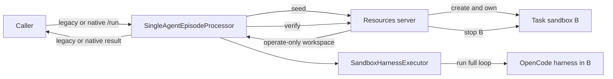

# Episode architecture branch guide

Status: orientation, 2026-09-10.

This branch contains the public Gym architecture RFC, a minimal alternative proposal, and a concrete analysis of the current sandboxed OpenCode integrations.

## The design in ten decisions

1. A Gym environment is a composition: task source, resources semantics, episode protocol, participant behavior, and runtime bindings have separate owners.
2. Every concrete episode processor is directly deployable as a server. There is no umbrella server that imports a selected processor implementation.
3. `BaseEpisodeProcessor.run()` supplies validation, admission, cancellation, cleanup, result finalization, and compatibility projection. A concrete processor supplies `process()`.
4. `SingleAgentEpisodeProcessor` is the first protocol, not a superclass or “standard” processor for user simulation and multi-agent work.
5. The MVP preserves current JSONL, `agent_ref`, `/run`, cookie affinity, and NeMo RL result behavior.
6. `AgentHarness` is a behavior contract. A trusted factory and executor decide whether the behavior runs locally, in a sandbox, or remotely.
7. The MVP defines only `FullLoopHarnessCall`. A separate `TurnHarnessCall` arrives with user simulation.
8. The first sandbox path keeps task sandbox B resources-server-owned. The executor borrows B and disconnects; only resources stops it.
9. Verifier submission transfer remains resources-server-internal. Bounded observations are response data. Caller-retained artifacts are deferred.
10. Task routing, turn execution, multi-agent protocols, restart safety, checkpointing, and artifact retention are staged extensions rather than foundation types.

## MVP control flow

The resources server chooses and prepares B. The seed response returns only a serialized `SandboxWorkspace`, not a live runtime or harness configuration. The processor chooses the harness deployment. The executor connects as a borrower, runs the full loop, and disconnects. Resources extracts or inspects final state, verifies, and destroys B.

## What is defined now

- `EpisodeRequest`
- minimal in-memory `EpisodeContext`
- `EpisodeResult`
- `BaseEpisodeProcessor`
- `SingleAgentEpisodeProcessor`
- `AgentHarness`
- `FullLoopHarnessCall`
- `HarnessResult`
- trusted harness factory registry
- `SandboxHarnessExecutor`
- resources-owned `SandboxWorkspace`
- exact legacy translation and result projection

## What is deliberately later

1. Remaining sandbox benchmark migrations.
2. Processor-owned B and `/sandbox_spec`.
3. Evolution of `EnvironmentManifest`, then `TaskSet` and native routing.
4. `TurnHarnessCall`, chronological visibility records, and a policy-plus-simulated-user processor.
5. Additional multi-agent protocols based on concrete requirements.
6. Shared attempt claims and stale-writer fencing.
7. Coordinated checkpoint parking and restoration.
8. Caller-retained artifact storage.

`EnvironmentProfile`, a generic participant scheduler, a combined turn/full-loop call, and generic artifact payloads are not required to stand up the MVP.

## Differences from the public RFC

- The proposal makes every concrete processor a server rather than using one configurable processor host.
- The framework owns a neutral execution envelope but not a universal seed → harness → verify protocol.
- Participant bindings live on concrete processor configuration.
- Harness behavior is separate from deployment and runtime.
- Sandbox ownership follows creation; it is not always assigned to the processor.
- Full-loop and turn APIs are distinct.
- The existing `EnvironmentManifest` evolves before a new metadata system is considered.
- Reliability and checkpoint contracts are added only with the backing shared systems.

## Implementation workstreams

Three teams can proceed after the foundation contracts are accepted:

1. Processor server and lifecycle scopes.
2. Harness factory, executor, and sandbox bridge.
3. Legacy behavior and NeMo RL compatibility characterization.

Their first shared gate is one real OpenCode plus SWE-bench rollout with equivalent output and reward behavior, correct cancellation, and no leaked or double-stopped task sandbox.

## Reading order

1. `episode-orchestration-design.md` for the normative proposal. Read sections 1–6 for the MVP, then section 7 for staged extensions.
2. `design-questions.md` for rationale, pushback, and unresolved implementation choices.
3. `opencode-sandboxed-pairings.md` for the current behavior of OpenCode with SWE-bench, DeepSWE, SWE-bench Pro, and Terminal Bench 2.1.
4. `rfcs/gym-architecture.md` for the public RFC being reviewed.

## File map

- `rfcs/gym-architecture.md`: sanitized public RFC snapshot at revision `6c57b803`.
- `investigations/episode-orchestration-design.md`: normative minimal architecture proposal.
- `investigations/episode-orchestration-design.html`: rendered standalone view of the proposal.
- `investigations/design-questions.md`: reviewer decisions, objections, and open questions.
- `investigations/opencode-sandboxed-pairings.md`: current implementation evidence.
- `investigations/episode-orchestration-overview.md`: this guide.
