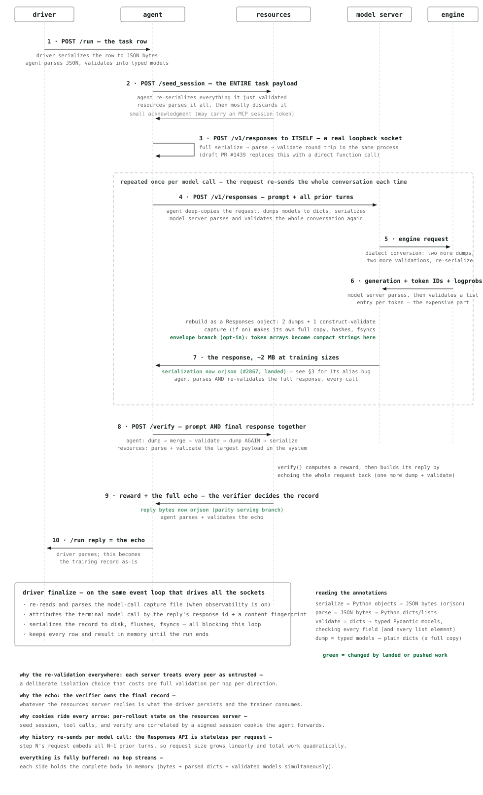
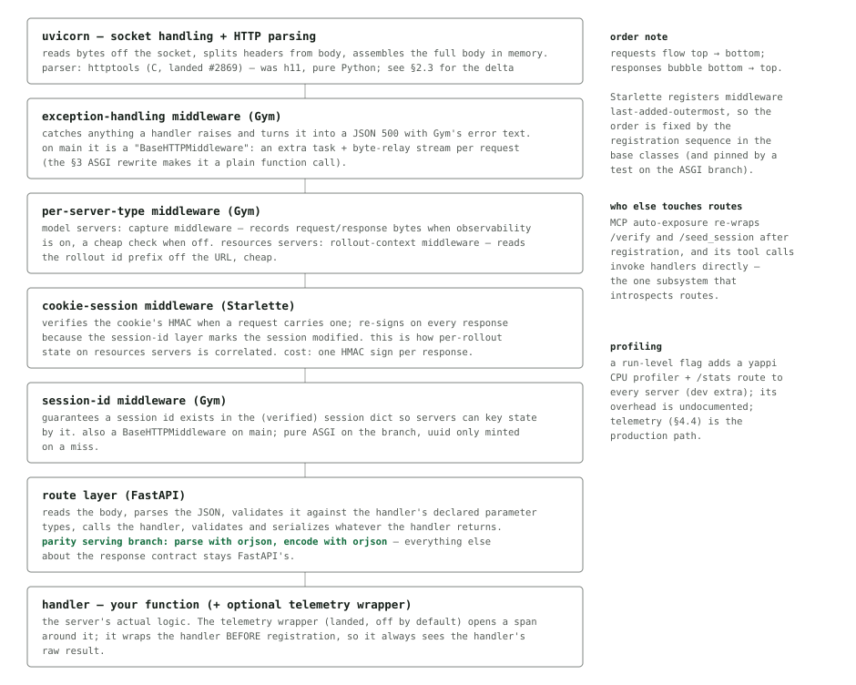

# Gym and Performance

NeMo Gym engineering report. 2026-08-31, upstream/main @ 6992a96de. Rigs: loopback
micro-benchmarks, full-rollout simulation, slurm-cpu harness (96-core Xeon).

Revision 2026-09-02: after the `code_gen` row was found to describe a Ray task
as local processes, every code-read claim in this report was re-audited by
tracing call sites and execution context on the same head. The corrections are
in §2.2, §2.4, §2.5, §3, §4, and §5; the measured tables were not affected.

How a rollout moves through Gym's servers, what one server actually does with a
request, where the time goes, and where the optimization opportunities are — in
the base classes, in resources servers, and in agent servers. Everything
quantitative here was executed, not estimated.

1. [The Gym server stack, in detail](#1-the-gym-server-stack-in-detail)
2. [Inside one server: what happens to a request](#2-inside-one-server-what-happens-to-a-request)
3. [Opportunities for optimization in the server stack](#3-opportunities-for-optimization-in-the-server-stack)
4. [Opportunities for optimization in resources server implementations](#4-opportunities-for-optimization-in-resources-server-implementations)
5. [Opportunities for optimization in agent server implementations](#5-opportunities-for-optimization-in-agent-server-implementations)

## 1. The Gym server stack, in detail

Gym runs an environment as a set of cooperating **server processes** that talk
to each other over HTTP. A training or evaluation run has four kinds of
participant:

- **The driver** — rollout collection. It lives inside the trainer (NeMo RL) or
  the `gym eval` CLI, sends one task at a time to an agent server, and persists
  what comes back as the training record.
- **The agent server** — owns the rollout loop: seeds the environment, calls the
  model as many times as the task needs, runs tools, and finally asks the
  resources server to score the result.
- **The model server** — a proxy in front of the inference engine (vLLM, or a
  hosted provider). It converts between API dialects and attaches token IDs and
  log-probabilities for training.
- **The resources server** — the environment itself: tools the agent can call,
  per-task state, and the verifier that turns a finished rollout into a reward.

Every arrow in the figure below is a real TCP connection carrying JSON. That is
the fact this whole report turns on: each crossing means the sender turns Python
objects into JSON bytes, and the receiver reads the whole body into memory,
parses it back into Python objects, and then validates those objects into typed
models — three passes over the same data on each side of each hop.

*Figure 1. One rollout with one model call: ten socket crossings, about ten full
validations, and about eight full serialize/parse passes of the large payload
before anything reaches training. Green marks where landed or pushed work
changed the mechanism.*

### 1.1 What is actually in the payload

At training sizes the interesting object is the model response. A 64K-token
generation with token IDs and full-precision log-probabilities is about
**1.97 MB** of JSON, and the two numeric arrays are almost all of it:

| Part of a 64K-token response | Bytes | Note |
|---|---:|---|
| generation log-probabilities (64K floats) | 1.27 MB | 64% of the body; a float32 binary envelope is 3.6× smaller |
| generation token IDs (64K ints) | 0.41 MB | int32 envelope is 1.2× smaller |
| text + everything else | 0.26 MB | what a hop costs to process *without* the arrays: 0.22 ms vs 18.2 ms with them |
| 1M-context turn that echoes prompt token IDs | 7.14 MB | 136 ms per hop — the shape long-context training will produce |

So "the token arrays are ~87% of the bytes and ~99% of the per-hop CPU" is the
single sentence that explains most of the numbers in this report.

### 1.2 Measured ceilings of the stack as a whole

| Measurement | Result | Where |
|---|---:|---|
| One driver event loop consuming 64K-token rollouts | 13–15 rollouts/s | slurm-cpu harness, constant from 256 to 131,072 offered concurrency |
| Per-loop JSON byte ceiling | 22–27 MB/s | flat across body sizes from 0.4 MB to 27 MB |
| Agent fan-out knee behind one shared model producer | N ≈ 4 | past it, extra agents deepen queues without adding throughput |
| Per-hop floor for a tool call, and the cost at depth 512 | 8 ms → 181 ms | conversation re-accumulation makes total rollout work quadratic in hops |
| Offered concurrency of 131,072 on one host | 0 failures | the consumer throttles; offered ≠ resident. The system slows, it does not break |
| Bookkeeping cost of 131,072 in-flight tasks on one loop | 17.6K completions/s, 184 MB | asyncio itself is not the bottleneck at today's payload costs |
| Ray boundary per 8,192-rollout step | 9.3 GB / direction | every result is pickled through the object store and retained |

### 1.3 Assumptions the stack makes

| Assumption | Kind | What it means for optimization |
|---|---|---|
| Every server distrusts every peer: ingress always re-validates | explicit design | ~10 full validations per rollout; making each cheaper is an optimization, removing one is a trust-model change |
| The verify echo *is* the rollout record, and the verifier may rewrite it | implicit, load-bearing | slimming the echo needs the agent to re-attach its own copy and an explicit patch channel; terminal model-call attribution reads this record's id and content |
| Session cookies round-trip through the agent to correlate per-rollout state | explicit | the cookie layer cannot go; the self-call removal (#1439) must thread cookies by hand |
| Capture and token-id recording observe values before any wire encoding | explicit contract | the envelope encodes only after `capture_tokens` |
| Handlers' return annotations drive OpenAPI, serialization, aliases, and field filtering | explicit in FastAPI, implicit in Gym | bypassing FastAPI's response path breaks these — the lesson of §3.3 |
| Config is immutable after startup | explicit since #1404 | per-request config reads are bugs |
| JSON is the only wire encoding; bodies are fully buffered, never streamed | implicit | every optimization makes a stage cheaper; only streaming would remove one |
| There is no admission control anywhere in the stack | implicit | uvicorn accepts everything; the only backpressure is the caller's connection pool and the engine's queue — bound in-flight at the driver |

## 2. Inside one server: what happens to a request

Every Gym server — agent, model, resources — is the same kind of program: a
Python process that listens on a network port and runs your handler function
when a request arrives. Between the port and your function sit several layers of
library code. If you have never met these libraries, here is what each one is
for:

- **uvicorn** — The program that owns the network socket. It accepts
  connections, speaks the HTTP protocol (splitting a byte stream into "headers"
  and "body"), and hands each request to the application as a plain Python data
  structure. It runs a single *event loop* per process (more on that below) and
  can be told to fork N worker processes.
- **uvloop** — A faster implementation of that event loop, written in C. Gym
  uses it automatically.
- **h11 / httptools** — Two interchangeable HTTP *parsers* uvicorn can use. h11
  is pure Python; httptools is a C library (the same one Node.js uses). Gym now
  uses httptools (#2869). §2.3 shows what that bought.
- **Starlette** — The web toolkit: it provides the *middleware* concept (layers
  that wrap every request, e.g. to verify a cookie), the *router* (which handler
  serves which path), and the `Request` object handlers read from.
- **FastAPI** — Built on Starlette. Its job is to map a request onto a typed
  Python function: read the body, validate it into the parameter types your
  function declares, call it, and turn what it returns into an HTTP response —
  including validating the return value against the declared return type.
- **Pydantic** — The type-validation library FastAPI uses. "Validate" means:
  take untyped dicts and lists and check every field and every list element
  against a declared model, producing typed objects. This is where Gym's
  request-path CPU goes.
- **orjson** — A fast JSON encoder/decoder written in Rust. Gym uses it for
  every outbound request; the serving-side work in §3 is about using it for
  responses without losing FastAPI's guarantees.

### 2.1 The layers a request passes through

*Figure 2. The layers inside every Gym server process, network at the top, your
handler at the bottom. Each middleware wraps everything below it, so a request
descends through all of them and its response climbs back up.*

### 2.2 Stage by stage, with what it costs

Code-read from the installed sources: uvicorn 0.37.0 (uvloop + httptools),
Starlette 1.3.1, FastAPI 0.135.2. "Body" means the 2 MB training-shaped payload.

| Stage | What happens | Cost and what it allocates |
|---|---|---|
| 1 · accept | uvicorn's listening socket accepts a connection and creates one protocol object for it; the connection is reused for many requests by the caller's pool. uvicorn never refuses work (`limit_concurrency` unset), and by default wraps the app in a proxy-headers layer that parses `x-forwarded-*` headers. | Amortized; connections are long-lived. No server-side admission control exists at all. |
| 2 · read + parse HTTP | Bytes arrive from the socket; the parser splits the request line and headers, builds a plain-dict description of the request (the ASGI *scope*), and creates **one asyncio task per request**. Body bytes are appended to a buffer; after 64 KB accumulates unread, uvicorn pauses the socket until the app consumes what is there. | A 2 MB body arrives through ~32 pause/resume windows, each an event-loop round trip. With h11 the body was copied through a pure-Python buffer first; httptools delivers it from C. |
| 3 · middleware descent | Starlette calls the outermost middleware, which calls the next, down to the router: server-error guard → Gym's exception middleware → the per-server-type layer → cookie-session (HMAC verify) → session-id → Starlette's HTTPException handler → router. | A `BaseHTTPMiddleware` costs a task group, a memory-stream pair, and a byte relay per request (~15–20% of a big-body hop, ~45% of a small one); a pure-ASGI layer costs a function call. |
| 4 · routing | The router tries each registered path pattern in order until one matches. | 5–10 routes per Gym server; negligible. |
| 5 · read body + parse JSON | FastAPI collects the body chunks into one bytes object, then parses the JSON into Python dicts and lists. | Second copy of the bytes plus the parsed object graph. Parse at 2 MB: stdlib 14.5 ms, orjson 3.9 ms. |
| 6 · validate parameters | FastAPI matches the parsed body to the handler's declared parameter type and runs Pydantic validation over the entire graph — every field, every list element. | The dominant Pydantic cost; the unions rework (§3) takes per-item cost from 41.9 to 2.3 µs. A handler declaring `body: dict` skips this and validates explicitly inside. |
| 7 · call the handler | An `async def` handler runs on the event loop; a plain `def` handler is sent to a thread pool (§2.4). Gym's wrappers run here: telemetry (a cheap enabled-check when off), `judge_failsafe` on `/verify`, rollout-context on `/run`. | Whatever your handler does. Anything CPU-bound done inline here stalls every other request on this worker. |
| 8 · build the response | If the handler returned a ready `Response`, it passes through. Otherwise FastAPI validates the return value against the declared return type (an instance of exactly that class passes through untouched; a subclass instance is filtered to the declared fields), serializes it — by alias, honoring custom serializers and include/exclude options — and encodes the bytes with the route's response class. Un-annotated handlers go through a slow generic Python walk instead. | Stock encoding is stdlib `json.dumps`: 24 ms at 2 MB. The parity branch swaps only the encoder to orjson. |
| 9 · send | Headers go first, then one write of the whole body; the cookie middleware re-signs the session and adds `Set-Cookie` on the way out. uvicorn writes into the socket buffer and pauses if it fills. | One copy into the kernel. Nothing streams: the full body exists before the first byte leaves. |
| 10 · failures | A body that fails validation returns 422 — after Gym's handler **pretty-prints the entire request body to stdout**; when the body is not JSON, that print itself raises and the 422 becomes a 500. Unhandled exceptions become JSON 500s with the exception text. | A 2 MB pretty-print per failed validation: harmless in dev, self-inflicted load in a schema-mismatch storm at 8K in flight. |

Two things fall out of laying it end to end. The payload is materialized **four
times per hop** (socket bytes, joined bytes, parsed dicts, validated models), and
no path through the stack avoids that without streaming. And there is **no
admission control anywhere**; uvicorn accepts everything and FastAPI queues
nothing, so the only backpressure is the caller's connection pool (§2.5) and the
engine's scheduler. That is a defensible design — a server-side 503 would
surface as a failed rollout — but it means bounded in-flight must be enforced at
the driver.

### 2.3 The HTTP parser: h11 versus httptools

Gym now parses HTTP with httptools (#2869). The difference, measured on a
loopback echo server with the production middleware stack, one uvicorn worker:

| Cell | h11 (pure Python) | httptools (C) | Delta |
|---|---:|---:|---:|
| 28 KB body, concurrency 1 | 1,813 req/s | 2,139 req/s | +18% |
| 28 KB body, concurrency 32 | 3,294 req/s | 4,580 req/s | +39% |
| 1.97 MB body, concurrency 1 | 111 req/s | 115 req/s | +3% |
| 1.97 MB body, concurrency 32 | 116 req/s | 121 req/s | +4% |

The shape is the important part: parsing is header-dominated work, so the parser
matters most for small, frequent requests (tool calls, acknowledgments) and
least for the large bodies where JSON and validation dominate. In the real model
server the parser was a rounding error until the serialization fix landed —
+1–4% alone, +5–11% after — which is why it is the right complement to the
serialization work rather than a lever on its own.

### 2.4 Where work runs: the event loop, the thread pools, and processes

A server process runs **one event loop on one thread**. The loop runs many
coroutines by turns: when a handler *awaits* something that takes time outside
Python — a socket read, a response from another server — it yields, and the loop
runs someone else's coroutine in the meantime. That is why one process can hold
thousands of rollouts in flight: most of them are waiting on the network, which
costs the loop nothing. The flip side is the rule that decides most of §4:
**any CPU work done inline in a handler runs on that one thread and stalls every
other request on the worker until it finishes.** Handing work to a thread pool
is the escape hatch, and there are two pools with two ceilings:

*Figure 3. Work inside one worker process. Coroutines that await the network
are free; anything CPU-bound holds the single loop thread and serializes
everyone else. Thread pools restore the loop's responsiveness but have small
fixed sizes and share the GIL; only processes add CPU throughput for Python
work.*

Three consequences worth stating plainly. First, no request-path handler on
Gym's three base classes is a plain `def` (the only sync handlers in the tree
are the profiling-only `/stats`, the head server's instance list, and
`harbor_agent`'s in-container `/exec`), so the 40-slot pool is idle — but 16
resources servers offload request-path work to the *other* pool (8 through
`asyncio.to_thread`, 8 through `run_in_executor(None, …)`), as do 10 agent
harnesses and `vllm_model`: 32 threads on a 96-core node, shared — whenever
observability or token capture is on — with the flock, write, and fsync that
capture performs per captured model call. Second, "offload to a thread" is the right fix for I/O-bound or
GIL-releasing work (subprocess waits, C-implemented regex, RDKit, file writes)
and only half a fix for pure-Python CPU work like SymPy or NLTK: the loop stops
stalling, throughput does not rise. Third, the structural answer for CPU-heavy
verification is a base-class process pool or multiple uvicorn workers — and both
are blocked today by details §4.2 lists.

### 2.5 Talking to other servers: the connection pool

Each process owns one HTTP client with a **connection pool**: open TCP sockets
to other servers, reused across requests instead of dialing a new connection
each time. Two numbers shape it: `limit` (total sockets the process holds) and
`limit_per_host` (sockets to any single destination). **When every allowed
socket to a destination is busy, additional requests do not fail — they wait
silently inside the client** for a socket to free up. No error, no log line; the
wait shows up as latency indistinguishable from a slow backend. That is what
makes undersized limits dangerous at scale.

Idle sockets close after 15 s client-side, deliberately below the 30 s
server-side timeout so the client never reuses a socket the server just closed
(the production connection-reset fix). A server with `num_workers: N` runs N
processes with N pools, so Gym divides the configured limits by N: the
configured number is the aggregate across the workers, protecting the
destination and the node's file-descriptor and port supply (each socket is one
descriptor; sockets to the same destination need distinct local ports, ~28K
usable by default).

| Client → destination | Shape | Sizing rule (per-worker share = value ÷ num_workers) |
|---|---|---|
| driver → agent | all rollouts funnel to one host:port | `limit_per_host ≥` intended in-flight (8,192 at Lightning scale → 16,384 for headroom) |
| agent → model server | all model calls to one host:port (workers share the port) | same rule on the agent |
| model proxy → engines | spread over K engine hosts | the *total* limit binds, and it is divided by `num_workers`: a 4,096 total across 16 workers is 256 per worker, so ~512 engine calls in flight per worker queue 2:1 inside the client. Those figures are from the Lightning recipe on the NeMo RL side, not a config in this tree; here, the nemotron_3.5_super configs run `vllm_model` with 16 workers |
| agent → resources | one verify + tool calls per rollout | per-host ≥ in-flight rollouts; verifies bunch at step end |

> **Rule of thumb:** the limits are a destination-protection and descriptor
> budget, not a performance knob. Size them above intended in-flight so they
> never engage in normal operation, and let queueing happen at the backend where
> you can see it.

## 3. Opportunities for optimization in the server stack

Everything in this section lives in `nemo_gym/` — the base classes every server
inherits — so a change lands once and applies to all 173 servers (118 resources,
45 agents, 10 models).

### 3.1 What has been done, with measured results

The end-to-end rig is a full rollout — driver → the real `simple_agent` → a
synthetic model server → a real echo verifier — at 2 MB training bodies.
Baseline before any of this work: 7.4 rollouts/s at concurrency 1, 9.6 at
concurrency 32.

| Change | Status | Measured |
|---|---|---|
| Model-server response encoding with orjson (#2867) | **landed** — with a wire-format bug, see §3.3 | the model-server hop: 8.1 → 157 responses/s per worker (19×); p50 at c=32 3.9 s → 199 ms |
| httptools parser (#2869) | **landed** | §2.3: +18–39% on small bodies, +3–4% on large; +5–11% in situ once serialization was fixed |
| workplace_assistant session release (#2886) | **landed** | closes a confirmed unbounded-memory leak |
| App-wide orjson serving with full FastAPI parity (`agent-verify-orjson-dispatch`) | **pushed** | e2e +27% big-body (7.5 → 9.5 rollouts/s; p50 133 → 105 ms); agent/resources hop 22 → 45 req/s |
| Token-metadata envelope, opt-in | **rewritten by maintainer** | hop 18.7 → 0.61 ms (31×); body 1.97 → 0.98 MB; **e2e 7.4 → 38.5 (c=1), 9.6 → 78.7 (c=32)** |
| Discriminated item unions | **rewritten by maintainer** | 41.9 → 2.3 µs per item (18×); e2e +32% at c=1; 611-case parity matrix plus a 2,631-item real-data differential with zero divergences |
| Pure-ASGI session and exception middlewares | **rewritten by maintainer** | e2e +23–35% at small bodies; big-body c=1 within noise |
| Alias fix for #2867 (`orjson-dispatch-fallback`) | **pushed** | correctness, see §3.3 |

The composition rules that later work must respect: new middleware must be pure
ASGI and registered in MCP's recognition list; new union members need a `Tag`,
and a colliding `type` literal needs discriminator awareness; the envelope
encodes only after capture. The former "unwrap marker" rule from the abandoned
wrapper design no longer exists.

### 3.2 The serialization ledger — what is still done twice

Every conversion of the large payload in one rollout with one model call.
"dump" = typed model → plain dict (a full copy).

| # | Where | Operation | Status |
|---:|---|---|---|
| 1 | driver egress | serialize row | necessary |
| 2 | agent `/run` ingress | parse → validate | parse: **orjson** (parity branch) · validate: **unions** branch |
| 3 | agent → seed_session | **dump the entire validated body + serialize**; the base receiver declares no fields and discards it, and 17 servers override `seed_session` to read parts of it | **open** — needs a declare-what-you-need contract (§4.2) |
| 4 | agent self-call | dump + serialize + parse + validate, same process | **open** — revive draft #1439 (§5.2) |
| 5 | agent, per model call | `model_copy(deep=True)` of the whole request, then a copy-with-update per step | **open — near-trivial** |
| 6 | agent → model, model ingress | dump + serialize → parse + validate the whole conversation, per step | cheapened by **orjson + unions**; the re-send is the Responses API's statelessness |
| 7 | model server, dialect conversion | dump → rebuild → **validate-on-construct into the chat-params model**, then `chat_completions` dumps it again for the engine; reply: per-item dumps + message re-validation + construct-validate of the `NeMoGymResponse` | **open — near-trivial** |
| 8 | model server, engine reply | parse + validate every token id and logprob | stays: the trust boundary where token data enters |
| 9 | capture (only with observability or token capture on) | one more full dump + per-element validation + canonical dump + hash, then flock + write + fsync on the default executor; the response's terminal chunk waits for the fsync | **open** — share the dump; batch the fsyncs |
| 10 | model server egress | dump(json, by alias) + orjson | **landed** #2867 (+ alias fix); arrays collapse under the envelope |
| 11 | agent, per model reply | parse + **full re-validation** | stays (trust model); cheap under unions + envelope |
| 12 | agent → verify | **dump → merge → validate → dump again** → serialize | **open — trivial** — build the merged dict once (§5.2) |
| 13 | resources ingress | parse + validate prompt+response | stays; cheapened |
| 14 | resources, building the echo | `VerifyResponse(**body.model_dump(), …)` — dump + construct-validate of data validated microseconds ago; 18 servers use this exact pattern | **open** — a base helper, or solved wholesale by echo slimming |
| 15 | resources egress → agent → driver | serialize → parse+validate → serialize → parse | encoding: **parity branch**; the double-carry is the echo design |

### 3.3 A cautionary case: the response contract, and how #2867 broke it

Returning a pre-built `Response` from a handler is fast because FastAPI passes
it through untouched — which also means FastAPI's whole response contract is
skipped: validation of the return value against the declared type, filtering of
subclass-only fields, **aliases**, custom serializers, include/exclude options,
declared and handler-selected status codes, headers and cookies set through an
injected `Response`, background tasks, and OpenAPI schemas. A first version of
the app-wide serving work reimplemented a subset of that and was rightly
rejected; the pushed branch keeps FastAPI's entire pipeline and swaps only the
final bytes encoder (plus orjson request parsing), at identical end-to-end
throughput.

The landed #2867 has exactly this class of bug, live on main today. FastAPI's
encoders serialize `by_alias=True`; `model_dump(mode="json")` defaults to
`by_alias=False`. Exactly one aliased field is reachable from the response
models — `text.format.schema_`, whose wire name is `"schema"`, with
`populate_by_name` off — so a served structured-output response now carries
`schema_`, and the agent's per-step revalidation *rejects it* with a
`ValidationError`. Gym's own vLLM converter never sets `text.format` (only
`text.verbosity`), so **the vLLM training path is unaffected**; three
provider-backed model servers (`openai_model`, `litellm_model`,
`switchyard_model`), and `vllm_model` in `is_responses_native` mode (four
`local_vllm_model` gpt-oss configs; that mode refuses token-id capture, so it is
never a training path), forward the request's `text` config, the provider echoes
it, and **every structured-output rollout through them fails**.
`azure_openai_model` and `inference_provider` are outside this bug: their
converter rejects `text.format` with `NotImplementedError` before any provider
call, so structured-output requests through them already fail for a different
reason. The fix is one argument (`by_alias=True`) plus a
regression test — `ananthsub/orjson-dispatch-fallback`, rebased onto the current
head and ready. A fallback encoder was tried alongside it and removed: after
`mode="json"` normalization the only value orjson rejects that stdlib served is
an integer beyond 64 bits, lone surrogates already failed the stock render, and
Gym's egress has always been orjson with no fallback — so the contract is simply
JSON-native content, with a `NEMO_GYM_DISABLE_ORJSON_SERIALIZATION=1` kill
switch for operators.

### 3.4 What is still open in the base classes, by stage

| Stage | Opportunity | Tradeoff |
|---|---|---|
| accept | `proxy_headers=False` for internal-only servers: one fewer layer per request | none for internal traffic |
| middleware | a repo test forbidding new `@app.middleware("http")` registrations — the silent path back to per-request task groups | middleware authors write raw ASGI |
| validation | the trust model: every hop revalidates because every peer is untrusted | removing any one validation is a policy decision, not an optimization |
| handler | ledger #5, #7, #12: the near-trivial duplicate dumps and re-validations | none; ~5–20 lines each |
| response | token metadata out of the response entirely on the NeMo RL path (capture store → TokenSource → actor-side rebuild; the machinery exists, the config plumbing does not); the envelope for every other framework | token fields stop being readable in artifacts when the envelope is on; readers need the decode helper |
| failures | **cap the 422 handler's body print** to a bounded prefix and the size, and make it tolerate non-JSON bodies (today the print raises and the 422 becomes a 500) | none; do it before any high-concurrency run |
| client | the shared aiohttp session has an all-`None` `ClientTimeout`, and internal calls retry every exception forever, so a hung judge or GenRM generation never returns and `judge_failsafe` never fires; a default deadline and a retry cap on `ServerClient` would bound every such call at once | a deadline turns a hung call into a failed row, which the failsafe already handles; long verifier generations need a generous default |
| driver | bounded task admission (all 128K tasks are created up front today), stream results to disk instead of retaining every row and result, move the capture-file parse and fsync off the loop | `run_from_config`'s in-memory return shape is the compat surface |
| leave alone | `limit_concurrency` (a 503 becomes a failed rollout); the 64 KB read window (a uvicorn constant, dwarfed by later stages); the cookie-session layer (it is the correlation mechanism) | — |

## 4. Opportunities for optimization in resources server implementations

All 118 resources servers were audited; the Nemotron 3.5 Lightning set of 30 in
depth. Every finding below is code-read and was re-traced from the `/verify`
handler down to the code in question, noting where it executes (inline on the
loop, a thread pool, a subprocess, or a Ray task). The base-class fixes are
hypotheses to confirm on cluster, since a single development machine cannot run
all 30 servers' dependencies.

### 4.1 The heavy hitters

| Server | Finding | Fix |
|---|---|---|
| `math_with_judge` | forks the server process per verify, synchronously on the loop thread, behind a semaphore of 32 (the code default; no shipped config changes it) with a 50 ms poll — so the library stage tops out near 640 verify/s per process (≥12.8 s per 8,192-rollout step) while SymPy runs in the child; up to two sequential judge calls with no timeout and no bound beyond the client's per-host connection limit | warm process pool, event-driven join, expose the concurrency knob; judge semaphore + timeout |
| `genrm_compare` | re-dumps every buffered cohort response on each arrival (136 full dumps per 16-rollout cohort); holds each whole parsed request, its raw bytes, and the dumped dicts until the cohort resolves; **bug:** the cohort finalizes on the 16th *arrival* rather than when every comparison has returned, so a comparison still in flight is silently dropped from rewards (the declared lock is unused, and acquiring it would not fix this); cohort state is module-global, so `num_workers` would split cohorts; GenRM transport failures are swallowed into default scores | dump once at append; buffer extracts only; gate finalization on comparisons-done |
| `code_gen` | verification is a Ray task (SPREAD across the cluster), so the server holds only a semaphore (`num_processes`, 8 in the shipped config) around an awaited future and does no local execution; inside each Ray task a `multiprocessing.Manager` helper and a runner process are spawned per verify, with a join backstop of `(timeout + 1) × tests + 5` s; the tests are re-serialized and re-parsed on the way to the runner | nothing here touches the server's event loop; raise `num_processes` in production configs (it is the in-flight cap); on the Ray side, a Pipe instead of a Manager and a capped backstop |
| `nvarc` | **bug** (inductive mode): one fresh interpreter per verify with no bound; the in-child alarm covers only `transform()`, so a hang in module-level code outlives the 35 s outer timeout, which is swallowed without killing or reaping the child | semaphore + `finally: kill` + `await proc.wait()` |
| rule-based tier (`mcqa`, `ether0`, `equivalence_rule`, `instruction_following`, `structured_outputs`, `reasoning_gym`) | synchronous CPU work directly on the event loop, with no offload in any of the six: third-party checkers (NLTK-backed) in `instruction_following`, data-driven `re.findall` in `mcqa`, `SequenceMatcher` in `equivalence_rule` only under grading rules no shipped config uses; the one quadratic pattern found is the `<think>` stripping regex in `inverse_if` and `multichallenge` (34.5 s on a degenerate 240 KB input, 5.7 ms on a normal one) | bound input sizes before matching, precompile, offload — but see §2.4 for what offloading does and does not buy |
| judge callers (`inverse_if`, `multichallenge`, `jailbreak_detection`, …) | `inverse_if` and `multichallenge` gather one judge call per rubric item with no semaphore and no timeout — 3–10 items per task, so up to ~80K judge generations from one 8,192-rollout step; `jailbreak_detection` uses its own client that swallows errors and makes its safety and quality calls sequentially | shared semaphore + timeout (`arena` and `finance_agent_v2` are the two servers that already have both); `gather` the independent calls |
| `terminus_judge` | sanitizes both halves of the rollout per verify (dump → recursive walk over every token-id element and every string → re-validate) inline on the loop; the shipped configs set judge concurrency to `null`, overriding the code default of 64 to unbounded | scrub only the fields that reach the judge prompt; restore a concurrency bound |

### 4.2 The recurring patterns are base-class gaps

| Recurring finding | What is structurally missing |
|---|---|
| Unbounded, timeout-less judge calls in at least six servers; seven more have a semaphore but no timeout | `judge.py` has no concurrency or deadline knobs, and the shared client beneath it has no HTTP timeout at all and retries every exception forever for internal calls, so a hung judge never returns. A shared semaphore + timeout on `call_judge`, with config surface — one change, every caller inherits it; a default deadline on `ServerClient` covers the servers that bypass `call_judge`. |
| Sync CPU work on the loop in six+ verifiers; thread offload in 16 more | No offload policy, and threads are only half a fix (§2.4): 32 slots on a 96-core node, shared with capture's fsyncs when capture is on, and the GIL. CPU-heavy verification needs a base-class **process pool** (warm, recycling, with a deadline) or `num_workers`; a thread wrapper is right only for I/O-bound or GIL-releasing work. |
| Hand-rolled process management everywhere: one server forks a Python worker per verify (`math_with_judge`), four spawn a subprocess per verify in the server process (`bigcodebench`, `nvarc`, `vibench`, `scicode`), two keep a worker per session from a tool endpoint (`math_with_code`, `newton_bench`), and seven dispatch to Ray (`code_gen`, `evalplus`, `code_fim`, `swerl_gen`, `spider2_lite`, `wmt_translation`, `longmt_eval`) | No shared warm-pool utility with timeout, kill-and-reap, and recycling semantics. One vetted implementation would replace several fragile ones. |
| Session-state leaks (one confirmed OOM, since fixed; several near-misses) | No session lifecycle contract: `seed_session` creates state, nothing guarantees cleanup. A base-class hook — verify (or a TTL) evicts the session's state unless the server opts out — turns a silent leak class into a default. |
| Essentially every resources server is single-process | `num_workers` requires a per-file entrypoint guard that 9 of 173 app.py files carry (one resources server, four agents, four model servers); the 10 configs that set it above 1 all target those nine. Generate the guard in the scaffold, or let the runner import-and-serve without it. Stateful servers need the lifecycle hook above before multi-worker is safe; `genrm_compare`'s module-global cohort state blocks it outright. |
| Verify and seed receive everything and need little | No declare-what-you-need contract. A per-server field declaration would let the agent slim both hops without breaking the 17 servers that override `seed_session` to read parts of the body. (MCP's wrapper also re-parses the full seed body, but only to feed an allow-list hook no server implements, and only when `expose_tools_over_mcp` is on.) |

### 4.3 Serving-coverage exceptions found in the full catalog

169 of 173 servers inherit the base `setup_webserver` or call
`setup_session_middleware` before registering routes, so base-class serving
changes reach them automatically — including per-server tool endpoints the base
classes do not own (`conversational_tool_use_simulation`'s ten routes, the
search/browse servers' large page payloads, the `/reset`/`/step` pair of the six
gymnasium servers, `vllm_model_with_compaction`'s `/tokenize`, which is on the
rollout path only when the `max_total_tokens` guard is configured, and no
checked-in config sets it). The install-point exceptions are exactly three:
`harbor_agent` and `mini_swe_agent` build their apps without it, and
`legal_agent_bench`'s bridge inherits that. Two structural gaps sit next to
them: the six gymnasium servers build their app on a base that registers no
`/seed_session` or `/verify`, so base-class changes to those routes never reach
them; and the untyped `info: dict` those servers return will 500 on numpy ints
and bools — `grl_tetris` guards against it, `grl_sokoban` happens to emit only
Python scalars, and `openenv` passes an untyped `Any` tool result through a
dict, a latent hazard no bundled environment triggers today. The routes that
rely on the pass-through contract for ready `Response`s are the three
`PlainTextResponse` tool endpoints (`ns_tools`, `litmus_agent`, `citation_if`),
the SSE paths, the model servers' own non-streaming orjson `Response` (#2867),
`judge_failsafe`'s `JSONResponse` on `/verify`, and MCP's `/seed_session`
wrapper.

### 4.4 How to profile a resources server

The landed nemo-lens telemetry (#2647) is the right attribution layer: one
rollout produces one distributed trace across driver, agent, model, and
resources processes, with spans on exactly the hot endpoints and per-server
service names, so "which server, which endpoint, which hop dominates p50 and p99
under load" is a query. A specifically useful derived signal: the gap between an
outbound-client span and its child ingress span is connection-queue-plus-network
time, which makes the silent pool queueing of §2.5 visible. It costs ~nothing
when off and has sampled export for high concurrency. What it cannot do: it
measures wall time, not CPU — when a trace indicts `math_with_judge`, py-spy on
that process says fork-vs-SymPy-vs-await; a sync verifier blocking the loop
smears into *other requests'* spans, so add a per-process event-loop-lag gauge;
and tail-based sampling for straggler analysis is not built in. The loop:
telemetry-on harness run → rank servers by span self-time → py-spy the top three
→ fix → re-run.

## 5. Opportunities for optimization in agent server implementations

Of 45 agent servers, 39 inherit the base `setup_webserver` unchanged;
`simple_agent` is the production harness for the training configs, so its hot
loop is where the per-rollout cost concentrates. Agents are structurally
different from resources servers in one way that matters: **they hold no
per-rollout state of their own** — the rollout's state lives in the resources
server, correlated by the session cookie the agent forwards — which makes them
the easiest servers in the system to scale horizontally, and the least scaled
today.

### 5.1 The simple_agent hot loop, hop by hop

| Step in `run()` | What it costs today | Opportunity |
|---|---|---|
| ingress: `SimpleAgentRunRequest` validation | full validation of the task row | cheapened by unions; stays (trust model) |
| `/seed_session` with `body.model_dump()` | the entire task payload dumped, serialized, shipped, and parsed; the base receiver declares no fields and discards it (17 servers override `seed_session` to read parts of it) | send only what the resources server declares it needs — a base-class contract (§4.2), not an agent change alone |
| self-call `POST /v1/responses` to its own server | a real loopback socket: serialize, parse, validate, two middleware traversals, in the same process | draft PR #1439 replaces it with a direct call: +7.5% on `simple_agent`, +13.3% on `proof_refinement_agent` (which self-calls repeatedly); the open review question is cookie propagation, which today rides on the HTTP layer |
| `model_copy(deep=True)` at the top of every `/v1/responses` | a full deep copy of the request per call; the loop only appends to the input list | copy the list, not the world — audit for mutation first |
| per step: `model_copy(update=…)`, dump, serialize the whole conversation | request size grows linearly with steps; total work quadratically (§1.2: 8 ms per hop at depth 1, 181 ms at depth 512) | inherent to the stateless Responses API; the compaction agent variant is the existing mitigation for long trajectories |
| per step: `NeMoGymResponse.model_validate` on the model's reply | a full re-validation of a 2 MB response each step | stays (trust model); made cheap by unions and, when enabled, the envelope |
| verify request: `model_validate(body.model_dump() \| {…})` then `.model_dump()` | dump → merge → validate → dump again, on the largest payload in the system | **trivial:** build the merged dict once; the resources server validates it anyway. Two full dumps and one full validation saved per rollout in ~5 lines |
| `SimpleAgentVerifyResponse.model_validate(result)` and the typed `/run` reply | validate the echo, then serialize it back to the driver | encoding via the parity branch; the double-carry is the echo design |

### 5.2 Structural opportunities specific to agents

- **Scale agents out first.** Every rollout funnels through one agent process's
  event loop (~15 rollouts/s at training bodies per loop, §1.2), and the
  driver→agent hop is a single host:port. Because agents are stateless per
  request, `num_workers` on the agent is safe today with no lifecycle work — yet
  only four agents (`tau2`, `opencode_sandboxed_agent`,
  `terminus_2_sandboxed_agent`, `vibench_agent`) carry the entrypoint guard that
  makes it possible, and `simple_agent` is not one of them. Making that guard
  automatic (or unnecessary) is the
  cheapest capacity in the system, and the harness fan-out experiment (knee at
  N≈4 behind a shared producer) tells you where the next wall is.
- **The echo and the record.** The agent returns the verifier's echo verbatim as
  the training record, and terminal model-call attribution reads that record's
  response id and content. Any future slimming of the verify echo must have the
  agent re-attach its own copy of the response (it has one in hand) and give
  verifiers an explicit patch channel — otherwise token capture and NeMo RL both
  lose the response.
- **Envelope readiness.** Seven agent harnesses read token fields off model
  responses directly (`harbor_agent`, `terminus_2`, `hermes`, `verifiers`,
  `mini_swe_agent`, `swe_agents`, `simple_agent_with_compaction`); no resources
  server does. They need accept-both
  decoding before the envelope can be enabled underneath them; at the default
  setting they are unaffected.
- **Serving coverage.** `harbor_agent` and `mini_swe_agent` construct their apps
  without `setup_session_middleware`, so base-class serving installs (and, more
  importantly, the session layer that other components assume) never run for
  them; they also skip the rollout-context and telemetry wrappers, so their
  rollouts produce no spans. `mini_swe_agent_2` shows the corrected form for
  the session layer, though it too registers `run` bare.
- **Telemetry composes by construction.** The traced wrappers on `/run` and
  `/v1/responses` wrap handlers before registration, so they see raw results and
  cost a single enabled-check when off — no agent-side change needed to profile.
  The exceptions are the three agents above and `litmus_agent`, which
  re-registers `/verify` without the wrapper.

---

Benchmark rigs (session scratch, not in tree): `sim_rollout.py` (full rollout),
`bench_hop.py` / `bench_payload.py` / `bench_envelope.py` / `bench_multiitem.py`
(micro), `diff_unions_corpus.py` (real-data differential); slurm-cpu baselines
under `tools/scale_sim/findings/` on `ananthsub/scale-sim-reference`. Branches on
`github.com/ananthsub/Gym`: `orjson-dispatch-fallback` and
`agent-verify-orjson-dispatch` (this program's, on 6992a96de);
`token-metadata-envelope`, `discriminated-response-items`,
`pure-asgi-middleware` (the maintainer's rewrites).
