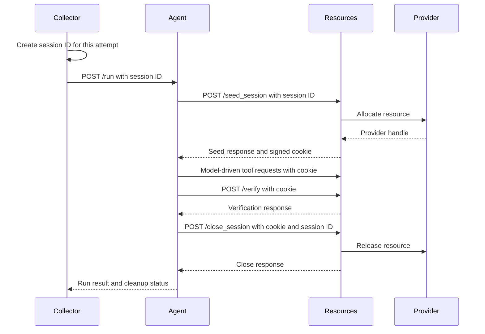

# Closing resources-server sessions in NeMo Gym

This document defines the proposed `POST /close_session` API and identifies the resources servers that need to adopt it. It does not prescribe a full implementation. The broader failure-handling work remains tracked in [issue #2750](https://github.com/NVIDIA-NeMo/Gym/issues/2750).

## The API closes resource ownership, not verification

A resources session may own a browser, sandbox, process, environment object, temporary workspace, cached document set, or other per-rollout state. Today, the common resources-server API creates that state through `/seed_session` but has no matching terminal operation. The base server exposes `/seed_session` and `/verify` as separate routes, and its seed request and response models carry no lifecycle identity ([base resources-server routes and models](https://github.com/NVIDIA-NeMo/Gym/blob/9c83472a0cd2c7fa675857322ffc8c7f1655179e/nemo_gym/base_resources_server.py#L128-L190)).

The proposed lifecycle is:

```text
seed_session → model and tool work → verify when applicable → close_session
```

`/verify` computes a score. `/close_session` releases resources. They need separate request and response models because cleanup may run when verification fails, is skipped, or never starts. Reverification also calls `/verify` without owning a live resources session, so verification cannot be the generic cleanup boundary ([reverification posts saved rows directly to `/verify`](https://github.com/NVIDIA-NeMo/Gym/blob/9c83472a0cd2c7fa675857322ffc8c7f1655179e/nemo_gym/rollout_reverification.py#L479-L505)).

## Three identifiers describe different things

- **Rollout ID** identifies the logical rollout and its persisted or traced result.
- **Session ID** identifies one resources allocation for one rollout attempt. A later rollout attempt gets a new session ID even when it keeps the same rollout ID.
- **Provider handle** identifies a browser, container, sandbox, or other backend object. It is environment-specific and may be returned as `env_session_id` for diagnostics.

The session ID must not be derived from the rollout ID or replaced by the provider handle. A provider handle is learned from the seed response, so it cannot help when the server allocates the resource but the response is lost.

## The caller creates the session ID and close capability before seeding

The caller creates a high-entropy `_ng_session_id` before the first `/seed_session` transmission. It also creates a separate random close capability, `_ng_session_close_token`. Both values remain stable when the transport repeats that same seed operation. An intentional new rollout attempt creates new values.

The resources server binds `_ng_session_id` to the signed session cookie used for normal tool and verification traffic. Current middleware creates `request.session["session_id"]` and returns it in a signed cookie ([session middleware](https://github.com/NVIDIA-NeMo/Gym/blob/9c83472a0cd2c7fa675857322ffc8c7f1655179e/nemo_gym/server_utils.py#L859-L884)). The new seed path should use the caller-created value when supplied and preserve middleware-generated identity for older callers.

The server stores only a cryptographic digest of `_ng_session_close_token`. The token is a recovery credential for the narrow case in which seeding may have succeeded but the response cookie was lost. It must not appear in logs, persisted rollout rows, error bodies, or telemetry. A deployment-authenticated service identity can provide an additional authorization boundary, but the public body must never let an arbitrary session ID override a different valid cookie.

The server must deduplicate `/seed_session` by `_ng_session_id` before the transport can safely replay a possibly delivered seed request:

- The first seed stores a digest of the seed payload and the serialized seed response.
- The same ID and payload return the stored response without allocating again.
- The same ID with a different payload returns HTTP 409.
- A closed ID remains as a bounded tombstone long enough that a delayed seed transmission cannot recreate the resource.

This seed behavior is a prerequisite for lost-response recovery. Adding `/close_session` alone still leaves a resource unaddressable when the seed response and its cookie are lost.

## The close request identifies the session and explains why work ended

The request body is independent of `BaseVerifyRequest`:

```json
{
  "_ng_session_id": "018f6e8d-8ad7-7a11-a4c9-64c44f94d831",
  "_ng_session_close_token": "base64url-encoded-random-secret",
  "reason": "completed"
}
```

`reason` is limited to `completed`, `failed`, `cancelled`, `timed_out`, `abandoned`, `expired`, or `shutdown`. It is diagnostic metadata. It must not change whether the resource is released.

Normal callers send both the resources-server cookie and `_ng_session_id`.

- When both identify the same session, the server closes it.
- When they disagree, the server returns HTTP 409 and closes neither session.
- When only the cookie exists, the server supports the older cookie-only path.
- When the cookie is unavailable, the caller must send both `_ng_session_id` and the close capability supplied during seed. The server compares the token with the stored digest before it closes the recorded session. This covers a lost seed response without making a public session ID sufficient to close another rollout.
- An unknown ID and an already closed ID produce the same terminal response. The endpoint must not reveal whether another session exists.

The caller-created session ID is not an authentication credential. The close capability authorizes only release of that one session and does not replace deployment authentication. Logs and metrics should not emit the full ID or any part of the close capability.

## The close response reports release state and never carries reward

The response is a dedicated lifecycle model:

```json
{
  "object": "nemo_gym.session.close",
  "status": "closed",
  "released": true
}
```

The allowed outcomes are:

- `closed`: this operation released the live ownership. Return HTTP 200 with `released=true`.
- `already_closed`: no live ownership remains, including when the ID is unknown. Return HTTP 200 with `released=true`.
- `release_pending`: the server accepted cleanup ownership and will retry through its reaper. Return HTTP 202 with `released=false`.
- `release_failed`: the server could not release the resource and did not accept retry ownership. Return HTTP 503 with `released=false` and a bounded, sanitized reason.

Repeated and concurrent close requests must not run provider cleanup more than once at a time. A retry after a lost successful response returns `already_closed`. A transient provider failure may return `release_pending` only when the server has retained enough state to retry it.

The response contains no reward, trajectory, verifier fields, provider handle, or raw provider exception. `BaseCloseSessionResponse` must not inherit from `BaseVerifyResponse`.

## Cleanup status belongs to the agent run outcome

The agent calls `/verify` before `/close_session` because verification may need the live resource. It keeps the verification response JSON unchanged. The smallest compatible way to report close status is an `X-NeMo-Gym-Cleanup-Status` header on the agent's `/run` response. The collector reads the header and stores bounded collector-owned metadata:

```json
{
  "_ng_run_info": {
    "cleanup": {
      "session_id": "018f6e8d-8ad7-7a11-a4c9-64c44f94d831",
      "status": "released"
    }
  }
}
```

This object is agent-run metadata, not part of the resources server's verification schema. It is excluded from later aggregate-metrics requests. A future typed completed-rollout model can place the verification result, rollout latency, and cleanup information in separate fields. The first API revision does not need a new `BaseAgentRunResponse` or a breaking wrapper around the current `/run` JSON.

When the rollout already has a result, cleanup failure does not change its reward or masking. When the rollout failed, cleanup failure does not replace the original exception or failure record. When no `/run` result reaches the collector, structured logs and the rollout failure record carry the known session ID and mark cleanup as unknown or failed.

## The agent closes after verification and during cancellation



The cleanup boundary begins before the seed request. If seeding may have reached the server, the agent attempts close even when it received no cookie. The close call has a short deadline and finite connection attempts.

Client-disconnect cancellation now cancels active server handlers ([disconnect cancellation middleware](https://github.com/NVIDIA-NeMo/Gym/blob/9c83472a0cd2c7fa675857322ffc8c7f1655179e/nemo_gym/server_utils.py#L746-L812)). Cleanup in `finally` therefore needs a bounded cancellation shield. Without shielding, the first awaited close operation can be cancelled immediately. The shield must still have a deadline so a failed close cannot keep the rollout alive indefinitely.

Close also needs to coordinate with live tool and verification handlers. Once close begins, the server rejects new operations for that session, lets already admitted operations finish within a bounded drain period, and runs one release operation. Concurrent close requests join that operation. Without this rule, close or expiry can destroy a handle while verification is still using it.

An agent or collector process can die before it sends close. Stateful servers therefore need a renewable ownership deadline and a bounded server-side reaper. Expiry cannot rely only on time since the last resources-server request because a healthy rollout may spend a long time in a model call. Active handlers prevent expiry, and an agent heartbeat or a conservative absolute lifetime covers time outside resources requests. Provider TTL is not sufficient because several sandbox providers do not enforce it. Explicit close remains the normal path; server-side expiry is the fallback.

## The public route and environment hook need different names

The framework should expose:

```text
HTTP route: POST /close_session
route adapter: _close_session_endpoint(request, body)
environment hook: release_session(session_id, reason)
```

The route adapter owns identity resolution, conflict checks, idempotency, response construction, and retry ownership. An environment implements `release_session` only to release the state and external resources it owns.

The hook should not also be named `close_session`. `GymnasiumServer`, TALES, and OpenAir already use `close_session(session_id)` for environment-specific cleanup with a different signature ([Gymnasium close hook](https://github.com/NVIDIA-NeMo/Gym/blob/9c83472a0cd2c7fa675857322ffc8c7f1655179e/resources_servers/gymnasium/base.py#L89-L110), [OpenAir release path](https://github.com/NVIDIA-NeMo/Gym/blob/9c83472a0cd2c7fa675857322ffc8c7f1655179e/resources_servers/openair_congestion/app.py#L544-L588)). A distinct hook avoids silently overriding those methods.

Existing methods do not need a second cleanup implementation. During migration, a server can bridge its old method into the new hook:

```python
async def release_session(self, session_id, reason):
    await self.close_session(session_id)
```

This bridge preserves existing callers while the standard endpoint becomes the common route. The distinct name is therefore not only a backward-compatibility choice. It also keeps HTTP identity, idempotency, and response behavior outside the environment's resource-release method.

## Mixed old and new components remain usable

The first revision does not need a new `/capabilities` endpoint.

- An old agent talking to a new resources server continues using cookie-generated identity. Server-side expiry still helps, but lost-seed deduplication is unavailable.
- A new agent talking to an old resources server sends additive `_ng_session_id` and close-capability fields. If the old model ignores unknown fields, seeding continues. A 404 from `/close_session` is treated as unsupported compatibility behavior, not as successful cleanup.
- A new agent talking to a new resources server receives the full deduplication and close guarantees.

The seed response may later advertise lifecycle support, but a response-only capability cannot solve the lost-response case. A separate capabilities endpoint can be added if mixed-version deployment evidence shows that 404 negotiation is insufficient.

## Agent and resources-server adoption are separate

Resources servers are composable with agents, so most servers do not have one permanent agent pairing. Many production agent paths call `/seed_session` directly. Adding a helper to `SimpleResponsesAPIAgent` will not change those concrete `run()` methods until they call the helper.

Four protocol-specific paths already contain some form of terminal call:

- `aviary_agent` pairs with Aviary and calls its environment-ID-based `/close`.
- `toolsandbox_agent` pairs with ToolSandbox and calls `/close`, which currently also triggers scoring.
- `gymnasium_agent` calls `/close` only when reset advertises `supports_explicit_close`; OpenAir currently uses this path.
- The conversational-tool-use simulation agent calls `/discard_session` on selected failure paths.

These paths should converge on the standard endpoint without losing their existing error-priority behavior. The other seed-calling agents need the shared lifecycle scope when they are used with a stateful resources server. This is an agent-side adoption concern; it does not change which resources servers must implement `release_session`.

## Resources servers that must implement per-rollout release

The base route can be available on every `SimpleResourcesServer`, but only servers that own per-rollout state need to override `release_session`. Existing verification-time cleanup should remain until each migration proves that all callers close sessions.

### Scarce external resources need the first migrations

- [`deepswe`](https://github.com/NVIDIA-NeMo/Gym/blob/9c83472a0cd2c7fa675857322ffc8c7f1655179e/resources_servers/deepswe/app.py#L402-L508), used with `opencode_sandboxed_agent`, owns an agent sandbox from seed and a separate verifier sandbox. Its shared release hook must stop the agent sandbox when the rollout never reaches verification.
- [`swebench`](https://github.com/NVIDIA-NeMo/Gym/blob/9c83472a0cd2c7fa675857322ffc8c7f1655179e/resources_servers/swebench/app.py#L298-L362), used with `opencode_sandboxed_agent`, owns a persistent agent sandbox. Its current stop is not in an outer `finally`, so repeated seed and failures before trailing cleanup can leave the sandbox live.
- [`swebench_pro`](https://github.com/NVIDIA-NeMo/Gym/blob/9c83472a0cd2c7fa675857322ffc8c7f1655179e/resources_servers/swebench_pro/app.py#L145-L194), used with `opencode_sandboxed_agent` and in one example with `simple_agent`, owns an agent sandbox, PTY, and snapshot. Its existing close routine and lifespan drain should become the release hook.
- [`terminal_bench_2_1`](https://github.com/NVIDIA-NeMo/Gym/blob/9c83472a0cd2c7fa675857322ffc8c7f1655179e/resources_servers/terminal_bench_2_1/app.py#L194-L303), used with `opencode_sandboxed_agent` and `terminus_2_sandboxed_agent`, owns a persistent agent sandbox. Its current stop is a trailing verification statement rather than exception-safe release.
- [`litmus_agent`](https://github.com/NVIDIA-NeMo/Gym/blob/9c83472a0cd2c7fa675857322ffc8c7f1655179e/resources_servers/litmus_agent/app.py#L739-L815), used with `simple_agent`, lazily owns one sandbox and history per cookie. Verification and shutdown cleanup do not release an abandoned live rollout promptly.
- [`openair_congestion`](https://github.com/NVIDIA-NeMo/Gym/blob/9c83472a0cd2c7fa675857322ffc8c7f1655179e/resources_servers/openair_congestion/app.py#L544-L588) owns a bounded backend episode slot. Its existing idempotent `_release_session` path is the closest match to the proposed hook.
- [`openenv`](https://github.com/NVIDIA-NeMo/Gym/blob/9c83472a0cd2c7fa675857322ffc8c7f1655179e/resources_servers/openenv/app.py#L205-L246), used with `simple_agent`, owns an arbitrary environment object that may wrap an external service. Normal verification both scores and releases, so it cannot become a close alias. Re-seeding also replaces the map entry without first closing the previous environment.
- [`aviary`](https://github.com/NVIDIA-NeMo/Gym/blob/9c83472a0cd2c7fa675857322ffc8c7f1655179e/resources_servers/aviary/app.py#L93-L175), including BixBench, owns an environment under a server-generated `env_id`. Its `/close` endpoint releases the environment but is not idempotent and does not remove the reward map. Migration must bind `env_id` as a provider handle under the caller-created session ID.
- [`ns_tools`](https://github.com/NVIDIA-NeMo/Gym/blob/9c83472a0cd2c7fa675857322ffc8c7f1655179e/resources_servers/ns_tools/app.py#L404-L483), used with `simple_agent`, owns request-scoped `ToolManager` resources. Its server-wide subprocess remains lifespan-owned, while request resources belong in `release_session`.

### Process-backed and closeable local environments also need release

- [`newton_bench`](https://github.com/NVIDIA-NeMo/Gym/blob/9c83472a0cd2c7fa675857322ffc8c7f1655179e/resources_servers/newton_bench/app.py#L389-L485), used with `simple_agent`, owns a worker process and pipe. Its pure-release `/end_session`, sweeper, and lifespan cleanup should converge on the shared hook.
- [`math_with_code`](https://github.com/NVIDIA-NeMo/Gym/blob/9c83472a0cd2c7fa675857322ffc8c7f1655179e/resources_servers/math_with_code/app.py#L208-L262), used with `simple_agent`, owns a worker process and pipe. Its pure-release `/end_session` can delegate to the shared hook, while verification remains separate because it also scores.
- [`GymnasiumServer`](https://github.com/NVIDIA-NeMo/Gym/blob/9c83472a0cd2c7fa675857322ffc8c7f1655179e/resources_servers/gymnasium/base.py#L71-L110) should implement the shared route and release its base `session_state`. This covers subclasses that use that map, including Blackjack and Indian Banking.
- [`tales`](https://github.com/NVIDIA-NeMo/Gym/blob/9c83472a0cd2c7fa675857322ffc8c7f1655179e/resources_servers/tales/app.py#L52-L157) owns Gym, TextWorld, or ScienceWorld environment objects and already has a reusable close method.
- [`grl_sokoban`](https://github.com/NVIDIA-NeMo/Gym/blob/9c83472a0cd2c7fa675857322ffc8c7f1655179e/resources_servers/grl_sokoban/app.py#L58-L126) and [`grl_tetris`](https://github.com/NVIDIA-NeMo/Gym/blob/9c83472a0cd2c7fa675857322ffc8c7f1655179e/resources_servers/grl_tetris/app.py#L57-L137) keep environments in `session_id_to_state`, not the base `session_state`. They need explicit release overrides.
- [`example_multi_turn_gymnasium`](https://github.com/NVIDIA-NeMo/Gym/blob/9c83472a0cd2c7fa675857322ffc8c7f1655179e/resources_servers/example_multi_turn_gymnasium/app.py#L31-L53) also stores state outside the base map and needs an explicit release override.

### Per-rollout memory and files need bounded residency

- [`conversational_tool_use_simulation`](https://github.com/NVIDIA-NeMo/Gym/blob/9c83472a0cd2c7fa675857322ffc8c7f1655179e/resources_servers/conversational_tool_use_simulation/app.py#L1143-L1147), used with the matching simulation agent, owns conversation state. Its `/discard_session` endpoint is already a pure release operation and can delegate to the shared hook.
- [`finance_agent_v2`](https://github.com/NVIDIA-NeMo/Gym/blob/9c83472a0cd2c7fa675857322ffc8c7f1655179e/resources_servers/finance_agent_v2/app.py#L493-L535) and [`finance_sec_search`](https://github.com/NVIDIA-NeMo/Gym/blob/9c83472a0cd2c7fa675857322ffc8c7f1655179e/resources_servers/finance_sec_search/app.py#L487-L527), used with `finance_agent`, retain retrieved documents and timing state until verification starts.
- [`indirect_prompt_injection`](https://github.com/NVIDIA-NeMo/Gym/blob/9c83472a0cd2c7fa675857322ffc8c7f1655179e/resources_servers/indirect_prompt_injection/app.py#L110-L187) and [`workplace_assistant`](https://github.com/NVIDIA-NeMo/Gym/blob/9c83472a0cd2c7fa675857322ffc8c7f1655179e/resources_servers/workplace_assistant/app.py#L55-L130), used with `simple_agent`, own copied per-rollout worlds. Their verification `finally` blocks do not cover an agent that never verifies.
- [`browsecomp_advanced_harness`](https://github.com/NVIDIA-NeMo/Gym/blob/9c83472a0cd2c7fa675857322ffc8c7f1655179e/resources_servers/browsecomp_advanced_harness/app.py#L1185-L1215), used with `browsecomp_agent`, owns per-session metrics and an optional on-disk workspace. Its cleanup follows judging rather than enclosing it in `finally`.
- [`tavily_search`](https://github.com/NVIDIA-NeMo/Gym/blob/9c83472a0cd2c7fa675857322ffc8c7f1655179e/resources_servers/tavily_search/app.py#L400-L419), used with `simple_agent`, retains per-session metrics even after successful verification. Shared HTTP clients and its global cache remain server-lifetime concerns.
- [`example_mcp_weather`](https://github.com/NVIDIA-NeMo/Gym/blob/9c83472a0cd2c7fa675857322ffc8c7f1655179e/resources_servers/example_mcp_weather/app.py#L92-L151), used with `claude_code_agent`, and [`example_session_state_mgmt`](https://github.com/NVIDIA-NeMo/Gym/blob/9c83472a0cd2c7fa675857322ffc8c7f1655179e/resources_servers/example_session_state_mgmt/app.py#L55-L95), used with `simple_agent`, retain per-session dictionaries. The state-management example should demonstrate the supported release contract.

## ToolSandbox needs separate finalization and release

[`toolsandbox`](https://github.com/NVIDIA-NeMo/Gym/blob/9c83472a0cd2c7fa675857322ffc8c7f1655179e/resources_servers/toolsandbox/app.py#L475-L542) cannot make its existing `/close` endpoint a direct alias for `/close_session`. `/close` removes the live environment, computes the score, and stores that score for a later `/verify`. Cleanup retries and scoring retries have different semantics.

ToolSandbox should move scoring into `/verify` or add a distinct finalization operation. Its `release_session` hook should then remove the live environment and any retained scoring state without computing or changing reward.

## Transient and server-lifetime resources do not belong in rollout close

The following resources need lexical `finally` cleanup or server lifespan cleanup, not a per-rollout `release_session` implementation:

- BigCodeBench, CodeGen, CVDP, GDPVal, LongMT Eval, math-with-judge, SWERL Gen, and ViBench create transient verification resources. Their cleanup must remain with the verification operation that created them.
- Competitive Coding Challenges owns thread pools and HTTP clients for the server lifetime. They belong in application lifespan shutdown.
- Sandbox provider clients belong to server shutdown. Individual sandbox handles owned by a rollout belong to that resources server's `release_session` hook.

[`nvarc`](https://github.com/NVIDIA-NeMo/Gym/issues/3029) has a separate child-process timeout cleanup issue. It should not be folded into the session API merely because both concerns release resources.

## Existing issues divide protocol, adoption, transport, and supervision

- [Issue #2609](https://github.com/NVIDIA-NeMo/Gym/issues/2609) is the parent session workstream. It owns caller-created identity, seed deduplication, the close capability, wire models, idempotent close outcomes, and the `release_session` hook signature.
- Child [issue #3037](https://github.com/NVIDIA-NeMo/Gym/issues/3037) owns the TTL backstop, default lifecycle, repository-wide adoption, and the server inventory. Its child [issue #3157](https://github.com/NVIDIA-NeMo/Gym/issues/3157) can fix the known Gymnasium subclass leak immediately.
- [Issue #3159](https://github.com/NVIDIA-NeMo/Gym/issues/3159) owns transport delivery state and replay enforcement. `/seed_session` cannot select `deduplicated` and `/close_session` cannot select `idempotent` until #2609 supplies the receiver semantics.
- [Issue #3160](https://github.com/NVIDIA-NeMo/Gym/issues/3160) owns local startup, shutdown, and cancellation. It consumes unresolved remote cleanup status but does not release sessions itself.
- [Issue #3039](https://github.com/NVIDIA-NeMo/Gym/issues/3039) owns multi-worker state placement. Cleanup does not make process-local session state safe across workers.
- [PR #2612](https://github.com/NVIDIA-NeMo/Gym/pull/2612) provides useful agent-scope, hook, sweeper, and test ideas, but it must be replaced or refactored around #2609's lost-response and capability contract.
- [PR #2613](https://github.com/NVIDIA-NeMo/Gym/pull/2613) remains diagnostic `env_session_id` work under #2610/#2831. That provider handle must not become the deduplication, authorization, or cleanup identity.

The protocol and transport interfaces can be developed in parallel. The broad lifecycle and server migrations merge after #2609 stabilizes. #3157 can land before either contract and later adapt its single cleanup path to `release_session`.
