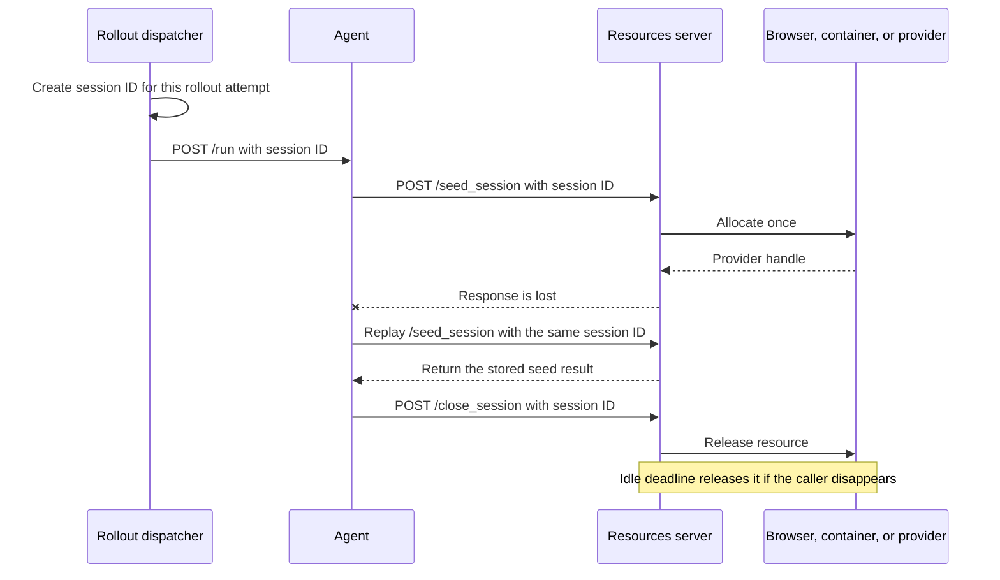
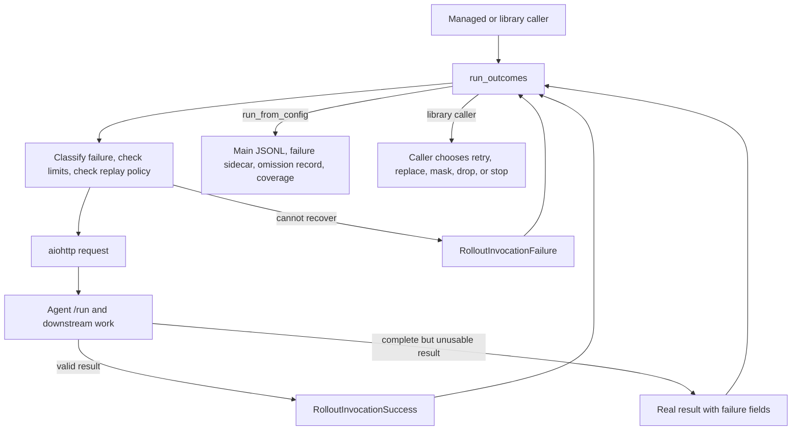
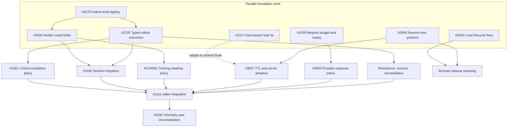

# Proposed error handling in NeMo Gym

This document proposes how NeMo Gym should report failures, retry temporary errors, and stop work without hanging. Read it with the [current-state summary](./nemo-gym-error-handling-today.md), the detailed [rollout failure catalogue](./nemo-gym-rollout-error-catalogue.md), and the [resources-session API design](./nemo-gym-close-session-design.md). Tracking issue: [#2750](https://github.com/NVIDIA-NeMo/Gym/issues/2750).

## Goals and responsibility boundaries

The design has two goals:

- **Return enough information for callers to handle failures.** When NeMo Gym cannot complete a rollout, it returns a structured record that can cross process and Ray boundaries. The record explains what failed, where it failed, whether the server may have received the request, and whether another attempt may help. NeMo Gym does not invent a reward for a rollout that produced no valid result.
- **Recover from temporary failures without repeating expensive work unnecessarily.** A rollout may spend minutes calling models, tools, verifiers, and external systems. NeMo Gym retries at the lowest layer that can recover safely. Every retry loop stops after configured attempt or elapsed-time limits.

NeMo Gym decides whether another HTTP transmission is safe and allowed. The caller decides what to do after NeMo Gym returns a result or failure. This separation lets managed evaluation and library callers apply different policies without duplicating network logic.

### Distinguish a missing result from an unusable result

Every rollout attempt ends in one of two cases:

- **No valid result exists.** NeMo Gym returns a `RolloutFailureRecord`. The record includes the failure stage, delivery state, retry guidance, and rollout identity. It does not include `mask_sample` because there is no sample to mask. NeMo Gym must not create a placeholder reward, response, or token sequence.
- **A complete result exists but should not be used for evaluation scoring or training loss.** The producer returns the real result with `mask_sample=True`, a stable `failure_kind`, and a human-readable `failure_reason`. The caller may store it separately, retry it, or keep its group position while excluding it from training loss. Keeping the row is safe only when the response and token fields are complete.

Infrastructure failure is not the same as a legitimate verifier score of zero. If a report needs to count missing infrastructure outcomes as zeros, aggregation can compute that view from explicit failure counts.

### Design principles

- **Record an outcome for every dispatched rollout.** A rollout produces a valid result, a failure record, an intentional omission record, or an incomplete-run record.
- **Let expected failures become data.** Network and protocol failures should not end an otherwise independent collection run. Programming errors and cancellation should still propagate.
- **Stop every retry loop.** Attempt and elapsed-time limits apply across nested retry layers.
- **Replay only when delivery state permits it.** A refused connection is generally safe to retry. A dropped connection or gateway error may occur after the server performed work.
- **Use serializable failure data.** Recovery decisions must not depend on Python exception identity or unpicklable library fields.
- **Use one failure vocabulary.** `failure_kind` values come from one registry. Retryability, delivery state, and masking remain properties of each occurrence.
- **Report coverage with scores.** Outputs include expected, completed, failed, omitted, and unknown counts.
- **Share rollout identity across retry and checkpointing.** A later caller must know whether it can continue an attempt or must start a new one.
- **Release remote resources independently of verification.** A browser, container, provider session, or other resource acquired for one rollout must have an explicit release path. Verification is not a cleanup mechanism because failed and cancelled rollouts may never reach it.

## Startup, supervision, and shutdown

### Own locally started services until they stop

`RunHelper` should own every process or service from startup through cleanup:

- `RunHelper` records each process or service after it starts successfully.
- A failure during startup triggers cleanup of everything already acquired.
- Startup, readiness, and shutdown stages each have finite deadlines.
- Readiness errors identify the failed stage, endpoint, elapsed time, and cleanup result.
- Child services run in process groups so shutdown can stop descendants, not only direct children.
- Shutdown is safe to call more than once.
- Status output reports stalled work, including the oldest in-flight rollout and time since the last completion.
- Resolved retry and timeout settings are logged once and stored with the run.

A context manager such as `RunHelper.running()` can pair startup and shutdown for `gym env start`, served `gym eval run`, and reverify. `gym eval run --no-serve` remains separate because it does not own the services it calls.

### Pair each remote session with an explicit release

Process shutdown does not release resources allocated for one rollout on a remote resources server. A stateful environment may allocate a browser, container, provider session, or quota slot during `/seed_session`. The rollout may then fail or be cancelled before `/verify`, which is where some environments currently perform cleanup. Retrying the rollout can allocate another session while the first remains live.

`SimpleResourcesServer` should expose an idempotent `POST /close_session`. The endpoint has dedicated request and response models and never returns or changes reward. Agent code should put `/seed_session`, model and tool work, `/verify`, and `/close_session` in one lifecycle scope. The release belongs in `finally`, and its bounded failure must not hide the rollout's original result or failure.

Caller-driven release cannot handle a killed agent or collector. Stateful environments therefore also need an optional idle-session deadline and a server-side sweeper. The sweeper is a backstop, not the normal release path. Environments that do not allocate per-rollout resources can keep the default no-op release and no sweeper.

The rollout dispatcher creates a high-entropy `_ng_session_id` and a separate one-session close capability before it sends `/run`. The agent forwards them to `/seed_session` and uses them for `/close_session` when the signed cookie is unavailable. One rollout attempt uses the same values across every HTTP transmission of the seed operation. A new rollout attempt creates new values. The resources server stores the seed result by identifier, so a repeated `/seed_session` returns the same logical session instead of allocating another resource. Because the dispatcher and agent already know the identifier and close capability, they can request release when a response is lost without letting a public session ID authorize cross-session cleanup.

An environment may have a separate provider-side handle, such as a cloud browser identifier. It may return that opaque handle for diagnostics, but that handle cannot be the only release key because the caller does not receive it when the seed response is lost.

The [resources-session API design](./nemo-gym-close-session-design.md) defines identity resolution, response status, cancellation behavior, compatibility, and the resources servers that need to adopt the hook. [Issue #2609](https://github.com/NVIDIA-NeMo/Gym/issues/2609) tracks the explicit endpoint, [issue #3037](https://github.com/NVIDIA-NeMo/Gym/issues/3037) tracks the common lifecycle and adoption audit, and [issue #3039](https://github.com/NVIDIA-NeMo/Gym/issues/3039) separately tracks multi-worker state placement.

## Failure records and shared names

### Failure-kind registry

[Issue #3179](https://github.com/NVIDIA-NeMo/Gym/issues/3179) owns a small `nemo_gym/failure_kinds.py` registry of stable strings shared across components. The field remains a string so an environment can add a namespaced value such as `<server>:<kind>`.

The registry does not decide whether a failure is retryable or whether a result should be masked. Those facts depend on the specific operation and belong on the failure record or returned result.

### Rollout failure record

`RolloutFailureRecord` is a Pydantic model containing only bounded, serializable values. It records:

- Run, task, rollout, and attempt identifiers.
- The failure stage and `failure_kind`.
- Whether the server definitely did not receive, may have received, or did receive the request.
- Whether another attempt may help.
- The method and sanitized endpoint.
- Size-limited error details.
- Elapsed time and transmission counts.
- The logical session identifier and remote-completion information when known.
- Whether release was unnecessary, attempted and completed, attempted and failed, or left unknown by process loss.

The record does not store an aiohttp response object, traceback, credential, proxy object, or unbounded response body. Tests must send it through pickle, a spawned process, and Ray.

Cleanup state is separate from the primary rollout outcome. Both successful results and failure records may carry a bounded `resource_cleanup` object with the logical session identifier, release status, and a short failure reason. The release status is one of `not_needed`, `released`, `release_failed`, or `unknown`. A release failure must not replace the error that ended the rollout. If a complete rollout result exists and only release fails, the real score remains available, `mask_sample` may remain false, and `resource_cleanup` reports the release failure. If the `/run` response is lost, the collector records the identifier it created and marks cleanup as `unknown`. This lets callers preserve valid training data while still measuring leaked-resource risk.

### Verifier result fields

Verifier responses use three top-level fields:

- `mask_sample` says whether a complete result is usable for evaluation scoring or training loss.
- `failure_kind` provides a stable machine-readable category.
- `failure_reason` explains the specific occurrence to a person.

The fields stay separate because they answer different questions. A caller should not infer masking or retry policy from a failure name alone. [Issue #2608](https://github.com/NVIDIA-NeMo/Gym/issues/2608) owns these Gym fields. [NVIDIA-NeMo/RL issue #4061](https://github.com/NVIDIA-NeMo/RL/issues/4061) owns their propagation through training and their effect on prompt-group statistics.

## Transport retry policy

### Classify failures before choosing a limit

The transport layer distinguishes:

- `unreachable` for connection refusal, DNS failure, and routing failure;
- `local_resource` for file-descriptor, socket-buffer, or memory pressure;
- `connect_timeout` for connection setup that exceeded its deadline;
- `peer_drop` for an established connection that ended unexpectedly;
- `response_timeout` for a response stage that exceeded its limit; and
- `fatal` for errors that should return immediately.

Classification order matters because aiohttp connector exceptions inherit from broader socket exceptions.

### Share one retry allowance

`TransportRetryPolicy` limits both attempts and elapsed retry time. The operation stops when either limit is reached. Backoff is capped, includes jitter, and reports the first failure immediately.

Nested layers share the remaining allowance for one logical request. A 429 followed by a disconnect and then a 503 does not start three independent budgets.

When the allowance is exhausted, NeMo Gym raises a serializable `RequestFailedError` with plain data. The row dispatcher converts that error into a rollout failure outcome.

### Make replay safety explicit

Each call site declares a `ReplayPolicy`:

- `before_delivery` permits another transmission only when the server did not receive the request.
- `idempotent` permits replay because performing the operation again has the same intended effect.
- `deduplicated` permits replay because the request includes an operation identifier and the receiver rejects duplicate execution.
- `never` returns the failure without replay.

POST requests default to `before_delivery`. NeMo Gym does not automatically repeat a possibly delivered `/run`, `/verify`, tool, or sandbox request.

`/seed_session` is a special allocating POST. Treating it only as `before_delivery` avoids duplicate allocation, but it cannot recover when the server allocated the resource and the response was lost. Once the caller supplies a stable session identifier and the resources server deduplicates by that identifier, the call can declare `deduplicated`. `/close_session` can declare `idempotent` only after repeated release is guaranteed to have the same intended effect.

### Bound connection setup without limiting healthy generation

Connection setup receives a finite `sock_connect` timeout. Total generation time, response-body reads, and connection-pool waiting do not receive one universal deadline. Long model generations therefore remain possible while blackholed connection setup becomes finite.

## Model-response retry policy

One `RetryContext` follows a model request across rate limits, server responses, and transport failures. The context:

- limits both provider-response count and elapsed retry time;
- starts its retry window at the first retryable failure;
- uses capped exponential backoff with jitter;
- honors `Retry-After` without exceeding the remaining allowance;
- preserves the final provider response body; and
- returns non-retryable client errors immediately.

Attempt and time values are configuration defaults. Production recovery metrics should determine their final values.

## Row-associated rollout outcomes

A failure sidecar is the JSONL file stored beside the main rollout output. It records failed attempts without creating invalid rollout rows.

A new `run_outcomes()` interface yields one of two values:

- `RolloutInvocationSuccess` contains the original input row and the valid result dictionary.
- `RolloutInvocationFailure` contains the original input row and a `RolloutFailureRecord`.

`run_outcomes()` converts expected network and response problems into failure values. These include exhausted transport retries, agent HTTP errors, truncated bodies, invalid JSON, and invalid result schemas. Programming errors and cancellation continue to raise.

`run_from_config()` writes valid results to the main JSONL, failed attempts to the failure sidecar, and intentional omissions to an omission record. `run_examples()` remains a compatibility adapter: it returns `(row, result)` on success and raises a serializable `RolloutInvocationError` on failure. Library callers can migrate to `run_outcomes()` when they want explicit failure policy.

### What `main` has today, and what remains

[PR #2017](https://github.com/NVIDIA-NeMo/Gym/pull/2017) landed the first half of this contract. With `route_failures_to_sidecar=true`, `_post_subroutine()` converts `aiohttp.ClientError`, `orjson.JSONDecodeError`, and `TimeoutError` into a sidecar row instead of raising. The row carries no reward and no response, and it records the exception type, message, HTTP status, and a size-limited response body. Two framework classes name what happened: `agent_run_error` means the agent answered with a status other than 429, 502, 503, or 504, so the agent ran and its handler failed; `agent_request_failed` means a gateway status or no readable reply arrived. The collector skips model-call capture, token-capture finalization, and metric accumulation for these rows, and resume dispatches them again with a new attempt index. `count_failure_classes_as_zero` lets an evaluation count chosen classes as zeros at aggregation time without changing any artifact. [PR #2883](https://github.com/NVIDIA-NeMo/Gym/pull/2883) then made the routing opt-in, added one console line per routed row, and added a coverage block and `coverage/expected`, `coverage/scored`, and `coverage/missing` metrics measured against the materialized input. Library callers are unaffected: `run_examples()` raises by default.

The remaining work in this area:

- The sidecar row is a dictionary with `_ng_failure_*` keys. It should become the `RolloutFailureRecord` model above, so it gains delivery state, retry guidance, the stage that failed, and rollout identity, and so library callers can receive the same record through `run_outcomes()` instead of a raw exception.
- A 4xx status the agent itself returned is recorded as `agent_run_error` and retried on resume. Deterministic client errors (400, 401, 403, 404, 422) should set `_ng_failure_terminal=True` so resume does not repeat them; 408 and 429 stay retryable.
- Reverification `/verify` requests still raise on failure and end the reverification run. They need the same conversion under a verify-specific kind such as `verify_request_failed`. [PR #2363](https://github.com/NVIDIA-NeMo/Gym/pull/2363) is closed as superseded; [issue #2135](https://github.com/NVIDIA-NeMo/Gym/issues/2135) owns the remaining behavior.
- The transport below the collector still re-sends a request after a disconnect or socket error without checking delivery. The transport phase below fixes that.

### The default for managed evaluation

#2883 turned routing off by default because a score computed over fewer rollouts than were dispatched can look complete when nothing in the output says the denominator moved. That objection was correct at the time. The same PR also added the two things that answer it: one console line per routed row, and coverage counts against the materialized input in the closing block and in the exported metrics.

This design's position is that once coverage counts are also written into the aggregate-metrics artifact and CI gates on `coverage/missing`, the default should become on for managed evaluation, because a run that stops on the first failure loses every in-flight rollout and still leaves the operator to discover what failed. Until those two conditions hold, managed runs opt in with `+route_failures_to_sidecar=true`, and the CLI documentation must say that the default run ends on the first failed `/run`. This is a decision for the maintainers, recorded here so the reasoning is in one place.

## Cohort-based verification

A verifier that compares several rollouts must receive explicit comparison-set identity. Prompt text and expected size are not enough to establish membership.

The producer assigns one `cohort_id` to the intended comparison set. Each member also carries a stable `cohort_member_id`, expected size, task identity, prompt fingerprint, and any model-version identity needed to prevent incompatible results from mixing. A fresh rollout attempt keeps the same cohort and member identity while receiving a new attempt identity.

The verifier:

- keys state by `cohort_id`;
- counts unique member identifiers rather than request arrivals;
- rejects conflicting payloads for one member identifier;
- returns the existing pending or completed result for a duplicate submission;
- admits members and claims a completed cohort atomically;
- performs judge work outside the state lock;
- applies a finite cohort deadline;
- resolves every waiter with a structured failure when the cohort cannot complete; and
- retains a bounded terminal record so late arrivals cannot join another cohort.

Judging a partial cohort changes the comparison population. It must remain an explicit evaluation or caller policy rather than the default timeout behavior.

## Persistence, resume, and coverage

Managed collection records exactly one current outcome for each materialized task and rollout:

- a valid result in the main JSONL;
- an attempt in the failure sidecar;
- an omission audit record; or
- an incomplete-run entry when collection stops with outstanding work.

A run manifest stores the run identifier and digests of the materialized input and resolved configuration. Resume rejects artifacts from another materialization unless the user explicitly overrides the check.

Aggregation reports expected, completed, failed by category, omitted, and unknown counts next to metrics computed from valid results. Failure records bypass token-capture finalization because they do not contain valid token payloads.

## Delivery sequence and parallel work

The tracking graph uses issue hierarchy for ownership and explicit dependency sections for merge order. [Issue #2750](https://github.com/NVIDIA-NeMo/Gym/issues/2750) is a standalone reliability epic. [Issue #2831](https://github.com/NVIDIA-NeMo/Gym/issues/2831) remains the observability epic and owns the telemetry work in [issue #3182](https://github.com/NVIDIA-NeMo/Gym/issues/3182).

### Work that can start now

The first wave can proceed in parallel because each item defines a separate contract:

- [Issue #3179](https://github.com/NVIDIA-NeMo/Gym/issues/3179) defines registered `failure_kind` values.
- [Issue #2135](https://github.com/NVIDIA-NeMo/Gym/issues/2135) defines typed rollout outcomes, attempt identity, resume manifests, persistence, and exact reconciliation.
- [Issue #3159](https://github.com/NVIDIA-NeMo/Gym/issues/3159) defines the shared request budget, transport classification, delivery state, and replay policy.
- [Issue #2609](https://github.com/NVIDIA-NeMo/Gym/issues/2609) defines resources-session identity, seed deduplication, close capability, wire models, and the release hook.
- [Issue #2608](https://github.com/NVIDIA-NeMo/Gym/issues/2608) adds completed verifier-result fields and migrates Gym producers.
- [Issue #3160](https://github.com/NVIDIA-NeMo/Gym/issues/3160) fixes partial-startup ownership, readiness deadlines, cancellation, and local shutdown.
- [Issue #3157](https://github.com/NVIDIA-NeMo/Gym/issues/3157) fixes the known Gymnasium subclass leak without waiting for the shared session API.
- [NVIDIA-NeMo/RL issue #4061](https://github.com/NVIDIA-NeMo/RL/issues/4061) can define prompt-group masking policy and compatibility tests while the Gym schema stabilizes.
- [Issue #3180](https://github.com/NVIDIA-NeMo/Gym/issues/3180) and [issue #3181](https://github.com/NVIDIA-NeMo/Gym/issues/3181) can complete producer inventories and test matrices before their shared schemas merge.
- [Issue #3182](https://github.com/NVIDIA-NeMo/Gym/issues/3182) can define telemetry names and instrument behavior whose semantics have already landed.

### Hard merge gates

- #3179 merges before #2135 or #2608 relies on stable `failure_kind` values.
- #3159's request-budget interface merges before [issue #2845](https://github.com/NVIDIA-NeMo/Gym/issues/2845) integrates provider retries. Provider policy can be developed against the agreed interface in parallel.
- #2609's identity, close, and release-hook contract merges before [issue #3037](https://github.com/NVIDIA-NeMo/Gym/issues/3037) adds the common TTL lifecycle and broad server adoption.
- #2608's top-level verifier fields merge before NVIDIA-NeMo/RL#4061 consumes them.
- #2135, #2608, and #3179 stabilize before #3180 migrates reward-zero judge and agent sentinels.
- #2135 and #3179 stabilize before #3181 persists incomplete cohort outcomes.

### Active implementation candidates

- [PR #2728](https://github.com/NVIDIA-NeMo/Gym/pull/2728) is the registry candidate for #3179. It needs a rebase and corrected entries before consumers merge.
- [PR #2611](https://github.com/NVIDIA-NeMo/Gym/pull/2611) is the Gym verifier-field candidate for #2608. It follows #2728 and does not own NeMo-RL policy.
- [PR #2527](https://github.com/NVIDIA-NeMo/Gym/pull/2527) is the provider-response candidate for #2845. It must consume #3159's request budget.
- [PR #2612](https://github.com/NVIDIA-NeMo/Gym/pull/2612) contains useful lifecycle and sweeper code, but it must be replaced or refactored around #2609's caller-created identity, close capability, seed deduplication, and close outcomes.
- [PR #2613](https://github.com/NVIDIA-NeMo/Gym/pull/2613) remains diagnostic `env_session_id` work under #2610/#2831. It must not become the cleanup or authorization identity.
- [PR #2384](https://github.com/NVIDIA-NeMo/Gym/pull/2384) maps to #3180. [PR #2385](https://github.com/NVIDIA-NeMo/Gym/pull/2385) maps to #3181. [PR #2964](https://github.com/NVIDIA-NeMo/Gym/pull/2964) is a terminal input-error change related to #2845 and should not retry.

The older #2361, #2363, #2365, #2366, and #2373 stack is closed as superseded. Its classification, socket deadline, response-body preservation, fake-clock, and retry-budget tests remain implementation evidence for #3159 and #2845. [PR #2044](https://github.com/NVIDIA-NeMo/Gym/pull/2044) is also closed because merged #2113 provides the current judge helper and #3180 owns the remaining semantic migration.

## Progress against the tracking issue

- **Bound every request path:** Partial. External provider retries and optional connection limits have landed, but internal transport and provider loops can still continue indefinitely.
- **Record one outcome per rollout:** Partial. Opt-in `/run` failures are row-associated and persisted, but there is no typed union, complete omission/unknown record, or manifest-validated resume.
- **Preserve failure details across boundaries:** Partial. HTTP errors survive a spawned process, but the final outcome still lacks a real Ray round-trip test.
- **Prevent unsafe replay:** Not implemented. Call sites do not declare replay policy or delivery state.
- **Separate completed masked results from no-result failures:** Partial. `failure_reason` has landed; common `mask_sample`, `failure_kind`, producer migration, and NeMo-RL handling remain open.
- **Release remote sessions:** Not implemented in the framework. Local cleanup precedents exist, but there is no caller-created session identity, deduplicated seed, close capability, common route, or TTL policy.
- **Bound startup and shutdown:** Partial. Client disconnect cancellation has landed, but readiness, partial-startup rollback, cancellation propagation, descendant ownership, and progress supervision remain open.
- **Resolve incomplete cohorts:** Not implemented. The current GenRM path can wait indefinitely and has no explicit member identity.
- **Report recovery telemetry:** Partial. OpenTelemetry foundations exist, but retry, failure kind, masking, cleanup, cohort, cancellation, and stall signals remain open under #3182.
- **Document caller policy:** Partial. Existing flags and fields are documented individually; the full managed-versus-library contract still needs user documentation.

## Required validation

Before enabling the design broadly, tests must cover:

- Tests lock down exception classification order.
- Tests use a fake clock to verify attempt and elapsed-time limits.
- Tests prove that NeMo Gym refuses to replay a possibly delivered POST without an explicit safe-replay policy.
- Tests distinguish connection-pool waiting from connection setup against an unreachable host.
- Tests count server-side effects when a request is replayed.
- Tests lose the first `/seed_session` response and prove that replay returns the original session without allocating twice.
- Tests prove that `/close_session` is idempotent and still identifies the session when seeding returned no response.
- Tests cancel and kill the caller separately, then prove that explicit release or the idle deadline reclaims the remote resource.
- Tests prove that cleanup failure does not replace the rollout's original result or failure.
- Tests send failure records through pickle, a spawned process, and Ray. Today only the pickle and spawned-process cases exist, for `ClientResponseError` and the sidecar row.
- Tests verify failure sidecar routing and resume identity.
- Tests prove that coverage totals add up exactly.
- Tests inject a failure after each startup stage and verify cleanup.
- Tests prove that request volume against a dead endpoint remains bounded.
