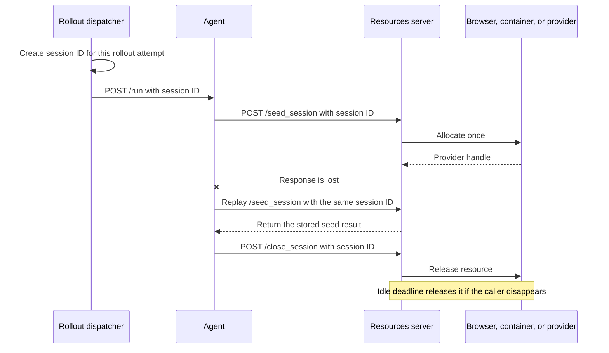
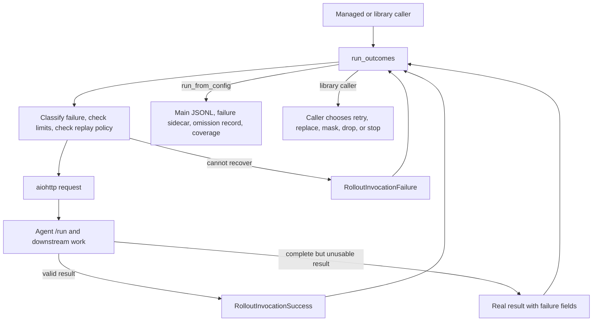
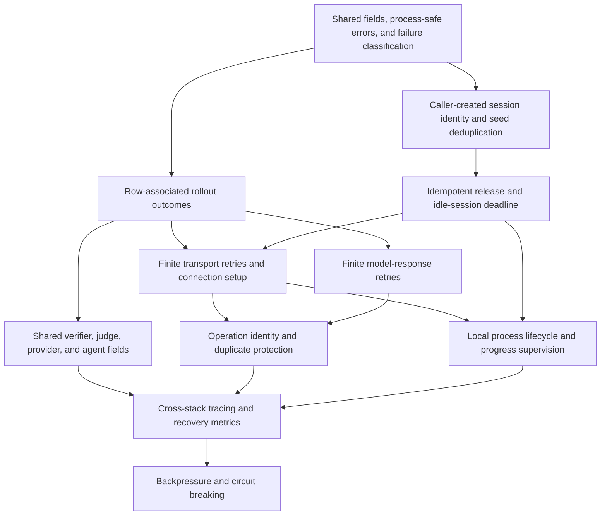

# Proposed error handling in NeMo Gym

This document proposes how NeMo Gym should report failures, retry temporary errors, and stop work without hanging. Read it with the [current-state summary](./nemo-gym-error-handling-today.md) and the detailed [rollout failure catalogue](./nemo-gym-rollout-error-catalogue.md). Tracking issue: [#2750](https://github.com/NVIDIA-NeMo/Gym/issues/2750). Implementation status and pull-request dispositions below are as of upstream `main` @ `98713f8e9` (2026-09-02).

## Goals and responsibility boundaries

The design has two goals:

- **Return enough information for callers to handle failures.** When NeMo Gym cannot complete a rollout, it returns a structured record that can cross process and Ray boundaries. The record explains what failed, where it failed, whether the server may have received the request, and whether another attempt may help. NeMo Gym does not invent a reward for a rollout that produced no valid result.
- **Recover from temporary failures without repeating expensive work unnecessarily.** A rollout may spend minutes calling models, tools, verifiers, and external systems. NeMo Gym retries at the lowest layer that can recover safely. Every retry loop stops after configured attempt or elapsed-time limits.

NeMo Gym decides whether another HTTP transmission is safe and allowed. The caller decides what to do after NeMo Gym returns a result or failure. This separation lets managed evaluation and library callers apply different policies without duplicating network logic.

### Distinguish a missing result from an unusable result

Every rollout attempt ends in one of two cases:

- **No valid result exists.** NeMo Gym returns a `RolloutFailureRecord`. The record includes the failure stage, delivery state, retry guidance, and rollout identity. It does not include `mask_sample` because there is no sample to mask. NeMo Gym must not create a placeholder reward, response, or token sequence.
- **A complete result exists but should not be used for evaluation scoring or training loss.** The producer returns the real result with `mask_sample=True`, a stable `failure_kind`, and a human-readable `failure_reason`. The caller may store it separately, retry it, or keep its group position while excluding it from training loss. Keeping the row is safe only when the response and token fields are complete.

Infrastructure failure is not the same as a legitimate verifier score of zero. If a report needs to count missing infrastructure outcomes as zeros, aggregation can compute that view from explicit failure counts.

### Design principles

- **Record an outcome for every dispatched rollout.** A rollout produces a valid result, a failure record, an intentional omission record, or an incomplete-run record.
- **Let expected failures become data.** Network and protocol failures should not end an otherwise independent collection run. Programming errors and cancellation should still propagate.
- **Stop every retry loop.** Attempt and elapsed-time limits apply across nested retry layers.
- **Replay only when delivery state permits it.** A refused connection is generally safe to retry. A dropped connection or gateway error may occur after the server performed work.
- **Use serializable failure data.** Recovery decisions must not depend on Python exception identity or unpicklable library fields.
- **Use one failure vocabulary.** `failure_kind` values come from one registry. Retryability, delivery state, and masking remain properties of each occurrence.
- **Report coverage with scores.** Outputs include expected, completed, failed, omitted, and unknown counts.
- **Share rollout identity across retry and checkpointing.** A later caller must know whether it can continue an attempt or must start a new one.
- **Release remote resources independently of verification.** A browser, container, provider session, or other resource acquired for one rollout must have an explicit release path. Verification is not a cleanup mechanism because failed and cancelled rollouts may never reach it.

## Startup, supervision, and shutdown

### Own locally started services until they stop

`RunHelper` should own every process or service from startup through cleanup:

- `RunHelper` records each process or service after it starts successfully.
- A failure during startup triggers cleanup of everything already acquired.
- Startup, readiness, and shutdown stages each have finite deadlines.
- Readiness errors identify the failed stage, endpoint, elapsed time, and cleanup result.
- Child services run in process groups so shutdown can stop descendants, not only direct children.
- Shutdown is safe to call more than once.
- Status output reports stalled work, including the oldest in-flight rollout and time since the last completion.
- Resolved retry and timeout settings are logged once and stored with the run.

A context manager such as `RunHelper.running()` can pair startup and shutdown for `gym env start`, served `gym eval run`, and reverify. `gym eval run --no-serve` remains separate because it does not own the services it calls.

### Pair each remote session with an explicit release

Process shutdown does not release resources allocated for one rollout on a remote resources server. A stateful environment may allocate a browser, container, provider session, or quota slot during `/seed_session`. The rollout may then fail or be cancelled before `/verify`, which is where some environments currently perform cleanup. Retrying the rollout can allocate another session while the first remains live.

`SimpleResourcesServer` should expose an idempotent `/close_session` operation. Agent code should put `/seed_session`, model and tool work, `/verify`, and `/close_session` in one lifecycle scope. The release belongs in `finally`, and its bounded failure must not hide the rollout's original result or failure.

Caller-driven release cannot handle a killed agent or collector. Stateful environments therefore also need an optional idle-session deadline and a server-side sweeper. The sweeper is a backstop, not the normal release path. Environments that do not allocate per-rollout resources can keep the default no-op release and no sweeper.

The rollout dispatcher must create the logical session identifier before it sends `/run`. The agent forwards that identifier to `/seed_session` and `/close_session`. One rollout attempt uses one identifier across every HTTP transmission of the seed operation. A new rollout attempt uses a new identifier. The resources server stores the seed result by identifier, so a repeated `/seed_session` returns the same logical session instead of allocating another resource. Because the dispatcher and agent already know the identifier, either can record it when a response is lost.

An environment may have a separate provider-side handle, such as a cloud browser identifier. It may return that opaque handle for diagnostics, but that handle cannot be the only release key because the caller does not receive it when the seed response is lost.

[Issue #2609: add a teardown hook for stateful resources servers](https://github.com/NVIDIA-NeMo/Gym/issues/2609) describes the missing release boundary. [PR #2612: add an idempotent close hook and idle sweeper](https://github.com/NVIDIA-NeMo/Gym/pull/2612) provides an implementation direction. [PR #2613: expose environment-session identity](https://github.com/NVIDIA-NeMo/Gym/pull/2613) provides correlation fields, but replay-safe seeding additionally requires the caller-created identifier described above.

## Failure records and shared names

### Failure-kind registry

`nemo_gym/failure_kinds.py` defines stable strings for failures shared across components. The field remains a string so an environment can add a namespaced value such as `<server>:<kind>`.

The registry does not decide whether a failure is retryable or whether a result should be masked. Those facts depend on the specific operation and belong on the failure record or returned result.

### Rollout failure record

`RolloutFailureRecord` is a Pydantic model containing only bounded, serializable values. It records:

- Run, task, rollout, and attempt identifiers.
- The failure stage and `failure_kind`.
- Whether the server definitely did not receive, may have received, or did receive the request.
- Whether another attempt may help.
- The method and sanitized endpoint.
- Size-limited error details.
- Elapsed time and transmission counts.
- The logical session identifier and remote-completion information when known.
- Whether release was unnecessary, attempted and completed, attempted and failed, or left unknown by process loss.

The record does not store an aiohttp response object, traceback, credential, proxy object, or unbounded response body. Tests must send it through pickle, a spawned process, and Ray.

Cleanup state is separate from the primary rollout outcome. Both successful results and failure records may carry a bounded `resource_cleanup` object with the logical session identifier, release status, and a short failure reason. The release status is one of `not_needed`, `released`, `release_failed`, or `unknown`. A release failure must not replace the error that ended the rollout. If a complete rollout result exists and only release fails, the real score remains available, `mask_sample` may remain false, and `resource_cleanup` reports the release failure. If the `/run` response is lost, the collector records the identifier it created and marks cleanup as `unknown`. This lets callers preserve valid training data while still measuring leaked-resource risk.

### Verifier result fields

Verifier responses use three top-level fields:

- `mask_sample` says whether a complete result is usable for evaluation scoring or training loss.
- `failure_kind` provides a stable machine-readable category.
- `failure_reason` explains the specific occurrence to a person.

The fields stay separate because they answer different questions. A caller should not infer masking or retry policy from a failure name alone.

## Transport retry policy

### Classify failures before choosing a limit

The transport layer distinguishes:

- `unreachable` for connection refusal, DNS failure, and routing failure;
- `local_resource` for file-descriptor, socket-buffer, or memory pressure;
- `connect_timeout` for connection setup that exceeded its deadline;
- `peer_drop` for an established connection that ended unexpectedly;
- `response_timeout` for a response stage that exceeded its limit; and
- `fatal` for errors that should return immediately.

Classification order matters because aiohttp connector exceptions inherit from broader socket exceptions.

### Share one retry allowance

`TransportRetryPolicy` limits both attempts and elapsed retry time. The operation stops when either limit is reached. Backoff is capped, includes jitter, and reports the first failure immediately.

Nested layers share the remaining allowance for one logical request. A 429 followed by a disconnect and then a 503 does not start three independent budgets.

When the allowance is exhausted, NeMo Gym raises a serializable `RequestFailedError` with plain data. The row dispatcher converts that error into a rollout failure outcome.

### Make replay safety explicit

Each call site declares a `ReplayPolicy`:

- `before_delivery` permits another transmission only when the server did not receive the request.
- `idempotent` permits replay because performing the operation again has the same intended effect.
- `deduplicated` permits replay because the request includes an operation identifier and the receiver rejects duplicate execution.
- `never` returns the failure without replay.

POST requests default to `before_delivery`. NeMo Gym does not automatically repeat a possibly delivered `/run`, `/verify`, tool, or sandbox request.

`/seed_session` is a special allocating POST. Treating it only as `before_delivery` avoids duplicate allocation, but it cannot recover when the server allocated the resource and the response was lost. Once the caller supplies a stable session identifier and the resources server deduplicates by that identifier, the call can declare `deduplicated`. `/close_session` can declare `idempotent` only after repeated release is guaranteed to have the same intended effect.

### Bound connection setup without limiting healthy generation

Connection setup receives a finite `sock_connect` timeout. Total generation time, response-body reads, and connection-pool waiting do not receive one universal deadline. Long model generations therefore remain possible while blackholed connection setup becomes finite.

## Model-response retry policy

One `RetryContext` follows a model request across rate limits, server responses, and transport failures. The context:

- limits both provider-response count and elapsed retry time;
- starts its retry window at the first retryable failure;
- uses capped exponential backoff with jitter;
- honors `Retry-After` without exceeding the remaining allowance;
- preserves the final provider response body; and
- returns non-retryable client errors immediately.

Attempt and time values are configuration defaults. Production recovery metrics should determine their final values.

## Row-associated rollout outcomes

A failure sidecar is the JSONL file stored beside the main rollout output. It records failed attempts without creating invalid rollout rows.

A new `run_outcomes()` interface yields one of two values:

- `RolloutInvocationSuccess` contains the original input row and the valid result dictionary.
- `RolloutInvocationFailure` contains the original input row and a `RolloutFailureRecord`.

`run_outcomes()` converts expected network and response problems into failure values. These include exhausted transport retries, agent HTTP errors, truncated bodies, invalid JSON, and invalid result schemas. Programming errors and cancellation continue to raise.

`run_from_config()` writes valid results to the main JSONL, failed attempts to the failure sidecar, and intentional omissions to an omission record. `run_examples()` remains a compatibility adapter: it returns `(row, result)` on success and raises a serializable `RolloutInvocationError` on failure. Library callers can migrate to `run_outcomes()` when they want explicit failure policy.

### What `main` has today, and what remains

[PR #2017](https://github.com/NVIDIA-NeMo/Gym/pull/2017) landed the first half of this contract. With `route_failures_to_sidecar=true`, `_post_subroutine()` converts `aiohttp.ClientError`, `orjson.JSONDecodeError`, and `TimeoutError` into a sidecar row instead of raising. The row carries no reward and no response, and it records the exception type, message, HTTP status, and a size-limited response body. Two framework classes name what happened: `agent_run_error` means the agent answered with a status other than 429, 502, 503, or 504, so the agent ran and its handler failed; `agent_request_failed` means a gateway status or no readable reply arrived. The collector skips model-call capture, token-capture finalization, and metric accumulation for these rows, and resume dispatches them again with a new attempt index. `count_failure_classes_as_zero` lets an evaluation count chosen classes as zeros at aggregation time without changing any artifact. [PR #2883](https://github.com/NVIDIA-NeMo/Gym/pull/2883) then made the routing opt-in, added one console line per routed row, and added a coverage block and `coverage/expected`, `coverage/scored`, and `coverage/missing` metrics measured against the materialized input. Library callers are unaffected: `run_examples()` raises by default.

The remaining work in this area:

- The sidecar row is a dictionary with `_ng_failure_*` keys. It should become the `RolloutFailureRecord` model above, so it gains delivery state, retry guidance, the stage that failed, and rollout identity, and so library callers can receive the same record through `run_outcomes()` instead of a raw exception.
- A 4xx status the agent itself returned is recorded as `agent_run_error` and retried on resume. Deterministic client errors (400, 401, 403, 404, 422) should set `_ng_failure_terminal=True` so resume does not repeat them; 408 and 429 stay retryable.
- Reverification `/verify` requests still raise on failure and end the reverification run. They need the same conversion under a verify-specific class such as `verify_request_failed`, which is the only part of [PR #2363](https://github.com/NVIDIA-NeMo/Gym/pull/2363) that #2017 did not supersede.
- The transport below the collector still re-sends a request after a disconnect or socket error without checking delivery. The transport phase below fixes that.

### The default for managed evaluation

#2883 turned routing off by default because a score computed over fewer rollouts than were dispatched can look complete when nothing in the output says the denominator moved. That objection was correct at the time. The same PR also added the two things that answer it: one console line per routed row, and coverage counts against the materialized input in the closing block and in the exported metrics.

This design's position is that once coverage counts are also written into the aggregate-metrics artifact and CI gates on `coverage/missing`, the default should become on for managed evaluation, because a run that stops on the first failure loses every in-flight rollout and still leaves the operator to discover what failed. Until those two conditions hold, managed runs opt in with `+route_failures_to_sidecar=true`, and the CLI documentation must say that the default run ends on the first failed `/run`. This is a decision for the maintainers, recorded here so the reasoning is in one place.

## Cohort-based verification

A verifier that compares several rollouts must receive explicit comparison-set identity. Prompt text and expected size are not enough to establish membership.

The producer assigns one `cohort_id` to the intended comparison set. Each member also carries a stable `cohort_member_id`, expected size, task identity, prompt fingerprint, and any model-version identity needed to prevent incompatible results from mixing. A fresh rollout attempt keeps the same cohort and member identity while receiving a new attempt identity.

The verifier:

- keys state by `cohort_id`;
- counts unique member identifiers rather than request arrivals;
- rejects conflicting payloads for one member identifier;
- returns the existing pending or completed result for a duplicate submission;
- admits members and claims a completed cohort atomically;
- performs judge work outside the state lock;
- applies a finite cohort deadline;
- resolves every waiter with a structured failure when the cohort cannot complete; and
- retains a bounded terminal record so late arrivals cannot join another cohort.

Judging a partial cohort changes the comparison population. It must remain an explicit evaluation or caller policy rather than the default timeout behavior.

## Persistence, resume, and coverage

Managed collection records exactly one current outcome for each materialized task and rollout:

- a valid result in the main JSONL;
- an attempt in the failure sidecar;
- an omission audit record; or
- an incomplete-run entry when collection stops with outstanding work.

A run manifest stores the run identifier and digests of the materialized input and resolved configuration. Resume rejects artifacts from another materialization unless the user explicitly overrides the check.

Aggregation reports expected, completed, failed by category, omitted, and unknown counts next to metrics computed from valid results. Failure records bypass token-capture finalization because they do not contain valid token payloads.

## Implementation sequence

The order matters because a finite lower-layer retry must have a consuming layer that can record its final failure.

### Build on landed foundations and independent fixes

Landed: [PR #2723: clear the failure sidecar on fresh runs](https://github.com/NVIDIA-NeMo/Gym/pull/2723), [PR #2726: preserve HTTP errors across process boundaries](https://github.com/NVIDIA-NeMo/Gym/pull/2726) (which extracted the fix from [PR #1788](https://github.com/NVIDIA-NeMo/Gym/pull/1788), now closed), [PR #2552: add human-readable verifier diagnosis](https://github.com/NVIDIA-NeMo/Gym/pull/2552), and [PR #2383: recover judge endpoint changes](https://github.com/NVIDIA-NeMo/Gym/pull/2383), which also added the opt-in `max_connection_retries` bound on the transport's disconnect and socket-error branches.

Open: [PR #2728: define shared failure names](https://github.com/NVIDIA-NeMo/Gym/pull/2728), the registry above; its vocabulary must include the framework classes `agent_run_error` and `agent_request_failed` that #2017 introduced. [PR #2361: classify transport failures](https://github.com/NVIDIA-NeMo/Gym/pull/2361) needs a rebase onto `_request_with_retries()` that keeps the `max_connection_retries` check, the six-kind split above (its head has five kinds and folds connect and response timeouts together), and a delivery-state mapping per kind. [PR #1005](https://github.com/NVIDIA-NeMo/Gym/pull/1005) is closed.

This foundation is complete when HTTP errors preserve their useful details across process boundaries, the first network failure produces a useful category with a delivery state, and verifier responses can explain unusable results consistently.

### Keep one agent request failure from ending collection

Partly landed. [PR #2017](https://github.com/NVIDIA-NeMo/Gym/pull/2017) records a failed agent `/run` as a row-associated sidecar entry without a reward or response, and [PR #2883](https://github.com/NVIDIA-NeMo/Gym/pull/2883) reports coverage against the materialized input; see "What `main` has today, and what remains" above. [PR #2363](https://github.com/NVIDIA-NeMo/Gym/pull/2363) is superseded and should be closed; its reverification routing becomes a small new PR.

Remaining: `RolloutFailureRecord` as the schema behind the sidecar row, `run_outcomes()` and the `run_examples()` compatibility behavior for library callers, terminal marking for deterministic 4xx responses, reverification `/verify` routing, and the default decision above.

This phase is complete when an agent HTTP error produces a failure sidecar row, independent rollouts continue, resume creates a new attempt identity, output metrics report exact coverage, and a library caller can receive the same failure as a serializable record.

### Close remote sessions before rollout retry can multiply them

Add the dispatcher-created session identifier, propagation through `/run`, receiver-side seed deduplication, idempotent `/close_session`, an agent lifecycle scope, and an optional idle-session deadline. Keep a provider-side environment handle separate from the logical identifier when both are useful.

[Issue #2609: define teardown for stateful resources servers](https://github.com/NVIDIA-NeMo/Gym/issues/2609), [PR #2612: add explicit release and idle reclamation](https://github.com/NVIDIA-NeMo/Gym/pull/2612), and [PR #2613: return environment-session identity](https://github.com/NVIDIA-NeMo/Gym/pull/2613) provide the current design inputs. The final API must let `/close_session` identify the session even if `/seed_session` returned no response, and the sweeper must be able to release that same session without caller state.

Review of the current PR heads against this contract:

- #2612 has the right shape for the hook, the `finally` scope, and the sweeper, but its session key is the cookie session id that the server mints on the first request. The caller learns that id only from the seed response. When the seed response is lost, `/close_session` without the cookie resolves a fresh id and releases nothing, and a replayed `/seed_session` allocates a second session; with the cookie, a replay re-runs the environment's allocation. The PR does not change `/seed_session` at all. It also does not bound the close call (a hung `/close_session` pins a cancelled rollout), returns no cleanup status on the result, adopts the scope in one agent out of thirty that call `/seed_session`, starts the sweeper with a bare `create_task` whose reference is not held, never calls `touch_session` from the base `seed_session` or `forget_session` from the close route, and silently collides with the existing `close_session(self, session_id)` methods on the gymnasium, tales, and openair servers. The changes needed: a `session_id` field on the seed and close request bodies, filled by the agent from the dispatcher's `{task}-{rollout}[-a{n}]` identity; server-side resolution of body id before cookie; a seed result store keyed by that id so a replay returns the stored response; a timeout on the close call with a finite `max_connection_retries`; a `resource_cleanup` object on the `/run` result; sweeper lifetime managed in a lifespan with `touch_session` and `forget_session` called from the base routes; and a rename of the hook or a migration of the three colliding servers.
- #2613's head adds only `env_session_id` to the seed and verify responses. Its description still claims a `rollout_correlation_enabled` setting and tests that are no longer in the branch; the description must be corrected or that change restored separately, because `main` still applies the rollout id prefix to resources servers only when model-call capture is on. `env_session_id` is the provider handle for diagnostics and must not become the release or deduplication key; the logical session id above lives on the request side.

This phase is complete when every session-allocating agent releases on success, failure, and cancellation; a lost seed response cannot create an unaddressable resource; repeating one seed operation does not allocate twice; caller death is covered by an environment-side deadline; and cleanup failures are visible without replacing the primary rollout outcome.

### Bound transport retries and connection setup

[PR #2365: limit socket connection setup](https://github.com/NVIDIA-NeMo/Gym/pull/2365) applies cleanly to `main` on its own and should land first, rebased directly rather than through the older stack. Until the budget loop lands, a connect timeout from this deadline falls into the generic branch of `_request_with_retries()`: external callers stop after three tries, internal callers still retry forever, but each attempt is now finite.

[PR #2373: apply classified retry limits](https://github.com/NVIDIA-NeMo/Gym/pull/2373) provides the budget loop and `RequestFailedError`. Its earlier blocking defect, a `post` call outside the `try` in the collector, no longer applies because #2017 moved the call inside; `RequestFailedError` subclasses `aiohttp.ClientError`, so the collector already routes it as `agent_request_failed`. Its collector and reverification hunks should be dropped. What it still needs: a rebase onto `_request_with_retries()` that honors `max_connection_retries` as a caller override; a `connect_timeout` kind for #2365's deadline; `ReplayPolicy` gating, because its head replays `peer_drop` and `timeout` failures for every method including POST `/run`, `/verify`, tool, and sandbox calls; plain-data fields on `RequestFailedError` (kind, attempts, elapsed seconds, method, sanitized URL, delivery state, last error type) so the record can be built from it; and a note that removing the internal retry-forever branch changes every agent-to-server hop. [PR #1005](https://github.com/NVIDIA-NeMo/Gym/pull/1005) is closed. The required behavior is defined by the retry and replay contracts above rather than by any one branch.

This phase is complete when every branch in `request()` stops within configured limits, a dead endpoint produces one failure record for each affected rollout, and a possibly delivered POST is not repeated without an explicit safe-replay rule.

### Bound model-response retries

[PR #2527: add a model retry window and backoff](https://github.com/NVIDIA-NeMo/Gym/pull/2527) is the vehicle; [PR #2366: limit attempts and preserve the final response body](https://github.com/NVIDIA-NeMo/Gym/pull/2366) contributes the pieces #2527 lacks and then closes. #2527's only change since August gates its bounds behind `_internal`, so internal callers keep the fixed 0.5-second unbounded loop; that gate should become a client configuration field instead. It still lacks the consumed-body fix (its final `raise_for_status()` re-reads a stream the loop already consumed, and its own test asserts the empty-body call), an attempt ceiling (its `max_num_tries` still grows on every rate-limit response, and a `Retry-After` of zero or one second reproduces the near-zero-delay amplification), a delay floor, and a window that starts at the first retryable failure rather than before the first request. The grafts from #2366 are the `response_content` parameter on `raise_for_status()`, the explicit attempt ceiling, and its fake-clock tests. The final implementation must satisfy the shared `RetryContext` contract above; sharing the window with the transport layer can follow in a separate change if the PR says so.

This phase is complete when permanent throttling stops within configured limits, changing error shapes does not reset the allowance, and the final error retains the provider's response details.

### Apply the shared failure contract across components

[PR #2611: report unusable verifier results](https://github.com/NVIDIA-NeMo/Gym/pull/2611), [PR #1797: preserve provider error details](https://github.com/NVIDIA-NeMo/Gym/pull/1797), [PR #2385: harden judge cohorts](https://github.com/NVIDIA-NeMo/Gym/pull/2385), [PR #2384: distinguish proof-judge failures](https://github.com/NVIDIA-NeMo/Gym/pull/2384), and [PR #2044: unify judge failure handling](https://github.com/NVIDIA-NeMo/Gym/pull/2044) identify component-specific gaps. Migrate judge and provider paths that silently convert infrastructure errors into scores while applying the shared fields and cohort contract above.

This phase is complete when every producer uses the shared fields, no known judge infrastructure failure becomes a legitimate score, cohort membership remains exact under retries and duplicate delivery, incomplete cohorts resolve within a configured deadline, and environment authors have one documented reporting contract.

### Add lifecycle control, identity, and observability

Add rollback after partial startup, bounded shutdown, progress reporting, omission records, the run manifest, and incomplete-run records. Add operation identifiers and receiver-side duplicate protection before allowing replay after possible delivery.

Build on the OpenTelemetry integration that landed in `nemo_gym/telemetry` ([PR #2646](https://github.com/NVIDIA-NeMo/Gym/pull/2646), [PR #2647](https://github.com/NVIDIA-NeMo/Gym/pull/2647), [PR #2790](https://github.com/NVIDIA-NeMo/Gym/pull/2790)). It already propagates trace context across HTTP hops, emits `gym.job`, `gym.rollout`, `gym.verify`, `gym.model.*`, and sandbox start and exec spans, and records rollout and verify durations. What it does not yet record is what this contract needs: one span or event per HTTP transmission with the attempt number and failure kind, spans or events for sidecar routing and `_ng_failure_class` values, a driver-side span per rollout attempt around the dispatch call, spans for release and shutdown, trace context across Ray, and the coverage counts as OpenTelemetry metrics rather than only as run-exporter values. Metric labels must come from a fixed, limited set so task or request identifiers cannot create unbounded time series. The post-run rollout quality checks from [PR #2705](https://github.com/NVIDIA-NeMo/Gym/pull/2705) are report-only and do not replace the live stall signal described in the startup section. Add endpoint backpressure and a disabled-by-default circuit breaker only after the underlying calls always return.

## Status against the tracking issue

Completion criteria from [issue #2750](https://github.com/NVIDIA-NeMo/Gym/issues/2750), checked against `main` @ `98713f8e9` on 2026-09-02:

| Criterion | Status | Evidence |
|---|---|---|
| No branch in the shared request path retries forever | Partial | `max_connection_retries` bounds the disconnect and socket-error branches only when a caller sets it (#2383); the generic branch still retries forever for internal callers; the model loop still grows its own limit on rate-limit statuses; no connect deadline |
| A failed agent `/run` becomes a row-associated failure and others continue | Partial | Implemented by #2017; off by default since #2883; reverification not covered; no terminal marking for deterministic 4xx |
| A possibly delivered POST is not repeated without a safe-replay policy | Not started | The transport re-sends any request after a disconnect or socket error with no delivery check; no `ReplayPolicy` |
| Failure records and exceptions pass pickle and Ray tests | Partial | `ClientResponseError` survives a spawned-process round trip (#2726); the sidecar row survives pickle; no Ray test for either |
| Coverage totals reconcile with the materialized input | Done for collection; partial for aggregate and reverify | #2883 measures collection coverage against the materialized file; `gym eval aggregate` and reverification measure against scored rows plus sidecar rows |
| Resume verifies run, input, and configuration | Not started | Resume checks only that the materialized and output files exist |
| A startup failure cleans up every service started before it | Partial | Only the model-endpoint timeout path shuts down; other failures inside `RunHelper.start()` leave processes running; no process groups |
| A lost `/seed_session` response cannot create an unaddressable resource or allocate twice on replay | Not started | `/seed_session` unchanged; #2612 and #2613 as written do not meet it (see the session phase) |
| Failed, cancelled, and abandoned rollouts release remote sessions explicitly or by expiry | Not started in the framework | No release route; OpenSandbox close is now idempotent and a run-scoped cleanup job exists for sandboxes |
| Status output identifies a collector that is alive but not progressing | Not started | Supervision checks process exit only; telemetry is opt-in and has no stall signal; health checks run after the run |
| Documentation explains the contract for CLI evaluation and direct callers | Partial | The routing flag and classes are documented in the CLI reference and observability pages exist; no page describes the overall contract, the marker semantics, or the default-off decision |

## Required validation

Before enabling the design broadly, tests must cover:

- Tests lock down exception classification order.
- Tests use a fake clock to verify attempt and elapsed-time limits.
- Tests prove that NeMo Gym refuses to replay a possibly delivered POST without an explicit safe-replay policy.
- Tests distinguish connection-pool waiting from connection setup against an unreachable host.
- Tests count server-side effects when a request is replayed.
- Tests lose the first `/seed_session` response and prove that replay returns the original session without allocating twice.
- Tests prove that `/close_session` is idempotent and still identifies the session when seeding returned no response.
- Tests cancel and kill the caller separately, then prove that explicit release or the idle deadline reclaims the remote resource.
- Tests prove that cleanup failure does not replace the rollout's original result or failure.
- Tests send failure records through pickle, a spawned process, and Ray. Today only the pickle and spawned-process cases exist, for `ClientResponseError` and the sidecar row.
- Tests verify failure sidecar routing and resume identity.
- Tests prove that coverage totals add up exactly.
- Tests inject a failure after each startup stage and verify cleanup.
- Tests prove that request volume against a dead endpoint remains bounded.
