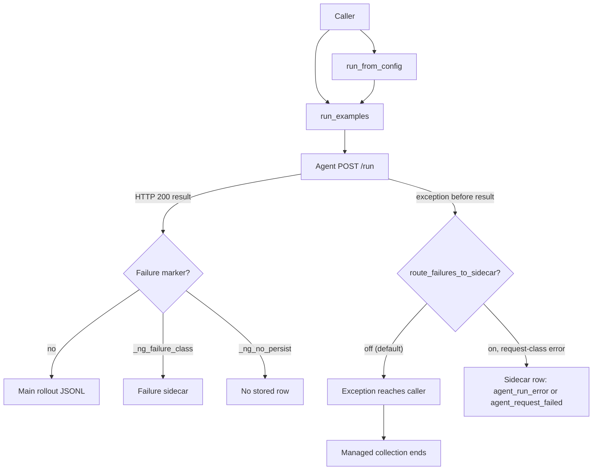

# Current NeMo Gym rollout failure handling

This document summarizes current NeMo Gym behavior as of upstream `main` @ [`98713f8e9`](https://github.com/NVIDIA-NeMo/Gym/tree/98713f8e9) (2026-09-02). The previous version predated PRs #2017, #2883, #2726, and #2383, which changed the collector and transport behavior described below. The [rollout failure catalogue](./nemo-gym-rollout-error-catalogue.md) explains each failure boundary in detail. The [future-state design](./nemo-gym-error-handling-future.md) proposes the replacement contract.

## Rollout collection has a managed interface and a library interface

A rollout invocation runs one agent for one task and rollout index. During that invocation, NeMo Gym may send requests to an agent, model, resources server, verifier, judge, tool, or sandbox.

NeMo Gym exposes rollout collection through two interfaces:

- **`run_from_config()`** is the managed path behind `gym eval run`. It materializes inputs, dispatches agent `/run` requests, writes results, routes returned failure markers to a failure sidecar, resumes earlier work, and aggregates successful results. When the run sets `route_failures_to_sidecar=true`, it also converts an agent `/run` request that raised (a connection failure, an HTTP error status, an unreadable body, or a timeout) into a failure-sidecar row instead of ending the run, prints one line per routed row, and reports how many materialized rollouts the metrics cover. The setting is off by default.
- **`run_examples()`** is the lower-level library interface. It yields `(row, result)` futures. It does not own persistence, resume, aggregation, or a caller-wide failure policy. It accepts the same `route_failures_to_sidecar` flag; by default a failed `/run` raises to the caller.

A failure can reach these interfaces in two forms. An agent can return an HTTP 200 result dictionary that contains a failure marker. The managed interface can inspect and route that dictionary. A request can also raise before a usable dictionary exists. By default, that exception ends managed collection and propagates to library callers. When `route_failures_to_sidecar=true`, the collector converts `aiohttp.ClientError`, `orjson.JSONDecodeError`, and `TimeoutError` into a sidecar row inside `_post_subroutine()`, before the exception can reach the collection loop. Other exception types still propagate.

## Returned failure results have storage and resume handling

The managed interface already handles failures that arrive as result dictionaries:

- Successful results go to the main rollout JSONL.
- Results with `_ng_failure_class` go to `<stem>_failures.jsonl`, with one row for each attempt.
- Results with `_ng_no_persist` are not written to either file.
- Resume counts sidecar rows for each task and rollout index against `NEMO_GYM_MAX_ROLLOUT_ATTEMPTS`.
- A nonterminal failure below the attempt limit is dispatched again with a new attempt index.
- `_ng_failure_terminal=True` prevents another attempt.
- A fresh run clears both the main rollout file and the failure sidecar before collection begins.
- Every row written to the sidecar is announced on the console with its row identity, failure class, and error text. The closing summary reports how many of the materialized rollouts the metrics cover, and `coverage/expected`, `coverage/scored`, and `coverage/missing` are exported alongside the other run metrics. `gym eval aggregate` and reverification report the same coverage block.
- `count_failure_classes_as_zero` lists failure classes whose latest sidecar attempt is scored as zero for aggregate metrics only. The sidecar and the rollouts file are unchanged.
- A run in which no rollout produced a result raises instead of reporting an empty score.

The judge failsafe uses this path. `judge_failsafe` converts `JudgeError` into a reward-zero dictionary with `_ng_failure_class="judge_failed"`. The managed interface stores that row in the sidecar and excludes it from aggregate score input. A library caller receives the same dictionary and must inspect the marker itself.

This mechanism has one important boundary: by default it works only after an agent returns a dictionary. With `route_failures_to_sidecar=true`, the collector also records a failed connection, an agent HTTP error status, a truncated or unreadable body, and a request timeout as sidecar rows. The framework defines two classes for those rows: `agent_run_error` means the agent answered with a status other than 429, 502, 503, or 504, so the agent ran and its handler failed; `agent_request_failed` means a gateway status or no readable reply arrived, so the agent may not have run at all. These rows carry no reward and no response. The collector skips model-call capture, token-capture finalization, and metric accumulation for them, and resume dispatches them again with a new attempt index. Three gaps remain even with the flag on: programming errors and cancellation still propagate; a `/verify` request that fails during reverification still raises; and a 4xx status the agent itself returned is recorded as `agent_run_error` and retried on resume like any other row, because nothing marks deterministic client errors as terminal.

## Failure details use several incompatible formats

NeMo Gym components currently describe unusable results in different ways:

- `_ng_failure_class` routes a returned result to the failure sidecar. Producers define their own string values. The framework itself defines `agent_run_error` and `agent_request_failed` and treats rows with those classes as rollouts that produced no result.
- `_ng_no_persist` suppresses disk storage, even when `_ng_failure_class` is also present.
- `mask_sample` appears in several agent and token-capture paths to tell a consumer not to use a returned result for evaluation scoring or training loss.
- PR #2295 proposes `valid_sample` and `failure_kind` fields for web-verifier results. Those fields are not on `main`.
- `BaseVerifyResponse.failure_reason` provides a human-readable explanation, but there is not yet one shared machine-readable failure contract across every producer.

These fields answer different questions. Storage routing, result usability, failure category, and human-readable diagnosis should remain separate. Current code does not apply that separation consistently.

## Startup and process supervision do not cover every stall

Configuration can fail before NeMo Gym acquires resources. For example, the OpenAI version guard raises during configuration unless version skew is explicitly allowed.

After acquisition begins, `RunHelper.start()` starts the head server and component processes, then waits for their HTTP roots. The head and component waits do not have one overall deadline. A child process exit can be detected, but a live process that never begins listening can hold startup indefinitely.

Model endpoint readiness is better bounded. NeMo Gym waits for configured model endpoints for a limited period, reports the endpoint and configuration key that failed, and runs cleanup on that path. An HTTP response proves only that something answered; it does not prove authentication, model availability, or successful inference.

Steady-state supervision checks whether owned threads or direct child processes exited. It does not check whether HTTP handlers or rollouts are making progress. A live process whose event loop is stuck in a retry loop can therefore appear healthy.

## HTTP transport retries can keep a rollout alive indefinitely

The shared HTTP transport retries `ServerDisconnectedError` and `ClientOSError` without a final attempt or elapsed-time limit unless the caller passes `max_connection_retries`. That limit was added for judge clients by PR #2383: `NeMoGymAsyncOpenAI` exposes it, and only the vLLM model server's `endpoint_file` mode sets it. By default the limit is unset and the loop retries forever. Connector errors inherit from `ClientOSError`, so refused connections, DNS failures, local socket pressure, and established-connection failures enter the same broad path.

Internal NeMo Gym requests also retry generic exceptions without a final limit. `ServerClient.request()` marks component-to-component calls as internal, including agent, model, resources, and verifier requests.

The global aiohttp session does not set a socket-connect deadline. A blackholed connection can therefore wait for the operating system before the transport loop retries it.

HTTP error responses now survive process boundaries. `raise_for_status()` replaces the aiohttp fields on `ClientResponseError` that cannot be pickled while preserving the status, message, URL, headers, and response body (PR #2726). A resources-server or agent error can therefore cross a Ray boundary without losing its details.

These retries happen while the collector holds its concurrency slot. If every active request remains in a lower retry loop, queued work cannot begin and collection records no failed outcome.

## The model wrapper adds another retry loop

The model wrapper retries provider responses with status 429, 500, 502, 503, 504, or 520. Persistent 500 responses stop after a small fixed number of provider responses. For the other retry statuses, the loop increases its own maximum as it consumes attempts, so it can continue indefinitely.

One model-status attempt can also remain inside the lower transport loop. A limit at the model layer cannot bound a transport call that never returns.

## Agents, verifiers, streams, and sandboxes return different failure shapes

Individual agents may convert remote-service, timeout, verification, JSON, or response-shape errors into `_ng_failure_class` results. Other agents allow the exception to escape. An exception that escapes an agent's `/run` handler becomes an HTTP 500 from the shared exception middleware, and `asyncio.CancelledError` inside a handler is converted to a 500 as well. With `route_failures_to_sidecar=true`, the collector records that 500 as `agent_run_error`. Judge wrappers are not used consistently by every resources server.

Streaming APIs also differ. The Responses API can emit a terminal `response.failed` event after partial output has been delivered. Other API paths buffer or surface failures differently. Replaying the original request cannot retract stream events already consumed by the caller.

Sandbox create, execute, upload, stop, and close operations have provider-specific timeouts and error conversion. OpenSandbox termination is now idempotent when the sandbox no longer exists, its status polls have their own 10-second budget, and a run-scoped cleanup job can remove sandboxes a run left behind. Cancelling the collector's local HTTP await still does not prove that a remote process or external action stopped.

The common resources-server lifecycle has `/seed_session` but no matching release operation. The simple agent does not put seeding, model and tool work, and verification inside a release scope. If a stateful environment allocates a browser, container, or provider session and the rollout ends before environment-specific cleanup, the resource can remain live. A lost seed response is especially difficult: the server may have allocated the resource, while the caller has neither a common release operation nor a framework-defined identifier for it.

The `genrm_compare` verifier buffers requests until a prompt-based cohort reaches its configured size. An incomplete cohort has no current deadline, so every arrived member can wait indefinitely. The buffer also lacks explicit cohort and member identifiers, which allows retries or overlapping comparison sets with the same prompt key to mix membership.

## One collector exception can end otherwise independent work

`run_from_config()` awaits each future as `row, result = await future` before marker routing. By default, an exception from transport, HTTP status handling, response-body reading, JSON parsing, or result validation ends collection before the failing row can be written to the sidecar. With `route_failures_to_sidecar=true`, request-class exceptions are converted inside `_post_subroutine()` and never reach that await; the row is written to the sidecar and the run continues.

Rows completed earlier remain on disk. Pending local tasks are cancelled during teardown. Requests already delivered to an agent, model, verifier, tool, or sandbox may continue remotely because local cancellation is not a distributed rollback.

Token-capture finalization adds another collection-wide stop inside the row loop. When the masked fraction crosses its configured limit, the collector raises before storing the current result.

## Observability covers tracing but not retries or failure classes

NeMo Gym has an optional OpenTelemetry integration in `nemo_gym/telemetry` (PRs #2646 and #2647). It is off unless `telemetry.enabled` is set or `NEMO_GYM_OTEL_ENABLED=1` is exported, and it requires the `telemetry` extra. When enabled, it emits one client span per logical HTTP request with `traceparent` propagated to the receiving server, server spans per route, and spans named `gym.job`, `gym.rollout`, `gym.agent.responses`, `gym.verify`, `gym.model.*`, `gym.sandbox.start`, and `gym.sandbox.exec`. It records `gym.rollout.duration_ms`, `gym.verify.duration_ms`, `gym.verify.success_rate`, and `gym.servers.active`.

The integration does not record what the failure contract needs. Individual HTTP transmissions inside the retry loop are not visible: there is one client span per logical request and no attribute for the attempt count. Sidecar routing, `_ng_failure_class` values, resume attempts, and cleanup or shutdown have no spans or metrics. Trace context crosses HTTP but not Ray. The `coverage/*` values go to the run's metric exporters, not to OpenTelemetry. Per-rollout latency (`ng_perf`) and the post-run rollout quality checks from PR #2705 exist, but the quality checks run after collection and only report; nothing detects a live collector that has stopped making progress.

## Recovery remains limited to returned failure results

NeMo Gym can store and retry returned failure results. It does not provide the same recovery when:

- a rollout invocation raises before returning a dictionary and `route_failures_to_sidecar` is off, which is the default, or the exception is not a request-class error;
- every active request remains inside a retry loop;
- a cohort-based verifier waits for missing or mis-grouped members;
- a request may have reached the server but its response was lost, and the transport below the collector re-sends the request after a disconnect or socket error without checking whether the first transmission was delivered;
- a seeded remote session outlives a failed or cancelled rollout;
- a result is intentionally omitted with `_ng_no_persist`;
- a live process stops making progress without exiting; or
- startup fails after only some resources were acquired.

The central gap is not one missing retry count. NeMo Gym now has an opt-in row-associated failure value for expected request failures. It still needs that value to be a serializable record with delivery state and retry guidance, finite retry policies that apply by default, explicit replay safety, resume checks against the run's input and configuration, and lifecycle ownership for both local processes and remote per-rollout resources. The [future-state design](./nemo-gym-error-handling-future.md) defines that contract.
