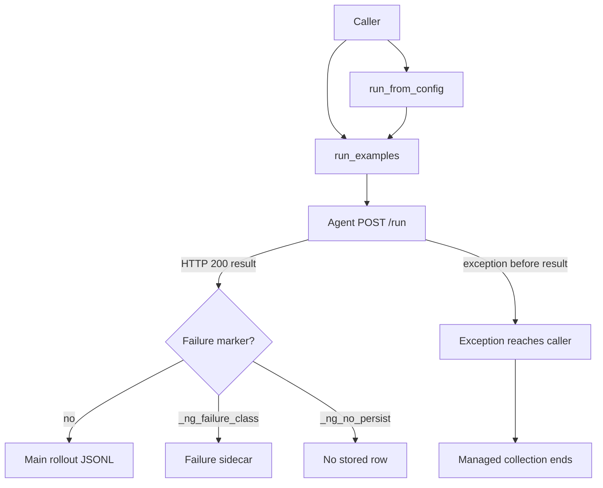

# Current NeMo Gym rollout failure handling

This document summarizes current NeMo Gym behavior. The [rollout failure catalogue](./nemo-gym-rollout-error-catalogue.md) explains each failure boundary in detail. The [future-state design](./nemo-gym-error-handling-future.md) proposes the replacement contract.

## Rollout collection has a managed interface and a library interface

A rollout invocation runs one agent for one task and rollout index. During that invocation, NeMo Gym may send requests to an agent, model, resources server, verifier, judge, tool, or sandbox.

NeMo Gym exposes rollout collection through two interfaces:

- **`run_from_config()`** is the managed path behind `gym eval run`. It materializes inputs, dispatches agent `/run` requests, writes results, routes returned failure markers to a failure sidecar, resumes earlier work, and aggregates successful results.
- **`run_examples()`** is the lower-level library interface. It yields `(row, result)` futures. It does not own persistence, resume, aggregation, or a caller-wide failure policy.

A failure can reach these interfaces in two forms. An agent can return an HTTP 200 result dictionary that contains a failure marker. The managed interface can inspect and route that dictionary. A request can also raise before a usable dictionary exists. That exception currently ends managed collection and propagates to library callers.

## Returned failure results have storage and resume handling

The managed interface already handles failures that arrive as result dictionaries:

- Successful results go to the main rollout JSONL.
- Results with `_ng_failure_class` go to `<stem>_failures.jsonl`, with one row for each attempt.
- Results with `_ng_no_persist` are not written to either file.
- Resume counts sidecar rows for each task and rollout index against `NEMO_GYM_MAX_ROLLOUT_ATTEMPTS`.
- A nonterminal failure below the attempt limit is dispatched again with a new attempt index.
- `_ng_failure_terminal=True` prevents another attempt.
- A fresh run clears both the main rollout file and the failure sidecar before collection begins.

The judge failsafe uses this path. `judge_failsafe` converts `JudgeError` into a reward-zero dictionary with `_ng_failure_class="judge_failed"`. The managed interface stores that row in the sidecar and excludes it from aggregate score input. A library caller receives the same dictionary and must inspect the marker itself.

This mechanism has one important boundary: it works only after an agent returns a dictionary. It does not handle a failed connection, an agent HTTP error, a truncated response body, invalid JSON, or another exception raised before `(row, result)` exists.

## Failure details use several incompatible formats

NeMo Gym components currently describe unusable results in different ways:

- `_ng_failure_class` routes a returned result to the failure sidecar. Producers define their own string values.
- `_ng_no_persist` suppresses disk storage, even when `_ng_failure_class` is also present.
- `mask_sample` appears in several agent and token-capture paths to tell a consumer not to use a returned result for evaluation scoring or training loss.
- Some web-verifier paths use `valid_sample` and `failure_kind`.
- `BaseVerifyResponse.failure_reason` provides a human-readable explanation, but there is not yet one shared machine-readable failure contract across every producer.

These fields answer different questions. Storage routing, result usability, failure category, and human-readable diagnosis should remain separate. Current code does not apply that separation consistently.

## Startup and process supervision do not cover every stall

Configuration can fail before NeMo Gym acquires resources. For example, the OpenAI version guard raises during configuration unless version skew is explicitly allowed.

After acquisition begins, `RunHelper.start()` starts the head server and component processes, then waits for their HTTP roots. The head and component waits do not have one overall deadline. A child process exit can be detected, but a live process that never begins listening can hold startup indefinitely.

Model endpoint readiness is better bounded. NeMo Gym waits for configured model endpoints for a limited period, reports the endpoint and configuration key that failed, and runs cleanup on that path. An HTTP response proves only that something answered; it does not prove authentication, model availability, or successful inference.

Steady-state supervision checks whether owned threads or direct child processes exited. It does not check whether HTTP handlers or rollouts are making progress. A live process whose event loop is stuck in a retry loop can therefore appear healthy.

## HTTP transport retries can keep a rollout alive indefinitely

The shared HTTP transport retries `ServerDisconnectedError` and `ClientOSError` without a final attempt or elapsed-time limit. Connector errors inherit from `ClientOSError`, so refused connections, DNS failures, local socket pressure, and established-connection failures enter the same broad path.

Internal NeMo Gym requests also retry generic exceptions without a final limit. `ServerClient.request()` marks component-to-component calls as internal, including agent, model, resources, and verifier requests.

The global aiohttp session does not set a socket-connect deadline. A blackholed connection can therefore wait for the operating system before the transport loop retries it.

These retries happen while the collector holds its concurrency slot. If every active request remains in a lower retry loop, queued work cannot begin and collection records no failed outcome.

## The model wrapper adds another retry loop

The model wrapper retries provider responses with status 429, 500, 502, 503, 504, or 520. Persistent 500 responses stop after a small fixed number of provider responses. For the other retry statuses, the loop increases its own maximum as it consumes attempts, so it can continue indefinitely.

One model-status attempt can also remain inside the lower transport loop. A limit at the model layer cannot bound a transport call that never returns.

## Agents, verifiers, streams, and sandboxes return different failure shapes

Individual agents may convert remote-service, timeout, verification, JSON, or response-shape errors into `_ng_failure_class` results. Other agents allow the exception to escape. Judge wrappers are not used consistently by every resources server.

Streaming APIs also differ. The Responses API can emit a terminal `response.failed` event after partial output has been delivered. Other API paths buffer or surface failures differently. Replaying the original request cannot retract stream events already consumed by the caller.

Sandbox create, execute, upload, stop, and close operations have provider-specific timeouts and error conversion. Cancelling the collector's local HTTP await does not prove that a remote process or external action stopped.

The common resources-server lifecycle has `/seed_session` but no matching release operation. The simple agent does not put seeding, model and tool work, and verification inside a release scope. If a stateful environment allocates a browser, container, or provider session and the rollout ends before environment-specific cleanup, the resource can remain live. A lost seed response is especially difficult: the server may have allocated the resource, while the caller has neither a common release operation nor a framework-defined identifier for it.

The `genrm_compare` verifier buffers requests until a prompt-based cohort reaches its configured size. An incomplete cohort has no current deadline, so every arrived member can wait indefinitely. The buffer also lacks explicit cohort and member identifiers, which allows retries or overlapping comparison sets with the same prompt key to mix membership.

## One collector exception can end otherwise independent work

`run_from_config()` awaits each future as `row, result = await future` before marker routing. An exception from transport, HTTP status handling, response-body reading, JSON parsing, or result validation therefore ends collection before the failing row can be written to the sidecar.

Rows completed earlier remain on disk. Pending local tasks are cancelled during teardown. Requests already delivered to an agent, model, verifier, tool, or sandbox may continue remotely because local cancellation is not a distributed rollback.

Token-capture finalization adds another collection-wide stop inside the row loop. When the masked fraction crosses its configured limit, the collector raises before storing the current result.

## Recovery remains limited to returned failure results

NeMo Gym can store and retry returned failure results. It does not provide the same recovery when:

- a rollout invocation raises before returning a dictionary;
- every active request remains inside a retry loop;
- a cohort-based verifier waits for missing or mis-grouped members;
- a request may have reached the server but its response was lost;
- a seeded remote session outlives a failed or cancelled rollout;
- a result is intentionally omitted with `_ng_no_persist`;
- a live process stops making progress without exiting; or
- startup fails after only some resources were acquired.

The central gap is not one missing retry count. NeMo Gym needs a row-associated failure value for expected request failures, finite retry policies, explicit replay safety, and lifecycle ownership for both local processes and remote per-rollout resources. The [future-state design](./nemo-gym-error-handling-future.md) defines that contract.
