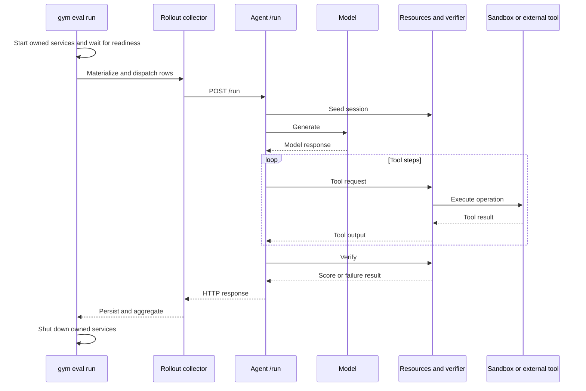
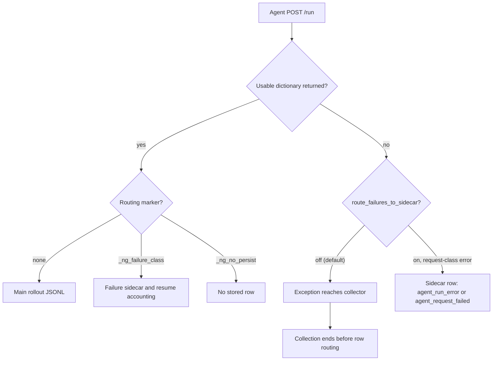
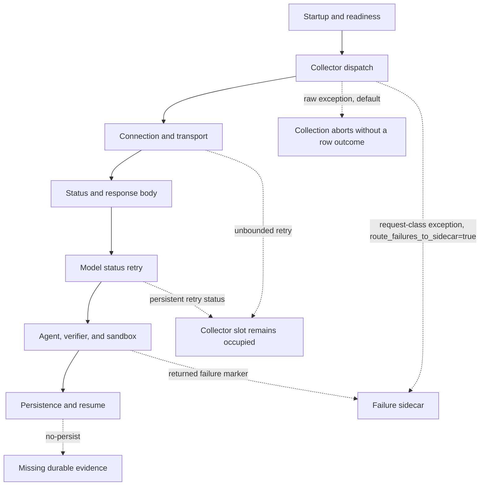
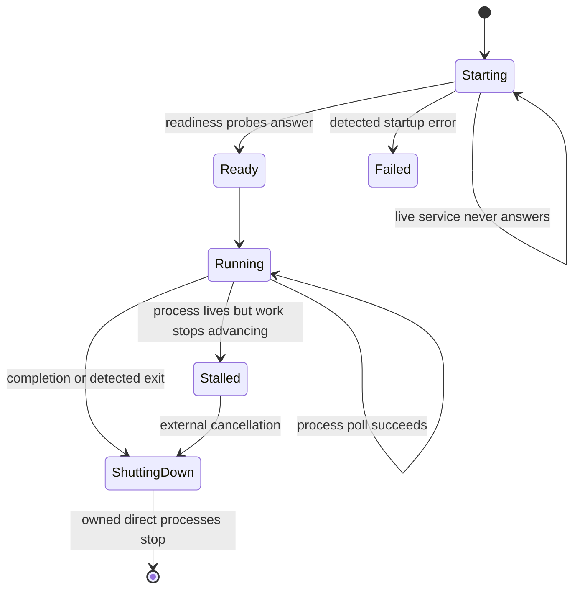

# NeMo Gym rollout failure catalogue

This document explains how NeMo Gym startup and rollout collection fail, what the code records, what happens to concurrent work, and which failures can recover. It covers NeMo Gym's managed evaluation path and lower-level library boundary. Controller and training policy outside NeMo Gym are out of scope. Source links point to upstream `main` @ [`98713f8e9`](https://github.com/NVIDIA-NeMo/Gym/tree/98713f8e9cbdbcc1db568fc6ab0dfc938d30afe5) (2026-09-02). Sections whose behavior changed with PRs #2017, #2883, #2726, and #2383 describe the new behavior and its default. For a shorter overview, read the [current-state summary](./nemo-gym-error-handling-today.md). The [future-state design](./nemo-gym-error-handling-future.md) defines the proposed replacement contract.

## Terms used in this document

- A **logical request** is one intended HTTP operation, such as one `POST /run`, regardless of how many times NeMo Gym tries to transmit it.
- An **HTTP transmission** is one invocation of `aiohttp.ClientSession.request()` inside NeMo Gym's retry loop. Earlier discussions called this a NeMo Gym transport attempt.
- A **failed HTTP transmission** is an invocation that raises before returning a usable response object.
- A **rollout invocation** is the row-level operation created by `run_examples()`: send one input row to the agent's `/run` endpoint and obtain one result dictionary.
- A **failed rollout invocation** is a row-level operation that raises or ends without a usable result dictionary. The agent may still have executed some or all of the operation.
- A **failed rollout** is a `/run` request that returns HTTP 200 with `_ng_failure_class`.
- A **failed task** is a valid rollout that receives a legitimate verifier score, including zero. It is not automatically an infrastructure failure.
- A request is **delivered** when the peer may have received it. Delivery does not prove completion.
- **Possibly delivered** means that sending the request again may duplicate a model call, tool mutation, sandbox operation, verification mutation, charge, or external action.
- A **failure sidecar** is the `<output>_failures.jsonl` file that stores returned results marked with `_ng_failure_class`.

## How served rollout collection executes

Served `gym eval run` combines process startup and managed collection. It prepares the dataset, starts the head server and configured components, waits for readiness, materializes input rows, dispatches concurrent agent `/run` requests, writes returned results, aggregates successful rows, and shuts down the services it owns.

`gym eval run --no-serve` begins at collection. It assumes the required services already exist, so it owns neither their startup nor their shutdown. `gym env start` starts the same service graph but remains in `run_forever()` instead of collecting rollouts.

The agent owns the work inside `/run`. A typical agent seeds resources state, calls a model, executes tools, invokes a verifier, and returns one result dictionary. Each step can change remote state before the collector receives the final response.

This lifecycle is not a transaction. If the collector fails while reading the final response, the model, tool, verifier, or sandbox may already have completed work. Cancelling the local await does not reverse those effects.

## How returned results recover

The managed collector can recover when `/run` returns a dictionary with `_ng_failure_class`. It writes the dictionary to the failure sidecar, excludes it from aggregate score input, and lets resume dispatch another attempt until the configured attempt limit is reached.

By default, the same collector cannot recover when `/run` raises before returning a dictionary. The exception escapes before marker routing, so the failing row receives no stored outcome and the collection run ends. Since PR #2017 and PR #2883, a run that sets `route_failures_to_sidecar=true` converts request-class exceptions (`aiohttp.ClientError`, `orjson.JSONDecodeError`, and `TimeoutError`) into a sidecar row classed `agent_run_error` or `agent_request_failed` before the collector loop sees them, and the run continues. The setting is off by default because the resulting score covers fewer rollouts than were dispatched; a run that turns it on announces every routed row and reports coverage against the materialized input. The difference between returned failures and raised failures remains the main boundary throughout the catalogue.

## Startup failures before rollout collection begins

### Configuration rejects an incompatible parent OpenAI version

- **Trigger:** The known parent `openai` version violates NeMo Gym's package constraint while global configuration is being resolved.
- **Sequence:** Global configuration is resolved before `RunHelper` starts Ray or child processes. Configuration raises `ConfigError`. The explicit `allow_openai_version_skew=true` escape hatch avoids pinning the parent version into child environments, but it intentionally permits different client-library versions across the HTTP interface.
- **Current handling:** NeMo Gym stops before acquiring runtime resources unless version skew is explicitly allowed. No runtime cleanup is needed because no rollout, process, or sidecar exists.
- **Persisted evidence:** No rollout row or sidecar row exists at this point. The configuration error is the available evidence.
- **Effect on concurrent work:** No rollout or child-process work has started.
- **Why it matters:** Allowing version skew can move the incompatibility from startup into runtime protocol behavior.
- **Source:** [OpenAI-version compatibility guard](https://github.com/NVIDIA-NeMo/Gym/blob/98713f8e9cbdbcc1db568fc6ab0dfc938d30afe5/nemo_gym/global_config.py#L1194-L1218)

### The head server or a component remains alive but never becomes ready

- **Trigger:** The head server or a configured component stays alive without beginning to answer its readiness probe.
- **Sequence:** `RunHelper.start()` starts the head server, launches configured components, and polls their HTTP roots. The head-server wait does not call the process poller. During the component wait, `wait_for_spinup()` calls `poll()`, so a direct child exit becomes an exception, but a live process that never listens remains in the loop. Neither wait has an overall deadline.
- **Current handling:** A live process that does not answer can hold startup indefinitely. Resources have already been acquired, and not every exception from `start()` is covered by an outer cleanup operation that reverses all earlier acquisition.
- **Persisted evidence:** The collector has not started, so no rollout rows exist. There is no time-limited diagnostic that identifies the startup stage.
- **Effect on concurrent work:** Concurrent startup work can remain alive until external cancellation or cleanup specific to its owner runs.
- **Why it matters:** NeMo Gym does not guarantee cleanup of everything acquired before the wait.
- **Source:** [Head and component readiness loops](https://github.com/NVIDIA-NeMo/Gym/blob/98713f8e9cbdbcc1db568fc6ab0dfc938d30afe5/nemo_gym/cli/env.py#L475-L498) and [`wait_for_spinup()`](https://github.com/NVIDIA-NeMo/Gym/blob/98713f8e9cbdbcc1db568fc6ab0dfc938d30afe5/nemo_gym/cli/env.py#L575-L604)

### A configured model endpoint never answers

- **Trigger:** A collected model base URL continues to refuse connections or time out after component roots have answered.
- **Sequence:** NeMo Gym probes the model base URLs sequentially. Refusal and timeout mean "keep waiting." Any HTTP response means only that something answered; it does not show that authentication, model loading, or inference is healthy. The configured budget is checked between probe rounds instead of being enforced as a strict deadline around all probe work.
- **Current handling:** When the budget is exhausted, NeMo Gym raises `ConfigError`, reports the configuration key and URL, and invokes shutdown for this path.
- **Persisted evidence:** The error identifies the configuration key and URL. No rollout row exists because collection has not started.
- **Effect on concurrent work:** NeMo Gym cleans up the resources owned by this readiness path.
- **Why it matters:** HTTP 401 and 404 responses count as answers, and a successful probe does not establish that requests can make progress.
- **Source:** [Model endpoint readiness](https://github.com/NVIDIA-NeMo/Gym/blob/98713f8e9cbdbcc1db568fc6ab0dfc938d30afe5/nemo_gym/cli/env.py#L673-L731)

### A ready process later stops serving requests without exiting

- **Trigger:** A process passes readiness and then its event loop stalls without the process exiting.
- **Sequence:** After readiness, `run_forever()` calls `poll()` every 60 seconds. `poll()` checks whether the head thread or direct children exited. It does not perform recurring HTTP liveness or rollout-progress checks, so the stalled process still appears healthy.
- **Current handling:** Collection can stop making progress while supervision reports no process failure. External cancellation can unwind local awaits, but it cannot retract model, tool, verifier, sandbox, or external effects from requests that were already delivered.
- **Persisted evidence:** No row is persisted for an in-flight rollout invocation while it remains live.
- **Effect on concurrent work:** In-flight rollout invocations can continue holding collector semaphore slots. Cleanup is not guaranteed for all descendant processes.
- **Why it matters:** NeMo Gym has no post-start progress contract.
- **Source:** [`poll()` and `run_forever()`](https://github.com/NVIDIA-NeMo/Gym/blob/98713f8e9cbdbcc1db568fc6ab0dfc938d30afe5/nemo_gym/cli/env.py#L518-L539) and [steady-state supervision](https://github.com/NVIDIA-NeMo/Gym/blob/98713f8e9cbdbcc1db568fc6ab0dfc938d30afe5/nemo_gym/cli/env.py#L655-L671)

## Collector failures before a result dictionary is returned

`run_examples()` acquires the collector semaphore, asks `ServerClient` to `POST /run`, validates the HTTP status, reads and parses the JSON body, and returns `(row, result)`. `run_from_config()` waits for completed futures and only then adds identity fields and routes markers. Transport, status, body-read, JSON-parse, and result-processing failures therefore happen before persistence policy can inspect a dictionary.

See the [low-level `/run` sequence](https://github.com/NVIDIA-NeMo/Gym/blob/98713f8e9cbdbcc1db568fc6ab0dfc938d30afe5/nemo_gym/rollout_collection.py#L1876-L1934) and the [managed await and marker routing path](https://github.com/NVIDIA-NeMo/Gym/blob/98713f8e9cbdbcc1db568fc6ab0dfc938d30afe5/nemo_gym/rollout_collection.py#L1374-L1479).

### `/run` raises before producing a usable result dictionary

- **Trigger:** `_post_subroutine()` raises before returning `(row, result)`.
- **Sequence:** The outer `row, result = await future` does not convert the exception. Marker routing does not run because there is no result dictionary. `run_from_config()` exits before aggregation.
- **Current handling:** By default, one raw `/run` exception aborts high-level collection. Teardown cancels pending local tasks, but cancellation does not reverse remote work. With `route_failures_to_sidecar=true`, `_post_subroutine()` catches `aiohttp.ClientError`, `orjson.JSONDecodeError`, and `TimeoutError`, releases the response, and returns a failure row instead: no reward, no response, plus `_ng_failure_type`, `_ng_failure_message`, `_ng_failure_http_status`, and a size-limited `_ng_failure_response_body`. The class is `agent_run_error` when the agent answered with a status other than 429, 502, 503, or 504, and `agent_request_failed` otherwise. Collection continues, and resume dispatches the row again with a new attempt index. Other exception types still propagate.
- **Persisted evidence:** By default, rows completed earlier may already have been flushed and the failing row receives neither a main row nor a failure sidecar row, so artifacts do not say whether it was never delivered, completed remotely, cancelled locally, or safe to send again. With the flag on, the sidecar row records the exception type, message, status, and body prefix, but it still does not record whether the request was delivered, and nothing marks a deterministic 4xx as terminal, so resume retries it like any other row.
- **Effect on concurrent work:** Pending local tasks are cancelled. Remote requests that were already delivered may continue.
- **Why it matters:** The failing row has no stored outcome, even though the agent may have executed some or all of its work.
- **Source:** [`_post_subroutine()` catch and failure row](https://github.com/NVIDIA-NeMo/Gym/blob/98713f8e9cbdbcc1db568fc6ab0dfc938d30afe5/nemo_gym/rollout_collection.py#L1900-L1926), [`_agent_request_failure_row()`](https://github.com/NVIDIA-NeMo/Gym/blob/98713f8e9cbdbcc1db568fc6ab0dfc938d30afe5/nemo_gym/rollout_collection.py#L829-L848), [`route_failures_to_sidecar` default](https://github.com/NVIDIA-NeMo/Gym/blob/98713f8e9cbdbcc1db568fc6ab0dfc938d30afe5/nemo_gym/rollout_collection.py#L608-L615), and [unconverted future await](https://github.com/NVIDIA-NeMo/Gym/blob/98713f8e9cbdbcc1db568fc6ab0dfc938d30afe5/nemo_gym/rollout_collection.py#L1371-L1377)

### Every collector slot remains inside a lower retry loop

- **Trigger:** Every active call remains inside `request()` while holding its collector semaphore slot.
- **Sequence:** The semaphore covers the request, HTTP-status validation, body reading, and JSON parsing. `tqdm.as_completed()` has futures, but none completes because control has not returned to the collector.
- **Current handling:** Collection keeps retrying without making progress, which is a livelock. Adding queued rows cannot restore throughput while all active slots remain occupied. A caller that passes `max_connection_retries` (PR #2383) bounds the disconnect and socket-error branches, but only the vLLM model server's `endpoint_file` mode sets it, so the default remains unbounded.
- **Persisted evidence:** No result reaches persistence, so the progress bar and output files stop advancing. No failed-rollout record is produced, and current logs do not connect one logical HTTP request with its HTTP transmissions, delivery state, or server-side execution count.
- **Effect on concurrent work:** Every active slot remains occupied, and queued rows cannot begin.
- **Why it matters:** This is not a queue-bookkeeping failure; the lower retry loops prevent the collector from observing an outcome.
- **Source:** [Semaphore ownership](https://github.com/NVIDIA-NeMo/Gym/blob/98713f8e9cbdbcc1db568fc6ab0dfc938d30afe5/nemo_gym/rollout_collection.py#L1900-L1926) and [unbounded transport branches](https://github.com/NVIDIA-NeMo/Gym/blob/98713f8e9cbdbcc1db568fc6ab0dfc938d30afe5/nemo_gym/server_utils.py#L314-L368)

### HTTP 200 contains invalid JSON or a structurally unusable result

- **Trigger:** An HTTP 200 response body cannot be read or parsed, or the parsed result lacks fields required by a later consumer.
- **Sequence:** After status validation succeeds, `get_response_json()` reads the body and calls `orjson.loads()`. This helper is outside the transport retry loop, so a body-read or parse exception escapes `_post_subroutine()` like a request exception. If parsing succeeds, later structural validation also happens after transport success and has no general collector conversion.
- **Current handling:** By default, collection aborts without marker routing. With `route_failures_to_sidecar=true`, an `orjson.JSONDecodeError` or a `ClientPayloadError` (an `aiohttp.ClientError`) becomes a sidecar row; because the agent answered with HTTP 200, the class is `agent_run_error`.
- **Persisted evidence:** No marker-routed row is persisted. The server definitely returned headers and may have completed all side effects, but the artifacts do not record whether sending the rollout again is safe.
- **Effect on concurrent work:** High-level collection aborts, which leads teardown to cancel pending local tasks.
- **Why it matters:** A successful HTTP status does not prove that NeMo Gym received a complete, valid, or safely repeatable rollout result.
- **Source:** [JSON body helper](https://github.com/NVIDIA-NeMo/Gym/blob/98713f8e9cbdbcc1db568fc6ab0dfc938d30afe5/nemo_gym/server_utils.py#L371-L399) and [collector parse placement](https://github.com/NVIDIA-NeMo/Gym/blob/98713f8e9cbdbcc1db568fc6ab0dfc938d30afe5/nemo_gym/rollout_collection.py#L1900-L1926)

### Token-capture quality checks stop collection before the current result is stored

- **Trigger:** Token-capture finalization masks more than the configured `max_mask_fraction` after the minimum sample count is reached.
- **Sequence:** The agent has returned a result and token-capture finalization has run, but routing and file writes for that result have not happened yet. The quality check raises `RuntimeError` inside the collector loop.
- **Current handling:** Collection ends. Results written by earlier iterations remain on disk, while the result that crossed the threshold is not routed to the main file or failure sidecar.
- **Persisted evidence:** The exception reports masked and finalized counts plus aggregated mask reasons. The current row has no stored outcome.
- **Effect on concurrent work:** Pending collector tasks are cancelled through the same teardown path as request failures.
- **Why it matters:** This is an intentional collection-wide stop policy, but it currently runs inside row dispatch. A failure-quality threshold and a row outcome are separate decisions.
- **Source:** [Token-capture threshold before persistence](https://github.com/NVIDIA-NeMo/Gym/blob/98713f8e9cbdbcc1db568fc6ab0dfc938d30afe5/nemo_gym/rollout_collection.py#L1425-L1450)

## Transport and response failures at different request stages

The aiohttp exception hierarchy distinguishes request stages. `ClientConnectorError` is a `ClientOSError`, so the broad `ClientOSError` branch catches refusal, DNS and proxy connector failures, some local resource failures, and connected socket errors together. `ServerDisconnectedError` has its own branch. `ClientResponseError` occurs after a response object exists and NeMo Gym reads the error body. Body truncation and JSON decoding happen later. Treating these exceptions as interchangeable hides the difference between work that was almost certainly not delivered and work that may already have executed.

### Connection setup fails before a peer accepts the request

- **Trigger:** `client.request()` raises during connection setup or name resolution.
- **Sequence:** Connector exceptions inherit from `ClientOSError`, so NeMo Gym enters the 0.5-second retry branch for internal and external requests. The branch is unbounded unless the caller passed `max_connection_retries` (PR #2383), which no default caller does.
- **Current handling:** The call does not return a response or structured failure, and the rollout slot can remain occupied forever.
- **Persisted evidence:** No response or structured failure reaches persistence.
- **Effect on concurrent work:** The occupied rollout slot reduces available collector capacity for other rows.
- **Why it matters:** This failure is usually the safest to repeat because delivery did not occur. However, file-descriptor or socket-buffer exhaustion is a local capacity problem and should not be diagnosed as a missing server. Current code does not separate unreachable endpoints from local resource pressure.
- **Source:** [`ClientOSError` retry branch](https://github.com/NVIDIA-NeMo/Gym/blob/98713f8e9cbdbcc1db568fc6ab0dfc938d30afe5/nemo_gym/server_utils.py#L337-L351)

### The peer drops an established connection

- **Trigger:** An established connection fails with `ServerDisconnectedError` or a connected `ClientOSError`.
- **Sequence:** NeMo Gym retries the same request body forever unless the caller passed `max_connection_retries` (PR #2383). The requesting component cannot know whether the peer failed before reading the request, after invoking the model, after changing a tool or sandbox, or after constructing the response.
- **Current handling:** The call can keep retrying without progress.
- **Persisted evidence:** NeMo Gym persists no operation ID or deduplication result. Local cancellation or final failure cannot determine how many remote executions occurred.
- **Effect on concurrent work:** The call continues holding its collector slot while it retries.
- **Why it matters:** Delivery is uncertain, so replaying the POST can duplicate side effects.
- **Source:** [Disconnect and socket-error branches](https://github.com/NVIDIA-NeMo/Gym/blob/98713f8e9cbdbcc1db568fc6ab0dfc938d30afe5/nemo_gym/server_utils.py#L321-L351)

### Another exception escapes an HTTP transmission

- **Trigger:** The HTTP transmission raises an exception not handled by a more specific branch.
- **Sequence:** With `_internal=False`, a generic exception gets at most three attempts. `ServerClient.request()` uses `_internal=True`, which prevents the counter from reaching exhaustion, so even a programming error can loop forever.
- **Current handling:** An external generic error eventually propagates as a raw exception and aborts collection. An internal generic error can keep retrying without progress.
- **Persisted evidence:** High-level collection has no routing for the failed rollout invocation, so it produces no failure row.
- **Effect on concurrent work:** Teardown cancels concurrent collector tasks after an external error. Remote work that was already delivered is not cancelled as part of one all-or-nothing operation.
- **Why it matters:** The `_internal` flag decides whether retries end even though it says nothing about whether sending the request again is safe.
- **Source:** [Generic retry branch](https://github.com/NVIDIA-NeMo/Gym/blob/98713f8e9cbdbcc1db568fc6ab0dfc938d30afe5/nemo_gym/server_utils.py#L352-L368) and [internal call flag](https://github.com/NVIDIA-NeMo/Gym/blob/98713f8e9cbdbcc1db568fc6ab0dfc938d30afe5/nemo_gym/server_utils.py#L456-L488)

### Response headers arrive but the body is truncated

- **Trigger:** `get_response_json()` raises `ClientPayloadError` while reading a truncated response body.
- **Sequence:** The transport loop has already returned a response object. `raise_for_status()` may succeed based on the status code, after which `get_response_json()` reads the body outside `request()`.
- **Current handling:** The error receives no retry or conversion into failure data, and collection aborts without a result dictionary.
- **Persisted evidence:** No complete response body is available for diagnostics, and no result row is written.
- **Effect on concurrent work:** High-level collection aborts and pending local work is cancelled.
- **Why it matters:** The server may have completed the rollout. The missing body does not reveal completion or remote side effects, so sending the request again may duplicate work.
- **Source:** [Status and body helpers](https://github.com/NVIDIA-NeMo/Gym/blob/98713f8e9cbdbcc1db568fc6ab0dfc938d30afe5/nemo_gym/server_utils.py#L371-L399)

### The server returns HTTP 4xx or 5xx

- **Trigger:** `raise_for_status()` receives an HTTP 4xx or 5xx response.
- **Sequence:** `raise_for_status()` reads the error body, asks aiohttp to raise `ClientResponseError`, attaches the bytes as `response_content`, and raises the exception again. The base transport loop does not retry the status because it has already returned the response. A higher-level model or agent may add its own policy, but a raw agent `/run` status error escapes collection before marker routing.
- **Current handling:** By default, an uncaught `/run` HTTP error aborts collection. With `route_failures_to_sidecar=true`, a 4xx or 5xx that the agent itself returned becomes an `agent_run_error` row and a 429, 502, 503, or 504 becomes an `agent_request_failed` row.
- **Persisted evidence:** By default, no marker-routed failure row is written. `raise_for_status()` now replaces the aiohttp fields on `ClientResponseError` that could not be pickled (PR #2726), so the exception crosses a Ray boundary with its status, message, URL, headers, and response body.
- **Effect on concurrent work:** Concurrent local work is cancelled, while earlier remote effects remain.
- **Why it matters:** Recovery should not depend on Python exception identity when failure information may need to cross Ray. [Gym #1788](https://github.com/NVIDIA-NeMo/Gym/pull/1788) documented a concrete `CIMultiDictProxy` pickling incident; [Gym #2726](https://github.com/NVIDIA-NeMo/Gym/pull/2726) landed the fix and #1788 was closed.
- **Source:** [HTTP error body and exception](https://github.com/NVIDIA-NeMo/Gym/blob/98713f8e9cbdbcc1db568fc6ab0dfc938d30afe5/nemo_gym/server_utils.py#L371-L395)

## Model-wrapper failures after transport returns

### The provider repeatedly returns HTTP 500

- **Trigger:** `NeMoGymAsyncOpenAI` repeatedly receives HTTP 500 responses.
- **Sequence:** The wrapper recognizes status 500, reads the body for logging, sleeps, and sends the request again. Status 500 does not extend `max_num_tries`, so the loop reaches its three-response limit and calls `raise_for_status()` on the final response. The code has already consumed that final body and then asks the status helper to read it again.
- **Current handling:** The status loop ends after three responses. If the agent does not convert the resulting exception, `/run` fails and collection aborts.
- **Persisted evidence:** Exhaustion does not produce a recovered rollout or a marker-routed failure row.
- **Effect on concurrent work:** One status attempt can still remain forever inside the lower transport loop, holding the enclosing `/run` call and collector slot.
- **Why it matters:** A finite model-status loop does not make the full request path finite.
- **Source:** [Model status loop](https://github.com/NVIDIA-NeMo/Gym/blob/98713f8e9cbdbcc1db568fc6ab0dfc938d30afe5/nemo_gym/openai_utils.py#L1078-L1102)

### The provider repeatedly returns HTTP 429, 502, 503, 504, or 520

- **Trigger:** The provider keeps returning HTTP 429, 502, 503, 504, or 520.
- **Sequence:** For these statuses, the code increments both the attempt count and the maximum. The loop condition therefore never reaches exhaustion while responses keep arriving. Each iteration reads and logs the body, sleeps 0.5 seconds, and sends the request again.
- **Current handling:** NeMo Gym repeats the request at the status layer without an elapsed-time limit, attempt limit, or jitter.
- **Persisted evidence:** Nothing is persisted until a final dictionary exists, and the consumer receives no record for the logical request while retries continue.
- **Effect on concurrent work:** The model call, its enclosing agent `/run`, and its collector slot can remain live indefinitely.
- **Why it matters:** Persistent retry statuses can cause unbounded replay and block collector capacity without producing an observable rollout outcome.
- **Source:** [Extending model retry limit](https://github.com/NVIDIA-NeMo/Gym/blob/98713f8e9cbdbcc1db568fc6ab0dfc938d30afe5/nemo_gym/openai_utils.py#L1078-L1097)

### Streaming starts before the model backend fails

- **Trigger:** The model backend fails after the Responses API stream has begun.
- **Sequence:** The Responses API path can synthesize a terminal `response.failed` server-sent event. Whether the consumer receives a structured failed result or an incomplete stream depends on the consumer and API dialect. Downstream calls may already have consumed earlier events.
- **Current handling:** A stream consumer can fail after HTTP delivery and partial stream consumption. No transport replay can undo events already consumed.
- **Persisted evidence:** Optional capture records model bytes and terminal state on a best-effort basis. Capture failure does not change the response.
- **Effect on concurrent work:** The effect depends on the stream consumer because Chat Completions, Responses, and Anthropic consumers do not share one terminal-failure contract.
- **Why it matters:** Partial delivery means the same backend failure can appear differently across API dialects and consumers.
- **Source:** [Responses streaming failure synthesis](https://github.com/NVIDIA-NeMo/Gym/blob/98713f8e9cbdbcc1db568fc6ab0dfc938d30afe5/nemo_gym/base_responses_api_model.py#L611-L687)

## Agent, verifier, and sandbox failures after side effects

### A rollout can allocate a remote session without releasing it

- **Trigger:** `/seed_session` allocates a browser, container, provider session, or other remote resource, and a later model, tool, verification, timeout, or cancellation path ends the rollout before environment-specific cleanup runs.
- **Sequence:** The simple agent calls `/seed_session`, uses the returned cookies for model and resources-server requests, and later calls `/verify`. These operations are not enclosed by a `try/finally` that releases the seeded session. `SimpleResourcesServer` registers seed, verify, aggregation, and reverify routes, but it has no common release route. If the seed request was delivered and its response was lost, the caller also lacks a framework-defined identifier that it can use to find or release the allocated session.
- **Current handling:** Cleanup depends on each environment. Some environments release during verification or implement their own expiry mechanism. A rollout that never reaches that code can leave the resource live until an environment- or provider-specific timeout, if one exists.
- **Persisted evidence:** The rollout result and failure sidecar have no common field that proves whether a remote session was released. A failure before a result dictionary exists produces no row-associated session or cleanup record.
- **Effect on concurrent work:** Orphaned sessions can continue consuming external concurrency, quota, memory, or billing capacity while replacement attempts allocate more sessions. Cancelling the local request does not reclaim them.
- **Why it matters:** The configured rollout-attempt limit bounds how many times the collector dispatches a row, but it does not bound how many remote sessions those attempts can leave behind. Caller-driven release is also insufficient when the caller process is killed, so an environment-side idle deadline is needed as a separate backstop.
- **Source:** [The simple agent seeds, runs, and verifies without a release scope](https://github.com/NVIDIA-NeMo/Gym/blob/98713f8e9cbdbcc1db568fc6ab0dfc938d30afe5/responses_api_agents/simple_agent/app.py#L277-L352) and [the base resources server exposes no release route](https://github.com/NVIDIA-NeMo/Gym/blob/98713f8e9cbdbcc1db568fc6ab0dfc938d30afe5/nemo_gym/base_resources_server.py#L121-L180). [Issue #2609](https://github.com/NVIDIA-NeMo/Gym/issues/2609) reports the production impact for browser-based training.

### A judge failure becomes a returned rollout marker

- **Trigger:** Verification raises `JudgeError` after the agent may already have completed model and tool work.
- **Sequence:** `judge_failsafe` catches `JudgeError` and returns reward zero with `_ng_failure_class=judge_failed` and judge detail. Because `/run` returns this dictionary with HTTP 200, high-level NeMo Gym reaches marker routing.
- **Current handling:** `run_from_config()` continues and can reconsider the attempt on resume. A direct `run_examples()` consumer receives the dictionary and must define its own policy.
- **Persisted evidence:** `run_from_config()` writes the result to the failure sidecar and excludes it from aggregate score input.
- **Effect on concurrent work:** High-level collection continues instead of aborting.
- **Why it matters:** A consumer that treats every reward-zero result as a legitimate score can mistake an infrastructure failure for a failed task.
- **Source:** [Judge failure sentinel](https://github.com/NVIDIA-NeMo/Gym/blob/98713f8e9cbdbcc1db568fc6ab0dfc938d30afe5/nemo_gym/judge.py#L83-L110) and [sidecar routing](https://github.com/NVIDIA-NeMo/Gym/blob/98713f8e9cbdbcc1db568fc6ab0dfc938d30afe5/nemo_gym/rollout_collection.py#L1456-L1479)

### An agent returns its own failure marker

- **Trigger:** Agent-specific code catches a remote-service, timeout, verification, JSON, or shape failure and returns `_ng_failure_class`.
- **Sequence:** The operation-specific retry and cleanup happen inside the agent after any earlier model, tool, or resources effects. When the dictionary reaches the collector, `_ng_no_persist` takes precedence; otherwise, the collector routes the failure to the sidecar.
- **Current handling:** Returned failure markers are data that the collector can route, not collector exceptions. High-level `run_from_config()` continues, while direct `run_examples()` consumers must inspect the marker themselves.
- **Persisted evidence:** The sidecar records the result unless `_ng_no_persist` is also set.
- **Effect on concurrent work:** Collection continues after the returned dictionary.
- **Why it matters:** No common schema guarantees the failure stage, delivery state, replay safety, or remote cleanup status.
- **Source:** [RemoteAgent conversion](https://github.com/NVIDIA-NeMo/Gym/blob/98713f8e9cbdbcc1db568fc6ab0dfc938d30afe5/responses_api_agents/remote_agent/app.py#L279-L391) and [marker precedence](https://github.com/NVIDIA-NeMo/Gym/blob/98713f8e9cbdbcc1db568fc6ab0dfc938d30afe5/nemo_gym/rollout_collection.py#L1456-L1479)

### Sandbox execution or cleanup fails

- **Trigger:** A sandbox provider fails during create, execute, upload, stop, or close after the rollout has begun.
- **Sequence:** These provider paths have different deadlines and conversion rules. Some return structured tool failures, while others raise. Cleanup can also fail.
- **Current handling:** The owning agent determines whether the rollout returns a tool error, a failure marker, a raw exception, or never completes.
- **Persisted evidence:** Evidence depends on whether the owning agent returns structured data or allows an exception or hang to escape.
- **Effect on concurrent work:** Cancelling the collector cancels only the local HTTP await. It does not prove that an in-container process, remote sandbox, or external operation stopped.
- **Why it matters:** NeMo Gym provides no end-to-end guarantee that repeated operations are safe or that remote work terminates.
- **Source:** [Sandbox start, stop, and context cleanup](https://github.com/NVIDIA-NeMo/Gym/blob/98713f8e9cbdbcc1db568fc6ab0dfc938d30afe5/nemo_gym/sandbox/api.py#L548-L644)

### An incomplete GenRM cohort keeps every arrived member waiting

- **Trigger:** `genrm_compare` expects more than one rollout for a comparison key, but fewer than `num_rollouts_per_prompt` verification requests arrive.
- **Sequence:** Each `/verify` request creates a future and appends it to a module-level buffer keyed by task or prompt identity. The request awaits that future. Rewards are assigned only when the buffer reaches the configured size. There is no timeout in the current path.
- **Current handling:** Every arrived member waits indefinitely when the cohort remains incomplete.
- **Persisted evidence:** The collector receives no result while verification waits, so no main row or failure sidecar row records the missing member or blocked cohort.
- **Effect on concurrent work:** Each waiting verification holds its enclosing agent `/run` and collector slot. One missing member can therefore block several otherwise completed rollouts.
- **Why it matters:** The key does not include an explicit cohort identifier or member identifier. Retries, repeated evaluation sets, or overlapping requests with the same key can fill a cohort with members from different intended comparison sets. Duplicate delivery can also count twice.
- **Source:** [Cohort admission and unbounded wait](https://github.com/NVIDIA-NeMo/Gym/blob/98713f8e9cbdbcc1db568fc6ab0dfc938d30afe5/resources_servers/genrm_compare/app.py#L208-L281) and [prompt-based cohort key](https://github.com/NVIDIA-NeMo/Gym/blob/98713f8e9cbdbcc1db568fc6ab0dfc938d30afe5/resources_servers/genrm_compare/app.py#L289-L301)

## Persistence and resume behavior

### `_ng_failure_class` writes the result to the failure sidecar

- **Trigger:** A future returns a result containing `_ng_failure_class` without a true `_ng_no_persist` marker.
- **Sequence:** The collector adds task, rollout, agent, and attempt identity. It appends and flushes the result to `<output>_failures.jsonl`. The main JSONL and aggregate score input exclude the result.
- **Current handling:** Collection continues. There is no immediate redispatch during the same run; resume counts earlier sidecar attempts and observes terminal markers.
- **Persisted evidence:** The failure sidecar contains durable evidence for the failed attempt.
- **Effect on concurrent work:** Other rollout work continues because the failure arrived as a returned dictionary.
- **Why it matters:** Aggregate metrics describe only rows that reached the main JSONL unless completion coverage is reported separately.
- **Source:** [Result identity and sidecar write](https://github.com/NVIDIA-NeMo/Gym/blob/98713f8e9cbdbcc1db568fc6ab0dfc938d30afe5/nemo_gym/rollout_collection.py#L1379-L1479)

### `_ng_no_persist` removes durable evidence of the attempt

- **Trigger:** A returned result contains `_ng_no_persist`, including a result that also contains `_ng_failure_class`.
- **Sequence:** The collector checks `_ng_no_persist` before `_ng_failure_class`. The marked result remains in the in-process result list but is written to neither the main JSONL nor the failure JSONL.
- **Current handling:** Resume sees no completion and no consumed sidecar attempt, so a later run can dispatch the same task again.
- **Persisted evidence:** No disk row records the attempt, its delivery state, the reason it was omitted, or an explanation for the missing attempt after process exit.
- **Effect on concurrent work:** The current process keeps the result in memory and continues, but later runs have no durable knowledge of it.
- **Why it matters:** Repeated dispatch can occur without evidence that explains what happened during the earlier attempt.
- **Source:** [No-persist precedence](https://github.com/NVIDIA-NeMo/Gym/blob/98713f8e9cbdbcc1db568fc6ab0dfc938d30afe5/nemo_gym/rollout_collection.py#L1456-L1479)

### A fresh run clears the main output and failure sidecar

- **Trigger:** A run begins without a usable resume cache.
- **Sequence:** NeMo Gym materializes the input, then removes both the main output and its derived failure sidecar path before opening new result files.
- **Current handling:** Failure attempts from an earlier run do not count against the new run.
- **Persisted evidence:** The new files contain only outcomes written after the fresh materialization.
- **Effect on concurrent work:** Cleanup happens before rollout dispatch, so no active work depends on the removed files.
- **Why it matters:** This closes the stale-sidecar problem that previously allowed unrelated attempts to affect resume.
- **Source:** [Fresh-run output reset](https://github.com/NVIDIA-NeMo/Gym/blob/98713f8e9cbdbcc1db568fc6ab0dfc938d30afe5/nemo_gym/rollout_collection.py#L1264-L1298)

## Failure flow through rollout collection

## Lifecycle ownership connects startup and shutdown failures

Startup and shutdown form one ownership problem. `RunHelper.start()` acquires the head server, child processes, and readiness obligations in sequence. A later failure must release everything acquired earlier.

The current entrypoints do not apply one cleanup scope to every stage. `gym env start` calls shutdown from `run_forever()` after startup succeeds. Served `gym eval run` enters its collection cleanup only after `RunHelper.start()` returns. A startup exception can therefore occur before the outer cleanup scope begins, although some readiness paths perform their own cleanup. `gym eval run --no-serve` owns no services and should not stop them.

Readiness and progress are also different states. A process can answer once during startup and later stop making progress without exiting. Current supervision checks direct process and thread exit. It does not report the age of the oldest rollout, the time since the last completion, or whether every collector slot is retrying.

Shutdown signals direct child processes and stops the head server. Descendant processes are not generally placed under one process-group owner. Local cancellation also cannot retract a request that another service already received.

## Current recovery remains incomplete

The catalogue shows one consistent boundary: NeMo Gym can store and resume a returned failure dictionary, and, when a run opts in, a request-class exception from `/run`. It still cannot record an exception of another kind, a failure during reverification `/verify`, or a request that remains inside an unbounded wait, and by default it still ends the run on the first raised `/run` failure. It also does not own the full lifetime of a remote session allocated for one rollout. Closing these gaps requires row-associated failure records, finite retry allowances, explicit replay policy, caller-created identity for allocating requests, exact coverage reporting, remote-session release with an expiry backstop, and cleanup that owns partial startup. The [future-state design](./nemo-gym-error-handling-future.md) describes those changes and their dependency order.
