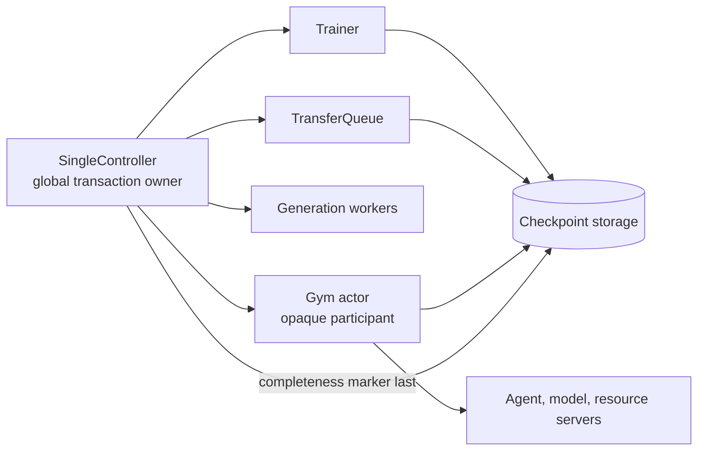

# Partial rollout checkpointing: NeMo Gym architecture proposal

## Executive summary

This proposal defines how NeMo Gym should preserve useful rollout work across a process, node, Ray, or Slurm failure without claiming that arbitrary environment execution can be replayed safely.

The v1 guarantee is deliberately narrow and testable:

- A completed result row survives once Gym has durably spooled it, even if the caller has not consumed it.
- Completed siblings in an incomplete sampling group survive. Recovery regenerates only missing siblings.
- A cooperative Gym agent can park after a completed model call or completed tool interaction, at a semantic boundary where its transcript, agent state, resource state, and token custody agree.
- An opaque blackbox harness can continue exactly from a saved runtime boundary only when its sandbox provider restores the full sandbox runtime, including process memory, process tree, open descriptors, and network-facing state, and the harness uses a checkpointed local egress sidecar that owns model and tool traffic. Restore still creates a new `attempt_id` linked to the saved attempt. A filesystem snapshot or reconnectable container alone is not sufficient.
- Any rollout that does not meet its class's continuation contract is redispatched from immutable input as a fresh attempt.
- General action replay is not a recovery mechanism. Tools, judges, simulators, clocks, networks, and external services can be nondeterministic or have non-idempotent side effects.

The `SingleController` in NeMo-RL owns the global checkpoint transaction. Gym is one opaque participant alongside the trainer, TransferQueue (TQ), and generation workers. The controller tells each Gym actor to prepare, commit into a controller-provided Gym directory, abort, restore, or resume. The controller seals its controller/TQ data-plane cut before Gym commit can reopen execution, then binds Gym's returned path and digest into the global checkpoint. It does not interpret Gym's files, environment snapshots, sandbox descriptors, or resume anchors.

Standalone Gym needs its own durable dispatch ledger because it has no `SingleController`. NeMo-RL must continue to use its own pending/inflight registry as the global source of dispatch intent; Gym's ledger does not replace or mirror that registry. The two ledgers have different authorities and meet through stable IDs.

## Status vocabulary

This document uses four status labels. Every architectural statement should be read with one of these labels in mind.

| Status | Meaning |
| --- | --- |
| **Current** | Behavior present on fetched `upstream/main` at commit `501a752cf`. |
| **Prototype** | Behavior demonstrated on an investigation or feature branch, but not part of `upstream/main`. |
| **Proposed v1** | Required for the first production checkpointing contract described here. |
| **Deferred** | A compatible extension that is not part of the v1 guarantee. |

### Current behavior on `upstream/main`

Current Gym materializes repeated rows in `RolloutCollectionHelper._preprocess_rows_from_config()` and writes `<output>_materialized_inputs.jsonl` in `RolloutCollectionHelper.run_from_config()`. Identity is primarily the pair `_ng_task_index` and `_ng_rollout_index`, with `_ng_attempt_index` added for retry capture separation. These are useful local coordinates, but materialized rows do not yet receive immutable UUID identities.

Current rollout collection appends successes to the requested result JSONL and non-kill-shaped failures to `<stem>_failures.jsonl`. Kill-shaped failures are intentionally absent from both files so resume-by-set-difference redispatches them. A fresh non-resume run clears both output files. The files are flushed per row, but the current path does not fsync each row and does not provide a completed-result spool distinct from the final JSONLs.

Current `resume_from_cache` reads materialized inputs, successes, and failure attempts. It prevents a success from being dispatched again and caps retries. It does not durably record dispatch admission before `/run`, distinguish assigned from acknowledged work, or checkpoint active agent and resource state.

Current model-call capture mints a UUID `model_call_id`, records request/response observability, and can capture token IDs through the token-capture sink. `TokenEntry` stores one call's prompt token IDs, generated token IDs, log probabilities, output items, and `model_call_id`. The prefix-merging builder reconstructs a trainable chain and fails closed on ambiguous or incomplete capture. The response-delivery path on current main can freeze a token source, rebuild a response, and apply masking or failure policy when capture is unsafe. This is capture, trajectory construction, and delivery, not a rollout checkpoint protocol.

Current sandbox providers expose create, execute, file transfer, status, and close. `ConnectableProvider.serialize_handle()` and `connect()` can rebuild a handle to a surviving provider-managed sandbox. Reconnection does not imply filesystem rewind, process-memory restore, or restoration of in-flight network requests.

### Prototype provenance

The token-capture foundation came from `354babf7e` (`feat(token-id-capture): capture training tokens from external harnesses`) and `945116e5e` (`feat(token-id-capture): chain a rollout's calls into one response`). Those changes establish call IDs, token records, capture stores, and chain construction.

Commit `a388757ef` on `ansubramania/session-state-prototype` contains investigation prototypes for resource export/restore, boundary records, checkpoint choreography, and a file-backed call ledger. Useful prototype ideas are incorporated here, but this proposal changes important conclusions:

- Replay is not a default recovery class.
- A blackbox harness is not resumable merely because its filesystem or native transcript survives.
- A blackbox continuation requires a full runtime snapshot and a checkpointed local egress sidecar.
- Gym's checkpoint contents remain opaque to the `SingleController`.
- Standalone Gym's dispatch ledger is distinct from NeMo-RL's pending/inflight registry.

### Deferred behavior

The following are explicitly deferred: partial-token checkpoints, vLLM KV-cache snapshots, general action replay, arbitrary Python-object serialization, and migration of full runtime images between incompatible kernels or providers. The v1 protocol includes `full_runtime` as an optional capability with a mandatory fresh-redispatch fallback. Concrete runtime-provider and harness integrations may land later or in parallel, but an integration that bypasses the checkpointed local egress sidecar never qualifies for exact continuation.

## Scope, non-goals, and guarantees

### Failure scope

The design covers:

- a Gym server process restart;
- a Gym actor or node loss;
- a generation worker loss;
- a full Ray cluster or Slurm allocation restart;
- interruption during checkpoint prepare or commit;
- interruption during restore;
- duplicated control requests and duplicated rollout dispatches.

The design does not promise zero lost computation after an unplanned node loss. It promises that recovery selects a valid durable prefix or starts a fresh attempt. A configured periodic pack interval determines how much node-local progress can be lost.

### Exact survival guarantee

For a checkpoint whose global completeness marker is durable:

1. Every completed result listed in the Gym manifest is recoverable and is emitted once to the authoritative result or failure JSONL.
2. Every completed sibling listed in the manifest is reused for its logical group if its policy, tokenizer, prompt-template, verifier, and dataset versions remain compatible.
3. An incomplete cooperative rollout restores from the newest boundary whose complete dependency closure is in the checkpoint: call records, token/TQ custody, boundary record, resource snapshots, and sandbox reference when required. Restore allocates a new `attempt_id` and links it to the saved attempt through `restores_attempt_id`.
4. An incomplete blackbox rollout restores exactly from a runtime boundary only when one snapshot atomically covers the harness runtime and its local egress sidecar, and restore can rebind the sidecar's external endpoints without losing or duplicating an acknowledged exchange. Restore allocates a new linked `attempt_id`.
5. Every other incomplete rollout receives a new `attempt_id` and starts from its immutable materialized input.

“Survives” means the data can be reconstructed from the committed checkpoint without relying on the dead process, node-local cache, wall clock, or a mutable “latest” pointer.

### Why replay is not a fallback

Stored tool calls and observations are evidence, not an executable recovery log. Reissuing a call can return different data, send a duplicate message, reserve inventory twice, mutate a repository twice, consume a one-time token, or observe a different clock. Even a nominally read-only tool can depend on a changing external service. V1 therefore restores explicit state or redispatches fresh. It never silently replays actions to approximate prior state.

Replay may be introduced later for a specific environment only if that environment defines an idempotency contract, records side-effect receipts, and tests deterministic reconstruction. That would be an environment-specific capability, not Gym's default.

## Ownership and transaction boundaries

### The SingleController owns the global transaction

The `SingleController` is the only coordinator that can declare a NeMo-RL checkpoint complete. It owns:

- the global checkpoint ID and monotonically increasing checkpoint sequence;
- the controller lease that prevents two active coordinators;
- rollout-group and sibling intent;
- NeMo-RL's pending/inflight/completed/consumed registry;
- trainer and policy checkpoint coordination;
- TQ checkpoint coordination;
- generation-worker admission and any worker-side sink barrier;
- the decision to commit or abort all participants;
- the final marker that binds participant outputs.

Gym is one opaque participant. A `NemoGym` actor may manage several Gym subprocesses and may shard work across nodes, but the `SingleController` sees only participant readiness, a commit success or failure, and restore dispositions keyed by IDs it already knows.



The `SingleController` never calls Gym resource servers, never parses a sandbox descriptor, and never reconstructs a conversation. Gym never commands RL-owned generation workers or writes the global marker.

### Standalone Gym owns a durable dispatch ledger

Standalone `gym eval run` has no external registry that can answer which immutable rows started, which nonterminal attempts have a complete boundary, and which rows are terminal. V1 first writes every repeated row to immutable `materialized_inputs.jsonl` with its stable rollout UUID. The complete file and its parent directory are fsynced before any dispatch can acquire a concurrency slot.

After a row acquires its concurrency slot, the dispatcher allocates an `attempt_id` and appends and fsyncs `dispatch_started(attempt_id)` immediately before invoking `/run`. A cooperative boundary contributes `boundary_committed(boundary_index, artifact_ref)` only after the complete boundary artifact and every referenced snapshot are durable. Failed execution appends either `retryable` or `terminal`; the existing result JSONL and failure JSONL remain the terminal authorities.

The core classification is exact:

| Classification | Durable evidence |
| --- | --- |
| Never dispatched | Materialized row exists and no `dispatch_started` exists for its rollout UUID. |
| Resumable | Latest dispatched attempt is nonterminal and has at least one `boundary_committed` record whose artifact validates. |
| Fresh redispatch | Latest dispatched attempt is nonterminal and has no valid committed boundary. |
| Done | The result JSONL contains a durable row for the rollout UUID. |
| Terminal | The failure JSONL contains a durable terminal-failure row for the rollout UUID. |

A crash after `dispatch_started` fsync but before the HTTP request is harmless: the stable rollout UUID is unchanged and recovery makes a fresh dispatch with a new `attempt_id`. A narrowly scoped transport redelivery may retain one already allocated `attempt_id` only when the dispatcher has positive evidence that execution never started; this is idempotent delivery, not checkpoint restore.

Dispatch events are a logical storage interface, not a mandate for one file layout. A standalone deployment may use append-and-fsync JSONL on a verified shared durable filesystem or immutable event objects on object storage. A ledger on local NVMe guarantees only same-node process recovery unless a committed checkpoint has already copied and bound its bytes.

Completed-result spool and retirement records may support crash-safe emission and garbage collection. They do not add states to or override this classification.

### NeMo-RL keeps its own pending/inflight registry

When Gym runs under NeMo-RL, the controller registry remains authoritative for global dispatch intent and group membership. Gym still writes its internal artifacts, but its dispatch events are receipts about work that reached Gym, not a replacement controller.

The separation prevents two bad designs:

- The `SingleController` must not learn Gym-internal boundary or resource schemas merely to decide whether a logical sibling is pending.
- Gym must not infer global group completion or trainer consumption from local files.

The join is:

```text
run_id + materialized_input_id + logical_rollout_id + attempt_id
```

The controller assigns all four values. Standalone Gym assigns them itself. `logical_rollout_id` is the stable rollout UUID and remains unchanged across all executions. Every checkpoint restore allocates a new `attempt_id`, whether it restores a cooperative boundary, a full runtime, or immutable input. The new attempt records `restores_attempt_id` when it consumes a saved attempt's artifacts and `parent_attempt_id` when it is otherwise derived from a prior attempt.

## Stable identities

V1 uses UUIDs for durable identity and integers only as human-readable coordinates:

| Field | Stability and owner |
| --- | --- |
| `run_id` | UUID for one logical collection or training run. Assigned by the outermost coordinator. |
| `materialized_input_id` | UUID written once into immutable materialized input. Stable across retries and siblings derived from that row. |
| `group_id` | UUID for a sampling or comparison group. Stable until the group is consumed or terminally abandoned. |
| `logical_rollout_id` | Stable rollout UUID for one sibling slot within a group. Written into immutable materialized input and unchanged across attempts. |
| `attempt_id` | UUID for one execution attempt. Every checkpoint restore or fresh redispatch allocates a new value. Only proven pre-execution transport redelivery may reuse it. |
| `restores_attempt_id` | Attempt whose committed boundary or full runtime image supplies the new attempt's initial state. Null for an input-fresh attempt. |
| `parent_attempt_id` | Prior attempt from which this attempt is causally derived when it is not consuming a checkpoint boundary. |
| `dispatch_epoch` | Monotonic integer for transport fencing within one allocated attempt. A server rejects an older epoch. It does not span checkpoint restore. |
| `model_call_id` | UUID minted once at model admission. Never reused. Retries deduplicate through a separate `logical_request_id`. |
| `logical_request_id` | Caller-generated stable ID for retries of one model request. |
| `boundary_id` | UUID for one committed semantic boundary; `boundary_index` is monotonic within an attempt. |
| `tool_call_id` | Protocol call ID or Gym UUID when the protocol supplies none. |
| `snapshot_id` | UUID for an immutable resource or runtime snapshot. |
| `checkpoint_id` | UUID plus a monotonic sequence owned by the global coordinator. |

`_ng_task_index`, `_ng_rollout_index`, and `_ng_attempt_index` remain projections for compatibility. They are not checkpoint primary keys.

## Artifact inventory and schemas

All JSON schemas include `schema_version`, `run_id`, and a content digest where the artifact can outlive the process that wrote it. Readers reject unsupported newer schema versions and fail closed on digest or identity disagreement.

### Immutable materialized inputs

`materialized_inputs.jsonl` is immutable and completely durable before dispatch begins. The full file is written to a temporary name and fsynced, renamed, and followed by a parent-directory fsync before any row may acquire a concurrency slot.

```json
{
  "schema_version": 1,
  "run_id": "4b034b41-f391-4c55-93e2-c62cf30c36a8",
  "materialized_input_id": "b219c44e-67b7-4c38-ad6a-0a19893da049",
  "logical_rollout_id": "b9bea4bb-a30d-4ea9-aa33-ae942b2da40f",
  "group_id": "bfefdd0c-7de4-43af-87b5-8a197cfb0997",
  "source_digest": "sha256:...",
  "materialization_digest": "sha256:...",
  "_ng_task_index": 17,
  "responses_create_params": {"input": []},
  "verifier_metadata": {},
  "agent_ref": {"name": "simple_agent"}
}
```

Changing prompt expansion, skills, agent selection, or verifier metadata creates a new materialization digest and therefore a new run or explicit migration. Recovery never combines a result with a row whose digest changed.

### Dispatch events

The dispatch event interface is append-only and idempotently foldable. This example is the JSONL representation; object storage writes one immutable object with the same schema:

```json
{
  "schema_version": 1,
  "event_id": "d39e3d82-40c9-4bc9-b4fd-1e58ab637e9f",
  "run_id": "...",
  "materialized_input_id": "...",
  "group_id": "...",
  "logical_rollout_id": "...",
  "attempt_id": "...",
  "restores_attempt_id": null,
  "parent_attempt_id": null,
  "dispatch_epoch": 2,
  "event": "dispatch_started",
  "agent_name": "tau2",
  "policy_version": "sha256:...",
  "occurred_at": "2026-08-26T09:00:00Z",
  "previous_event_id": "..."
}
```

`dispatch_started` is fsynced immediately before `/run`. `boundary_committed` adds `boundary_index` and `artifact_ref` and is written only after the complete referenced artifact is durable. `retryable` and `terminal` carry failure classification and a failure-row reference where applicable. Timestamps support operations only. Event order comes from append position or immutable event sequence and `previous_event_id`, not synchronized clocks.

### Boundary artifacts

Cooperative agents write `boundaries.jsonl`. A boundary is after a model response with no pending environment interaction, or after all tool calls for a step have completed and their results have been appended, immediately before the next model request.

```json
{
  "schema_version": 1,
  "run_id": "...",
  "attempt_id": "...",
  "boundary_id": "...",
  "boundary_index": 7,
  "boundary_kind": "tool_complete",
  "model_call_id": "...",
  "response_id": "resp_...",
  "response_digest": "sha256:...",
  "tool_results": [{"type": "function_call_output", "call_id": "...", "output": "..."}],
  "agent_state": {"step": 7, "remaining_budget": 13},
  "usage": {"input_tokens": 1000, "output_tokens": 250},
  "resource_snapshots": [{"resource_server": "workplace_assistant", "snapshot_id": "..."}],
  "sandbox_runtime_ref": null
}
```

The model call's committed ledger row contains the assistant output. The boundary stores environment-authored items and opaque agent-loop state. `model_call_id` is the primary join. `response_id` and `response_digest` corroborate it and fail closed on disagreement.

### Token and TQ custody

The token-bearing fact remains owned where it is produced. A custody record joins Gym's call ledger to a file record or TQ staging key:

```json
{
  "schema_version": 1,
  "run_id": "...",
  "attempt_id": "...",
  "model_call_id": "...",
  "parent_model_call_id": "...",
  "actor": "policy",
  "policy_version": "sha256:...",
  "tokenizer_version": "sha256:...",
  "prompt_template_version": "sha256:...",
  "staging_key": "rollout_staging/.../...",
  "prompt_length": 4096,
  "generation_length": 812,
  "token_digest": "sha256:...",
  "logprob_digest": "sha256:...",
  "prefix_verified": true
}
```

In staged mode, the generation worker writes token IDs, masks, log probabilities, and routed experts to `rollout_staging` before returning commit coordinates. In file mode, Gym's token store owns the `TokenEntry`. The Gym manifest records which custody mode and keys the boundary requires. TQ snapshots are immutable and digest-bound by the global marker.

Actor tags separate `policy`, `environment`, and `internal_eval` model calls. Only `policy` calls enter the training chain. During draining, environment judges and simulators that were already admitted may finish; new calls of every role remain closed.

### Resource snapshots

Resource servers expose capabilities instead of relying on type guesses:

```json
{
  "schema_version": 1,
  "snapshot_id": "...",
  "attempt_id": "...",
  "boundary_id": "...",
  "resource_server": "workplace_assistant",
  "capability": "logical_snapshot",
  "codec": "workplace-assistant-state",
  "codec_version": 2,
  "payload_ref": "snapshots/workplace_assistant/....json",
  "payload_digest": "sha256:...",
  "external_receipts": []
}
```

The snapshot is immutable. Export writes and fsyncs the payload before the boundary references it. Restore validates codec compatibility before mutating a live session.

### Sandbox and runtime references

A sandbox artifact says exactly what survived:

```json
{
  "schema_version": 1,
  "snapshot_id": "...",
  "provider": "opensandbox",
  "capability": "reconnect",
  "owner_lease_id": "...",
  "sandbox_id": "...",
  "descriptor_ref": "snapshots/sandbox/....json",
  "filesystem_snapshot_ref": null,
  "runtime_snapshot_ref": null,
  "egress_sidecar_snapshot_ref": null,
  "expires_at": "2026-08-27T09:00:00Z"
}
```

`reconnect`, `filesystem_snapshot`, and `full_runtime` are different capabilities. The record must not promote one to another.

### Completed-result spool

Before a completed `/run` response is acknowledged to the dispatch loop, Gym writes an immutable spool object:

```json
{
  "schema_version": 1,
  "spool_id": "...",
  "run_id": "...",
  "materialized_input_id": "...",
  "logical_rollout_id": "...",
  "attempt_id": "...",
  "disposition": "success",
  "result_digest": "sha256:...",
  "result": {},
  "created_at": "2026-08-26T09:12:00Z"
}
```

The spool closes the crash window between `/run` completion and append to the user-facing JSONL. A deterministic emitter appends the result to the authoritative JSONL and may then record a supporting spool-emitted event. On restore it deduplicates by stable rollout UUID, `attempt_id`, and digest. The spool never overrides the result and failure JSONLs as terminal authority.

### Authoritative result and failure JSONLs

The requested result JSONL remains authoritative for successful, aggregatable rollout rows. `<stem>_failures.jsonl` remains authoritative for persisted failures, with its terminal marker distinguishing terminal failure from retryable history. A kill-shaped attempt may be absent from both only when it has neither a completed spool object nor a terminal disposition.

Every emitted row carries `materialized_input_id`, `logical_rollout_id`, `attempt_id`, `result_digest`, and compatibility indices. Duplicate byte-identical rows can be compacted, but conflicting rows for one `attempt_id` are corruption.

### Abandoned model-attempt tombstones

When recovery continues from an earlier boundary or creates a fresh attempt, it writes a tombstone for post-anchor calls and superseded attempts:

```json
{
  "schema_version": 1,
  "run_id": "...",
  "logical_rollout_id": "...",
  "attempt_id": "...",
  "abandoned_after_model_call_id": "...",
  "abandoned_model_call_ids": ["..."],
  "staging_keys": ["rollout_staging/..."],
  "reason": "post_anchor_orphan",
  "replacement_attempt_id": "...",
  "replacement_restores_attempt_id": "..."
}
```

Finalization excludes tombstoned calls even if their TQ rows survived. Garbage collection may remove their staging keys only after no live checkpoint references them.

### Gym manifest

During `commit_checkpoint`, each Gym participant writes `gym-manifest.json` inside the fresh Gym-owned subdirectory that the `SingleController` provided within its temporary checkpoint:

```json
{
  "schema_version": 1,
  "checkpoint_id": "...",
  "checkpoint_sequence": 42,
  "participant_id": "gym-node-3",
  "materialized_inputs": {"ref": "materialized_inputs.jsonl", "digest": "sha256:..."},
  "dispatch_ledger": {
    "backend": "append_jsonl",
    "ref": "dispatch_events.jsonl",
    "synced_length": 183721,
    "digest": "sha256:..."
  },
  "archives": [{"ref": "gym-state-000.tar.zst", "digest": "sha256:..."}],
  "rollouts": {
    "logical-rollout-uuid": {
      "attempt_id": "...",
      "state": "parked",
      "resume_class": "cooperative",
      "anchor_boundary_id": "...",
      "required_staging_keys": ["..."],
      "completed_spool_ref": null
    }
  },
  "result_spool": [{"spool_id": "...", "ref": "...", "digest": "sha256:..."}],
  "abandoned_tombstones": [{"ref": "...", "digest": "sha256:..."}],
  "manifest_digest": "sha256:..."
}
```

The manifest is Gym's opaque restore root. The shown dispatch descriptor is for the append-JSONL backend; an object-store backend records its immutable object prefix, event sequence, and aggregate digest instead. Gym fsyncs the package and returns the manifest path and digest. The `SingleController` binds only that path and digest in its global checkpoint; it never parses the child references.

## Normal artifact production

Normal execution must create enough durable state that checkpoint commit mostly packages existing facts.

### Dispatch and seed

1. Materialization writes a stable rollout UUID into every repeated row, fsyncs the complete immutable file, renames it, and fsyncs its parent directory.
2. A row acquires its concurrency slot.
3. The dispatcher allocates `attempt_id`, appends and fsyncs `dispatch_started`, and immediately invokes `/run`.
4. The agent validates the rollout UUID, attempt linkage, and dispatch epoch. It rejects a lower epoch or a concurrent delivery of the same attempt.
5. A cooperative agent seeds resources idempotently and commits boundary 0. If seed allocates a sandbox, the allocation registry is durable before the allocation is returned.

If the process dies after `dispatch_started` but before HTTP execution, recovery classifies the rollout as dispatched, nonterminal, and without a boundary. It preserves the stable rollout UUID and allocates a new attempt for fresh redispatch. A transport layer that can prove the request never executed may redeliver the original allocated attempt instead, but checkpoint recovery never does so.

### One cooperative model/tool step

1. The agent checks its drain flag before admitting a model call of any role.
2. The model server publishes the request in its in-flight counter, then checks the process-shared admission state.
3. It deduplicates `logical_request_id`, resolves the parent call, mints `model_call_id`, and durably records intent.
4. The generation worker produces tokens and stores token/TQ data before acknowledging the call.
5. The model server commits call lineage, input delta, output items, and custody coordinates before releasing the terminal response event.
6. If no environment interaction is pending, the agent may commit a `model_complete` boundary.
7. If tool calls exist, the agent executes them. When all effects and returned observations are known, each resource server exports its state.
8. Resource snapshot payloads commit before the agent appends the boundary record.
9. The agent appends and fsyncs `boundary_committed(boundary_index, artifact_ref)` only after the complete boundary artifact is durable.
10. The next model call is allowed only after `boundary_committed` is durable.

The boundary means the transcript and restorable resource state describe the same semantic instant.

### Completion and result emission

1. The agent returns the final result.
2. The Gym actor writes and fsyncs the completed-result spool object.
3. The result emitter appends and durably flushes the success or failure row to its authoritative JSONL. The result JSONL makes the rollout `done`; a terminal row in the failure JSONL makes it `terminal`.
4. A nonterminal failure appends and fsyncs `retryable`. A terminal failure appends and fsyncs `terminal` after its authoritative failure row is durable.
5. Supporting spool-emitted or retirement events may be recorded, but recovery classification continues to derive terminal state from the result and failure JSONLs.
6. NeMo-RL reports completion to the controller registry. Standalone Gym folds its dispatch interface against the authoritative JSONLs.
7. Finalization verifies token custody and publishes training rows.
8. Retirement begins only after the owning coordinator marks the logical rollout consumed, terminally failed, or superseded.

## Model admission pause and drain

### V1 state machine

The model admission controller gates every generation request whose response can mutate checkpointed rollout, resource, verifier, or agent state. The gate covers OpenAI Responses (`/v1/responses`), Chat Completions (`/v1/chat/completions`), and Anthropic Messages (`/v1/messages`), including their capture-prefixed variants. Health, status, metrics, and authenticated administrative routes remain available.

| State | New model calls of any role | Already-admitted policy, environment, and internal-eval calls |
| --- | --- | --- |
| `accepting` | Admit | Run |
| `draining` | Do not admit; cooperative callers park and blackbox callers wait at their sidecar | Finish until the deadline so the action they already started can reach a boundary |
| `paused` | Closed | None; the actor does not report prepared while any role remains in flight |

The transition is `accepting → draining → paused → accepting`. Abort may transition `draining` or `paused` back to `accepting`.

### Counters and publish-before-check

Each generation request on every gated dialect increments a process-local visible counter before reading the shared state. It decrements on every exit path. The status route aggregates:

- admitted policy requests;
- admitted environment requests;
- admitted internal-eval requests;
- in-flight generations for every role and dialect;
- calls waiting before admission;
- dangling durable intents;
- last committed call sequence.

There must be no `await` between a coroutine's counter read/update/write unless a lock protects it. Counter records carry a worker incarnation. Startup and status ignore dead incarnations.

Publish-before-check closes the race where a request passes the pause check just before prepare sees zero. A wrong count may delay prepare, but must not make an uncommitted call part of an anchor.

### Timeouts stay closed

After the drain deadline, model admission stays closed for every role and dialect. The actor reports stragglers instead of reopening admission to make prepare succeed. It transitions to `paused` only after every admitted policy, environment, and internal-eval call has finished or been conclusively abandoned. Cooperative rollouts that have not parked retain their last durable anchor or become fresh-redispatch candidates. Blackbox rollouts without a complete runtime cut become fresh-redispatch candidates.

Commit and abort are the only operations that release the closed state. A controller crash cannot rely on an in-memory timeout to reopen it. Startup clears stale controls only after establishing that no live checkpoint owner holds the lease.

### Multi-worker issue

An in-memory flag or counter is incorrect when a model server uses multiple uvicorn workers. V1 requires a process-shared admission state, such as a flock-protected sentinel/state file plus per-worker atomic counter files, or an equivalent shared service. One worker handles the control request; every worker must observe the new generation before admitting its next request.

Status is not just `paused: true`. It returns the generation number of the shared state, worker incarnations observed, and per-plane counts so the actor can detect a missing or stale worker.

### Why model pause is necessary but insufficient

Pause is necessary because every generation route that can alter checkpointed state passes through the model service or the blackbox sidecar. It prevents new policy token/TQ writes, simulator observations, judge decisions, or internal-evaluation results while the global cut is sealed.

Pause is insufficient because:

- a cooperative agent can be mid-tool, where the environment has changed but the transcript does not yet contain the observation;
- a resource server can have unexported logical state;
- a sandbox filesystem can be changing after model traffic stops;
- a blackbox harness can continue local shell, browser, or subagent work without making a model call;
- network requests already left the sandbox;
- completed `/run` responses can be waiting between the server and result JSONL;
- multiple model traffic roles share the server, so drain must account for already-admitted judge and simulator calls before declaring the system paused.

The full prepare protocol therefore combines admission closure across all generation dialects and roles, completion of already-admitted calls, cooperative boundary parking, runtime/provider quiescence, result-spool reconciliation, and per-rollout classification. It does not allow new environment or internal-eval calls indefinitely after admission closes.

## Cooperative-agent flow

A cooperative agent is a loop Gym controls and can modify. It reports whether it is before a model call, in generation, executing tools, committing a boundary, parked, or terminal.

### Save behavior

When drain begins, the agent:

1. does not start a new model call of any role after drain admission closes;
2. lets an already admitted policy, environment, or internal-eval call finish and commit;
3. finishes already issued tool calls when they complete before the deadline;
4. exports every stateful resource regardless of normal snapshot cadence;
5. commits a boundary;
6. parks before the next model call;
7. reports `parked` and the boundary ID.

If the deadline expires mid-tool, a new attempt can restore the previous attempt's boundary only if restore replaces all affected state with the previous snapshot. A live sandbox that cannot rewind is not eligible for that anchor and must start fresh.

### Restore behavior

Gym reconstructs the transcript by walking committed parent links to the anchor, verifying each digest, concatenating input deltas and output items, then appending the anchor's environment-authored items. It restores resource snapshots before entering the loop and checks that the explicit resume marker agrees with files on disk.

Restore allocates a new `attempt_id` with `restores_attempt_id` set to the saved attempt. The stable rollout UUID remains unchanged. The restored `/run` receives the reconstructed boundary, the new attempt identity, and an explicit restore marker. Its next model request receives a new `model_call_id` whose parent is the anchor call from the restored attempt. The abandoned attempt's post-boundary model roots are tombstoned.

## Opaque blackbox-harness flow

An opaque harness owns its loop, subprocesses, memory, and local tool sequencing. Examples include a CLI coding agent running inside a sandbox. Gym may launch and observe it, but cannot assert that “between model calls” is a semantic boundary.

### Optional v1 `full_runtime` capability

The v1 protocol defines `full_runtime` as an optional capability. Fresh redispatch is mandatory for every provider/harness pair that does not implement it. Exact continuation from a blackbox runtime boundary requires all of the following:

1. **Full runtime snapshot:** the provider captures process memory, process tree, namespaces, mounts, filesystem, open file descriptors, terminal state, and restorable local sockets at one provider-defined cut.
2. **Checkpointed local egress sidecar:** every model request, resource/MCP call, and externally side-effecting request under the recovery contract goes through a sidecar in the same snapshot domain. The sidecar durably records request IDs, response acknowledgements, body digests, and delivery state.
3. **External endpoint rebinding:** restore can replace dead Gym endpoints and credentials in the sidecar without modifying opaque harness memory.
4. **Provider quiescence contract:** snapshot either freezes the runtime and sidecar atomically or proves an ordering that cannot lose or duplicate an acknowledged exchange.
5. **Compatibility validation:** kernel, container runtime, CPU architecture, provider version, and networking mode match the snapshot.

The sidecar is load-bearing. A runtime snapshot taken while an HTTP request is in an external proxy can restore a process that believes the request is outstanding while the remote service has already committed it. The sidecar resolves that ambiguity through stable request IDs and checkpointed delivery state.

### Blackbox save behavior

Model admission enters `draining`, and new sidecar generation requests of every role wait locally. Already-admitted calls may finish. The harness may still execute local tools, so the provider then freezes the complete runtime and sidecar, exports an immutable runtime reference, and only after export succeeds reports the attempt prepared.

If the provider can snapshot only the filesystem, or if any required egress bypasses the sidecar, Gym marks the attempt `fresh_redispatch`. It may still preserve completed model calls for diagnostics or future siblings, but it does not splice them into a continued opaque process.

### Blackbox restore behavior

Restore allocates a new `attempt_id` linked through `restores_attempt_id`, while preserving the stable rollout UUID. The provider restores the runtime image and sidecar as one unit under the new attempt's ownership lease. Gym reissues endpoints and short-lived credentials to the sidecar, verifies all outstanding exchanges, then unfreezes the harness. The harness sees its original process memory and local connection to the sidecar; it does not need a resume flag.

Model pause alone is insufficient because the opaque process can mutate its workspace and internal state while policy calls are blocked. Filesystem recovery alone is insufficient because stack frames, parser state, child processes, PTYs, and acknowledged-but-not-persisted tool results can be missing.

### Periodic cuts without runtime support

A blackbox harness may remain alive through a periodic checkpoint pause and continue afterward. That does not make it restorable from that checkpoint. The manifest records `resume_class: fresh_redispatch` unless a full runtime cut succeeded.

## Resource and sandbox capability contracts

### Resource server API

Each resource server declares one of:

- `stateless`: no episode state survives a request;
- `logical_snapshot`: export/restore completely describes episode state;
- `logical_snapshot_external`: logical state plus immutable external receipts or provider references;
- `unsupported`: no continuation guarantee.

The lifecycle hooks are:

```python
capabilities() -> ResourceCapabilities
export(session_id, boundary_id) -> ResourceSnapshot
restore(target_session_id, snapshot, attempt_id, restores_attempt_id) -> RestoreReceipt
retire(session_id, disposition) -> RetireReceipt
```

`export` is idempotent by `(session_id, boundary_id)`. `restore` is idempotent by `(target_session_id, snapshot_id, attempt_id)` and rejects a different source attempt for an existing target. `retire` is idempotent and must not destroy state pinned by a live checkpoint.

### Sandbox capability ladder

| Capability | What restore gets | Cooperative use | Blackbox use |
| --- | --- | --- | --- |
| `reconnect` | A handle to the same still-running sandbox | Valid if the boundary proves no post-boundary mutation | Insufficient |
| `filesystem_snapshot` | Files plus bootstrap metadata in a new runtime | Valid for agents whose contract reconstructs all process state from files | Insufficient |
| `full_runtime` | Filesystem, process memory, process tree, descriptors, runtime metadata | Valid | Necessary but still requires checkpointed local egress sidecar |
| `none` | No restorable sandbox state | Fresh redispatch | Fresh redispatch |

### Owner, borrower, detach, and destroy

The component that creates a sandbox receives an owner lease. Restore first receives a borrower lease to validate the same provider object while it is frozen, then transfers ownership to the newly allocated attempt. Closing a borrower detaches its client and must not destroy the sandbox. Closing the owner destroys the sandbox only when no live checkpoint pins it and no restore transfer is in progress.

Lifecycle operations are explicit:

- `detach(handle, lease_id)`: release this client's connection;
- `destroy(handle, owner_lease_id)`: terminally remove provider resources;
- `retire(snapshot_id)`: release a checkpoint pin;
- `transfer_owner(old_lease, new_lease)`: used during restore after liveness verification.

Using one ambiguous `close()` verb for all four operations risks deleting a sandbox during checkpoint packaging or leaking it after a fresh redispatch.

## SC-facing Gym actor methods

The proposed checkpoint surface is intentionally small:

```python
async def prepare_checkpoint(
    checkpoint_id: str,
    deadline_unix_ms: int,
    rollout_ids: list[str],
) -> PrepareReport: ...
async def commit_checkpoint(checkpoint_id: str, checkpoint_dir: str) -> CommitReport: ...
async def abort_checkpoint(checkpoint_id: str) -> AbortReport: ...
async def restore_checkpoint(
    checkpoint_dir: str,
    assignments: list[RestoreAssignment],
) -> RestoreReport: ...
async def resume(checkpoint_id: str) -> ResumeReport: ...
```

`RestoreAssignment` contains the stable rollout UUID, a newly allocated `attempt_id`, `restores_attempt_id` when a saved boundary or runtime supplies initial state, and the selected restore disposition. The actor never interprets a restore assignment as permission to reuse the source attempt ID.

`prepare_checkpoint` folds dispatch fencing into the participant prepare operation. It fences new Gym dispatch, drains every model role and dialect, quiesces targeted cooperative and blackbox execution, forces required resource exports, classifies every requested rollout, and remains closed. It may create immutable hot-path children, but it does not package them into the controller checkpoint. The report uses controller vocabulary:

```json
{
  "checkpoint_id": "...",
  "participant_id": "gym-node-3",
  "state": "prepared",
  "dispatch_fenced": true,
  "admission_state": "paused",
  "rollouts": [
    {
      "logical_rollout_id": "...",
      "attempt_id": "...",
      "disposition": "parked",
      "continuation": "restore_boundary"
    },
    {
      "logical_rollout_id": "...",
      "attempt_id": "...",
      "disposition": "quiet_blackbox",
      "continuation": "fresh_redispatch"
    }
  ],
  "stragglers": [],
  "control_generation": 18
}
```

After the `SingleController` has sealed its controller/TQ data-plane cut, `commit_checkpoint` packages the prepared Gym cut inside the provided fresh Gym-owned checkpoint subdirectory. It fsyncs the package and opaque manifest, then returns the manifest path and digest:

```json
{
  "checkpoint_id": "...",
  "participant_id": "gym-node-3",
  "state": "committed",
  "manifest_path": "gym/gym-node-3/gym-manifest.json",
  "manifest_digest": "sha256:...",
  "bytes_written": 188273002,
  "admission_state": "accepting"
}
```

Successful commit immediately releases Gym's internal quiescence and resumes dispatch and model admission. The controller binds the returned path and digest later when it publishes the global checkpoint. It does not receive anchors or snapshot payloads. A failed commit leaves Gym closed so the controller can retry or abort.

`restore_checkpoint` reports the use of newly allocated identities without exposing Gym's anchor payload:

```json
{
  "checkpoint_id": "...",
  "participant_id": "gym-node-3",
  "state": "restored",
  "rollouts": [
    {
      "logical_rollout_id": "...",
      "attempt_id": "new-attempt-uuid",
      "restores_attempt_id": "saved-attempt-uuid",
      "disposition": "restore_boundary"
    },
    {
      "logical_rollout_id": "...",
      "abandoned_attempt_id": "saved-attempt-uuid",
      "disposition": "fresh_redispatch"
    }
  ]
}
```

`restore_checkpoint` validates the packaged manifest and restores assigned state while Gym remains paused. `resume(checkpoint_id)` activates restored and fresh attempts only after the controller confirms that every global participant is ready. Attempt and snapshot retirement is a separate maintenance API, not a primary checkpoint transaction method.

## Internal `/ng-control/v1` APIs

All routes require the existing internal authentication boundary plus `checkpoint_id` and participant fencing. They are idempotent.

### Model admission

`POST /ng-control/v1/model-admission/drain`

```json
{
  "checkpoint_id": "...",
  "control_generation": 18,
  "deadline_unix_ms": 1787742000000,
  "roles": ["policy", "environment", "internal_eval"],
  "dialects": ["responses", "chat_completions", "anthropic_messages"],
  "hold_blackbox_requests": true
}
```

```json
{
  "state": "draining",
  "control_generation": 18,
  "counts": {
    "policy_admitted": 9,
    "policy_waiting": 31,
    "environment_admitted": 2,
    "internal_eval_admitted": 0,
    "total_inflight": 11
  }
}
```

`POST /ng-control/v1/model-admission/pause` succeeds only when all role and dialect in-flight counts are zero, then transitions from draining to closed. `POST /ng-control/v1/model-admission/accept` requires the matching checkpoint ID and generation. `GET /ng-control/v1/model-admission/status` returns state, per-role and per-dialect counts, worker incarnations, dangling intents, and last commit sequence. Health and administrative routes do not pass through this generation gate.

### Cooperative agent drain

`POST /ng-control/v1/agents/drain`

```json
{
  "checkpoint_id": "...",
  "deadline_unix_ms": 1787742000000,
  "attempt_ids": ["..."],
  "force_resource_export": true
}
```

`GET /ng-control/v1/agents/status?checkpoint_id=...` returns:

```json
{
  "attempts": {
    "...": {
      "position": "parked",
      "boundary_id": "...",
      "resumable": true
    },
    "...": {
      "position": "mid_tool",
      "boundary_id": "...",
      "resumable": false
    }
  }
}
```

### Resource lifecycle

`GET /ng-control/v1/resources/capabilities` returns versioned capability declarations.

`POST /ng-control/v1/resources/export`

```json
{
  "checkpoint_id": "...",
  "attempt_id": "...",
  "boundary_id": "...",
  "force": true
}
```

The response carries snapshot metadata and an opaque payload reference, never an arbitrary live Python object.

`POST /ng-control/v1/resources/restore` accepts `snapshot_id`, expected codec version, the new `attempt_id`, `restores_attempt_id`, and target session identity. It rebinds saved state to the new attempt and never revives the source attempt's ownership. `POST /ng-control/v1/resources/retire` accepts snapshot IDs and terminal disposition.

### Runtime snapshot

`GET /ng-control/v1/runtime/capabilities` returns `none`, `reconnect`, `filesystem_snapshot`, or optional v1 `full_runtime`, plus provider and codec versions. `POST /ng-control/v1/runtime/prepare` freezes a blackbox runtime and local egress sidecar. `POST /ng-control/v1/runtime/export` returns the immutable runtime reference. `POST /ng-control/v1/runtime/restore` accepts the newly allocated `attempt_id`, `restores_attempt_id`, a new owner lease, and new sidecar endpoint bindings:

```json
{
  "checkpoint_id": "...",
  "runtime_snapshot_id": "...",
  "attempt_id": "new-attempt-uuid",
  "restores_attempt_id": "saved-attempt-uuid",
  "owner_lease_id": "new-owner-lease",
  "sidecar_bindings": {
    "model_base_url": "http://...",
    "resources_base_url": "http://..."
  }
}
```

The restore response reports the new owner lease, sidecar reconciliation status, and whether the runtime remains frozen. `POST /ng-control/v1/runtime/unfreeze` is allowed only after sidecar reconciliation.

## Save, commit, abort, and restore choreography

### Prepare

1. The `SingleController` acquires or renews its lease and allocates a fresh temporary checkpoint directory.
2. It freezes checkpoint target membership and establishes a policy-compatibility fence. A rollout created later is post-cut work and is not added to this checkpoint.
3. It calls `prepare_checkpoint(checkpoint_id, deadline, rollout_ids)` on each Gym actor. That one call fences new Gym dispatch and reconciles the controller's targeted IDs with Gym arrival receipts.
4. Each Gym actor changes model admission for all generation roles and dialects to `draining` and activates cooperative agent drain.
5. Cooperative rollouts independently finish to a semantic boundary, force resource export, and park. Terminal rollouts enter the completed-result spool.
6. Blackbox providers attempt a runtime-plus-sidecar cut. Those without the full capability are classified for fresh redispatch.
7. Gym reconciles result spool objects, authoritative JSONLs, dispatch events, call intents, boundary records, resource snapshots, and sandbox/runtime custody.
8. At the deadline, model admission remains closed. It reaches `paused` only after every already-admitted call of every role and dialect is finished or abandoned; otherwise Gym reports a prepare straggler rather than falsely reporting quiescence.
9. Gym classifies every targeted rollout and returns the prepare report while remaining quiesced. The controller decides whether that prepared cut is acceptable without asking Gym to disclose internal anchors.

Prepare creates no package inside the global checkpoint. It may create immutable hot-path children, including boundary artifacts, resource snapshots, completed-result spool objects, and runtime snapshots. Abort does not roll these writes back.

### Seal the controller and TQ data-plane cut

1. After all required Gym participants are prepared, the controller establishes and seals the controller/TQ cut.
2. It waits for in-flight TQ finalizers and any generation-worker sink barrier required to make the saved TQ state immutable.
3. It records the controller pending/inflight/completed state that corresponds to that TQ cut.
4. It may start or continue trainer, model, and policy saves that do not mutate the sealed rollout data plane.

This ordering is load-bearing: the controller/TQ data-plane cut must be sealed before Gym commit can reopen Gym dispatch and model admission. Every Gym or TQ write after reopening belongs to the next checkpoint and must be unable to enter the saved TQ state.

### Commit

1. The controller creates a fresh Gym-owned subdirectory inside its temporary checkpoint and calls `commit_checkpoint(checkpoint_id, checkpoint_dir)` on each prepared Gym actor.
2. Each actor freezes maintenance retirement while packaging immutable materialized inputs, the prepared dispatch-ledger prefix, call and boundary logs, resource snapshots, sandbox/runtime references, result spool, and tombstones.
3. For each attempt, Gym computes the newest anchor whose complete dependency closure belongs to the prepared cut. It excludes boundary rows whose call, token custody, snapshot, or runtime dependency is absent.
4. Gym writes archive data and indexes to temporary names inside its assigned directory. It writes the opaque manifest last, fsyncs every package file, renames temporary files, and fsyncs the Gym directory.
5. Gym durably records the successful commit outcome for idempotent retry, immediately releases its dispatch, agent, runtime, resource, and model-admission quiescence, and returns the manifest path and digest.
6. If packaging or durability fails, Gym returns failure and remains closed. The controller may retry the same fenced commit or call abort.
7. After every Gym commit succeeds, the controller waits for remaining trainer and model asynchronous saves. It must not swap or mutate policy weights incompatibly between the sealed data-plane cut and global publication.
8. The controller writes its global manifest or `training_info.json` last. It binds the sealed controller/TQ state, trainer and model references, worker state, and every Gym manifest path plus digest.
9. The controller atomically publishes the complete checkpoint and fsyncs the checkpoint root. This is the only global publication point.
10. The controller releases the policy-compatibility fence after publication or after deciding that failed publication will be abandoned.

Gym can be running during steps 7–9. Its new rollout and TQ writes are post-cut state for the next checkpoint. The sealed TQ snapshot and stable policy compatibility fence prevent those writes from contaminating the checkpoint being published.

### Abort

Abort is idempotent across two distinct states:

1. If Gym is still prepared or a commit failed, `abort_checkpoint(checkpoint_id)` removes an incomplete temporary Gym package when safe, marks any complete but unbound package as garbage-collection eligible, releases internal quiescence, and resumes dispatch and admission.
2. If Gym commit succeeded and resumed but global publication later failed, abort performs only bookkeeping and marks the unreferenced Gym package as garbage-collection eligible. It does not pause or roll back the live job.
3. In both states, abort leaves normal immutable hot-path artifacts intact. It releases maintenance pins and unfreezes temporary runtime cuts only when no live checkpoint reference needs them.

Abort never rolls back immutable child writes, authoritative result/failure rows, or post-cut execution. Repeated abort requests are harmless.

### Restore

1. The controller selects the highest checkpoint sequence with a valid completeness marker, not the newest mtime.
2. It validates every bound participant digest before starting mutable services.
3. It restores trainer, TQ, and generation workers. Worker capture sinks are installed before model admission opens for any role or dialect.
4. It creates current Gym actors and builds `RestoreAssignment` values without requiring the same node count or original node. Each pending logical rollout receives a new candidate `attempt_id`; a candidate boundary or runtime restore also names its source in `restores_attempt_id`.
5. Each actor calls `restore_checkpoint(checkpoint_dir, assignments)`, reads its opaque packaged manifest, extracts assigned members to node-local storage, and validates schema versions and digests. Gym remains paused.
6. Gym reconciles completed-result spool objects first. Completed siblings become controller `completed` receipts and are not dispatched.
7. Gym validates each cooperative anchor against call lineage, token/TQ custody, resource snapshots, and sandbox liveness. After validation, Gym restores resources into the assignment's new linked attempt.
8. For each eligible blackbox runtime, Gym restores the runtime and egress sidecar under the assigned new attempt's ownership lease, rebinds endpoints, reconciles outstanding requests, and leaves the runtime frozen pending controller acceptance.
9. Any validation failure becomes `fresh_redispatch`; Gym writes tombstones for the abandoned source attempt, discards the unused restore assignment, and the controller allocates a new input-fresh `attempt_id`.
10. The controller reconciles Gym dispositions against its pending/inflight registry. Controller intent wins for group membership and consumed state; Gym evidence decides whether an attempt is technically continuable.
11. After trainer, TQ, workers, and every Gym participant report ready, the controller calls `resume(checkpoint_id)`.
12. Resume dispatches cooperative boundary restores with the new attempt ID, `restores_attempt_id`, and an explicit restore marker. It unfreezes blackbox runtimes under their new attempt IDs and seeds fresh attempts normally.
13. Admission returns to `accepting` only through this resume call after all global restoration and reconciliation completes.

## Write ordering, invariants, and failure windows

### Load-bearing ordering

1. Complete immutable materialized inputs, including stable rollout UUIDs, before any concurrency slot is acquired.
2. `dispatch_started(attempt_id)` fsync immediately before `/run`.
3. Request visible in counters before drain-state check on every generation dialect.
4. Model-call intent before generation dispatch.
5. Token/TQ stage before model-call commit.
6. Model-call commit before terminal response release.
7. Resource snapshot and complete boundary artifact before `boundary_committed`.
8. `boundary_committed` before the next model call.
9. Completed-result spool before completion acknowledgement.
10. Authoritative result or failure JSONL row before any supporting terminal event.
11. Gym prepare classification while dispatch and all generation admission remain closed.
12. Sealed controller/TQ data-plane cut before Gym commit.
13. Gym archive data and index before the opaque Gym manifest.
14. Gym manifest and directory fsync before commit success and Gym reopening.
15. Every participant reference, including Gym manifest path and digest, before the global manifest.
16. Global manifest and directory fsync before global checkpoint publication.

### Invariants

- No released model response lacks a committed call row.
- No boundary references an absent call or snapshot.
- No emitted event references an absent authoritative JSONL row.
- No completed result listed in a manifest lacks a spool object or authoritative row.
- Every checkpoint restore allocates a new `attempt_id` and preserves the stable rollout UUID.
- Every boundary or runtime restore names its source through `restores_attempt_id`.
- Only a proven pre-execution transport redelivery may reuse an allocated `attempt_id`.
- No finalizer includes a tombstoned call or an `environment`/`internal_eval` call.
- No sandbox is destroyed while an owner lease or live checkpoint pin exists.
- No controller checkpoint references bytes that were not fsynced before the global manifest.
- No successful Gym commit reopens execution before the controller/TQ data-plane cut is sealed.
- No post-cut Gym or TQ write enters the sealed TQ state.
- No incompatible policy-weight mutation occurs between the sealed data-plane cut and global publication.
- A failed Gym commit leaves Gym closed until retry or abort; a successful Gym commit resumes exactly once even if its response is retried.
- Restore never activates attempts before the controller calls `resume` after every global participant is ready.
- No recovery decision depends on replaying a tool.

### Important crash windows

| Crash window | Recovery |
| --- | --- |
| After `dispatch_started` fsync, before HTTP execution | Classify as nonterminal without a boundary and fresh-redispatch the same rollout UUID with a new attempt. A transport may retain the allocated attempt only with positive proof that execution never began. |
| After token stage, before call commit | TQ/file row is an orphan. Intent and tombstone exclude it. |
| After call commit, before agent receives response | Retry deduplicates by `logical_request_id`; otherwise the committed call is beyond the latest boundary and is tombstoned. |
| After resource snapshot, before boundary append | Snapshot is orphaned and later retired. Previous boundary remains valid. |
| After boundary append, before next call | Boundary is the resume anchor candidate. |
| After `/run` returns, before spool fsync | Completion was not durably acknowledged; checkpoint recovery allocates a new attempt. |
| After spool fsync, before result JSONL append | Restore emits from spool exactly once. |
| After result JSONL append, before emitted event | Restore detects the row by `attempt_id` and digest, then appends only the event. |
| After Gym prepare, before controller/TQ cut seals | Gym remains closed. The controller retries its data-plane save or aborts. |
| After controller/TQ cut seals, before Gym commit starts | Gym remains closed. Retry commit or abort; no post-cut Gym writes exist yet. |
| During Gym packaging | Gym remains closed and no global manifest references the incomplete package. Retry idempotently or abort and remove safe temporary files. |
| After Gym package fsync, before commit response | Retry returns the same path and digest from the durable commit outcome and does not release quiescence twice. |
| After Gym commit resumes, before global publication | New execution is post-cut and excluded from the sealed TQ state. If publication fails, the Gym package is unreferenced GC material and abort does not roll back live execution. |
| During remaining trainer/model saves after Gym resumes | Keep policy compatibility fixed. A failed async save prevents publication but does not make post-cut rollout writes part of the abandoned checkpoint. |
| After global publication | The checkpoint is valid. The original job is already running; a later restart restores from the bound Gym manifest. |
| After restore, before `resume` | All restored Gym state remains paused. Retry reconciliation or abort startup without activating attempts. |
| During runtime restore | The new attempt's runtime stays frozen; retry restoration of that newly allocated attempt or classify it fresh without letting old and new owners run. |

## Environment capability classification

The classification is conservative. “Stateless” means the verifier can run from the completed response and immutable row. “Cooperative snapshot” requires an audited agent/resource pair. “Blackbox runtime” requires the full runtime-plus-sidecar contract. Replay is not listed as a recovery mode.

### Environment families

| Environment or family | Current interaction/state | Proposed v1 classification | Required adaptation |
| --- | --- | --- | --- |
| `mcqa`, `calendar`, `reasoning_gym`, `equivalence_rule`, `ether0`, `structured_outputs`, `format_verification` | Single-turn, verifier from immutable input and response | Completed sibling/result; unfinished call fresh | Stable UUIDs and result spool only |
| `math_with_judge`, `code_gen`, `nvarc`, LLM-judge environments | Single-turn plus verifier or judge call | Completed response and durable judge receipt; unfinished stage fresh | Separate policy and environment model planes; durable verifier receipt |
| `genrm_compare` | Group-coupled completed siblings | Preserve completed siblings; rebuild missing members; rerun comparison only from complete compatible group | Group IDs and idempotent comparison receipt |
| Single-step tool proposal and pivot environments | Model proposes one action; verifier evaluates it | Preserve completed response and result | No environment continuation |
| `workplace_assistant` | Multi-turn logical in-memory tables | Cooperative logical snapshot | Versioned export/restore/retire of all mutable tables and counters |
| `indirect_prompt_injection` | Multi-turn logical JSON/tool state | Cooperative logical snapshot | Versioned state inventory and external-receipt policy |
| `math_formal_lean` multi-turn | Agent attempts plus compiler feedback; sandbox/client effects vary | Cooperative boundary only if compiler environment is stateless or snapshotted; otherwise fresh | Persist agent state and explicitly classify compiler substrate |
| `litmus_agent` tool-using rows | Python/sandbox execution | Cooperative filesystem snapshot only if process state is reconstructible by contract; otherwise fresh | Audit harness and sandbox semantics; no replay |
| `ns_tools` | Stateful Python and external scientific tools | Cooperative full logical/runtime snapshot or fresh | Provider-specific export; no tool-history replay |
| `swe_agents` cooperative wrappers | Workspace, agent loop, processes | Filesystem snapshot only for wrappers that reconstruct all loop/process state; otherwise full runtime | Per-harness capability declaration and fault injection |
| Claude Code, Codex, OpenHands, or other opaque sandbox harness | Opaque loop with local processes and tools | Full runtime snapshot plus checkpointed local egress sidecar; otherwise fresh | Runtime provider, sidecar routing, endpoint rebinding, request reconciliation |

### Nemotron 3 Ultra benchmark set

The current `benchmarks/nemotron_3_ultra` composition includes the following listed workloads:

| Ultra workload | Relevant state | Proposed v1 behavior |
| --- | --- | --- |
| GPQA | Single-turn answer verification | Completed sibling/result survives; unfinished generation starts fresh |
| LiveCodeBench v6 cascade | Generated code plus execution/verifier work | Completed response and verifier receipt survive; unfinished execution starts fresh unless its executor has an audited snapshot |
| Spider 2 Lite | Generated database task response plus verifier/database substrate | Preserve completed result; continue only with an explicit database/resource snapshot |
| RULER 256k | Long single-turn generation | Completed response survives; unfinished token stream starts fresh in v1 |
| AALCR | Single-turn response plus judge model | Preserve response and durable judge receipt; let already-admitted judge traffic finish on the environment role during drain |
| XSTest | Single-turn safety response and verifier | Completed sibling/result survives; unfinished generation starts fresh |
| tau2 | In-process third-party multi-turn agent, user simulator, and tools | Treat as opaque unless adapted to cooperative boundaries; full runtime-plus-sidecar for exact boundary continuation into a new linked attempt, otherwise fresh |
| BrowseComp advanced harness | Long multi-turn search/browse with per-session workspace and judge | Cooperative only if the harness loop, workspace, search state, and judge receipts are exported together; otherwise full runtime-plus-sidecar or fresh |

This table is a capability target, not a claim that these adaptations exist on current main.

## Implementation phases

Estimates are provisional engineering time for implementation, focused tests, fault injection, and review. They exclude deployment lead time, TQ or NeMo-RL work owned by other teams, and provider infrastructure that does not exist.

### Phase 0: contracts and fault harness — core Gym, 2–3 engineer-weeks

- Add versioned identity models and immutable materialization UUIDs.
- Define actor and `/ng-control/v1` schemas.
- Build a deterministic crash-injection test harness for every ordering window.
- Define capability declarations and conformance tests.

### Phase 1: completed rows and siblings — core Gym, 4–6 engineer-weeks

- Add the durable dispatch event interface with append-JSONL and immutable-object backend contracts.
- Add the completed-result spool and idempotent JSONL emitter.
- Add group, logical rollout, and attempt UUIDs while preserving compatibility indices.
- Add Gym manifest production for completed and unfinished attempts.
- Implement abandoned-attempt tombstones and retention pins.
- Verify completed sibling reuse under duplicate dispatch, process kill, and node loss.

This phase delivers the most valuable guarantee without agent or environment continuation.

### Phase 2: model admission and token custody — core Gym, 5–8 engineer-weeks

- Add actor tags for policy, environment, and internal-eval model calls.
- Implement `accepting`, `draining`, and `paused` with process-shared multi-worker state.
- Add incarnation-aware counters, timeout-closed behavior, and authenticated controls.
- Strengthen call commit-before-release and logical request deduplication.
- Bind Gym call records to file-mode or TQ custody and add restore validation.
- Add prepared-cut packaging, opaque manifest production, and the prepare/commit/abort/restore/resume actor protocol.

TQ and NeMo-RL integration are separate estimates, provisionally 3–5 engineer-weeks in their repositories after APIs stabilize.

### Phase 3: cooperative boundaries — core Gym, 6–9 engineer-weeks

- Add thin boundary records and linked-attempt resumable `/run` with mandatory new-attempt allocation.
- Add cooperative drain status and forced export.
- Rebuild transcripts from call lineage and boundary deltas.
- Add resource capability/export/restore/retire hooks.
- Add owner/borrower sandbox lifecycle APIs.
- Add end-to-end crash tests at model, tool, snapshot, spool, pack, and restore windows.

### Phase 4: environment/provider adaptations — variable

Provisional estimates per environment:

- Stateless or single-turn verifier audit: 0.5–1 engineer-week.
- Logical in-memory environment such as `workplace_assistant`: 1–3 engineer-weeks.
- Logical state plus external receipts: 2–4 engineer-weeks.
- Cooperative filesystem-backed SWE harness with reconstructible process state: 3–6 engineer-weeks.
- Sandbox provider reconnect and lease semantics: 2–4 engineer-weeks per provider.
- Filesystem snapshot provider support: 4–8 engineer-weeks per provider, assuming infrastructure exists.

These estimates include schema, codec/versioning, cleanup, and fault-injection tests. They do not include benchmark baselining.

### Phase 5: optional `full_runtime` provider/harness integrations — 12–24+ engineer-weeks per provider/harness pair

- Build or integrate full runtime/process-memory snapshot support.
- Build the checkpointed local egress sidecar.
- Route and classify all model, MCP/resource, and external side-effecting traffic.
- Implement outstanding-request reconciliation and endpoint rebinding.
- Validate kernel/runtime compatibility and security boundaries.
- Adapt each harness launcher and run destructive fault injection.

The v1 Gym protocol and mandatory fresh-redispatch fallback land before these provider-specific integrations. An individual integration can proceed later or in parallel when its runtime provider demonstrates the required snapshot contract. Filesystem-only prototypes remain classified as fresh redispatch.

## Current code anchors

The proposal is grounded in these current paths and symbols:

- `nemo_gym/rollout_collection.py`: `RolloutCollectionHelper._preprocess_rows_from_config()`, `_load_from_cache()`, `run_from_config()`, and `run_examples()` define materialization, current cache resume, result/failure JSONL emission, and `/run` dispatch.
- `nemo_gym/global_config.py`: `_ng_task_index`, `_ng_rollout_index`, `_ng_attempt_index`, and rollout ID fields define current compatibility identity.
- `nemo_gym/base_responses_api_model.py`: `_CaptureMiddleware`, `install_model_call_capture()`, and run-level capture helpers define model-call UUID minting, response buffering, durable capture before terminal release for observability, and capture cleanup.
- `nemo_gym/token_id_capture/records.py`: `TokenEntry` defines current training-token records.
- `nemo_gym/token_id_capture/store.py`, `sink.py`, and `protocols.py`: current token store/sink/source custody abstractions.
- `nemo_gym/token_id_capture/builder.py`: `prefix_merging()` and projection helpers define current fail-closed chain construction.
- `nemo_gym/sandbox/providers/base.py`: `SandboxProvider`, `ConnectableProvider`, PTY attach, and handle semantics define the current provider-neutral substrate and expose why reconnect is weaker than snapshot.
- `resources_servers/workplace_assistant`, `resources_servers/indirect_prompt_injection`, `resources_servers/math_formal_lean`, `resources_servers/litmus_agent`, and `resources_servers/ns_tools`: representative resource-state classes that require distinct capability audits.
- `responses_api_agents/swe_agents`: representative cooperative and opaque SWE harness wrappers.
- `benchmarks/nemotron_3_ultra/*.yaml`: current Ultra workload composition used in the capability table.

## Implementation references

These PR states were verified on 2026-08-26. They are implementation lineage, not evidence that every proposed v1 behavior is already merged.

- **Gym merged:** [#2124 — capture training tokens from external harnesses](https://github.com/NVIDIA-NeMo/Gym/pull/2124), [#2125 — chain a rollout's calls into one response](https://github.com/NVIDIA-NeMo/Gym/pull/2125), and [#2126 — deliver rebuilt trajectories safely](https://github.com/NVIDIA-NeMo/Gym/pull/2126).
- **Gym open:** [#2180 — resolve each call's parent at request time](https://github.com/NVIDIA-NeMo/Gym/pull/2180), [#2181 — supply the previous call's exact training tokens](https://github.com/NVIDIA-NeMo/Gym/pull/2181), [#2675 — record served response IDs](https://github.com/NVIDIA-NeMo/Gym/pull/2675), [#2676 — attribute terminal model calls](https://github.com/NVIDIA-NeMo/Gym/pull/2676), [#2774 — worker-owned staging contract, hooks, and receipt verification](https://github.com/NVIDIA-NeMo/Gym/pull/2774), [#2775 — lineage capture ledger for worker-owned custody](https://github.com/NVIDIA-NeMo/Gym/pull/2775), [#2776 — token-free custody chains and witness-based terminal attribution](https://github.com/NVIDIA-NeMo/Gym/pull/2776), and [#2783 — decouple rollout identity from capture](https://github.com/NVIDIA-NeMo/Gym/pull/2783).
- **NeMo-RL open:** [#3480 — recover replay buffer from native TQ checkpoints](https://github.com/NVIDIA-NeMo/RL/pull/3480), [#3506 — add stable partial-rollout lineage](https://github.com/NVIDIA-NeMo/RL/pull/3506), [#3507 — persist and recover partial rollout groups](https://github.com/NVIDIA-NeMo/RL/pull/3507), [#3508 — add periodic partial-rollout recovery snapshots](https://github.com/NVIDIA-NeMo/RL/pull/3508), [#3585 — add partial recovery benchmark telemetry](https://github.com/NVIDIA-NeMo/RL/pull/3585), and [#3837 — gate-authoritative token capture through an external TransferQueue sink](https://github.com/NVIDIA-NeMo/RL/pull/3837).

## Acceptance criteria

V1 is ready only when fault injection demonstrates all of the following:

- killing before and after every load-bearing write produces either a valid continuation anchor or a fresh attempt, never mixed state;
- completed rows and completed siblings survive a full cluster restart;
- every checkpoint restore allocates a new attempt ID, preserves the stable rollout UUID, and records `restores_attempt_id` when it consumes a saved boundary or runtime;
- duplicate control RPCs and duplicate `/run` dispatches do not create two live owners;
- standalone recovery produces exactly never-dispatched, resumable, fresh-redispatch, done, or terminal from immutable materialization, dispatch events, boundaries, and authoritative JSONLs;
- multi-worker model admission cannot report quiet while a request on Responses, Chat Completions, or Anthropic Messages has passed admission;
- a drain timeout leaves all generation roles and dialects closed;
- prepare fences new Gym dispatch, classifies every targeted rollout, and remains quiesced without packaging into the global checkpoint;
- Gym commit cannot begin until the controller/TQ data-plane cut is sealed;
- a successful Gym commit returns an fsynced opaque manifest path and digest, resumes Gym immediately, and excludes every post-cut write from the saved TQ state;
- a failed Gym commit leaves Gym closed for retry or abort, while a lost successful-commit response is idempotently recoverable without a second resume;
- incompatible policy weights cannot be installed between the sealed data-plane cut and global publication;
- abort before successful Gym commit resumes the job without rolling back immutable child artifacts, and abort after successful Gym commit never rolls back post-cut execution;
- restore remains paused until the controller calls `resume` after every global participant is ready;
- already-admitted environment-plane judge and simulator calls can finish without entering the policy chain, while no new environment calls are admitted during drain;
- missing TQ keys, changed policy versions, corrupt manifests, dead sandboxes, and unsupported snapshot codecs fail closed before resource mutation;
- result spool reconciliation never loses or conflicts with an authoritative JSONL row;
- retire, janitor, and abort never destroy checkpoint-pinned resources;
- no environment is classified as resumable through action replay;
- an opaque harness is classified as resumable only after a tested full runtime-plus-sidecar restore.

## Decisions and open verification items

The architecture makes these decisions:

- The global commit point belongs to the `SingleController`.
- Gym's checkpoint is opaque to that controller.
- Gym prepare remains quiesced; the sealed controller/TQ cut precedes Gym commit; successful Gym commit packages and immediately resumes before global publication.
- Standalone Gym has a dispatch ledger; NeMo-RL retains its own global registry.
- Restore always creates a new attempt linked to the source attempt; only the rollout UUID is stable.
- V1 preserves completed work and semantic cooperative boundaries, not unfinished token streams.
- The v1 protocol exposes optional `full_runtime`; exact blackbox continuation requires full runtime state and a checkpointed local egress sidecar, and every other provider/harness pair fresh-redispatches.
- Replay is not a default.
- Model admission pause is necessary but cannot substitute for environment or runtime quiescence.
- Completeness markers are written last.

The implementation must still verify:

- TQ snapshot behavior under concurrent puts and whether a worker sink barrier is mandatory;
- the target filesystem's atomic rename, flock, and fsync semantics;
- archive format and scale thresholds for moving from full `tar.zst` packs to immutable delta packs;
- which current sandbox providers can implement reconnect, filesystem snapshot, or full runtime snapshot honestly;
- timeout budgets across SDKs and load balancers for sidecar-held blackbox requests;
- per-Ultra-environment ownership and adaptation priority.
