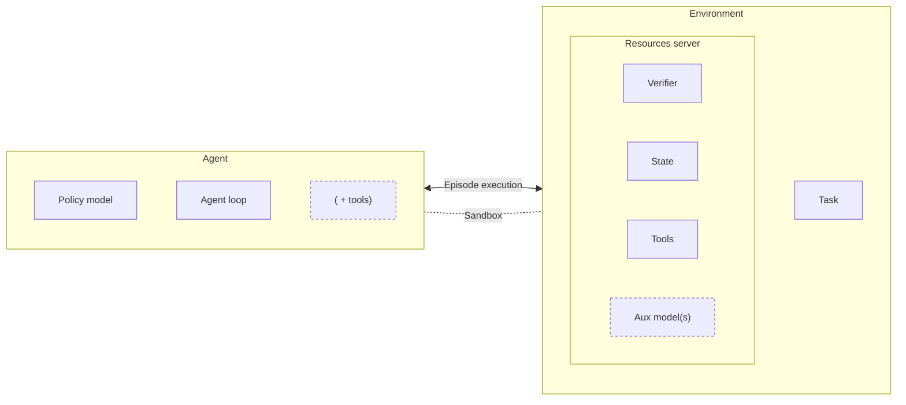

# Agent <> environment separation for runtime composability

> Sanitized snapshot of the public RFC retrieved on 2026-09-09 at revision `6c57b8039574d7ec38259b4992da9efeb83474f5`. Author metadata, private source links, and internal-only references are omitted.

["[epic] composable architecture consistency (swappable agents)" (\#1866)](https://github.com/NVIDIA-NeMo/Gym/issues/1866)

## Problem statement

An evaluation is made of four parts:

* **Model** -- the policy being measured.
* **Agent** -- the harness that drives it: the loop, the scaffolding, the tool-calling strategy.
* **Environment** -- the world the work happens in: tools, state, sandbox.
* **Task** -- the problem to solve, and the verifier that decides whether it was solved.

Each has to be able to change while the others hold still: swap one part, and the difference in score is attributable to that part ([UC9](#use-cases)). Otherwise `0.42` describes one frozen bundle and says nothing about anything inside it.

**This RFC is scoped to one axis: the agent.** Can we hold the model, environment and task fixed, and change only the agent?

Today, no:

* **The parts are nested.** Dataset, environment resources and model server are all declared inside an agent's config, making the agent the outer container. Composition is decided when the config is *written*, not when the job is *run*.
* **Episode execution is written inside every agent.** When a turn ends, when to verify, how results are handed off -- all in `run()`, alongside the policy loop. Sandbox setup and teardown sit there too ([Environment <> Agent boundary](#environment--agent-boundary)).
* **The same responsibility is implemented on both sides.** All 49 agent servers implement `run()`, though 19 drive no loop. Metric aggregation is overridden by 46 of 118 resources servers but only 4 of 49 agents -- and 11 agents proxy it back to the resources server anyway.

The cost is already in the repo:

* **Benchmarks pay for agents they do not have.** Tau2 has no separable agent, but onboarding it meant writing an agent server anyway: a `/run` handler was all the framework offered.
* **Agents pay for benchmarks they do not own.** `anyswe_agent`, `anyterminal_agent` and `cvdp_agent` each rebuilt sandbox provisioning, harness bootstrap and artifact retrieval -- same file name, three different bodies.
* **Contracts are invisible.** GDPVal's deliverable handoff with `stirrup_agent` exists only inside `run()`, so no other harness can replace it and no config says why.

The goal: **fix the benchmark, change the agent, and run** -- without editing YAML or duplicating the benchmark.

### Assumptions

The framing above rests on four premises. If any is wrong, the problem is a different one.

- **Runtime composability is worth having.** That users should be able to evaluate an agentic system and not only a model -- selecting an agent the way they already select a model or a task -- is taken as given here, not argued.
- **The architecture is the root cause; the individual couplings are symptoms.** Agent Swappability delivered the `--agent` selector on top of the current architecture and was explicit that it was not a fix:
  > The config composition mechanism proposed here is a band-aid to enable the selector. The coupling we observe in the repo is a symptom, not a root cause. Nothing stops (or even discourages) contributors from creating new components with the same coupling problems after this RFC is implemented.
- **The four parts are separable at all.** Some benchmarks arrive as one piece -- Tau2 has no agent to separate out -- so the split is a target, not a property every benchmark already has.
- **The agent is the axis to take first.** Model, environment and task have composability gaps of their own; this assumes the agent axis can be addressed without settling them.


## Personas and Use Cases

Three clusters of people touch the same components for different reasons: some **build** them, some **measure** with them, some **train** against them. The same nesting shows up as a different obstacle for each.


### Personas

**Build** -- contribute the components.

- **Agent / harness developer** -- develops or integrates a reusable harness: the loop, the scaffolding, the tool-calling strategy.
- **Environment / benchmark developer** -- owns the task, dataset, verifier and scoring, plus the constraints that determine which agents can perform the task correctly.
- **Gym maintainer** -- owns CLI behavior, config composition, compatibility rules, migration, and the support burden of ambiguous configurations.

**Measure** -- turn those components into a number someone acts on.

- **Evaluation user / researcher** -- runs an existing benchmark against one or more models: model researchers, evaluation engineers, open-source users, partners.
- **Model developer** -- needs their model measured under a harness representative of how it will actually be deployed.
- **Cost / efficiency owner** -- accountable for what a score costs: tokens, tool calls, wall-clock, GPU hours.

**Train** -- use environments as training signal, not only as a scoreboard.

- **Post-training / RL engineer** -- trains a policy against environments; rollouts are the training data.
- **Harness optimization team** -- holds the model fixed and improves the scaffolding, then re-evaluates; the harness is what changes.
- **Continual-learning product team** -- re-runs a fixed environment set against successive model versions on a schedule.

### Use Cases

Each states a need and the outcome that follows from meeting it. They share one premise: **a benchmark declares what counts as done; a harness decides how.** Any benchmark should run with any harness. Where that is not true today it is the thing being fixed, not a constraint to design around.

**Build**

- As a benchmark developer, I want to define a task entirely by its data, tools, state and verifier -- including whatever the verifier reads, offered as a tool rather than assumed of the agent -- so any harness can attempt it without benchmark-specific code. (UC1)
- As a benchmark developer, I want to declare the capabilities a task genuinely requires, such as image input or sandbox access, so a harness that cannot attempt the task is known before compute is spent, while one that merely does it badly is still allowed to try. (UC2)
- As a benchmark developer, I want to state when the harness is part of what I measure, so a swap is understood as changing the subject rather than varying a control. (UC3)
- As a benchmark developer, I want to publish an environment without choosing or shipping an agent, so contributing a task does not mean maintaining a harness. (UC4)
- As an agent developer, I want to bring a harness that owns its own loop and one that only supplies a policy step, and run both against the same environment, so participating does not require a particular internal structure. (UC5)
- As an agent developer, I want to run one harness across many environments without per-environment work, so I can find where it breaks. (UC6)
- As a maintainer, I want environments and harnesses to be adoptable one at a time, so the design can land without a repository-wide migration. (UC7)

**Measure**

- As an evaluation user, I want to run an existing benchmark with a different agent without copying or editing its configuration or implementation, so I experiment with agent behavior rather than framework internals. (UC8)
- As a researcher comparing agents, I want benchmark, dataset, verifier, model binding and scoring to stay fixed while only the agent changes, so differences are attributable to the agent. (UC9)
- As a researcher, I want every result to record the agent actually used and its resolved configuration, so results stay reproducible. (UC10)
- As a researcher, I want every agent and benchmark pairing to yield either a score or an explicit statement of what the harness cannot do, never a zero caused by an unstated rule, so a weak result and a broken one are distinguishable. (UC11)
- As a user, I want to discover the available agents and environments and what each task requires, without browsing directories or inferring names from YAML. (UC12)
- As a user, I want to inspect the fully resolved run before compute is provisioned, so mistakes fail cheaply. (UC13)
- As a model developer, I want to evaluate one model under several harnesses, so I can report what a number depends on instead of a single figure. (UC14)
- As a cost owner, I want tokens, tool calls and wall-clock recorded per rollout next to the score, so agents compare on cost-to-quality, not quality alone. (UC15)

**Train**

- As a post-training engineer, I want to train against the same environment I evaluate on, with the harness stated explicitly, so training and evaluation are not silently measuring different systems. (UC16)
- As a harness optimization team, I want to sweep harnesses over a fixed model and environment, so gains are attributable to scaffolding rather than weights. (UC17)
- As a continual-learning product team, I want to re-run a fixed environment set against successive model versions unattended, so a regression surfaces as a delta rather than a re-onboarding. (UC18)

## What best looks like

Nothing below is novel: each row is something Harbor, Prime Intellect or Gym already does (see [Competitive analysis](#competitive-analysis-harbor-prime-intellect-and-gym)). The target form factor is their union.

| property | what it means in practice | demonstrated by |
|---|---|---|
| **The task contract is minimal** | The smallest contract through which a verifier can still read a result. Harbor's is roughly *you get a working directory, do anything, exit -- then tests run*. That minimalism, not capability, is why 50 harnesses work there without per-agent effort | Harbor |
| **Four objects, not one** | Work package, episode driver, harness and runtime are separately selectable, so a harness that owns its loop and one that supplies only a policy step both have a home (UC5) | Prime Intellect |
| **Whatever the verifier reads is offered, never assumed** | If scoring reads a deliverables directory or a final sandbox state, the environment exposes the means to produce it. No harness needs private knowledge to have its work counted (UC1) | nobody -- the GDPVal lesson |
| **Capabilities are declared data** | What a task requires and what a harness provides are both machine-readable, so a pairing is checked before compute (UC2, UC13). A deny-list of known-bad pairs is the weaker form of this | Harbor (`AgentCapabilities`) |
| **Isolation is declared policy, validated at preflight** | Internet access, egress allowlists and resource limits are expressed as capabilities and checked before a run, rather than implied by which provider was chosen | Harbor (`EnvironmentCapabilities`, Kata microVMs) |
| **Cost sits next to the score** | Tokens, cache hits and monetary cost per rollout, subagents included, so agents compare on cost-to-quality (UC15) | Harbor (`UsageInfo`, `FinalMetrics`) |
| **Rollouts are training-grade by default** | Token-id-exact capture with lineage and conformance, so one run serves evaluation and RL without a second pipeline (UC16) | Gym (`token_id_capture`) |
| **Runs are observable in flight** | Spans and metrics during execution, not only artifacts afterwards | Gym (OpenTelemetry) |
| **Provenance is owned** | Someone vouches for what a benchmark measures | Gym |

**The union does not exist yet.** Harbor supplies contract minimalism, isolation and cost; Prime Intellect supplies the object model; Gym supplies capture, observability and provenance. No system holds more than a third of these rows, so the target is a synthesis, not a port.

**One row has no demonstrator.** Nothing distinguishes, at scoring time, a harness that did the task badly from one that was never told the rules (UC11). Every other property here is proven somewhere; that one is open.


## Related work


UX improvements and agent--env decoupling:

* ["[design] introduce episode processors for rollout orchestration" (\#2159)](https://github.com/NVIDIA-NeMo/Gym/issues/2159)
  * prototype: [\#3100]( https://github.com/NVIDIA-NeMo/Gym/pull/3100)
* ["Epic: Gym CLI usability -- first class CLI experience" (\#1434)](https://github.com/NVIDIA-NeMo/Gym/issues/1434)
  * FRC: CLI foundational UX
  * PR: [\#1630](https://github.com/NVIDIA-NeMo/Gym/pull/1630)
* ["epic: Agent swappability — first-class --agent-type selector in the CLI" (\#1583)](https://github.com/NVIDIA-NeMo/Gym/issues/1583)
  * RFC: "Harness x Benchmark decoupling"
  * RFC: "Agent Swappability: a first-class `--agent` selector in the CLI"
  * PRs: [\#2640](https://github.com/NVIDIA-NeMo/Gym/pull/2640) (swap agents when parsing the config), [\#2641](https://github.com/NVIDIA-NeMo/Gym/pull/2641) (`--agent-type` CLI flag), [\#2661](https://github.com/NVIDIA-NeMo/Gym/pull/2661) (agent <> resources server compatibility safeguard), [\#2757](https://github.com/NVIDIA-NeMo/Gym/pull/2757) (rename agent instance after swapping)
  * Environments onboarded with a swappable agent: [\#2421](https://github.com/NVIDIA-NeMo/Gym/pull/2421) (SWE-bench resources server), [\#2424](https://github.com/NVIDIA-NeMo/Gym/pull/2424) (OpenCode sandboxed agent server), [\#2498](https://github.com/NVIDIA-NeMo/Gym/pull/2498) (SWE-bench Pro resources server), [\#2815](https://github.com/NVIDIA-NeMo/Gym/pull/2815) (Terminal Bench 2.1)
* ["Decouple SWE environment infrastructure from agent harnesses" (\#1249)](https://github.com/NVIDIA-NeMo/Gym/issues/1249)
  * PR: [\#2011](https://github.com/NVIDIA-NeMo/Gym/pull/2011)
* ["docs: comprehensive agent harness reference and selection guide" (\#2372)](https://github.com/NVIDIA-NeMo/Gym/issues/2372)
  * PR: [\#2311](https://github.com/NVIDIA-NeMo/Gym/pull/2311) (open)

Sandboxing:

* ["epic: unified execution sandbox infra" (\#1048)](https://github.com/NVIDIA-NeMo/Gym/issues/1048)
  * PRs [\#2015](https://github.com/NVIDIA-NeMo/Gym/pull/2015) (sandbox any environment), [\#2758](https://github.com/NVIDIA-NeMo/Gym/pull/2758) (provider image-prepare hook), [\#2604](https://github.com/NVIDIA-NeMo/Gym/pull/2604) (surface sandbox OOM status)
* ["epic: canonical sandbox patterns" (\#2763)](https://github.com/NVIDIA-NeMo/Gym/issues/2763) -- source of the *agent in sandbox* / *sandbox as tool* vocabulary used in the [Sandboxing](#sandboxing) section

## Proposed solution

*The proposed solution stems from the analysis of [use cases we want to enable](#use-cases) and problems we identified in the [current implementation](#current-solution). Read these sections if you're looking for motivation for introducing the changes outlined here.*

### The harness is extracted as a protocol; what is left is the episode processor

*This proposal builds on the [design](https://github.com/NVIDIA-NeMo/Gym/issues/2159) and [prototype \#3100](https://github.com/NVIDIA-NeMo/Gym/pull/3100) by Felipe*

An agent server does two jobs. One is genuinely the agent's: the loop, the scaffolding, the tool-calling strategy. The other is the episode -- `/run`, the turn flow, the runtime it happens in, the handoff to scoring. **We extract the first as a protocol and rename what is left.**

* **The harness becomes an `AgentHarness` protocol.** An object with `responses()`, instantiated by whatever drives the episode. It is not a server: no port, no `/run`, no `/v1/responses`, no health check, no startup on the critical path.
* **What remains of the agent server is the episode processor.** The same process, port, venv and config instance, renamed for what it actually does. It gains the sandbox lifecycle and loses the agent loop.
* **The processors are then unified.** 49 near-duplicate `run()` bodies collapse to [seven processors](#episode-protocols) -- one per episode protocol, plus one per embedded external framework -- and a benchmark *selects* one instead of writing one.

The processor is the glue code that connects the harness and the environment, and it is the only place a resource shared by both can be owned.

**No server type is added and no process is added.** `responses_api_agents/` becomes `episode_processors/` (the server) and `agent_harnesses/` (protocol implementations, which are not servers). A run stays three processes -- model, processor, resources server -- and a rollout keeps the hop count it has today.

Keeping the harness a server and adding the processor beside it is the [rejected alternative](#1-the-harness-stays-a-server-and-the-processor-is-added-beside-it).

It differs from the prototype (\#3100) in three ways:

* the agent is not a server
* there is no opt-out. \#3100 splits the base classes, but keeps a combined `SimpleResponsesAPIAgent(BaseResponsesAPIAgent, BaseProcessor)` that still registers `/run`. We use an inverse approach for backward compatibility (see the [legacy processor](#phase-1-legacy-processor)).
* the processor also owns the sandbox lifecycle


1. **The agent loop is a protocol, not an endpoint.** `run()` and `/run` belong to the processor, and with them episode setup, the runtime and the handoff to scoring. What stays with the harness is its loop and its tool calls: `responses()` is still the harness's whole episode, and it still calls `/<tool_name>` on the environment itself, through a client the processor hands it. The tool-call boundary does not move in this proposal -- see [use case coverage](#use-case-coverage) and [future extensions](#support-for-a-bare-policy-step-uc5). **An external integration, or a benchmark that needs custom orchestration, gets a custom processor -- never a custom harness** (see details [below](#external-integrations-become-custom-processors)).
2. **`run()` on the processor base class is concrete.** It is no longer an abstract method and its body is what `simple_agent.run()` does today. A benchmark selects a processor instead of writing one. At the end of migration [seven processors](#episode-protocols) cover the catalogue: one per episode protocol, plus one per embedded external framework.
3. **The processor owns the sandbox.** Neither the harness nor the resources server provisions or tears one down. The harness runs in the processor's process and is handed the live object; the resources server is handed a descriptor. The spec comes from the environment (it is a property of the task) and the provider is specified in the run config.
4. **Environment config / manifest is what composes harness, resources server and the dataset.** Neither the harness nor the resources server points to the other, and neither carries a `datasets` block in its config.
5. **The rollout collector addresses the processor.** The rollout row's routing key becomes the processor, which names the harness. `--agent-type` then rewrites one reference instead of rehosting and renaming agent instances. `agent_map` and `fan_out` keep their shape, now selecting a processor's seats.
6. **The harness keeps its directory, its config and its venv.** Because the processor imports it, the processor process runs in a venv built from the harness's `requirements.txt`. That is not a formality: the 46 top-level agent directories hold 24 distinct dependency sets and several cannot share an interpreter -- `osworld_agent` pins `numpy<2` and `matplotlib~=3.7.4`, `stirrup_agent` pulls `transformers>=5.8.1`, `verifiers_agent` a package from an additional package source. So processor *code* is shared (seven implementations) while a *deployed* processor is one process per seat, in its harness's environment -- exactly what `gym env start` brings up today. A harness that cannot be imported (non-Python, hosted elsewhere, or deliberately isolated) is reached by `RemoteAgentHarness`, which drives a user-hosted `/v1/responses` through the same protocol; that is `remote_agent` today, generalised.


### Metric aggregation belongs to the resources server

**`/aggregate_metrics` is served by whoever serves `/verify`.**
A standalone processor that owns the entire benchmark logic -- overrides `/run` and owns the scoring -- must serve it (see example in the [next section](#external-integrations-become-custom-processors)).

The grouping key changes from the agent-server instance name alone to `(verify owner, harness)`, composed at run time. This is not a new key: `gym eval reverify` already groups this way (`rollout_reverification.py:598-604`), so `gym eval run` converges on it and the run-versus-reverify divergence goes away.

<!-- Does it make sense? I would rather remove agent_ref.name entirely -->
**The output does not change**, because the composite is only the grouping key -- each entry keeps `agent_ref.name` as its identity, so `<output>_aggregate_metrics.json` and the agent-namespaced MLflow metric names are unchanged. That has to stay true deliberately: instance names do not encode the pairing (0 of 123 benchmark agent instances are literally `<resources server name>_<agent type>`, and only 68 reproduce it after stripping the `_resources_server` suffix), and downstream consumers index on `agent_ref.name`. One benchmark's numbers *do* change, which is the point: `critpt` defines `compute_metrics` and `get_key_metrics` on its resources server and its agent does not proxy them, so `gym eval run` silently drops metrics that `gym eval reverify` computes.

This change is to some extent independent of the introduction of the episode processor and it directly addresses the problems with the current solution described [below](#blurry-ownership-of-metric-aggregation). One implementation note: since `/aggregate_metrics` is registered inside `SimpleResourcesServer.setup_webserver()`, a server that replaces `setup_webserver()` and doesn't call `super()` has to register `/aggregate_metrics` itself.

### External integrations become custom processors

*Maintaining support for external integrations is the primary reason for rejecting the idea to move `/run` to the resources server. See [rejected alternatives](#rejected-alternatives) for more details.*

The four benchmarks that embed a foreign episode engine -- `tau2`, `harbor_agent`, `verifiers_agent`, `pinchbench` -- become **standalone processors** ([class D](#episode-protocols)).
They stop being agent servers: each becomes a processor that serves its own `/run` and `/verify` and instantiates no harness, because the foreign engine *is* the loop. `harbor_agent` is irreducible as a *bridge*, not per benchmark: where Gym already has an environment for what it is running -- Terminal Bench 2.1 has one, with a real `verify()` -- the pairing should use that environment rather than Harbor's in-process scoring.


Tau2 is the worked case. Everything its [case study](#tau2--tau2-agent-integrating-an-external-benchmark) lists as re-derived by hand is a processor concern: driving the episode, routing model traffic for two seats (policy and simulated user), declaring a row schema, returning trajectory plus reward, and a preparation step that had to be registered as a webserver hook under the current architecture.
The code that onboards Tau2 is unchanged; what disappears is the interface it cannot satisfy -- the `responses()` that raises `NotImplementedError` behind a `/v1/responses` route that exists and cannot be called (see issue [\#2241](https://github.com/NVIDIA-NeMo/Gym/issues/2241)). The other misfit goes with it: `Tau2VerifyResponse` inherits the run *request*, which carries the run config as a field, so `RewardProfiler` averages debug flags and `get_key_metrics` opens by deleting `mean/seed`, `mean/verbose_logs` and three more by name.

**Not every self-contained agent should stay self-contained.** Eleven agent servers score in-process and never call `/verify`, and they split three ways:

| | servers | what happens |
|---|---|---|
| irreducible | `tau2`, `harbor_agent`, `verifiers_agent`, `pinchbench` | a foreign framework owns turn flow *and* scoring -- PinchBench's stock harness drives OpenClaw and grades it, in-sandbox, behind one `bash /opt/run_task.sh`. They become standalone processors |
| decouple onto an environment that already exists | `anyswe_agent`, `anyterminal_agent`, `mini_swe_agent`, `mini_swe_agent_2`, `swe_agents` | SWE-bench has four independent graders over one dataset -- `anyswe_agent._grade_sandbox_patch` (`app.py:380`), `mini_swe_agent_2` (`app.py:480`), `swe_agents` (`app.py:531`) and `resources_servers/swebench.verify()` (`app.py:320`) -- and they have already diverged: only the resources server carries the multilingual fixups and the anti-cheat history strip. Today `allowed_agents` hides this by preventing the swap. Scoring moves to the environment and they fold into the single-request processor |
| need an environment written | `osworld_agent`, `vcqa_agent` | scoring moves into a new resources server, or they stay standalone by choice. OSWorld is the interesting one: the foreign package supplies the environment and the evaluator, but Gym writes the turn loop itself (`client.py:2026`), so what it lacks is an environment, not a processor |

The same standalone shape also rehouses the three `conversational_tool_use` generation stages that hardcode `reward=1.0` because `responses_api_agents/` was the only place to put something that calls a model in a loop and has no verifier.

### Use case coverage

Against the [use cases](#use-cases). The structural choice on this page decides about half of them; the rest is declaration, discovery, provenance and cost, and follows whichever structure is chosen.

| | use cases | how |
|---|---|---|
| **delivered by the structure** | UC5, UC6, UC8, UC9, UC14, UC16, UC17 | the harness carries no benchmark-specific config or code, so swapping it is a reference change and nothing else varies. UC17 with one caveat: a sweep is N runs, and single-invocation matrix expansion is planner work |
| **delivered, work scheduled** | UC1 (resources server refactor, phase 3), UC4 (datasets move to the environment, phases 2-3), UC7 (the legacy processor, phase 1), UC18 (one aggregation route, phase 2) | none is delivered by the design alone; each has a phase and a DoD |
| **not affected by the change** | UC2, UC3, UC11 (manifests and compatibility); UC12 (discovery); UC10, UC13, UC15 (resolved-config and observability) | these are either: a) true already and the proposal does not regress; or b) tracked separately and orthogonal to the proposal. UC11 is the exception worth naming: giving the episode one owner is what makes the check possible, but nothing here performs it |

## Accepted downsides

1. Processor-owned sandboxes need a provider that can be shared across processes. The harness is no longer one of the consumers -- it runs inside the processor and is handed the live object -- but the verifier still is, and that hop is the constraint. As of now cross-process sharing is implemented **only by `opensandbox` and `e2b`**; docker, local, apptainer, enroot, openshell, daytona and ecs_fargate cannot hand a live sandbox to another process. Unblocking other providers requires the sandbox server ([\#2082](https://github.com/NVIDIA-NeMo/Gym/issues/2082), implemented in [\#2085](https://github.com/NVIDIA-NeMo/Gym/pull/2085)) first. Local development is not blocked in the meantime: a sandboxed benchmark that has not migrated still runs on `docker` or `local` through the legacy processor. What a contributor cannot do until \#2085 lands is run a *processor-owned* runtime on their laptop, which is a constraint on phase 3 rather than on everyday work.

2. Benchmarks define custom artifact-collection logic and these implementations need to be unified. There are no strong reasons for having different mechanisms here -- these were independent pieces of code so they evolved independently to serve the same purpose. With the shared episode processors, copying files out of the agent's box and passing a path needs to be replaced by the verifier reading the shared sandbox; what remains is declaring *which* artifacts count, and that becomes an environment tool call. The price is benchmark-side work, and it differs per benchmark:

* **`vibench`** harvests the app out of the sandbox and passes a host `artifact_path` that rides on the verify request through `extra="allow"`. Pure path-to-shared-state; the field disappears.
* **`gdpval`** copies deliverables to a host `deliverables_dir` and passes the path. The verifier already re-reads that directory and *overrides* whatever the agent computed (`read_deliverable_files` / `convert_deliverables_to_content_blocks`, `resources_servers/gdpval/app.py:392-406`), so the copy is duplicated work rather than a contract.
* **`cvdp`** carries file *contents* inline as `rtl_files`; those come from the shared sandbox instead. Its fallback, parsing RTL out of the model's text, has nothing to do with sandboxes and is unaffected.

The work is not zero even where the runtime is already shared: `swebench.verify()` pops the agent's sandbox from an in-process dict, executes against it and stops it (`app.py:352-360`), so it must reconnect from the descriptor and stop owning teardown.

3. The process boundary that isolated a harness is gone. A harness now runs inside the orchestrator, so one that blocks the event loop, leaks, or imports a heavy stack (`stirrup_agent` pulls transformers, `osworld_agent` scipy and matplotlib) does it in the process driving every concurrent rollout on that seat, and `asyncio.wait_for` around an in-process coroutine is not the cancellation boundary an abandoned HTTP request was -- 29 of the 49 agents rely on that timeout today. The mitigation exists and is already in use for the same reason: `num_workers` on the server, which `opencode_sandboxed_agent` and `terminus_2_sandboxed_agent` both set to 4.

<!-- Processor should have minimal requirements, right? -->
4. The venv is keyed by the (processor, harness) pair rather than by directory, so `gym env start` composes two requirement sets instead of installing one. The count of venvs is unchanged -- one per seat, as today -- but `setup_command` has to learn the composition, and two harnesses whose dependencies conflict cannot share a processor process. A harness sweep (UC17, `fan_out`) is therefore N processes, one per harness, which is what it is today.

5. `/v1/responses` stops being the way to bring an agent. Anything not importable into the processor's venv -- non-Python, hosted elsewhere, deliberately isolated -- comes in through `RemoteAgentHarness` instead.


## Possible future extensions

### Support for a bare policy step (UC5)


`responses()` is the harness's whole episode, and the processor calls it once. A harness that supplies only a *policy step* -- one model call, with tool results fed back to it until something decides to stop -- has no instance in the repo; every agent server present in Gym owns the whole episode.

**When one appears, the loop goes on the harness or the model server, not on the processor.** Two routes, both available without a framework change: expose the policy as a model server, since `BaseResponsesAPIModel` is already that interface and `simple_agent` will drive it unmodified; or wrap it in a harness whose `responses()` runs the loop and calls the policy where `simple_agent` calls the model server. The second is the same shape as `langgraph_agent`, which invokes a whole LangGraph graph inside `responses()` today. **We are not adding it to the initial implementation as this would be dead code.**


### Removal of `rollout_collection_driver`

`rollout_collection_driver` (`nemo_gym/rollout_collection.py:616`, mirrored as the manifest's `rollout_driver`) lets a benchmark replace the whole collection loop. Exactly one config uses it: `benchmarks/gdpval/config.yaml:33`, for two-phase ELO -- balanced sampling to seed ratings, then Elo-informed pairing between similarly-rated models.

**The episode processor does not help here, by construction.** A processor is invoked once per row; the driver decides *which rows exist*, from results already returned, so it needs cross-rollout state and the ability to generate work mid-run. No allocation of `run()` can express that.

Retiring it means changing rollout collection itself: a declared planner above the episode, owning repeats, retries and adaptive sampling, with GDPVal's multistage as a sampling policy plugged into it. That is out of scope here.

## Rejected alternatives

### 1. The harness stays a server and the processor is added beside it

This was the first form of the proposal, and everything above except the harness's form factor is unchanged from it. `episode_processors/` is introduced as a **new server type**: agent servers keep their process, their port and `/v1/responses`, lose only `/run`, and the processor calls them over HTTP once per episode. The ownership of the episode -- and therefore all of [use case coverage](#use-case-coverage) -- comes out identical; the two designs differ only in whether the harness is a process or an object.

**We reject it because we do not want another server.** It is the fourth server type alongside agents, resources servers and model servers -- the fifth when [\#2085](https://github.com/NVIDIA-NeMo/Gym/pull/2085) lands `sandbox_servers/`. Concretely it costs a process and a port per agent instance, one more startup on the critical path, one more health check to drain, and one more inter-process hop per rollout.

What buys none of that back:

* **nothing outside the agent calls `/v1/responses` today.** The collector posts `/run` (`rollout_collection.py:1905`) and `/aggregate_metrics`; the only other callers are the agent's own rollout-scoped self-call and the \#3100 prototype. The endpoint is a private seam wearing a public interface, which is also how `tau2.responses()` can `raise NotImplementedError` behind a live route
* **the sandbox has to cross one boundary more than necessary.** The processor creates the runtime, the harness needs it and the verifier needs it, so a design with the harness out of process needs cross-process sharing for both -- and gets it for neither on docker, local, apptainer, enroot, openshell, daytona or ecs_fargate
* **the rollout-correlation machinery stays.** `/ng-rollout/<id>/v1/responses` and its token-capture twin (`base_responses_api_agent.py:77-82`) exist so a rollout id survives an HTTP hop the agent makes to itself; `rollout_context` is already a `ContextVar` and needs none of it in-process

What it does preserve is the network as the agent interface: any harness reachable over HTTP is a first-class agent with no import, no shared venv and full fault isolation. That is the [fifth accepted downside](#accepted-downsides) of the proposal, and `RemoteAgentHarness` is the answer to it -- the same capability, as one adapter rather than as the universal shape.

### 2. The episode orchestration is moved to the resources server

The environment drives the episode it defines. `run()` is a concrete method of `SimpleResourcesServer` (matching the current simple agent's logic). Externally-driven benchmarks become standalone resources servers.

It is cheaper to introduce than this proposal. For 108 of 113 environments the episode protocol is entailed by the task, so a *swappable* driver buys nothing.

It has some substantial downsides, though:

* **sandbox ownership and lifecycle land in the resources server**, where they don't belong
* **the interface mismatch changes sides rather than going away.** Today `tau2` is an agent server whose `responses()` raises `NotImplementedError` (`app.py:245`). As a resources server it would be an environment whose `verify()` -- the one `@abstractmethod` on `SimpleResourcesServer` -- has nothing to do, because tau2's reward comes back from `run_single_task` inside `run()`. The same category error, on the other side of the boundary
* **an externally-driven benchmark is not an environment.** It exposes no tools, no state and no verifier any other harness can call, so `gym list environments` would advertise something nothing can be paired with, and `allowed_agents` would have nothing to check
* **the harness seat has no home.** Some of these integrations still select a Gym-side harness -- `harbor_agent` does it today through `harbor_agent_import_path` and `harbor_agent_name`, the plugin-host pattern again. A processor declares `harness:` as a first-class reference; a resources server pointing at a harness inverts the dependency for a component that is not that harness's environment

Both designs end up with two shapes. Under this alternative they are two *types*: environments that orchestrate, and resources servers that are not environments. Under the proposal they are one type, and the difference is whether `resources_server` is set.


## Design details

### `AgentHarness` and `EpisodeProcessor`

```python
class AgentHarness(Protocol):
    """The whole agent contract. Not a server: no port, no routes, no lifecycle of its own.

    The processor constructs one per seat from the harness's config and calls it once per
    episode. `remote_agent` becomes `RemoteAgentHarness`, an implementation that forwards
    to a user-hosted `/v1/responses` -- the network is one harness, not the interface.
    """

    async def responses(
        self, params: NeMoGymResponseCreateParamsNonStreaming, ctx: EpisodeContext
    ) -> NeMoGymResponse: ...


class EpisodeProcessorConfig(BaseRunServerInstanceConfig):
    harness: Optional[HarnessRef] = None                # absent when the processor owns its model calls
    resources_server: Optional[ResourcesServerRef] = None   # absent for external integrations
    sandbox_provider: Optional[str | Mapping] = None    # the runtime, selected per run
    datasets: list[DatasetConfig] = []                  # only for processors with no environment


class EpisodeContext(BaseModel):
    """What the processor hands to both sides of the episode: one producer, two consumers,
    a declared shape. Replaces the `sandbox_handle` dict key that crosses a server boundary
    today, and the `resources_server` reference the agent used to carry in its own config.

    The harness takes it as an argument. The verifier receives it over HTTP, so it is
    declared on `BaseRunRequest`, `BaseSeedSessionRequest` and `BaseVerifyRequest` and all
    118 resources servers inherit the field instead of each declaring it.
    """
    model_config = ConfigDict(extra="forbid")

    rollout_id: str
    env: Optional[ResourcesServerClient] = None      # where the harness calls /<tool_name>
    sandbox: Optional[AsyncSandbox] = None           # the live object in-process;
                                                     # `.serialize()`d for the verifier


class SimpleEpisodeProcessor(BaseEpisodeProcessor):
    """Owns one rollout. `run()` is concrete: benchmarks select a processor, they do not write one."""

    async def run(self, body: BaseRunRequest) -> BaseVerifyResponse:
        async with self.runtime(body) as ctx:
            await self.env.post("/seed_session", body, ctx)
            response = await self.harness.responses(body.responses_create_params, ctx)
            return await self.env.post("/verify", body, response, ctx)

    @asynccontextmanager
    async def runtime(self, body) -> EpisodeContext:
        """Spec from the environment (a task property), provider from the config (not one)."""
        sandbox_spec = await self.env.post("/sandbox_spec", body)   # 204 No Content -> no runtime
        if sandbox_spec is None:
            yield EpisodeContext(...); return
        sandbox = await AsyncSandbox(
            resolve_provider_config(self.config.sandbox_provider, self.global_config), SandboxSpec(**sandbox_spec)
        ).start()
        try:
            yield EpisodeContext(..., sandbox=sandbox)    # serialized on the way to /verify
        finally:
            await sandbox.stop()
```

| member | default | who overrides it |
|---|---|---|
| `run` | the sequence above | one processor per [protocol class](#episode-protocols): the staged and stepwise ones, and the external integrations, which have no environment to call |
| `runtime` | ask the environment, start, tear down | nobody; a benchmark answers `/sandbox_spec` instead |
| `harness` | constructed once per seat from `config.harness`, called once per episode | nobody; a processor with no harness is an external integration that owns its own loop |
| `aggregate_metrics` | **not served** when there is an environment; served by standalone processors, which own `/verify` | nobody |

There are no hooks inside `run()`. A protocol that is not seed-once-call-once-verify replaces the method rather than filling a slot in it, which is why the count of processors is the count of protocols.

Two contracts are new and both are declared data: `/sandbox_spec` out of the environment, and `EpisodeContext` into the harness and the verifier. The harness half is a typed argument. The verifier half still crosses HTTP, and declaring it on the *base* request models is what makes `extra="forbid"` meaningful -- the [silent-drop hazard](#resources-server-responsibilities) is that a subclass never declares a field and `extra="ignore"` eats it, so the processor additionally asserts that the context survived the round trip into `verify()`.

One piece of machinery is deleted rather than moved. `/ng-rollout/<id>/v1/responses` and its token-capture twin (`base_responses_api_agent.py:77-82`) exist so a rollout id survives an HTTP hop the agent makes to *itself*; with the loop in-process, `rollout_context` -- already a `ContextVar` -- covers it. The path prefix stays only where it is a real boundary: the model hop, which an opaque external harness reaches by URL.

### New rollout collection flow

Against [the current flow](#rollout-collection-in-gym); `P` is the episode processor, and steps not listed are unchanged. The harness has no marker of its own: it runs inside `P`, so the calls it makes are made by `P`.

```
 6.       run_examples -> per row, bounded by num_samples_in_parallel:

   C -> P   POST /run                              to the processor the row declares
   P -> R   |  POST /sandbox_spec                  skipped when the benchmark declares no runtime
   P        |  start the sandbox
   P -> R   |  POST /seed_session   {..., episode_context}
   P        |  harness.responses(params, ctx)      in-process; once per episode
   P -> M   |    |  POST /v1/responses                                       per turn
   P -> R   |    |  POST /<tool_name>                                        per env tool call
   P -> R   |  POST /verify         {..., episode_context}
   P        |  teardown                            in `finally`
   P -> C   |  return BaseVerifyResponse

11.       AGGREGATION
   C -> R   POST /aggregate_metrics                to the /verify owner; grouped by (owner, harness)
```

No hop is added against the current flow -- `C -> A` becomes `C -> P` and the `A -> ...` calls become `P -> ...` -- and one is removed: the rollout-scoped self-call to `/v1/responses` that 38 of the 49 agents make today.

### Episode protocols

Clustering the 49 `run()` bodies by the protocol they own, rather than by directory, gives the following patterns present in the repo (measured over `46f5ce8ff`):


| class | protocol | servers | onboarded coverage |
|---|---|---|---|
| **A** single-request | seed -> one harness call -> verify | 38 | 104 of the 113 resources servers with a resolvable agent\*; 85 of 88 `benchmarks/` configs; 57 `environments/` configs |
| **B** staged multi-request | the processor issues N harness calls, feeding earlier outputs forward | 5 (`scicode`, `proof_refinement`, the 3 generation stages) | 2 resources servers, 1 benchmark |
| **C** stepwise environment | reset -> (model -> step)* -> close, reward per step | 2 (`gymnasium`, `osworld`) | 7 resources servers, 1 environment |
| **D** externally driven | a foreign framework owns the episode, scoring included | 4 (`tau2`, `harbor`, `verifiers`, `pinchbench`) | 7 environment configs, 2 benchmarks |

Everything separating the 38 servers inside class A is policy or data, not protocol: retries (`browsecomp.max_run_retries`), timeout handling (`remote_agent`), turn budget, `skip_verification`, a row transform (`labbench2_vlm`) -- and runtime, which this design takes away from them, so the sandboxed ones stop being distinct. The [per-agent classification](#agent-servers-by-episode-protocol) in the appendix is the evidence: no class-A row carries anything a parameter cannot express. That gives **A + B + C + one per external framework = 3 + 4 = 7**.

*\* the remaining 9 servers are: 7 gymnasium-family servers (C), `scicode` (B) and `math_formal_lean` which names both `proof_refinement_agent` and `simple_agent`.*

With more effort it could come down to four:

* staging expressed as a declared list of stages folds B into A
* gymnasium's `/reset`, `/step` and `/close` could be served as `/seed_session`, a tool and `/verify` respectively, which folds C into A as well
* class D is irreducible by construction -- one processor per embedded foreign engine

### Migration plan

The processor layer lands first, and **everything routes through it immediately** by way of the legacy processor.
The agents and environments are then refactored gradually -- each agent server splitting into a harness and a reference to a shared processor -- while the legacy processor keeps backward compatibility.
First we migrate the [class A](#episode-protocols) agents that don't require sandbox (phase 2), then we tackle top-priority benchmarks from [classes B, C and D](#episode-protocols) and agents they're coupled with (phase 3). Finally the remaining benchmarks are migrated by their owners or deprecated (phase 4).
When the deprecation period ends, the legacy processor is removed and every component is either migrated or deleted.

Proposed timeline:

* 0.7.0
  * migration phases 1 and 2
  * after this release we no longer accept new agent servers -- a new harness is a protocol implementation

* 0.8.0
  * migration phases 3 and 4
  * after this release there is no legacy agent servers in the repo

* 0.9.0
  * extra time for users to migrate their custom Gym-compatible agents
  * the legacy processor is removed in this release

The progress will be tracked as a number of agent servers that go through the legacy processor introduced in phase 1.

[Classes B, C and D](#episode-protocols) are handled case by case in phases 3 and 4, in the priority order Product sets.

Each phase says how to back it out. Only phase 4 is a one-way door.

#### Phase 1: legacy processor

Land `episode_processors/` as a server type (config, discovery, packaging, CLI, rollout collection) plus one implementation: `legacy_agent_run`, which calls the agent's existing `/run`, returns the response verbatim, and emits a deprecation warning naming the agent. A benchmark that declares no processor gets one generated, as \#3100 already does for its sidecar.

This phase is a prerequisite for the others. It also allows us to land the change without migrating the existing Gym components and without disrupting the benchmark onboarding work.

An unmigrated agent is still a server, so during the migration a benchmark on `legacy_agent_run` does run four processes. **That is the transitional state, not the target**: the fourth process exists per benchmark still on the legacy processor and goes away when it migrates, which is what the per-phase counts below track.

**DoD:** all benchmarks route through the legacy episode processor and produce results identical to the pre-phase-1 baseline.

**Progress:** the core logic is implemented. All 49 agent servers and all 118 benchmark instances go through the legacy processor; 0 migrated.

**Rollback:** repoint the collector's `/run` call at the agent (one call site). The processor layer can stay installed and idle -- no config rewrite, no data migration, and every agent still has its `run()`.

#### Phase 2: migration of the general-purpose agents

`SimpleEpisodeProcessor` and the `simple_agent` family, which is most of the catalogue: 124 of the 167 agent blocks declared in resources-server configs name `simple_agent`. This phase takes the [class A](#episode-protocols) servers that need no sandbox, score through `/verify` and carry no benchmark-specific handoff in `run()` -- 27 of the 49 agent servers, covering 103 of the 118 benchmark instances. What it leaves behind is not one kind of thing: the sandboxed pairs and `stirrup_agent`'s deliverables handoff go to phase 3, and the servers that score in-agent (`mini_swe_agent`, `swe_agents`, `vcqa_agent`) need an environment before they can fold in at all. `simple_agent` stops being a server: `run()` is dropped, the loop moves from `_create_episode` into `responses()`, and what is left is `SimpleHarness`, driven by `SimpleEpisodeProcessor` in the venv the agent directory already declares. A stepwise processor is created for `gymnasium_agent`. This phase is pure relocation and does not require the unified sandbox logic.

During this phase we also remove aggregation from the refactored agents. `AggregateMetricsMixin` stays on `SimpleResponsesAPIAgent` until Phase 4 -- `mini_swe_agent_2`, `osworld_agent` and `tau2` override the metric hooks and have no resources server to move them to yet.

**After this phase we no longer accept PRs that add an agent server.** A new harness implements the protocol and names a processor.

**DoD:** the 103 benchmark instances above no longer route through `legacy_agent_run`; `/aggregate_metrics` has one route.

**Progress:** 103 / 118 benchmark instances and 28 / 49 agent servers migrated -- the 27 above plus `gymnasium_agent`. 21 agent servers still go through the legacy processor.

**Rollback:** per benchmark, repoint its config at the legacy processor. Agents keep `run()` until phase 4, so nothing has been deleted yet; the aggregation reroute reverts as one call site.

#### Phase 3: decoupling of P0 benchmarks

**This phase depends on [\#2082](https://github.com/NVIDIA-NeMo/Gym/issues/2082)** (*sandbox server to share sandbox states needed for rollouts*), which is where `ConnectableProvider`, `serialize()` and `connect()` came from. The remaining piece is [\#2085](https://github.com/NVIDIA-NeMo/Gym/pull/2085), open as a draft, which adds `sandbox_servers/` with signed `SandboxRef` leases and a `RemoteSandboxProvider` so a box created by one server can be operated by another. It has to land first; we need to coordinate with Ananth on sequencing.

It will tackle the coupled, sandbox-using agent-env pairs, one group at a time.
The prioritization will be specified by Product, but as of now these are our top priorities:
* `swebench`
* `swebench_pro`
* `terminal_bench_2_1`
* `gdpval`

SWE-bench and Terminal Bench follow the same blueprint and can be refactored in one go. GDPVal is an independent case and can be worked on in parallel. Only one version of each benchmark is migrated -- the alternative implementations remain deprecated.
The sandboxed and non-sandboxed agent pairs collapse into one harness that optionally reads a sandbox from the episode context.

These benchmarks will be paired against top-priority harnesses identified by the Product. Today the list looks as follows:
* Hermes
* OpenCode
* OpenClaw
* Pi

**DoD:** P0 benchmarks are migrated and can be executed with any of the P0 harnesses listed above.

**Progress:** 110 / 118 benchmark instances migrated, including the P0 set on the critical path for VPR, CLU and <Pascal's team>. 31 / 49 agent servers migrated; 18 still on the legacy processor -- the 5 class B stages, the 4 class D integrations, `osworld_agent`, the 3 plugin hosts, `mini_swe_agent`, `mini_swe_agent_2`, `swe_agents`, `vcqa_agent` and `vibench_agent`.

**Rollback:** per benchmark, revert its config to the pre-phase state. `/sandbox_spec` on the environment is additive, so it can stay. The sandboxed and non-sandboxed agent variants are not deleted until the legacy processor goes in 0.9.0, so the old pairing still resolves.

#### Phase 4: deprecation or refactor of the remaining legacy implementations

The remaining components are triaged for migration or removal.
We notify authors / owners of benchmarks / agents that are not on our priority list and ask them to migrate.
A component that is not migrated by the end-of-support date is deleted.

When the deprecation period ends -- after 0.8.0 -- we remove the legacy processor and, with it, `SimpleResponsesAPIAgent` and the `responses_api_agents/` server type. 0.8.0 is the last release that ships the legacy episode processor, giving users more time to migrate their custom agents.

**DoD:** no agent servers remain; every harness is a protocol implementation and every episode is owned by one of the seven processors.

**Progress:** 118 of 118 benchmark instances and 49 of 49 agent servers migrated or deleted. 0 agents using the legacy processor.

**Rollback:** this is the one-way door -- once the agent server base class is deleted, reverting means restoring a server and a `run()` on every agent that still had one. The revert window is the release itself: the deletion lands early in the 0.9.0 cycle, and the legacy-processor count must already be zero when it does.

## Appendix


### Current solution

What the current implementation shows, with the detail behind each finding in the sections that follow.

- **[Case studies](#case-studies).** GDPVal cannot change harness because of an undeclared deliverable handoff, not an import -- and that adapter relies on no special capability. SWE-bench, Terminal Bench and CVDP each rebuilt the same sandbox `run` under three sets of names. Tau2 required an agent server built around a benchmark that has no agent.
- **[Environment <> Agent boundary](#environment--agent-boundary).** The collector only ever talks to agent servers. Every call to a resources server is made *by an agent*, on the agent's initiative, at a point the agent chooses. The environment is never addressed directly by the thing running the evaluation.
- **[Rollout collection](#rollout-collection-in-gym).** The agent is on the critical path twice and neither visit is about running an agent: `/run` is episode orchestration, `/aggregate_metrics` is scoring roll-up. The loop itself is nested inside `/run` and never addressed directly.
- **[Agent server responsibilities](#agent-server-responsibilities).** Harnesses reach the runtime by two routes -- standalone servers, and three plugin hosts -- and a new episode condition adds a directory rather than a flag, hence `opencode_agent` beside `opencode_sandboxed_agent`. `IntegrationProfile` names the patterns and no server ships the `manifest.yaml` that would declare one, so the value is inferred by AST-parsing the body of `responses()`.
- **[Resources server responsibilities](#resources-server-responsibilities).** The rollout row accumulates rather than being transformed: the same object is the `/run` input, the `/verify` input, the `/verify` output and the line in the rollouts file. No server enforces its own data model.
- **[Metric aggregation](#blurry-ownership-of-metric-aggregation).** In practice it lives on the verifier -- 46 of 118 resources servers override it against 4 of 49 agents -- but the collection path posts to the agent, so a manual bridge is needed. `critpt` shows one being forgotten.
- **[Sandboxing](#sandboxing).** The shared layer is real and universally used: `nemo_gym/sandbox/` behind 9 providers, across 16 servers. What is missing is the handoff -- the sandbox handle crosses a server boundary as an untyped dict key, and only `opencode_sandboxed_agent` can both create one and attach to an existing one.


#### Case studies

##### GDPVal <> stirrup agent

**Finding: the import-level decoupling proposed in swappable-agents, Pattern 4 is cheap and correct, and does not make GDPVal agent-swappable.**

Once applied, the verifier would no longer import the agent package. It has not landed: at `46f5ce8ff` `resources_servers/gdpval` still imports `responses_api_agents.stirrup_agent` from three non-test sites (`app.py:396`, `multistage_elo.py:196,325`), all lazily, inside functions.
That is worth doing, and it would not be enough. GDPVal still could not run with any other agent, because the coupling that matters is not an import.
It is an undeclared **deliverable handoff contract** executed during the run:

1. the agent ends with a `finish` tool call carrying `paths: list[str]` naming the deliverables,
2. it copies those files to `persist_deliverables_dir/task_<task_id>/repeat_<n>/`,
3. it puts `deliverables_dir` on the rollout row,
4. it returns metadata with `task_id`, `sector`, `occupation`, `deliverable_text`.

This is spread across the agent's `run()`, the rollout row, and the verifier's request model.
None of this is harness-specific: it doesn't rely on any special capability.
This is an adapter that wraps general-purpose harness.
However, since the `run` lives in the agent server, we cannot reuse it with other general-purpose harnesses.

##### SWE-bench / Terminal Bench / CVDP <> anyswe, anyterminal, cvdp

**Finding: attempts to fix Pattern 2 produce Pattern 5.**

`anyswe_agent`, `anyterminal_agent` and `cvdp_agent` each added an `agent_server_module` / `agent_server_class` plugin point.
This is the right idea at the wrong layer: the plugin point sits *inside* each agent server, so everything around it is rebuilt per host.
The three `app.py` files solve the same three problems under three sets of names:

| concern | anyswe (697L) | anyterminal (941L) | cvdp (809L) |
|---|---|---|---|
| sandbox image / spec | `_sandbox_image`, `_sandbox_spec` | `_apt_root_sandbox`, `_build_provider` | `_resolve_image`, `_build_spec` |
| harness bootstrap | `write_runner` | `_stage_remote_runtime` | `load_runner_source` |
| artifact retrieval | `_grade_sandbox_patch` | `_collect_remote_outputs` | `harvest`, `_remote_harvest` |

The duplication is literal, not just structural. `update_metrics` is byte-identical in anyswe and anyterminal; `redact` and `_safe_config_json` were copied and have since drifted.
Same story in `setup_scripts/`, where the same filename exists in two or three places and no two copies match:

| script | anyswe | anyterminal | cvdp |
|---|---|---|---|
| `_portable_python.sh` | 46L | 47L | 38L |
| `claude_code_agent_deps.sh` | 29L | — | 36L |
| `hermes_agent_deps.sh` | 25L | — | 26L |
| `opencode_agent_deps.sh` | 23L | — | 35L |

The root cause of this redundancy is that for each of these benchmarks we have benchmark-specific wrappers
for generic-purpose agent harnesses. These wrappers are related to what the task requires:
1. agent needs to run in a sandbox
2. the verifier needs to access the standbox - what it scores is the final state of the sandbox

Pattern 5 already proves the harness is swappable: eight harnesses across three hosts, with Claude Code and Hermes plugging into all three.
What is not reusable is the `run` around it — sandbox provisioning, harness bootstrap, artifact retrieval, scoring.
The same people built that run three times, in three places, because no layer owns it, and each copy has drifted from the others.

Same conclusion as GDPVal, reached from the opposite direction.
There, one adapter exists and cannot be shared. Here, three copies of the same adapter exist and cannot be merged.
In both cases the reusable part is general-purpose and the thing trapping it is that `run` lives in the agent server.

##### Tau2 <> tau2 agent: integrating an external benchmark

**Finding: onboarding an externally-owned benchmark means implementing the agent-server interface around it, whether or not the benchmark has an agent. It works, and Gym users can run tau2 today, but the only thing the framework asked for was a `/run` handler, so everything else the integration needed was re-derived by hand.**

Tau2-bench is a multi-turn customer-service benchmark maintained outside NVIDIA. Its domains ship their own tools, state, tasks, simulated-user policy and reward function, and it drives the whole episode itself through one entry point, `run_single_task`. Nothing in it is separable, so `responses_api_agents/tau2` is a bridge: config translation in, trajectory out.

What the bridge had to build:

* **Acquire code and data.** The dependency is a fork; `source.py` clones the same ref again at startup to fetch domain data. With no preparation step in an agent server's lifecycle, that runs from `setup_webserver` (`app.py:225`).
* **Route model traffic.** `_run` (111L) rewrites tau2's LiteLLM clients to point at Gym model servers, preserving rollout correlation through `base_url_for_run`. It needs two: the policy and the simulated user. The simulated user is environment-side under the boundary above, but there is no environment here, so it is an agent config field.
* **Express the task.** `Tau2RunRequest` (`app.py:182`) embeds tau2's `TextRunConfig` and `Task` verbatim and pins nine unsupported fields to `Literal` constants. The Gym-side `TaskData` keeps them as `Dict[str, Any]` and states that their shapes "belong to the tau2 package".
* **Convert the trajectory back** into Responses API items, dropping the simulated user's tool calls and user-requested tool results when `result.agent_messages` is absent (`app.py:296-306`).
* **Aggregate metrics.** `compute_metrics` (113L) of per-domain and per-termination-reason analysis. With no resources server this is one of the three cases where agent-side aggregation is unavoidable rather than misplaced (see [section on metric aggregation](#blurry-ownership-of-metric-aggregation)).

Three places where the interface did not fit:

* `responses()` is `raise NotImplementedError` (`app.py:244`). The base class registers `/v1/responses` regardless, so the agent-loop endpoint exists and cannot be called. A benchmark that owns its loop has nothing to put there.
* `Tau2VerifyResponse` inherits `Tau2RunRequest` (`app.py:200`), the straightforward way to satisfy `/run`, so the run config becomes part of the result and RewardProfiler averages it. `get_key_metrics` opens by deleting `mean/seed`, `mean/verbose_logs`, `mean/audio_debug`, `mean/audio_taps` and `mean/auto_review`. Nothing in the payload separates inputs from results, so the mean of a boolean debug flag is computed and then removed by name.
* Gym can expose only what upstream implements. `configs/tau2_agent_turn_limit.yaml` exists because the capability was landed in the fork first, and says so: "Requires Tau2 PR #7".

Tau2 cannot run with another harness, and the tau2 agent cannot run against another environment. Unlike GDPVal, that is not a misplaced adapter; there is no seam in the benchmark to expose one at. It marks a third category, the benchmark Gym integrates rather than hosts, for which the needed contract is narrow and already visible in the list above: routed model access, a declared task-row schema, trajectory plus reward out, and a preparation step that is not a webserver hook.


#### Environment <> Agent boundary





What belongs to the agent side:

* agent loop <- agent owns it, but we'd like to have visibility into the whole trajectory
* (policy) model
* internal agent tool calls -> agent owns them; they interact with the environment, but are shipped with the harness and are beyond our control

What belongs to the environment side:

* verifier
* state
* tools (except the ones that agent owns)
* task *(not fully; see the gray zone below)*
* environment-owned auxiliary models *(they are often used by the verifier)*


What belongs to neither:

* episode execution -- the connection between agent and environment. It controls how the task should be orchestrated ("now it's 1st agent turn, now it's 2nd agent turn, and now it's verification time"). **Right now it's owned by agent under run()**
* sandboxing. both agent and verifier might need to use it; sometimes they share it, sometimes verifier needs a fresh one; **right now it doesn't provide enough flexibility**

The gray zone:

* task is also to **some extent** independent. E.g. same math problem, with same task specification and golden answer, can be verified with different scoring logic -- e.g. judge vs equivalence of math formulas. If we make it part of the environment, pinned to a particular verifier, we'd need redundant tasks for such cases. However, there's very little wiggle room when it comes to task <> verifier pairing and a strict contract they need to follow. In most cases there's only one verifier that can work for a given task and the example I used is a corner case rather than a typical pattern. The opposite pattern - many tasks sharing the same verifier - is a common case in the repo.

#### Rollout collection in Gym

`gym eval run` enters `RolloutCollectionHelper._run_from_config` (`nemo_gym/rollout_collection.py:1244`):

Every HTTP call is marked with its caller and callee. `C` is the collector process, `A` the agent server, `R` the resources server, `M` the model server. Steps with no marker are local to the collector and touch no server.

```
 1.       mkdir output dir
 2.       _preprocess_rows_from_config
            load input jsonl -> apply num_repeats / agent_map / fan_out
            -> sorted by (task_index, rollout_index)
 3.       resolve_task_sources          (reads the global config; no server call)
            rows that carry only task_source get their agent_ref filled in
 4.       write <output>_materialized_inputs.jsonl    <- run-scoped input artifact
 5.       truncate <output>.jsonl and <output>_failures.jsonl (unless resume_from_cache)

 6.       run_examples -> per row, bounded by num_samples_in_parallel:
            _validate_agent_names / _validate_agent_pairings  (config-only)

   C -> A   POST /run                                    to row["agent_ref"]["name"]
            |
            |  inside the agent's run():
   A -> R   |    POST /seed_session                      31/49 agents
            |
   A -> A   |    POST /ng-rollout/<id>/v1/responses      38/49 agents (rollout-scoped
            |      self-call; the other 7 call self.responses() in-process)
            |      |
   A -> M   |      |  POST /v1/responses to the policy model      once per turn
   A -> R   |      |  POST /<tool_name>                           once per environment
            |      |                                              tool call
            |
   A        |    provision + tear down a sandbox         21/49 agents
   A -> R   |    POST /verify                            33/49 agents
   A -> C   |    return BaseVerifyResponse (reward + custom fields)

 7.       as each future completes:
            attach ng_perf latency, trajectory record, model-call capture
            stream to <output>.jsonl, or to _failures.jsonl on error
 8.       close files; hard error if zero rollouts produced a result
 9.       optional export_rollouts (exporters / MLflow)
10.       sort results by (task_index, rollout_index)

11.       AGGREGATION (skipped if disable_aggregation)
            _failure_rows_counted_as_zero  <- fold selected failure classes in as 0.0
            _call_aggregate_metrics:
              group rows by agent_ref.name
              strip response / responses_create_params / observations / captures,
                keeping only response.usage
   C -> A       POST /aggregate_metrics                  to EACH AGENT
   A -> R       |  11 agents immediately forward it to their resources server
              write <output>_aggregate_metrics.json, print key metrics

12.       coverage report (expected vs scored vs missing)
13.       rollout health checks -> format_health_report   (reads the jsonl; no server call)
```

The collector only ever talks to agent servers: `C -> A` twice, at step 6 and step 11. Every call to a resources server is made *by an agent*, on the agent's initiative, at a point the agent chooses. The environment is never addressed directly by the thing running the evaluation.

Step 6 already knows the row's resources server, because that is where it routed `/verify`. Step 11 discards that knowledge and routes by agent instead. The reverify path kept it, which is why `rollout_reverification.py` has to rebuild an agent-to-resources-server mapping and carries a comment warning that a remapped row could otherwise "be verified by one server and aggregated by another."

The agent is on the critical path twice, and neither visit is about running an agent. Step 6 posts to `/run`, which is episode orchestration, and step 11 posts to `/aggregate_metrics`, which is scoring roll-up. The only step that is genuinely the agent's own work, the loop, is nested inside step 6 and never addressed directly by the collector. See [section below](#agent-server-responsibilities) for details about each endpoint.

#### Agent server responsibilities

*__Note__: four agent servers live under `responses_api_agents/conversational_tool_use/`. Throughout this doc they are counted individually and referred to as `conversational_tool_use/<name>`.*

As of 2026-09-03 (commit `46f5ce8ff`), agent server in Gym carries three responsibilities:
* executing agent's loop, including calling the policy model -> `responses()` method; `/v1/responses` endpoint
* orchestrating the episode -> `run()` method; `/run` endpoint
* aggregating metrics once every rollout is on disk -> `aggregate_metrics()` method; `/aggregate_metrics` endpoint

The first two are `@abstractmethod` on `SimpleResponsesAPIAgent` (`nemo_gym/base_responses_api_agent.py`); the third has a default implementation:

```python
async def responses(body: NeMoGymResponseCreateParamsNonStreaming) -> NeMoGymResponse
async def run(body: BaseRunRequest) -> BaseVerifyResponse
async def aggregate_metrics(body: AggregateMetricsRequest) -> AggregateMetrics
```

The repo holds **49 agent servers**: 47 of the 49 subclass `SimpleResponsesAPIAgent` and implement both abstract methods. Discrepancies:

* `labbench2_vlm_agent` and `vibench_agent` bypass the base class and define no `responses()`.
* 6 agents override `setup_webserver()` (`tau2`, `mini_swe_agent`, `mini_swe_agent_2`, `browsecomp_agent`, `harbor_agent`, `osworld_agent`); 3 of them build their own `FastAPI()` and register only a subset of the base routes.
* The `/run` payload is a shape, not a schema: 46/49 subclass `BaseRunRequest` and 43/49 subclass `BaseVerifyResponse` with their own fields, and only 2 use `BaseRunRequest` as-is. The uniform interface stops at the method name.
* Three servers implement the interface without being agents at all. `conversational_tool_use/domain_generation`, `conversational_tool_use/policy_tool_generation` and `conversational_tool_use/scenario_generation` are stages of a synthetic-data pipeline: they never call `/verify` and all three hardcode `reward=1.0` on the way out. `BaseVerifyResponse` is being used as a transport for generated artifacts, because `responses_api_agents/` is the only place in the repo to put something that calls a model in a loop. Only the fourth stage, `conversational_tool_use/simulation`, is a real episode against a resources server.


##### Harness incarnations

The same harness reaches the runtime by two different routes, and it is worth naming them before counting.

The first route gives the harness its own directory under `responses_api_agents/` with an `app.py` implementing `responses()` and `run()`. Call these **standalone servers**. When the same harness has to run under different episode conditions (inside a sandbox or not, with context compaction or not, with execution disabled), this route does not add a flag, it adds a directory: hence `opencode_agent` next to `opencode_sandboxed_agent`.

The second route inverts the relationship. One agent server owns the sandbox, the harness bootstrap and the artifact retrieval, and accepts the harness as configuration: `agent_server_module` and `agent_server_class` name a module to import and a class to instantiate at request time. Only three servers do this (`anyswe_agent`, `anyterminal_agent`, `cvdp_agent`); call them **plugin hosts**. Each config entry in a plugin host that points at a harness module is a **host wrapper**: not a reimplementation of the harness, but a config-level re-registration of an existing standalone server so it can run under that host's `run()`. Claude Code, for example, is one standalone server plus three host wrappers.

| harness | standalone servers | plugin hosts it is registered under | total incarnations |
|---|---|---|---|
| Claude Code | `claude_code_agent` | anyswe, anyterminal, cvdp | 4 |
| Hermes | `hermes_agent` | anyswe, anyterminal, cvdp | 4 |
| opencode | `opencode_agent`, `opencode_sandboxed_agent` | anyswe, cvdp | 4 |
| Terminus 2 | `terminus_2_agent`, `terminus_2_sandboxed_agent` | anyterminal | 3 |
| openclaw | `openclaw_agent` | anyswe, anyterminal | 3 |
| nemo_fabric | `nemo_fabric_agent` | anyswe, anyterminal | 3 |
| simple | `simple_agent`, `simple_agent_with_compaction`, `non_executing_simple_agent` | — | 3 |
| cline | `cline_agent` | anyswe | 2 |
| pi | `pi_agent` | anyswe | 2 |
| mini-swe | `mini_swe_agent`, `mini_swe_agent_2` | — | 2 |

30 incarnations of 10 harnesses. 15 of them are host wrappers: 7 in anyswe, 5 in anyterminal, 3 in cvdp.

The variant pairs are not copies that drifted. Between `opencode_agent` and `opencode_sandboxed_agent`, neither `responses()` nor `run()` shares more than a fifth of its lines with its twin, and the Terminus 2 pair behaves the same way.

`responses()` diverges as much as `run()` because the line between the two methods is drawn wherever the process happens to be driven from. `opencode_agent.responses()` is 17 lines delegating to `_create_episode`; `opencode_sandboxed_agent.responses()` is 240 lines that install the opencode binary into the sandbox and drive it over a PTY session. The Terminus 2 pair is the mirror image: 81 lines in the non-sandboxed variant against 5 in the sandboxed one, which has pushed the same work into session setup and `_execute`.

So sandboxing does not stay inside `run()`. It leaks into whichever method touches the process, and each variant redraws the `responses()` / `run()` boundary somewhere else. **The split between the loop and the episode is undefined, so no two agents put the same code on the same side of it.**


##### Redundancy between `run()` methods

`run()` bodies re-implement the same skeleton:

| step | agents (of 49) |
|---|---|
| drive the loop through `responses()` (7 in-process via `self.responses()`, 23 by HTTP self-call to `/v1/responses`) | 30 |
| rollout-scoped routing via `url_path_for_run` / `base_url_for_run` | 31 |
| turn or step budget (`max_turns`, `num_turns`, `max_steps`) | 22 |
| timeout / `asyncio.wait_for` handling | 29 |
| POST the result to the resources server `/verify` | 33 |
| provision and tear down a sandbox (`nemo_gym.sandbox`) | 10 |

The 19 servers missing from the first row are worth naming, because "the agent server does not run the agent loop" is not a rare edge case:

* **An external process calls the model server directly.** `claude_code_agent` puts a rollout-scoped model-server URL in `ANTHROPIC_BASE_URL` so the CLI's own `/v1/messages` calls bypass Gym's agent entirely (`app.py:467`); `codex_agent`, `nemo_fabric_agent`, `terminus_2_sandboxed_agent`, `pinchbench`, `osworld_agent`, `harbor_agent`, `mini_swe_agent`, `mini_swe_agent_2` and `tau2` do the same through `resolve_model_base_url` or LiteLLM. 24 agents post to `server_name=self.config.model_server.name`, against 23 that post to `server_name=self.config.name`.
* **The loop belongs to the plugged-in harness.** `anyswe_agent` passes the harness class into the sandbox (`NGSWE_AGENT_CLASS`, `app.py:358`) and `anyterminal_agent` templates it into a generated `agent_runner.py` (`app.py:264-275`), so the loop runs in the plugged-in server rather than the host.
* **Generating rather than solving.** The three `conversational_tool_use` generation stages call their model server directly, having no episode to drive.
* **Inherited, not absent.** `labbench2_vlm_agent` and `vcqa_agent` inherit `SimpleAgent`'s loop; `gymnasium_agent` and `image_tools_agent` post straight to the model server.

So for most of these the `responses()` endpoint is a formality the base class demands and the runtime never exercises. The loop those benchmarks actually run is invisible to Gym, which is the same visibility gap noted in the [Environment <> Agent boundary](#environment--agent-boundary) section, reached from the implementation side.

##### Anatomy of the agent server directory

An agent server is a directory, not a file, and almost everything about that directory is convention. The framework asks for very little and checks almost none of it, so the shape of an agent server is transmitted by copying a neighbour. Across the 49 servers:

| component | present in | holds |
|---|---|---|
| `README.md` | 49 | free-form prose, 3L to 722L, no shared template |
| `requirements.txt` | 49 | 25 distinct contents; 21 are the identical one-liner `-e nemo-gym[dev]@../../` |
| `configs/` | 49 | 80 YAML files in total |
| `tests/` | 49 | unit tests; every one has at least one `test_*.py` |
| `data/` | 16 | example rows and task inputs |
| `task_data.py` | 9 | that agent's task-row schema (403L in total) |
| `client.py` | 8 | a hand-written script that POSTs one request |
| `scripts/` | 7 | ad-hoc tooling |
| `setup_scripts/` | 6 | shell that installs a harness into a sandbox |
| `prompts/` | 5 | prompt assets kept outside the code |
| `overrides.txt` | 4 | dependency pins |
| `materialize.py` | 4 | turning generated or downloaded assets into rows |

What the framework actually requires is `app.py` **or** at least one parseable agent config — this is the rule encoded in `_discover_agents_in_dir` (`nemo_gym/agent_registry.py:134`). Everything else in the table above is convention with no check behind it.

*__Note__: The discovery rule also iterates only direct children of `responses_api_agents/`, never recursing. `conversational_tool_use` has neither a top-level `app.py` nor a top-level `configs/`, so it is skipped, and its four nested servers are skipped with it: `discover_agents()` returns __45 entries for 49 servers__.*


**The patterns are real and named, but nothing declares them**. `IntegrationProfile` (`nemo_gym/environment/manifest.py:46`) enumerates exactly four of them as a required `manifest.yaml` field, and no environment or agent server in the repo ships a `manifest.yaml`. So the value gets inferred instead: `_infer_profile` (`environment/validation.py:381`) reconstructs it by AST-parsing the body of `responses()`, and `_classify` (`agent_registry.py:101`) decides self-containment by string-matching config keys.


**Conventions carry real information.** Several directory entries encode a fact about the server that nothing records:

* **`task_data.py` (9 servers).** The task-row schema. `BaseRunRequest` does not describe the row, so an agent that wants its row described writes its own model, with `json_schema_extra={"consumed_by": [...]}` annotations invented per file. The other 40 servers leave the row shape implicit, and the `/run` payload divergence measured above is the result.
* **`setup_scripts/` (6 servers).** That the harness must be installed into a sandbox before it can run. Same filenames across the three plugin hosts, no two copies identical.
* **`data/` (16), `prompts/` (5), `materialize.py` (4), `prepare.py` (2).** That the server needs assets prepared before a run. There is no preparation step in an agent server's lifecycle, so this happens in a script the operator is expected to know about, or, in `tau2`, from inside `setup_webserver`. The three `conversational_tool_use` generation stages ship `data/`, `prompts/` and `materialize.py` while having no resources server to hand any of it to.
* **`client.py` (8 servers).** A smoke test. Pairwise similarity exceeds 50% only between `mini_swe_agent` and `harbor_agent`; the other six each invented their own.

#### Resources server responsibilities

Resources server contains components of the environment. As of 2026-09-02 (commit `b8250f3d9`) it carries five responsibilities:
* holding per-episode state -> `seed_session()` method; `/seed_session` endpoint
* scoring the rollout -> `verify()` method; `/verify` endpoint
* exposing the environment's tools -> one handler per tool; `/<tool_name>` endpoints, optionally re-served over `/mcp`
* aggregating metrics once every rollout is on disk -> `aggregate_metrics()` method; `/aggregate_metrics` endpoint
* declaring whether its scoring can be replayed later -> `get_reverify_mode()` method; `/reverify_mode` endpoint

Only `verify()` is `@abstractmethod` on `SimpleResourcesServer` (`nemo_gym/base_resources_server.py:138`); the rest have defaults, and tool handlers are registered by the subclass in `setup_webserver()`:

```python
async def verify(body: BaseVerifyRequest) -> BaseVerifyResponse
async def seed_session(body: BaseSeedSessionRequest) -> BaseSeedSessionResponse
async def aggregate_metrics(body: AggregateMetricsRequest) -> AggregateMetrics
async def get_reverify_mode() -> ReverifyMode
```

`verify` is the only method the server needs to define and **86 of 118 resources servers are verify-only, with no tools or state**. 27 servers add tool routes, and usually few (10 in `conversational_tool_use_simulation`, 7 in `finance_sec_search`, otherwise one or two). Only 17 override `seed_session`. `/mcp` is exposed for the external harnesses to use - only the example config `resources_servers/example_mcp_weather/configs/example_mcp_weather.yaml` enables them and Gym never calls them.

The interface is more homogenous than for agents. 110 servers define `verify()`; the other 8 inherit one. Almost none of them uses the base models unchanged, but nearly all deviate the same way:

* **Request.** 67 declare `class <X>VerifyRequest(<X>RunRequest, BaseVerifyRequest)`. 34 subclass `BaseVerifyRequest` alone, 3 use it as-is, 3 inherit an intermediate base's request, and 3 import a peer server's.
* **Response.** 85 subclass `BaseVerifyResponse` to add benchmark-specific result fields (parsed answer, per-step counts, judge rationale). The rest: 8 return `BaseVerifyResponse` unchanged, 7 explicitly re-list their own request class among the bases, 5 inherit an intermediate base's response, 3 import a peer's, and 2 use `BaseMultiRewardVerifyResponse`.

The `<X>VerifyRequest` carries agent response and information about the task - fields needed for scoring (e.g. golden answer), but also for provenance (task_id, split, subset), metric aggregation (domain, subtask) or any other metadata that were available in the input. In most cases it's constructed with three-base-model chain: BaseRunRequest -> +response -> +reward.

For example for `resources_servers/calendar` it looks as follows:

```python
class CalendarRunRequest(BaseRunRequest):
    exp_cal_state: dict[str, Any]                       # the expected calendar

class CalendarVerifyRequest(CalendarRunRequest, BaseVerifyRequest):
    pass                                                 # literally empty

async def verify(self, body: CalendarVerifyRequest) -> BaseVerifyResponse:
    ...
    reward, reason = grade_assistant_response(assistant_response, body.exp_cal_state)
    ...
    return BaseVerifyResponse(**body.model_dump(), reward=reward)
```

The class body is empty in 59 of the 67; its only job is to combine two parents. This mirrors the [collection flow](#rollout-collection-in-gym) exactly:

* the dataset row is a `<X>RunRequest`
* the collector posts it to `/run` unchanged
* the agent appends `response` and posts a `<X>VerifyRequest` to `/verify`
* the verifier appends `reward`.

The row accumulates rather than being transformed, so the same object is the `/run` input, the `/verify` input, the `/verify` output, and the line in the rollouts file.
**So the extension is not "what the verifier needs". It is everything about the task that isn't the prompt itself, task metadata travelling from the collector to every downstream consumer whether they need it or not.**

Fields not declared in the data model are either added (`extra="allow"`, e.g. `vibench`) or silently dropped (`extra="ignore"`, e.g. `calendar` which returns `BaseVerifyResponse` and drops `exp_cal_state` field) - no server enforces its data model (`extra="forbid"`).

##### Inheritance between servers

Conversely to agents, resources servers sometimes share the code instead of copying it. 106 servers subclass `SimpleResourcesServer` directly, but the other 12 inherit from one of three intermediate bases that carry real logic:

| base | subclasses | defined in |
|---|---|---|
| `GymnasiumServer` | 6 | `resources_servers/gymnasium/base.py` |
| `LibraryJudgeMathResourcesServer` | 4 | `resources_servers/math_with_judge/app.py` |
| `MCQAResourcesServer` | 2 | `resources_servers/mcqa/app.py` |

Two of the three bases live inside another benchmark's `app.py`, so depending on shared behaviour means depending on a peer benchmark. Those import edges are thin but real: 6 servers import from `gymnasium`, 5 from `math_with_judge`, 3 from `simpleqa`, 2 from `mcqa`. **The shared layer exists and has no home in `nemo_gym/`.**


##### Environment-owned model servers

41 of 118 servers use LLM judge for verification:

* 31 call the judge model in their verifier
* 10 package a judging protocol as a reusable environment (`arena_judge`, `math_with_judge`, `physics_judge`, `terminus_judge`, ...)

*__Note__: Additionally in 2 servers (`math_proof_judgement` and `imo_gradingbench`) jugding is the task that the model needs to perform. This is a separate concept.*

Most servers follow the same pattern:
* `nemo_gym/judge.py` (24 servers) or custom `_call_judge` (10 servers) defines the verification logic
* resources server declares `judge_model_server: ModelServerRef` (30 servers, 2 under different name)
* judge errors (transport, timeout, auth, HTTP) are handled and not counted as wrong model answers (24 servers)

Such `JudgeError` are excluded from aggregate metrics, retryable on resume, and re-runnable with `gym eval reverify --judge_failed_only`.

Environments also use models for simulating users (`conversational_tool_use_simulation.user_model_server`), generating the tool outputs themselves (`conversational_tool_use_simulation.tool_simulator_model_server`), backing a retrieval tool (`finance_sec_search`, `finance_agent_v2`) and pairwise reward modelling (`genrm_compare`). For benchmarks that lack resources server these models are defined in the agent alongside other components of the environment (`tau2.user_model_server` and `pinchbench.judge_model_server`).


#### Blurry ownership of metric aggregation

`AggregateMetricsMixin` (`nemo_gym/reward_profile.py:803`) is mixed into both `SimpleResourcesServer` and `SimpleResponsesAPIAgent`, and both register `POST /aggregate_metrics` over the same `compute_aggregate_metrics(...)` call. Its docstring states the intent: benchmark-specific metric logic "can live on either server type".

In practice it lives on the verifier. 46 of 118 resources servers override `compute_metrics` or `get_key_metrics`; only 4 of the 49 agents do.

The two callers disagree about where to send the request:

| caller | posts to |
|---|---|
| `rollout_collection.py:1678` (`gym eval run`) | the **agent** |
| `rollout_reverification.py:619` (`gym eval reverify`) | the **resources server** |

*The reverification is performed without a live agent server, so it cannot point to its endpoint and must use resources servers.*

Because collection dispatches to the agent, every benchmark whose metrics live in the verifier needs the agent to hand the call back. 12 agents override `aggregate_metrics` and 11 of them (including `conversational_tool_use/simulation`) are pure proxies. `stirrup_agent` documents why in its docstring: "without this proxy those extras are lost because the framework dispatches `/aggregate_metrics` to the agent, not the resources server."

A manual bridge can be forgotten. `resources_servers/critpt/app.py` defines both hooks, `critpt_agent` neither proxies nor inherits a proxy, and `benchmarks/critpt/config.yaml` pairs the two, so those metrics are dropped by `gym eval run` and computed by `gym eval reverify`. This is a static reading of the code, not an observed run.

Unlike episode execution and sandboxing, this responsibility has no rationale even under the current design. The resources server already implements and serves the identical endpoint; the agent only stands in the way. **Agent-side metric computation is only legitimate for self-contained agents (like Tau2).**

#### Sandboxing

Unlike metric aggregation, the shared layer here is real and universally used. `nemo_gym/sandbox/` provides a `SandboxProvider` protocol, an `AsyncSandbox` / `SandboxPty` facade and a registry with entry-point plugin support, behind 9 providers (opensandbox, daytona, enroot, openshell, apptainer, e2b, docker, ecs_fargate, local). 16 servers use it: 10 agents and 6 resources servers.

*__Note__: there is also Tau2's which is an external integration and fully owns its sandboxing logic. We need to make peace with that.*

Two patterns are already recognised in ([\#2763](https://github.com/NVIDIA-NeMo/Gym/issues/2763), epic: canonical sandbox patterns):

| pattern | what runs inside the sandbox |
|---|---|
| agent in sandbox | the whole harness runtime (`anyswe_agent`, `anyterminal_agent`, `cvdp_agent`, `opencode_sandboxed_agent`, `pinchbench`, `vibench_agent`) |
| sandbox as tool | selected shell, code or file operations; the agent loop stays in the agent-server process (`mini_swe_agent_2`, `harbor_agent`, `terminus_2_sandboxed_agent`, `osworld_agent`, `litmus_agent`) |

`swebench`, `swebench_pro`, `deepswe` and `terminal_bench_2_1` do not choose a pattern themselves; they hand a sandbox to whichever agent they are paired with. `cvdp` hands out nothing: it has no `seed_session` and creates a sandbox only at verify time.

What the repo does not settle is which server owns which sandbox, and the same resource ends up created by opposite sides depending on the benchmark:

| ownership | created by | how the other side gets it |
|---|---|---|
| environment-owned | resources server, in `seed_session()` | returns a `sandbox_handle` the agent attaches to; at verify time the server re-finds it by session id (only `deepswe` also carries it on the request) |
| agent-owned | agent, in `run()` | verifier never sees it; artifacts are harvested out instead |

Only `opencode_sandboxed_agent` supports both, attaching if the environment made one and creating its own otherwise; `terminus_2_sandboxed_agent` has no creation path and subscripts the handle directly, so it fails against an environment that does not provide one. The handoff is an untyped dict key read across a server boundary, which \#2763 lists as an open design question ("What information can safely cross server boundaries in a sandbox descriptor?").

Scoring the final sandbox state is a fourth undecided question, answered three ways:

| how the verifier scores | mechanism |
|---|---|
| replay in a fresh sandbox | the verifier creates its own sandbox and re-runs the tests there; the agent's changes arrive either extracted from its live sandbox or in the verify payload |
| grade in place | the verifier takes over the agent's live sandbox and scores it directly |
| no sandbox at verify time | the agent harvests files to a shared filesystem and passes a path |

Both answers appear on both sides of the boundary: self-contained agents score in-process, and they too split between replaying in a fresh sandbox (`anyswe_agent`) and grading in place (the other five).

Putting the three axes together, per integration (the environment column is empty when the agent is self-contained):

| agent | env | pattern | sandbox owner | verification |
|---|---|---|---|---|
| `anyswe_agent` | — | agent in sandbox | agent | replay in fresh |
| `anyterminal_agent` | — | agent in sandbox | agent | grade in place |
| `osworld_agent` | — | sandbox as tool | agent | grade in place |
| `pinchbench` | — | agent in sandbox | agent | grade in place |
| `mini_swe_agent_2` | — | sandbox as tool | agent | grade in place |
| `harbor_agent` | — | sandbox as tool | agent | grade in place |
| `opencode_sandboxed_agent` | `swebench` | agent in sandbox | env | replay in fresh |
| `opencode_sandboxed_agent` | `swebench_pro` | agent in sandbox | env | replay in fresh |
| `opencode_sandboxed_agent` | `deepswe` | agent in sandbox | env | replay in fresh |
| `opencode_sandboxed_agent` / `terminus_2_sandboxed_agent` | `terminal_bench_2_1` | agent in sandbox / sandbox as tool | env | grade in place |
| `cvdp_agent` | `cvdp` | agent in sandbox | **both, separately** | replay in fresh |
| `vibench_agent` | `vibench` | agent in sandbox | agent | no sandbox at verify |
| `simple_agent` | `litmus_agent` | sandbox as tool | env | no sandbox at verify |


### Competitive analysis: Harbor, Prime Intellect and Gym

Scope: Harbor and Prime Intellect / verifiers v1 only. Scaled Evals is a hosted control plane over evaluation runners, not the benchmark-agent abstraction being compared here.

The categories below are the [personas](#personas): what someone **building** components needs, what someone **measuring** with them needs, and what someone **training** against them needs. Each dimension is ranked best to worst.

#### Summary

| cluster | 1st | 2nd | 3rd |
|---|---|---|---|
| **Build** | Harbor | Prime Intellect | Gym |
| **Measure** | Harbor | Prime Intellect | Gym |
| **Train** | **Gym** | Prime Intellect | Harbor |

Gym is last on the two clusters this RFC is about and first on the one it is not. That asymmetry is the finding: the decomposition to import is Harbor's and Prime's, and what not to lose in importing it is where Gym already leads -- training-grade rollout capture, benchmark provenance, and in-flight observability (see [cross-cutting](#cross-cutting-operations-and-governance)).

#### Build

| need | Gym | Harbor | Prime Intellect | best → worst |
|---|---|---|---|---|
| Contributing an environment | resources-server *and* agent-server work; 3 hosts rebuilt the same `run` | container + tests + verifier package; Harbor-specific | `Taskset` owns data, tools, scoring; publishable without an agent | Prime → Harbor → Gym |
| Harnesses available | 49 agent servers, each benchmark-coupled; 8 harnesses over 3 hosts | 50 installed (`claude_code`, `codex`, `aider`, `goose`…), ACP registry, import paths | first-class, per agent seat; smaller ecosystem | Harbor → Prime → Gym |
| Harness owns its loop (UC5) | agent owns `run()`; environment-driven has no home | agent is a process with an entrypoint; bridges for protocol agents | `Env` = control flow, `Harness` = agent program; both shapes fit | Prime → Harbor → Gym |
| Runtime independent of harness | implicit; sandbox variants became separate agent directories | `--env`: Docker, local, cloud | per-agent *and* per-tool | Harbor ≈ Prime → Gym |

**The two ecosystems disagree about the harness's form factor, and both work.** A Harbor agent is a process with an entrypoint; a Prime `Harness` is an object the `Env` calls. Harbor's 50-harness ecosystem is credited above to its minimal *task* contract, not to its transport, so neither system is evidence for a process boundary. This proposal takes Prime's shape and keeps Harbor's as the escape hatch (`RemoteAgentHarness`).

#### Measure

| need | Gym | Harbor | Prime Intellect | best → worst |
|---|---|---|---|---|
| Matrix expansion (model × benchmark × agent) | `--agent-type` composes one unbound agent; a matrix, not a product | job planner expands tasks × agents × attempts; `--model` repeatable | `--env.agent.harness.id` per seat | Harbor → Prime → Gym |
| Weak result vs. broken run (UC11) | `allowed_agents` blocks — refusal, not explanation | `AgentCapabilities`: `atif`, `resume`, `handoff`, `native_config`, `windows`, `bridges` | capability flags, API-dialect interception | Harbor → Gym → Prime |
| Cost accounting | scattered token counts; no per-rollout cost | `UsageInfo` (`cost_usd`, cache tokens); `FinalMetrics` totals incl. subagents | usage on typed traces | **Harbor → Prime → Gym** |
| Provenance and reproducibility | `rollout_correlation`; `token_id_capture` with `fingerprint`, `lineage`, `conformance` | ATIF trajectories + job-results DB | typed traces | Gym ≈ Harbor → Prime |
| Aggregation ownership | split: collection → agent, reverification → resources server | verifier per task; job stats, pass@k | on the task | Prime → Harbor → Gym |

**No system passes UC11.** Harbor declares the most and refuses the least; Gym refuses the most and explains the least. None separates, at scoring time, a harness that did the task badly from one never told the rules -- the failure GDPVal would produce today.

#### Train

| need | Gym | Harbor | Prime Intellect | best → worst |
|---|---|---|---|---|
| Rollouts as training data | `token_id_capture` + `train_data_utils`: token-id-exact, which is what RL consumption requires | none -- Harbor is an evaluation runner | traces serve eval and RL, alongside prime-rl | **Gym → Prime → Harbor** |
| Train and evaluate on one environment (UC16) | native | not a goal | native | Gym ≈ Prime → Harbor |
| Harness sweeps at fixed model (UC17) | partial swap only | job planner fans across agent configs | per-seat selection | Harbor → Prime → Gym |

#### Cross-cutting: operations and governance

| need | Gym | Harbor | Prime Intellect | best → worst |
|---|---|---|---|---|
| Multi-agent and judge roles | `agent_map`, `fan_out`, `judge_failsafe`; no episode driver, so a role is not a component | ACP bridges, simulated user; not the core abstraction | `Env.run(task, agents)`; solver and judge seats explicit | Prime → Gym → Harbor |
| Benchmark quality and provenance | project-owned and reviewed | hub, registry client, leaderboards | community hub; not guaranteed | **Gym → Harbor → Prime** |
| Scale and partial-failure recovery | native Slurm submission, the only one of the three; parallelism semaphore, resume with retry suffixes, failure sidecar, health checks | `JobPlan` `n_attempts` / `n_retries`, job locking, ~30 providers (SkyPilot, GKE, OpenShift, EC2, Modal) | per-agent and per-tool runtime; no cluster-scheduling evidence | Harbor ≈ Gym → Prime |
| Isolation of untrusted agent code | 9 providers (Docker, E2B, Daytona, Enroot, Apptainer, Fargate…); no network-policy vocabulary | `EnvironmentCapabilities`: `disable_internet`, `network_allowlist` over hostnames, wildcards, IPv4/6 and CIDRs, `dynamic_network_policy`, GPUs/TPUs; Kata KVM microVMs; preflight-validated | runtime selection, documentation level | **Harbor → Gym → Prime** |
| In-flight observability | OpenTelemetry spans, metrics and span groups; health checks, profiling | PostHog product analytics; a viewer scans artifacts afterwards | traces read after the run | **Gym → Harbor → Prime** |

**Isolation is the largest single gap.** Harbor expresses "no internet except these CIDRs" as a declared capability, validates it at preflight, and can put a task in a KVM microVM. Gym has providers and no vocabulary -- which matters the moment an untrusted third-party harness runs against a private benchmark. **Observability runs the other way:** Gym is the only one instrumented for a run in progress rather than an artifact afterwards.

#### Pros and cons

| system | pros | cons | implication for this RFC |
|---|---|---|---|
| **Harbor** | Largest harness ecosystem (50 + ACP registry); agents own their loop natively; declared `AgentCapabilities`; the only system with real cost accounting, subagent costs included; matrix expansion is the job planner's native shape; by far the strongest isolation story -- network allowlists as declared capabilities, Kata microVM containment, preflight validation | Task contract is Harbor-specific; multi-agent roles beyond simulated-user are not the core abstraction; no training path; telemetry is product analytics, so in-run visibility is weak | The bar for ergonomics and for cost-per-score. Harbor's minimal task contract — you get a working directory, do anything, exit, then tests run — is why 50 harnesses work without per-agent effort |
| **Prime Intellect / verifiers v1** | Cleanest decomposition: `Taskset` / `Env` / `Harness` / `Runtime`; harness selectable per agent seat; multi-agent roles explicit; environments publishable without an agent; traces serve eval and RL | External ecosystem moving quickly; benchmark provenance not NVIDIA-owned; capability flags still short of scoring-validity semantics | The object model to copy. It is the only one of the three where both loop shapes have a declared home |
| **Gym today** | Token-id-exact rollout capture with lineage and conformance — the only training-grade artifact story of the three; broad benchmark coverage; hard compatibility blocking; NVIDIA-owned benchmark provenance; OpenTelemetry instrumentation of runs in flight; native Slurm submission; already integrates Harbor and verifiers agents | Agent swapping partial; sandboxing leaks into agent variants; row schema implicit; aggregation split three ways; episode execution unowned; no cost model; no declared network-isolation vocabulary | Import the decomposition; keep the capture. The RFC should not trade `token_id_capture` for composability — that is the one dimension where Gym leads |

#### What Gym lacks as objects

| needed object | current Gym shape | present in |
|---|---|---|
| Work package | Benchmark configs with embedded assumptions | Prime (`Taskset`), Harbor (task package) |
| Episode driver | Hidden in `agent.run()` | Prime (`Env`) |
| Harness | Agent server directory, plus sandboxed/non-sandboxed variants | Harbor (50 agents), Prime (`Harness`) |
| Runtime | Implicit in the agent implementation | Harbor (`--env`), Prime (per-agent and per-tool) |
| Declared capabilities | `allowed_agents` deny-list | Harbor (`AgentCapabilities`) |
| Isolation policy | Provider choice only | Harbor (`EnvironmentCapabilities`, network allowlists, Kata) |
| Cost record | — | Harbor (`UsageInfo`, `FinalMetrics.total_cost_usd`) |

Sources:

* Gym: `nemo_gym/cli/main.py`; `compose_unbound_agent` and `allowed_agents` in `nemo_gym/global_config.py`; `nemo_gym/token_id_capture/`; `nemo_gym/train_data_utils.py`; `nemo_gym/orchestration/executors/slurm.py`; `nemo_gym/sandbox/providers/`; `nemo_gym/telemetry/`; `nemo_gym/judge.py`.
* Harbor: `harbor.agents.capabilities.AgentCapabilities`; `harbor.environments.capabilities.EnvironmentCapabilities`; `harbor/environments/` (~30 providers, incl. `kata.py`); `harbor.job_plan.JobPlan`; `harbor.telemetry`; `harbor.hub.leaderboards`; `harbor/agents/installed/` (50 agents); `harbor.models.metric.usage_info.UsageInfo`; `harbor.models.trajectories.final_metrics.FinalMetrics`; `harbor.job.Job._init_trial_configs`; `harbor.agents.factory.AgentFactory`.
* Prime Intellect: [verifiers v1 launch post](https://www.primeintellect.ai/blog/verifiers-v1), [Tasksets](https://github.com/PrimeIntellect-ai/verifiers/blob/main/docs/v1/tasksets.md), [Env](https://github.com/PrimeIntellect-ai/verifiers/blob/main/docs/v1/env.md), [Harness](https://github.com/PrimeIntellect-ai/verifiers/blob/main/docs/v1/harnesses.md) docs. Claims here are from published documentation, not a repo inspection, unlike the Gym and Harbor rows.


### Agent servers by episode protocol

All 49 agent servers at `46f5ce8ff`, classified by the [protocol](#episode-protocols) their `run()` owns, with what else that `run()` carries. **scores in-agent** marks the 11 that never call `/verify`; **no verifier** marks the generation stages that hardcode `reward=1.0`. Everything else in the last column is a parameter, which is the claim the classification exists to test.

| agent server | class | policy / data it carries |
|---|---|---|
| `anyswe_agent` | A | sandbox, turn budget, **scores in-agent** |
| `anyterminal_agent` | A | sandbox, **scores in-agent** |
| `aviary_agent` | A | turn budget |
| `browsecomp_agent` | A | turn budget, retries |
| `claude_code_agent` | A | turn budget, timeout |
| `cline_agent` | A | timeout |
| `codex_agent` | A | timeout |
| `conversational_tool_use/simulation` | A | -- |
| `critpt_agent` | A | -- |
| `cvdp_agent` | A | sandbox, turn budget |
| `finance_agent` | A | turn budget, timeout |
| `hermes_agent` | A | turn budget |
| `image_tools_agent` | A | turn budget |
| `kilocode_agent` | A | timeout |
| `labbench2_vlm_agent` | A | -- |
| `langgraph_agent` | A | -- |
| `mini_swe_agent_2` | A | sandbox, retries, **scores in-agent** |
| `mini_swe_agent` | A | **scores in-agent** |
| `nemo_fabric_agent` | A | turn budget |
| `non_executing_simple_agent` | A | -- |
| `openclaw_agent` | A | timeout |
| `opencode_agent` | A | timeout |
| `opencode_sandboxed_agent` | A | sandbox |
| `pi_agent` | A | timeout |
| `prime_agent` | A | -- |
| `remote_agent` | A | turn budget, timeout |
| `simple_agent_with_compaction` | A | turn budget, skip_verify |
| `simple_agent` | A | turn budget, skip_verify |
| `simple_strands_agent` | A | turn budget, timeout, skip_verify |
| `speed_bench_agent` | A | -- |
| `stirrup_agent` | A | turn budget, timeout |
| `swe_agents` | A | turn budget, timeout, **scores in-agent** |
| `terminus_2_agent` | A | turn budget, timeout |
| `terminus_2_sandboxed_agent` | A | sandbox, turn budget, timeout |
| `tool_simulation_agent` | A | skip_verify |
| `toolsandbox_agent` | A | turn budget |
| `vcqa_agent` | A | turn budget, **scores in-agent** |
| `vibench_agent` | A | sandbox |
| `conversational_tool_use/domain_generation` | B | **no verifier** |
| `conversational_tool_use/policy_tool_generation` | B | retries, **no verifier** |
| `conversational_tool_use/scenario_generation` | B | **no verifier** |
| `proof_refinement_agent` | B | -- |
| `scicode_agent` | B | -- |
| `gymnasium_agent` | C | turn budget |
| `osworld_agent` | C | sandbox, turn budget, **scores in-agent** |
| `harbor_agent` | D | sandbox, **scores in-agent** |
| `pinchbench` | D | sandbox, timeout, **scores in-agent** |
| `tau2` | D | turn budget, retries, **scores in-agent** |
| `verifiers_agent` | D | **scores in-agent** |
